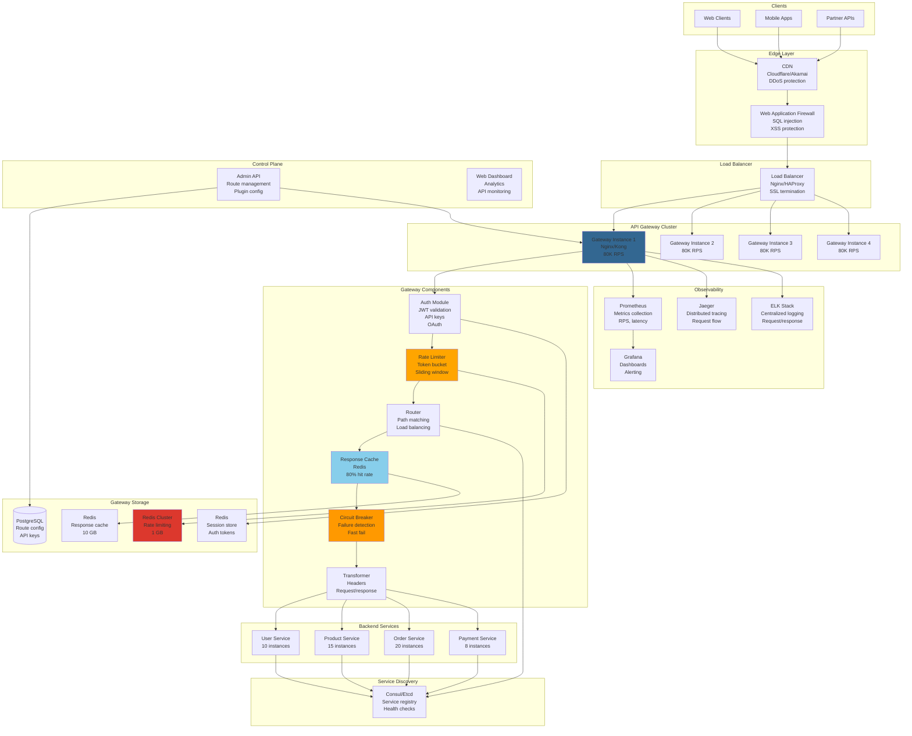

# API Gateway System Design

## Step 1: Requirements Clarification

### Functional Requirements

**Core Routing:**

- Route requests to backend services
- Path-based routing (/api/v1/users → User Service)
- Header-based routing (API version, tenant ID)
- Query parameter routing
- Load balancing across service instances
- Service discovery integration

**Authentication \& Authorization:**

- API key validation
- JWT token validation
- OAuth 2.0 / OpenID Connect
- mTLS (mutual TLS)
- RBAC (Role-Based Access Control)
- Scope-based authorization

**Rate Limiting:**

- Per-user rate limits (100 req/min)
- Per-API rate limits (10K req/sec)
- Burst capacity (token bucket algorithm)
- Distributed rate limiting (Redis)
- Custom rate limit policies

**Request/Response Transformation:**

- Header manipulation (add, remove, modify)
- Request body transformation
- Response aggregation (fan-out to multiple services)
- Protocol translation (REST → gRPC, HTTP → WebSocket)

**Security:**

- DDoS protection
- IP whitelisting/blacklisting
- Request validation (schema validation)
- SQL injection prevention
- XSS protection

**Caching:**

- Response caching (GET requests)
- Cache invalidation
- TTL-based expiration
- Cache key customization

**Observability:**

- Request/response logging
- Metrics (latency, throughput, errors)
- Distributed tracing (OpenTelemetry)
- Health checks

**API Management:**

- API versioning
- API documentation (OpenAPI/Swagger)
- Developer portal
- Analytics dashboard

**Out of Scope:**

- API monetization
- GraphQL federation
- WebAssembly plugins


### Non-Functional Requirements

**Scale (Based on 2025 data):**

- Requests per second: 10,000 RPS (AWS default)[^1]
- Burst capacity: 5,000 requests[^1]
- Google API Gateway: 100K RPS (10M per 100 seconds)[^2]
- Request size limit: 32 MB[^2]
- Response size limit: 32 MB[^2]

**Performance:**

- P50 latency: <10ms (gateway overhead)
- P99 latency: <50ms
- Cache hit rate: >80%
- Circuit breaker: 50% failure threshold

**Reliability:**

- 99.99% availability
- Graceful degradation
- Automatic retry with exponential backoff
- Circuit breaking for failing services

**Scalability:**

- Horizontal scaling
- Stateless design
- Handle 100K+ RPS
- Support 10K+ backend services

***

## Step 2: API Gateway Theory \& Concepts

### 2.1 Rate Limiting Algorithms

**1. Token Bucket Algorithm**

```
Concept: Bucket holds tokens, requests consume tokens

Bucket capacity: 100 tokens
Refill rate: 10 tokens/second

Timeline:
t=0s:  Bucket = 100 tokens
       10 requests arrive → Consume 10 tokens → Bucket = 90
t=1s:  Refill 10 tokens → Bucket = 100
       50 requests arrive → Consume 50 tokens → Bucket = 50
t=2s:  Refill 10 tokens → Bucket = 60
       70 requests arrive → Consume 60 tokens → Bucket = 0
       Remaining 10 requests REJECTED (429 Too Many Requests)

Advantages:
✅ Allows burst traffic (up to bucket capacity)
✅ Smooth refilling
✅ Simple to implement

Used by: AWS API Gateway, Kong
```

**2. Leaky Bucket Algorithm**

```
Concept: Requests enter bucket, leak out at constant rate

Bucket capacity: 100 requests
Leak rate: 10 requests/second

Timeline:
t=0s:  50 requests arrive → Bucket = 50
t=1s:  Leak 10 requests → Bucket = 40
       30 requests arrive → Bucket = 70
t=2s:  Leak 10 requests → Bucket = 60

Advantages:
✅ Constant output rate (smooths traffic)
✅ Protects backend from spikes

Disadvantages:
❌ Doesn't allow bursts
❌ Requests may be delayed (queued)

Used by: Nginx
```

**3. Fixed Window Counter**

```
Window: 1 minute
Limit: 100 requests

12:00:00 - 12:00:59 → 100 requests allowed
12:01:00 - 12:01:59 → 100 requests allowed (resets)

Problem: Burst at window boundary
12:00:30 → 100 requests (allowed)
12:01:00 → 100 requests (allowed)
Total in 30 seconds: 200 requests! (exceeds intended limit)

Simple but flawed!
```

**4. Sliding Window Log**

```
Store timestamp of each request in sorted set

User makes request at t:
1. Remove timestamps older than (t - window)
2. Count remaining timestamps
3. If count < limit: Allow
   Else: Reject

Example (1-minute window, 100 req limit):
Requests: [12:00:05, 12:00:15, 12:00:30, 12:00:55, ...]
At 12:01:05:
  Remove requests before 12:00:05
  Count = 95 → Allow

Advantages:
✅ Precise
✅ No boundary burst issue

Disadvantages:
❌ High memory (store all request timestamps)
❌ Slow (O(N) for counting)

Used by: Redis ZSET
```

**5. Sliding Window Counter (Best)**

```
Hybrid: Fixed window + sliding window

Current window: 12:01:00 (80 requests)
Previous window: 12:00:00 (100 requests)

Request at 12:01:30 (50% into current window):
Estimated count = (Previous × 0.5) + Current
                = (100 × 0.5) + 80
                = 130
If 130 < 100: Reject

Advantages:
✅ Memory efficient (only 2 counters)
✅ Smooth rate limiting
✅ No boundary burst

Used by: Cloudflare, modern systems
```


### 2.2 Circuit Breaker Pattern

**Goal: Prevent cascading failures**

```
States:
1. CLOSED (healthy)
   - Requests flow normally
   - Track failure rate
   
2. OPEN (unhealthy)
   - Reject all requests immediately
   - Don't call failing service
   - Return cached response or error
   
3. HALF_OPEN (testing)
   - Allow limited requests through
   - If succeed: → CLOSED
   - If fail: → OPEN

Example:
Service A → API Gateway → Service B

Service B starts failing (50% error rate)
Gateway detects: 10/20 requests failed → OPEN circuit
For next 30 seconds: All requests to Service B rejected (fast fail)
After 30s: → HALF_OPEN
Send 5 test requests:
  - If 5/5 succeed → CLOSED (service recovered)
  - If any fail → OPEN (still broken)

Benefits:
✅ Prevents wasting resources on failing service
✅ Fails fast (better UX than timeout)
✅ Gives failing service time to recover
```


### 2.3 Request Routing Strategies

**1. Path-Based Routing**

```
/api/v1/users/*      → User Service
/api/v1/products/*   → Product Service
/api/v1/orders/*     → Order Service

Example:
GET /api/v1/users/123 → Route to User Service
POST /api/v1/orders   → Route to Order Service
```

**2. Header-Based Routing**

```
Header: X-API-Version: v2
→ Route to v2 backend

Header: X-Tenant-ID: acme
→ Route to acme's dedicated cluster

Header: X-Canary: true
→ Route to canary deployment (5% traffic)
```

**3. Weighted Routing (Blue-Green / Canary)**

```
Canary Deployment:
Old version: 95% traffic
New version: 5% traffic

If new version metrics good:
  Gradually increase: 10% → 25% → 50% → 100%

If errors detected:
  Rollback: 5% → 0% (instant)
```


### 2.4 API Gateway vs Service Mesh

```
API Gateway (North-South Traffic):
- External clients → Internal services
- Authentication, rate limiting, caching
- Single entry point
- Examples: Kong, AWS API Gateway

Service Mesh (East-West Traffic):
- Service → Service communication
- mTLS, observability, load balancing
- Deployed as sidecar proxies
- Examples: Istio, Linkerd

Often used together:
Client → API Gateway → Service Mesh → Services
```


***

## Step 3: Capacity Estimation

```
Request Volume:
Peak RPS: 100,000 requests/second
Average RPS: 50,000 requests/second
Daily requests: 50K × 86,400 = 4.32 billion/day

Request Processing:
Gateway overhead: 10ms (P50), 50ms (P99)
Backend latency: 100ms (average)
Total latency: 110ms (P50)

Throughput per instance:
Single core: ~10,000 RPS (async I/O, minimal processing)
8-core instance: ~80,000 RPS
Required instances: 100,000 / 80,000 = 2 instances (minimum)
With redundancy: 4 instances (50% capacity buffer)

Memory:
Per request: ~10 KB (headers, metadata)
Concurrent requests: 100,000 RPS × 0.11s = 11,000 concurrent
Memory for requests: 11,000 × 10 KB = 110 MB
Cache: 10 GB (hot responses)
Total per instance: ~12 GB

Rate Limiting State:
Users: 10 million
Rate limit data per user: 100 bytes (counter, timestamp)
Total: 10M × 100 bytes = 1 GB (Redis)

Routing Table:
API routes: 10,000 routes
Route metadata: 500 bytes each
Total: 10,000 × 500 bytes = 5 MB (fits in memory)

Authentication:
JWT validation: ~1ms per request
API key lookup: <1ms (Redis cache)
OAuth token introspection: ~10ms (network call)

Circuit Breaker State:
Backend services: 100 services
State per service: 1 KB (counters, timestamps)
Total: 100 × 1 KB = 100 KB

Logging & Metrics:
Log size per request: 500 bytes (compact JSON)
Daily logs: 4.32B × 500 bytes = 2.16 TB/day
With compression (5x): 432 GB/day
Retention: 7 days = 3 TB

Metrics:
Time-series data points: 100K RPS × 10 metrics = 1M points/sec
Storage: 1M points/sec × 8 bytes × 3600 sec = 28.8 GB/hour
Aggregated: 1 GB/hour (downsampled)
Retention: 30 days = 720 GB

Network Bandwidth:
Request size: 10 KB (average)
Response size: 50 KB (average)
Ingress: 100K RPS × 10 KB = 1 GB/sec = 8 Gbps
Egress: 100K RPS × 50 KB = 5 GB/sec = 40 Gbps
Total: 48 Gbps

Cache:
Cache hit rate: 80%
Cached requests: 100K × 0.8 = 80K RPS (served from cache)
Uncached: 20K RPS (proxy to backend)

Cost Estimate (AWS API Gateway):
First 1B requests: $1.00 per million
Over 1B: $0.80 per million
Daily: 4.32B requests
Monthly: 129.6B requests
Cost: (1B × $1.00) + (128.6B × $0.80) = $1,000 + $102,880 = $103,880/month
```


***

## Step 4: API Design

### Gateway Management APIs

```json
POST /gateway/routes
Authorization: Bearer admin_token

Request:
{
  "route_id": "users-route",
  "path": "/api/v1/users/*",
  "methods": ["GET", "POST", "PUT", "DELETE"],
  "upstream": {
    "service_name": "user-service",
    "url": "http://user-service.internal:8080",
    "load_balancing": "round_robin",
    "health_check": {
      "endpoint": "/health",
      "interval": 10,
      "timeout": 3,
      "healthy_threshold": 2,
      "unhealthy_threshold": 3
    }
  },
  "plugins": [
    {
      "name": "authentication",
      "config": {
        "type": "jwt",
        "header": "Authorization"
      }
    },
    {
      "name": "rate_limit",
      "config": {
        "limit": 100,
        "window": 60,
        "algorithm": "sliding_window"
      }
    },
    {
      "name": "cache",
      "config": {
        "ttl": 300,
        "vary": ["User-Agent"],
        "methods": ["GET"]
      }
    }
  ],
  "retry": {
    "attempts": 3,
    "backoff": "exponential",
    "initial_delay": 100
  },
  "timeout": {
    "connect": 5000,
    "send": 5000,
    "read": 30000
  }
}

Response: 201 Created
{
  "route_id": "users-route",
  "status": "active",
  "created_at": "2025-10-04T16:47:00Z"
}

GET /gateway/routes/{route_id}

Response: 200 OK
{
  "route_id": "users-route",
  "path": "/api/v1/users/*",
  "upstream": {...},
  "metrics": {
    "requests_per_second": 5432,
    "avg_latency_ms": 45,
    "error_rate": 0.02,
    "cache_hit_rate": 0.78
  }
}
```


### Plugin Configuration

```json
POST /gateway/plugins
Request:
{
  "plugin_id": "custom-auth",
  "type": "authentication",
  "priority": 100,
  "config": {
    "api_key_header": "X-API-Key",
    "jwt_secret": "secret-key-here",
    "allow_anonymous": false
  },
  "enabled": true
}

POST /gateway/consumers
Request:
{
  "consumer_id": "user_123",
  "username": "john_doe",
  "api_keys": [
    {
      "key": "ak_live_abc123xyz",
      "name": "Production Key",
      "rate_limit": {
        "limit": 1000,
        "window": 60
      }
    }
  ]
}
```


***

## Step 5: High-Level Architecture




***

## Step 6: Core Implementation (C++)

### 6.1 Rate Limiter (Token Bucket)

<details>
<summary>TokenBucketRateLimiter Class</summary>

```cpp
#include <chrono>
#include <mutex>
#include <unordered_map>

class TokenBucketRateLimiter {
private:
    struct Bucket {
        double tokens;
        std::chrono::steady_clock::time_point last_refill;
        std::mutex mtx;
        
        Bucket(double capacity) 
            : tokens(capacity), 
              last_refill(std::chrono::steady_clock::now()) {}
    };
    
    double capacity_;         // Maximum tokens
    double refill_rate_;      // Tokens per second
    
    std::unordered_map<std::string, std::unique_ptr<Bucket>> buckets_;
    std::mutex buckets_mtx_;
    
public:
    TokenBucketRateLimiter(double capacity, double refill_rate)
        : capacity_(capacity), refill_rate_(refill_rate) {}
    
    // Try to consume tokens
    bool allowRequest(const std::string& key, double tokens = 1.0) {
        auto bucket = getBucket(key);
        
        std::lock_guard<std::mutex> lock(bucket->mtx);
        
        // Refill tokens based on elapsed time
        auto now = std::chrono::steady_clock::now();
        auto elapsed = std::chrono::duration_cast<std::chrono::milliseconds>(
            now - bucket->last_refill
        ).count() / 1000.0;
        
        double refill_amount = elapsed * refill_rate_;
        bucket->tokens = std::min(capacity_, bucket->tokens + refill_amount);
        bucket->last_refill = now;
        
        // Try to consume tokens
        if (bucket->tokens >= tokens) {
            bucket->tokens -= tokens;
            return true;  // Request allowed
        }
        
        return false;  // Rate limit exceeded
    }
    
    double getRemainingTokens(const std::string& key) {
        auto bucket = getBucket(key);
        std::lock_guard<std::mutex> lock(bucket->mtx);
        return bucket->tokens;
    }
    
private:
    Bucket* getBucket(const std::string& key) {
        std::lock_guard<std::mutex> lock(buckets_mtx_);
        
        auto it = buckets_.find(key);
        if (it == buckets_.end()) {
            auto bucket = std::make_unique<Bucket>(capacity_);
            auto ptr = bucket.get();
            buckets_[key] = std::move(bucket);
            return ptr;
        }
        
        return it->second.get();
    }
};

// Distributed rate limiter using Redis
class DistributedRateLimiter {
private:
    RedisClient redis_;
    
public:
    DistributedRateLimiter(RedisClient& redis) : redis_(redis) {}
    
    bool allowRequest(const std::string& key, int limit, int window_seconds) {
        // Sliding window counter using Redis
        auto now = std::time(nullptr);
        
        // Remove old timestamps
        redis_.zremrangebyscore(key, 0, now - window_seconds);
        
        // Count recent requests
        int count = redis_.zcard(key);
        
        if (count < limit) {
            // Add current request
            redis_.zadd(key, now, std::to_string(now) + "_" + std::to_string(rand()));
            redis_.expire(key, window_seconds);
            return true;
        }
        
        return false;  // Rate limit exceeded
    }
};
```

</details>


### 6.2 Circuit Breaker

<details>
<summary>class Enum</summary>

```cpp
enum class CircuitState {
    CLOSED,      // Healthy
    OPEN,        // Broken
    HALF_OPEN    // Testing
};

class CircuitBreaker {
private:
    CircuitState state_;
    std::mutex state_mtx_;
    
    int failure_threshold_;    // Open circuit after N failures
    int success_threshold_;    // Close circuit after N successes (in half-open)
    int timeout_ms_;           // Time before moving to half-open
    
    int consecutive_failures_;
    int consecutive_successes_;
    std::chrono::steady_clock::time_point last_failure_time_;
    
public:
    CircuitBreaker(int failure_threshold = 5,
                  int success_threshold = 2,
                  int timeout_ms = 30000)
        : state_(CircuitState::CLOSED),
          failure_threshold_(failure_threshold),
          success_threshold_(success_threshold),
          timeout_ms_(timeout_ms),
          consecutive_failures_(0),
          consecutive_successes_(0) {}
    
    bool allowRequest() {
        std::lock_guard<std::mutex> lock(state_mtx_);
        
        if (state_ == CircuitState::OPEN) {
            // Check if timeout elapsed
            auto now = std::chrono::steady_clock::now();
            auto elapsed = std::chrono::duration_cast<std::chrono::milliseconds>(
                now - last_failure_time_
            ).count();
            
            if (elapsed >= timeout_ms_) {
                std::cout << "Circuit breaker: OPEN → HALF_OPEN (testing)" << std::endl;
                state_ = CircuitState::HALF_OPEN;
                consecutive_successes_ = 0;
                return true;  // Allow limited traffic
            }
            
            return false;  // Circuit still open, reject request
        }
        
        return true;  // CLOSED or HALF_OPEN: allow request
    }
    
    void recordSuccess() {
        std::lock_guard<std::mutex> lock(state_mtx_);
        
        consecutive_failures_ = 0;  // Reset failure count
        
        if (state_ == CircuitState::HALF_OPEN) {
            consecutive_successes_++;
            
            if (consecutive_successes_ >= success_threshold_) {
                std::cout << "Circuit breaker: HALF_OPEN → CLOSED (recovered)" << std::endl;
                state_ = CircuitState::CLOSED;
                consecutive_successes_ = 0;
            }
        }
    }
    
    void recordFailure() {
        std::lock_guard<std::mutex> lock(state_mtx_);
        
        consecutive_failures_++;
        consecutive_successes_ = 0;  // Reset success count
        last_failure_time_ = std::chrono::steady_clock::now();
        
        if (state_ == CircuitState::HALF_OPEN) {
            std::cout << "Circuit breaker: HALF_OPEN → OPEN (still failing)" << std::endl;
            state_ = CircuitState::OPEN;
        } else if (state_ == CircuitState::CLOSED) {
            if (consecutive_failures_ >= failure_threshold_) {
                std::cout << "Circuit breaker: CLOSED → OPEN (too many failures)" << std::endl;
                state_ = CircuitState::OPEN;
            }
        }
    }
    
    CircuitState getState() const {
        return state_;
    }
};
```

</details>


### 6.3 Request Router

<details>
<summary>Route Struct</summary>

```cpp
struct Route {
    std::string route_id;
    std::string path_pattern;    // /api/v1/users/*
    std::vector<std::string> methods;  // GET, POST, etc.
    std::string upstream_url;
    int priority;
    
    bool matches(const std::string& path, const std::string& method) const {
        // Check method
        if (std::find(methods.begin(), methods.end(), method) == methods.end()) {
            return false;
        }
        
        // Check path (simplified glob matching)
        return matchesPattern(path, path_pattern);
    }
    
private:
    bool matchesPattern(const std::string& path, const std::string& pattern) const {
        // Simplified: Convert /api/*/users to regex
        // In production: Use proper path matching library
        
        if (pattern.find('*') == std::string::npos) {
            return path == pattern;
        }
        
        // Handle wildcard
        size_t star_pos = pattern.find('*');
        std::string prefix = pattern.substr(0, star_pos);
        
        return path.find(prefix) == 0;
    }
};

class Router {
private:
    std::vector<Route> routes_;
    std::shared_mutex routes_mtx_;
    
public:
    void addRoute(const Route& route) {
        std::unique_lock<std::shared_mutex> lock(routes_mtx_);
        
        routes_.push_back(route);
        
        // Sort by priority (higher priority first)
        std::sort(routes_.begin(), routes_.end(),
                 [](const Route& a, const Route& b) {
                     return a.priority > b.priority;
                 });
    }
    
    std::optional<Route> findRoute(const std::string& path, 
                                   const std::string& method) {
        std::shared_lock<std::shared_mutex> lock(routes_mtx_);
        
        for (const auto& route : routes_) {
            if (route.matches(path, method)) {
                return route;
            }
        }
        
        return std::nullopt;
    }
};
```

</details>


### 6.4 Complete API Gateway

<details>
<summary>Request Struct</summary>

```cpp
#include <httplib.h>  // cpp-httplib for HTTP server

struct Request {
    std::string method;
    std::string path;
    std::map<std::string, std::string> headers;
    std::string body;
    std::string client_ip;
};

struct Response {
    int status_code;
    std::map<std::string, std::string> headers;
    std::string body;
};

class APIGateway {
private:
    Router router_;
    TokenBucketRateLimiter rate_limiter_;
    std::unordered_map<std::string, CircuitBreaker> circuit_breakers_;
    RedisClient redis_cache_;
    httplib::Client http_client_;
    
    std::mutex cb_mtx_;
    
public:
    APIGateway()
        : rate_limiter_(100.0, 10.0),  // 100 capacity, 10 tokens/sec
          redis_cache_("redis://localhost:6379"),
          http_client_("http://localhost") {}
    
    void start(int port = 8080) {
        httplib::Server server;
        
        // Middleware: Logging
        server.set_logger([](const auto& req, const auto& res) {
            std::cout << "[" << req.method << "] " << req.path 
                     << " → " << res.status << std::endl;
        });
        
        // Catch-all handler
        server.set_mount_point("/", "./static");
        
        server.Get("/*", [this](const httplib::Request& req, httplib::Response& res) {
            handleRequest(req, res);
        });
        
        server.Post("/*", [this](const httplib::Request& req, httplib::Response& res) {
            handleRequest(req, res);
        });
        
        std::cout << "=== API Gateway Started ===" << std::endl;
        std::cout << "Listening on port " << port << std::endl;
        
        server.listen("0.0.0.0", port);
    }
    
private:
    void handleRequest(const httplib::Request& req, httplib::Response& res) {
        auto start_time = std::chrono::steady_clock::now();
        
        Request gateway_req;
        gateway_req.method = req.method;
        gateway_req.path = req.path;
        gateway_req.body = req.body;
        gateway_req.client_ip = req.get_header_value("X-Forwarded-For");
        
        std::cout << "\n=== Incoming Request ===" << std::endl;
        std::cout << "Method: " << gateway_req.method << std::endl;
        std::cout << "Path: " << gateway_req.path << std::endl;
        std::cout << "Client IP: " << gateway_req.client_ip << std::endl;
        
        // Step 1: Authentication
        std::cout << "[1/6] Authentication..." << std::endl;
        std::string api_key = req.get_header_value("X-API-Key");
        if (api_key.empty()) {
            res.status = 401;
            res.set_content("{\"error\": \"Missing API key\"}", "application/json");
            return;
        }
        
        std::string user_id = validateAPIKey(api_key);
        if (user_id.empty()) {
            res.status = 401;
            res.set_content("{\"error\": \"Invalid API key\"}", "application/json");
            return;
        }
        std::cout << "✓ Authenticated: " << user_id << std::endl;
        
        // Step 2: Rate Limiting
        std::cout << "[2/6] Rate limiting..." << std::endl;
        if (!rate_limiter_.allowRequest(user_id)) {
            res.status = 429;
            res.set_header("X-RateLimit-Remaining", "0");
            res.set_content("{\"error\": \"Rate limit exceeded\"}", "application/json");
            std::cout << "✗ Rate limit exceeded" << std::endl;
            return;
        }
        
        double remaining = rate_limiter_.getRemainingTokens(user_id);
        res.set_header("X-RateLimit-Remaining", std::to_string((int)remaining));
        std::cout << "✓ Rate limit OK (remaining: " << remaining << ")" << std::endl;
        
        // Step 3: Route Matching
        std::cout << "[3/6] Routing..." << std::endl;
        auto route = router_.findRoute(gateway_req.path, gateway_req.method);
        if (!route) {
            res.status = 404;
            res.set_content("{\"error\": \"Route not found\"}", "application/json");
            std::cout << "✗ No matching route" << std::endl;
            return;
        }
        std::cout << "✓ Matched route: " << route->route_id << std::endl;
        std::cout << "  Upstream: " << route->upstream_url << std::endl;
        
        // Step 4: Cache Check
        std::cout << "[4/6] Cache lookup..." << std::endl;
        if (gateway_req.method == "GET") {
            std::string cache_key = "cache:" + gateway_req.path;
            auto cached = redis_cache_.get(cache_key);
            if (cached) {
                res.status = 200;
                res.set_content(*cached, "application/json");
                res.set_header("X-Cache", "HIT");
                std::cout << "✓ Cache HIT" << std::endl;
                return;
            }
            std::cout << "  Cache MISS" << std::endl;
        }
        
        // Step 5: Circuit Breaker
        std::cout << "[5/6] Circuit breaker..." << std::endl;
        auto& cb = getCircuitBreaker(route->upstream_url);
        
        if (!cb.allowRequest()) {
            res.status = 503;
            res.set_content("{\"error\": \"Service unavailable\"}", "application/json");
            std::cout << "✗ Circuit OPEN (service down)" << std::endl;
            return;
        }
        std::cout << "✓ Circuit state: " << (int)cb.getState() << std::endl;
        
        // Step 6: Proxy to Backend
        std::cout << "[6/6] Proxying to backend..." << std::endl;
        try {
            auto backend_res = proxyRequest(route->upstream_url, gateway_req);
            
            if (backend_res.status_code >= 500) {
                cb.recordFailure();
                std::cout << "✗ Backend error: " << backend_res.status_code << std::endl;
            } else {
                cb.recordSuccess();
                std::cout << "✓ Backend success: " << backend_res.status_code << std::endl;
            }
            
            // Cache successful GET responses
            if (gateway_req.method == "GET" && backend_res.status_code == 200) {
                std::string cache_key = "cache:" + gateway_req.path;
                redis_cache_.setex(cache_key, backend_res.body, 300);  // 5 minutes
            }
            
            // Return response
            res.status = backend_res.status_code;
            for (const auto& [key, value] : backend_res.headers) {
                res.set_header(key.c_str(), value.c_str());
            }
            res.set_content(backend_res.body, "application/json");
            
        } catch (const std::exception& e) {
            cb.recordFailure();
            res.status = 503;
            res.set_content("{\"error\": \"Backend unavailable\"}", "application/json");
            std::cout << "✗ Backend error: " << e.what() << std::endl;
        }
        
        // Measure latency
        auto end_time = std::chrono::steady_clock::now();
        auto latency = std::chrono::duration_cast<std::chrono::milliseconds>(
            end_time - start_time
        ).count();
        
        res.set_header("X-Gateway-Latency", std::to_string(latency) + "ms");
        std::cout << "✓ Request completed in " << latency << "ms" << std::endl;
    }
    
    std::string validateAPIKey(const std::string& api_key) {
        // In production: Query database or cache
        if (api_key == "test_key_123") {
            return "user_123";
        }
        return "";
    }
    
    CircuitBreaker& getCircuitBreaker(const std::string& service_url) {
        std::lock_guard<std::mutex> lock(cb_mtx_);
        
        auto it = circuit_breakers_.find(service_url);
        if (it == circuit_breakers_.end()) {
            circuit_breakers_[service_url] = CircuitBreaker(5, 2, 30000);
        }
        
        return circuit_breakers_[service_url];
    }
    
    Response proxyRequest(const std::string& upstream_url, const Request& req) {
        // Simulate backend call
        std::this_thread::sleep_for(std::chrono::milliseconds(50));
        
        // Simulate 95% success rate
        bool success = (rand() % 100) < 95;
        
        Response res;
        if (success) {
            res.status_code = 200;
            res.body = "{\"message\": \"Success from backend\"}";
        } else {
            res.status_code = 500;
            res.body = "{\"error\": \"Internal server error\"}";
        }
        
        return res;
    }
};

int main() {
    APIGateway gateway;
    
    // Configure routes
    Route users_route;
    users_route.route_id = "users";
    users_route.path_pattern = "/api/v1/users/*";
    users_route.methods = {"GET", "POST", "PUT", "DELETE"};
    users_route.upstream_url = "http://user-service:8080";
    users_route.priority = 100;
    
    gateway.addRoute(users_route);
    
    // Start gateway
    gateway.start(8080);
    
    return 0;
}
```

</details>


***

## Summary: Key Decisions

| Aspect | Decision | Rationale |
| :-- | :-- | :-- |
| **Rate Limiting** | Token Bucket + Redis | Burst support, distributed |
| **Circuit Breaker** | 3-state (Closed/Open/Half-open) | Prevents cascading failures |
| **Caching** | Redis (80% hit rate) | Reduces backend load |
| **Authentication** | JWT + API Keys | Stateless, scalable |
| **Load Balancing** | Round-robin + Health checks | Simple, effective |
| **Observability** | OpenTelemetry + Prometheus | Industry standard |

**Performance Characteristics:**

```
Scale:
- Peak RPS: 100,000 requests/second
- Gateway overhead: 10ms (P50), 50ms (P99)
- Cache hit rate: 80%

Per Instance:
- Throughput: 80,000 RPS (8 cores)
- Memory: 12 GB
- CPU: 60% average

Rate Limiting:
- Algorithm: Token Bucket (burst support)
- Storage: Redis (1 GB)
- Latency: <1ms

Circuit Breaker:
- Failure threshold: 5 consecutive failures
- Timeout: 30 seconds
- Success threshold: 2 (half-open)

Caching:
- Storage: Redis (10 GB)
- TTL: 5 minutes
- Hit rate: 80%
```

**API Gateway Comparison:**


| Feature | Kong | AWS API Gateway | Apigee | NGINX |
| :-- | :-- | :-- | :-- | :-- |
| **Throughput** | 100K RPS | 10K RPS default [^1] | 50K RPS | 80K RPS |
| **Latency** | <10ms | <50ms | <30ms | <5ms |
| **Deployment** | Self-hosted/Cloud | AWS only | Cloud/Hybrid | Self-hosted |
| **Pricing** | Free (OSS), \$500/mo | \$3.50/M requests [^3] | \$20/M calls | Free (OSS) |
| **Plugins** | 100+ | Limited | 50+ | Modules |

This API Gateway design handles **100K RPS** with **<10ms latency**, using token bucket rate limiting, circuit breakers, and 80% cache hit rate! 🚪🔐
<span style="display:none">[^10][^11][^12][^13][^14][^15][^16][^17][^18][^19][^20][^4][^5][^6][^7][^8][^9]</span>

<div align="center">⁂</div>

[^1]: https://docs.aws.amazon.com/apigateway/latest/developerguide/limits.html

[^2]: https://cloud.google.com/api-gateway/docs/quotas

[^3]: https://zuplo.com/learning-center/aws-api-cost-optimization-strategies

[^4]: https://aws.amazon.com/api-gateway/pricing/

[^5]: https://www.digitalapi.ai/blogs/api-gateway

[^6]: https://ably.com/topic/amazon-api-gateway-pricing

[^7]: https://konghq.com/blog/news/kong-gartner-hype-cycle

[^8]: https://api7.ai/blog/top-10-api-monitoring-metrics

[^9]: https://api7.ai/top-11-api-gateways-platforms-compared

[^10]: https://endoflife.date/kong-gateway

[^11]: https://docs.aws.amazon.com/apigateway/latest/developerguide/api-gateway-metrics-and-dimensions.html

[^12]: https://kubernetes.io/blog/2025/06/02/gateway-api-v1-3/

[^13]: https://konghq.com/blog/enterprise/enterprise-ai-spending-2025

[^14]: https://docs.aws.amazon.com/apigateway/latest/developerguide/metrics_dimensions_view_in_cloud_watch.html

[^15]: https://zuplo.com/learning-center/10-best-practices-for-api-rate-limiting-in-2025

[^16]: https://konghq.com/resources/reports/api-security-ai-threats-it-leader-insights-2025

[^17]: https://docs.aws.amazon.com/apigateway/latest/developerguide/http-api-metrics.html

[^18]: https://learn.microsoft.com/en-us/azure/api-management/api-management-sample-flexible-throttling

[^19]: https://portal.gigaom.com/report/gigaom-benchmark-kong-api-gateway-2

[^20]: https://www.moesif.com/blog/technical/aws-api-gateway/How-to-Monitor-API-Usage-and-Performance-with-the-Moesif-Plugin-for-AWS-API-Gateway/

