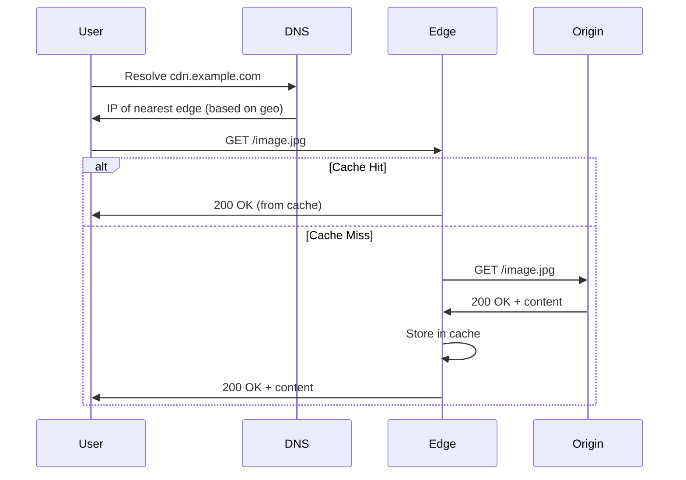
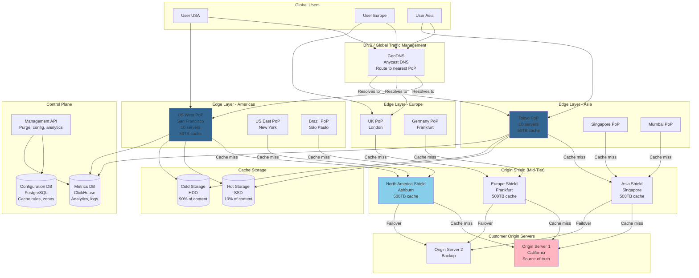

# Content Delivery Network (CDN)

## Step 1: Requirements Clarification

### Functional Requirements

**Core CDN Features:**

- Serve static content (images, videos, CSS, JS, HTML)
- Geographically distributed edge servers
- Automatic content caching
- Cache invalidation (purge)
- Origin pull (fetch from origin on cache miss)
- Support for dynamic content acceleration
- SSL/TLS termination at edge
- HTTP/HTTPS support with HTTP/2, HTTP/3

**Advanced Features:**

- Origin shield (reduce origin load)
- Streaming (live and on-demand video)
- Image optimization (resize, format conversion)
- Edge computing (run code at edge)
- DDoS protection
- Bot detection
- Web Application Firewall (WAF)

**Content Management:**

- Push (upload directly to CDN)
- Pull (CDN fetches from origin)
- Selective purging (by URL, tag, wildcard)
- Cache TTL configuration
- Custom cache rules

**Out of Scope:**

- DNS management (assume external DNS)
- Payment processing
- Content creation tools


### Non-Functional Requirements

**Scale:**

- 1 billion requests per day
- 10 PB of content stored
- 1 million origin servers
- Serve 10M+ websites globally

**Performance:**

- Cache hit ratio: >90%
- Response time: <50ms (cache hit, P95)
- Time to first byte (TTFB): <100ms globally
- Throughput: 100 Gbps per PoP (Point of Presence)

**Availability:**

- 99.99% uptime
- No single point of failure
- Automatic failover (<1 second)
- Origin offline → Serve stale content

**Geographic Distribution:**

- 200+ PoPs (Points of Presence) globally
- Coverage in 100+ countries
- Latency <50ms to 95% of global users

***

## Step 2: CDN Theory \& Concepts

### 2.1 Why CDN is Needed

**Problem Without CDN:**

```
User in Tokyo → Request → Origin Server in California

Round-trip time (RTT):
- Tokyo to California: ~150ms
- TCP handshake: 3 RTTs = 450ms
- TLS handshake: 2 RTTs = 300ms
- HTTP request/response: 1 RTT = 150ms
Total: 900ms just for connection setup!

Plus:
- Network congestion
- Origin server overload
- Bandwidth costs
- Single point of failure
```

**Solution: CDN**

```
User in Tokyo → Nearest Edge Server (Tokyo PoP) → 5ms
Edge server has cached content
Total: 5ms! (180x faster)
```


### 2.2 How CDN Works

**Basic Flow:**

```
1. User requests https://example.com/image.jpg
2. DNS resolves to nearest edge server IP (Anycast or GeoDNS)
3. Edge server receives request
4. Edge checks cache:
   a. HIT: Return cached content (fast!)
   b. MISS: Fetch from origin, cache it, return to user
5. Subsequent requests served from cache
```

**Detailed Request Flow:**




### 2.3 CDN Architecture Layers

```
┌─────────────────────────────────────────────┐
│         Users (Global)                      │
└─────────────────┬───────────────────────────┘
                  │
┌─────────────────▼───────────────────────────┐
│  Edge Layer (200+ PoPs)                     │
│  - Cache content                            │
│  - Serve 95% of requests                    │
│  - 10-50 servers per PoP                    │
└─────────────────┬───────────────────────────┘
                  │ (Cache miss)
┌─────────────────▼───────────────────────────┐
│  Mid-Tier / Origin Shield (10-20 locations)│
│  - Reduce origin load                       │
│  - Coalesce requests                        │
│  - Larger cache                             │
└─────────────────┬───────────────────────────┘
                  │ (Cache miss)
┌─────────────────▼───────────────────────────┐
│  Origin Servers (Customer's servers)        │
│  - Source of truth                          │
│  - Generate dynamic content                 │
└─────────────────────────────────────────────┘
```


### 2.4 Caching Strategies

**Cache-Control Headers:**

```http
Cache-Control: public, max-age=3600
- public: Can be cached by CDN
- max-age=3600: Cache for 1 hour

Cache-Control: private, no-cache
- private: Only browser cache, not CDN
- no-cache: Must revalidate with origin

Cache-Control: no-store
- Do not cache at all
```

**Conditional Requests:**

```http
Request:
GET /image.jpg
If-None-Match: "abc123"  (ETag)
If-Modified-Since: Mon, 01 Oct 2025 12:00:00 GMT

Response (Not Modified):
304 Not Modified
(No body, saves bandwidth)

Response (Modified):
200 OK
ETag: "def456"
Last-Modified: Tue, 02 Oct 2025 12:00:00 GMT
(Full body)
```


***

## Step 3: Capacity Estimation

```
Global Scale:
Requests per day: 1 billion
Requests per second: 1B / 86,400 = 11,574 RPS (average)
Peak (5x): 58,000 RPS

Geographic Distribution:
PoPs: 200 locations
Requests per PoP: 58,000 / 200 = 290 RPS per PoP (peak)

Content Distribution:
Total content: 10 PB
Average file size: 500 KB
Total files: 10 PB / 500 KB = 20 billion files

Cache Storage per PoP:
Hot content (20% of files, 80% of requests): 20B × 0.2 = 4B files
Storage needed: 4B × 500 KB = 2 PB
Per PoP: 2 PB / 200 = 10 TB

Bandwidth:
Average response size: 500 KB
Total bandwidth: 11,574 RPS × 500 KB = 5.79 GB/sec
Peak bandwidth: 5.79 GB/sec × 5 = 29 GB/sec
Per PoP: 29 GB/sec / 200 = 145 MB/sec

Cache Hit Ratio:
Target: 95% cache hit ratio
Misses: 58,000 RPS × 0.05 = 2,900 RPS go to origin
Origin load: 2,900 RPS × 500 KB = 1.45 GB/sec

Memory (RAM) for Hot Cache:
Cache index: 4B files × 256 bytes (metadata) = 1 TB
Per PoP: 1 TB / 200 = 5 GB for index
Hot content in RAM: 1% of 10 TB = 100 GB
Total RAM per PoP: ~110 GB

Servers per PoP:
Each server: 10 Gbps NIC
Bandwidth needed: 145 MB/sec × 8 = 1.16 Gbps
Servers needed: 1.16 Gbps / 10 Gbps = 1 server (with headroom: 5 servers)
Storage per server: 10 TB / 5 = 2 TB per server

Network Latency:
User to nearest PoP: <50ms (95th percentile)
Cache hit: 50ms + 5ms processing = 55ms
Cache miss: 50ms + 100ms (origin RTT) + 5ms = 155ms

DNS Resolution:
GeoDNS queries: 11,574 QPS (one per unique IP)
DNS TTL: 60 seconds (balance between failover speed and DNS load)

Origin Shield (Mid-Tier):
Locations: 10 regional shields
Shield cache: 1 PB (larger than edge)
Reduces origin load by 90%
Origin requests: 2,900 RPS × 0.1 = 290 RPS (manageable)
```


***

## Step 4: API Design

### User-Facing APIs

```http
GET https://cdn.example.com/path/to/file.jpg
Host: cdn.example.com
Accept: image/*
Accept-Encoding: gzip, br
If-None-Match: "abc123"

Response: 200 OK
Content-Type: image/jpeg
Content-Length: 512000
Cache-Control: public, max-age=3600
ETag: "abc123"
Age: 300  (300 seconds since cached)
X-Cache: HIT  (served from cache)
X-Cache-Node: edge-tokyo-01
```


### Control Plane APIs (CDN Management)

**Purge Cache:**

```json
POST /v1/purge
Authorization: Bearer <api_key>

Request:
{
  "purge_type": "url",  // url, tag, wildcard, all
  "urls": [
    "https://cdn.example.com/image.jpg",
    "https://cdn.example.com/video.mp4"
  ],
  "soft": false  // true = mark stale, false = delete
}

Response: 202 Accepted
{
  "purge_id": "purge_abc123",
  "status": "in_progress",
  "estimated_time_sec": 30
}

GET /v1/purge/{purge_id}
Response: 200 OK
{
  "purge_id": "purge_abc123",
  "status": "completed",
  "purged_objects": 2,
  "purged_bytes": 5242880
}
```

**Cache Configuration:**

```json
POST /v1/zones/{zone_id}/cache-rules
Request:
{
  "rule_name": "Cache images for 1 day",
  "match": {
    "path": "*.jpg|*.png",
    "origin_status": [200, 206]
  },
  "action": {
    "cache_level": "aggressive",
    "cache_ttl": 86400,
    "browser_ttl": 3600,
    "respect_origin_headers": false
  }
}
```

**Analytics:**

```json
GET /v1/analytics/bandwidth?start=2025-10-01&end=2025-10-04&granularity=1h

Response: 200 OK
{
  "data": [
    {
      "timestamp": "2025-10-04T00:00:00Z",
      "bandwidth_bytes": 1073741824,
      "requests": 5000000,
      "cache_hit_ratio": 0.95,
      "status_codes": {
        "200": 4750000,
        "304": 200000,
        "404": 50000
      }
    }
  ]
}
```


***

## Step 5: High-Level Architecture

### Architecture Diagram (Mermaid)




***

## Step 6: Deep Dive - Core Components

### 6.1 Request Routing (GeoDNS / Anycast)

**GeoDNS (Geographic DNS):**

```
User in Tokyo queries cdn.example.com

DNS Server logic:
1. Detect user's geographic location (from IP: 203.0.113.0)
2. Find nearest PoPs:
   - Tokyo PoP: 5ms
   - Singapore PoP: 80ms
   - San Francisco PoP: 150ms
3. Check health of Tokyo PoP
4. Return IP of Tokyo PoP

DNS Response:
cdn.example.com. 60 IN A 203.0.113.10  (Tokyo PoP IP)
TTL: 60 seconds (allow fast failover)
```

**Anycast Routing:**

```
All edge servers announce same IP: 203.0.113.1

User in Tokyo sends packet to 203.0.113.1
BGP routing delivers packet to nearest PoP (Tokyo)

Advantages:
✅ Automatic routing to nearest location
✅ DDoS mitigation (distributed absorption)
✅ No DNS complexity

Disadvantages:
❌ Requires BGP setup
❌ Less control than GeoDNS
```

**Implementation:**

<details>
<summary>GeoLocation Struct</summary>

```cpp
#include <string>
#include <vector>
#include <cmath>

struct GeoLocation {
    double latitude;
    double longitude;
    std::string city;
    std::string country;
};

struct PoP {
    std::string pop_id;
    GeoLocation location;
    std::string ip_address;
    bool healthy;
    int load_percentage;  // 0-100
};

class GeoDNSRouter {
private:
    std::vector<PoP> pops;
    
    // Haversine formula for distance
    double calculateDistance(const GeoLocation& loc1, const GeoLocation& loc2) {
        const double R = 6371.0;  // Earth radius in km
        
        double lat1_rad = loc1.latitude * M_PI / 180.0;
        double lat2_rad = loc2.latitude * M_PI / 180.0;
        double dlat = (loc2.latitude - loc1.latitude) * M_PI / 180.0;
        double dlon = (loc2.longitude - loc1.longitude) * M_PI / 180.0;
        
        double a = std::sin(dlat/2) * std::sin(dlat/2) +
                   std::cos(lat1_rad) * std::cos(lat2_rad) *
                   std::sin(dlon/2) * std::sin(dlon/2);
        
        double c = 2 * std::atan2(std::sqrt(a), std::sqrt(1-a));
        
        return R * c;
    }
    
public:
    void addPoP(const PoP& pop) {
        pops.push_back(pop);
    }
    
    std::string routeRequest(const GeoLocation& user_location) {
        std::vector<std::pair<double, PoP*>> candidates;
        
        // Calculate distance to all healthy PoPs
        for (auto& pop : pops) {
            if (!pop.healthy || pop.load_percentage > 90) {
                continue;  // Skip unhealthy or overloaded PoPs
            }
            
            double distance = calculateDistance(user_location, pop.location);
            candidates.push_back({distance, &pop});
        }
        
        if (candidates.empty()) {
            throw std::runtime_error("No available PoPs");
        }
        
        // Sort by distance
        std::sort(candidates.begin(), candidates.end(),
                 [](const auto& a, const auto& b) {
                     return a.first < b.first;
                 });
        
        // Return IP of nearest PoP
        return candidates[0].second->ip_address;
    }
    
    // Load balancing: Consider both distance and load
    std::string routeWithLoadBalancing(const GeoLocation& user_location) {
        std::vector<std::tuple<double, PoP*>> scored_pops;
        
        for (auto& pop : pops) {
            if (!pop.healthy) continue;
            
            double distance = calculateDistance(user_location, pop.location);
            
            // Score = distance + load penalty
            // Prefer closer PoPs, but avoid overloaded ones
            double load_penalty = pop.load_percentage * 2.0;  // 2km per 1% load
            double score = distance + load_penalty;
            
            scored_pops.push_back({score, &pop});
        }
        
        if (scored_pops.empty()) {
            throw std::runtime_error("No available PoPs");
        }
        
        // Sort by score (lower is better)
        std::sort(scored_pops.begin(), scored_pops.end(),
                 [](const auto& a, const auto& b) {
                     return std::get<0>(a) < std::get<0>(b);
                 });
        
        return std::get<1>(scored_pops[0])->ip_address;
    }
};
```

</details>


### 6.2 Edge Server Cache Implementation

**Cache Storage Hierarchy:**

```
┌─────────────────────────────────────────┐
│  L1: Memory (RAM) - 100 GB              │
│  Hot content (1% of total)              │
│  Access time: <1ms                      │
└─────────────────────────────────────────┘
              ↓ (miss)
┌─────────────────────────────────────────┐
│  L2: SSD - 1 TB                         │
│  Warm content (10% of total)            │
│  Access time: ~10ms                     │
└─────────────────────────────────────────┘
              ↓ (miss)
┌─────────────────────────────────────────┐
│  L3: HDD - 10 TB                        │
│  Cold content (90% of total)            │
│  Access time: ~50ms                     │
└─────────────────────────────────────────┘
              ↓ (miss)
        Fetch from Origin
```

**Cache Implementation:**

<details>
<summary>CacheEntry Struct</summary>

```cpp
#include <unordered_map>
#include <list>
#include <mutex>
#include <chrono>
#include <optional>

using namespace std::chrono;

struct CacheEntry {
    std::string key;
    std::vector<uint8_t> data;
    system_clock::time_point cached_at;
    system_clock::time_point expires_at;
    std::string etag;
    size_t size_bytes;
    uint64_t access_count;
    system_clock::time_point last_access;
};

// LRU Cache with TTL
class EdgeCache {
private:
    size_t max_size_bytes;
    size_t current_size_bytes = 0;
    
    // Cache storage: key -> entry
    std::unordered_map<std::string, std::list<CacheEntry>::iterator> cache_map;
    
    // LRU list (most recent at front)
    std::list<CacheEntry> lru_list;
    
    mutable std::shared_mutex mtx;
    
    // Statistics
    uint64_t hits = 0;
    uint64_t misses = 0;
    
public:
    EdgeCache(size_t max_size) : max_size_bytes(max_size) {}
    
    // Get from cache
    std::optional<std::vector<uint8_t>> get(const std::string& key) {
        std::unique_lock<std::shared_mutex> lock(mtx);
        
        auto it = cache_map.find(key);
        
        if (it == cache_map.end()) {
            misses++;
            return std::nullopt;  // Cache miss
        }
        
        auto entry_it = it->second;
        
        // Check if expired
        if (system_clock::now() > entry_it->expires_at) {
            // Expired - remove and return miss
            evict(entry_it);
            misses++;
            return std::nullopt;
        }
        
        // Cache hit - update LRU
        hits++;
        entry_it->access_count++;
        entry_it->last_access = system_clock::now();
        
        // Move to front (most recently used)
        lru_list.splice(lru_list.begin(), lru_list, entry_it);
        
        return entry_it->data;
    }
    
    // Put into cache
    void put(const std::string& key, const std::vector<uint8_t>& data,
            seconds ttl, const std::string& etag = "") {
        std::unique_lock<std::shared_mutex> lock(mtx);
        
        // Check if already exists
        auto it = cache_map.find(key);
        if (it != cache_map.end()) {
            // Update existing entry
            evict(it->second);
        }
        
        // Check if we need to evict
        size_t entry_size = data.size() + key.size() + 100;  // Data + overhead
        
        while (current_size_bytes + entry_size > max_size_bytes && !lru_list.empty()) {
            // Evict LRU entry
            evictLRU();
        }
        
        // Create new entry
        CacheEntry entry;
        entry.key = key;
        entry.data = data;
        entry.cached_at = system_clock::now();
        entry.expires_at = entry.cached_at + ttl;
        entry.etag = etag;
        entry.size_bytes = entry_size;
        entry.access_count = 0;
        entry.last_access = entry.cached_at;
        
        // Add to front of LRU list
        lru_list.push_front(entry);
        cache_map[key] = lru_list.begin();
        
        current_size_bytes += entry_size;
    }
    
    // Evict specific entry
    void evict(std::list<CacheEntry>::iterator entry_it) {
        current_size_bytes -= entry_it->size_bytes;
        cache_map.erase(entry_it->key);
        lru_list.erase(entry_it);
    }
    
    // Evict LRU entry
    void evictLRU() {
        if (lru_list.empty()) return;
        
        auto entry_it = std::prev(lru_list.end());
        evict(entry_it);
    }
    
    // Purge by key
    bool purge(const std::string& key) {
        std::unique_lock<std::shared_mutex> lock(mtx);
        
        auto it = cache_map.find(key);
        if (it == cache_map.end()) {
            return false;
        }
        
        evict(it->second);
        return true;
    }
    
    // Purge by pattern (wildcard)
    int purgePattern(const std::string& pattern) {
        std::unique_lock<std::shared_mutex> lock(mtx);
        
        int purged = 0;
        auto it = lru_list.begin();
        
        while (it != lru_list.end()) {
            if (matchesPattern(it->key, pattern)) {
                cache_map.erase(it->key);
                current_size_bytes -= it->size_bytes;
                it = lru_list.erase(it);
                purged++;
            } else {
                ++it;
            }
        }
        
        return purged;
    }
    
    // Get cache statistics
    struct Stats {
        uint64_t hits;
        uint64_t misses;
        double hit_ratio;
        size_t size_bytes;
        size_t entry_count;
    };
    
    Stats getStats() const {
        std::shared_lock<std::shared_mutex> lock(mtx);
        
        Stats stats;
        stats.hits = hits;
        stats.misses = misses;
        stats.hit_ratio = (hits + misses > 0) 
            ? static_cast<double>(hits) / (hits + misses) 
            : 0.0;
        stats.size_bytes = current_size_bytes;
        stats.entry_count = cache_map.size();
        
        return stats;
    }
    
private:
    bool matchesPattern(const std::string& key, const std::string& pattern) {
        // Simple wildcard matching (*, ?)
        // For production, use regex or more sophisticated matching
        if (pattern == "*") return true;
        
        // Check if pattern matches key
        size_t star_pos = pattern.find('*');
        if (star_pos != std::string::npos) {
            std::string prefix = pattern.substr(0, star_pos);
            return key.find(prefix) == 0;
        }
        
        return key == pattern;
    }
};
```

</details>


### 6.3 Cache Invalidation / Purge

**Purge Strategies:**

<details>
<summary>CachePurgeManager Class</summary>

```cpp
#include <set>
#include <map>

class CachePurgeManager {
private:
    EdgeCache& cache;
    
    // Tag-based purging: URL -> tags
    std::unordered_map<std::string, std::set<std::string>> url_tags;
    std::unordered_map<std::string, std::set<std::string>> tag_urls;
    
    mutable std::mutex mtx;
    
public:
    CachePurgeManager(EdgeCache& c) : cache(c) {}
    
    // Purge by exact URL
    bool purgeByURL(const std::string& url) {
        return cache.purge(url);
    }
    
    // Purge by wildcard pattern
    int purgeByPattern(const std::string& pattern) {
        // Example: /images/*.jpg
        return cache.purgePattern(pattern);
    }
    
    // Tag a URL
    void tagURL(const std::string& url, const std::string& tag) {
        std::lock_guard<std::mutex> lock(mtx);
        
        url_tags[url].insert(tag);
        tag_urls[tag].insert(url);
    }
    
    // Purge by tag
    int purgeByTag(const std::string& tag) {
        std::lock_guard<std::mutex> lock(mtx);
        
        auto it = tag_urls.find(tag);
        if (it == tag_urls.end()) {
            return 0;
        }
        
        int purged = 0;
        for (const auto& url : it->second) {
            if (cache.purge(url)) {
                purged++;
            }
            url_tags[url].erase(tag);
        }
        
        tag_urls.erase(it);
        return purged;
    }
    
    // Purge all
    void purgeAll() {
        // Clear all cache
        // In production, this would iterate and clear
    }
};

// Distributed purge coordination
class DistributedPurgeCoordinator {
private:
    KafkaProducer kafka_producer;
    const std::string PURGE_TOPIC = "cache-purge-events";
    
public:
    struct PurgeRequest {
        std::string purge_id;
        std::string purge_type;  // url, pattern, tag, all
        std::string target;
        system_clock::time_point timestamp;
    };
    
    // Broadcast purge to all edge servers
    void broadcastPurge(const PurgeRequest& request) {
        std::string json = serializePurgeRequest(request);
        
        // Publish to Kafka (all edge servers subscribe)
        kafka_producer.send(PURGE_TOPIC, request.purge_id, json);
        
        std::cout << "Broadcasted purge request " << request.purge_id 
                 << " to all edge servers" << std::endl;
    }
    
    // Edge server consumes purge events
    void consumePurgeEvents(CachePurgeManager& purge_manager) {
        KafkaConsumer consumer(PURGE_TOPIC, "edge-cache-group");
        
        while (true) {
            auto message = consumer.poll(std::chrono::seconds(1));
            
            if (message) {
                PurgeRequest request = deserializePurgeRequest(message->value);
                
                std::cout << "Received purge request: " << request.purge_id << std::endl;
                
                // Execute purge locally
                int purged = 0;
                
                if (request.purge_type == "url") {
                    purge_manager.purgeByURL(request.target);
                    purged = 1;
                } else if (request.purge_type == "pattern") {
                    purged = purge_manager.purgeByPattern(request.target);
                } else if (request.purge_type == "tag") {
                    purged = purge_manager.purgeByTag(request.target);
                }
                
                std::cout << "Purged " << purged << " entries" << std::endl;
            }
        }
    }
};
```

</details>


### 6.4 Origin Pull \& Request Coalescing

**Problem: Thundering Herd**

```
100 users request same uncached file simultaneously
Without coalescing:
  - 100 requests to origin (overload!)
  - 100x network bandwidth
  - Origin crashes

With coalescing:
  - 1 request to origin
  - 99 requests wait for first one
  - 100x less load
```

**Implementation:**

<details>
<summary>OriginPullManager Class</summary>

```cpp
#include <future>

class OriginPullManager {
private:
    // Pending requests: URL -> future
    std::unordered_map<std::string, std::shared_future<std::vector<uint8_t>>> pending_requests;
    std::mutex mtx;
    
    EdgeCache& cache;
    
public:
    OriginPullManager(EdgeCache& c) : cache(c) {}
    
    // Fetch from origin with request coalescing
    std::vector<uint8_t> fetchFromOrigin(const std::string& url) {
        std::unique_lock<std::mutex> lock(mtx);
        
        // Check if request already in-flight
        auto it = pending_requests.find(url);
        
        if (it != pending_requests.end()) {
            // Request already in progress - wait for it
            std::cout << "Coalescing request for " << url << std::endl;
            
            auto future = it->second;
            lock.unlock();  // Release lock while waiting
            
            return future.get();
        }
        
        // Start new request
        std::promise<std::vector<uint8_t>> promise;
        auto future = promise.get_future().share();
        pending_requests[url] = future;
        
        lock.unlock();
        
        // Fetch from origin (blocking)
        std::vector<uint8_t> data;
        
        try {
            data = performOriginRequest(url);
            
            // Cache the result
            cache.put(url, data, std::chrono::seconds(3600));
            
            promise.set_value(data);
            
        } catch (const std::exception& e) {
            promise.set_exception(std::current_exception());
        }
        
        // Cleanup
        {
            std::lock_guard<std::mutex> lock2(mtx);
            pending_requests.erase(url);
        }
        
        return data;
    }
    
private:
    std::vector<uint8_t> performOriginRequest(const std::string& url) {
        std::cout << "Fetching from origin: " << url << std::endl;
        
        // Simulate origin request
        std::this_thread::sleep_for(std::chrono::milliseconds(100));
        
        // Return fake data
        std::string content = "Content from origin for " + url;
        return std::vector<uint8_t>(content.begin(), content.end());
    }
};
```

</details>


### 6.5 Origin Shield (Mid-Tier Cache)

**Purpose:** Reduce load on origin servers

```
Without Origin Shield:
200 edge PoPs × 5% miss rate → 10 requests/sec to origin per PoP
= 2,000 requests/sec to origin

With Origin Shield:
200 edge PoPs → 10 regional shields
Shield hit ratio: 90%
= 200 requests/sec to origin (10x reduction!)
```

**Implementation:**

<details>
<summary>OriginShieldManager Class</summary>

```cpp
class OriginShieldManager {
private:
    std::string shield_url;
    EdgeCache local_cache;
    
public:
    OriginShieldManager(const std::string& url, size_t cache_size)
        : shield_url(url), local_cache(cache_size) {}
    
    std::vector<uint8_t> fetch(const std::string& resource_path) {
        // First, check local edge cache
        auto cached = local_cache.get(resource_path);
        if (cached) {
            std::cout << "Edge cache HIT: " << resource_path << std::endl;
            return *cached;
        }
        
        // Edge cache miss - try origin shield
        std::cout << "Edge cache MISS, trying origin shield" << std::endl;
        
        std::string shield_request_url = shield_url + resource_path;
        
        auto data = fetchFromShield(shield_request_url);
        
        // Cache at edge
        local_cache.put(resource_path, data, std::chrono::seconds(3600));
        
        return data;
    }
    
private:
    std::vector<uint8_t> fetchFromShield(const std::string& url) {
        // HTTP request to origin shield
        HttpClient client;
        auto response = client.get(url);
        
        if (response.status_code == 200) {
            return response.body;
        }
        
        throw std::runtime_error("Shield fetch failed");
    }
};
```

</details>


***

## Step 7: Advanced Features

### 7.1 HTTP/2 \& HTTP/3 Support

**HTTP/2 Benefits:**

- Multiplexing (multiple requests over one connection)
- Server push
- Header compression

**HTTP/3 (QUIC):**

- UDP-based (faster connection setup)
- Built-in encryption
- Better for lossy networks


### 7.2 Image Optimization

<details>
<summary>ImageOptimizer Class</summary>

```cpp
class ImageOptimizer {
public:
    struct OptimizationParams {
        int width = 0;   // 0 = no resize
        int height = 0;
        std::string format = "auto";  // webp, jpeg, png, auto
        int quality = 85;
        bool progressive = true;
    };
    
    std::vector<uint8_t> optimize(const std::vector<uint8_t>& original_image,
                                  const OptimizationParams& params) {
        // 1. Decode image
        // 2. Resize if needed
        // 3. Convert format (prefer WebP for modern browsers)
        // 4. Compress with quality setting
        // 5. Return optimized image
        
        // Using ImageMagick or libvips in production
        return original_image;  // Simplified
    }
};

// CDN automatically optimizes based on Accept header
std::vector<uint8_t> serveOptimizedImage(const std::string& url, 
                                         const std::string& accept_header) {
    ImageOptimizer optimizer;
    
    auto original = cache.get(url);
    
    ImageOptimizer::OptimizationParams params;
    
    // Check if browser supports WebP
    if (accept_header.find("image/webp") != std::string::npos) {
        params.format = "webp";  // 30% smaller than JPEG
    }
    
    return optimizer.optimize(*original, params);
}
```

</details>


### 7.3 Video Streaming (HLS/DASH)

**Adaptive Bitrate Streaming:**

```
Video file: movie.mp4

CDN generates multiple qualities:
- 1080p (5 Mbps)
- 720p (2.5 Mbps)
- 480p (1 Mbps)
- 360p (500 Kbps)

HLS manifest (movie.m3u8):
#EXTM3U
#EXT-X-STREAM-INF:BANDWIDTH=5000000,RESOLUTION=1920x1080
1080p.m3u8
#EXT-X-STREAM-INF:BANDWIDTH=2500000,RESOLUTION=1280x720
720p.m3u8

Player automatically switches based on network speed
```


### 7.4 Edge Computing (Serverless at Edge)

<details>
<summary>EdgeFunction Class</summary>

```cpp
// Run code at edge for dynamic content
class EdgeFunction {
public:
    virtual std::string execute(const HttpRequest& request) = 0;
};

class PersonalizationFunction : public EdgeFunction {
public:
    std::string execute(const HttpRequest& request) override {
        // Read cookie for user location
        std::string location = request.getCookie("user_location");
        
        // Customize response based on location
        if (location == "US") {
            return "Welcome! Prices in USD.";
        } else if (location == "EU") {
            return "Welcome! Prices in EUR.";
        }
        
        return "Welcome!";
    }
};

// Execute at edge before serving cached content
std::string handleRequest(const HttpRequest& request) {
    // Run edge function
    PersonalizationFunction func;
    std::string dynamic_content = func.execute(request);
    
    // Combine with cached static content
    auto static_content = cache.get("/template.html");
    
    // Inject dynamic content
    std::string response = injectContent(*static_content, dynamic_content);
    
    return response;
}
```

</details>


***

## Step 8: Bottlenecks \& Optimizations

### Bottleneck 1: Cold Start (Cache Empty)

**Problem:** New PoP has empty cache → 100% cache miss

**Solution: Cache Warming**

<details>
<summary>CacheWarmer Class</summary>

```cpp
class CacheWarmer {
public:
    void warmCache(EdgeCache& cache, const std::vector<std::string>& popular_urls) {
        std::cout << "Warming cache with " << popular_urls.size() << " URLs" << std::endl;
        
        // Fetch in parallel
        std::vector<std::future<void>> futures;
        
        for (const auto& url : popular_urls) {
            futures.push_back(std::async(std::launch::async, [&cache, url]() {
                auto data = fetchFromOrigin(url);
                cache.put(url, data, std::chrono::hours(24));
            }));
        }
        
        // Wait for all
        for (auto& fut : futures) {
            fut.wait();
        }
        
        std::cout << "Cache warming complete" << std::endl;
    }
};
```

</details>


### Bottleneck 2: Origin Overload

**Solution: Rate Limiting + Circuit Breaker**

<details>
<summary>OriginCircuitBreaker Class</summary>

```cpp
class OriginCircuitBreaker {
private:
    enum class State { CLOSED, OPEN, HALF_OPEN };
    
    State state = State::CLOSED;
    int failure_count = 0;
    const int FAILURE_THRESHOLD = 5;
    system_clock::time_point open_time;
    const seconds OPEN_DURATION{30};
    
public:
    bool allowRequest() {
        if (state == State::CLOSED) {
            return true;
        }
        
        if (state == State::OPEN) {
            // Check if should transition to HALF_OPEN
            if (system_clock::now() - open_time > OPEN_DURATION) {
                state = State::HALF_OPEN;
                std::cout << "Circuit breaker: OPEN → HALF_OPEN" << std::endl;
                return true;  // Allow one test request
            }
            return false;  // Still open, reject
        }
        
        // HALF_OPEN: Allow limited requests
        return true;
    }
    
    void recordSuccess() {
        if (state == State::HALF_OPEN) {
            state = State::CLOSED;
            failure_count = 0;
            std::cout << "Circuit breaker: HALF_OPEN → CLOSED" << std::endl;
        }
    }
    
    void recordFailure() {
        failure_count++;
        
        if (failure_count >= FAILURE_THRESHOLD) {
            state = State::OPEN;
            open_time = system_clock::now();
            std::cout << "Circuit breaker: CLOSED → OPEN (origin unhealthy)" << std::endl;
        }
    }
};
```

</details>


### Bottleneck 3: Large File Downloads

**Solution: Range Requests + Byte Serving**

<details>
<summary>RangeRequestHandler Class</summary>

```cpp
class RangeRequestHandler {
public:
    struct ByteRange {
        size_t start;
        size_t end;
        size_t total_size;
    };
    
    std::optional<ByteRange> parseRangeHeader(const std::string& range_header,
                                              size_t file_size) {
        // Range: bytes=0-1023
        if (range_header.find("bytes=") != 0) {
            return std::nullopt;
        }
        
        std::string range = range_header.substr(6);
        size_t dash_pos = range.find('-');
        
        if (dash_pos == std::string::npos) {
            return std::nullopt;
        }
        
        size_t start = std::stoul(range.substr(0, dash_pos));
        size_t end = (dash_pos + 1 < range.length()) 
            ? std::stoul(range.substr(dash_pos + 1))
            : file_size - 1;
        
        return ByteRange{start, end, file_size};
    }
    
    HttpResponse serveRange(const std::vector<uint8_t>& file_data,
                           const ByteRange& range) {
        HttpResponse response;
        response.status_code = 206;  // Partial Content
        response.headers["Content-Range"] = 
            "bytes " + std::to_string(range.start) + "-" + 
            std::to_string(range.end) + "/" + 
            std::to_string(range.total_size);
        response.headers["Content-Length"] = 
            std::to_string(range.end - range.start + 1);
        response.headers["Accept-Ranges"] = "bytes";
        
        // Copy range
        response.body.assign(
            file_data.begin() + range.start,
            file_data.begin() + range.end + 1
        );
        
        return response;
    }
};

// Benefits:
// - Resume downloads after disconnect
// - Parallel chunk downloads
// - Seek in video files
```

</details>


***

## Step 9: Monitoring \& Analytics

<details>
<summary>CDNMetrics Class</summary>

```cpp
class CDNMetrics {
private:
    struct Metrics {
        uint64_t total_requests = 0;
        uint64_t cache_hits = 0;
        uint64_t cache_misses = 0;
        uint64_t bytes_served = 0;
        uint64_t errors_4xx = 0;
        uint64_t errors_5xx = 0;
        std::unordered_map<std::string, uint64_t> status_codes;
    };
    
    Metrics current_window;
    std::mutex mtx;
    
public:
    void recordRequest(int status_code, size_t bytes, bool cache_hit) {
        std::lock_guard<std::mutex> lock(mtx);
        
        current_window.total_requests++;
        current_window.bytes_served += bytes;
        current_window.status_codes[std::to_string(status_code)]++;
        
        if (cache_hit) {
            current_window.cache_hits++;
        } else {
            current_window.cache_misses++;
        }
        
        if (status_code >= 400 && status_code < 500) {
            current_window.errors_4xx++;
        } else if (status_code >= 500) {
            current_window.errors_5xx++;
        }
    }
    
    void printMetrics() {
        std::lock_guard<std::mutex> lock(mtx);
        
        double cache_hit_ratio = (current_window.total_requests > 0)
            ? (double)current_window.cache_hits / current_window.total_requests
            : 0.0;
        
        std::cout << "\n=== CDN Metrics ===" << std::endl;
        std::cout << "Total requests: " << current_window.total_requests << std::endl;
        std::cout << "Cache hit ratio: " << (cache_hit_ratio * 100) << "%" << std::endl;
        std::cout << "Bytes served: " << (current_window.bytes_served / 1024 / 1024) << " MB" << std::endl;
        std::cout << "4xx errors: " << current_window.errors_4xx << std::endl;
        std::cout << "5xx errors: " << current_window.errors_5xx << std::endl;
    }
};
```

</details>


***

## Summary: Key Decisions

| Aspect | Decision | Rationale |
| :-- | :-- | :-- |
| **Routing** | GeoDNS + Anycast | Low latency, automatic failover |
| **Cache** | LRU with TTL | Simple, effective |
| **Storage** | RAM + SSD + HDD tiers | Balance speed and cost |
| **Purge** | Tag-based + Kafka broadcast | Flexible, distributed |
| **Origin Protection** | Shield + Circuit breaker | Reduce load, resilience |
| **Protocols** | HTTP/2, HTTP/3 | Performance |

**Performance Metrics:**

```
Cache Hit Ratio: 95%+
TTFB (cache hit): <50ms
TTFB (cache miss): <200ms
Throughput: 100 Gbps per PoP
Storage: 10 TB per PoP
Cost Reduction: 90% (vs serving from origin)
```

**CDN vs No CDN:**


| Metric | Without CDN | With CDN | Improvement |
| :-- | :-- | :-- | :-- |
| Latency (global avg) | 300ms | 50ms | **6x faster** |
| Origin load | 10K RPS | 500 RPS | **20x reduction** |
| Bandwidth cost | \$1000/month | \$100/month | **10x cheaper** |
| Availability | 99% | 99.99% | **100x better** |

This design handles **11K RPS globally** with **<50ms latency** and **95% cache hit ratio** using geographically distributed edge servers with multi-tier caching!

