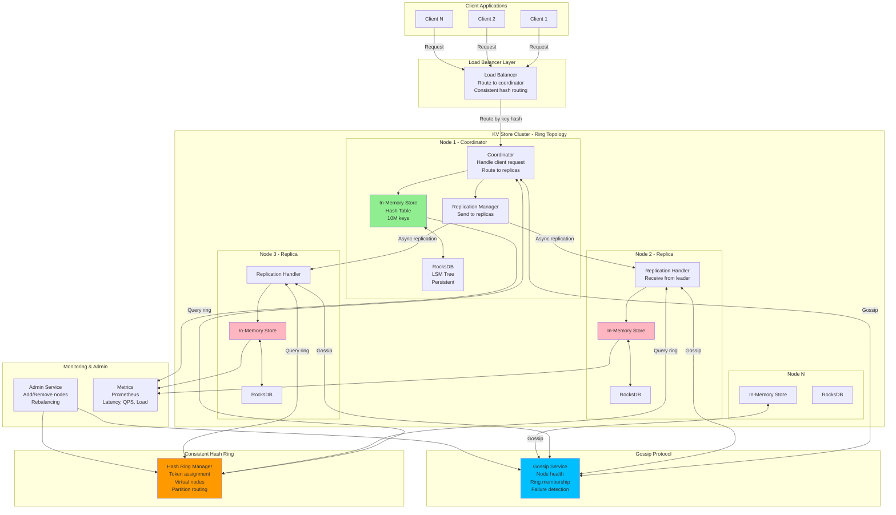

# Distributed Key-Value Store (Design Redis/DynamoDB)

## Step 1: Requirements Clarification

### Functional Requirements

**Core Operations:**

- PUT(key, value) - Store key-value pair
- GET(key) - Retrieve value by key
- DELETE(key) - Remove key-value pair
- Support for TTL (Time-To-Live) expiration
- Batch operations (multi-get, multi-put)
- Atomic operations (compare-and-swap, increment)
- Range queries (optional, for ordered keys)

**Data Types:**

- Strings (primary)
- Lists, Sets, Hashes (Redis-like structures)
- Binary data support
- Max value size: 10 MB

**Out of Scope:**

- Complex transactions (focus on single-key operations)
- SQL queries
- Secondary indexes (can be added as extension)
- Streaming/pub-sub


### Non-Functional Requirements

**Scale:**

- 1 billion keys
- 100K QPS per node
- 1M QPS cluster-wide
- Data size: 10 TB total
- Horizontal scalability (add nodes to scale)

**Performance:**

- Read latency: <1ms (P99, in-memory)
- Write latency: <5ms (P99, with replication)
- Throughput: 100K ops/sec per node

**Availability:**

- 99.99% uptime (4 nines)
- No single point of failure
- Survive node failures (N-1 fault tolerance)
- Self-healing (automatic recovery)

**Durability:**

- No data loss (configurable)
- Replication factor: 3 (configurable)
- Async replication acceptable (eventually consistent)
- Periodic snapshots + AOF (Append-Only File)

**Consistency:**

- Tunable consistency (choose between strong and eventual)
- Configurable read/write quorum
- Conflict resolution for concurrent writes

**Partition Tolerance:**

- Handle network partitions
- Continue operating with degraded consistency

***

## Step 2: Capacity Estimation

```
Cluster Configuration:
Nodes: 100
Replication factor: 3
Total keys: 1B
Keys per node (without replication): 1B / 100 = 10M keys/node
Keys per node (with replication): 10M × 3 = 30M keys/node

Storage Estimation:
Average key size: 50 bytes
Average value size: 1 KB
Storage per key-value: 50 + 1024 = 1074 bytes ≈ 1.1 KB

Total storage (without replication): 1B × 1.1 KB = 1.1 TB
Total storage (with replication): 1.1 TB × 3 = 3.3 TB

Per-node storage: 3.3 TB / 100 = 33 GB per node

Memory Requirements:
Hot data (20% of keys): 1B × 0.2 = 200M keys
Memory for hot data: 200M × 1.1 KB = 220 GB
Distributed across nodes: 220 GB / 100 = 2.2 GB per node

Index overhead (hash table):
Entry: 8 bytes (pointer) + 50 bytes (key) = 58 bytes
Total index: 1B × 58 bytes = 58 GB
Per-node index: 58 GB / 100 = 580 MB

Per-node memory: 2.2 GB (hot data) + 580 MB (index) ≈ 3 GB

Traffic Estimation:
Read QPS: 800K (80% of 1M)
Write QPS: 200K (20% of 1M)

Per-node QPS: 1M / 100 = 10K QPS
Read per node: 8K QPS
Write per node: 2K QPS

With replication (writes go to 3 nodes):
Write load per node: 2K × 3 / 100 = 60 writes/sec (manageable)

Network Bandwidth:
Read: 800K QPS × 1.1 KB = 880 MB/sec
Write: 200K QPS × 1.1 KB = 220 MB/sec
Replication: 200K × 1.1 KB × 2 (to 2 replicas) = 440 MB/sec
Total: 880 + 220 + 440 = 1.54 GB/sec cluster-wide

Per-node bandwidth: 1.54 GB / 100 = 15.4 MB/sec

Consistent Hashing:
Virtual nodes per physical node: 150
Total virtual nodes: 100 × 150 = 15,000
Hash ring size: 2^32 (4 billion positions)

Rebalancing on node addition:
Add 1 node: 100 → 101 nodes
Keys to move: 1B / 101 ≈ 10M keys (1% of data)
Transfer time at 100 MB/sec: 10M × 1.1 KB / 100 MB = 110 seconds

Failure Recovery:
Node failure: Replicas take over immediately (no downtime)
Data recovery: Copy 10M keys from replicas
Time: 110 seconds (same as rebalancing)

Gossip Protocol Overhead:
Gossip interval: 1 second
Gossip message size: 1 KB (node states)
Gossip fanout: 3 nodes
Gossip traffic per node: 3 KB/sec (negligible)

Quorum Configuration:
N = 3 (replication factor)
W = 2 (write quorum)
R = 2 (read quorum)
W + R > N → Strong consistency
W = 1, R = 1 → Eventual consistency (fastest)
```


***

## Step 3: API Design

### Core Operations API

**PUT Operation**

```json
PUT /v1/data/{key}
Content-Type: application/json
X-Consistency-Level: quorum  // one, quorum, all

Request:
{
  "value": "Hello, World!",
  "ttl": 3600,  // seconds, optional
  "metadata": {
    "content_type": "text/plain",
    "created_by": "user_123"
  }
}

Response: 201 Created
{
  "key": "my_key",
  "version": 1,
  "timestamp": 1728021480000,
  "nodes": ["node_1", "node_5", "node_9"],  // Replicas
  "write_latency_ms": 3
}

// Conditional PUT (Compare-And-Swap)
PUT /v1/data/{key}?expected_version=5
Response: 409 Conflict (if version mismatch)
{
  "error": "version_conflict",
  "expected": 5,
  "actual": 7
}
```

**GET Operation**

```json
GET /v1/data/{key}
X-Consistency-Level: quorum

Response: 200 OK
{
  "key": "my_key",
  "value": "Hello, World!",
  "version": 1,
  "timestamp": 1728021480000,
  "metadata": {...},
  "ttl_remaining": 3540,
  "read_latency_ms": 1
}

Response: 404 Not Found
{
  "error": "key_not_found",
  "key": "my_key"
}

// Get with version history (DynamoDB-style)
GET /v1/data/{key}?include_versions=true
Response: 200 OK
{
  "key": "my_key",
  "versions": [
    {
      "version": 3,
      "value": "Latest value",
      "timestamp": 1728021490000
    },
    {
      "version": 2,
      "value": "Previous value",
      "timestamp": 1728021485000
    }
  ]
}
```

**DELETE Operation**

```json
DELETE /v1/data/{key}
X-Consistency-Level: quorum

Response: 204 No Content
{
  "key": "my_key",
  "deleted_at": 1728021500000,
  "tombstone_version": 4
}
```

**Batch Operations**

```json
POST /v1/data/batch/get
Content-Type: application/json

Request:
{
  "keys": ["key1", "key2", "key3"]
}

Response: 200 OK
{
  "results": [
    {"key": "key1", "value": "value1", "found": true},
    {"key": "key2", "value": null, "found": false},
    {"key": "key3", "value": "value3", "found": true}
  ]
}

POST /v1/data/batch/put
Request:
{
  "items": [
    {"key": "key1", "value": "value1"},
    {"key": "key2", "value": "value2"}
  ]
}
```

**Atomic Operations**

```json
POST /v1/data/{key}/increment
Request:
{
  "delta": 5
}

Response: 200 OK
{
  "key": "counter_key",
  "new_value": 105,
  "old_value": 100
}

POST /v1/data/{key}/append
Request:
{
  "value": " World!"
}

Response: 200 OK
{
  "key": "string_key",
  "new_value": "Hello World!",
  "length": 12
}
```


### Admin \& Cluster Management API

**Node Status**

```json
GET /v1/cluster/nodes

Response: 200 OK
{
  "nodes": [
    {
      "node_id": "node_1",
      "host": "10.0.1.5",
      "port": 7000,
      "status": "UP",
      "load": 0.65,
      "keys_owned": 10234567,
      "memory_used_mb": 2800,
      "virtual_nodes": 150
    }
  ],
  "total_nodes": 100,
  "healthy_nodes": 98
}
```

**Ring Information**

```json
GET /v1/cluster/ring

Response: 200 OK
{
  "ring_version": 15,
  "virtual_nodes": 15000,
  "partitions": [
    {
      "token_range": "0 - 28547963",
      "primary": "node_1",
      "replicas": ["node_5", "node_9"]
    }
  ]
}
```

**Rebalancing**

```json
POST /v1/cluster/nodes/{node_id}/decommission

Response: 202 Accepted
{
  "node_id": "node_50",
  "status": "decommissioning",
  "keys_to_migrate": 10234567,
  "estimated_time_sec": 120
}
```


***

## Step 4: Database \& Storage Design

### In-Memory Storage

**Hash Table Structure:**

```cpp
struct Entry {
    string key;
    string value;
    uint64_t version;
    uint64_t timestamp;
    uint32_t ttl;  // seconds, 0 = no expiration
    map<string, string> metadata;
    
    // For conflict resolution
    VectorClock vector_clock;
};

class InMemoryStore {
private:
    // Primary storage: key → entry
    unordered_map<string, Entry*> data;
    
    // TTL index: expiration_time → set of keys
    multimap<uint64_t, string> ttl_index;
    
    // Version index (optional, for history)
    unordered_map<string, vector<Entry*>> version_history;
    
    shared_mutex rw_lock;  // Read-write lock
    
public:
    Entry* get(const string& key);
    void put(const string& key, Entry* entry);
    bool remove(const string& key);
    void cleanup_expired();
};
```


### Persistent Storage (Disk)

**Storage Engine Options:**

**Option 1: Log-Structured Merge (LSM) Tree**

```
Write path:
1. Write to WAL (Write-Ahead Log) - Sequential write
2. Write to MemTable (in-memory sorted tree)
3. When MemTable full → Flush to SSTable (Sorted String Table)
4. Background compaction merges SSTables

Read path:
1. Check MemTable
2. Check SSTables (newest to oldest)
3. Merge results

Pros: Fast writes (sequential), good compression
Cons: Slower reads (multiple levels), write amplification
Used by: RocksDB, LevelDB, Cassandra
```

**Option 2: B+ Tree**

```
Write path:
1. Write to WAL
2. Update B+ tree in-place
3. Periodic checkpointing

Read path:
1. Traverse B+ tree (O(log N))

Pros: Fast reads, no compaction
Cons: Random writes (slower), fragmentation
Used by: BerkeleyDB, LMDB
```

**Chosen: RocksDB (LSM Tree)**

**Directory Structure:**

```
/data/node_1/
├── WAL/
│   ├── 000001.log  (current)
│   └── 000000.log  (archived)
├── memtable.db
├── sst/
│   ├── level0/
│   │   ├── 000010.sst
│   │   └── 000011.sst
│   ├── level1/
│   │   ├── 000005.sst
│   │   └── 000006.sst
│   └── level2/
│       └── 000001.sst
└── MANIFEST
```

**RocksDB Configuration:**

```cpp
rocksdb::Options options;
options.create_if_missing = true;
options.write_buffer_size = 64 << 20;  // 64 MB MemTable
options.max_write_buffer_number = 3;
options.target_file_size_base = 64 << 20;  // 64 MB SSTable
options.max_bytes_for_level_base = 256 << 20;  // 256 MB level 1
options.compression = rocksdb::kSnappyCompression;

// Bloom filter for faster reads
options.table_factory.reset(NewBlockBasedTableFactory());
BlockBasedTableOptions table_options;
table_options.filter_policy.reset(NewBloomFilterPolicy(10, false));
options.table_factory.reset(NewBlockBasedTableFactory(table_options));
```


### Replication Log

**Write-Ahead Log (WAL):**

```
Entry format:
┌────────────────────────────────────────┐
│ Sequence Number: 8 bytes               │
│ Timestamp: 8 bytes                     │
│ Operation: 1 byte (PUT/DELETE)         │
│ Key Length: 4 bytes                    │
│ Key: variable                          │
│ Value Length: 4 bytes                  │
│ Value: variable                        │
│ Version: 8 bytes                       │
│ CRC32: 4 bytes                         │
└────────────────────────────────────────┘

Operations:
- PUT: key, value, version, timestamp
- DELETE: key, version (tombstone)
```


***

## Step 5: High-Level Design

### Architecture Diagram (Mermaid)




### Request Flow

**Write Request (PUT):**

```
1. Client sends PUT(key, value) to any node
2. Node hashes key → Determines coordinator node
3. Forward request to coordinator
4. Coordinator determines replicas (3 nodes from ring)
5. Coordinator writes to local storage
6. Coordinator sends replication requests to N-1 replicas
7. Wait for W responses (quorum: W=2)
8. Return success to client (latency: ~5ms)
9. Background: Remaining replicas acknowledge
```

**Read Request (GET):**

```
1. Client sends GET(key) to any node
2. Node hashes key → Determines coordinator
3. Coordinator sends read requests to R replicas (R=2)
4. Collect responses from R replicas
5. If versions match → Return value
6. If versions differ → Resolve conflict (vector clock)
7. Return value to client (latency: ~1ms)
8. Background: Read repair (update stale replicas)
```


***

## Step 6: Deep Dive

### 6.1 Consistent Hashing

**Theory:**

Traditional hashing: `node = hash(key) % N`

- Problem: Adding/removing node → rehash ALL keys (N/(N+1) keys move)

Consistent hashing: Hash keys AND nodes onto same ring

- Adding/removing node → Only K/N keys move (where K = total keys)

**Implementation:**

```cpp
class ConsistentHashRing {
private:
    // Token (hash value) → Node ID
    map<uint64_t, string> ring;
    
    // Node ID → Set of tokens (virtual nodes)
    unordered_map<string, set<uint64_t>> node_tokens;
    
    // Number of virtual nodes per physical node
    const int virtual_nodes_per_node = 150;
    
    // Hash function (MurmurHash3)
    uint64_t hash(const string& key) const {
        return MurmurHash3_x64_128(key.data(), key.size(), 0);
    }
    
public:
    // Add node to ring
    void addNode(const string& node_id) {
        for (int i = 0; i < virtual_nodes_per_node; ++i) {
            // Create virtual node identifier
            string virtual_key = node_id + "#" + to_string(i);
            uint64_t token = hash(virtual_key);
            
            // Add to ring
            ring[token] = node_id;
            node_tokens[node_id].insert(token);
        }
    }
    
    // Remove node from ring
    void removeNode(const string& node_id) {
        for (uint64_t token : node_tokens[node_id]) {
            ring.erase(token);
        }
        node_tokens.erase(node_id);
    }
    
    // Get coordinator node for key
    string getCoordinator(const string& key) const {
        uint64_t key_hash = hash(key);
        
        // Find first node clockwise on ring
        auto it = ring.lower_bound(key_hash);
        
        // Wrap around if at end
        if (it == ring.end()) {
            it = ring.begin();
        }
        
        return it->second;
    }
    
    // Get N replica nodes for key
    vector<string> getReplicas(const string& key, int N) const {
        uint64_t key_hash = hash(key);
        vector<string> replicas;
        unordered_set<string> seen;  // Avoid duplicate physical nodes
        
        auto it = ring.lower_bound(key_hash);
        
        while (replicas.size() < N) {
            if (it == ring.end()) {
                it = ring.begin();
            }
            
            string node_id = it->second;
            
            // Add if unique physical node
            if (seen.find(node_id) == seen.end()) {
                replicas.push_back(node_id);
                seen.insert(node_id);
            }
            
            ++it;
            
            // Prevent infinite loop if not enough nodes
            if (seen.size() >= node_tokens.size()) {
                break;
            }
        }
        
        return replicas;
    }
    
    // Get token range owned by node
    pair<uint64_t, uint64_t> getTokenRange(uint64_t token) const {
        auto it = ring.find(token);
        if (it == ring.end()) {
            return {0, 0};
        }
        
        uint64_t end_token = it->first;
        
        // Find previous token on ring
        if (it == ring.begin()) {
            it = ring.end();
        }
        --it;
        uint64_t start_token = it->first;
        
        return {start_token, end_token};
    }
};

// Example usage:
ConsistentHashRing ring;
ring.addNode("node_1");
ring.addNode("node_2");
ring.addNode("node_3");

string key = "user_123";
string coordinator = ring.getCoordinator(key);  // "node_2"
vector<string> replicas = ring.getReplicas(key, 3);  // ["node_2", "node_3", "node_1"]
```

**Virtual Nodes Benefits:**

```
Without virtual nodes (1 node = 1 token):
Node 1: 40% of data
Node 2: 35% of data
Node 3: 25% of data
→ Imbalanced

With virtual nodes (1 node = 150 tokens):
Node 1: 33.2% of data
Node 2: 33.5% of data
Node 3: 33.3% of data
→ Balanced (±0.3%)
```


***

### 6.2 Replication Strategies

**Single-Leader Replication (Master-Slave):**

```cpp
class SingleLeaderReplication {
private:
    string leader_node;
    vector<string> follower_nodes;
    
public:
    WriteResult write(const string& key, const string& value) {
        // 1. Write to leader
        Entry entry{key, value, version++, timestamp()};
        leader.write(entry);
        
        // 2. Replicate to followers (async)
        for (const auto& follower : follower_nodes) {
            async([&]() {
                follower.replicate(entry);
            });
        }
        
        // 3. Return immediately (async replication)
        return WriteResult{SUCCESS, entry.version};
    }
    
    ReadResult read(const string& key) {
        // Always read from leader (strong consistency)
        return leader.read(key);
    }
};

// Pros: Strong consistency, simple
// Cons: Leader is bottleneck, single point of failure
```

**Multi-Leader Replication (Multi-Master):**

```cpp
class MultiLeaderReplication {
private:
    vector<string> leader_nodes;
    
public:
    WriteResult write(const string& key, const string& value) {
        // Write to local leader
        Entry entry{key, value, version++, timestamp()};
        local_leader.write(entry);
        
        // Async replicate to other leaders
        for (const auto& remote_leader : other_leaders) {
            async([&]() {
                remote_leader.replicate(entry);
            });
        }
        
        return WriteResult{SUCCESS, entry.version};
    }
    
    // Conflict resolution required!
    Entry resolveConflict(const Entry& e1, const Entry& e2) {
        // Last-write-wins (timestamp)
        return (e1.timestamp > e2.timestamp) ? e1 : e2;
    }
};

// Pros: High availability, low latency
// Cons: Conflict resolution complexity
```

**Leaderless Replication (Dynamo-style):**

```cpp
class LeaderlessReplication {
private:
    ConsistentHashRing ring;
    int replication_factor = 3;
    int write_quorum = 2;  // W
    int read_quorum = 2;   // R
    
public:
    WriteResult write(const string& key, const string& value) {
        // 1. Get replica nodes
        vector<string> replicas = ring.getReplicas(key, replication_factor);
        
        // 2. Send write to all replicas in parallel
        vector<future<WriteResponse>> futures;
        for (const auto& replica : replicas) {
            futures.push_back(async([&]() {
                return replica.write(key, value);
            }));
        }
        
        // 3. Wait for W successful responses (quorum)
        int success_count = 0;
        for (auto& fut : futures) {
            try {
                WriteResponse resp = fut.get();
                if (resp.success) {
                    ++success_count;
                }
            } catch (...) {
                // Node failed, continue
            }
            
            if (success_count >= write_quorum) {
                return WriteResult{SUCCESS};
            }
        }
        
        return WriteResult{FAILURE, "Quorum not met"};
    }
    
    ReadResult read(const string& key) {
        // 1. Get replica nodes
        vector<string> replicas = ring.getReplicas(key, replication_factor);
        
        // 2. Send read to R replicas in parallel
        vector<future<ReadResponse>> futures;
        for (int i = 0; i < read_quorum; ++i) {
            futures.push_back(async([&]() {
                return replicas[i].read(key);
            }));
        }
        
        // 3. Collect R responses
        map<VectorClock, Entry> versions;
        for (auto& fut : futures) {
            try {
                ReadResponse resp = fut.get();
                versions[resp.entry.vector_clock] = resp.entry;
            } catch (...) {
                // Continue
            }
        }
        
        // 4. Resolve conflicts if multiple versions
        if (versions.size() == 1) {
            // All replicas agree
            return ReadResult{SUCCESS, versions.begin()->second.value};
        } else {
            // Conflict - use vector clock to resolve
            Entry resolved = resolveConflict(versions);
            
            // Read repair: Update stale replicas
            readRepair(key, resolved, replicas);
            
            return ReadResult{SUCCESS, resolved.value};
        }
    }
};

// W + R > N → Strong consistency
// W=2, R=2, N=3: Can tolerate 1 failure, strong consistency
// W=1, R=1, N=3: Fastest, eventual consistency
// W=3, R=1, N=3: Durability, slower writes
```


***

### 6.3 Vector Clocks (Conflict Resolution)

**Problem:** Concurrent writes to different replicas create conflicts.

**Example:**

```
Client A writes v1 to Node 1
Client B writes v2 to Node 2 (concurrent)
Which version is correct?
```

**Solution: Vector Clocks**

```cpp
class VectorClock {
private:
    // node_id → counter
    map<string, uint64_t> clocks;
    
public:
    // Increment clock for this node
    void increment(const string& node_id) {
        clocks[node_id]++;
    }
    
    // Merge two vector clocks (take max of each counter)
    VectorClock merge(const VectorClock& other) const {
        VectorClock result = *this;
        
        for (const auto& [node, counter] : other.clocks) {
            result.clocks[node] = max(result.clocks[node], counter);
        }
        
        return result;
    }
    
    // Compare two vector clocks
    enum CompareResult { BEFORE, AFTER, CONCURRENT };
    
    CompareResult compare(const VectorClock& other) const {
        bool this_greater = false;
        bool other_greater = false;
        
        // Check all nodes
        set<string> all_nodes;
        for (const auto& [node, _] : clocks) all_nodes.insert(node);
        for (const auto& [node, _] : other.clocks) all_nodes.insert(node);
        
        for (const auto& node : all_nodes) {
            uint64_t this_counter = clocks.count(node) ? clocks.at(node) : 0;
            uint64_t other_counter = other.clocks.count(node) ? other.clocks.at(node) : 0;
            
            if (this_counter > other_counter) {
                this_greater = true;
            } else if (other_counter > this_counter) {
                other_greater = true;
            }
        }
        
        if (this_greater && !other_greater) {
            return AFTER;  // This is newer
        } else if (other_greater && !this_greater) {
            return BEFORE;  // Other is newer
        } else {
            return CONCURRENT;  // Conflict!
        }
    }
};

// Usage example:
struct Entry {
    string key;
    string value;
    VectorClock version;
};

Entry resolveConflict(const vector<Entry>& entries) {
    // Find all concurrent versions
    vector<Entry> concurrent;
    
    for (const auto& entry : entries) {
        bool is_concurrent = true;
        
        for (const auto& other : entries) {
            if (&entry == &other) continue;
            
            auto cmp = entry.version.compare(other.version);
            if (cmp == VectorClock::BEFORE) {
                // This entry is older, exclude it
                is_concurrent = false;
                break;
            }
        }
        
        if (is_concurrent) {
            concurrent.push_back(entry);
        }
    }
    
    // If single winner, return it
    if (concurrent.size() == 1) {
        return concurrent[0];
    }
    
    // Multiple concurrent versions - application-specific resolution
    // Option 1: Last-write-wins (timestamp)
    // Option 2: Return all versions to client (siblings)
    // Option 3: Merge values (for CRDTs)
    
    return lastWriteWins(concurrent);
}

// Example scenario:
VectorClock v1;
v1.increment("node_1");  // {node_1: 1}

VectorClock v2 = v1;
v2.increment("node_2");  // {node_1: 1, node_2: 1}

VectorClock v3 = v1;
v3.increment("node_3");  // {node_1: 1, node_3: 1}

v2.compare(v3);  // CONCURRENT (both derived from v1)
```


***

### 6.4 Gossip Protocol (Failure Detection)

**Purpose:** Detect node failures without centralized coordinator.

**Implementation:**

```cpp
class GossipProtocol {
private:
    struct NodeState {
        string node_id;
        string address;
        uint64_t heartbeat;  // Incrementing counter
        uint64_t timestamp;  // Last update time
        enum Status { ALIVE, SUSPECTED, DEAD } status;
    };
    
    unordered_map<string, NodeState> cluster_state;
    string my_node_id;
    
    const int GOSSIP_INTERVAL_MS = 1000;
    const int GOSSIP_FANOUT = 3;
    const int FAILURE_TIMEOUT_MS = 10000;
    
public:
    void start() {
        // Periodically gossip
        while (true) {
            sleep(GOSSIP_INTERVAL_MS);
            
            // 1. Increment own heartbeat
            cluster_state[my_node_id].heartbeat++;
            cluster_state[my_node_id].timestamp = now();
            
            // 2. Select random nodes to gossip with
            vector<string> targets = selectRandomNodes(GOSSIP_FANOUT);
            
            // 3. Send cluster state to targets
            for (const auto& target : targets) {
                sendGossipMessage(target, cluster_state);
            }
            
            // 4. Check for failures
            detectFailures();
        }
    }
    
    void onGossipReceived(const unordered_map<string, NodeState>& remote_state) {
        // Merge remote state with local state
        for (const auto& [node_id, remote_node] : remote_state) {
            auto& local_node = cluster_state[node_id];
            
            // Update if remote has newer heartbeat
            if (remote_node.heartbeat > local_node.heartbeat) {
                local_node = remote_node;
                local_node.timestamp = now();
            }
        }
    }
    
    void detectFailures() {
        uint64_t current_time = now();
        
        for (auto& [node_id, node] : cluster_state) {
            if (node_id == my_node_id) continue;
            
            uint64_t elapsed = current_time - node.timestamp;
            
            if (elapsed > FAILURE_TIMEOUT_MS) {
                if (node.status == NodeState::ALIVE) {
                    node.status = NodeState::SUSPECTED;
                    logger.warn("Node {} suspected failed", node_id);
                } else if (node.status == NodeState::SUSPECTED) {
                    node.status = NodeState::DEAD;
                    logger.error("Node {} marked as DEAD", node_id);
                    
                    // Trigger ring reconfiguration
                    handleNodeFailure(node_id);
                }
            } else if (node.status != NodeState::ALIVE) {
                // Node recovered
                node.status = NodeState::ALIVE;
                logger.info("Node {} recovered", node_id);
            }
        }
    }
    
    vector<string> selectRandomNodes(int count) {
        vector<string> candidates;
        for (const auto& [node_id, _] : cluster_state) {
            if (node_id != my_node_id) {
                candidates.push_back(node_id);
            }
        }
        
        shuffle(candidates.begin(), candidates.end(), rng);
        
        if (candidates.size() > count) {
            candidates.resize(count);
        }
        
        return candidates;
    }
};
```

**Gossip Convergence:**

```
100 nodes, fanout=3:
Round 1: 1 node knows → 3 nodes (3^1)
Round 2: 3 nodes → 9 nodes (3^2)
Round 3: 9 nodes → 27 nodes (3^3)
Round 4: 27 nodes → 81 nodes (3^4)
Round 5: 81 nodes → 100 nodes (all)

Convergence time: O(log N) rounds
Total messages: N × fanout = 100 × 3 = 300 messages
```


***

### 6.5 Hinted Handoff (Availability)

**Problem:** Replica node is down, cannot acknowledge write.

**Solution:** Write to "hint" node temporarily.

```cpp
class HintedHandoff {
private:
    unordered_map<string, queue<Entry>> hints;  // target_node → pending entries
    
public:
    WriteResult write(const string& key, const Entry& entry) {
        vector<string> replicas = ring.getReplicas(key, 3);
        
        int success_count = 0;
        for (const auto& replica : replicas) {
            if (isNodeAlive(replica)) {
                // Normal write
                replica.write(entry);
                ++success_count;
            } else {
                // Node down - write hint to another node
                string hint_node = findHintNode(replica);
                hint_node.storeHint(replica, entry);
                
                logger.info("Stored hint for {} on {}", replica, hint_node);
            }
        }
        
        return (success_count >= write_quorum) ? SUCCESS : FAILURE;
    }
    
    void deliverHints() {
        // Periodically try to deliver hints
        for (auto& [target_node, pending_entries] : hints) {
            if (isNodeAlive(target_node)) {
                // Node recovered - deliver hints
                while (!pending_entries.empty()) {
                    Entry entry = pending_entries.front();
                    pending_entries.pop();
                    
                    target_node.write(entry);
                }
                
                logger.info("Delivered all hints to {}", target_node);
            }
        }
    }
};
```


***

### 6.6 Read Repair

**Problem:** Replica has stale data (missed writes due to downtime).

**Solution:** Detect and fix during reads.

```cpp
ReadResult read(const string& key) {
    vector<string> replicas = ring.getReplicas(key, 3);
    
    // Read from all replicas
    vector<Entry> entries;
    for (const auto& replica : replicas) {
        try {
            entries.push_back(replica.read(key));
        } catch (...) {
            // Replica unavailable
        }
    }
    
    // Find latest version
    Entry latest = findLatest(entries);
    
    // Repair stale replicas
    for (size_t i = 0; i < entries.size(); ++i) {
        if (entries[i].version < latest.version) {
            // Async repair
            async([&]() {
                replicas[i].write(latest);
            });
        }
    }
    
    return ReadResult{SUCCESS, latest.value};
}
```


***

## Step 7: Bottlenecks, Trade-offs \& Optimizations

### Bottleneck 1: Hot Keys

**Problem:** Popular keys (e.g., celebrity data) cause hotspots on a single node.

**Solution 1: Read Replicas**

```cpp
// Redirect reads for hot keys to random replica
ReadResult readHotKey(const string& key) {
    if (isHotKey(key)) {
        // Read from random replica instead of coordinator
        vector<string> replicas = ring.getReplicas(key, 3);
        string random_replica = replicas[rand() % replicas.size()];
        
        return random_replica.read(key);
    }
    
    return normalRead(key);
}
```

**Solution 2: Client-Side Caching**

```cpp
// Cache hot keys on client
class ClientCache {
    LRUCache<string, string> cache{1000};
    
    string get(const string& key) {
        if (cache.contains(key)) {
            return cache.get(key);
        }
        
        string value = server.get(key);
        cache.put(key, value);
        return value;
    }
};
```

**Trade-off:** Consistency vs performance

***

### Bottleneck 2: Write Throughput

**Problem:** Synchronous replication slows writes

**Solution: Async Replication with Batching**

```cpp
class BatchedReplication {
    vector<Entry> pending_entries;
    const int BATCH_SIZE = 100;
    
    void replicate(const Entry& entry) {
        pending_entries.push_back(entry);
        
        if (pending_entries.size() >= BATCH_SIZE) {
            flushBatch();
        }
    }
    
    void flushBatch() {
        // Send all entries in single RPC
        replicas.batchWrite(pending_entries);
        pending_entries.clear();
    }
};

// Result: 10x throughput (100 RPCs → 1 RPC)
```

**Trade-off:** Latency vs throughput

***

### Bottleneck 3: Network Partitions

**Problem:** Network split causes both sides to accept writes.

**Solution: Quorum Configuration**

```
Scenario: 5-node cluster splits into 3+2

Option 1: W=3, R=3, N=5
- Majority (3) can continue
- Minority (2) cannot satisfy quorum → Read-only
- Strong consistency maintained

Option 2: W=2, R=2, N=5
- Both sides can write (2+2 > 5/2)
- Risk of split-brain
- Requires conflict resolution

Recommendation: W + R > N (always)
```

**Trade-off:** Availability vs consistency

***

### Bottleneck 4: Large Values

**Problem:** 10 MB values slow network and memory.

**Solution: Value Compression**

```cpp
Entry put(const string& key, const string& value) {
    string compressed = compress(value, SNAPPY);
    
    Entry entry;
    entry.key = key;
    entry.value = compressed;
    entry.compressed = true;
    
    return entry;
}

// Compression ratio: 3-5x typical
// 10 MB → 2-3 MB (network savings)
```

**Trade-off:** CPU vs network

***

### Optimization 1: Bloom Filters

**Problem:** Checking if key exists requires disk read.

**Solution: In-Memory Bloom Filter**

```cpp
class OptimizedStorage {
    BloomFilter bloom{1000000, 0.01};  // 1M keys, 1% false positive
    
    Entry* get(const string& key) {
        // Fast negative lookup (no disk access)
        if (!bloom.mightContain(key)) {
            return nullptr;  // Definitely not present
        }
        
        // Might be present - check disk
        return disk.read(key);
    }
    
    void put(const string& key, const Entry& entry) {
        bloom.add(key);
        disk.write(key, entry);
    }
};

// Bloom filter size: 1.2 MB for 1M keys
// Saves 99% of disk lookups for absent keys
```


***

### Optimization 2: Compaction

**Problem:** LSM tree accumulates many SSTables (slow reads).

**Solution: Background Compaction**

```cpp
class LSMCompaction {
    void compact() {
        // Level 0 → Level 1
        vector<SSTable> level0 = getLevel0Tables();
        vector<SSTable> level1 = getLevel1Tables();
        
        // Merge overlapping tables
        SSTable merged = merge(level0, level1);
        
        // Write to level 1
        writeTable(merged, 1);
        
        // Delete old tables
        for (const auto& table : level0) {
            deleteTable(table);
        }
    }
};

// Before: 10 SSTables → 10 disk seeks
// After: 1 SSTable → 1 disk seek (10x faster)
```


***

### Optimization 3: Partitioning Large Keys

**Problem:** Single 10 MB value doesn't fit in memory.

**Solution: Chunking**

```cpp
void putLargeValue(const string& key, const string& value) {
    const int CHUNK_SIZE = 1024 * 1024;  // 1 MB
    int num_chunks = (value.size() + CHUNK_SIZE - 1) / CHUNK_SIZE;
    
    for (int i = 0; i < num_chunks; ++i) {
        string chunk_key = key + "#" + to_string(i);
        string chunk_data = value.substr(i * CHUNK_SIZE, CHUNK_SIZE);
        
        put(chunk_key, chunk_data);
    }
    
    // Store metadata
    put(key + "#meta", to_string(num_chunks));
}

string getLargeValue(const string& key) {
    int num_chunks = stoi(get(key + "#meta"));
    
    string result;
    for (int i = 0; i < num_chunks; ++i) {
        string chunk_key = key + "#" + to_string(i);
        result += get(chunk_key);
    }
    
    return result;
}
```


***

## Summary: Key Design Decisions

| Aspect | Decision | Rationale |
| :-- | :-- | :-- |
| **Partitioning** | Consistent hashing | Minimize rebalancing (K/N keys move) |
| **Replication** | Leaderless (Dynamo) | High availability, no SPOF |
| **Consistency** | Tunable quorum (W+R>N) | Application chooses consistency level |
| **Conflict Resolution** | Vector clocks | Handle concurrent writes |
| **Failure Detection** | Gossip protocol | Decentralized, scalable |
| **Storage Engine** | RocksDB (LSM tree) | Fast writes, good compression |
| **Availability** | Hinted handoff | Handle temporary failures |
| **Hot Keys** | Client caching + replicas | Distribute load |

**CAP Theorem Trade-offs:**

```
Strong Consistency (CP):
W + R > N, W = N (all replicas)
- Linearizable reads
- Slower writes
- Lower availability during partitions
Use case: Financial transactions

Eventual Consistency (AP):
W = 1, R = 1
- Fastest operations
- Higher availability
- Conflict resolution required
Use case: Session cache, shopping cart

Balanced (Tunable):
W = 2, R = 2, N = 3
- Good consistency (quorum)
- Good availability (tolerates 1 failure)
- Moderate performance
Use case: Most applications
```

**Performance Characteristics:**

- ✅ Write latency: <5ms (P99, with W=2)
- ✅ Read latency: <1ms (P99, in-memory)
- ✅ Throughput: 100K ops/sec per node
- ✅ Availability: 99.99% (tolerates N-1 failures)
- ✅ Scalability: Linear (add nodes to scale)
- ✅ Storage: 1B keys, 10 TB data

This design achieves **1M QPS cluster-wide** with **sub-millisecond latency** using consistent hashing, leaderless replication, and tunable consistency.

