# Distributed Message Queue (Design Kafka)

## Step 1: Requirements Clarification

### Functional Requirements

**Core Messaging Features:**

- Publish messages to topics (logical channels)
- Subscribe to topics and consume messages
- Support multiple independent consumer groups
- Message ordering within a partition
- Message retention (time-based and size-based)
- Support for both pub-sub and queue patterns
- Message replay (replay from any offset)
- Batch operations (produce/consume multiple messages)

**Management Features:**

- Create, delete, configure topics
- Add/remove brokers dynamically
- Monitor cluster health and metrics
- Rebalance partitions across brokers

**Out of Scope (Initial Design):**

- Message transformation (Kafka Streams - separate layer)
- Schema management (Schema Registry - separate service)
- Connectors for external systems (Kafka Connect - separate)
- Transactional messaging (cover in deep dive)


### Non-Functional Requirements

**Scale:**

- 100 brokers in a cluster
- 10,000 topics
- 1M partitions total (avg 100 partitions/topic)
- 1M producers
- 100K consumer groups with 1M consumers
- Message throughput: 10M messages/sec (peak)
- Data throughput: 10 GB/sec (assuming 1KB avg message)

**Performance:**

- Producer latency: <10ms (P99)
- Consumer lag: <100ms (P99)
- End-to-end latency: <100ms (P99)
- Throughput: 1M messages/sec per broker

**Durability \& Reliability:**

- No message loss (durable writes)
- Replication factor: 3 (configurable)
- At-least-once delivery by default
- Exactly-once semantics (optional)
- Survive broker failures (N-1 fault tolerance)

**Availability:**

- 99.99% uptime
- Automatic failover (<30 seconds)
- No single point of failure
- Rolling upgrades without downtime

**Other:**

- Horizontal scalability (add brokers to scale)
- Low operational complexity
- High disk efficiency (append-only log)

***

## Step 2: Capacity Estimation

```
Cluster Configuration:
Brokers: 100
Replication factor: 3
Topics: 10,000
Partitions per topic: 100
Total partitions: 1M

Traffic Estimation:
Messages per second: 10M
Average message size: 1 KB
Data rate: 10M × 1 KB = 10 GB/sec

With replication (3x): 10 GB/sec × 3 = 30 GB/sec cluster-wide

Per-broker:
Messages: 10M / 100 = 100K msg/sec
Data: 10 GB / 100 = 100 MB/sec
With replication writes: 100 MB/sec × 3 = 300 MB/sec

Storage Estimation:
Retention: 7 days
Daily data: 10 GB/sec × 86,400 sec = 864 TB/day
7-day retention: 864 TB × 7 = 6,048 TB ≈ 6 PB
With replication (3x): 6 PB × 3 = 18 PB

Per-broker storage: 18 PB / 100 = 180 TB per broker

Partition Distribution:
Partitions per broker: 1M / 100 = 10K partitions/broker
Leaders per broker: 10K / 3 ≈ 3,333 leader partitions
Followers per broker: 6,667 follower partitions

Consumer Lag Estimation:
Consumer groups: 100K
Consumers per group: 10 (avg)
Total consumers: 1M

Partitions per consumer: 1M partitions / 1M consumers = 1 partition/consumer (ideal)

Offset Storage:
Offset commits per consumer: 1 commit/sec
Total commits: 1M commits/sec
Offset size: 50 bytes (consumer_group, topic, partition, offset, metadata)
Offset data rate: 1M × 50 bytes = 50 MB/sec
Offset storage (7 days): 50 MB/sec × 86,400 × 7 = 30 TB

Network Bandwidth:
Producer → Broker: 10 GB/sec
Broker → Broker (replication): 20 GB/sec (2 replicas)
Broker → Consumer: 10 GB/sec (assume 1:1 produce/consume ratio)
Total per-broker: (10 + 20 + 10) / 100 = 400 MB/sec

Memory Requirements:
Per-broker cache: 10K partitions × 1 MB = 10 GB
OS page cache: 64 GB (for sequential reads)
Java heap: 8 GB (broker process)
Total per-broker: ~80 GB RAM

CPU Requirements:
Compression/decompression: 20% CPU
Network I/O: 10% CPU
Disk I/O: 10% CPU
Protocol handling: 20% CPU
Replication: 20% CPU
Per-broker: 16-32 cores recommended

ZooKeeper/KRaft Overhead:
Metadata updates: 1K ops/sec (partition leader changes, broker joins)
ZooKeeper ensemble: 5 nodes (quorum-based)
```


***

## Step 3: API Design

### Producer API

**Synchronous Send (Wait for Acknowledgment)**

```json
POST /v1/topics/{topic}/messages
Content-Type: application/json
Authorization: Bearer <token>

Request:
{
  "partition": 5,  // optional, null for round-robin/key-based routing
  "key": "user_123",  // optional, used for partition assignment
  "value": "Hello, Kafka!",  // message payload
  "headers": {
    "source": "payment-service",
    "trace_id": "abc-123"
  },
  "timestamp": 1728017760000  // optional, broker assigns if null
}

Response: 200 OK
{
  "topic": "orders",
  "partition": 5,
  "offset": 10234567,
  "timestamp": 1728017760123,
  "broker_id": 7
}

// Batch send
POST /v1/topics/{topic}/messages/batch
Request:
{
  "messages": [
    {"key": "user_1", "value": "msg1"},
    {"key": "user_2", "value": "msg2"},
    {"key": "user_3", "value": "msg3"}
  ]
}

Response: 200 OK
{
  "results": [
    {"partition": 0, "offset": 100, "error": null},
    {"partition": 1, "offset": 200, "error": null},
    {"partition": 0, "offset": 101, "error": null}
  ]
}
```

**Producer Configuration**

```json
{
  "acks": "all",  // 0, 1, all (-1)
  "compression.type": "snappy",  // none, gzip, snappy, lz4, zstd
  "batch.size": 16384,  // bytes
  "linger.ms": 10,  // wait up to 10ms to batch
  "retries": 3,
  "retry.backoff.ms": 100,
  "max.in.flight.requests.per.connection": 5,
  "enable.idempotence": true,  // exactly-once
  "transactional.id": "payment-txn-1"  // for transactions
}
```


### Consumer API

**Poll Messages (Pull-Based)**

```json
GET /v1/topics/{topic}/messages?consumer_group={group}&timeout=5000&max_records=500

Response: 200 OK
{
  "messages": [
    {
      "topic": "orders",
      "partition": 5,
      "offset": 10234567,
      "key": "user_123",
      "value": "Hello, Kafka!",
      "timestamp": 1728017760123,
      "headers": {
        "source": "payment-service"
      }
    }
  ],
  "next_poll_timeout": 1000  // suggested timeout for next poll
}
```

**Commit Offsets**

```json
POST /v1/consumer-groups/{group}/offsets
Request:
{
  "offsets": [
    {
      "topic": "orders",
      "partition": 5,
      "offset": 10234570,
      "metadata": "processed_batch_1"
    },
    {
      "topic": "orders",
      "partition": 6,
      "offset": 8765432,
      "metadata": null
    }
  ]
}

Response: 200 OK
{
  "committed": [
    {"topic": "orders", "partition": 5, "offset": 10234570},
    {"topic": "orders", "partition": 6, "offset": 8765432}
  ]
}

// Fetch committed offsets
GET /v1/consumer-groups/{group}/offsets?topic=orders

Response: 200 OK
{
  "offsets": [
    {"partition": 0, "offset": 100234, "metadata": null},
    {"partition": 1, "offset": 98765, "metadata": null}
  ]
}
```

**Consumer Group Management**

```json
// Join consumer group (automatic via heartbeat)
POST /v1/consumer-groups/{group}/members
Request:
{
  "member_id": "consumer_abc",
  "client_id": "payment-consumer-1",
  "topics": ["orders", "payments"]
}

// Leave group
DELETE /v1/consumer-groups/{group}/members/{member_id}

// List consumer groups
GET /v1/consumer-groups

Response: 200 OK
{
  "groups": [
    {
      "group_id": "order-processors",
      "state": "stable",  // preparing_rebalance, completing_rebalance, stable, dead
      "members": 10,
      "protocol": "range",  // range, round-robin, sticky
      "coordinator": "broker_5"
    }
  ]
}
```


### Admin API

**Topic Management**

```json
// Create topic
POST /v1/topics
Request:
{
  "name": "orders",
  "num_partitions": 100,
  "replication_factor": 3,
  "config": {
    "retention.ms": 604800000,  // 7 days
    "segment.ms": 86400000,  // 1 day
    "compression.type": "snappy",
    "min.insync.replicas": 2
  }
}

// Describe topic
GET /v1/topics/{topic}

Response: 200 OK
{
  "name": "orders",
  "num_partitions": 100,
  "replication_factor": 3,
  "partitions": [
    {
      "partition": 0,
      "leader": 7,
      "replicas": [7, 12, 23],
      "isr": [7, 12, 23],  // in-sync replicas
      "offset_start": 0,
      "offset_end": 10234567
    }
  ],
  "config": {...}
}

// Delete topic
DELETE /v1/topics/{topic}
```

**Cluster Management**

```json
// List brokers
GET /v1/brokers

Response: 200 OK
{
  "brokers": [
    {
      "broker_id": 1,
      "host": "kafka-1.example.com",
      "port": 9092,
      "rack": "us-east-1a",
      "version": "3.6.0",
      "controller": true
    }
  ]
}

// Reassign partitions
POST /v1/partitions/reassign
Request:
{
  "partitions": [
    {
      "topic": "orders",
      "partition": 5,
      "replicas": [8, 13, 24]  // new replica set
    }
  ]
}
```


***

## Step 4: Database \& Storage Design

### Log Structure (Core Abstraction)

**Partition Log Structure:**

```
Topic: orders, Partition: 5
Data directory: /var/kafka/data/orders-5/

orders-5/
├── 00000000000000000000.log      (segment 0, offsets 0-9999)
├── 00000000000000000000.index    (offset index)
├── 00000000000000000000.timeindex (timestamp index)
├── 00000000000000010000.log      (segment 1, offsets 10000-19999)
├── 00000000000000010000.index
├── 00000000000000010000.timeindex
├── 00000000000000020000.log      (active segment)
├── 00000000000000020000.index
└── 00000000000000020000.timeindex
```

**Log Segment Format:**

```
Each segment file (.log):
┌────────────────────────────────────────────┐
│ Message 1 (offset 0)                       │
│  - Offset: 8 bytes                         │
│  - Size: 4 bytes                           │
│  - CRC: 4 bytes                            │
│  - Magic: 1 byte                           │
│  - Attributes: 1 byte (compression, etc)   │
│  - Timestamp: 8 bytes                      │
│  - Key length: 4 bytes                     │
│  - Key: variable                           │
│  - Value length: 4 bytes                   │
│  - Value: variable                         │
│  - Headers: variable                       │
├────────────────────────────────────────────┤
│ Message 2 (offset 1)                       │
│  ...                                       │
└────────────────────────────────────────────┘

Index file (.index):
┌────────────────────────────────────────────┐
│ Offset → File Position mapping             │
│  [0] → 0                                   │
│  [1000] → 65536                            │
│  [2000] → 131072                           │
│  ...                                       │
└────────────────────────────────────────────┘

Time index (.timeindex):
┌────────────────────────────────────────────┐
│ Timestamp → Offset mapping                 │
│  [1728000000000] → 0                       │
│  [1728003600000] → 1000                    │
│  ...                                       │
└────────────────────────────────────────────┘
```


### Metadata Storage (ZooKeeper/KRaft)

**ZooKeeper Schema:**

```
/brokers
  /ids
    /1 → {"host": "kafka-1", "port": 9092, "rack": "us-east-1a"}
    /2 → {"host": "kafka-2", "port": 9092, "rack": "us-east-1b"}
  /topics
    /orders
      /partitions
        /0
          /state → {"leader": 1, "isr": [1,2,3], "leader_epoch": 5}
        /1
          /state → {"leader": 2, "isr": [2,3,4], "leader_epoch": 3}
/consumers
  /order-processors
    /offsets
      /orders
        /0 → 10234567
        /1 → 9876543
    /owners
      /orders
        /0 → consumer_abc
/controller
  /epoch → 15
/config
  /topics
    /orders → {"retention.ms": 604800000}
```

**KRaft Schema (Kafka's internal consensus - replaces ZooKeeper):**

```
Metadata log (special __cluster_metadata topic):
- Broker registrations
- Topic metadata
- Partition assignments
- ACLs
- Configurations

Stored as Raft log with:
- Leader election
- Log replication
- Snapshot compaction
```


### Consumer Offset Storage

**Internal Topic: __consumer_offsets**

```
Topic: __consumer_offsets
Partitions: 50 (configurable)
Replication: 3
Compaction: Enabled (log compaction retains latest offset per key)

Message format:
Key: [group_id, topic, partition]
Value: {
  "offset": 10234567,
  "metadata": "processed_batch_1",
  "commit_timestamp": 1728017760000,
  "expire_timestamp": 1728104160000
}

Partition assignment:
partition = abs(hash(group_id)) % 50
```


***

## Step 5: High-Level Design

### Architecture Diagram (Mermaid)

```mermaid
graph TB
    subgraph "Producers (1M instances)"
        P1[Producer 1<br/>payment-service]
        P2[Producer 2<br/>order-service]
        P3[Producer N]
    end
    
    subgraph "Kafka Cluster"
        subgraph "Controller"
            CTRL[Controller Broker<br/>Leader Election<br/>Partition Assignment<br/>Metadata Management]
        end
        
        subgraph "Broker 1 (Leader for P0, P3, P6)"
            B1[Broker Process<br/>Port 9092]
            B1_LOG1[Partition 0<br/>Leader<br/>Log + Index]
            B1_LOG2[Partition 3<br/>Leader]
            B1_LOG3[Partition 6<br/>Leader]
            B1_LOG4[Partition 1<br/>Follower]
            
            B1 --> B1_LOG1
            B1 --> B1_LOG2
            B1 --> B1_LOG3
            B1 --> B1_LOG4
        end
        
        subgraph "Broker 2 (Leader for P1, P4, P7)"
            B2[Broker Process]
            B2_LOG1[Partition 1<br/>Leader]
            B2_LOG2[Partition 4<br/>Leader]
            B2_LOG3[Partition 0<br/>Follower]
            
            B2 --> B2_LOG1
            B2 --> B2_LOG2
            B2 --> B2_LOG3
        end
        
        subgraph "Broker 3 (Leader for P2, P5, P8)"
            B3[Broker Process]
            B3_LOG1[Partition 2<br/>Leader]
            B3_LOG2[Partition 5<br/>Leader]
            B3_LOG3[Partition 0<br/>Follower]
            
            B3 --> B3_LOG1
            B3 --> B3_LOG2
            B3 --> B3_LOG3
        end
        
        subgraph "Broker N"
            BN[Broker Process]
        end
        
        CTRL -.->|Metadata| B1
        CTRL -.->|Metadata| B2
        CTRL -.->|Metadata| B3
    end
    
    subgraph "Coordination Layer"
        ZK[ZooKeeper Ensemble<br/>or KRaft Metadata]
        ZK1[ZK Node 1<br/>Leader]
        ZK2[ZK Node 2<br/>Follower]
        ZK3[ZK Node 3<br/>Follower]
        
        ZK --> ZK1
        ZK --> ZK2
        ZK --> ZK3
    end
    
    subgraph "Consumers (1M instances)"
        CG1[Consumer Group 1<br/>order-processors]
        C1[Consumer 1 → P0, P3]
        C2[Consumer 2 → P1, P4]
        C3[Consumer 3 → P2, P5]
        
        CG2[Consumer Group 2<br/>analytics]
        C4[Consumer 4]
        C5[Consumer 5]
        
        CG1 --> C1
        CG1 --> C2
        CG1 --> C3
        CG2 --> C4
        CG2 --> C5
    end
    
    P1 & P2 & P3 -->|Produce<br/>Round-robin or<br/>Key-based routing| B1
    P1 & P2 & P3 -->|Produce| B2
    P1 & P2 & P3 -->|Produce| B3
    
    B1_LOG1 -->|Replicate| B2_LOG3
    B1_LOG1 -->|Replicate| B3_LOG3
    B2_LOG1 -->|Replicate| B1_LOG4
    
    B1 & B2 & B3 & BN -.->|Register<br/>Heartbeat<br/>Metadata| ZK
    
    C1 -->|Fetch from Leader| B1
    C2 -->|Fetch from Leader| B2
    C3 -->|Fetch from Leader| B3
    
    C1 & C2 & C3 -->|Commit Offset| B1
    C1 & C2 & C3 -.->|Heartbeat<br/>Join/Leave Group| B1
    
    style CTRL fill:#ff9900
    style ZK fill:#00bfff
    style B1_LOG1 fill:#90EE90
    style B2_LOG1 fill:#90EE90
    style B3_LOG1 fill:#90EE90
    style B1_LOG4 fill:#FFB6C1
    style B2_LOG3 fill:#FFB6C1
    style B3_LOG3 fill:#FFB6C1
```




### Component Descriptions

**1. Broker:**

- Core server handling produce/fetch requests
- Manages partition logs (leader + follower replicas)
- Handles replication from leader to followers
- Coordinates with controller for metadata

**2. Controller:**

- One broker elected as controller (via ZooKeeper/KRaft)
- Manages partition leader election
- Handles broker failures and reassignments
- Updates metadata in ZooKeeper/KRaft

**3. ZooKeeper/KRaft:**

- Stores cluster metadata (broker list, topic config, partition assignments)
- Leader election for controller
- Consumer group coordination (legacy, now moved to brokers)

**4. Producer:**

- Batches messages for efficiency
- Routes messages to correct partition
- Handles retries and acknowledgments
- Supports transactions and idempotence

**5. Consumer:**

- Polls messages from assigned partitions
- Commits offsets to track progress
- Joins consumer group for load balancing
- Handles rebalancing

***

## Step 6: Deep Dive - Core Concepts

### 6.1 Partition \& Replication

**Partition Strategy:**

```cpp
// Producer decides which partition to send message
int selectPartition(const Message& msg, int num_partitions) {
    if (msg.partition != -1) {
        // Explicit partition specified
        return msg.partition;
    }
    
    if (msg.key != nullptr) {
        // Hash key to partition (sticky partitioning)
        uint32_t hash = murmurhash2(msg.key, msg.key_len);
        return hash % num_partitions;
    }
    
    // Round-robin (or sticky random partition)
    return round_robin_counter++ % num_partitions;
}
```

**Why Partitioning?**

- **Parallelism:** Multiple consumers can read different partitions concurrently
- **Scalability:** Add more partitions to scale throughput
- **Ordering:** Messages with same key go to same partition (ordered)

**Replication Architecture:**

```
Topic: orders, Partition: 0, Replication Factor: 3

Broker 1 (Leader):
  - Receives produce requests
  - Appends to local log
  - Waits for follower acknowledgments
  - Returns success to producer

Broker 2 (Follower):
  - Fetches new messages from leader
  - Appends to local log
  - Sends acknowledgment to leader
  
Broker 3 (Follower):
  - Same as Broker 2

ISR (In-Sync Replicas): [1, 2, 3]
- Followers that are caught up with leader
- Only ISR replicas count for "acks=all"
```

**Replication Protocol:**

```cpp
class PartitionLeader {
private:
    Log log;
    vector<FollowerState> followers;
    int min_isr = 2;  // Minimum in-sync replicas
    
public:
    ProduceResponse produce(const Message& msg) {
        // 1. Append to leader's log
        Offset offset = log.append(msg);
        
        // 2. Wait for follower acknowledgments based on acks setting
        if (acks == 0) {
            // Fire and forget
            return ProduceResponse{offset, SUCCESS};
        }
        
        if (acks == 1) {
            // Leader only
            log.flush();  // Ensure on disk
            return ProduceResponse{offset, SUCCESS};
        }
        
        if (acks == ALL) {
            // Wait for all ISR replicas
            waitForISRAcks(offset);
            
            if (countISR() < min_isr) {
                return ProduceResponse{offset, NOT_ENOUGH_REPLICAS};
            }
            
            return ProduceResponse{offset, SUCCESS};
        }
    }
    
    void waitForISRAcks(Offset offset) {
        for (auto& follower : followers) {
            if (follower.inISR() && follower.highWatermark < offset) {
                follower.waitForAck(offset, timeout=30s);
            }
        }
    }
};

class PartitionFollower {
private:
    Log log;
    int leader_broker_id;
    
public:
    void fetchLoop() {
        while (true) {
            // 1. Fetch new messages from leader
            FetchResponse resp = fetchFromLeader(log.endOffset());
            
            // 2. Append to local log
            for (const auto& msg : resp.messages) {
                log.append(msg);
            }
            
            // 3. Send acknowledgment (implicit via next fetch request)
            // Leader tracks follower's fetch offset
        }
    }
};
```

**High Water Mark (HWM):**

```
Leader Log:    [M0][M1][M2][M3][M4][M5]
                                   ↑ LEO (Log End Offset) = 6
                         ↑ HWM = 4 (all ISR replicas have this)

Follower 1:    [M0][M1][M2][M3][M4]
                                ↑ LEO = 5

Follower 2:    [M0][M1][M2][M3]
                            ↑ LEO = 4 (slowest ISR replica)

HWM = min(ISR LEOs) = 4
Consumers can only read up to HWM (offset 3, since offset 4 not committed)
```

**Leader Election:**

```cpp
class Controller {
public:
    void onBrokerFailure(int failed_broker_id) {
        // 1. Find all partitions where failed broker was leader
        vector<Partition> affected = getLeaderPartitions(failed_broker_id);
        
        for (const auto& partition : affected) {
            // 2. Elect new leader from ISR
            int new_leader = electLeaderFromISR(partition);
            
            // 3. Update metadata in ZooKeeper
            updatePartitionState(partition, new_leader);
            
            // 4. Notify all brokers of leadership change
            broadcastLeaderChange(partition, new_leader);
        }
    }
    
    int electLeaderFromISR(const Partition& partition) {
        // Prefer broker with highest LEO (most up-to-date)
        int best_broker = -1;
        Offset highest_leo = -1;
        
        for (int broker : partition.isr) {
            if (broker == partition.failed_leader) continue;
            
            Offset leo = getLogEndOffset(broker, partition);
            if (leo > highest_leo) {
                highest_leo = leo;
                best_broker = broker;
            }
        }
        
        return best_broker;
    }
};
```


***

### 6.2 Consumer Groups \& Rebalancing

**Consumer Group Coordination:**

```
Consumer Group: order-processors
Members: [C1, C2, C3]
Subscribed Topics: [orders (6 partitions)]

Initial assignment (range strategy):
C1: [P0, P1]
C2: [P2, P3]
C3: [P4, P5]

Consumer C4 joins → Rebalance triggered
New assignment:
C1: [P0, P1]
C2: [P2]
C3: [P3, P4]
C4: [P5]

Consumer C2 leaves → Rebalance triggered
New assignment:
C1: [P0, P1]
C3: [P3, P4]
C4: [P5, P2]
```

**Rebalancing Protocol:**

```cpp
class GroupCoordinator {
private:
    struct ConsumerGroup {
        string group_id;
        map<string, Consumer> members;  // member_id -> Consumer
        string protocol;  // range, round-robin, sticky
        int generation_id = 0;
        GroupState state = STABLE;
    };
    
    map<string, ConsumerGroup> groups;
    
public:
    // Consumer joins group
    JoinResponse joinGroup(const JoinRequest& req) {
        auto& group = groups[req.group_id];
        
        // 1. Add member to group
        group.members[req.member_id] = Consumer{
            req.member_id,
            req.subscribed_topics
        };
        
        // 2. Trigger rebalance
        group.state = PREPARING_REBALANCE;
        group.generation_id++;
        
        // 3. Wait for all members to rejoin
        waitForAllMembers(group);
        
        // 4. Select leader consumer
        string leader = selectLeader(group);
        
        // 5. Send member list to leader
        return JoinResponse{
            group.generation_id,
            req.member_id,
            leader,
            group.members  // Only sent to leader
        };
    }
    
    // Leader consumer assigns partitions
    SyncResponse syncGroup(const SyncRequest& req) {
        auto& group = groups[req.group_id];
        
        if (req.member_id == req.leader_id) {
            // Leader sends partition assignments
            group.assignment = req.assignment;
        }
        
        // Wait for leader's assignment
        waitForLeaderAssignment(group);
        
        // Return this consumer's assignment
        return SyncResponse{
            group.generation_id,
            group.assignment[req.member_id]
        };
    }
    
    // Heartbeat to keep membership alive
    void heartbeat(const string& group_id, const string& member_id) {
        auto& group = groups[group_id];
        group.members[member_id].last_heartbeat = now();
        
        // Detect dead consumers
        for (auto& [id, consumer] : group.members) {
            if (now() - consumer.last_heartbeat > session_timeout) {
                // Remove dead consumer, trigger rebalance
                group.members.erase(id);
                group.state = PREPARING_REBALANCE;
            }
        }
    }
};

// Partition assignment strategies
class PartitionAssignor {
public:
    // Range: Divide partitions into ranges, assign to consumers
    map<string, vector<Partition>> assignRange(
        const vector<Consumer>& consumers,
        const vector<Partition>& partitions
    ) {
        map<string, vector<Partition>> assignment;
        
        sort(partitions.begin(), partitions.end());
        sort(consumers.begin(), consumers.end());
        
        int partitions_per_consumer = partitions.size() / consumers.size();
        int extra = partitions.size() % consumers.size();
        
        int partition_idx = 0;
        for (size_t i = 0; i < consumers.size(); ++i) {
            int count = partitions_per_consumer + (i < extra ? 1 : 0);
            
            for (int j = 0; j < count; ++j) {
                assignment[consumers[i].id].push_back(partitions[partition_idx++]);
            }
        }
        
        return assignment;
    }
    
    // Sticky: Minimize partition movement during rebalance
    map<string, vector<Partition>> assignSticky(
        const vector<Consumer>& consumers,
        const vector<Partition>& partitions,
        const map<string, vector<Partition>>& previous_assignment
    ) {
        // 1. Start with previous assignment
        map<string, vector<Partition>> assignment = previous_assignment;
        
        // 2. Remove assignments for consumers that left
        for (auto it = assignment.begin(); it != assignment.end(); ) {
            bool found = false;
            for (const auto& consumer : consumers) {
                if (consumer.id == it->first) {
                    found = true;
                    break;
                }
            }
            
            if (!found) {
                it = assignment.erase(it);
            } else {
                ++it;
            }
        }
        
        // 3. Rebalance orphaned partitions
        set<Partition> orphaned;
        for (const auto& partition : partitions) {
            bool assigned = false;
            for (const auto& [consumer, parts] : assignment) {
                if (find(parts.begin(), parts.end(), partition) != parts.end()) {
                    assigned = true;
                    break;
                }
            }
            if (!assigned) {
                orphaned.insert(partition);
            }
        }
        
        // 4. Assign orphaned partitions to consumers with fewest assignments
        for (const auto& partition : orphaned) {
            string min_consumer = consumers[0].id;
            size_t min_count = assignment[min_consumer].size();
            
            for (const auto& consumer : consumers) {
                if (assignment[consumer.id].size() < min_count) {
                    min_count = assignment[consumer.id].size();
                    min_consumer = consumer.id;
                }
            }
            
            assignment[min_consumer].push_back(partition);
        }
        
        return assignment;
    }
};
```

**Rebalancing Flow:**

```
1. Consumer C4 joins group "order-processors"
   → Sends JoinGroupRequest to coordinator

2. Coordinator detects new member
   → Increments generation_id: 5 → 6
   → State: STABLE → PREPARING_REBALANCE
   → Sends rebalance signal to all existing members

3. All consumers (C1, C2, C3, C4) send JoinGroupRequest
   → Coordinator waits for all members (with timeout)
   → Selects leader (typically first member)
   → Sends member list to leader

4. Leader (C1) calculates partition assignment
   → Uses configured strategy (range/round-robin/sticky)
   → Assignment: {C1: [P0,P1], C2: [P2,P3], C3: [P4], C4: [P5]}

5. Leader sends SyncGroupRequest with assignment
   → Coordinator stores assignment
   → State: PREPARING_REBALANCE → COMPLETING_REBALANCE

6. All consumers send SyncGroupRequest
   → Coordinator returns each consumer's assignment
   → State: COMPLETING_REBALANCE → STABLE

7. Consumers start fetching from new partitions
   → State: STABLE
```


***

### 6.3 Exactly-Once Semantics (EOS)

**Problem:** At-least-once delivery can cause duplicates

**Example Without EOS:**

```
Producer sends message M1 to broker
Broker writes M1, sends ack
Network fails → Producer doesn't receive ack
Producer retries → M1 written twice
```

**Solution: Idempotent Producer**

```cpp
class IdempotentProducer {
private:
    int64_t producer_id;  // Assigned by broker
    int32_t sequence_num = 0;  // Per-partition sequence
    
public:
    void send(const Message& msg) {
        // Attach producer_id and sequence number
        msg.producer_id = producer_id;
        msg.partition_sequence = sequence_num++;
        
        sendToBroker(msg);
    }
};

class Broker {
private:
    // Track last sequence per producer per partition
    map<pair<int64_t, int>, int32_t> last_sequences;
    
public:
    ProduceResponse handleProduce(const Message& msg) {
        auto key = make_pair(msg.producer_id, msg.partition);
        int32_t last_seq = last_sequences[key];
        
        if (msg.partition_sequence <= last_seq) {
            // Duplicate detected - already written
            return ProduceResponse{DUPLICATE, existing_offset};
        }
        
        if (msg.partition_sequence != last_seq + 1) {
            // Gap detected - out of order or missing message
            return ProduceResponse{OUT_OF_ORDER_SEQUENCE};
        }
        
        // Write message
        Offset offset = log.append(msg);
        last_sequences[key] = msg.partition_sequence;
        
        return ProduceResponse{SUCCESS, offset};
    }
};
```

**Transactional Messaging (Full EOS):**

```cpp
class TransactionalProducer {
private:
    string transactional_id = "payment-txn-1";
    int64_t producer_id;
    int16_t producer_epoch;
    
public:
    void sendTransactional() {
        // 1. Begin transaction
        beginTransaction();
        
        try {
            // 2. Send messages to multiple partitions
            send("orders", Partition{0}, Message{"order_1"});
            send("payments", Partition{2}, Message{"payment_1"});
            send("inventory", Partition{5}, Message{"reserve_item"});
            
            // 3. Send consumer offsets (read-process-write pattern)
            sendOffsetsToTransaction("consumer-group-1", {
                {"input-topic", Partition{0}, Offset{100}}
            });
            
            // 4. Commit transaction
            commitTransaction();
            
        } catch (const exception& e) {
            // 5. Abort transaction on error
            abortTransaction();
        }
    }
    
private:
    void beginTransaction() {
        // Coordinator assigns producer_id and epoch
        auto resp = coordinator.initTransactions(transactional_id);
        producer_id = resp.producer_id;
        producer_epoch = resp.epoch;
    }
    
    void commitTransaction() {
        // 1. Write commit marker to all partitions
        coordinator.addPartitionsToTxn(transactional_id, partitions);
        
        // 2. Write transaction commit record to __transaction_state topic
        coordinator.endTransaction(transactional_id, COMMIT);
        
        // 3. Write transaction markers to data partitions
        for (const auto& partition : partitions) {
            partition.writeControlRecord(COMMIT, producer_id, producer_epoch);
        }
    }
};

class TransactionalConsumer {
private:
    string isolation_level = "read_committed";
    
public:
    vector<Message> poll() {
        auto messages = fetchMessages();
        
        if (isolation_level == "read_committed") {
            // Filter out uncommitted messages
            return filterCommitted(messages);
        }
        
        return messages;  // read_uncommitted
    }
    
    vector<Message> filterCommitted(const vector<Message>& messages) {
        vector<Message> committed;
        
        for (const auto& msg : messages) {
            if (msg.is_control_record) {
                // Transaction marker (commit/abort)
                if (msg.control_type == ABORT) {
                    // Remove all messages from this transaction
                    removePendingTransaction(msg.producer_id);
                } else {
                    // Commit - allow reading
                    commitPendingTransaction(msg.producer_id);
                }
            } else {
                // Regular message
                if (isTransactionCommitted(msg.producer_id, msg.producer_epoch)) {
                    committed.push_back(msg);
                }
            }
        }
        
        return committed;
    }
};
```


***

### 6.4 Zero-Copy Optimization

**Problem:** Traditional data transfer requires multiple copies

```
Traditional approach:
1. Disk → OS kernel buffer (DMA)
2. Kernel buffer → Application buffer (copy)
3. Application buffer → Socket buffer (copy)
4. Socket buffer → NIC (DMA)

Total: 4 context switches, 2 CPU copies
```

**Solution: sendfile() System Call**

```cpp
class KafkaFetchHandler {
public:
    void handleFetch(const FetchRequest& req, int socket_fd) {
        // 1. Find segment file containing requested offset
        string segment_file = findSegmentFile(req.topic, req.partition, req.offset);
        
        // 2. Calculate file offset
        int64_t file_offset = calculateFileOffset(req.offset);
        
        // 3. Zero-copy transfer from file to socket
        int file_fd = open(segment_file.c_str(), O_RDONLY);
        
        // sendfile() transfers data directly from file to socket
        // No copy to application memory
        ssize_t bytes = sendfile(
            socket_fd,      // destination socket
            file_fd,        // source file
            &file_offset,   // offset in file
            req.max_bytes   // number of bytes
        );
        
        close(file_fd);
    }
};
```

**Zero-copy flow:**

```
1. Disk → OS kernel buffer (DMA)
2. Kernel buffer → Socket buffer (descriptor copy - no data copy)
3. Socket buffer → NIC (DMA)

Total: 2 context switches, 0 CPU copies
Result: 2-3x throughput improvement
```


***

### 6.5 Log Compaction

**Purpose:** Retain only the latest value for each key (for changelog topics)

```
Original log:
[K1:V1][K2:V2][K1:V3][K3:V4][K2:V5][K1:V6]

After compaction:
[K1:V6][K2:V5][K3:V4]

Latest value for each key is retained
```

**Implementation:**

```cpp
class LogCompactor {
public:
    void compact(const string& log_file) {
        // 1. Build offset map (key → latest offset)
        map<string, Offset> offset_map;
        
        auto messages = readLog(log_file);
        for (const auto& msg : messages) {
            if (msg.key) {
                offset_map[msg.key] = msg.offset;
            }
        }
        
        // 2. Write compacted log (only messages in offset_map)
        string temp_file = log_file + ".compact";
        for (const auto& msg : messages) {
            if (!msg.key || offset_map[msg.key] == msg.offset) {
                // Latest value for this key (or no key) - keep it
                writeMessage(temp_file, msg);
            }
            // Else: outdated value - skip
        }
        
        // 3. Replace original with compacted
        rename(temp_file.c_str(), log_file.c_str());
    }
};
```

**Use Cases:**

- Change data capture (CDC) - latest state of each database row
- Configuration topics - latest config per key
- User profiles - latest profile per user_id

***

## Step 7: Bottlenecks, Trade-offs \& Optimizations

### Bottleneck 1: Broker Disk I/O

**Problem:** 100 MB/sec × 3 replicas = 300 MB/sec per broker

**Solution 1: Sequential I/O + Page Cache**

```
Kafka leverages OS page cache:
1. Writes are sequential appends (fast)
2. OS buffers writes in page cache
3. Batched flush to disk (less seeks)
4. Reads served from page cache (RAM speed)

Result: 600 MB/sec+ throughput per disk
```

**Solution 2: Multiple Disks (JBOD)**

```
Distribute partitions across multiple disks:
/disk1/data → Partitions 0-999
/disk2/data → Partitions 1000-1999
/disk3/data → Partitions 2000-2999

Throughput: 3 disks × 300 MB/sec = 900 MB/sec
```

**Trade-off:** Complexity vs performance

***

### Bottleneck 2: Network Bandwidth

**Problem:** 10 GB/sec cluster-wide = saturated 10 GbE NICs

**Solution 1: Compression**

```
Enable compression:
Producer: compression.type=snappy/lz4/zstd
Broker: Stores compressed
Consumer: Decompresses

Compression ratio: 3-5x typical
Result: 10 GB/sec → 2-3 GB/sec network usage
```

**Solution 2: Rack Awareness**

```
Place replicas in different racks:
Partition 0: Broker 1 (rack A), Broker 5 (rack B), Broker 9 (rack C)

Benefits:
- Rack failure tolerance
- Reduce cross-rack replication traffic
```

**Trade-off:** CPU (compression) vs network bandwidth

***

### Bottleneck 3: Consumer Lag

**Problem:** Consumers can't keep up with producers

**Solution 1: Increase Consumer Parallelism**

```
Add more consumers to group:
6 partitions, 2 consumers → 3 partitions each
6 partitions, 6 consumers → 1 partition each

Throughput scales linearly up to #partitions
```

**Solution 2: Increase Fetch Size**

```
Consumer config:
fetch.min.bytes=1MB  // Wait for at least 1MB
fetch.max.wait.ms=500  // Or wait 500ms max

Result: Fewer network round-trips, higher throughput
```

**Trade-off:** Latency vs throughput

***

### Bottleneck 4: ZooKeeper Contention

**Problem:** ZooKeeper becomes bottleneck for metadata operations

**Solution: KRaft Mode (Kafka 3.0+)**

```
Replace ZooKeeper with Kafka's internal Raft implementation:
- Metadata stored in Kafka topic (__cluster_metadata)
- Faster metadata operations (no external dependency)
- Simpler deployment (fewer moving parts)
- Better scalability (10M+ partitions)
```

**Migration:**

```
ZooKeeper mode: Kafka 0.8 - 3.x
KRaft mode: Kafka 3.3+ (production-ready)
```

**Trade-off:** Operational simplicity vs maturity

***

### Trade-off 1: Throughput vs Latency

**High Throughput Configuration:**

```
Producer:
linger.ms=100  // Wait 100ms to batch
batch.size=1MB  // Large batches
compression.type=lz4

Broker:
num.replica.fetchers=8  // Parallel replication
log.flush.interval.messages=10000  // Flush every 10K messages

Result: 100K+ msg/sec, but 100ms+ latency
```

**Low Latency Configuration:**

```
Producer:
linger.ms=0  // Send immediately
batch.size=16KB  // Small batches
compression.type=none

Broker:
num.replica.fetchers=1
log.flush.interval.ms=1  // Flush immediately

Result: <10ms latency, but 10K msg/sec
```


***

### Trade-off 2: Durability vs Performance

**Maximum Durability:**

```
acks=all  // Wait for all ISR replicas
min.insync.replicas=2  // At least 2 replicas
log.flush.interval.messages=1  // Sync to disk immediately

Result: No data loss, but 10ms+ latency
```

**Maximum Performance:**

```
acks=0  // Fire and forget
min.insync.replicas=1
log.flush.interval.messages=10000

Result: <1ms latency, but possible data loss
```


***

### Trade-off 3: Availability vs Consistency

**Scenario: Leader fails, 1 follower is lagging**

**Option 1: Wait for lagging follower to catch up**

- ✅ No data loss (consistent)
- ❌ Unavailable during catch-up (minutes)

**Option 2: Elect lagging follower as leader**

- ✅ Available immediately
- ❌ Data loss (inconsistent)

**Kafka's Approach: ISR (In-Sync Replicas)**

```
Only elect leaders from ISR
If all ISR replicas fail → Wait (unavailable)
Config: unclean.leader.election.enable=false (default)

For high availability:
unclean.leader.election.enable=true  // Allow lagging replica
Trade-off: Availability > Consistency
```


***

### Optimization: Partition Count

**Problem:** Too few partitions = limited parallelism, too many = overhead

**Optimal Formula:**

```
Partitions = max(
    target_throughput / producer_throughput_per_partition,
    target_throughput / consumer_throughput_per_partition,
    consumer_count
)

Example:
Target: 1 GB/sec
Producer throughput: 10 MB/sec per partition
Consumer throughput: 20 MB/sec per partition
Consumers: 50

Partitions = max(1000/10, 1000/20, 50) = max(100, 50, 50) = 100 partitions
```

**Partition Overhead:**

```
Per partition:
- Memory: 1 MB (OS cache)
- File handles: 3 (log, index, timeindex)
- Replication threads: 1

100K partitions per broker max (practical limit)
```


***

## Summary: Key Design Decisions

| Aspect | Kafka's Choice | Rationale |
| :-- | :-- | :-- |
| **Pull vs Push** | Pull (consumer-driven) | Consumer controls rate, back pressure |
| **Storage** | Append-only log | Sequential I/O (10x faster than random) |
| **Replication** | Leader-follower | Simple, clear semantics |
| **Ordering** | Per-partition only | Scalability (no global lock) |
| **Delivery** | At-least-once default | Performance, EOS opt-in |
| **Consumer Offset** | Stored in Kafka | Removes external dependency |
| **Partitioning** | Hash(key) % partitions | Even distribution, sticky routing |
| **Batching** | Enabled by default | Throughput over latency |
| **Zero-copy** | sendfile() | 2-3x throughput improvement |
| **Page Cache** | Leverage OS | Better than app-level cache |

**Kafka's Design Philosophy:**

1. **Throughput over latency** - Batch everything
2. **Sequential I/O** - Append-only logs
3. **Zero-copy** - Minimize data movement
4. **Pull-based** - Consumer controls pace
5. **Distributed by default** - No single point of failure
6. **Immutable logs** - Replay, audit trails
7. **Simple abstractions** - Topics, partitions, offsets

This design achieves **1M messages/sec per broker** with **<10ms P99 latency** using sequential I/O, zero-copy transfers, and distributed partitioning.

