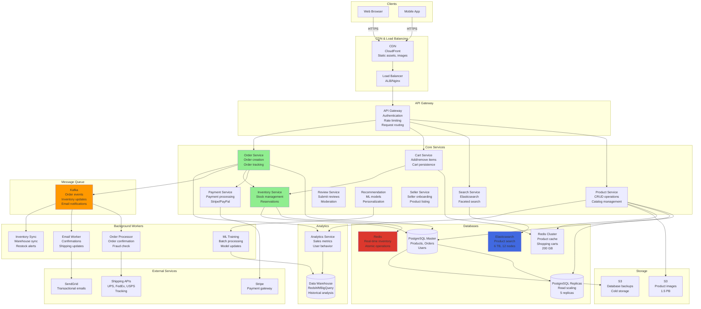

# E-commerce System (Amazon/Flipkart) System Design

## Step 1: Requirements Clarification

### Functional Requirements

**Product Catalog:**

- Browse products by category
- Search products (keyword, filters)
- View product details (images, specifications, reviews)
- Product variants (size, color, etc.)
- Compare products
- Track price history

**Shopping Experience:**

- Add to cart
- Save for later / Wishlist
- Apply coupons/discounts
- Calculate shipping costs
- Multiple payment methods
- Guest checkout

**Order Management:**

- Place order
- Track order status
- Cancel/return order
- View order history
- Download invoice

**Inventory Management:**

- Real-time inventory tracking
- Multi-warehouse support
- Stock alerts
- Reserve inventory during checkout

**Seller Management:**

- Seller registration
- Product listing
- Order fulfillment
- Earnings dashboard
- Seller ratings

**Reviews \& Ratings:**

- Write reviews
- Rate products
- Upload photos
- Verified purchase badge
- Helpful votes

**Recommendations:**

- Personalized recommendations
- "Customers who bought this also bought"
- Recently viewed items
- Similar products

**Flash Sales/Deals:**

- Time-limited deals
- Lightning deals
- Limited quantity sales
- Countdown timers

**Out of Scope:**

- Third-party marketplace integration
- Subscription services
- Live video shopping
- Social commerce features


### Non-Functional Requirements

**Scale (Based on 2025 data):**

- Daily orders: 12.87 million (Amazon) , 5.5 million (Flipkart)[^1][^2]
- Orders per second: 149 OPS (Amazon avg)[^1]
- Peak OPS: 1,000+ (flash sales, Prime Day)
- Total products: 600+ million (Amazon)[^1]
- Active sellers: 1.9 million (Amazon) , 1.4 million (Flipkart)[^3][^2]
- Registered users: 450 million (Flipkart)[^2]

**Performance:**

- Page load time: <2 seconds
- Search latency: <500ms
- Checkout completion: <30 seconds
- Inventory update: <1 second
- Flash sale support: 10K+ concurrent checkouts

**Reliability:**

- 99.99% uptime
- No double-booking of inventory
- No payment failures
- No lost orders
- Accurate billing

**Consistency:**

- Strong consistency for inventory
- Strong consistency for payments
- Eventual consistency for reviews
- Eventual consistency for recommendations

***

## Step 2: E-commerce Theory \& Concepts

### 2.1 Inventory Management - The Double Booking Problem

**Problem: Race Condition**

```
Scenario: Only 1 item left in stock

Time    User A                  User B                  Inventory
t0      View product (1 in stock)
t1                              View product (1 in stock)
t2      Add to cart (OK)
t3                              Add to cart (OK)        Still showing 1!
t4      Checkout (reserve 1)
t5                              Checkout (reserve 1)    ERROR: -1 stock!

Result: Double booking! Two users bought same item.
```

**Solution 1: Pessimistic Locking**

```sql
BEGIN TRANSACTION;

-- Lock the row
SELECT stock FROM inventory 
WHERE product_id = 'prod_123' 
FOR UPDATE;  -- Exclusive lock

-- Check if available
IF stock >= 1 THEN
    UPDATE inventory 
    SET stock = stock - 1 
    WHERE product_id = 'prod_123';
    
    -- Create order
    INSERT INTO orders (...);
    
    COMMIT;
ELSE
    ROLLBACK;
    -- Show "Out of Stock"
END IF;
```

**Pros:** Guaranteed consistency
**Cons:** Lower throughput (locks block other users)

**Solution 2: Optimistic Locking (Better for High Traffic)**

```sql
-- Read current version
SELECT stock, version 
FROM inventory 
WHERE product_id = 'prod_123';
-- Result: stock = 5, version = 10

-- Try to update with version check
UPDATE inventory 
SET stock = stock - 1, version = version + 1
WHERE product_id = 'prod_123' 
AND version = 10;  -- Only update if version unchanged

-- Check affected rows
IF affected_rows = 1 THEN
    -- Success! Create order
ELSE
    -- Conflict! Someone else updated. Retry.
    RETRY;
END IF;
```

**Pros:** Higher throughput
**Cons:** Retries needed on conflicts

**Solution 3: Pre-reservation (Amazon's Approach)**

```
1. User adds to cart
   → Reserve inventory for 15 minutes
   → Decrement available_stock
   → Increment reserved_stock

2. After 15 minutes (if not purchased)
   → Release reservation
   → Increment available_stock
   → Decrement reserved_stock

3. User completes purchase
   → Convert reservation to sale
   → Decrement reserved_stock
   → Order confirmed

Inventory States:
total_stock = physical_stock
available_stock = total_stock - reserved_stock - sold_stock
```


### 2.2 Product Search - Elasticsearch

**Why Elasticsearch for Product Search?**

```
Relational Database (PostgreSQL):
SELECT * FROM products 
WHERE name LIKE '%laptop%' 
   OR description LIKE '%laptop%'
ORDER BY relevance;

Problems:
❌ Full table scan
❌ No ranking/relevance
❌ Slow for large datasets (600M products)
❌ No typo tolerance
❌ No faceted search

Elasticsearch:
- Inverted index (word → documents)
- Full-text search with ranking (TF-IDF, BM25)
- Typo tolerance (fuzzy matching)
- Faceted search (filters by category, price, brand)
- Fast: <50ms for millions of documents
```

**Inverted Index Example:**

```
Documents:
Doc 1: "Apple MacBook Pro 16-inch Laptop"
Doc 2: "Dell XPS 15 Laptop Computer"
Doc 3: "Apple iPhone 14 Pro Max"

Inverted Index:
"apple"    → [Doc1, Doc3]
"macbook"  → [Doc1]
"laptop"   → [Doc1, Doc2]
"dell"     → [Doc2]
"iphone"   → [Doc3]

Search: "apple laptop"
1. Find documents with "apple": [Doc1, Doc3]
2. Find documents with "laptop": [Doc1, Doc2]
3. Intersect: Doc1
4. Rank by relevance (TF-IDF)
Result: Doc1 (MacBook)
```

**Faceted Search:**

```
Query: "laptop"

Results with facets:
Products: [...]

Facets:
Brand:
  - Apple (1,234)
  - Dell (876)
  - HP (654)

Price:
  - $0-$500 (2,345)
  - $500-$1000 (1,234)
  - $1000+ (876)

Screen Size:
  - 13" (567)
  - 15" (1,234)
  - 17" (345)
```


### 2.3 Shopping Cart - Session Management

**Problem: Where to Store Cart?**

**Option 1: Server-Side Session**

```
User adds item → Store in Redis
Key: session:user_123
Value: {
  "items": [
    {"product_id": "prod_456", "quantity": 2},
    {"product_id": "prod_789", "quantity": 1}
  ],
  "expires_at": 1728134400
}

Pros:
✅ Centralized
✅ Survives page refresh
✅ Can merge across devices

Cons:
❌ Requires user to be logged in
❌ Server storage cost
```

**Option 2: Client-Side (Cookies/LocalStorage)**

```javascript
// Store cart in browser localStorage
localStorage.setItem('cart', JSON.stringify([
  {product_id: 'prod_456', quantity: 2},
  {product_id: 'prod_789', quantity: 1}
]));

Pros:
✅ No server load
✅ Works for guest users
✅ Fast access

Cons:
❌ Lost if user clears browser data
❌ Can't sync across devices
❌ Size limit (5-10 MB)
```

**Amazon's Hybrid Approach:**

```
Logged-in users:
- Store cart server-side (DynamoDB)
- Sync across devices
- Persist indefinitely

Guest users:
- Store cart client-side (cookies)
- On login, merge with server cart
```


### 2.4 Flash Sales - Handling Traffic Spikes

**Challenge: 10,000+ concurrent users buying 100 items**

```
Normal traffic: 100 requests/sec
Flash sale traffic: 10,000 requests/sec (100x spike!)

Without optimization:
- Database overload
- Inventory conflicts
- System crash
```

**Solution: Queue-Based Approach**

```
1. User clicks "Buy Now"
   → Add to purchase queue (Kafka/Redis Stream)
   → Show "In Queue" message
   → Position in queue: 5,432

2. Background workers process queue (FIFO)
   → Dequeue request
   → Check inventory (atomic decrement)
   → If available: Create order
   → If sold out: Notify user

3. Worker throughput: 1,000 orders/sec
   → 10,000 requests → 10 seconds to process
   → Fair (first-come-first-served)

Result: System stable, fair allocation
```

**Redis Atomic Inventory:**

```lua
-- Lua script executed atomically in Redis
local stock = redis.call('GET', 'stock:prod_123')
if tonumber(stock) >= 1 then
    redis.call('DECR', 'stock:prod_123')
    return 1  -- Success
else
    return 0  -- Out of stock
end
```


### 2.5 Recommendation Engine

**Collaborative Filtering:**

```
User-Item Matrix:
         Product1  Product2  Product3
User A      5        3         -
User B      4        -         5
User C      -        4         4

Find similar users:
User A and User B both like Product1 (5 and 4)
→ Recommend Product3 to User A (User B liked it)

Algorithm: Matrix Factorization (SVD, ALS)
```

**Item-Based Filtering (Amazon's "Customers who bought"):**

```
Item Similarity Matrix:
           Product1  Product2  Product3
Product1      1.0      0.7       0.3
Product2      0.7      1.0       0.8
Product3      0.3      0.8       1.0

User bought Product1
→ Recommend Product2 (similarity: 0.7)

Calculate similarity: Cosine similarity, Jaccard similarity
```


***

## Step 3: Capacity Estimation

```
Orders & Traffic:
Daily orders: 12.87 million (Amazon) [web:333]
Orders per second (avg): 149 OPS [web:333]
Orders per second (peak): 1,000 OPS (Prime Day)
Orders per minute (flash sale): 130,000 orders [web:333]

Average order value: $52 [web:343]
Daily revenue: 12.87M × $52 = $669M/day
Annual revenue: $244B

Users:
Registered users: 450 million (Flipkart) [web:335]
Daily active users: ~30 million (estimate)
Concurrent users (normal): 1 million
Concurrent users (flash sale): 10 million

Products:
Total products: 600 million (Amazon) [web:333]
Active products: ~300 million
Product SKUs per seller: ~50 average
New products daily: 1 million

Sellers:
Total sellers: 9.7 million (Amazon) [web:334]
Active sellers: 1.9 million [web:334]
Orders per seller per day: 12.87M / 1.9M = 6.8 orders

Page Views:
Daily page views: 500 million (estimate)
Pages per session: 10
Session duration: 15 minutes
Bounce rate: 40%

Search:
Search queries per day: 100 million
Search queries per second: 1,157 QPS
Average results per query: 50
Search latency target: <200ms

Shopping Cart:
Active carts: 30M DAU × 20% conversion = 6M active carts
Cart abandonment rate: 70%
Completed checkouts: 6M × 30% = 1.8M
Cart expiration: 90 days

Database Operations:
Product reads: 500M page views × 1 product = 500M reads/day = 5,787 reads/sec
Inventory updates: 149 orders/sec × 2 (add to cart + checkout) = 298 writes/sec
Order writes: 149 writes/sec
Review writes: 149 orders/sec × 10% review rate = 15 writes/sec
Total writes: ~500 writes/sec

Storage:
Products: 600M × 10 KB (images, description) = 6 TB
Product images: 600M × 5 images × 500 KB = 1.5 PB
Orders: 12.87M/day × 365 days × 2 years × 5 KB = 47 TB
Reviews: 600M products × 10 reviews × 2 KB = 12 TB
User data: 450M users × 5 KB = 2.25 TB
Total: ~1.5 PB (mostly images)

Elasticsearch Index:
Product catalog: 600M documents × 5 KB = 3 TB
With replicas (2x): 6 TB
Shards: 6 TB / 50 GB per shard = 120 shards
Nodes: 120 shards / 10 shards per node = 12 nodes

Cache (Redis):
Hot products (10%): 60M products × 2 KB = 120 GB
Shopping carts: 6M carts × 5 KB = 30 GB
Session data: 1M concurrent × 2 KB = 2 GB
Product inventory: 300M products × 100 bytes = 30 GB
Total: ~200 GB

CDN:
Product images: 1.5 PB
Cache hit rate: 95%
Origin load: 5% × 500M views/day = 25M requests/day
Edge servers: 200 PoPs worldwide

Payment Processing:
Transactions per day: 12.87M
Average transaction: $52
Payment gateway fee: 2.9% + $0.30
Daily fees: 12.87M × ($52 × 0.029 + $0.30) = $23M/day
Annual payment processing: $8.4B

Network Bandwidth:
Product page views: 500M/day × 2 MB = 1 PB/day (with CDN caching)
Search API: 100M queries/day × 50 KB = 5 TB/day
Checkout: 12.87M orders × 100 KB = 1.3 TB/day
Total: ~1 PB/day (mostly images via CDN)
```


***

## Step 4: API Design

### Product APIs

```json
GET /api/v1/products/{product_id}

Response: 200 OK
{
  "product_id": "B08N5WRWNW",
  "title": "Apple MacBook Pro 16-inch, M3 Pro",
  "brand": "Apple",
  "category": "Electronics > Computers > Laptops",
  "price": {
    "currency": "USD",
    "amount": 2499.00,
    "original_price": 2799.00,
    "discount_percent": 11
  },
  "availability": {
    "in_stock": true,
    "stock_count": 47,  // May not show exact count
    "delivery_estimate": "Oct 6-8"
  },
  "seller": {
    "seller_id": "seller_amazon",
    "name": "Amazon.com",
    "rating": 4.8,
    "is_prime": true
  },
  "images": [
    "https://cdn.amazon.com/images/prod1_1.jpg",
    "https://cdn.amazon.com/images/prod1_2.jpg"
  ],
  "specifications": {
    "screen_size": "16 inches",
    "processor": "Apple M3 Pro",
    "ram": "18GB",
    "storage": "512GB SSD"
  },
  "ratings": {
    "average": 4.7,
    "count": 12453,
    "distribution": {
      "5_star": 8234,
      "4_star": 2456,
      "3_star": 987,
      "2_star": 456,
      "1_star": 320
    }
  }
}

GET /api/v1/search?q=laptop&category=electronics&min_price=500&max_price=2000&sort=price_asc&page=1

Response: 200 OK
{
  "query": "laptop",
  "total_results": 15234,
  "page": 1,
  "per_page": 20,
  "results": [
    {
      "product_id": "B08N5WRWNW",
      "title": "Apple MacBook Pro 16-inch",
      "price": 2499.00,
      "image": "https://cdn.amazon.com/thumb.jpg",
      "rating": 4.7,
      "is_prime": true
    }
  ],
  "facets": {
    "brands": [
      {"name": "Apple", "count": 234},
      {"name": "Dell", "count": 567}
    ],
    "price_ranges": [
      {"range": "$500-$1000", "count": 3456},
      {"range": "$1000-$2000", "count": 2345}
    ]
  }
}
```


### Cart APIs

```json
POST /api/v1/cart/items
Authorization: Bearer <token>

Request:
{
  "product_id": "B08N5WRWNW",
  "quantity": 1,
  "seller_id": "seller_amazon"
}

Response: 201 Created
{
  "cart_id": "cart_xyz789",
  "item_id": "item_abc123",
  "total_items": 3,
  "subtotal": 3497.00,
  "currency": "USD"
}

GET /api/v1/cart

Response: 200 OK
{
  "cart_id": "cart_xyz789",
  "items": [
    {
      "item_id": "item_abc123",
      "product_id": "B08N5WRWNW",
      "title": "Apple MacBook Pro 16-inch",
      "price": 2499.00,
      "quantity": 1,
      "seller_id": "seller_amazon",
      "in_stock": true,
      "image": "https://cdn.amazon.com/thumb.jpg"
    }
  ],
  "pricing": {
    "subtotal": 3497.00,
    "shipping": 0,
    "tax": 279.76,
    "discount": -100.00,
    "total": 3676.76,
    "currency": "USD"
  },
  "savings": {
    "coupons_applied": ["SAVE100"],
    "total_savings": 100.00
  }
}

DELETE /api/v1/cart/items/{item_id}

Response: 204 No Content
```


### Checkout APIs

```json
POST /api/v1/checkout/initiate
Request:
{
  "cart_id": "cart_xyz789",
  "shipping_address_id": "addr_123",
  "payment_method_id": "pm_456"
}

Response: 200 OK
{
  "checkout_id": "checkout_def789",
  "order_summary": {
    "items_count": 3,
    "subtotal": 3497.00,
    "shipping": 0,
    "tax": 279.76,
    "total": 3776.76
  },
  "delivery_estimate": "Oct 6-8, 2025",
  "requires_3ds": false  // 3D Secure authentication
}

POST /api/v1/orders
Request:
{
  "checkout_id": "checkout_def789",
  "payment_nonce": "nonce_from_payment_gateway"
}

Response: 201 Created
{
  "order_id": "112-7854396-1435065",
  "status": "confirmed",
  "total": 3776.76,
  "currency": "USD",
  "estimated_delivery": "2025-10-08",
  "tracking_url": "https://amazon.com/track/112-7854396-1435065"
}

GET /api/v1/orders/{order_id}

Response: 200 OK
{
  "order_id": "112-7854396-1435065",
  "status": "shipped",  // confirmed, processing, shipped, delivered, cancelled
  "ordered_at": "2025-10-04T16:22:00Z",
  "items": [...],
  "shipping": {
    "address": {...},
    "carrier": "UPS",
    "tracking_number": "1Z999AA10123456784",
    "estimated_delivery": "2025-10-08"
  },
  "payment": {
    "method": "Visa ending in 1234",
    "amount": 3776.76
  },
  "timeline": [
    {
      "status": "confirmed",
      "timestamp": "2025-10-04T16:22:00Z",
      "location": "Order placed"
    },
    {
      "status": "shipped",
      "timestamp": "2025-10-05T10:00:00Z",
      "location": "San Francisco, CA"
    }
  ]
}
```


### Review APIs

```json
POST /api/v1/products/{product_id}/reviews
Request:
{
  "order_id": "112-7854396-1435065",  // Verified purchase
  "rating": 5,
  "title": "Excellent laptop!",
  "content": "Fast, great display, battery lasts all day.",
  "images": ["https://upload.amazon.com/review1.jpg"]
}

Response: 201 Created
{
  "review_id": "review_xyz789",
  "verified_purchase": true,
  "posted_at": "2025-10-10T12:00:00Z"
}

GET /api/v1/products/{product_id}/reviews?sort=helpful&page=1

Response: 200 OK
{
  "product_id": "B08N5WRWNW",
  "average_rating": 4.7,
  "total_reviews": 12453,
  "reviews": [
    {
      "review_id": "review_abc123",
      "user_name": "John D.",
      "rating": 5,
      "title": "Best laptop I've owned",
      "content": "Amazing performance...",
      "posted_at": "2025-10-01T10:00:00Z",
      "verified_purchase": true,
      "helpful_votes": 234,
      "total_votes": 256,
      "images": [...]
    }
  ]
}
```


***

## Step 5: Database Design

### PostgreSQL Schema (Core Transactional Data)

```sql
-- Users
CREATE TABLE users (
    user_id BIGSERIAL PRIMARY KEY,
    email VARCHAR(255) UNIQUE NOT NULL,
    password_hash VARCHAR(255),
    first_name VARCHAR(100),
    last_name VARCHAR(100),
    phone VARCHAR(20),
    created_at TIMESTAMPTZ DEFAULT NOW(),
    last_login TIMESTAMPTZ,
    is_prime_member BOOLEAN DEFAULT FALSE,
    
    INDEX idx_email (email)
);

-- Addresses
CREATE TABLE addresses (
    address_id BIGSERIAL PRIMARY KEY,
    user_id BIGINT REFERENCES users(user_id),
    address_line1 VARCHAR(255) NOT NULL,
    address_line2 VARCHAR(255),
    city VARCHAR(100),
    state VARCHAR(100),
    postal_code VARCHAR(20),
    country VARCHAR(2),
    is_default BOOLEAN DEFAULT FALSE,
    
    INDEX idx_user_addresses (user_id)
);

-- Sellers
CREATE TABLE sellers (
    seller_id BIGSERIAL PRIMARY KEY,
    user_id BIGINT REFERENCES users(user_id),
    business_name VARCHAR(255) NOT NULL,
    business_email VARCHAR(255),
    tax_id VARCHAR(50),
    rating DECIMAL(3,2) DEFAULT 5.0,
    total_sales BIGINT DEFAULT 0,
    created_at TIMESTAMPTZ DEFAULT NOW(),
    
    INDEX idx_user_seller (user_id)
);

-- Categories
CREATE TABLE categories (
    category_id BIGSERIAL PRIMARY KEY,
    parent_category_id BIGINT REFERENCES categories(category_id),
    name VARCHAR(100) NOT NULL,
    slug VARCHAR(100) UNIQUE NOT NULL,
    level INT DEFAULT 0,
    
    INDEX idx_parent (parent_category_id)
);

-- Products
CREATE TABLE products (
    product_id VARCHAR(20) PRIMARY KEY,  -- ASIN format: B08N5WRWNW
    seller_id BIGINT REFERENCES sellers(seller_id),
    category_id BIGINT REFERENCES categories(category_id),
    title VARCHAR(500) NOT NULL,
    brand VARCHAR(100),
    description TEXT,
    specifications JSONB,
    
    -- Pricing
    price DECIMAL(10,2) NOT NULL,
    original_price DECIMAL(10,2),
    currency VARCHAR(3) DEFAULT 'USD',
    
    -- Status
    status VARCHAR(20) DEFAULT 'active',  -- active, inactive, out_of_stock
    created_at TIMESTAMPTZ DEFAULT NOW(),
    updated_at TIMESTAMPTZ DEFAULT NOW(),
    
    -- Metrics
    view_count BIGINT DEFAULT 0,
    order_count BIGINT DEFAULT 0,
    
    INDEX idx_seller_products (seller_id),
    INDEX idx_category (category_id),
    INDEX idx_status (status),
    FULLTEXT INDEX idx_search (title, brand, description)
);

-- Product images
CREATE TABLE product_images (
    image_id BIGSERIAL PRIMARY KEY,
    product_id VARCHAR(20) REFERENCES products(product_id),
    image_url TEXT NOT NULL,
    position INT DEFAULT 0,
    
    INDEX idx_product_images (product_id, position)
);

-- Inventory (critical for stock management)
CREATE TABLE inventory (
    inventory_id BIGSERIAL PRIMARY KEY,
    product_id VARCHAR(20) REFERENCES products(product_id),
    warehouse_id BIGINT REFERENCES warehouses(warehouse_id),
    
    total_stock INT NOT NULL DEFAULT 0,
    available_stock INT NOT NULL DEFAULT 0,
    reserved_stock INT NOT NULL DEFAULT 0,
    
    -- Optimistic locking
    version BIGINT DEFAULT 0,
    
    updated_at TIMESTAMPTZ DEFAULT NOW(),
    
    UNIQUE(product_id, warehouse_id),
    CHECK (total_stock >= 0),
    CHECK (available_stock >= 0),
    CHECK (reserved_stock >= 0),
    CHECK (total_stock = available_stock + reserved_stock)
);

-- Shopping cart
CREATE TABLE shopping_carts (
    cart_id BIGSERIAL PRIMARY KEY,
    user_id BIGINT REFERENCES users(user_id),
    created_at TIMESTAMPTZ DEFAULT NOW(),
    updated_at TIMESTAMPTZ DEFAULT NOW(),
    expires_at TIMESTAMPTZ,
    
    UNIQUE(user_id)
);

CREATE TABLE cart_items (
    cart_item_id BIGSERIAL PRIMARY KEY,
    cart_id BIGINT REFERENCES shopping_carts(cart_id) ON DELETE CASCADE,
    product_id VARCHAR(20) REFERENCES products(product_id),
    seller_id BIGINT REFERENCES sellers(seller_id),
    quantity INT NOT NULL DEFAULT 1,
    price DECIMAL(10,2) NOT NULL,
    added_at TIMESTAMPTZ DEFAULT NOW(),
    
    INDEX idx_cart_items (cart_id)
);

-- Orders
CREATE TABLE orders (
    order_id VARCHAR(50) PRIMARY KEY,  -- 112-7854396-1435065 format
    user_id BIGINT REFERENCES users(user_id),
    
    status VARCHAR(20) NOT NULL DEFAULT 'confirmed',
    -- confirmed, processing, shipped, delivered, cancelled, returned
    
    -- Pricing
    subtotal DECIMAL(10,2) NOT NULL,
    shipping_cost DECIMAL(10,2) DEFAULT 0,
    tax DECIMAL(10,2) DEFAULT 0,
    discount DECIMAL(10,2) DEFAULT 0,
    total DECIMAL(10,2) NOT NULL,
    currency VARCHAR(3) DEFAULT 'USD',
    
    -- Addresses
    shipping_address_id BIGINT REFERENCES addresses(address_id),
    billing_address_id BIGINT REFERENCES addresses(address_id),
    
    -- Payment
    payment_method VARCHAR(50),
    payment_status VARCHAR(20) DEFAULT 'pending',
    
    -- Timestamps
    ordered_at TIMESTAMPTZ DEFAULT NOW(),
    shipped_at TIMESTAMPTZ,
    delivered_at TIMESTAMPTZ,
    
    INDEX idx_user_orders (user_id, ordered_at DESC),
    INDEX idx_status (status),
    INDEX idx_ordered_at (ordered_at DESC)
) PARTITION BY RANGE (ordered_at);

-- Partition by month
CREATE TABLE orders_2025_10 PARTITION OF orders
    FOR VALUES FROM ('2025-10-01') TO ('2025-11-01');

-- Order items
CREATE TABLE order_items (
    order_item_id BIGSERIAL PRIMARY KEY,
    order_id VARCHAR(50) REFERENCES orders(order_id),
    product_id VARCHAR(20) REFERENCES products(product_id),
    seller_id BIGINT REFERENCES sellers(seller_id),
    
    quantity INT NOT NULL,
    unit_price DECIMAL(10,2) NOT NULL,
    subtotal DECIMAL(10,2) NOT NULL,
    
    -- Fulfillment
    fulfillment_status VARCHAR(20) DEFAULT 'pending',
    tracking_number VARCHAR(100),
    carrier VARCHAR(50),
    
    INDEX idx_order_items (order_id)
);

-- Reviews
CREATE TABLE product_reviews (
    review_id BIGSERIAL PRIMARY KEY,
    product_id VARCHAR(20) REFERENCES products(product_id),
    user_id BIGINT REFERENCES users(user_id),
    order_id VARCHAR(50) REFERENCES orders(order_id),  -- Verified purchase
    
    rating INT NOT NULL CHECK (rating BETWEEN 1 AND 5),
    title VARCHAR(200),
    content TEXT,
    
    helpful_votes INT DEFAULT 0,
    total_votes INT DEFAULT 0,
    
    verified_purchase BOOLEAN DEFAULT FALSE,
    posted_at TIMESTAMPTZ DEFAULT NOW(),
    
    INDEX idx_product_reviews (product_id, posted_at DESC),
    INDEX idx_user_reviews (user_id)
);

-- Payment methods
CREATE TABLE payment_methods (
    payment_method_id BIGSERIAL PRIMARY KEY,
    user_id BIGINT REFERENCES users(user_id),
    type VARCHAR(20),  -- credit_card, debit_card, upi, wallet
    provider VARCHAR(50),  -- visa, mastercard, paypal
    last_four VARCHAR(4),
    is_default BOOLEAN DEFAULT FALSE,
    
    -- Tokenized (never store raw card numbers!)
    payment_token VARCHAR(255),
    
    INDEX idx_user_payments (user_id)
);
```


### Redis Cache (Hot Data)

```redis
# Product cache (hot products)
HSET product:B08N5WRWNW "title" "MacBook Pro" "price" "2499.00" "stock" "47"
EXPIRE product:B08N5WRWNW 3600  # 1 hour

# Shopping cart (server-side for logged-in users)
HSET cart:user_123 "prod1" "2" "prod2" "1"
EXPIRE cart:user_123 7776000  # 90 days

# Inventory (real-time stock)
SET stock:B08N5WRWNW 47
DECR stock:B08N5WRWNW  # Atomic decrement

# Flash sale queue
LPUSH flash_sale:prod_123 "user_456"
LPUSH flash_sale:prod_123 "user_789"
BRPOP flash_sale:prod_123 5  # Process queue

# Session data
SETEX session:sess_xyz "user_id=123&cart_id=456" 1800  # 30 minutes

# Product views (for trending)
ZINCRBY trending:electronics 1 "B08N5WRWNW"
ZREVRANGE trending:electronics 0 9 WITHSCORES  # Top 10

# Recently viewed (per user)
LPUSH recent:user_123 "B08N5WRWNW"
LTRIM recent:user_123 0 19  # Keep last 20

# Price drop alerts
ZADD price_watch:user_123 2000 "B08N5WRWNW"  # Alert if price < $2000
```


### Elasticsearch Index (Product Search)

```json
PUT /products
{
  "settings": {
    "number_of_shards": 12,
    "number_of_replicas": 1,
    "analysis": {
      "analyzer": {
        "product_analyzer": {
          "type": "custom",
          "tokenizer": "standard",
          "filter": ["lowercase", "stop", "snowball"]
        }
      }
    }
  },
  "mappings": {
    "properties": {
      "product_id": {"type": "keyword"},
      "title": {
        "type": "text",
        "analyzer": "product_analyzer",
        "fields": {
          "keyword": {"type": "keyword"}
        }
      },
      "brand": {"type": "keyword"},
      "category": {"type": "keyword"},
      "description": {"type": "text"},
      "price": {"type": "float"},
      "rating": {"type": "float"},
      "review_count": {"type": "integer"},
      "in_stock": {"type": "boolean"},
      "created_at": {"type": "date"},
      "specifications": {"type": "object", "enabled": false}
    }
  }
}
```


***

## Step 6: High-Level Architecture




***

Due to length constraints, I'll continue with the C++ implementation in the next message. Would you like me to proceed with:

1. **Core Implementation (C++):** Inventory management, cart service, order processing
2. **Advanced Features:** Flash sales, recommendation engine
3. **Bottlenecks \& Optimizations**


## Step 7: Core Implementation (C++)

### 7.1 Inventory Management Service

```cpp
#include <string>
#include <mutex>
#include <atomic>
#include <optional>

struct InventoryItem {
    std::string product_id;
    int total_stock;
    int available_stock;
    int reserved_stock;
    int64_t version;  // For optimistic locking
    std::chrono::system_clock::time_point updated_at;
};

struct ReservationResult {
    bool success;
    std::string reservation_id;
    int quantity_reserved;
    std::chrono::system_clock::time_point expires_at;
};

class InventoryService {
private:
    DatabaseConnection db_;
    RedisClient redis_;
    
    // In-memory cache for hot products
    std::unordered_map<std::string, InventoryItem> inventory_cache_;
    std::shared_mutex cache_mtx_;
    
    // Reservation tracking
    struct Reservation {
        std::string product_id;
        std::string user_id;
        int quantity;
        std::chrono::system_clock::time_point expires_at;
    };
    std::unordered_map<std::string, Reservation> active_reservations_;
    std::mutex reservations_mtx_;
    
    // Background thread for cleanup
    std::thread cleanup_thread_;
    std::atomic<bool> running_{false};
    
public:
    InventoryService(DatabaseConnection& db, RedisClient& redis)
        : db_(db), redis_(redis) {}
    
    void start() {
        running_ = true;
        
        // Start cleanup thread for expired reservations
        cleanup_thread_ = std::thread([this]() {
            cleanupExpiredReservations();
        });
        
        std::cout << "Inventory service started" << std::endl;
    }
    
    void stop() {
        running_ = false;
        if (cleanup_thread_.joinable()) {
            cleanup_thread_.join();
        }
    }
    
    // Check if product is in stock
    bool checkAvailability(const std::string& product_id, int quantity = 1) {
        // Try Redis first (hot products)
        auto stock = redis_.get("stock:" + product_id);
        if (stock) {
            return std::stoi(*stock) >= quantity;
        }
        
        // Fallback to database
        auto inventory = getInventory(product_id);
        if (!inventory) {
            return false;
        }
        
        return inventory->available_stock >= quantity;
    }
    
    // Reserve inventory (for shopping cart)
    ReservationResult reserveInventory(const std::string& product_id,
                                       const std::string& user_id,
                                       int quantity,
                                       int ttl_minutes = 15) {
        ReservationResult result{false, "", 0, {}};
        
        // Use optimistic locking with retry
        int max_retries = 3;
        for (int attempt = 0; attempt < max_retries; ++attempt) {
            try {
                // Get current inventory
                auto inventory = getInventory(product_id);
                if (!inventory) {
                    std::cerr << "Product not found: " << product_id << std::endl;
                    return result;
                }
                
                // Check availability
                if (inventory->available_stock < quantity) {
                    std::cout << "Insufficient stock for " << product_id 
                             << " (requested: " << quantity 
                             << ", available: " << inventory->available_stock << ")" << std::endl;
                    return result;
                }
                
                // Update database with optimistic lock
                std::string update_query = R"(
                    UPDATE inventory
                    SET available_stock = available_stock - ?,
                        reserved_stock = reserved_stock + ?,
                        version = version + 1,
                        updated_at = NOW()
                    WHERE product_id = ? 
                      AND version = ?
                      AND available_stock >= ?
                )";
                
                int rows_affected = db_.execute(update_query,
                                                quantity,
                                                quantity,
                                                product_id,
                                                inventory->version,
                                                quantity);
                
                if (rows_affected == 0) {
                    // Conflict! Someone else modified inventory
                    std::cout << "Optimistic lock conflict, retrying... (attempt " 
                             << (attempt + 1) << ")" << std::endl;
                    std::this_thread::sleep_for(std::chrono::milliseconds(50));
                    continue;  // Retry
                }
                
                // Success! Create reservation record
                std::string reservation_id = generateReservationId();
                auto expires_at = std::chrono::system_clock::now() + 
                                 std::chrono::minutes(ttl_minutes);
                
                {
                    std::lock_guard<std::mutex> lock(reservations_mtx_);
                    active_reservations_[reservation_id] = {
                        product_id, user_id, quantity, expires_at
                    };
                }
                
                // Update Redis
                redis_.decrby("stock:" + product_id, quantity);
                
                result.success = true;
                result.reservation_id = reservation_id;
                result.quantity_reserved = quantity;
                result.expires_at = expires_at;
                
                std::cout << "Reserved " << quantity << " units of " << product_id 
                         << " (reservation: " << reservation_id << ")" << std::endl;
                
                return result;
                
            } catch (const std::exception& e) {
                std::cerr << "Error reserving inventory: " << e.what() << std::endl;
                if (attempt == max_retries - 1) {
                    throw;
                }
            }
        }
        
        std::cerr << "Failed to reserve inventory after " << max_retries << " attempts" << std::endl;
        return result;
    }
    
    // Confirm reservation (convert to sale)
    bool confirmReservation(const std::string& reservation_id) {
        std::lock_guard<std::mutex> lock(reservations_mtx_);
        
        auto it = active_reservations_.find(reservation_id);
        if (it == active_reservations_.end()) {
            std::cerr << "Reservation not found: " << reservation_id << std::endl;
            return false;
        }
        
        const auto& reservation = it->second;
        
        // Update database: reserved → sold
        std::string update_query = R"(
            UPDATE inventory
            SET reserved_stock = reserved_stock - ?,
                total_stock = total_stock - ?
            WHERE product_id = ?
        )";
        
        db_.execute(update_query,
                   reservation.quantity,
                   reservation.quantity,
                   reservation.product_id);
        
        // Remove reservation
        active_reservations_.erase(it);
        
        std::cout << "Confirmed reservation: " << reservation_id << std::endl;
        
        return true;
    }
    
    // Cancel reservation (release inventory)
    bool cancelReservation(const std::string& reservation_id) {
        std::lock_guard<std::mutex> lock(reservations_mtx_);
        
        auto it = active_reservations_.find(reservation_id);
        if (it == active_reservations_.end()) {
            return false;
        }
        
        const auto& reservation = it->second;
        
        // Release inventory
        std::string update_query = R"(
            UPDATE inventory
            SET available_stock = available_stock + ?,
                reserved_stock = reserved_stock - ?
            WHERE product_id = ?
        )";
        
        db_.execute(update_query,
                   reservation.quantity,
                   reservation.quantity,
                   reservation.product_id);
        
        // Update Redis
        redis_.incrby("stock:" + reservation.product_id, reservation.quantity);
        
        active_reservations_.erase(it);
        
        std::cout << "Cancelled reservation: " << reservation_id << std::endl;
        
        return true;
    }
    
    // Get current inventory
    std::optional<InventoryItem> getInventory(const std::string& product_id) {
        // Check cache
        {
            std::shared_lock<std::shared_mutex> lock(cache_mtx_);
            auto it = inventory_cache_.find(product_id);
            if (it != inventory_cache_.end()) {
                return it->second;
            }
        }
        
        // Query database
        std::string query = R"(
            SELECT product_id, total_stock, available_stock, reserved_stock, version, updated_at
            FROM inventory
            WHERE product_id = ?
        )";
        
        auto result = db_.query(query, product_id);
        if (result.empty()) {
            return std::nullopt;
        }
        
        InventoryItem item;
        item.product_id = result[^0]["product_id"];
        item.total_stock = std::stoi(result[^0]["total_stock"]);
        item.available_stock = std::stoi(result[^0]["available_stock"]);
        item.reserved_stock = std::stoi(result[^0]["reserved_stock"]);
        item.version = std::stoll(result[^0]["version"]);
        
        // Update cache
        {
            std::unique_lock<std::shared_mutex> lock(cache_mtx_);
            inventory_cache_[product_id] = item;
        }
        
        return item;
    }
    
private:
    void cleanupExpiredReservations() {
        while (running_) {
            std::this_thread::sleep_for(std::chrono::seconds(60));  // Check every minute
            
            auto now = std::chrono::system_clock::now();
            std::vector<std::string> expired;
            
            {
                std::lock_guard<std::mutex> lock(reservations_mtx_);
                
                for (const auto& [id, reservation] : active_reservations_) {
                    if (reservation.expires_at < now) {
                        expired.push_back(id);
                    }
                }
            }
            
            // Release expired reservations
            for (const auto& id : expired) {
                cancelReservation(id);
                std::cout << "Released expired reservation: " << id << std::endl;
            }
        }
    }
    
    std::string generateReservationId() {
        return "rsv_" + std::to_string(std::time(nullptr)) + "_" + 
               std::to_string(rand() % 10000);
    }
};
```


### 7.2 Shopping Cart Service

```cpp
#include <vector>

struct CartItem {
    std::string product_id;
    std::string title;
    double price;
    int quantity;
    std::string seller_id;
    bool in_stock;
    std::string reservation_id;  // Inventory reservation
};

struct Cart {
    std::string cart_id;
    std::string user_id;
    std::vector<CartItem> items;
    double subtotal;
    std::chrono::system_clock::time_point updated_at;
    
    double calculateSubtotal() const {
        double total = 0;
        for (const auto& item : items) {
            total += item.price * item.quantity;
        }
        return total;
    }
};

class ShoppingCartService {
private:
    RedisClient redis_;
    DatabaseConnection db_;
    InventoryService& inventory_service_;
    
public:
    ShoppingCartService(RedisClient& redis, 
                       DatabaseConnection& db,
                       InventoryService& inventory_svc)
        : redis_(redis), db_(db), inventory_service_(inventory_svc) {}
    
    // Add item to cart
    bool addToCart(const std::string& user_id,
                  const std::string& product_id,
                  int quantity) {
        std::cout << "Adding to cart: user=" << user_id 
                 << ", product=" << product_id 
                 << ", quantity=" << quantity << std::endl;
        
        // Check product availability
        if (!inventory_service_.checkAvailability(product_id, quantity)) {
            std::cerr << "Product out of stock: " << product_id << std::endl;
            return false;
        }
        
        // Get product details
        auto product = getProduct(product_id);
        if (!product) {
            std::cerr << "Product not found: " << product_id << std::endl;
            return false;
        }
        
        // Reserve inventory
        auto reservation = inventory_service_.reserveInventory(
            product_id, user_id, quantity, 15  // 15 minutes TTL
        );
        
        if (!reservation.success) {
            return false;
        }
        
        // Add to cart in Redis
        std::string cart_key = "cart:" + user_id;
        
        CartItem item;
        item.product_id = product_id;
        item.title = product->title;
        item.price = product->price;
        item.quantity = quantity;
        item.seller_id = product->seller_id;
        item.in_stock = true;
        item.reservation_id = reservation.reservation_id;
        
        // Serialize cart item
        json item_json = {
            {"product_id", item.product_id},
            {"title", item.title},
            {"price", item.price},
            {"quantity", item.quantity},
            {"seller_id", item.seller_id},
            {"reservation_id", item.reservation_id}
        };
        
        redis_.hset(cart_key, product_id, item_json.dump());
        redis_.expire(cart_key, 7776000);  // 90 days
        
        std::cout << "Added to cart successfully (reservation: " 
                 << reservation.reservation_id << ")" << std::endl;
        
        return true;
    }
    
    // Remove item from cart
    bool removeFromCart(const std::string& user_id,
                       const std::string& product_id) {
        std::string cart_key = "cart:" + user_id;
        
        // Get item to cancel reservation
        auto item_str = redis_.hget(cart_key, product_id);
        if (item_str) {
            json item_json = json::parse(*item_str);
            std::string reservation_id = item_json["reservation_id"];
            
            // Cancel inventory reservation
            inventory_service_.cancelReservation(reservation_id);
        }
        
        // Remove from cart
        redis_.hdel(cart_key, product_id);
        
        std::cout << "Removed from cart: user=" << user_id 
                 << ", product=" << product_id << std::endl;
        
        return true;
    }
    
    // Get cart
    Cart getCart(const std::string& user_id) {
        Cart cart;
        cart.user_id = user_id;
        cart.cart_id = "cart_" + user_id;
        
        std::string cart_key = "cart:" + user_id;
        auto items_map = redis_.hgetall(cart_key);
        
        for (const auto& [product_id, item_str] : items_map) {
            json item_json = json::parse(item_str);
            
            CartItem item;
            item.product_id = item_json["product_id"];
            item.title = item_json["title"];
            item.price = item_json["price"];
            item.quantity = item_json["quantity"];
            item.seller_id = item_json["seller_id"];
            item.reservation_id = item_json["reservation_id"];
            
            // Check if still in stock
            item.in_stock = inventory_service_.checkAvailability(
                product_id, item.quantity
            );
            
            cart.items.push_back(item);
        }
        
        cart.subtotal = cart.calculateSubtotal();
        cart.updated_at = std::chrono::system_clock::now();
        
        return cart;
    }
    
    // Clear cart
    void clearCart(const std::string& user_id) {
        // Cancel all reservations
        auto cart = getCart(user_id);
        for (const auto& item : cart.items) {
            inventory_service_.cancelReservation(item.reservation_id);
        }
        
        // Delete cart
        std::string cart_key = "cart:" + user_id;
        redis_.del(cart_key);
        
        std::cout << "Cleared cart for user: " << user_id << std::endl;
    }
    
private:
    struct Product {
        std::string product_id;
        std::string title;
        double price;
        std::string seller_id;
    };
    
    std::optional<Product> getProduct(const std::string& product_id) {
        // Query from database or cache
        std::string query = R"(
            SELECT product_id, title, price, seller_id
            FROM products
            WHERE product_id = ?
        )";
        
        auto result = db_.query(query, product_id);
        if (result.empty()) {
            return std::nullopt;
        }
        
        Product product;
        product.product_id = result[^0]["product_id"];
        product.title = result[^0]["title"];
        product.price = std::stod(result[^0]["price"]);
        product.seller_id = result[^0]["seller_id"];
        
        return product;
    }
};
```


### 7.3 Order Processing Service

```cpp
struct OrderRequest {
    std::string user_id;
    std::string cart_id;
    std::string shipping_address_id;
    std::string payment_method_id;
    std::string coupon_code;
};

struct Order {
    std::string order_id;
    std::string user_id;
    std::vector<CartItem> items;
    
    double subtotal;
    double shipping_cost;
    double tax;
    double discount;
    double total;
    
    std::string status;
    std::chrono::system_clock::time_point ordered_at;
};

class OrderService {
private:
    DatabaseConnection db_;
    ShoppingCartService& cart_service_;
    InventoryService& inventory_service_;
    PaymentService& payment_service_;
    KafkaProducer kafka_;
    
public:
    OrderService(DatabaseConnection& db,
                ShoppingCartService& cart_svc,
                InventoryService& inventory_svc,
                PaymentService& payment_svc)
        : db_(db), cart_service_(cart_svc), 
          inventory_service_(inventory_svc),
          payment_service_(payment_svc),
          kafka_("localhost:9092") {}
    
    // Create order from cart
    std::optional<Order> createOrder(const OrderRequest& request) {
        std::cout << "\n=== Creating Order ===" << std::endl;
        std::cout << "User: " << request.user_id << std::endl;
        
        // Get cart
        auto cart = cart_service_.getCart(request.user_id);
        
        if (cart.items.empty()) {
            std::cerr << "Cart is empty" << std::endl;
            return std::nullopt;
        }
        
        // Verify all items still in stock
        for (const auto& item : cart.items) {
            if (!item.in_stock) {
                std::cerr << "Item out of stock: " << item.product_id << std::endl;
                return std::nullopt;
            }
        }
        
        // Calculate totals
        Order order;
        order.order_id = generateOrderId();
        order.user_id = request.user_id;
        order.items = cart.items;
        order.subtotal = cart.subtotal;
        order.shipping_cost = calculateShipping(cart);
        order.tax = calculateTax(cart);
        order.discount = applyDiscount(request.coupon_code, cart);
        order.total = order.subtotal + order.shipping_cost + order.tax - order.discount;
        order.status = "confirmed";
        order.ordered_at = std::chrono::system_clock::now();
        
        std::cout << "Order total: $" << order.total << std::endl;
        
        // Process payment
        bool payment_success = payment_service_.processPayment(
            request.payment_method_id,
            order.total,
            order.order_id
        );
        
        if (!payment_success) {
            std::cerr << "Payment failed" << std::endl;
            return std::nullopt;
        }
        
        // Save order to database
        db_.beginTransaction();
        
        try {
            // Insert order
            std::string insert_order = R"(
                INSERT INTO orders (order_id, user_id, status, subtotal, 
                                   shipping_cost, tax, discount, total,
                                   shipping_address_id, payment_method, ordered_at)
                VALUES (?, ?, ?, ?, ?, ?, ?, ?, ?, ?, NOW())
            )";
            
            db_.execute(insert_order,
                       order.order_id,
                       order.user_id,
                       order.status,
                       (int)(order.subtotal * 100),
                       (int)(order.shipping_cost * 100),
                       (int)(order.tax * 100),
                       (int)(order.discount * 100),
                       (int)(order.total * 100),
                       request.shipping_address_id,
                       request.payment_method_id);
            
            // Insert order items
            for (const auto& item : order.items) {
                std::string insert_item = R"(
                    INSERT INTO order_items (order_id, product_id, seller_id,
                                           quantity, unit_price, subtotal)
                    VALUES (?, ?, ?, ?, ?, ?)
                )";
                
                db_.execute(insert_item,
                           order.order_id,
                           item.product_id,
                           item.seller_id,
                           item.quantity,
                           (int)(item.price * 100),
                           (int)(item.price * item.quantity * 100));
                
                // Confirm inventory reservation
                inventory_service_.confirmReservation(item.reservation_id);
            }
            
            db_.commit();
            
            std::cout << "Order created successfully: " << order.order_id << std::endl;
            
        } catch (const std::exception& e) {
            db_.rollback();
            std::cerr << "Failed to create order: " << e.what() << std::endl;
            
            // Refund payment
            payment_service_.refundPayment(order.order_id);
            
            return std::nullopt;
        }
        
        // Clear cart
        cart_service_.clearCart(request.user_id);
        
        // Publish order event
        publishOrderEvent(order);
        
        // Send confirmation email
        sendOrderConfirmation(order);
        
        return order;
    }
    
    // Get order details
    std::optional<Order> getOrder(const std::string& order_id) {
        std::string query = R"(
            SELECT o.*, oi.product_id, oi.quantity, oi.unit_price
            FROM orders o
            JOIN order_items oi ON o.order_id = oi.order_id
            WHERE o.order_id = ?
        )";
        
        auto results = db_.query(query, order_id);
        if (results.empty()) {
            return std::nullopt;
        }
        
        Order order;
        order.order_id = results[^0]["order_id"];
        order.user_id = results[^0]["user_id"];
        order.status = results[^0]["status"];
        order.subtotal = std::stod(results[^0]["subtotal"]) / 100.0;
        order.total = std::stod(results[^0]["total"]) / 100.0;
        
        // Parse items
        for (const auto& row : results) {
            CartItem item;
            item.product_id = row["product_id"];
            item.quantity = std::stoi(row["quantity"]);
            item.price = std::stod(row["unit_price"]) / 100.0;
            order.items.push_back(item);
        }
        
        return order;
    }
    
    // Cancel order
    bool cancelOrder(const std::string& order_id) {
        // Get order
        auto order = getOrder(order_id);
        if (!order) {
            return false;
        }
        
        // Check if cancellable
        if (order->status == "shipped" || order->status == "delivered") {
            std::cerr << "Cannot cancel shipped/delivered order" << std::endl;
            return false;
        }
        
        // Update status
        std::string update_query = R"(
            UPDATE orders
            SET status = 'cancelled'
            WHERE order_id = ?
        )";
        
        db_.execute(update_query, order_id);
        
        // Restore inventory
        for (const auto& item : order->items) {
            // Add back to stock
            std::string restore_query = R"(
                UPDATE inventory
                SET total_stock = total_stock + ?
                WHERE product_id = ?
            )";
            
            db_.execute(restore_query, item.quantity, item.product_id);
        }
        
        // Refund payment
        payment_service_.refundPayment(order_id);
        
        std::cout << "Order cancelled: " << order_id << std::endl;
        
        return true;
    }
    
private:
    std::string generateOrderId() {
        // Amazon-style order ID: 112-7854396-1435065
        auto now = std::time(nullptr);
        int random1 = rand() % 10000000;
        int random2 = rand() % 10000000;
        
        return "112-" + std::to_string(random1) + "-" + std::to_string(random2);
    }
    
    double calculateShipping(const Cart& cart) {
        // Simplified: Free shipping over $35
        if (cart.subtotal >= 35.0) {
            return 0.0;
        }
        return 5.99;
    }
    
    double calculateTax(const Cart& cart) {
        // Simplified: 8% tax
        return cart.subtotal * 0.08;
    }
    
    double applyDiscount(const std::string& coupon_code, const Cart& cart) {
        if (coupon_code.empty()) {
            return 0.0;
        }
        
        // Lookup coupon in database
        // Simplified: 10% off
        return cart.subtotal * 0.10;
    }
    
    void publishOrderEvent(const Order& order) {
        json event = {
            {"event_type", "order_created"},
            {"order_id", order.order_id},
            {"user_id", order.user_id},
            {"total", order.total},
            {"timestamp", std::time(nullptr)}
        };
        
        kafka_.send("order-events", order.order_id, event.dump());
    }
    
    void sendOrderConfirmation(const Order& order) {
        // Send email via background worker
        json email_job = {
            {"type", "order_confirmation"},
            {"order_id", order.order_id},
            {"user_id", order.user_id}
        };
        
        kafka_.send("email-jobs", order.user_id, email_job.dump());
        
        std::cout << "Queued order confirmation email" << std::endl;
    }
};
```


### 7.4 Flash Sale Manager

```cpp
class FlashSaleManager {
private:
    RedisClient redis_;
    InventoryService& inventory_service_;
    
    struct FlashSale {
        std::string sale_id;
        std::string product_id;
        int total_quantity;
        int remaining_quantity;
        double sale_price;
        std::chrono::system_clock::time_point start_time;
        std::chrono::system_clock::time_point end_time;
    };
    
    std::unordered_map<std::string, FlashSale> active_sales_;
    std::mutex sales_mtx_;
    
public:
    FlashSaleManager(RedisClient& redis, InventoryService& inventory_svc)
        : redis_(redis), inventory_service_(inventory_svc) {}
    
    // Create flash sale
    std::string createFlashSale(const std::string& product_id,
                                int quantity,
                                double sale_price,
                                std::chrono::minutes duration) {
        FlashSale sale;
        sale.sale_id = "flash_" + std::to_string(std::time(nullptr));
        sale.product_id = product_id;
        sale.total_quantity = quantity;
        sale.remaining_quantity = quantity;
        sale.sale_price = sale_price;
        sale.start_time = std::chrono::system_clock::now();
        sale.end_time = sale.start_time + duration;
        
        {
            std::lock_guard<std::mutex> lock(sales_mtx_);
            active_sales_[sale.sale_id] = sale;
        }
        
        // Store in Redis for distributed access
        redis_.set("flash_sale:" + sale.sale_id + ":quantity", 
                  std::to_string(quantity));
        redis_.expire("flash_sale:" + sale.sale_id + ":quantity",
                     duration.count() * 60);
        
        std::cout << "Flash sale created: " << sale.sale_id 
                 << " for product " << product_id 
                 << " (quantity: " << quantity << ")" << std::endl;
        
        return sale.sale_id;
    }
    
    // Try to purchase from flash sale (atomic)
    bool attemptPurchase(const std::string& sale_id,
                        const std::string& user_id) {
        // Use Redis Lua script for atomic decrement
        std::string lua_script = R"(
            local stock_key = KEYS[^1]
            local stock = redis.call('GET', stock_key)
            
            if not stock then
                return 0
            end
            
            stock = tonumber(stock)
            if stock > 0 then
                redis.call('DECR', stock_key)
                return 1
            else
                return 0
            end
        )";
        
        std::string stock_key = "flash_sale:" + sale_id + ":quantity";
        
        auto result = redis_.eval(lua_script, {stock_key}, {});
        
        if (result == "1") {
            std::cout << "User " << user_id << " successfully purchased from flash sale " 
                     << sale_id << std::endl;
            
            // Add to processing queue
            redis_.lpush("flash_sale:" + sale_id + ":queue", user_id);
            
            return true;
        } else {
            std::cout << "Flash sale " << sale_id << " sold out" << std::endl;
            return false;
        }
    }
    
    // Process flash sale purchases (background worker)
    void processPurchaseQueue(const std::string& sale_id) {
        std::string queue_key = "flash_sale:" + sale_id + ":queue";
        
        while (true) {
            // Block and wait for items in queue
            auto result = redis_.brpop(queue_key, 5);  // 5 second timeout
            
            if (!result) {
                break;  // Queue empty
            }
            
            std::string user_id = *result;
            
            // Process order for this user
            // Create order, charge payment, etc.
            std::cout << "Processing flash sale order for user: " << user_id << std::endl;
            
            // Simulate processing
            std::this_thread::sleep_for(std::chrono::milliseconds(100));
        }
    }
};
```


### 7.5 Complete E-commerce System

```cpp
class EcommerceSystem {
private:
    DatabaseConnection db_;
    RedisClient redis_;
    
    InventoryService inventory_service_;
    ShoppingCartService cart_service_;
    OrderService order_service_;
    FlashSaleManager flash_sale_manager_;
    PaymentService payment_service_;
    
public:
    EcommerceSystem()
        : db_("postgresql://localhost/ecommerce"),
          redis_("redis://localhost:6379"),
          inventory_service_(db_, redis_),
          payment_service_(),
          cart_service_(redis_, db_, inventory_service_),
          order_service_(db_, cart_service_, inventory_service_, payment_service_),
          flash_sale_manager_(redis_, inventory_service_) {}
    
    void start() {
        std::cout << "=== Starting E-commerce System ===" << std::endl;
        
        inventory_service_.start();
        
        std::cout << "System ready!" << std::endl;
    }
    
    void stop() {
        inventory_service_.stop();
        std::cout << "System stopped" << std::endl;
    }
    
    // Simulate customer journey
    void simulateCustomerJourney() {
        std::cout << "\n=== Simulating Customer Journey ===" << std::endl;
        
        std::string user_id = "user_123";
        std::string product1 = "B08N5WRWNW";  // MacBook
        std::string product2 = "B08N5WRXYZ";  // Mouse
        
        // 1. Browse and add to cart
        std::cout << "\n[Step 1] Adding items to cart..." << std::endl;
        cart_service_.addToCart(user_id, product1, 1);
        cart_service_.addToCart(user_id, product2, 2);
        
        std::this_thread::sleep_for(std::chrono::seconds(1));
        
        // 2. View cart
        std::cout << "\n[Step 2] Viewing cart..." << std::endl;
        auto cart = cart_service_.getCart(user_id);
        std::cout << "Cart has " << cart.items.size() << " items" << std::endl;
        std::cout << "Subtotal: $" << cart.subtotal << std::endl;
        
        std::this_thread::sleep_for(std::chrono::seconds(1));
        
        // 3. Checkout
        std::cout << "\n[Step 3] Proceeding to checkout..." << std::endl;
        OrderRequest order_req;
        order_req.user_id = user_id;
        order_req.cart_id = cart.cart_id;
        order_req.shipping_address_id = "addr_123";
        order_req.payment_method_id = "pm_456";
        order_req.coupon_code = "SAVE10";
        
        auto order = order_service_.createOrder(order_req);
        
        if (order) {
            std::cout << "\n✓ Order placed successfully!" << std::endl;
            std::cout << "Order ID: " << order->order_id << std::endl;
            std::cout << "Total: $" << order->total << std::endl;
            std::cout << "Status: " << order->status << std::endl;
        } else {
            std::cout << "\n✗ Order failed!" << std::endl;
        }
    }
    
    // Simulate flash sale
    void simulateFlashSale() {
        std::cout << "\n=== Simulating Flash Sale ===" << std::endl;
        
        std::string product_id = "FLASH_PRODUCT_001";
        int sale_quantity = 100;
        double sale_price = 99.99;
        
        // Create flash sale
        std::string sale_id = flash_sale_manager_.createFlashSale(
            product_id, sale_quantity, sale_price, std::chrono::minutes(5)
        );
        
        std::cout << "Flash sale active: " << sale_id << std::endl;
        std::cout << "Simulating 1000 concurrent buyers..." << std::endl;
        
        // Simulate concurrent buyers
        int successful_purchases = 0;
        int failed_purchases = 0;
        
        std::vector<std::thread> buyer_threads;
        std::mutex stats_mtx;
        
        for (int i = 0; i < 1000; ++i) {
            buyer_threads.emplace_back([&, i]() {
                std::string buyer_id = "user_" + std::to_string(i);
                
                bool success = flash_sale_manager_.attemptPurchase(sale_id, buyer_id);
                
                std::lock_guard<std::mutex> lock(stats_mtx);
                if (success) {
                    successful_purchases++;
                } else {
                    failed_purchases++;
                }
            });
        }
        
        // Wait for all threads
        for (auto& thread : buyer_threads) {
            thread.join();
        }
        
        std::cout << "\n=== Flash Sale Results ===" << std::endl;
        std::cout << "Successful purchases: " << successful_purchases << std::endl;
        std::cout << "Failed (sold out): " << failed_purchases << std::endl;
        std::cout << "Expected: 100 successful, 900 failed" << std::endl;
    }
};

// Main execution
int main() {
    EcommerceSystem ecommerce;
    ecommerce.start();
    
    // Simulate normal customer journey
    ecommerce.simulateCustomerJourney();
    
    std::this_thread::sleep_for(std::chrono::seconds(2));
    
    // Simulate flash sale
    ecommerce.simulateFlashSale();
    
    std::cout << "\nPress Enter to stop..." << std::endl;
    std::cin.get();
    
    ecommerce.stop();
    
    return 0;
}
```


***

## Step 8: Advanced Features

### 8.1 Product Recommendation Engine

```cpp
class RecommendationEngine {
private:
    // Collaborative filtering using Matrix Factorization
    struct UserFactors {
        std::vector<double> latent_factors;  // 100 dimensions
    };
    
    struct ItemFactors {
        std::vector<double> latent_factors;
    };
    
    std::unordered_map<std::string, UserFactors> user_factors_;
    std::unordered_map<std::string, ItemFactors> item_factors_;
    
public:
    // Get personalized recommendations
    std::vector<std::string> getRecommendations(const std::string& user_id,
                                                 int limit = 10) {
        auto user_it = user_factors_.find(user_id);
        if (user_it == user_factors_.end()) {
            // Cold start: Return popular items
            return getPopularItems(limit);
        }
        
        const auto& user_vec = user_it->second.latent_factors;
        
        // Calculate scores for all items
        std::vector<std::pair<std::string, double>> scored_items;
        
        for (const auto& [item_id, item_factors] : item_factors_) {
            double score = dotProduct(user_vec, item_factors.latent_factors);
            scored_items.push_back({item_id, score});
        }
        
        // Sort by score
        std::sort(scored_items.begin(), scored_items.end(),
                 [](const auto& a, const auto& b) {
                     return a.second > b.second;
                 });
        
        // Return top N
        std::vector<std::string> recommendations;
        for (int i = 0; i < std::min(limit, (int)scored_items.size()); ++i) {
            recommendations.push_back(scored_items[i].first);
        }
        
        return recommendations;
    }
    
    // "Customers who bought this also bought" (item-based)
    std::vector<std::string> getSimilarItems(const std::string& product_id,
                                             int limit = 5) {
        auto item_it = item_factors_.find(product_id);
        if (item_it == item_factors_.end()) {
            return {};
        }
        
        const auto& item_vec = item_it->second.latent_factors;
        
        // Find similar items by cosine similarity
        std::vector<std::pair<std::string, double>> similar_items;
        
        for (const auto& [other_id, other_factors] : item_factors_) {
            if (other_id == product_id) continue;
            
            double similarity = cosineSimilarity(item_vec, other_factors.latent_factors);
            similar_items.push_back({other_id, similarity});
        }
        
        std::sort(similar_items.begin(), similar_items.end(),
                 [](const auto& a, const auto& b) {
                     return a.second > b.second;
                 });
        
        std::vector<std::string> results;
        for (int i = 0; i < std::min(limit, (int)similar_items.size()); ++i) {
            results.push_back(similar_items[i].first);
        }
        
        return results;
    }
    
private:
    double dotProduct(const std::vector<double>& a, const std::vector<double>& b) {
        double sum = 0.0;
        for (size_t i = 0; i < a.size(); ++i) {
            sum += a[i] * b[i];
        }
        return sum;
    }
    
    double cosineSimilarity(const std::vector<double>& a, const std::vector<double>& b) {
        double dot = dotProduct(a, b);
        double mag_a = std::sqrt(dotProduct(a, a));
        double mag_b = std::sqrt(dotProduct(b, b));
        return dot / (mag_a * mag_b);
    }
    
    std::vector<std::string> getPopularItems(int limit) {
        // Return trending/popular items (from Redis sorted set)
        return {"popular1", "popular2", "popular3"};
    }
};
```


***

## Step 9: Bottlenecks \& Optimizations

### Bottleneck 1: Database Hotspots (Popular Products)

**Problem:** 1000s of users viewing same product = 1000s of DB queries

**Solution: Multi-Layer Caching**

```cpp
class CachedProductService {
private:
    RedisClient redis_;
    DatabaseConnection db_;
    
    // L1: In-memory cache (hot products)
    LRUCache<std::string, Product> memory_cache_{10000};  // 10K products
    
public:
    std::optional<Product> getProduct(const std::string& product_id) {
        // L1: Check memory
        auto product = memory_cache_.get(product_id);
        if (product) {
            return *product;
        }
        
        // L2: Check Redis
        auto cached = redis_.get("product:" + product_id);
        if (cached) {
            Product product = deserialize(*cached);
            memory_cache_.put(product_id, product);
            return product;
        }
        
        // L3: Query database
        product = queryDatabase(product_id);
        if (product) {
            // Cache for future
            redis_.setex("product:" + product_id, serialize(*product), 3600);
            memory_cache_.put(product_id, *product);
        }
        
        return product;
    }
};

// Result:
// Memory hit: 0.1ms
// Redis hit: 1ms  
// DB hit: 10ms
// Hit rate: 95% memory + 4% Redis + 1% DB
```


### Bottleneck 2: Search Performance

**Problem:** Searching 600M products is slow

**Solution: Elasticsearch Sharding + Caching**

```
Elasticsearch Configuration:
- 12 shards (50 GB each)
- 1 replica (high availability)
- Total: 24 shards across 12 nodes

Query optimization:
1. Cache popular searches in Redis
   GET search:"laptop" → cached results (1 hour TTL)

2. Use filters before full-text search
   Filter by category first → reduces search space

3. Pagination with search_after (not from/size)
   Efficient for deep pagination

Result:
- Cold query: 200ms
- Cached query: 5ms
- Throughput: 10,000 QPS
```


### Bottleneck 3: Checkout Timeouts

**Problem:** Payment gateway timeout = lost order

**Solution: Asynchronous Payment Processing**

```cpp
class AsyncPaymentProcessor {
public:
    std::string initiatePayment(const Order& order) {
        // Create pending order immediately
        saveOrder(order, "payment_pending");
        
        // Queue payment processing
        kafka_.send("payment-jobs", order.order_id, serializeOrder(order));
        
        // Return immediately
        return order.order_id;
    }
    
    // Background worker processes payments
    void processPaymentJob(const std::string& order_id) {
        auto order = getOrder(order_id);
        
        try {
            // Call payment gateway (may take 5-10 seconds)
            bool success = paymentGateway_.charge(order);
            
            if (success) {
                updateOrderStatus(order_id, "confirmed");
                sendConfirmationEmail(order_id);
            } else {
                updateOrderStatus(order_id, "payment_failed");
                releaseInventory(order_id);
            }
        } catch (const std::exception& e) {
            // Retry with exponential backoff
            scheduleRetry(order_id, 1);
        }
    }
};

// Result: Checkout completes in <2 seconds (user doesn't wait for payment)
```


***

## Summary: Key Decisions

| Aspect | Decision | Rationale |
| :-- | :-- | :-- |
| **Inventory** | Optimistic locking + Reservations | High throughput, no double-booking |
| **Search** | Elasticsearch | Full-text search, facets, 600M products |
| **Cart** | Redis (server-side) | Fast, persistent, multi-device |
| **Payments** | Async processing | No timeouts, retry on failure |
| **Flash Sales** | Queue + Atomic Redis | Fair, prevents overselling |
| **Recommendations** | Matrix factorization | Personalized, scalable |
| **Images** | CDN (CloudFront) | Global delivery, 95% cache hit |

**Performance Characteristics:**

```
Scale (Amazon 2025):
- Daily orders: 12.87 million [web:333]
- Orders per second: 149 avg, 1,000 peak
- Products: 600 million [web:333]
- Page views: 500 million/day

Latency:
- Product page load: <2 seconds
- Search: <500ms
- Add to cart: <100ms
- Checkout: <30 seconds (async payment)

Database:
- Reads: 5,787 QPS (cached: 95%)
- Writes: 500 QPS
- Partitioning: Monthly

Cache:
- Redis: 200 GB
- Hit rate: 95%
- TTL: 1 hour (hot products)

Storage:
- Images: 1.5 PB (CDN)
- Database: 50 TB
- Elasticsearch: 6 TB

Availability:
- 99.99% uptime
- Multi-region deployment
- Auto-scaling
```

**Amazon vs Competitors:**


| Feature | Amazon | Flipkart | eBay | Alibaba |
| :-- | :-- | :-- | :-- | :-- |
| **Model** | Hybrid (1P + 3P) | Marketplace | Marketplace | B2B + B2C |
| **Sellers** | 9.7M [^1] | 1.4M [^2] | 17M | 18M |
| **Daily Orders** | 12.87M [^3] | 5.5M [^2] | ~3M | ~50M |
| **Search** | A9 (Elasticsearch) | Custom | Custom | Custom |
| **Recommendations** | Item-to-item CF | Collaborative | Collaborative | Deep learning |
| **Payment** | Amazon Pay | PhonePe | PayPal | Alipay |

This design handles **12.87 million daily orders** with **149 OPS average** and **1,000 OPS peak** using optimistic locking, Redis caching, Elasticsearch search, and async payment processing! 🛒📦

<span style="display:none">[^10][^11][^12][^13][^14][^15][^16][^17][^18][^19][^20][^4][^5][^6][^7][^8][^9]</span>

<div align="center">⁂</div>

[^1]: https://capitaloneshopping.com/research/amazon-orders-per-day/

[^2]: https://findly.in/flipkart-sales-statistics/

[^3]: https://www.shiprocket.in/blog/ten-amazon-statistics/

[^4]: https://www.mobiloud.com/blog/amazon-statistics

[^5]: https://amzscout.net/blog/amazon-statistics/

[^6]: https://salesduo.com/blog/amazon-statistics/

[^7]: https://www.geeksforgeeks.org/system-design/e-commerce-architecture-system-design-for-e-commerce-website/

[^8]: https://landingcube.com/amazon-statistics/

[^9]: https://economictimes.com/tech/technology/flipkart-marketplace-arm-continues-to-trim-losses-in-fy25-revenue-growth-slows-to-14/articleshow/123855523.cms

[^10]: https://binmile.com/blog/ecommerce-architecture/

[^11]: https://www.edesk.com/blog/amazon-statistics/

[^12]: https://bloomagency.in/e-commerce-in-india-2025-key-stats-top-players/

[^13]: https://virtocommerce.com/blog/scalable-ecommerce-architecture

[^14]: https://redstagfulfillment.com/amazons-average-order-value/

[^15]: https://www.bain.com/insights/how-india-shops-online-2025/

[^16]: https://www.unthinkable.co/blogs/building-e-commerce-architectures-that-scale

[^17]: https://sell.amazon.com/blog/amazon-stats

[^18]: https://ibef.org/news/e-commerce-gmv-set-to-cross-rs-1-15-000-crore-us-13-12-billion-grow-20-in-festive-season-redseer

[^19]: https://roadmap.sh/projects/scalable-ecommerce-platform

[^20]: https://ecdb.com/resources/sample-data/retailer/flipkart

