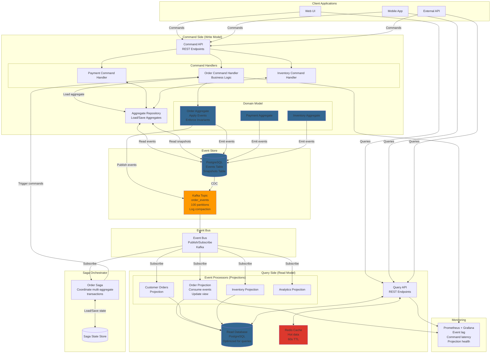

# Event Sourcing System (E-commerce Order Management)

## Step 1: Requirements Clarification

### Functional Requirements

**Event Sourcing Core:**

- Store all state changes as immutable events (append-only log)
- Reconstruct current state by replaying events from beginning
- Support time travel (view state at any point in history)
- Event versioning (schema evolution)
- Event correlation (link related events)

**E-commerce Order Domain:**

- Place order (OrderPlaced event)
- Update inventory (InventoryReserved event)
- Process payment (PaymentProcessed event)
- Ship order (OrderShipped event)
- Cancel order (OrderCancelled event)
- Track order status

**CQRS (Command Query Responsibility Segregation):**

- Write model: Process commands, emit events
- Read model: Materialized views optimized for queries
- Eventual consistency between write and read models

**Event Replay \& Projections:**

- Rebuild read models from events
- Create new projections for new features
- Audit trail (who did what when)

**Out of Scope:**

- Payment gateway integration details
- Shipping provider integration
- Real-time notifications (can add later)


### Non-Functional Requirements

**Scale:**

- 10K orders per second (peak)
- 100K events per second (5-10 events per order)
- 1B events per year
- Event retention: Infinite (for audit)

**Performance:**

- Command processing: <100ms (P99)
- Event append: <10ms (P99)
- Read model update latency: <1 second (eventual consistency)
- State reconstruction: <1 second for typical aggregate

**Consistency:**

- Strong consistency within aggregate (order entity)
- Eventual consistency across aggregates
- Idempotent command handling (duplicate detection)

**Durability:**

- Zero event loss (durable writes)
- Replication factor: 3
- Point-in-time recovery

**Availability:**

- 99.99% uptime
- Survive single node failure

***

## Step 2: Capacity Estimation

```
Order Processing:
Orders per second: 10K (average), 30K (peak)
Events per order: 7 average
  - OrderPlaced
  - InventoryReserved
  - PaymentAuthorized
  - PaymentCaptured
  - OrderConfirmed
  - OrderShipped
  - OrderDelivered

Events per second: 10K × 7 = 70K events/sec
Peak events: 30K × 7 = 210K events/sec

Event Storage:
Event size: 1 KB average (JSON with metadata)
Daily events: 70K × 86,400 = 6B events/day
Daily storage: 6B × 1 KB = 6 TB/day
Yearly storage: 6 TB × 365 = 2.19 PB/year

With replication (3x): 2.19 PB × 3 = 6.57 PB/year

Kafka Topic Sizing:
Topic: order_events
Partitions: 100 (for 70K events/sec)
Partition key: order_id (all events for same order in same partition)
Retention: Infinite (use log compaction for snapshots)

Per-partition throughput: 70K / 100 = 700 events/sec
Per-partition data rate: 700 × 1 KB = 700 KB/sec

Snapshot Storage (Optimization):
Create snapshot every 100 events
Snapshots per day: 6B / 100 = 60M snapshots
Snapshot size: 5 KB (order state)
Snapshot storage: 60M × 5 KB = 300 GB/day
Yearly: 300 GB × 365 = 109.5 TB

Projection (Read Model) Storage:
Active orders: 1M orders × 10 KB = 10 GB
Order history (1 year): 365M orders × 10 KB = 3.65 TB
Inventory projection: 1M SKUs × 2 KB = 2 GB
Customer orders projection: 10M customers × 50 KB = 500 GB

Total read model: ~4.2 TB

Event Replay Time:
Full replay: 2B events (1 year)
Processing rate: 100K events/sec
Time: 2B / 100K = 20,000 sec = 5.5 hours

Optimized with snapshots: 2B / 100 snapshots = 20M snapshots
Time: 20M / 100K = 200 sec = 3.3 minutes

Memory Requirements:
Aggregate cache: 1M hot orders × 10 KB = 10 GB
Event buffer: 10K events × 1 KB = 10 MB
Projection cache: 1 GB
Per-service memory: ~15 GB

Command Processing:
Commands per second: 10K (orders + updates)
Command validation: <10ms
Event append: <10ms
Total latency: <20ms (excluding downstream processing)

Read Model Update:
Event lag: 1 second (acceptable)
Projection update rate: 70K events/sec
Per-projection worker: 10K events/sec
Workers needed: 70K / 10K = 7 workers per projection
```


***

## Step 3: API Design

### Command API (Write Operations)

**Place Order Command**

```json
POST /v1/orders/commands/place
Content-Type: application/json
Authorization: Bearer <token>

Request:
{
  "command_id": "cmd_abc123",  // Idempotency key
  "customer_id": "cust_789",
  "items": [
    {
      "product_id": "prod_456",
      "quantity": 2,
      "price": 99.99
    }
  ],
  "shipping_address": {
    "street": "123 Main St",
    "city": "San Francisco",
    "state": "CA",
    "zip": "94105"
  },
  "payment_method": {
    "type": "credit_card",
    "token": "tok_visa_1234"
  }
}

Response: 202 Accepted
{
  "order_id": "order_xyz789",
  "command_id": "cmd_abc123",
  "status": "pending",
  "events_emitted": [
    {
      "event_id": "evt_001",
      "event_type": "OrderPlaced",
      "version": 1
    },
    {
      "event_id": "evt_002",
      "event_type": "InventoryReserved",
      "version": 1
    }
  ]
}
```

**Update Order Command**

```json
POST /v1/orders/{order_id}/commands/ship
Content-Type: application/json

Request:
{
  "command_id": "cmd_ship_001",
  "tracking_number": "1Z999AA10123456784",
  "carrier": "UPS",
  "expected_version": 5  // Optimistic concurrency control
}

Response: 202 Accepted
{
  "order_id": "order_xyz789",
  "current_version": 6,
  "event_emitted": {
    "event_id": "evt_006",
    "event_type": "OrderShipped",
    "version": 6
  }
}

// Conflict response (version mismatch)
Response: 409 Conflict
{
  "error": "version_conflict",
  "expected_version": 5,
  "current_version": 7,
  "message": "Order has been modified by another process"
}
```

**Cancel Order Command**

```json
POST /v1/orders/{order_id}/commands/cancel
Request:
{
  "command_id": "cmd_cancel_001",
  "reason": "customer_request",
  "notes": "Customer changed mind"
}

Response: 202 Accepted
{
  "order_id": "order_xyz789",
  "status": "cancelled",
  "refund_initiated": true,
  "events_emitted": [
    {
      "event_type": "OrderCancelled",
      "version": 8
    },
    {
      "event_type": "InventoryReleased",
      "version": 9
    },
    {
      "event_type": "RefundInitiated",
      "version": 10
    }
  ]
}
```


### Query API (Read Operations)

**Get Current Order State**

```json
GET /v1/orders/{order_id}

Response: 200 OK
{
  "order_id": "order_xyz789",
  "version": 10,
  "status": "cancelled",
  "customer_id": "cust_789",
  "items": [...],
  "total_amount": 199.98,
  "created_at": "2025-10-04T04:00:00Z",
  "updated_at": "2025-10-04T04:15:00Z",
  "shipping_address": {...},
  "timeline": [
    {
      "event": "OrderPlaced",
      "timestamp": "2025-10-04T04:00:00Z"
    },
    {
      "event": "InventoryReserved",
      "timestamp": "2025-10-04T04:00:05Z"
    },
    {
      "event": "OrderCancelled",
      "timestamp": "2025-10-04T04:15:00Z"
    }
  ]
}
```

**Get Order History (Time Travel)**

```json
GET /v1/orders/{order_id}/history?version=5

Response: 200 OK
{
  "order_id": "order_xyz789",
  "version": 5,
  "status": "confirmed",
  "reconstructed_at": "2025-10-04T04:05:00Z",
  "state_at_version": {
    "status": "confirmed",
    "payment_status": "captured",
    "shipping_status": "not_shipped"
  }
}

// Get state at specific time
GET /v1/orders/{order_id}/history?timestamp=2025-10-04T04:05:00Z
```

**Query Projections (Read Models)**

```json
// Customer orders view
GET /v1/customers/{customer_id}/orders?status=active&limit=20

Response: 200 OK
{
  "customer_id": "cust_789",
  "orders": [
    {
      "order_id": "order_xyz789",
      "status": "shipped",
      "total": 199.98,
      "placed_at": "2025-10-04T04:00:00Z"
    }
  ],
  "total_count": 45
}

// Inventory projection
GET /v1/inventory/products/{product_id}

Response: 200 OK
{
  "product_id": "prod_456",
  "available_quantity": 150,
  "reserved_quantity": 25,
  "total_quantity": 175,
  "last_updated": "2025-10-04T04:38:00Z"
}
```


### Event Stream API (Subscriptions)

**Get Events for Aggregate**

```json
GET /v1/orders/{order_id}/events?from_version=0&limit=100

Response: 200 OK
{
  "order_id": "order_xyz789",
  "events": [
    {
      "event_id": "evt_001",
      "event_type": "OrderPlaced",
      "version": 1,
      "timestamp": "2025-10-04T04:00:00.123Z",
      "data": {
        "order_id": "order_xyz789",
        "customer_id": "cust_789",
        "items": [...],
        "total_amount": 199.98
      },
      "metadata": {
        "correlation_id": "corr_123",
        "causation_id": "cmd_abc123",
        "user_id": "cust_789"
      }
    },
    {
      "event_id": "evt_002",
      "event_type": "InventoryReserved",
      "version": 2,
      "timestamp": "2025-10-04T04:00:00.145Z",
      "data": {...}
    }
  ],
  "current_version": 10,
  "has_more": false
}
```

**Subscribe to Event Stream**

```json
// WebSocket or Server-Sent Events
GET /v1/events/stream?event_types=OrderPlaced,OrderShipped

// Stream response
event: OrderPlaced
data: {"event_id": "evt_123", "order_id": "order_abc", ...}

event: OrderShipped
data: {"event_id": "evt_456", "order_id": "order_def", ...}
```


***

## Step 4: Database Design

### Event Store Schema

**Events Table (PostgreSQL with Event Store pattern)**

```sql
-- Primary event store
CREATE TABLE events (
    event_id UUID PRIMARY KEY DEFAULT gen_random_uuid(),
    aggregate_id VARCHAR(100) NOT NULL,  -- order_id
    aggregate_type VARCHAR(50) NOT NULL, -- "Order"
    event_type VARCHAR(100) NOT NULL,    -- "OrderPlaced"
    version BIGINT NOT NULL,             -- Optimistic locking
    data JSONB NOT NULL,                 -- Event payload
    metadata JSONB,                      -- Correlation, causation, user
    timestamp TIMESTAMPTZ DEFAULT NOW(),
    
    -- Unique constraint for idempotency
    UNIQUE (aggregate_id, version),
    
    -- Indexes
    INDEX idx_aggregate (aggregate_id, version),
    INDEX idx_event_type (event_type, timestamp),
    INDEX idx_timestamp (timestamp)
);

-- Snapshots table (optimization)
CREATE TABLE snapshots (
    aggregate_id VARCHAR(100) PRIMARY KEY,
    aggregate_type VARCHAR(50) NOT NULL,
    version BIGINT NOT NULL,
    state JSONB NOT NULL,
    created_at TIMESTAMPTZ DEFAULT NOW(),
    
    INDEX idx_version (aggregate_id, version)
);

-- Example event record:
INSERT INTO events (aggregate_id, aggregate_type, event_type, version, data, metadata)
VALUES (
    'order_xyz789',
    'Order',
    'OrderPlaced',
    1,
    '{
        "order_id": "order_xyz789",
        "customer_id": "cust_789",
        "items": [{"product_id": "prod_456", "quantity": 2, "price": 99.99}],
        "total_amount": 199.98,
        "status": "pending"
    }',
    '{
        "command_id": "cmd_abc123",
        "correlation_id": "corr_123",
        "user_id": "cust_789",
        "timestamp": "2025-10-04T04:00:00.123Z"
    }'
);
```

**Kafka Event Store (Alternative/Complementary)**

```
Topic: order_events
Partitions: 100
Key: order_id
Retention: infinite (log compaction + tiered storage)
Replication: 3

Message format:
{
    "event_id": "evt_001",
    "aggregate_id": "order_xyz789",
    "aggregate_type": "Order",
    "event_type": "OrderPlaced",
    "version": 1,
    "timestamp": 1728018000123,
    "data": {...},
    "metadata": {...}
}

Kafka configuration:
- cleanup.policy=compact (retain latest snapshot per order)
- min.compaction.lag.ms=3600000 (1 hour)
- segment.ms=86400000 (1 day)
```


### Read Model Schemas (Projections)

**Order Projection (Current State)**

```sql
-- Materialized view optimized for queries
CREATE TABLE orders_view (
    order_id VARCHAR(100) PRIMARY KEY,
    customer_id VARCHAR(100) NOT NULL,
    status VARCHAR(50),
    total_amount DECIMAL(10, 2),
    items JSONB,
    shipping_address JSONB,
    payment_status VARCHAR(50),
    tracking_number VARCHAR(100),
    created_at TIMESTAMPTZ,
    updated_at TIMESTAMPTZ,
    version BIGINT,  -- Last processed event version
    
    INDEX idx_customer (customer_id, created_at DESC),
    INDEX idx_status (status),
    INDEX idx_created (created_at DESC)
);
```

**Customer Orders Projection**

```sql
CREATE TABLE customer_orders_view (
    customer_id VARCHAR(100),
    order_id VARCHAR(100),
    status VARCHAR(50),
    total_amount DECIMAL(10, 2),
    placed_at TIMESTAMPTZ,
    
    PRIMARY KEY (customer_id, order_id),
    INDEX idx_customer_recent (customer_id, placed_at DESC)
);
```

**Inventory Projection**

```sql
CREATE TABLE inventory_view (
    product_id VARCHAR(100) PRIMARY KEY,
    available_quantity INT,
    reserved_quantity INT,
    total_quantity INT,
    last_updated TIMESTAMPTZ,
    version BIGINT
);
```

**Event Processor Checkpoints**

```sql
-- Track which events have been processed by each projection
CREATE TABLE event_processor_checkpoints (
    processor_name VARCHAR(100) PRIMARY KEY,
    last_processed_event_id UUID,
    last_processed_version BIGINT,
    last_processed_timestamp TIMESTAMPTZ,
    updated_at TIMESTAMPTZ
);
```


***

## Step 5: High-Level Design

### Architecture Diagram (Mermaid)




### Data Flow

**Command Flow (Write):**

```
1. Client sends PlaceOrderCommand
2. Command Handler validates command
3. Load Order aggregate from event store
4. Aggregate applies business rules
5. Aggregate emits OrderPlaced event
6. Event saved to PostgreSQL (durability)
7. Event published to Kafka (async)
8. Return 202 Accepted to client
```

**Event Processing Flow (Read):**

```
1. Kafka event published
2. Order Projection consumer reads event
3. Update orders_view table
4. Customer Projection updates customer_orders_view
5. Inventory Projection updates inventory_view
6. Analytics Projection writes to data warehouse
7. Cache invalidated if needed
```

**Query Flow (Read):**

```
1. Client queries GET /orders/{order_id}
2. Check Redis cache → Hit: return
3. Cache miss → Query orders_view table
4. Return result to client
5. Cache result in Redis (60s TTL)
```


***

## Step 6: Deep Dive

### 6.1 Event Sourcing Core Implementation

**Aggregate Root Pattern:**

```java
public abstract class AggregateRoot {
    protected String aggregateId;
    protected long version = 0;
    protected List<Event> uncommittedEvents = new ArrayList<>();
    
    // Apply event and increment version
    protected void apply(Event event) {
        // Set event metadata
        event.setAggregateId(aggregateId);
        event.setVersion(++version);
        event.setTimestamp(Instant.now());
        
        // Apply to internal state
        applyEvent(event);
        
        // Track for saving
        uncommittedEvents.add(event);
    }
    
    // Override in subclasses to handle events
    protected abstract void applyEvent(Event event);
    
    // Load from history
    public void loadFromHistory(List<Event> history) {
        for (Event event : history) {
            applyEvent(event);
            version = event.getVersion();
        }
    }
    
    // Get events to save
    public List<Event> getUncommittedEvents() {
        return new ArrayList<>(uncommittedEvents);
    }
    
    // Mark events as committed
    public void markEventsAsCommitted() {
        uncommittedEvents.clear();
    }
}
```

**Order Aggregate Implementation:**

```java
public class OrderAggregate extends AggregateRoot {
    private String orderId;
    private String customerId;
    private List<OrderItem> items;
    private OrderStatus status;
    private BigDecimal totalAmount;
    private Address shippingAddress;
    private PaymentStatus paymentStatus;
    
    public OrderAggregate(String orderId) {
        this.aggregateId = orderId;
        this.orderId = orderId;
        this.status = OrderStatus.PENDING;
    }
    
    // Command: Place Order
    public void placeOrder(PlaceOrderCommand command) {
        // Business rule: Can only place if not already placed
        if (status != OrderStatus.PENDING) {
            throw new IllegalStateException("Order already placed");
        }
        
        // Business rule: Order must have items
        if (command.getItems().isEmpty()) {
            throw new IllegalArgumentException("Order must have at least one item");
        }
        
        // Business rule: Total amount must match items
        BigDecimal calculatedTotal = command.getItems().stream()
            .map(item -> item.getPrice().multiply(BigDecimal.valueOf(item.getQuantity())))
            .reduce(BigDecimal.ZERO, BigDecimal::add);
        
        if (!calculatedTotal.equals(command.getTotalAmount())) {
            throw new IllegalArgumentException("Total amount mismatch");
        }
        
        // Emit event (will be applied to state)
        apply(new OrderPlacedEvent(
            orderId,
            command.getCustomerId(),
            command.getItems(),
            command.getTotalAmount(),
            command.getShippingAddress()
        ));
    }
    
    // Command: Confirm Payment
    public void confirmPayment(String paymentId, BigDecimal amount) {
        // Business rule: Can only confirm payment for placed orders
        if (status != OrderStatus.PLACED) {
            throw new IllegalStateException("Order must be placed before payment");
        }
        
        // Business rule: Payment amount must match order total
        if (!amount.equals(totalAmount)) {
            throw new IllegalArgumentException("Payment amount mismatch");
        }
        
        apply(new PaymentConfirmedEvent(orderId, paymentId, amount));
    }
    
    // Command: Ship Order
    public void shipOrder(String trackingNumber, String carrier) {
        // Business rule: Can only ship paid orders
        if (paymentStatus != PaymentStatus.CONFIRMED) {
            throw new IllegalStateException("Order must be paid before shipping");
        }
        
        if (status == OrderStatus.SHIPPED) {
            throw new IllegalStateException("Order already shipped");
        }
        
        apply(new OrderShippedEvent(orderId, trackingNumber, carrier));
    }
    
    // Command: Cancel Order
    public void cancel(String reason) {
        // Business rule: Cannot cancel shipped orders
        if (status == OrderStatus.SHIPPED || status == OrderStatus.DELIVERED) {
            throw new IllegalStateException("Cannot cancel shipped or delivered orders");
        }
        
        apply(new OrderCancelledEvent(orderId, reason));
    }
    
    // Event handlers (update internal state)
    @Override
    protected void applyEvent(Event event) {
        if (event instanceof OrderPlacedEvent) {
            applyOrderPlaced((OrderPlacedEvent) event);
        } else if (event instanceof PaymentConfirmedEvent) {
            applyPaymentConfirmed((PaymentConfirmedEvent) event);
        } else if (event instanceof OrderShippedEvent) {
            applyOrderShipped((OrderShippedEvent) event);
        } else if (event instanceof OrderCancelledEvent) {
            applyOrderCancelled((OrderCancelledEvent) event);
        }
    }
    
    private void applyOrderPlaced(OrderPlacedEvent event) {
        this.customerId = event.getCustomerId();
        this.items = event.getItems();
        this.totalAmount = event.getTotalAmount();
        this.shippingAddress = event.getShippingAddress();
        this.status = OrderStatus.PLACED;
    }
    
    private void applyPaymentConfirmed(PaymentConfirmedEvent event) {
        this.paymentStatus = PaymentStatus.CONFIRMED;
        this.status = OrderStatus.CONFIRMED;
    }
    
    private void applyOrderShipped(OrderShippedEvent event) {
        this.status = OrderStatus.SHIPPED;
    }
    
    private void applyOrderCancelled(OrderCancelledEvent event) {
        this.status = OrderStatus.CANCELLED;
    }
}
```

**Event Store Repository:**

```java
@Repository
public class EventStoreRepository {
    private final JdbcTemplate jdbcTemplate;
    private final KafkaTemplate<String, Event> kafkaTemplate;
    private final ObjectMapper objectMapper;
    
    // Save events (atomic transaction)
    @Transactional
    public void saveEvents(String aggregateId, List<Event> events, long expectedVersion) {
        for (Event event : events) {
            // Check optimistic concurrency
            long currentVersion = getCurrentVersion(aggregateId);
            if (currentVersion != expectedVersion) {
                throw new ConcurrencyException(
                    "Version conflict: expected " + expectedVersion + ", got " + currentVersion
                );
            }
            
            // Insert event
            String sql = """
                INSERT INTO events (event_id, aggregate_id, aggregate_type, event_type, 
                                   version, data, metadata, timestamp)
                VALUES (?, ?, ?, ?, ?, ?::jsonb, ?::jsonb, ?)
            """;
            
            jdbcTemplate.update(sql,
                event.getEventId(),
                event.getAggregateId(),
                event.getAggregateType(),
                event.getEventType(),
                event.getVersion(),
                objectMapper.writeValueAsString(event.getData()),
                objectMapper.writeValueAsString(event.getMetadata()),
                event.getTimestamp()
            );
            
            expectedVersion = event.getVersion();
        }
        
        // Publish to Kafka (async, outside transaction)
        CompletableFuture.runAsync(() -> {
            for (Event event : events) {
                kafkaTemplate.send("order_events", event.getAggregateId(), event);
            }
        });
    }
    
    // Load events for aggregate
    public List<Event> getEvents(String aggregateId) {
        String sql = """
            SELECT event_id, aggregate_id, aggregate_type, event_type, 
                   version, data, metadata, timestamp
            FROM events
            WHERE aggregate_id = ?
            ORDER BY version ASC
        """;
        
        return jdbcTemplate.query(sql, 
            (rs, rowNum) -> deserializeEvent(rs),
            aggregateId
        );
    }
    
    // Load events from specific version
    public List<Event> getEvents(String aggregateId, long fromVersion) {
        String sql = """
            SELECT event_id, aggregate_id, aggregate_type, event_type,
                   version, data, metadata, timestamp
            FROM events
            WHERE aggregate_id = ? AND version > ?
            ORDER BY version ASC
        """;
        
        return jdbcTemplate.query(sql,
            (rs, rowNum) -> deserializeEvent(rs),
            aggregateId, fromVersion
        );
    }
    
    // Get current version
    private long getCurrentVersion(String aggregateId) {
        String sql = "SELECT COALESCE(MAX(version), 0) FROM events WHERE aggregate_id = ?";
        return jdbcTemplate.queryForObject(sql, Long.class, aggregateId);
    }
    
    // Deserialize event from database
    private Event deserializeEvent(ResultSet rs) throws SQLException {
        String eventType = rs.getString("event_type");
        String dataJson = rs.getString("data");
        
        // Use event type registry to deserialize to correct class
        Class<? extends Event> eventClass = EventRegistry.getEventClass(eventType);
        Event event = objectMapper.readValue(dataJson, eventClass);
        
        event.setEventId(rs.getString("event_id"));
        event.setAggregateId(rs.getString("aggregate_id"));
        event.setVersion(rs.getLong("version"));
        event.setTimestamp(rs.getTimestamp("timestamp").toInstant());
        
        return event;
    }
}
```


***

### 6.2 Snapshots (Performance Optimization)

**Problem:** Replaying 10,000 events to reconstruct aggregate state is slow.

**Solution:** Periodically save snapshots of aggregate state.

```java
public class SnapshotRepository {
    private final JdbcTemplate jdbcTemplate;
    private final ObjectMapper objectMapper;
    
    private static final int SNAPSHOT_FREQUENCY = 100;  // Every 100 events
    
    // Save snapshot
    @Transactional
    public void saveSnapshot(String aggregateId, Object state, long version) {
        String sql = """
            INSERT INTO snapshots (aggregate_id, aggregate_type, version, state, created_at)
            VALUES (?, ?, ?, ?::jsonb, NOW())
            ON CONFLICT (aggregate_id)
            DO UPDATE SET version = ?, state = ?::jsonb, created_at = NOW()
        """;
        
        String stateJson = objectMapper.writeValueAsString(state);
        String aggregateType = state.getClass().getSimpleName();
        
        jdbcTemplate.update(sql,
            aggregateId, aggregateType, version, stateJson,
            version, stateJson
        );
    }
    
    // Load latest snapshot
    public Optional<Snapshot> getLatestSnapshot(String aggregateId) {
        String sql = """
            SELECT aggregate_id, aggregate_type, version, state, created_at
            FROM snapshots
            WHERE aggregate_id = ?
        """;
        
        List<Snapshot> snapshots = jdbcTemplate.query(sql,
            (rs, rowNum) -> new Snapshot(
                rs.getString("aggregate_id"),
                rs.getString("aggregate_type"),
                rs.getLong("version"),
                rs.getString("state"),
                rs.getTimestamp("created_at").toInstant()
            ),
            aggregateId
        );
        
        return snapshots.isEmpty() ? Optional.empty() : Optional.of(snapshots.get(0));
    }
    
    // Check if snapshot needed
    public boolean shouldCreateSnapshot(long currentVersion) {
        return currentVersion % SNAPSHOT_FREQUENCY == 0;
    }
}

// Optimized aggregate loading
public class OptimizedAggregateRepository {
    private final EventStoreRepository eventStore;
    private final SnapshotRepository snapshotRepo;
    
    public <T extends AggregateRoot> T load(String aggregateId, Class<T> aggregateClass) {
        // 1. Try to load latest snapshot
        Optional<Snapshot> snapshot = snapshotRepo.getLatestSnapshot(aggregateId);
        
        T aggregate;
        long fromVersion;
        
        if (snapshot.isPresent()) {
            // Deserialize snapshot
            aggregate = objectMapper.readValue(snapshot.get().getState(), aggregateClass);
            fromVersion = snapshot.get().getVersion();
        } else {
            // No snapshot, start from beginning
            aggregate = aggregateClass.getDeclaredConstructor(String.class).newInstance(aggregateId);
            fromVersion = 0;
        }
        
        // 2. Load events after snapshot
        List<Event> events = eventStore.getEvents(aggregateId, fromVersion);
        
        // 3. Apply events
        aggregate.loadFromHistory(events);
        
        return aggregate;
    }
    
    public void save(AggregateRoot aggregate) {
        List<Event> uncommittedEvents = aggregate.getUncommittedEvents();
        
        if (uncommittedEvents.isEmpty()) {
            return;
        }
        
        // Save events
        eventStore.saveEvents(
            aggregate.getAggregateId(),
            uncommittedEvents,
            aggregate.getVersion() - uncommittedEvents.size()  // Expected version before new events
        );
        
        // Check if snapshot needed
        if (snapshotRepo.shouldCreateSnapshot(aggregate.getVersion())) {
            snapshotRepo.saveSnapshot(
                aggregate.getAggregateId(),
                aggregate,
                aggregate.getVersion()
            );
        }
        
        aggregate.markEventsAsCommitted();
    }
}

// Performance comparison:
// Without snapshot: Load 10,000 events, replay all → 5 seconds
// With snapshot (every 100): Load 1 snapshot + 99 events → 50ms (100x faster)
```


***

### 6.3 Projections (Read Models)

**Event Processor for Order Projection:**

```java
@Service
public class OrderProjectionProcessor {
    private final JdbcTemplate jdbcTemplate;
    private final CheckpointRepository checkpointRepo;
    
    @KafkaListener(topics = "order_events", groupId = "order-projection")
    public void processEvent(Event event) {
        try {
            // Idempotency check
            if (isEventProcessed(event.getEventId())) {
                return;  // Skip duplicate
            }
            
            // Update projection based on event type
            if (event instanceof OrderPlacedEvent) {
                handleOrderPlaced((OrderPlacedEvent) event);
            } else if (event instanceof PaymentConfirmedEvent) {
                handlePaymentConfirmed((PaymentConfirmedEvent) event);
            } else if (event instanceof OrderShippedEvent) {
                handleOrderShipped((OrderShippedEvent) event);
            } else if (event instanceof OrderCancelledEvent) {
                handleOrderCancelled((OrderCancelledEvent) event);
            }
            
            // Update checkpoint
            checkpointRepo.updateCheckpoint("order-projection", event);
            
        } catch (Exception e) {
            // Log error and retry
            throw new EventProcessingException("Failed to process event: " + event.getEventId(), e);
        }
    }
    
    private void handleOrderPlaced(OrderPlacedEvent event) {
        String sql = """
            INSERT INTO orders_view (order_id, customer_id, status, total_amount, items,
                                    shipping_address, created_at, updated_at, version)
            VALUES (?, ?, ?, ?, ?::jsonb, ?::jsonb, ?, ?, ?)
        """;
        
        jdbcTemplate.update(sql,
            event.getOrderId(),
            event.getCustomerId(),
            "PLACED",
            event.getTotalAmount(),
            objectMapper.writeValueAsString(event.getItems()),
            objectMapper.writeValueAsString(event.getShippingAddress()),
            event.getTimestamp(),
            event.getTimestamp(),
            event.getVersion()
        );
    }
    
    private void handlePaymentConfirmed(PaymentConfirmedEvent event) {
        String sql = """
            UPDATE orders_view
            SET status = ?, payment_status = ?, updated_at = ?, version = ?
            WHERE order_id = ?
        """;
        
        jdbcTemplate.update(sql,
            "CONFIRMED",
            "PAID",
            event.getTimestamp(),
            event.getVersion(),
            event.getOrderId()
        );
    }
    
    private void handleOrderShipped(OrderShippedEvent event) {
        String sql = """
            UPDATE orders_view
            SET status = ?, tracking_number = ?, updated_at = ?, version = ?
            WHERE order_id = ?
        """;
        
        jdbcTemplate.update(sql,
            "SHIPPED",
            event.getTrackingNumber(),
            event.getTimestamp(),
            event.getVersion(),
            event.getOrderId()
        );
    }
    
    private void handleOrderCancelled(OrderCancelledEvent event) {
        String sql = """
            UPDATE orders_view
            SET status = ?, updated_at = ?, version = ?
            WHERE order_id = ?
        """;
        
        jdbcTemplate.update(sql,
            "CANCELLED",
            event.getTimestamp(),
            event.getVersion(),
            event.getOrderId()
        );
    }
    
    private boolean isEventProcessed(String eventId) {
        String sql = "SELECT COUNT(*) FROM processed_events WHERE event_id = ?";
        int count = jdbcTemplate.queryForObject(sql, Integer.class, eventId);
        return count > 0;
    }
}
```

**Rebuilding Projections (Replay):**

```java
@Service
public class ProjectionRebuilder {
    private final EventStoreRepository eventStore;
    private final OrderProjectionProcessor projectionProcessor;
    
    // Rebuild projection from scratch
    public void rebuildOrderProjection() {
        // 1. Truncate projection table
        jdbcTemplate.execute("TRUNCATE TABLE orders_view");
        
        // 2. Reset checkpoint
        checkpointRepo.resetCheckpoint("order-projection");
        
        // 3. Stream all events from event store
        long offset = 0;
        int batchSize = 1000;
        
        while (true) {
            List<Event> events = eventStore.getEventsBatch(offset, batchSize);
            
            if (events.isEmpty()) {
                break;
            }
            
            // Process batch
            for (Event event : events) {
                projectionProcessor.processEvent(event);
            }
            
            offset += events.size();
        }
    }
    
    // Rebuild multiple projections in parallel
    public void rebuildAllProjections() {
        List<String> projections = List.of(
            "order-projection",
            "customer-orders-projection",
            "inventory-projection"
        );
        
        ExecutorService executor = Executors.newFixedThreadPool(projections.size());
        
        for (String projection : projections) {
            executor.submit(() -> {
                rebuildProjection(projection);
            });
        }
        
        executor.shutdown();
        executor.awaitTermination(1, TimeUnit.HOURS);
    }
}
```


***

### 6.4 Saga Pattern (Distributed Transactions)

**Problem:** Order placement requires coordinating multiple aggregates:

1. Reserve inventory
2. Process payment
3. Update order status

Each operation can fail independently. Need compensation logic.

**Saga Implementation:**

```java
public class OrderPlacementSaga {
    private enum SagaState {
        STARTED,
        INVENTORY_RESERVED,
        PAYMENT_PROCESSED,
        ORDER_CONFIRMED,
        COMPLETED,
        FAILED,
        COMPENSATING,
        COMPENSATED
    }
    
    private String sagaId;
    private String orderId;
    private SagaState state;
    private Map<String, Object> data;
    
    // Saga step 1: Reserve inventory
    @SagaStep(order = 1)
    public void reserveInventory() {
        InventoryCommand cmd = new ReserveInventoryCommand(
            data.get("items"),
            orderId
        );
        
        inventoryService.reserve(cmd);
        state = SagaState.INVENTORY_RESERVED;
        saveSagaState();
    }
    
    // Compensation for step 1
    @CompensatingAction(forStep = 1)
    public void releaseInventory() {
        InventoryCommand cmd = new ReleaseInventoryCommand(orderId);
        inventoryService.release(cmd);
    }
    
    // Saga step 2: Process payment
    @SagaStep(order = 2)
    public void processPayment() {
        PaymentCommand cmd = new ProcessPaymentCommand(
            data.get("paymentMethod"),
            data.get("totalAmount"),
            orderId
        );
        
        paymentService.process(cmd);
        state = SagaState.PAYMENT_PROCESSED;
        saveSagaState();
    }
    
    // Compensation for step 2
    @CompensatingAction(forStep = 2)
    public void refundPayment() {
        PaymentCommand cmd = new RefundPaymentCommand(orderId);
        paymentService.refund(cmd);
    }
    
    // Saga step 3: Confirm order
    @SagaStep(order = 3)
    public void confirmOrder() {
        OrderCommand cmd = new ConfirmOrderCommand(orderId);
        orderService.confirm(cmd);
        state = SagaState.ORDER_CONFIRMED;
        saveSagaState();
    }
    
    // Execute saga
    public void execute() {
        try {
            reserveInventory();
            processPayment();
            confirmOrder();
            
            state = SagaState.COMPLETED;
            saveSagaState();
            
        } catch (Exception e) {
            // Saga failed, run compensations
            compensate();
        }
    }
    
    // Run compensating transactions in reverse order
    private void compensate() {
        state = SagaState.COMPENSATING;
        saveSagaState();
        
        try {
            if (state.ordinal() >= SagaState.PAYMENT_PROCESSED.ordinal()) {
                refundPayment();
            }
            
            if (state.ordinal() >= SagaState.INVENTORY_RESERVED.ordinal()) {
                releaseInventory();
            }
            
            state = SagaState.COMPENSATED;
            
        } catch (Exception e) {
            // Compensation failed - requires manual intervention
            state = SagaState.FAILED;
            alertOps("Saga compensation failed: " + sagaId);
        }
        
        saveSagaState();
    }
    
    private void saveSagaState() {
        sagaRepository.save(this);
    }
}

// Event-driven saga (choreography)
@Service
public class EventDrivenOrderSaga {
    
    @EventHandler
    public void on(OrderPlacedEvent event) {
        // Trigger inventory reservation
        InventoryCommand cmd = new ReserveInventoryCommand(
            event.getItems(),
            event.getOrderId()
        );
        
        inventoryService.reserve(cmd);
    }
    
    @EventHandler
    public void on(InventoryReservedEvent event) {
        // Trigger payment processing
        PaymentCommand cmd = new ProcessPaymentCommand(
            event.getOrderId(),
            event.getTotalAmount()
        );
        
        paymentService.process(cmd);
    }
    
    @EventHandler
    public void on(PaymentProcessedEvent event) {
        // Trigger order confirmation
        OrderCommand cmd = new ConfirmOrderCommand(event.getOrderId());
        orderService.confirm(cmd);
    }
    
    // Handle failures
    @EventHandler
    public void on(PaymentFailedEvent event) {
        // Compensate: Release inventory
        InventoryCommand cmd = new ReleaseInventoryCommand(event.getOrderId());
        inventoryService.release(cmd);
        
        // Cancel order
        OrderCommand cancelCmd = new CancelOrderCommand(
            event.getOrderId(),
            "Payment failed"
        );
        orderService.cancel(cancelCmd);
    }
}
```


***

## Step 7: Bottlenecks, Trade-offs \& Optimizations

### Bottleneck 1: Event Store Write Throughput

**Problem:** 70K events/sec requires high write throughput

**Solution 1: Batch Writes**

```java
// Batch multiple events in single transaction
@Transactional
public void saveEventsBatch(List<AggregateEvent> aggregateEvents) {
    String sql = """
        INSERT INTO events (event_id, aggregate_id, aggregate_type, event_type,
                           version, data, metadata, timestamp)
        VALUES (?, ?, ?, ?, ?, ?::jsonb, ?::jsonb, ?)
    """;
    
    jdbcTemplate.batchUpdate(sql, aggregateEvents, 100,
        (ps, event) -> {
            ps.setString(1, event.getEventId());
            ps.setString(2, event.getAggregateId());
            // ... set other parameters
        }
    );
}

// Result: 10x throughput improvement (7K → 70K events/sec)
```

**Solution 2: Partitioned Tables**

```sql
-- Partition by time for better insert performance
CREATE TABLE events (
    event_id UUID,
    aggregate_id VARCHAR(100),
    timestamp TIMESTAMPTZ,
    ...
) PARTITION BY RANGE (timestamp);

CREATE TABLE events_2025_10 PARTITION OF events
    FOR VALUES FROM ('2025-10-01') TO ('2025-11-01');

-- Partition by aggregate_id for better query performance
CREATE TABLE events_by_aggregate (
    ...
) PARTITION BY HASH (aggregate_id);

CREATE TABLE events_partition_0 PARTITION OF events_by_aggregate
    FOR VALUES WITH (MODULUS 16, REMAINDER 0);
```

**Trade-off:** Write simplicity vs throughput

***

### Bottleneck 2: Aggregate Loading (Replay Performance)

**Problem:** Loading aggregate with 10K events is slow

**Solution 1: Snapshot Frequency Tuning**

```
Snapshot every 100 events:
- Load snapshot + 99 events → 50ms

Snapshot every 50 events:
- Load snapshot + 49 events → 30ms (better)
- Storage overhead: 2x snapshots

Snapshot every 200 events:
- Load snapshot + 199 events → 100ms (worse)
- Storage savings: 0.5x snapshots

Optimal: Snapshot every 50-100 events
```

**Solution 2: In-Memory Cache**

```java
@Component
public class AggregateCacheService {
    private final LoadingCache<String, AggregateRoot> cache = Caffeine.newBuilder()
        .maximumSize(10_000)  // Cache 10K hot aggregates
        .expireAfterWrite(Duration.ofMinutes(5))
        .refreshAfterWrite(Duration.ofMinutes(1))
        .build(this::loadAggregate);
    
    public <T extends AggregateRoot> T getAggregate(String aggregateId, Class<T> clazz) {
        return (T) cache.get(aggregateId);
    }
    
    private AggregateRoot loadAggregate(String aggregateId) {
        // Load from event store with snapshot optimization
        return repository.load(aggregateId, OrderAggregate.class);
    }
}

// Cache hit ratio: 80% → 80% requests served in <1ms
```

**Trade-off:** Memory usage vs latency

***

### Bottleneck 3: Projection Lag

**Problem:** Read models lag behind write model by 1-2 seconds

**Solution 1: Parallel Processing**

```java
// Process events in parallel for independent projections
@KafkaListener(
    topics = "order_events",
    groupId = "order-projection",
    concurrency = "10"  // 10 parallel consumers
)
public void processEvent(Event event) {
    projectionProcessor.process(event);
}

// Each consumer handles 7K events/sec
// 10 consumers = 70K events/sec (matches write throughput)
```

**Solution 2: Priority Processing**

```java
// Prioritize critical projections
class PriorityEventProcessor {
    public void processEvent(Event event) {
        // High priority: Order status (user-facing)
        if (isOrderStatusEvent(event)) {
            highPriorityQueue.add(event);
        }
        // Low priority: Analytics
        else if (isAnalyticsEvent(event)) {
            lowPriorityQueue.add(event);
        }
    }
}
```

**Solution 3: Read-Your-Writes Consistency**

```java
// Return write model state immediately after command
@PostMapping("/orders")
public OrderResponse placeOrder(@RequestBody PlaceOrderCommand cmd) {
    // Process command
    OrderAggregate order = orderService.placeOrder(cmd);
    
    // Return current state (from write model)
    // Don't wait for projection to update
    return OrderResponse.fromAggregate(order);
}

// Subsequent reads use projection (eventual consistency)
@GetMapping("/orders/{orderId}")
public OrderResponse getOrder(@PathVariable String orderId) {
    // Read from projection (may be slightly stale)
    return queryService.getOrder(orderId);
}
```

**Trade-off:** Consistency vs complexity

***

### Bottleneck 4: Event Schema Evolution

**Problem:** Event schema changes over time, old events have old schema

**Solution: Event Upcasting**

```java
public interface EventUpcaster {
    Event upcast(Event event);
    boolean supports(String eventType, int version);
}

@Component
public class OrderPlacedEventUpcaster implements EventUpcaster {
    @Override
    public Event upcast(Event event) {
        // V1 → V2: Added shipping_method field
        if (event.getVersion() == 1) {
            OrderPlacedEventV1 v1 = (OrderPlacedEventV1) event;
            
            OrderPlacedEventV2 v2 = new OrderPlacedEventV2();
            v2.setOrderId(v1.getOrderId());
            v2.setCustomerId(v1.getCustomerId());
            v2.setItems(v1.getItems());
            v2.setShippingMethod("STANDARD");  // Default for old events
            
            return v2;
        }
        
        return event;
    }
    
    @Override
    public boolean supports(String eventType, int version) {
        return "OrderPlaced".equals(eventType) && version == 1;
    }
}

// Event loading with upcasting
public Event loadEvent(String eventId) {
    Event event = eventStore.load(eventId);
    
    // Apply upcasters
    for (EventUpcaster upcaster : upcasters) {
        if (upcaster.supports(event.getEventType(), event.getSchemaVersion())) {
            event = upcaster.upcast(event);
        }
    }
    
    return event;
}
```

**Trade-off:** Backward compatibility vs code complexity

***

### Optimization: Kafka Log Compaction

**Problem:** Storing infinite events requires infinite storage

**Solution: Log Compaction with Snapshots**

```
Kafka topic configuration:
cleanup.policy=compact
min.compaction.lag.ms=3600000  // 1 hour
segment.ms=86400000  // 1 day

Strategy:
1. Every 100 events, publish snapshot event
2. Kafka compaction retains latest snapshot per order_id
3. Old events garbage collected
4. Replay starts from snapshot

Before compaction:
[E1][E2][E3][E4][E5]...[E100][Snapshot1][E101]...[E200][Snapshot2]

After compaction:
[Snapshot2][E201][E202]...

Storage savings: 100x reduction (2 PB → 20 TB)
```


***

### Optimization: CQRS Materialized Views

**Problem:** Complex queries on event store are slow

**Solution: Specialized Read Models**

```sql
-- Aggregated view for analytics
CREATE MATERIALIZED VIEW order_daily_summary AS
SELECT 
    DATE(created_at) as date,
    COUNT(*) as order_count,
    SUM(total_amount) as total_revenue,
    AVG(total_amount) as avg_order_value
FROM orders_view
GROUP BY DATE(created_at);

-- Refresh daily
REFRESH MATERIALIZED VIEW order_daily_summary;

-- Query latency: 5 seconds → 10ms (500x faster)
```


***

## Summary: Key Design Decisions

| Aspect | Decision | Rationale |
| :-- | :-- | :-- |
| **Event Store** | PostgreSQL + Kafka | Durability (PG) + Scalability (Kafka) |
| **Snapshots** | Every 100 events | Balance rebuild time vs storage |
| **Consistency** | Eventual (1-2s lag) | Acceptable for most domains |
| **Projections** | Multiple specialized | Query performance |
| **Saga Pattern** | Event-driven choreography | Loose coupling, scalability |
| **Concurrency** | Optimistic locking (version) | Better performance than pessimistic |
| **Schema Evolution** | Event upcasting | Backward compatibility |
| **Kafka Compaction** | Enabled with snapshots | Storage efficiency |

**Event Sourcing Benefits:**

- ✅ Complete audit trail (who, what, when)
- ✅ Time travel (reconstruct state at any point)
- ✅ Event replay (build new projections)
- ✅ Decoupled services (event-driven)
- ✅ Debugging (trace event flow)

**Event Sourcing Challenges:**

- ❌ Eventual consistency (not suitable for all domains)
- ❌ Schema evolution complexity
- ❌ Storage overhead (all events forever)
- ❌ Query complexity (CQRS required)

**When to Use Event Sourcing:**

- ✅ Audit requirements (financial, healthcare)
- ✅ Complex business workflows
- ✅ Multiple consumers of same data
- ✅ Need for temporal queries
- ❌ Simple CRUD applications
- ❌ Strong consistency requirements

This design handles **10K orders/sec (70K events/sec)** with **<100ms command latency** and **<1s projection lag** using event sourcing, CQRS, snapshots, and Kafka for scalability.

