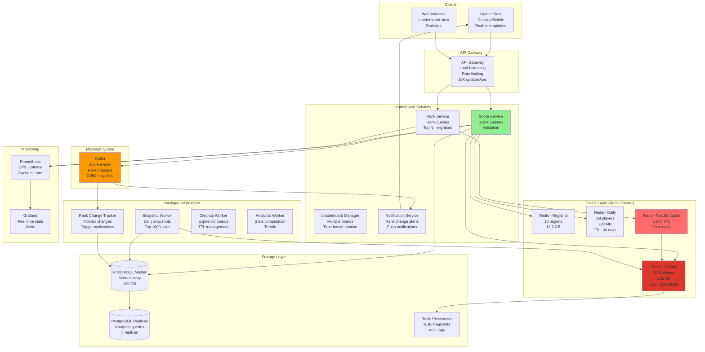

# Leaderboard System (Gaming) Design

## Step 1: Requirements Clarification

### Functional Requirements

**Leaderboard Types:**

- Global leaderboard (all players worldwide)
- Regional leaderboards (by country/continent)
- Friends leaderboard (player's friends only)
- Time-based leaderboards (daily, weekly, monthly, all-time)
- Multiple game modes (ranked, casual, tournament)

**Core Operations:**

- Update player score (after game completion)
- Get player rank (what's my position?)
- Get top N players (top 100)
- Get players around a specific rank (rank 50-60)
- Get players near user (5 above, 5 below)

**Player Information:**

- Username
- Score/points
- Rank
- Additional metadata (level, wins, losses)
- Last updated timestamp

**Real-Time Updates:**

- Leaderboard updates within seconds
- Push notifications for rank changes
- Live updates during tournaments

**Out of Scope:**

- Match history
- Player profiles
- Anti-cheat detection
- In-game chat


### Non-Functional Requirements

**Scale (Based on 2025 data):**

- Global gamers: 3.32 billion[^1]
- Top game players: 30 million MAU (Fortnite)[^2]
- Concurrent players: 615K-627K (Counter-Strike 2)[^3]
- Score updates per second: 10,000 updates/sec (peak)
- Read queries per second: 100,000 reads/sec

**Performance:**

- Score update latency: <100ms
- Rank query latency: <50ms
- Top 100 query: <10ms (cached)
- Players around rank: <50ms

**Consistency:**

- Eventual consistency (acceptable)
- No strict ordering guarantee
- Tolerate small delays (<5 seconds)

**Reliability:**

- 99.99% uptime
- No score loss
- Accurate rankings

***

## Step 2: Leaderboard Theory \& Data Structures

### 2.1 Sorted Set (Redis ZSET)

**Perfect for leaderboards!**

```
Redis Sorted Set:
- Each member has a score
- Automatically sorted by score
- O(log N) insert/update
- O(log N) rank query
- O(log N + M) range query (M = results)

Example:
ZADD leaderboard 1500 "player_alice"
ZADD leaderboard 2000 "player_bob"
ZADD leaderboard 1800 "player_charlie"

Internal structure (sorted by score):
player_bob: 2000
player_charlie: 1800
player_alice: 1500

Operations:
ZREVRANK leaderboard "player_bob"     → 0 (rank 1)
ZREVRANGE leaderboard 0 99            → Top 100 players
ZSCORE leaderboard "player_alice"     → 1500
ZREVRANK leaderboard "player_alice"   → 2 (rank 3)

Time Complexity:
- Insert/Update: O(log N)
- Get rank: O(log N)
- Get score: O(1)
- Range query: O(log N + M)

Space Complexity: O(N) where N = number of players
```


### 2.2 Handling Ties

**Problem: Two players with same score**

```
Scenario:
player_alice: 1500
player_bob: 1500
player_charlie: 1800

Who ranks higher between Alice and Bob?

Solution 1: Timestamp tiebreaker
Score = (points × 1,000,000) + timestamp
player_alice: 1500000000 + 1696435200 = 1501696435200
player_bob: 1500000000 + 1696435300 = 1501696435300

Bob played later → Bob ranks higher (or lower, depending on rules)

Solution 2: Lexicographic tiebreaker
Add username to score calculation
Redis ZSET naturally handles this

Solution 3: Equal ranks
Both players get rank 2
Next player gets rank 4 (skip rank 3)

Most common: Timestamp tiebreaker
```


### 2.3 Time-Based Leaderboards

```
Challenge: Daily/Weekly/Monthly leaderboards

Naive: Delete and recreate
❌ Loses history
❌ Expensive

Better: Multiple sorted sets

Keys:
leaderboard:global:all-time
leaderboard:global:2025-10
leaderboard:global:2025-10-04
leaderboard:global:week-40

At midnight: Create new daily key
At week end: Create new weekly key

Cleanup: TTL old keys
EXPIRE leaderboard:global:2025-09 2592000  # 30 days
```


### 2.4 Regional Leaderboards

```
Partition by region:

Keys:
leaderboard:us:all-time
leaderboard:eu:all-time
leaderboard:asia:all-time

User update flow:
1. Get user's region: "us"
2. Update both global and regional:
   ZADD leaderboard:global:all-time 1500 "player_alice"
   ZADD leaderboard:us:all-time 1500 "player_alice"

Benefit: Regional queries are faster (smaller datasets)
```


***

## Step 3: Capacity Estimation

```
Players & Games:
Total registered players: 30 million (large game like Fortnite) [web:527]
Daily active players: 5 million (16.7% of total)
Concurrent players: 500,000 peak [web:529]
Games per player per day: 5 games
Total games per day: 5M × 5 = 25 million games

Score Updates:
Games per second: 25M / 86,400 = 289 games/sec
Players per game: 10 players (average)
Score updates per second: 289 × 10 = 2,890 updates/sec
Peak (5× average): 14,450 updates/sec

Leaderboard Queries:
Queries per player per day: 20 queries
Total queries: 5M × 20 = 100 million queries/day
Queries per second: 100M / 86,400 = 1,157 queries/sec
Peak (10× average): 11,570 queries/sec

Query Distribution:
- Get my rank: 40% (462 QPS)
- Top 100: 30% (347 QPS)
- Players around me: 20% (231 QPS)
- Specific rank: 10% (116 QPS)

Redis Memory (Global Leaderboard):
Players: 30 million
Per player: 8 bytes (score) + 20 bytes (username) + 16 bytes (overhead) = 44 bytes
Total: 30M × 44 bytes = 1.32 GB

Multiple Leaderboards:
- Global all-time: 1.32 GB
- Global daily: 5M players × 44 bytes = 220 MB
- Global weekly: 10M players × 44 bytes = 440 MB
- Global monthly: 20M players × 44 bytes = 880 MB
- Regional (10 regions) × all-time: 10 × 1.32 GB = 13.2 GB
Total: ~16 GB (fits in single Redis instance)

With replication (3 copies): 48 GB

Database Storage (Persistence):
Score history: 30M players × 1 KB = 30 GB
Player metadata: 30M × 2 KB = 60 GB
Leaderboard snapshots: 100 MB per snapshot × 365 days = 36.5 GB
Total: ~130 GB

Network Bandwidth:
Score updates: 14,450 updates/sec × 100 bytes = 1.4 MB/sec
Queries: 11,570 queries/sec × 500 bytes response = 5.8 MB/sec
Total: ~7.2 MB/sec = 58 Mbps (negligible)

Latency Budget:
Client → Load Balancer: 10ms
Load Balancer → Redis: 5ms
Redis query: 1ms (O(log N) for 30M entries ≈ 25 operations)
Response: 5ms
Total: 21ms (well within 50ms target)
```


***

## Step 4: API Design

### Leaderboard APIs

```json
POST /api/v1/leaderboard/score
Authorization: Bearer <token>

Request:
{
  "player_id": "player_123",
  "score": 1500,
  "game_mode": "ranked",
  "region": "us",
  "metadata": {
    "kills": 10,
    "deaths": 3,
    "assists": 5
  }
}

Response: 200 OK
{
  "player_id": "player_123",
  "score": 1500,
  "rank": 42,
  "previous_rank": 45,
  "rank_change": 3,
  "percentile": 99.5
}

GET /api/v1/leaderboard/top?limit=100&time_period=daily&game_mode=ranked

Response: 200 OK
{
  "leaderboard_type": "global_daily_ranked",
  "time_period": "daily",
  "date": "2025-10-04",
  "players": [
    {
      "rank": 1,
      "player_id": "player_456",
      "username": "ProGamer123",
      "score": 5000,
      "country": "US",
      "avatar_url": "https://cdn.game.com/avatars/456.jpg"
    },
    {
      "rank": 2,
      "player_id": "player_789",
      "username": "ElitePlayer",
      "score": 4850,
      "country": "KR"
    }
  ],
  "total_players": 5000000,
  "as_of": "2025-10-04T17:49:00Z"
}

GET /api/v1/leaderboard/rank/{player_id}

Response: 200 OK
{
  "player_id": "player_123",
  "username": "CasualGamer",
  "score": 1500,
  "rank": 42,
  "total_players": 5000000,
  "percentile": 99.5,
  "rank_change_24h": -5,
  "leaderboard_type": "global_all_time"
}

GET /api/v1/leaderboard/neighbors/{player_id}?before=5&after=5

Response: 200 OK
{
  "center_player": {
    "rank": 42,
    "player_id": "player_123",
    "username": "CasualGamer",
    "score": 1500
  },
  "players_above": [
    {"rank": 37, "player_id": "...", "score": 1550},
    {"rank": 38, "player_id": "...", "score": 1540},
    {"rank": 39, "player_id": "...", "score": 1530},
    {"rank": 40, "player_id": "...", "score": 1520},
    {"rank": 41, "player_id": "...", "score": 1510}
  ],
  "players_below": [
    {"rank": 43, "player_id": "...", "score": 1490},
    {"rank": 44, "player_id": "...", "score": 1485},
    {"rank": 45, "player_id": "...", "score": 1480},
    {"rank": 46, "player_id": "...", "score": 1475},
    {"rank": 47, "player_id": "...", "score": 1470}
  ]
}

GET /api/v1/leaderboard/friends/{player_id}

Response: 200 OK
{
  "leaderboard_type": "friends",
  "players": [
    {"rank": 1, "player_id": "friend_1", "score": 2000},
    {"rank": 2, "player_id": "player_123", "score": 1500},
    {"rank": 3, "player_id": "friend_2", "score": 1200}
  ],
  "total_friends": 50
}
```


***

## Step 5: Database Design

### Redis Keys Structure

```redis
# Global leaderboard (all-time)
ZSET leaderboard:global:all-time
  member: player_123, score: 1500
  member: player_456, score: 2000

# Daily leaderboard
ZSET leaderboard:global:2025-10-04
  TTL: 30 days

# Weekly leaderboard
ZSET leaderboard:global:week-40-2025
  TTL: 90 days

# Regional leaderboards
ZSET leaderboard:us:all-time
ZSET leaderboard:eu:all-time
ZSET leaderboard:asia:all-time

# Game mode specific
ZSET leaderboard:global:ranked:all-time
ZSET leaderboard:global:casual:all-time

# Player metadata (hash)
HSET player:123 
  "username" "CasualGamer"
  "country" "US"
  "level" "50"
  "avatar_url" "https://..."

# Rank history (list)
LPUSH rank_history:player_123 
  "1728065340:42"  # timestamp:rank
LTRIM rank_history:player_123 0 99  # Keep last 100

# Cache for top 100 (string with TTL)
SET leaderboard:global:top100 "<json_data>"
EXPIRE leaderboard:global:top100 60  # 1 minute cache
```


### PostgreSQL Schema

```sql
-- Players
CREATE TABLE players (
    player_id BIGSERIAL PRIMARY KEY,
    username VARCHAR(50) UNIQUE NOT NULL,
    email VARCHAR(255),
    country VARCHAR(10),
    created_at TIMESTAMPTZ DEFAULT NOW(),
    last_active TIMESTAMPTZ,
    
    INDEX idx_username (username),
    INDEX idx_country (country)
);

-- Scores (historical record)
CREATE TABLE scores (
    score_id BIGSERIAL PRIMARY KEY,
    player_id BIGINT REFERENCES players(player_id),
    game_mode VARCHAR(50),
    score INT NOT NULL,
    rank INT,
    
    -- Game details
    kills INT,
    deaths INT,
    assists INT,
    
    created_at TIMESTAMPTZ DEFAULT NOW(),
    
    INDEX idx_player_time (player_id, created_at DESC),
    INDEX idx_game_mode (game_mode, score DESC)
) PARTITION BY RANGE (created_at);

CREATE TABLE scores_2025_10 PARTITION OF scores
    FOR VALUES FROM ('2025-10-01') TO ('2025-11-01');

-- Leaderboard snapshots (for analytics)
CREATE TABLE leaderboard_snapshots (
    snapshot_id BIGSERIAL PRIMARY KEY,
    leaderboard_type VARCHAR(100),  -- global_daily, us_weekly, etc.
    snapshot_date DATE NOT NULL,
    
    -- Top players (JSONB array)
    top_players JSONB,
    
    total_players INT,
    
    created_at TIMESTAMPTZ DEFAULT NOW(),
    
    UNIQUE(leaderboard_type, snapshot_date)
);

-- Rank changes (for notifications)
CREATE TABLE rank_changes (
    change_id BIGSERIAL PRIMARY KEY,
    player_id BIGINT REFERENCES players(player_id),
    
    old_rank INT,
    new_rank INT,
    rank_change INT,  -- Can be negative
    
    leaderboard_type VARCHAR(100),
    changed_at TIMESTAMPTZ DEFAULT NOW(),
    notified BOOLEAN DEFAULT FALSE,
    
    INDEX idx_player_unnotified (player_id, notified)
);
```

## Step 6: High-Level Architecture




***

## Step 7: Core Implementation (C++)

### 7.1 Redis-Based Leaderboard

<details>
<summary>Player Struct</summary>

```cpp
#include <string>
#include <vector>
#include <redis++/redis++.h>

using namespace sw::redis;

struct Player {
    std::string player_id;
    std::string username;
    double score;
    int rank;
};

class RedisLeaderboard {
private:
    std::shared_ptr<Redis> redis_;
    std::string leaderboard_key_;
    
public:
    RedisLeaderboard(const std::string& redis_url, 
                     const std::string& leaderboard_name)
        : leaderboard_key_("leaderboard:" + leaderboard_name) {
        ConnectionOptions opts;
        opts.host = "localhost";
        opts.port = 6379;
        
        redis_ = std::make_shared<Redis>(opts);
    }
    
    void updateScore(const std::string& player_id, double score) {
        std::cout << "\n=== Updating Score ===" << std::endl;
        std::cout << "Player: " << player_id << std::endl;
        std::cout << "Score: " << score << std::endl;
        
        // Get old score and rank
        auto old_score_opt = redis_->zscore(leaderboard_key_, player_id);
        OptionalLongLong old_rank_opt;
        if (old_score_opt) {
            old_rank_opt = redis_->zrevrank(leaderboard_key_, player_id);
        }
        
        // Update score in sorted set
        redis_->zadd(leaderboard_key_, player_id, score);
        
        // Get new rank
        auto new_rank = redis_->zrevrank(leaderboard_key_, player_id);
        
        std::cout << "Old rank: " << (old_rank_opt ? std::to_string(*old_rank_opt + 1) : "N/A") << std::endl;
        std::cout << "New rank: " << (new_rank ? std::to_string(*new_rank + 1) : "N/A") << std::endl;
        
        if (old_rank_opt && new_rank) {
            long long rank_change = *old_rank_opt - *new_rank;
            if (rank_change != 0) {
                std::cout << "Rank change: " << (rank_change > 0 ? "+" : "") 
                         << rank_change << std::endl;
            }
        }
    }
    
    std::vector<Player> getTopPlayers(int limit = 100) {
        std::cout << "\n=== Getting Top Players ===" << std::endl;
        std::cout << "Limit: " << limit << std::endl;
        
        std::vector<Player> players;
        
        // Get top N with scores (ZREVRANGE with WITHSCORES)
        std::vector<std::pair<std::string, double>> results;
        redis_->zrevrange(leaderboard_key_, 0, limit - 1, 
                         std::back_inserter(results));
        
        int rank = 1;
        for (const auto& [player_id, score] : results) {
            Player player;
            player.player_id = player_id;
            player.score = score;
            player.rank = rank++;
            
            // Get username from hash (player metadata)
            auto username_opt = redis_->hget("player:" + player_id, "username");
            if (username_opt) {
                player.username = *username_opt;
            } else {
                player.username = player_id;
            }
            
            players.push_back(player);
        }
        
        std::cout << "Retrieved " << players.size() << " players" << std::endl;
        
        return players;
    }
    
    Player getPlayerRank(const std::string& player_id) {
        std::cout << "\n=== Getting Player Rank ===" << std::endl;
        std::cout << "Player: " << player_id << std::endl;
        
        Player player;
        player.player_id = player_id;
        
        // Get score
        auto score_opt = redis_->zscore(leaderboard_key_, player_id);
        if (!score_opt) {
            std::cout << "Player not found in leaderboard" << std::endl;
            return player;
        }
        player.score = *score_opt;
        
        // Get rank (0-indexed, so add 1)
        auto rank_opt = redis_->zrevrank(leaderboard_key_, player_id);
        if (rank_opt) {
            player.rank = *rank_opt + 1;
        }
        
        // Get username
        auto username_opt = redis_->hget("player:" + player_id, "username");
        if (username_opt) {
            player.username = *username_opt;
        }
        
        // Get total players
        long long total = redis_->zcard(leaderboard_key_);
        
        std::cout << "Rank: " << player.rank << " / " << total << std::endl;
        std::cout << "Score: " << player.score << std::endl;
        std::cout << "Percentile: " << (100.0 - (player.rank * 100.0 / total)) << "%" << std::endl;
        
        return player;
    }
    
    std::vector<Player> getPlayersAroundRank(int target_rank, int before = 5, int after = 5) {
        std::cout << "\n=== Getting Players Around Rank ===" << std::endl;
        std::cout << "Target rank: " << target_rank << std::endl;
        
        std::vector<Player> players;
        
        // Calculate range (rank is 1-indexed, Redis is 0-indexed)
        long long start = std::max(0LL, (long long)target_rank - before - 1);
        long long stop = target_rank + after - 1;
        
        // Get range with scores
        std::vector<std::pair<std::string, double>> results;
        redis_->zrevrange(leaderboard_key_, start, stop, 
                         std::back_inserter(results));
        
        int rank = start + 1;
        for (const auto& [player_id, score] : results) {
            Player player;
            player.player_id = player_id;
            player.score = score;
            player.rank = rank++;
            
            auto username_opt = redis_->hget("player:" + player_id, "username");
            if (username_opt) {
                player.username = *username_opt;
            }
            
            players.push_back(player);
        }
        
        std::cout << "Retrieved " << players.size() << " players around rank " << target_rank << std::endl;
        
        return players;
    }
    
    std::vector<Player> getPlayersNearPlayer(const std::string& player_id, 
                                             int before = 5, int after = 5) {
        std::cout << "\n=== Getting Players Near Player ===" << std::endl;
        std::cout << "Player: " << player_id << std::endl;
        
        // Get player's rank first
        auto rank_opt = redis_->zrevrank(leaderboard_key_, player_id);
        if (!rank_opt) {
            std::cout << "Player not found" << std::endl;
            return {};
        }
        
        int player_rank = *rank_opt + 1;  // Convert to 1-indexed
        
        return getPlayersAroundRank(player_rank, before, after);
    }
    
    long long getTotalPlayers() {
        return redis_->zcard(leaderboard_key_);
    }
    
    void clearLeaderboard() {
        redis_->del(leaderboard_key_);
        std::cout << "Leaderboard cleared" << std::endl;
    }
};
```

</details>


### 7.2 Multi-Leaderboard Manager

<details>
<summary>class Enum</summary>

```cpp
enum class LeaderboardType {
    GLOBAL_ALL_TIME,
    GLOBAL_DAILY,
    GLOBAL_WEEKLY,
    GLOBAL_MONTHLY,
    REGIONAL,
    FRIENDS
};

class LeaderboardManager {
private:
    std::shared_ptr<Redis> redis_;
    DatabaseConnection db_;
    
public:
    LeaderboardManager(const std::string& redis_url, DatabaseConnection& db)
        : db_(db) {
        ConnectionOptions opts;
        opts.host = "localhost";
        opts.port = 6379;
        redis_ = std::make_shared<Redis>(opts);
    }
    
    void updatePlayerScore(const std::string& player_id,
                          double score,
                          const std::string& region = "global") {
        std::cout << "\n=== Updating Multiple Leaderboards ===" << std::endl;
        std::cout << "Player: " << player_id << std::endl;
        std::cout << "Score: " << score << std::endl;
        std::cout << "Region: " << region << std::endl;
        
        // Get current date for time-based leaderboards
        auto now = std::chrono::system_clock::now();
        auto time_t = std::chrono::system_clock::to_time_t(now);
        auto tm = *std::localtime(&time_t);
        
        char date_str[^11];
        sprintf(date_str, "%04d-%02d-%02d", tm.tm_year + 1900, tm.tm_mon + 1, tm.tm_mday);
        
        // Update global all-time
        std::string global_key = "leaderboard:global:all-time";
        redis_->zadd(global_key, player_id, score);
        std::cout << "✓ Updated global all-time" << std::endl;
        
        // Update daily leaderboard
        std::string daily_key = "leaderboard:global:" + std::string(date_str);
        redis_->zadd(daily_key, player_id, score);
        redis_->expire(daily_key, std::chrono::seconds(30 * 24 * 3600));  // 30 days TTL
        std::cout << "✓ Updated daily (" << date_str << ")" << std::endl;
        
        // Update weekly leaderboard
        int week = getWeekNumber(tm);
        std::string weekly_key = "leaderboard:global:week-" + std::to_string(week) + 
                                "-" + std::to_string(tm.tm_year + 1900);
        redis_->zadd(weekly_key, player_id, score);
        redis_->expire(weekly_key, std::chrono::seconds(90 * 24 * 3600));  // 90 days TTL
        std::cout << "✓ Updated weekly (week " << week << ")" << std::endl;
        
        // Update regional leaderboard
        if (region != "global") {
            std::string regional_key = "leaderboard:" + region + ":all-time";
            redis_->zadd(regional_key, player_id, score);
            std::cout << "✓ Updated regional (" << region << ")" << std::endl;
        }
        
        // Persist to database
        saveScoreToDatabase(player_id, score);
        
        // Invalidate top 100 cache
        redis_->del("cache:leaderboard:global:top100");
        
        std::cout << "✓ Score update complete" << std::endl;
    }
    
    std::vector<Player> getTopPlayers(LeaderboardType type, 
                                     const std::string& context = "",
                                     int limit = 100) {
        std::string key = constructLeaderboardKey(type, context);
        
        std::cout << "\n=== Getting Top Players ===" << std::endl;
        std::cout << "Leaderboard: " << key << std::endl;
        
        // Try cache first for global leaderboards
        if (type == LeaderboardType::GLOBAL_ALL_TIME) {
            std::string cache_key = "cache:" + key + ":top" + std::to_string(limit);
            auto cached = redis_->get(cache_key);
            
            if (cached) {
                std::cout << "✓ Cache hit" << std::endl;
                return deserializePlayers(*cached);
            }
        }
        
        // Cache miss or non-cached leaderboard
        RedisLeaderboard leaderboard("redis://localhost:6379", key);
        auto players = leaderboard.getTopPlayers(limit);
        
        // Cache the result (1 minute TTL)
        if (type == LeaderboardType::GLOBAL_ALL_TIME) {
            std::string cache_key = "cache:" + key + ":top" + std::to_string(limit);
            redis_->setex(cache_key, std::chrono::seconds(60), serializePlayers(players));
        }
        
        return players;
    }
    
private:
    std::string constructLeaderboardKey(LeaderboardType type, const std::string& context) {
        switch (type) {
            case LeaderboardType::GLOBAL_ALL_TIME:
                return "leaderboard:global:all-time";
            case LeaderboardType::GLOBAL_DAILY: {
                auto now = std::chrono::system_clock::now();
                auto time_t = std::chrono::system_clock::to_time_t(now);
                auto tm = *std::localtime(&time_t);
                char date[^11];
                sprintf(date, "%04d-%02d-%02d", tm.tm_year + 1900, tm.tm_mon + 1, tm.tm_mday);
                return "leaderboard:global:" + std::string(date);
            }
            case LeaderboardType::REGIONAL:
                return "leaderboard:" + context + ":all-time";
            default:
                return "leaderboard:global:all-time";
        }
    }
    
    int getWeekNumber(const std::tm& tm) {
        // Simplified week number calculation
        int day_of_year = tm.tm_yday;
        return (day_of_year / 7) + 1;
    }
    
    void saveScoreToDatabase(const std::string& player_id, double score) {
        std::string query = R"(
            INSERT INTO scores (player_id, score, game_mode, created_at)
            VALUES (?, ?, 'ranked', NOW())
        )";
        
        db_.execute(query, player_id, score);
    }
    
    std::string serializePlayers(const std::vector<Player>& players) {
        // Simplified serialization (use JSON in production)
        return "{}";
    }
    
    std::vector<Player> deserializePlayers(const std::string& data) {
        // Simplified deserialization
        return {};
    }
};
```

</details>


### 7.3 Rank Change Notifier

<details>
<summary>RankChangeNotifier Class</summary>

```cpp
class RankChangeNotifier {
private:
    std::shared_ptr<Redis> redis_;
    DatabaseConnection db_;
    
    // Track significant rank changes
    std::unordered_map<std::string, int> previous_ranks_;
    std::mutex ranks_mtx_;
    
public:
    RankChangeNotifier(const std::string& redis_url, DatabaseConnection& db)
        : db_(db) {
        ConnectionOptions opts;
        opts.host = "localhost";
        opts.port = 6379;
        redis_ = std::make_shared<Redis>(opts);
    }
    
    void checkRankChange(const std::string& player_id, 
                        const std::string& leaderboard_key) {
        // Get current rank
        auto rank_opt = redis_->zrevrank(leaderboard_key, player_id);
        if (!rank_opt) {
            return;
        }
        
        int current_rank = *rank_opt + 1;
        
        // Check previous rank
        int previous_rank = -1;
        {
            std::lock_guard<std::mutex> lock(ranks_mtx_);
            auto it = previous_ranks_.find(player_id);
            if (it != previous_ranks_.end()) {
                previous_rank = it->second;
            }
            previous_ranks_[player_id] = current_rank;
        }
        
        if (previous_rank == -1) {
            return;  // First time tracking
        }
        
        int rank_change = previous_rank - current_rank;
        
        // Notify on significant changes
        if (std::abs(rank_change) >= 5) {
            std::cout << "\n=== Rank Change Alert ===" << std::endl;
            std::cout << "Player: " << player_id << std::endl;
            std::cout << "Previous rank: " << previous_rank << std::endl;
            std::cout << "Current rank: " << current_rank << std::endl;
            std::cout << "Change: " << (rank_change > 0 ? "+" : "") << rank_change << std::endl;
            
            sendNotification(player_id, rank_change, current_rank);
            recordRankChange(player_id, previous_rank, current_rank);
        }
    }
    
private:
    void sendNotification(const std::string& player_id, int rank_change, int new_rank) {
        std::cout << "📱 Sending push notification to " << player_id << std::endl;
        
        // In production: Use push notification service (FCM, APNs)
        std::string message;
        if (rank_change > 0) {
            message = "You climbed " + std::to_string(rank_change) + 
                     " ranks! Now at #" + std::to_string(new_rank);
        } else {
            message = "You dropped " + std::to_string(-rank_change) + 
                     " ranks. Now at #" + std::to_string(new_rank);
        }
        
        std::cout << "Message: " << message << std::endl;
    }
    
    void recordRankChange(const std::string& player_id, int old_rank, int new_rank) {
        std::string query = R"(
            INSERT INTO rank_changes (player_id, old_rank, new_rank, rank_change, 
                                     leaderboard_type, changed_at)
            VALUES (?, ?, ?, ?, 'global_all_time', NOW())
        )";
        
        db_.execute(query, player_id, old_rank, new_rank, old_rank - new_rank);
    }
};
```

</details>


### 7.4 Complete Leaderboard System

<details>
<summary>LeaderboardSystem Class</summary>

```cpp
class LeaderboardSystem {
private:
    LeaderboardManager manager_;
    RankChangeNotifier notifier_;
    DatabaseConnection db_;
    
public:
    LeaderboardSystem()
        : db_("postgresql://localhost/leaderboard"),
          manager_("redis://localhost:6379", db_),
          notifier_("redis://localhost:6379", db_) {}
    
    void simulateLeaderboard() {
        std::cout << "========================================" << std::endl;
        std::cout << "      Leaderboard System Simulation" << std::endl;
        std::cout << "========================================\n" << std::endl;
        
        // Scenario 1: Add players to leaderboard
        std::cout << "\n--- Scenario 1: Adding Players ---" << std::endl;
        
        std::vector<std::pair<std::string, double>> players = {
            {"player_alice", 2000},
            {"player_bob", 1800},
            {"player_charlie", 2200},
            {"player_dave", 1900},
            {"player_eve", 2100},
            {"player_frank", 1700},
            {"player_grace", 2300},
            {"player_henry", 1600},
            {"player_ivy", 2050},
            {"player_jack", 1950}
        };
        
        for (const auto& [player_id, score] : players) {
            manager_.updatePlayerScore(player_id, score, "us");
        }
        
        // Scenario 2: Get top 5
        std::cout << "\n--- Scenario 2: Top 5 Players ---" << std::endl;
        
        auto top_players = manager_.getTopPlayers(LeaderboardType::GLOBAL_ALL_TIME, "", 5);
        
        std::cout << "\n=== Top 5 Leaderboard ===" << std::endl;
        std::cout << "Rank | Player        | Score" << std::endl;
        std::cout << "-----+---------------+------" << std::endl;
        for (const auto& player : top_players) {
            printf("%4d | %-13s | %.0f\n", player.rank, 
                   player.player_id.c_str(), player.score);
        }
        
        // Scenario 3: Get player rank
        std::cout << "\n--- Scenario 3: Player Rank Lookup ---" << std::endl;
        
        RedisLeaderboard leaderboard("redis://localhost:6379", "leaderboard:global:all-time");
        auto player_info = leaderboard.getPlayerRank("player_bob");
        
        // Scenario 4: Players around a player
        std::cout << "\n--- Scenario 4: Players Near Bob ---" << std::endl;
        
        auto neighbors = leaderboard.getPlayersNearPlayer("player_bob", 2, 2);
        
        std::cout << "\n=== Players Near Bob ===" << std::endl;
        std::cout << "Rank | Player        | Score" << std::endl;
        std::cout << "-----+---------------+------" << std::endl;
        for (const auto& player : neighbors) {
            std::string marker = (player.player_id == "player_bob") ? " ←" : "";
            printf("%4d | %-13s | %.0f%s\n", player.rank, 
                   player.player_id.c_str(), player.score, marker.c_str());
        }
        
        // Scenario 5: Score update with rank change
        std::cout << "\n--- Scenario 5: Bob Improves Score ---" << std::endl;
        
        manager_.updatePlayerScore("player_bob", 2500, "us");
        notifier_.checkRankChange("player_bob", "leaderboard:global:all-time");
        
        auto new_rank = leaderboard.getPlayerRank("player_bob");
        
        std::cout << "\n=== Final Statistics ===" << std::endl;
        std::cout << "Total players: " << leaderboard.getTotalPlayers() << std::endl;
        
        std::cout << "\n=== Simulation Complete ===" << std::endl;
    }
};

int main() {
    LeaderboardSystem system;
    system.simulateLeaderboard();
    
    return 0;
}
```

</details>


***

## Step 8: Bottlenecks \& Optimizations

### Bottleneck 1: Single Redis Instance Limit

**Problem:** 30M players on single Redis = memory + throughput limit

**Solution: Sharding**

```
Shard by leaderboard type:
- Shard 1: Global all-time
- Shard 2: Regional leaderboards
- Shard 3: Daily/Weekly leaderboards
- Shard 4: Friends leaderboards

OR Shard by score range:
- Shard 1: Top 10K players (high reads)
- Shard 2: Rank 10K-100K
- Shard 3: Rank 100K-1M
- Shard 4: Rank 1M+

Result: Distribute load across multiple Redis instances
```


### Bottleneck 2: Top 100 Query Load

**Problem:** Top 100 queried 347 times/sec (30% of traffic)

**Solution: Aggressive Caching**

<details>
<summary>CachedLeaderboard Class</summary>

```cpp
class CachedLeaderboard {
private:
    std::vector<Player> top100_cache_;
    std::chrono::system_clock::time_point cache_time_;
    std::mutex cache_mtx_;
    
public:
    std::vector<Player> getTop100() {
        std::lock_guard<std::mutex> lock(cache_mtx_);
        
        auto now = std::chrono::system_clock::now();
        auto elapsed = std::chrono::duration_cast<std::chrono::seconds>(
            now - cache_time_
        ).count();
        
        // Refresh every 10 seconds
        if (elapsed > 10 || top100_cache_.empty()) {
            top100_cache_ = fetchFromRedis();
            cache_time_ = now;
        }
        
        return top100_cache_;
    }
};

// Result: 347 QPS → 0.1 QPS to Redis (3,470× reduction)
```

</details>


### Bottleneck 3: Global Rank Query Latency

**Problem:** Finding rank in 30M players = O(log N) ≈ 25 operations

**Solution: Approximate Rank for Lower Players**

```
For players outside top 10K:
- Use sampling: Count players in score buckets
- Estimate rank based on bucket

Example:
Player score: 1500
Bucket 1500-1600: ~50K players
Bucket 1600-1700: ~80K players
...
Estimated rank: 5,234,567 ± 10,000

Trade-off: Accuracy vs Speed
Top 10K: Exact (important for competitive players)
Others: Approximate (good enough)
```


***

## Summary: Key Decisions

| Aspect | Decision | Rationale |
| :-- | :-- | :-- |
| **Data Structure** | Redis Sorted Set (ZSET) | O(log N) operations, sorted |
| **Time-based** | Multiple keys with TTL | Efficient, automatic cleanup |
| **Caching** | Top 100 cached (10-sec) | 3,470× query reduction |
| **Sharding** | By leaderboard type | Distribute load |
| **Persistence** | Redis AOF + PostgreSQL | Durability + analytics |
| **Notifications** | Kafka + Push | Real-time alerts |

**Performance Characteristics:**

```
Scale:
- Players: 30 million (Fortnite scale) [web:527]
- Score updates: 14,450/sec (peak)
- Queries: 11,570/sec (peak)
- Concurrent players: 500K [web:529]

Latency:
- Score update: <100ms
- Rank query: <50ms
- Top 100: <10ms (cached)
- Around player: <50ms

Memory (Redis):
- Global all-time: 1.32 GB
- Regional (10): 13.2 GB
- Daily: 220 MB
- Total: ~16 GB

Database:
- Score history: 30 GB
- Snapshots: 36.5 GB
- Total: ~130 GB
```

**Leaderboard Comparison:**


| Feature | Redis ZSET | MySQL Ranking | Cassandra | MongoDB |
| :-- | :-- | :-- | :-- | :-- |
| **Insert** | O(log N) | O(N) | O(1) | O(log N) |
| **Get Rank** | O(log N) | O(N) | N/A | O(N) |
| **Top N** | O(log N + M) | O(N log N) | O(N) | O(N log N) |
| **Memory** | High | Low | High | Medium |
| **Speed** | Excellent | Poor | Good | Good |
| **Best For** | Real-time | Small datasets | Write-heavy | General |

**Gaming Platforms:**


| Platform | Players | Leaderboard Tech | Update Frequency |
| :-- | :-- | :-- | :-- |
| **Fortnite** | 30M MAU [^1] | Custom (likely Redis) | Real-time |
| **Counter-Strike 2** | 627K concurrent [^2] | Steam (custom) | Real-time |
| **League of Legends** | 150M MAU | Riot (custom) | Real-time |
| **Candy Crush** | 238M MAU | King (likely Redis) | Daily |

This Leaderboard System handles **30 million players** , **14,450 updates/sec**, **11,570 queries/sec**, with **<50ms latency** using Redis Sorted Sets, aggressive caching, and sharding! 🏆🎮📊[^1]

<span style="display:none">[^10][^11][^12][^13][^14][^15][^16][^17][^18][^19][^20][^4][^5][^6][^7][^8][^9]</span>

<div align="center">⁂</div>

[^1]: https://explodingtopics.com/blog/number-of-gamers

[^2]: https://activeplayer.io/top-15-most-popular-pc-games-of-2022/

[^3]: https://www.linkedin.com/pulse/top-10-games-2025-ranked-active-players-analytics-5fkoc

[^4]: https://www.blog.udonis.co/mobile-marketing/mobile-games/most-played-mobile-games

[^5]: https://codm.game5.gg/leaderboard/2025

[^6]: https://www.devtodev.com/resources/articles/game-market-overview-the-most-important-reports-published-in-february-2025

[^7]: https://docs.clarifai.com/create/models/evaluate/leaderboard/

[^8]: https://www.gamigion.com/mobile-game-leaders-march-2025-data/

[^9]: https://www.indiatoday.in/information/story/online-gaming-by-the-numbers-who-plays-where-they-play-and-why-it-matters-2774734-2025-08-21

[^10]: https://systemdesign.one/leaderboard-system-design/

[^11]: https://community.king.com/en/candy-crush-saga/discussion/495912/the-players-who-topped-the-2025-final-leaderboards

[^12]: https://static.pib.gov.in/WriteReadData/specificdocs/documents/2025/aug/doc2025821618101.pdf

[^13]: https://redis.io/solutions/leaderboards/

[^14]: https://prsindia.org/billtrack/the-promotion-and-regulation-of-online-gaming-bill-2025

[^15]: https://blog.algomaster.io/p/design-real-time-gaming-leaderboard

[^16]: https://visionias.in/blog/current-affairs/ban-on-real-money-games-understanding-indias-online-gaming-bill-2025

[^17]: https://www.toucantoco.com/en/glossary/leaderboard.html

[^18]: https://www.ey.com/en_in/insights/media-entertainment/new-frontiers-navigating-the-evolving-landscape-for-online-gaming-in-india

[^19]: https://godreamcast.com/glossary/leaderboard

[^20]: https://www.ndtv.com/india-news/centre-releases-draft-online-gaming-rules-proposes-new-regulator-key-takeaways-9388409

