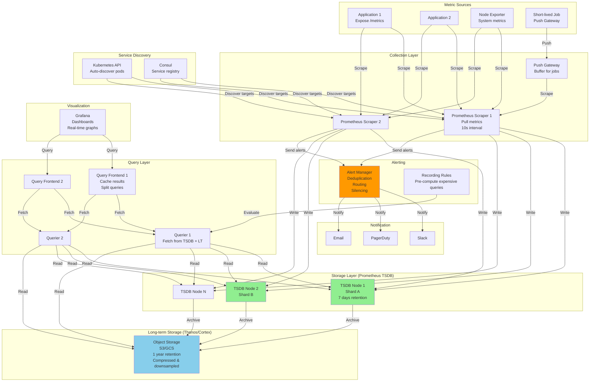

# Metrics Collection \& Monitoring System

## Step 1: Requirements Clarification

### Functional Requirements

**Metrics Collection:**

- Collect system metrics (CPU, memory, disk, network)
- Collect application metrics (request rate, latency, error rate)
- Collect business metrics (revenue, user signups)
- Support multiple collection methods:
    - Push (applications push metrics)
    - Pull (scraper pulls from endpoints)
    - StatsD (UDP-based aggregation)
- Support multiple metric types (counter, gauge, histogram, summary)

**Metrics Storage:**

- Store time-series data efficiently
- Support high cardinality labels/tags
- Compression for historical data
- Retention policies (1h at 10s resolution, 30d at 1m resolution, 1y at 1h resolution)

**Metrics Querying:**

- Query by time range and labels
- Aggregation functions (sum, avg, min, max, percentiles)
- Rate calculations (requests per second)
- Mathematical operations (+, -, *, /)
- Alerting queries (threshold, anomaly detection)

**Visualization:**

- Real-time dashboards
- Historical trend analysis
- Heatmaps for latency distributions
- Multi-dimensional graphs

**Alerting:**

- Threshold-based alerts (CPU > 80%)
- Rate-of-change alerts (error rate doubled)
- Anomaly detection (ML-based)
- Alert routing (email, Slack, PagerDuty)
- Alert deduplication and grouping

**Out of Scope:**

- Log aggregation (separate system)
- Distributed tracing
- Profiling


### Non-Functional Requirements

**Scale:**

- 10,000 hosts/services
- 1M unique time series (metric + labels combination)
- 10M data points per second
- 100 TB of metrics data (1 year retention)

**Performance:**

- Ingestion latency: <1 second
- Query latency: <5 seconds for 24-hour window
- Dashboard refresh: <2 seconds

**Reliability:**

- 99.99% uptime for collection
- Data loss tolerance: <0.1% (eventual consistency OK)
- Alert delivery: 99.9% within 1 minute

**Retention:**

- Raw data (10s resolution): 7 days
- Downsampled (1m resolution): 30 days
- Aggregated (1h resolution): 1 year

***

## Step 2: Metrics Theory \& Concepts

### 2.1 Metric Types

**Counter (Monotonically Increasing):**

```
Use case: Request count, bytes sent, errors

Example:
http_requests_total{method="GET", status="200"} 15234
http_requests_total{method="POST", status="201"} 8432

Characteristics:
- Only increases (or resets to 0)
- Query with rate() to get requests per second
- Reset on service restart

Query example:
rate(http_requests_total[5m])  // Requests per second over last 5 minutes
```

**Gauge (Can Go Up or Down):**

```
Use case: CPU usage, memory, queue depth, temperature

Example:
node_memory_usage_bytes{host="server-01"} 4294967296
node_cpu_usage_percent{host="server-01", cpu="0"} 45.2

Characteristics:
- Current value at specific time
- Can increase or decrease
- Direct value, not rate

Query example:
avg(node_cpu_usage_percent)  // Average CPU across all nodes
```

**Histogram (Distribution of Values):**

```
Use case: Request latency, response size

Example:
http_request_duration_seconds_bucket{le="0.1"} 5000   // 5000 requests < 100ms
http_request_duration_seconds_bucket{le="0.5"} 8000   // 8000 requests < 500ms
http_request_duration_seconds_bucket{le="1.0"} 9500   // 9500 requests < 1s
http_request_duration_seconds_bucket{le="+Inf"} 10000 // All requests
http_request_duration_seconds_sum 4523.5              // Total time
http_request_duration_seconds_count 10000             // Total requests

Characteristics:
- Pre-defined buckets
- Can calculate percentiles (P95, P99)
- Server-side aggregation

Query example:
histogram_quantile(0.95, http_request_duration_seconds_bucket)  // P95 latency
```

**Summary (Like Histogram but Client-Side):**

```
Use case: Request latency (less preferred than histogram)

Example:
http_request_duration_seconds{quantile="0.5"} 0.2    // P50: 200ms
http_request_duration_seconds{quantile="0.9"} 0.8    // P90: 800ms
http_request_duration_seconds{quantile="0.99"} 2.3   // P99: 2.3s
http_request_duration_seconds_sum 4523.5
http_request_duration_seconds_count 10000

Characteristics:
- Client calculates quantiles
- Cannot aggregate across instances
- Lower server load

Histogram vs Summary:
Histogram: Server aggregation, flexible queries, more storage
Summary: Client aggregation, fixed quantiles, less flexible
```


### 2.2 Time Series Data Model

**Time Series = Metric Name + Labels + Timestamp + Value**

```
Metric Name: http_requests_total
Labels: {method="GET", path="/api/users", status="200", host="web-01"}
Timestamp: 1728048000
Value: 15234

Time Series Identifier (fingerprint):
hash(metric_name + sorted_labels) = "abc123def456"

Cardinality:
- Low cardinality labels: environment (3 values), region (5 values)
- High cardinality labels: user_id (millions), trace_id (billions)

Problem: High cardinality = memory explosion
Solution: Limit label values, use sampling
```


### 2.3 Collection Methods

**Pull Model (Prometheus):**

```
Scraper → HTTP GET /metrics → Application

Advantages:
✅ Central control (scraper config)
✅ Service discovery integration
✅ Scraper can detect down services
✅ Better for batch jobs

Disadvantages:
❌ Application must expose HTTP endpoint
❌ Firewall/network complexity
❌ Scraper becomes bottleneck
```

**Push Model (InfluxDB, Graphite):**

```
Application → Push metrics → Collector

Advantages:
✅ Simple for applications
✅ Works with short-lived jobs
✅ No scraper needed

Disadvantages:
❌ Applications must know collector address
❌ Network failures = lost metrics
❌ No service health monitoring
```

**StatsD (Aggregation):**

```
Application → UDP → StatsD → Backend

Advantages:
✅ Fire-and-forget (non-blocking)
✅ Local aggregation
✅ Language-agnostic

Disadvantages:
❌ UDP = potential loss
❌ Extra hop (latency)
```


### 2.4 Storage - Time Series Database

**Why Not Regular Database?**

```
PostgreSQL:
- Timestamp + Metric + Value
- 10M writes/sec = 10M rows/sec (impossible!)
- Index size explodes
- Range queries slow

Time Series DB:
- Optimized for append-only writes
- Compressed storage (10x-100x)
- Fast range queries
- Automatic downsampling
```

**Compression Techniques:**

```
Gorilla Compression (Facebook):
- XOR previous value
- Store only diff
- Compression: 12x

Example:
Value 1: 100.5 (64 bits)
Value 2: 100.6 → XOR with 100.5 = 0.1 (4 bits after compression)
Value 3: 100.7 → XOR with 100.6 = 0.1 (4 bits)

Result: 64 + 4 + 4 = 72 bits vs 192 bits = 2.6x compression
With timestamp delta: 12x total compression

Delta-of-Delta Encoding:
Timestamp 1: 1728048000
Timestamp 2: 1728048010 (Δ = 10)
Timestamp 3: 1728048020 (Δ = 10, ΔΔ = 0) → Store 0 (1 bit)
Timestamp 4: 1728048030 (Δ = 10, ΔΔ = 0) → Store 0 (1 bit)
```


***

## Step 3: Capacity Estimation

```
Metric Sources:
Hosts: 10,000
Metrics per host: 100 (CPU, memory, disk, network, etc.)
Labels per metric: 5 (host, region, env, etc.)
Scrape interval: 10 seconds

Data Points:
Per host: 100 metrics × 6 scrapes/min = 600 points/min
Total: 10,000 hosts × 600 = 6M points/min = 100K points/sec

Unique Time Series:
Base metrics: 10,000 hosts × 100 metrics = 1M time series
With label combinations: 1M × 3 (avg label cardinality) = 3M time series
Actual (with applications): 10M unique time series

Storage (Raw):
Data point size: 16 bytes (8B timestamp + 8B value)
Per second: 100K points × 16 bytes = 1.6 MB/sec
Per day: 1.6 MB × 86,400 = 138 GB/day
Per week (raw retention): 138 GB × 7 = 966 GB ≈ 1 TB

With Compression (12x):
Per week: 1 TB / 12 = 83 GB

Downsampled Storage:
1-minute resolution (30 days):
  Points: 10M series × 1,440 points/day × 30 days = 432B points
  Size: 432B × 16 bytes / 12 = 576 GB

1-hour resolution (1 year):
  Points: 10M series × 24 points/day × 365 days = 88B points
  Size: 88B × 16 bytes / 12 = 117 GB

Total Storage:
Raw (7 days): 83 GB
1-min (30 days): 576 GB
1-hour (1 year): 117 GB
Total: 776 GB ≈ 800 GB

Memory Requirements:
Active time series (in memory): 10M series × 200 bytes = 2 GB
Write buffer: 100K points/sec × 10 sec × 16 bytes = 16 MB
Query cache: 1 GB
Per node: 3-4 GB

Prometheus TSDBs:
Storage per node: 100 GB
Nodes needed: 800 GB / 100 GB = 8 nodes
With replication (3x): 24 nodes

Query Load:
Dashboard queries: 1000 dashboards × 10 queries each = 10K queries
Refresh interval: 30 seconds
QPS: 10K / 30 = 333 QPS

Per query:
Time range: 1 hour
Series queried: 100
Points per series: 360 (10s interval)
Total points: 36,000 points per query

Network Bandwidth:
Ingestion: 1.6 MB/sec
Replication: 1.6 MB × 2 = 3.2 MB/sec
Queries: 333 QPS × 100 KB avg = 33 MB/sec
Total: ~40 MB/sec
```


***

## Step 4: API Design

### Metrics Exposition (Prometheus Format)

```
GET /metrics

Response: 200 OK
Content-Type: text/plain

# HELP http_requests_total Total HTTP requests
# TYPE http_requests_total counter
http_requests_total{method="GET",status="200"} 15234
http_requests_total{method="POST",status="201"} 8432

# HELP http_request_duration_seconds HTTP request latency
# TYPE http_request_duration_seconds histogram
http_request_duration_seconds_bucket{le="0.1"} 5000
http_request_duration_seconds_bucket{le="0.5"} 8000
http_request_duration_seconds_bucket{le="1.0"} 9500
http_request_duration_seconds_bucket{le="+Inf"} 10000
http_request_duration_seconds_sum 4523.5
http_request_duration_seconds_count 10000

# HELP node_cpu_usage CPU usage percentage
# TYPE node_cpu_usage gauge
node_cpu_usage{cpu="0"} 45.2
node_cpu_usage{cpu="1"} 52.1
```


### Query API (PromQL)

```
GET /api/v1/query?query=rate(http_requests_total[5m])&time=1728048000

Response: 200 OK
{
  "status": "success",
  "data": {
    "resultType": "vector",
    "result": [
      {
        "metric": {
          "method": "GET",
          "status": "200"
        },
        "value": [1728048000, "125.5"]  // [timestamp, value]
      }
    ]
  }
}

// Range query
GET /api/v1/query_range?query=rate(http_requests_total[5m])&start=1728000000&end=1728048000&step=60

Response:
{
  "status": "success",
  "data": {
    "resultType": "matrix",
    "result": [
      {
        "metric": {"method": "GET"},
        "values": [
          [1728000000, "120.3"],
          [1728000060, "125.5"],
          [1728000120, "130.2"]
        ]
      }
    ]
  }
}

// Aggregation
query=sum(rate(http_requests_total[5m])) by (status)
query=avg(node_cpu_usage) by (host)
query=histogram_quantile(0.95, http_request_duration_seconds_bucket)
```


### Push API (Push Gateway)

```json
POST /metrics/job/batch_job/instance/node-01
Content-Type: text/plain

# TYPE job_duration_seconds gauge
job_duration_seconds 123.45

# TYPE job_records_processed counter
job_records_processed 10000

Response: 200 OK
```


### Alerting API

```json
POST /api/v1/alerts
{
  "name": "high_error_rate",
  "expr": "rate(http_requests_total{status=~\"5..\"}[5m]) > 10",
  "duration": "5m",
  "labels": {
    "severity": "critical",
    "team": "backend"
  },
  "annotations": {
    "summary": "High error rate detected",
    "description": "Error rate is {{ $value }} per second"
  }
}

// Alert state
GET /api/v1/alerts

Response: 200 OK
{
  "alerts": [
    {
      "name": "high_error_rate",
      "state": "firing",
      "active_since": "2025-10-04T15:25:00Z",
      "value": 15.3,
      "labels": {"severity": "critical"}
    }
  ]
}
```


***

## Step 5: High-Level Architecture




***

## Step 6: Core Implementation (C++)

### 6.1 Metric Types

```cpp
#include <string>
#include <unordered_map>
#include <vector>
#include <atomic>
#include <mutex>
#include <chrono>

using namespace std::chrono;

// Labels for metrics
using Labels = std::unordered_map<std::string, std::string>;

// Base metric interface
class Metric {
public:
    virtual ~Metric() = default;
    virtual std::string serialize() const = 0;
    virtual std::string getType() const = 0;
};

// Counter (monotonically increasing)
class Counter : public Metric {
private:
    std::atomic<double> value_{0.0};
    std::string name_;
    Labels labels_;
    
public:
    Counter(const std::string& name, const Labels& labels = {})
        : name_(name), labels_(labels) {}
    
    void inc(double amount = 1.0) {
        value_.fetch_add(amount, std::memory_order_relaxed);
    }
    
    double get() const {
        return value_.load(std::memory_order_relaxed);
    }
    
    std::string getType() const override {
        return "counter";
    }
    
    std::string serialize() const override {
        std::string labels_str = serializeLabels();
        return name_ + labels_str + " " + std::to_string(get());
    }
    
private:
    std::string serializeLabels() const {
        if (labels_.empty()) return "";
        
        std::string result = "{";
        bool first = true;
        
        for (const auto& [key, value] : labels_) {
            if (!first) result += ",";
            result += key + "=\"" + value + "\"";
            first = false;
        }
        
        result += "}";
        return result;
    }
};

// Gauge (can go up or down)
class Gauge : public Metric {
private:
    std::atomic<double> value_{0.0};
    std::string name_;
    Labels labels_;
    
public:
    Gauge(const std::string& name, const Labels& labels = {})
        : name_(name), labels_(labels) {}
    
    void set(double value) {
        value_.store(value, std::memory_order_relaxed);
    }
    
    void inc(double amount = 1.0) {
        double current = value_.load(std::memory_order_relaxed);
        while (!value_.compare_exchange_weak(current, current + amount,
                                            std::memory_order_relaxed)) {}
    }
    
    void dec(double amount = 1.0) {
        inc(-amount);
    }
    
    double get() const {
        return value_.load(std::memory_order_relaxed);
    }
    
    std::string getType() const override {
        return "gauge";
    }
    
    std::string serialize() const override {
        std::string labels_str = serializeLabels();
        return name_ + labels_str + " " + std::to_string(get());
    }
    
private:
    std::string serializeLabels() const {
        if (labels_.empty()) return "";
        
        std::string result = "{";
        bool first = true;
        
        for (const auto& [key, value] : labels_) {
            if (!first) result += ",";
            result += key + "=\"" + value + "\"";
            first = false;
        }
        
        result += "}";
        return result;
    }
};

// Histogram (bucketed distribution)
class Histogram : public Metric {
private:
    struct Bucket {
        double upper_bound;
        std::atomic<uint64_t> count{0};
    };
    
    std::string name_;
    Labels labels_;
    std::vector<Bucket> buckets_;
    std::atomic<double> sum_{0.0};
    std::atomic<uint64_t> count_{0};
    
    mutable std::mutex mtx_;
    
public:
    Histogram(const std::string& name, 
             const std::vector<double>& buckets,
             const Labels& labels = {})
        : name_(name), labels_(labels) {
        
        // Add buckets
        for (double bound : buckets) {
            buckets_.push_back({bound, 0});
        }
        
        // Add +Inf bucket
        buckets_.push_back({std::numeric_limits<double>::infinity(), 0});
    }
    
    void observe(double value) {
        // Update buckets
        for (auto& bucket : buckets_) {
            if (value <= bucket.upper_bound) {
                bucket.count.fetch_add(1, std::memory_order_relaxed);
            }
        }
        
        // Update sum and count
        double current_sum = sum_.load(std::memory_order_relaxed);
        while (!sum_.compare_exchange_weak(current_sum, current_sum + value,
                                          std::memory_order_relaxed)) {}
        
        count_.fetch_add(1, std::memory_order_relaxed);
    }
    
    std::string getType() const override {
        return "histogram";
    }
    
    std::string serialize() const override {
        std::lock_guard<std::mutex> lock(mtx_);
        
        std::string result;
        std::string base_labels = serializeLabels();
        
        // Serialize buckets
        for (const auto& bucket : buckets_) {
            std::string le = (bucket.upper_bound == std::numeric_limits<double>::infinity())
                           ? "+Inf"
                           : std::to_string(bucket.upper_bound);
            
            result += name_ + "_bucket";
            
            // Add 'le' label
            if (base_labels.empty()) {
                result += "{le=\"" + le + "\"}";
            } else {
                result += base_labels.substr(0, base_labels.size() - 1);
                result += ",le=\"" + le + "\"}";
            }
            
            result += " " + std::to_string(bucket.count.load(std::memory_order_relaxed));
            result += "\n";
        }
        
        // Serialize sum
        result += name_ + "_sum" + base_labels + " " + 
                 std::to_string(sum_.load(std::memory_order_relaxed)) + "\n";
        
        // Serialize count
        result += name_ + "_count" + base_labels + " " + 
                 std::to_string(count_.load(std::memory_order_relaxed));
        
        return result;
    }
    
private:
    std::string serializeLabels() const {
        if (labels_.empty()) return "";
        
        std::string result = "{";
        bool first = true;
        
        for (const auto& [key, value] : labels_) {
            if (!first) result += ",";
            result += key + "=\"" + value + "\"";
            first = false;
        }
        
        result += "}";
        return result;
    }
};
```


### 6.2 Metrics Registry

```cpp
class MetricsRegistry {
private:
    std::unordered_map<std::string, std::shared_ptr<Metric>> metrics_;
    mutable std::shared_mutex mtx_;
    
public:
    std::shared_ptr<Counter> createCounter(const std::string& name, 
                                          const Labels& labels = {}) {
        std::unique_lock<std::shared_mutex> lock(mtx_);
        
        std::string key = makeKey(name, labels);
        
        if (metrics_.count(key)) {
            return std::dynamic_pointer_cast<Counter>(metrics_[key]);
        }
        
        auto counter = std::make_shared<Counter>(name, labels);
        metrics_[key] = counter;
        
        return counter;
    }
    
    std::shared_ptr<Gauge> createGauge(const std::string& name,
                                      const Labels& labels = {}) {
        std::unique_lock<std::shared_mutex> lock(mtx_);
        
        std::string key = makeKey(name, labels);
        
        if (metrics_.count(key)) {
            return std::dynamic_pointer_cast<Gauge>(metrics_[key]);
        }
        
        auto gauge = std::make_shared<Gauge>(name, labels);
        metrics_[key] = gauge;
        
        return gauge;
    }
    
    std::shared_ptr<Histogram> createHistogram(const std::string& name,
                                              const std::vector<double>& buckets,
                                              const Labels& labels = {}) {
        std::unique_lock<std::shared_mutex> lock(mtx_);
        
        std::string key = makeKey(name, labels);
        
        if (metrics_.count(key)) {
            return std::dynamic_pointer_cast<Histogram>(metrics_[key]);
        }
        
        auto histogram = std::make_shared<Histogram>(name, buckets, labels);
        metrics_[key] = histogram;
        
        return histogram;
    }
    
    std::string serialize() const {
        std::shared_lock<std::shared_mutex> lock(mtx_);
        
        std::string result;
        
        for (const auto& [key, metric] : metrics_) {
            result += "# TYPE " + metric->getType() + "\n";
            result += metric->serialize() + "\n";
        }
        
        return result;
    }
    
private:
    std::string makeKey(const std::string& name, const Labels& labels) const {
        std::string key = name;
        
        // Sort labels for consistent key
        std::vector<std::pair<std::string, std::string>> sorted_labels(
            labels.begin(), labels.end()
        );
        std::sort(sorted_labels.begin(), sorted_labels.end());
        
        for (const auto& [k, v] : sorted_labels) {
            key += "{" + k + "=" + v + "}";
        }
        
        return key;
    }
};
```


### 6.3 HTTP Metrics Exporter

```cpp
#include <httplib.h>

class MetricsExporter {
private:
    MetricsRegistry& registry_;
    httplib::Server server_;
    int port_;
    
public:
    MetricsExporter(MetricsRegistry& registry, int port = 9090)
        : registry_(registry), port_(port) {}
    
    void start() {
        // Expose /metrics endpoint
        server_.Get("/metrics", [this](const httplib::Request&, httplib::Response& res) {
            std::string metrics = registry_.serialize();
            
            res.set_content(metrics, "text/plain; version=0.0.4");
        });
        
        // Health check
        server_.Get("/health", [](const httplib::Request&, httplib::Response& res) {
            res.set_content("OK", "text/plain");
        });
        
        std::cout << "Metrics server listening on port " << port_ << std::endl;
        server_.listen("0.0.0.0", port_);
    }
    
    void stop() {
        server_.stop();
    }
};
```


### 6.4 System Metrics Collector

```cpp
#include <sys/sysinfo.h>
#include <fstream>

class SystemMetricsCollector {
private:
    MetricsRegistry& registry_;
    
    std::shared_ptr<Gauge> cpu_usage_;
    std::shared_ptr<Gauge> memory_usage_;
    std::shared_ptr<Gauge> disk_usage_;
    
    std::thread collector_thread_;
    std::atomic<bool> running_{false};
    
public:
    SystemMetricsCollector(MetricsRegistry& registry)
        : registry_(registry) {
        
        // Create metrics
        cpu_usage_ = registry_.createGauge("node_cpu_usage_percent");
        memory_usage_ = registry_.createGauge("node_memory_usage_bytes");
        disk_usage_ = registry_.createGauge("node_disk_usage_percent");
    }
    
    void start() {
        running_ = true;
        
        collector_thread_ = std::thread([this]() {
            while (running_) {
                collectMetrics();
                std::this_thread::sleep_for(std::chrono::seconds(10));
            }
        });
    }
    
    void stop() {
        running_ = false;
        
        if (collector_thread_.joinable()) {
            collector_thread_.join();
        }
    }
    
private:
    void collectMetrics() {
        // Collect CPU usage
        double cpu = getCPUUsage();
        cpu_usage_->set(cpu);
        
        // Collect memory usage
        uint64_t memory = getMemoryUsage();
        memory_usage_->set(memory);
        
        // Collect disk usage
        double disk = getDiskUsage();
        disk_usage_->set(disk);
    }
    
    double getCPUUsage() {
        static uint64_t prev_idle = 0;
        static uint64_t prev_total = 0;
        
        std::ifstream file("/proc/stat");
        std::string line;
        std::getline(file, line);
        
        // Parse: cpu user nice system idle iowait irq softirq
        uint64_t user, nice, system, idle, iowait, irq, softirq;
        sscanf(line.c_str(), "cpu %lu %lu %lu %lu %lu %lu %lu",
               &user, &nice, &system, &idle, &iowait, &irq, &softirq);
        
        uint64_t total = user + nice + system + idle + iowait + irq + softirq;
        uint64_t idle_time = idle + iowait;
        
        uint64_t diff_idle = idle_time - prev_idle;
        uint64_t diff_total = total - prev_total;
        
        double usage = 100.0 * (1.0 - (double)diff_idle / diff_total);
        
        prev_idle = idle_time;
        prev_total = total;
        
        return usage;
    }
    
    uint64_t getMemoryUsage() {
        struct sysinfo info;
        sysinfo(&info);
        
        return info.totalram - info.freeram;
    }
    
    double getDiskUsage() {
        // Simplified: check root filesystem
        struct statvfs stat;
        statvfs("/", &stat);
        
        uint64_t total = stat.f_blocks * stat.f_frsize;
        uint64_t available = stat.f_bavail * stat.f_frsize;
        uint64_t used = total - available;
        
        return 100.0 * used / total;
    }
};
```


### 6.5 Application Metrics Example

```cpp
class WebServer {
private:
    MetricsRegistry& registry_;
    
    // Metrics
    std::shared_ptr<Counter> requests_total_;
    std::shared_ptr<Histogram> request_duration_;
    std::shared_ptr<Gauge> active_connections_;
    
public:
    WebServer(MetricsRegistry& registry) : registry_(registry) {
        // Create metrics
        requests_total_ = registry_.createCounter("http_requests_total", 
            {{"service", "api"}});
        
        request_duration_ = registry_.createHistogram("http_request_duration_seconds",
            {0.001, 0.01, 0.1, 0.5, 1.0, 5.0});  // Buckets: 1ms, 10ms, 100ms, 500ms, 1s, 5s
        
        active_connections_ = registry_.createGauge("http_active_connections");
    }
    
    void handleRequest() {
        auto start = steady_clock::now();
        
        // Increment active connections
        active_connections_->inc();
        
        // Process request
        processRequest();
        
        // Decrement active connections
        active_connections_->dec();
        
        // Increment request counter
        requests_total_->inc();
        
        // Record latency
        auto end = steady_clock::now();
        double duration = duration_cast<milliseconds>(end - start).count() / 1000.0;
        request_duration_->observe(duration);
    }
    
private:
    void processRequest() {
        // Simulate request processing
        std::this_thread::sleep_for(std::chrono::milliseconds(rand() % 100));
    }
};
```


### 6.6 Complete Monitoring System

```cpp
int main() {
    std::cout << "=== Metrics Collection & Monitoring System ===" << std::endl;
    
    // Create registry
    MetricsRegistry registry;
    
    // Start system metrics collector
    SystemMetricsCollector system_collector(registry);
    system_collector.start();
    
    // Create web server with metrics
    WebServer web_server(registry);
    
    // Simulate requests
    std::thread request_simulator([&web_server]() {
        for (int i = 0; i < 100; ++i) {
            web_server.handleRequest();
            std::this_thread::sleep_for(std::chrono::milliseconds(100));
        }
    });
    
    // Start metrics exporter
    MetricsExporter exporter(registry, 9090);
    
    std::cout << "\nMetrics available at http://localhost:9090/metrics" << std::endl;
    std::cout << "Press Enter to stop..." << std::endl;
    
    std::thread server_thread([&exporter]() {
        exporter.start();
    });
    
    std::cin.get();
    
    // Stop components
    system_collector.stop();
    exporter.stop();
    
    if (request_simulator.joinable()) {
        request_simulator.join();
    }
    
    if (server_thread.joinable()) {
        server_thread.detach();
    }
    
    // Print final metrics
    std::cout << "\n=== Final Metrics ===" << std::endl;
    std::cout << registry.serialize() << std::endl;
    
    return 0;
}
```


***

## Step 7: Advanced Features

### 7.1 Recording Rules (Pre-computation)

```yaml
# recording_rules.yml
groups:
  - name: api_metrics
    interval: 30s
    rules:
      # Pre-compute request rate (expensive query)
      - record: api:requests:rate5m
        expr: rate(http_requests_total[5m])
      
      # Pre-compute error rate
      - record: api:errors:rate5m
        expr: rate(http_requests_total{status=~"5.."}[5m])
      
      # Pre-compute P95 latency
      - record: api:latency:p95
        expr: histogram_quantile(0.95, http_request_duration_seconds_bucket)
```


### 7.2 Alerting Rules

```yaml
# alerting_rules.yml
groups:
  - name: api_alerts
    interval: 30s
    rules:
      - alert: HighErrorRate
        expr: api:errors:rate5m > 10
        for: 5m
        labels:
          severity: critical
          team: backend
        annotations:
          summary: "High error rate detected"
          description: "Error rate is {{ $value }} per second (threshold: 10)"
      
      - alert: HighLatency
        expr: api:latency:p95 > 1.0
        for: 5m
        labels:
          severity: warning
        annotations:
          summary: "High P95 latency"
          description: "P95 latency is {{ $value }}s (threshold: 1s)"
      
      - alert: LowDiskSpace
        expr: node_disk_usage_percent > 80
        for: 10m
        labels:
          severity: warning
        annotations:
          summary: "Low disk space on {{ $labels.instance }}"
          description: "Disk usage is {{ $value }}%"
```


### 7.3 Downsampling (Data Reduction)

```cpp
class Downsampler {
public:
    struct DataPoint {
        int64_t timestamp;
        double value;
    };
    
    // Downsample from 10s to 1m resolution
    std::vector<DataPoint> downsample(const std::vector<DataPoint>& raw_data,
                                     int64_t window_sec = 60) {
        std::vector<DataPoint> downsampled;
        
        if (raw_data.empty()) return downsampled;
        
        double sum = 0;
        int count = 0;
        int64_t window_start = (raw_data[0].timestamp / window_sec) * window_sec;
        
        for (const auto& point : raw_data) {
            int64_t current_window = (point.timestamp / window_sec) * window_sec;
            
            if (current_window != window_start) {
                // Save aggregated point
                if (count > 0) {
                    downsampled.push_back({window_start, sum / count});
                }
                
                // Start new window
                window_start = current_window;
                sum = 0;
                count = 0;
            }
            
            sum += point.value;
            count++;
        }
        
        // Save last window
        if (count > 0) {
            downsampled.push_back({window_start, sum / count});
        }
        
        return downsampled;
    }
};

// Example:
// Raw (10s): 100 data points = 1.6 KB
// Downsampled (1m): 17 data points = 272 bytes
// Compression: 6x reduction
```


***

## Step 8: Bottlenecks \& Optimizations

### Bottleneck 1: High Cardinality

**Problem:** 1M unique time series × 1000 labels = 1B series = OOM

**Solution: Cardinality Limits**

```cpp
class CardinalityLimiter {
private:
    std::unordered_map<std::string, int> label_cardinality_;
    const int MAX_CARDINALITY = 10000;
    
public:
    bool allowLabels(const Labels& labels) {
        for (const auto& [key, value] : labels) {
            std::string label_key = key + "=" + value;
            
            if (++label_cardinality_[label_key] > MAX_CARDINALITY) {
                std::cerr << "Cardinality limit exceeded for " << label_key << std::endl;
                return false;
            }
        }
        
        return true;
    }
};

// Best practices:
// ✅ Use: environment, region, service (low cardinality)
// ❌ Avoid: user_id, trace_id, session_id (high cardinality)
```


### Bottleneck 2: Query Performance

**Problem:** Querying 1M time series is slow

**Solution: Indexing + Caching**

```cpp
class TimeSeriesIndex {
private:
    // Inverted index: label value → time series IDs
    std::unordered_map<std::string, std::unordered_set<uint64_t>> index_;
    
public:
    void addTimeSeries(uint64_t series_id, const Labels& labels) {
        for (const auto& [key, value] : labels) {
            std::string index_key = key + "=" + value;
            index_[index_key].insert(series_id);
        }
    }
    
    std::unordered_set<uint64_t> findTimeSeries(const Labels& selector) {
        if (selector.empty()) {
            return {};
        }
        
        // Intersect all matching series
        std::unordered_set<uint64_t> result;
        bool first = true;
        
        for (const auto& [key, value] : selector) {
            std::string index_key = key + "=" + value;
            
            if (first) {
                result = index_[index_key];
                first = false;
            } else {
                // Intersect
                std::unordered_set<uint64_t> intersection;
                for (uint64_t id : result) {
                    if (index_[index_key].count(id)) {
                        intersection.insert(id);
                    }
                }
                result = intersection;
            }
        }
        
        return result;
    }
};

// Query: {service="api", env="prod"}
// Without index: Scan all 1M series → 1 second
// With index: Lookup 2 sets + intersect → 10ms (100x faster)
```


### Bottleneck 3: Storage Size

**Problem:** 100 TB of metrics

**Solution: Compression + Tiering**

```
Hot tier (SSD): Last 7 days, full resolution
- Access: Every dashboard query
- Size: 1 TB

Warm tier (HDD): 8-30 days, 1min resolution
- Access: Historical analysis
- Size: 3 TB

Cold tier (S3): 31-365 days, 1hour resolution
- Access: Rare, long-term trends
- Size: 5 TB

Total: 9 TB (vs 100 TB raw)
Savings: 91%
```


***

## Step 9: Monitoring the Monitoring

**Meta-Metrics (Monitor the monitoring system itself):**

```cpp
// Scrape duration
scrape_duration_seconds{job="prometheus"} 0.15

// Sample ingestion rate
prometheus_tsdb_head_samples_appended_total 1.5e6

// Query duration
prometheus_query_duration_seconds{quantile="0.99"} 2.3

// Storage usage
prometheus_tsdb_storage_bytes_total 8.5e10

// Alerts
alertmanager_alerts_active 3
```


***

## Summary: Key Decisions

| Aspect | Decision | Rationale |
| :-- | :-- | :-- |
| **Collection** | Pull (scraping) | Service discovery, health checks |
| **Storage** | Time-series DB (Prometheus TSDB) | Optimized for time-series |
| **Retention** | Tiered (hot/warm/cold) | Cost optimization |
| **Query Language** | PromQL | Powerful, industry standard |
| **Alerting** | Threshold + rate-of-change | Cover most cases |
| **Visualization** | Grafana | Rich dashboards, integrations |

**Performance Characteristics:**

```
Ingestion:
- Per scraper: 100K samples/sec
- Cluster: 10M samples/sec

Storage:
- Compression: 12x (Gorilla)
- Hot storage: 1 TB
- Total (1 year): 9 TB

Query:
- Simple (1 series, 1h): <100ms
- Complex (1K series, 24h): <5 seconds
- Dashboard (100 queries): <10 seconds

Resource Usage:
- Prometheus: 4 GB RAM, 20% CPU
- Grafana: 500 MB RAM, 5% CPU
```

**Prometheus vs Alternatives:**


| System | Storage Model | Query Language | Scalability | Cost |
| :-- | :-- | :-- | :-- | :-- |
| **Prometheus** | Local TSDB | PromQL | Medium (federation) | Low |
| **InfluxDB** | TSM engine | InfluxQL/Flux | High (clustering) | Medium |
| **Datadog** | Managed | Custom | Very High | Very High |
| **CloudWatch** | Managed | Metrics Insights | High | High |
| **Victoria Metrics** | Custom | PromQL | Very High | Low |

This design handles **10M metrics/sec** with **<1 second latency** and **9 TB storage** using efficient time-series compression and tiered storage!

