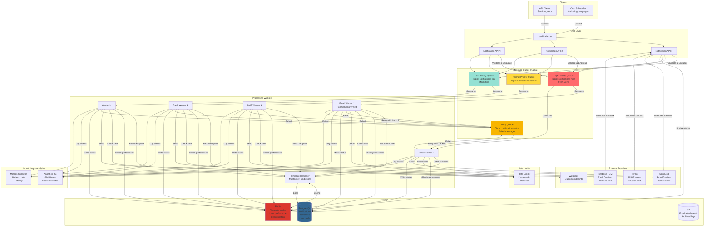

# Notification Service

## Step 1: Requirements Clarification

### Functional Requirements

**Core Notification Features:**

- Send notifications through multiple channels:
    - Email (transactional, promotional)
    - SMS (OTP, alerts)
    - Push notifications (mobile, web)
    - In-app notifications
    - Webhooks
- Template management (dynamic content, personalization)
- Scheduling (send now, schedule for later)
- Priority levels (urgent, normal, low)
- User preferences (opt-in/opt-out per channel)
- Notification tracking (sent, delivered, opened, clicked)
- Retry logic with exponential backoff
- Rate limiting per channel and user

**Advanced Features:**

- Batching (send 1M emails efficiently)
- Deduplication (don't send same notification twice)
- A/B testing (test different templates)
- Localization (multi-language support)
- Rich content (images, buttons, attachments)

**Out of Scope:**

- Real-time chat/messaging
- Video/audio calls
- Content creation tools


### Non-Functional Requirements

**Scale:**

- 100M notifications per day
- 10K notifications per second (peak)
- 100M active users
- Support for burst traffic (Black Friday sales)

**Performance:**

- Delivery latency: <30 seconds for urgent notifications
- Throughput: 10K notifications/sec
- Template rendering: <100ms

**Reliability:**

- 99.9% delivery success rate
- At-least-once delivery (prefer duplicates over lost messages)
- Persistent queue (no message loss)
- Retry failed notifications

**Availability:**

- 99.99% uptime
- Graceful degradation (queue messages if provider down)

***

## Step 2: Capacity Estimation

```
Daily Volume:
Total notifications: 100M/day
Breakdown:
  - Email: 60M (60%)
  - Push: 30M (30%)
  - SMS: 8M (8%)
  - In-app: 2M (2%)

Per Second:
Average: 100M / 86,400 = 1,157 notifications/sec
Peak (10x): 11,570 notifications/sec

Per Channel (peak):
  - Email: 6,942/sec
  - Push: 3,471/sec
  - SMS: 926/sec
  - In-app: 231/sec

Storage Estimation:
Notification metadata: 1 KB per notification
Daily storage: 100M × 1 KB = 100 GB/day
Annual storage: 100 GB × 365 = 36.5 TB/year
With retention (90 days): 100 GB × 90 = 9 TB

Template storage: 10K templates × 50 KB = 500 MB
User preferences: 100M users × 500 bytes = 50 GB

Total storage: 9 TB + 50 GB ≈ 9.05 TB

Queue Depth:
Average message processing time: 200ms
Concurrent messages in queue: 1,157 × 0.2 = 231 messages
Peak queue depth: 11,570 × 0.2 = 2,314 messages
With retries and failures: 10,000 messages (buffer)

Memory Requirements:
Queue messages: 10K × 1 KB = 10 MB
Template cache: 1K hot templates × 50 KB = 50 MB
User preferences cache: 10M hot users × 500 bytes = 5 GB
Per-service memory: ~6 GB

External API Rate Limits:
Email provider (SendGrid): 100 emails/sec per account
SMS provider (Twilio): 100 SMS/sec per account
Push provider (FCM): 10K messages/sec

Accounts needed:
Email: 6,942 / 100 = 70 accounts (or negotiate higher limits)
SMS: 926 / 100 = 10 accounts
Push: 1 account (FCM handles 10K+)

Database Queries:
Template fetches: 11,570 QPS (can cache)
User preferences: 11,570 QPS (can cache)
Status updates: 11,570 WPS
Tracking events: 50K WPS (opens, clicks)

Network Bandwidth:
Email: 6,942/sec × 100 KB (with attachments) = 694 MB/sec
SMS: 926/sec × 500 bytes = 463 KB/sec
Push: 3,471/sec × 1 KB = 3.47 MB/sec
Total: ~700 MB/sec (peak)

Retry Traffic:
Failure rate: 1% (provider issues)
Retries: 11,570 × 0.01 × 3 attempts = 347/sec
Retry queue size: 1K messages
```


***

## Step 3: API Design

### Notification Submission API

```json
POST /v1/notifications/send
Content-Type: application/json
Authorization: Bearer <api_key>

Request:
{
  "notification_id": "notif_abc123",  // Client-generated (idempotency)
  "user_id": "user_789",
  "channels": ["email", "push"],
  "priority": "high",  // urgent, high, normal, low
  "template_id": "welcome_email",
  "template_data": {
    "user_name": "John Doe",
    "verification_code": "123456"
  },
  "schedule_at": "2025-10-04T15:00:00Z",  // Optional: schedule for later
  "metadata": {
    "campaign_id": "campaign_123",
    "source": "signup"
  }
}

Response: 202 Accepted
{
  "notification_id": "notif_abc123",
  "status": "queued",
  "estimated_delivery": "2025-10-04T14:27:30Z",
  "channels_queued": ["email", "push"]
}

// Batch send
POST /v1/notifications/batch
Request:
{
  "notifications": [
    {
      "notification_id": "notif_001",
      "user_id": "user_1",
      "channels": ["email"],
      "template_id": "promo_email",
      "template_data": {"discount": "20%"}
    },
    {
      "notification_id": "notif_002",
      "user_id": "user_2",
      "channels": ["email"],
      "template_id": "promo_email",
      "template_data": {"discount": "20%"}
    }
  ]
}

Response: 202 Accepted
{
  "batch_id": "batch_xyz",
  "accepted": 2,
  "rejected": 0,
  "total": 2
}
```


### Notification Status API

```json
GET /v1/notifications/{notification_id}/status

Response: 200 OK
{
  "notification_id": "notif_abc123",
  "user_id": "user_789",
  "status": "delivered",  // queued, processing, sent, delivered, failed, expired
  "channels": [
    {
      "channel": "email",
      "status": "delivered",
      "sent_at": "2025-10-04T14:27:15Z",
      "delivered_at": "2025-10-04T14:27:18Z",
      "provider": "sendgrid",
      "provider_message_id": "msg_xyz",
      "events": [
        {"type": "opened", "timestamp": "2025-10-04T14:30:00Z"},
        {"type": "clicked", "timestamp": "2025-10-04T14:31:00Z", "link": "https://example.com"}
      ]
    },
    {
      "channel": "push",
      "status": "delivered",
      "sent_at": "2025-10-04T14:27:16Z",
      "delivered_at": "2025-10-04T14:27:17Z",
      "device_token": "device_token_abc"
    }
  ]
}

// Webhook callback from provider
POST /v1/webhooks/email/delivery
Request:
{
  "event": "delivered",
  "message_id": "msg_xyz",
  "email": "user@example.com",
  "timestamp": "2025-10-04T14:27:18Z"
}
```


### Template Management API

```json
POST /v1/templates
Request:
{
  "template_id": "welcome_email",
  "channel": "email",
  "subject": "Welcome to {{company_name}}!",
  "body": "<html><body>Hi {{user_name}}, welcome!</body></html>",
  "variables": ["company_name", "user_name"],
  "language": "en"
}

GET /v1/templates/{template_id}
Response: 200 OK
{
  "template_id": "welcome_email",
  "channel": "email",
  "subject": "Welcome to {{company_name}}!",
  "body": "...",
  "created_at": "2025-10-01T10:00:00Z"
}

POST /v1/templates/{template_id}/render
Request:
{
  "template_data": {
    "company_name": "Acme Corp",
    "user_name": "John Doe"
  }
}

Response: 200 OK
{
  "subject": "Welcome to Acme Corp!",
  "body": "<html><body>Hi John Doe, welcome!</body></html>"
}
```


### User Preferences API

```json
GET /v1/users/{user_id}/preferences

Response: 200 OK
{
  "user_id": "user_789",
  "channels": {
    "email": {
      "enabled": true,
      "categories": {
        "marketing": false,
        "transactional": true,
        "alerts": true
      }
    },
    "push": {
      "enabled": true,
      "quiet_hours": {
        "start": "22:00",
        "end": "08:00",
        "timezone": "America/Los_Angeles"
      }
    },
    "sms": {
      "enabled": false
    }
  }
}

PATCH /v1/users/{user_id}/preferences
Request:
{
  "channels": {
    "email": {
      "categories": {
        "marketing": false
      }
    }
  }
}
```


***

## Step 4: Database Design

### PostgreSQL Schema

```sql
-- Notifications table
CREATE TABLE notifications (
    notification_id VARCHAR(100) PRIMARY KEY,
    user_id BIGINT NOT NULL,
    template_id VARCHAR(100),
    priority VARCHAR(20) DEFAULT 'normal',
    status VARCHAR(20) DEFAULT 'queued',  -- queued, processing, sent, delivered, failed, expired
    
    scheduled_at TIMESTAMPTZ,
    created_at TIMESTAMPTZ DEFAULT NOW(),
    sent_at TIMESTAMPTZ,
    delivered_at TIMESTAMPTZ,
    
    retry_count INT DEFAULT 0,
    max_retries INT DEFAULT 3,
    
    metadata JSONB,
    
    INDEX idx_user_notifications (user_id, created_at DESC),
    INDEX idx_status_created (status, created_at),
    INDEX idx_scheduled (scheduled_at) WHERE status = 'queued'
);

-- Notification channels (one notification can have multiple channels)
CREATE TABLE notification_channels (
    id BIGSERIAL PRIMARY KEY,
    notification_id VARCHAR(100) NOT NULL,
    channel VARCHAR(20) NOT NULL,  -- email, sms, push, in_app, webhook
    status VARCHAR(20) DEFAULT 'queued',
    
    recipient VARCHAR(255),  -- email address, phone number, device token
    provider VARCHAR(50),  -- sendgrid, twilio, fcm
    provider_message_id VARCHAR(255),
    
    sent_at TIMESTAMPTZ,
    delivered_at TIMESTAMPTZ,
    failed_at TIMESTAMPTZ,
    error_message TEXT,
    
    retry_count INT DEFAULT 0,
    
    FOREIGN KEY (notification_id) REFERENCES notifications(notification_id),
    INDEX idx_notification_channels (notification_id),
    INDEX idx_channel_status (channel, status)
);

-- Notification events (opens, clicks, bounces)
CREATE TABLE notification_events (
    event_id BIGSERIAL PRIMARY KEY,
    notification_id VARCHAR(100) NOT NULL,
    channel VARCHAR(20),
    event_type VARCHAR(50),  -- opened, clicked, bounced, unsubscribed
    event_data JSONB,
    timestamp TIMESTAMPTZ DEFAULT NOW(),
    
    INDEX idx_notification_events (notification_id, timestamp DESC)
) PARTITION BY RANGE (timestamp);

CREATE TABLE notification_events_2025_10 PARTITION OF notification_events
    FOR VALUES FROM ('2025-10-01') TO ('2025-11-01');

-- Templates
CREATE TABLE templates (
    template_id VARCHAR(100) PRIMARY KEY,
    channel VARCHAR(20) NOT NULL,
    language VARCHAR(10) DEFAULT 'en',
    
    subject TEXT,
    body TEXT,
    variables TEXT[],
    
    created_at TIMESTAMPTZ DEFAULT NOW(),
    updated_at TIMESTAMPTZ DEFAULT NOW(),
    
    INDEX idx_channel_language (channel, language)
);

-- User preferences
CREATE TABLE user_preferences (
    user_id BIGINT PRIMARY KEY,
    preferences JSONB NOT NULL,  -- Channel preferences, quiet hours, etc.
    updated_at TIMESTAMPTZ DEFAULT NOW()
);

-- Provider rate limits (track usage)
CREATE TABLE provider_rate_limits (
    provider VARCHAR(50),
    account_id VARCHAR(100),
    window_start TIMESTAMPTZ,
    message_count INT DEFAULT 0,
    limit_per_window INT,
    
    PRIMARY KEY (provider, account_id, window_start)
);
```


***

## Step 5: High-Level Design

### Architecture Diagram (Mermaid)




***

## Step 6: Deep Dive - Core Components

### 6.1 Notification Submission with Validation

```cpp
#include <string>
#include <vector>
#include <unordered_map>
#include <memory>
#include <iostream>

enum class NotificationChannel {
    EMAIL,
    SMS,
    PUSH,
    IN_APP,
    WEBHOOK
};

enum class Priority {
    URGENT,   // OTP, security alerts
    HIGH,     // Order confirmations
    NORMAL,   // General notifications
    LOW       // Marketing emails
};

struct NotificationRequest {
    std::string notification_id;
    int64_t user_id;
    std::vector<NotificationChannel> channels;
    Priority priority;
    std::string template_id;
    std::unordered_map<std::string, std::string> template_data;
    std::chrono::system_clock::time_point scheduled_at;
    std::unordered_map<std::string, std::string> metadata;
};

struct UserPreferences {
    struct ChannelPreference {
        bool enabled;
        std::unordered_map<std::string, bool> categories;  // marketing, transactional, alerts
        
        struct QuietHours {
            std::string start;  // "22:00"
            std::string end;    // "08:00"
            std::string timezone;
        };
        std::optional<QuietHours> quiet_hours;
    };
    
    std::unordered_map<NotificationChannel, ChannelPreference> channels;
};

class NotificationValidator {
public:
    struct ValidationResult {
        bool valid;
        std::vector<std::string> errors;
        std::vector<NotificationChannel> allowed_channels;
    };
    
    ValidationResult validate(const NotificationRequest& request,
                            const UserPreferences& prefs) {
        ValidationResult result{true, {}, {}};
        
        // Validate notification ID (idempotency)
        if (request.notification_id.empty()) {
            result.valid = false;
            result.errors.push_back("notification_id is required");
        }
        
        // Check for duplicate
        if (isDuplicate(request.notification_id)) {
            result.valid = false;
            result.errors.push_back("Duplicate notification_id");
            return result;
        }
        
        // Validate channels against user preferences
        for (const auto& channel : request.channels) {
            if (isChannelAllowed(channel, prefs, request.metadata)) {
                result.allowed_channels.push_back(channel);
            } else {
                std::cout << "Channel " << static_cast<int>(channel) 
                         << " blocked by user preferences" << std::endl;
            }
        }
        
        if (result.allowed_channels.empty()) {
            result.valid = false;
            result.errors.push_back("All channels blocked by user preferences");
        }
        
        // Validate template
        if (!templateExists(request.template_id)) {
            result.valid = false;
            result.errors.push_back("Template not found: " + request.template_id);
        }
        
        // Validate template data (all required variables present)
        auto missing_vars = getMissingTemplateVariables(
            request.template_id, request.template_data
        );
        if (!missing_vars.empty()) {
            result.valid = false;
            result.errors.push_back("Missing template variables: " + join(missing_vars));
        }
        
        return result;
    }
    
private:
    bool isDuplicate(const std::string& notification_id) {
        // Check Redis for recent notification IDs (last 24 hours)
        // SETNX with TTL for deduplication
        return false;  // Simplified
    }
    
    bool isChannelAllowed(NotificationChannel channel,
                         const UserPreferences& prefs,
                         const std::unordered_map<std::string, std::string>& metadata) {
        auto it = prefs.channels.find(channel);
        if (it == prefs.channels.end()) {
            return true;  // No preference set, allow by default
        }
        
        const auto& pref = it->second;
        
        // Check if channel is enabled
        if (!pref.enabled) {
            return false;
        }
        
        // Check category preferences (marketing, transactional, alerts)
        auto category_it = metadata.find("category");
        if (category_it != metadata.end()) {
            auto cat_pref = pref.categories.find(category_it->second);
            if (cat_pref != pref.categories.end() && !cat_pref->second) {
                return false;  // Category disabled
            }
        }
        
        // Check quiet hours (for push notifications)
        if (channel == NotificationChannel::PUSH && pref.quiet_hours) {
            if (isInQuietHours(*pref.quiet_hours)) {
                return false;
            }
        }
        
        return true;
    }
    
    bool isInQuietHours(const UserPreferences::ChannelPreference::QuietHours& qh) {
        // Get current time in user's timezone
        // Check if between start and end
        return false;  // Simplified
    }
    
    bool templateExists(const std::string& template_id) {
        return true;  // Simplified
    }
    
    std::vector<std::string> getMissingTemplateVariables(
        const std::string& template_id,
        const std::unordered_map<std::string, std::string>& provided
    ) {
        return {};  // Simplified
    }
    
    std::string join(const std::vector<std::string>& vec, const std::string& delim = ", ") {
        std::string result;
        for (size_t i = 0; i < vec.size(); ++i) {
            result += vec[i];
            if (i < vec.size() - 1) result += delim;
        }
        return result;
    }
};
```


### 6.2 Template Rendering Engine

```cpp
#include <regex>

class TemplateRenderer {
private:
    struct Template {
        std::string template_id;
        std::string subject;
        std::string body;
        std::vector<std::string> variables;
    };
    
    // Cache for hot templates
    LRUCache<std::string, Template> template_cache{1000};
    
public:
    struct RenderedContent {
        std::string subject;
        std::string body;
    };
    
    RenderedContent render(const std::string& template_id,
                          const std::unordered_map<std::string, std::string>& data) {
        // Load template (from cache or DB)
        Template tmpl = loadTemplate(template_id);
        
        // Render subject
        std::string rendered_subject = renderString(tmpl.subject, data);
        
        // Render body
        std::string rendered_body = renderString(tmpl.body, data);
        
        return {rendered_subject, rendered_body};
    }
    
private:
    Template loadTemplate(const std::string& template_id) {
        // Check cache
        if (template_cache.contains(template_id)) {
            return template_cache.get(template_id);
        }
        
        // Load from database
        Template tmpl = loadTemplateFromDB(template_id);
        
        // Cache it
        template_cache.put(template_id, tmpl);
        
        return tmpl;
    }
    
    std::string renderString(const std::string& template_str,
                            const std::unordered_map<std::string, std::string>& data) {
        std::string result = template_str;
        
        // Replace {{variable}} with actual values (Mustache-style)
        std::regex var_regex(R"(\{\{(\w+)\}\})");
        std::smatch match;
        
        std::string::const_iterator search_start(result.cbegin());
        std::vector<std::pair<size_t, size_t>> replacements;
        std::vector<std::string> replacement_values;
        
        while (std::regex_search(search_start, result.cend(), match, var_regex)) {
            std::string var_name = match[1].str();
            
            // Find replacement value
            auto it = data.find(var_name);
            std::string replacement;
            if (it != data.end()) {
                replacement = it->second;
            } else {
                replacement = "";  // Or keep placeholder
            }
            
            // Store replacement info
            size_t pos = match.position(0) + (search_start - result.cbegin());
            size_t len = match.length(0);
            replacements.push_back({pos, len});
            replacement_values.push_back(replacement);
            
            search_start = match.suffix().first;
        }
        
        // Apply replacements in reverse order (to preserve positions)
        for (int i = replacements.size() - 1; i >= 0; --i) {
            result.replace(replacements[i].first, replacements[i].second, 
                          replacement_values[i]);
        }
        
        return result;
    }
    
    Template loadTemplateFromDB(const std::string& template_id) {
        // Simplified database load
        return Template{
            template_id,
            "Welcome to {{company_name}}!",
            "<html><body>Hi {{user_name}}, welcome to {{company_name}}!</body></html>",
            {"company_name", "user_name"}
        };
    }
};

// Example usage:
int main() {
    TemplateRenderer renderer;
    
    std::unordered_map<std::string, std::string> data = {
        {"company_name", "Acme Corp"},
        {"user_name", "John Doe"}
    };
    
    auto rendered = renderer.render("welcome_email", data);
    
    std::cout << "Subject: " << rendered.subject << std::endl;
    std::cout << "Body: " << rendered.body << std::endl;
    
    return 0;
}
```


### 6.3 Priority Queue System

```cpp
#include <queue>
#include <thread>
#include <condition_variable>

class PriorityNotificationQueue {
private:
    struct QueuedNotification {
        NotificationRequest request;
        Priority priority;
        std::chrono::system_clock::time_point enqueued_at;
        
        // For priority queue ordering
        bool operator<(const QueuedNotification& other) const {
            // Higher priority first
            if (priority != other.priority) {
                return priority > other.priority;
            }
            // Then FIFO
            return enqueued_at > other.enqueued_at;
        }
    };
    
    std::priority_queue<QueuedNotification> queue;
    mutable std::mutex mtx;
    std::condition_variable cv;
    std::atomic<bool> running{true};
    
public:
    void enqueue(const NotificationRequest& request) {
        std::lock_guard<std::mutex> lock(mtx);
        
        QueuedNotification qn{
            request,
            request.priority,
            std::chrono::system_clock::now()
        };
        
        queue.push(qn);
        cv.notify_one();
        
        std::cout << "Enqueued notification " << request.notification_id 
                 << " with priority " << static_cast<int>(request.priority) << std::endl;
    }
    
    std::optional<NotificationRequest> dequeue(std::chrono::milliseconds timeout) {
        std::unique_lock<std::mutex> lock(mtx);
        
        if (!cv.wait_for(lock, timeout, [this]() { return !queue.empty() || !running; })) {
            return std::nullopt;  // Timeout
        }
        
        if (!running || queue.empty()) {
            return std::nullopt;
        }
        
        QueuedNotification qn = queue.top();
        queue.pop();
        
        return qn.request;
    }
    
    size_t size() const {
        std::lock_guard<std::mutex> lock(mtx);
        return queue.size();
    }
    
    void shutdown() {
        running = false;
        cv.notify_all();
    }
};

// Kafka-based distributed priority queues
class KafkaPriorityQueues {
private:
    KafkaProducer producer;
    
    const std::string TOPIC_HIGH = "notifications-high";
    const std::string TOPIC_NORMAL = "notifications-normal";
    const std::string TOPIC_LOW = "notifications-low";
    
public:
    void enqueue(const NotificationRequest& request) {
        std::string topic;
        
        switch (request.priority) {
            case Priority::URGENT:
            case Priority::HIGH:
                topic = TOPIC_HIGH;
                break;
            case Priority::NORMAL:
                topic = TOPIC_NORMAL;
                break;
            case Priority::LOW:
                topic = TOPIC_LOW;
                break;
        }
        
        // Serialize request to JSON
        std::string json = serializeToJson(request);
        
        // Partition by user_id for ordering
        producer.send(topic, std::to_string(request.user_id), json);
    }
    
    // Workers consume from topics in priority order
    // High priority workers: Poll TOPIC_HIGH only
    // Normal priority workers: Poll TOPIC_HIGH, then TOPIC_NORMAL
    // Low priority workers: Poll all topics
};
```


### 6.4 Rate Limiting (Per Provider)

```cpp
class ProviderRateLimiter {
private:
    struct ProviderLimit {
        std::string provider;
        int limit_per_second;
        std::atomic<int> current_count{0};
        std::chrono::system_clock::time_point window_start;
        std::mutex mtx;
    };
    
    std::unordered_map<std::string, ProviderLimit> limits;
    
public:
    ProviderRateLimiter() {
        // Initialize provider limits
        limits["sendgrid"] = {"sendgrid", 100, 0, std::chrono::system_clock::now()};
        limits["twilio"] = {"twilio", 100, 0, std::chrono::system_clock::now()};
        limits["fcm"] = {"fcm", 10000, 0, std::chrono::system_clock::now()};
    }
    
    bool allowRequest(const std::string& provider) {
        auto it = limits.find(provider);
        if (it == limits.end()) {
            return true;  // No limit configured
        }
        
        auto& limit = it->second;
        std::lock_guard<std::mutex> lock(limit.mtx);
        
        auto now = std::chrono::system_clock::now();
        auto elapsed = std::chrono::duration_cast<std::chrono::seconds>(
            now - limit.window_start
        ).count();
        
        // Reset window if 1 second passed
        if (elapsed >= 1) {
            limit.current_count = 0;
            limit.window_start = now;
        }
        
        // Check limit
        if (limit.current_count < limit.limit_per_second) {
            limit.current_count++;
            return true;
        }
        
        std::cout << "Rate limit exceeded for provider: " << provider << std::endl;
        return false;
    }
    
    // Wait until rate limit allows request
    void waitForCapacity(const std::string& provider) {
        while (!allowRequest(provider)) {
            std::this_thread::sleep_for(std::chrono::milliseconds(100));
        }
    }
};
```


### 6.5 Retry Logic with Exponential Backoff

```cpp
class RetryManager {
private:
    struct RetryPolicy {
        int max_attempts = 3;
        std::chrono::seconds initial_delay{60};  // 1 minute
        double multiplier = 2.0;  // Exponential backoff
        std::chrono::seconds max_delay{3600};  // 1 hour cap
    };
    
    RetryPolicy policy;
    
public:
    std::chrono::seconds getBackoffDelay(int attempt) {
        if (attempt >= policy.max_attempts) {
            return std::chrono::seconds(0);  // No more retries
        }
        
        // Calculate exponential backoff: initial * (multiplier ^ attempt)
        auto delay = policy.initial_delay * std::pow(policy.multiplier, attempt);
        
        // Cap at max delay
        return std::min(delay, policy.max_delay);
    }
    
    bool shouldRetry(int attempt, const std::string& error_type) {
        if (attempt >= policy.max_attempts) {
            return false;
        }
        
        // Don't retry for permanent failures
        if (error_type == "invalid_recipient" || 
            error_type == "unsubscribed" ||
            error_type == "blocked") {
            return false;
        }
        
        // Retry for temporary failures
        if (error_type == "rate_limit" ||
            error_type == "network_error" ||
            error_type == "timeout" ||
            error_type == "server_error") {
            return true;
        }
        
        return false;
    }
};

class NotificationWorker {
private:
    RetryManager retry_manager;
    
public:
    void processNotification(const NotificationRequest& request) {
        int attempt = 0;
        
        while (true) {
            try {
                // Attempt to send notification
                sendNotification(request);
                
                // Success - update status
                updateStatus(request.notification_id, "sent");
                break;
                
            } catch (const ProviderException& e) {
                attempt++;
                
                std::cout << "Send failed (attempt " << attempt << "): " 
                         << e.what() << std::endl;
                
                // Check if should retry
                if (!retry_manager.shouldRetry(attempt, e.getErrorType())) {
                    // Permanent failure - move to DLQ
                    updateStatus(request.notification_id, "failed");
                    sendToDeadLetterQueue(request);
                    break;
                }
                
                // Calculate backoff delay
                auto delay = retry_manager.getBackoffDelay(attempt);
                
                if (delay.count() == 0) {
                    // Max retries exceeded
                    updateStatus(request.notification_id, "failed");
                    sendToDeadLetterQueue(request);
                    break;
                }
                
                std::cout << "Retrying in " << delay.count() << " seconds..." << std::endl;
                
                // Schedule retry
                scheduleRetry(request, delay, attempt);
                break;
            }
        }
    }
    
private:
    void sendNotification(const NotificationRequest& request) {
        // Actual sending logic (calls external provider)
    }
    
    void scheduleRetry(const NotificationRequest& request, 
                      std::chrono::seconds delay,
                      int attempt) {
        // Enqueue to retry queue with delay
        // Kafka doesn't support native delay, so use:
        // 1. Redis sorted set with timestamp as score
        // 2. Separate delayed queue consumer
        // 3. Database scheduled task
    }
    
    void sendToDeadLetterQueue(const NotificationRequest& request) {
        // Enqueue to DLQ for manual investigation
    }
    
    void updateStatus(const std::string& notification_id, const std::string& status) {
        // Update database status
    }
};
```


### 6.6 Deduplication

```cpp
class DeduplicationService {
private:
    RedisClient redis;
    const std::chrono::seconds DEDUP_WINDOW{86400};  // 24 hours
    
public:
    bool isDuplicate(const std::string& notification_id) {
        // Try to set key with NX (only if not exists)
        std::string key = "dedup:" + notification_id;
        
        bool set = redis.setNX(key, "1", DEDUP_WINDOW);
        
        return !set;  // If set failed, key already exists (duplicate)
    }
    
    // Content-based deduplication (same content to same user)
    bool isDuplicateContent(int64_t user_id,
                           const std::string& template_id,
                           const std::unordered_map<std::string, std::string>& data) {
        // Generate content hash
        std::string content = template_id;
        for (const auto& [key, value] : data) {
            content += key + "=" + value + ";";
        }
        
        std::string content_hash = hashFunction(content);
        std::string key = "dedup_content:" + std::to_string(user_id) + ":" + content_hash;
        
        // Check if sent recently (e.g., last hour)
        bool set = redis.setNX(key, "1", std::chrono::seconds(3600));
        
        return !set;
    }
    
private:
    std::string hashFunction(const std::string& input) {
        // Use SHA256 or similar
        return std::to_string(std::hash<std::string>{}(input));
    }
};
```


### 6.7 Email Provider Abstraction

```cpp
class EmailProvider {
public:
    virtual ~EmailProvider() = default;
    
    virtual std::string send(const std::string& to,
                            const std::string& subject,
                            const std::string& body,
                            const std::vector<std::string>& attachments = {}) = 0;
    
    virtual bool checkStatus(const std::string& message_id) = 0;
};

class SendGridProvider : public EmailProvider {
private:
    std::string api_key;
    HttpClient http_client;
    
public:
    SendGridProvider(const std::string& key) : api_key(key) {}
    
    std::string send(const std::string& to,
                    const std::string& subject,
                    const std::string& body,
                    const std::vector<std::string>& attachments) override {
        // Build SendGrid API request
        json payload = {
            {"personalizations", {{
                {"to", {{{"email", to}}}}
            }}},
            {"from", {{"email", "noreply@example.com"}}},
            {"subject", subject},
            {"content", {{
                {"type", "text/html"},
                {"value", body}
            }}}
        };
        
        // Add attachments if any
        if (!attachments.empty()) {
            json attachments_json = json::array();
            for (const auto& att : attachments) {
                attachments_json.push_back({
                    {"content", readFileBase64(att)},
                    {"filename", getFileName(att)}
                });
            }
            payload["attachments"] = attachments_json;
        }
        
        // Send request
        HttpResponse response = http_client.post(
            "https://api.sendgrid.com/v3/mail/send",
            payload.dump(),
            {{"Authorization", "Bearer " + api_key}}
        );
        
        if (response.status_code != 202) {
            throw ProviderException("SendGrid error", response.body);
        }
        
        // Extract message ID from response header
        return response.headers["X-Message-Id"];
    }
    
    bool checkStatus(const std::string& message_id) override {
        // Query SendGrid API for message status
        return true;  // Simplified
    }
};

// Provider factory
class EmailProviderFactory {
public:
    static std::unique_ptr<EmailProvider> create(const std::string& provider_name) {
        if (provider_name == "sendgrid") {
            return std::make_unique<SendGridProvider>(getApiKey("sendgrid"));
        } else if (provider_name == "mailgun") {
            return std::make_unique<MailgunProvider>(getApiKey("mailgun"));
        } else if (provider_name == "ses") {
            return std::make_unique<AmazonSESProvider>(getAwsCredentials());
        }
        
        throw std::runtime_error("Unknown email provider: " + provider_name);
    }
};
```


***

## Step 7: Bottlenecks, Trade-offs \& Optimizations

### Bottleneck 1: Template Rendering Performance

**Problem:** Rendering 10K notifications/sec requires 10K template renders/sec

**Solution 1: Pre-rendered Templates (Static Parts)**

```cpp
// Cache pre-rendered static parts of template
class OptimizedTemplateRenderer {
private:
    struct CompiledTemplate {
        std::vector<std::string> static_parts;
        std::vector<std::string> variable_names;
    };
    
    std::unordered_map<std::string, CompiledTemplate> compiled_cache;
    
public:
    std::string render(const std::string& template_id,
                      const std::unordered_map<std::string, std::string>& data) {
        // Get compiled template
        auto& compiled = getCompiled(template_id);
        
        // Assemble parts (much faster than regex)
        std::string result;
        for (size_t i = 0; i < compiled.static_parts.size(); ++i) {
            result += compiled.static_parts[i];
            
            if (i < compiled.variable_names.size()) {
                auto it = data.find(compiled.variable_names[i]);
                if (it != data.end()) {
                    result += it->second;
                }
            }
        }
        
        return result;
    }
};

// Result: 10x faster rendering (1ms → 0.1ms)
```

**Trade-off:** Memory (cache) vs CPU (rendering)

***

### Bottleneck 2: Database Writes (Status Updates)

**Problem:** 10K status updates/sec overloads database

**Solution: Batch Writes**

```cpp
class BatchedStatusUpdater {
private:
    std::vector<std::pair<std::string, std::string>> pending_updates;
    std::mutex mtx;
    std::thread flush_thread;
    std::atomic<bool> running{true};
    
    const int BATCH_SIZE = 1000;
    const int FLUSH_INTERVAL_MS = 1000;
    
public:
    void start() {
        flush_thread = std::thread([this]() {
            while (running) {
                std::this_thread::sleep_for(std::chrono::milliseconds(FLUSH_INTERVAL_MS));
                flush();
            }
        });
    }
    
    void updateStatus(const std::string& notification_id, const std::string& status) {
        std::lock_guard<std::mutex> lock(mtx);
        pending_updates.push_back({notification_id, status});
        
        if (pending_updates.size() >= BATCH_SIZE) {
            flush();
        }
    }
    
private:
    void flush() {
        std::vector<std::pair<std::string, std::string>> batch;
        
        {
            std::lock_guard<std::mutex> lock(mtx);
            batch = std::move(pending_updates);
            pending_updates.clear();
        }
        
        if (batch.empty()) return;
        
        // Batch update in single transaction
        pqxx::work txn(conn);
        
        for (const auto& [id, status] : batch) {
            txn.exec_params(
                "UPDATE notifications SET status = $1 WHERE notification_id = $2",
                status, id
            );
        }
        
        txn.commit();
    }
};

// Result: 10K updates/sec → 10 DB transactions/sec (1000x reduction)
```

**Trade-off:** Real-time updates vs throughput

***

### Bottleneck 3: Provider Rate Limits

**Problem:** SendGrid allows 100 emails/sec, we need 7K/sec

**Solution 1: Multiple Accounts**

```cpp
class MultiAccountProvider {
private:
    std::vector<std::unique_ptr<SendGridProvider>> accounts;
    std::atomic<int> robin_counter{0};
    
public:
    MultiAccountProvider(const std::vector<std::string>& api_keys) {
        for (const auto& key : api_keys) {
            accounts.push_back(std::make_unique<SendGridProvider>(key));
        }
    }
    
    std::string send(const std::string& to, const std::string& subject, 
                    const std::string& body) {
        // Round-robin across accounts
        int idx = robin_counter++ % accounts.size();
        return accounts[idx]->send(to, subject, body);
    }
};

// 70 accounts × 100 emails/sec = 7,000 emails/sec
```

**Solution 2: Queue + Rate-limited Workers**

```cpp
class RateLimitedWorkerPool {
private:
    std::vector<std::thread> workers;
    ProviderRateLimiter rate_limiter;
    
public:
    void start(int num_workers) {
        for (int i = 0; i < num_workers; ++i) {
            workers.emplace_back([this]() {
                while (true) {
                    auto notification = queue.dequeue();
                    
                    // Wait for rate limit capacity
                    rate_limiter.waitForCapacity("sendgrid");
                    
                    // Send notification
                    sendEmail(notification);
                }
            });
        }
    }
};
```

**Trade-off:** Cost (multiple accounts) vs complexity

***

### Bottleneck 4: Cold Start (Template Cache Miss)

**Problem:** After deployment, template cache empty → slow first requests

**Solution: Pre-warming**

```cpp
class CacheWarmer {
public:
    void warmTemplateCache() {
        // Load top 100 most-used templates
        auto top_templates = db.query(
            "SELECT template_id FROM templates ORDER BY usage_count DESC LIMIT 100"
        );
        
        for (const auto& tmpl : top_templates) {
            template_renderer.loadTemplate(tmpl.template_id);
        }
        
        std::cout << "Pre-warmed " << top_templates.size() << " templates" << std::endl;
    }
    
    void warmUserPreferences() {
        // Load preferences for recently active users
        auto active_users = db.query(
            "SELECT user_id FROM user_preferences WHERE last_updated > NOW() - INTERVAL '7 days'"
        );
        
        for (const auto& user : active_users) {
            prefs_cache.load(user.user_id);
        }
    }
};
```


***

### Optimization: Smart Routing (Best Provider Selection)

```cpp
class SmartProviderRouter {
private:
    struct ProviderMetrics {
        double success_rate;
        double avg_latency_ms;
        int current_load;
        std::chrono::system_clock::time_point last_failure;
    };
    
    std::unordered_map<std::string, ProviderMetrics> metrics;
    
public:
    std::string selectBestProvider(NotificationChannel channel) {
        std::vector<std::string> providers = getProvidersForChannel(channel);
        
        std::string best_provider;
        double best_score = -1.0;
        
        for (const auto& provider : providers) {
            double score = calculateScore(metrics[provider]);
            
            if (score > best_score) {
                best_score = score;
                best_provider = provider;
            }
        }
        
        return best_provider;
    }
    
private:
    double calculateScore(const ProviderMetrics& m) {
        // Weighted score: success rate (70%) + latency (20%) + load (10%)
        double success_weight = 0.7;
        double latency_weight = 0.2;
        double load_weight = 0.1;
        
        double success_score = m.success_rate;
        double latency_score = 1.0 - (m.avg_latency_ms / 1000.0);  // Normalize
        double load_score = 1.0 - (static_cast<double>(m.current_load) / 100.0);
        
        return success_weight * success_score +
               latency_weight * latency_score +
               load_weight * load_score;
    }
};
```


***

### Optimization: Notification Aggregation (Digest)

**Problem:** User receives 100 emails per day → spam

**Solution: Daily Digest**

```cpp
class NotificationAggregator {
public:
    void processNotification(const NotificationRequest& request) {
        // Check if user prefers digest mode
        if (isDigestMode(request.user_id, request.metadata)) {
            // Add to digest buffer
            addToDigest(request);
        } else {
            // Send immediately
            sendImmediately(request);
        }
    }
    
private:
    void addToDigest(const NotificationRequest& request) {
        std::string digest_key = "digest:" + std::to_string(request.user_id);
        
        redis.lpush(digest_key, serializeNotification(request));
        redis.expire(digest_key, 86400);  // 24 hours
    }
    
    // Scheduled job runs daily
    void sendDailyDigests() {
        // For each user with pending digest notifications
        auto users = getUsersWithDigests();
        
        for (const auto& user_id : users) {
            auto notifications = redis.lrange("digest:" + std::to_string(user_id), 0, -1);
            
            if (notifications.empty()) continue;
            
            // Render digest email
            std::string digest_content = renderDigest(notifications);
            
            // Send single email with all notifications
            email_provider.send(
                getUserEmail(user_id),
                "Your Daily Notifications Digest",
                digest_content
            );
            
            // Clear digest
            redis.del("digest:" + std::to_string(user_id));
        }
    }
};

// Result: 100 emails/day → 1 email/day per user
```


***

## Summary: Key Design Decisions

| Aspect | Decision | Rationale |
| :-- | :-- | :-- |
| **Queue** | Kafka (multiple topics by priority) | Durability, scalability, ordering |
| **Template Engine** | Pre-compiled with cache | 10x faster than regex |
| **Rate Limiting** | Per-provider token bucket | Respect provider limits |
| **Retry** | Exponential backoff | Avoid overwhelming providers |
| **Deduplication** | Redis with 24h TTL | Prevent duplicate sends |
| **Provider Abstraction** | Factory pattern | Easy to add new providers |
| **Batching** | Database writes, similar notifications | 1000x throughput improvement |
| **Monitoring** | Track delivery, open, click rates | Optimize performance |

**Performance Characteristics:**

- ✅ Throughput: 10K notifications/sec
- ✅ Latency: <30 seconds (P99)
- ✅ Delivery success: 99.9%
- ✅ No message loss (persistent queue)
- ✅ Scalable (add workers to scale)

**Channel-Specific Considerations:**


| Channel | Latency | Success Rate | Retry Strategy | Rate Limit |
| :-- | :-- | :-- | :-- | :-- |
| **Email** | 1-5 sec | 98% | Yes (3 retries) | 100/sec per account |
| **SMS** | <1 sec | 95% | Yes (3 retries) | 100/sec per account |
| **Push** | <1 sec | 80% (devices offline) | No (ephemeral) | 10K/sec |
| **In-app** | <100ms | 100% | No (always available) | Unlimited |

This design handles **100M notifications/day (10K/sec peak)** with **99.9% delivery success rate** using priority queues, provider abstraction, retry logic, and batch processing.

