# Parking Lot System Design

## Step 1: Requirements Clarification

### Functional Requirements

**Entry \& Exit:**

- Vehicle entry (scan ticket/QR code/RFID)
- Assign parking spot based on vehicle type
- Generate parking ticket
- Vehicle exit
- Calculate parking fee
- Payment processing (cash, card, digital wallet)

**Parking Spot Management:**

- Multiple vehicle types (motorcycle, compact, large, handicapped, electric)
- Multiple floors/levels
- Real-time availability tracking
- Spot reservation (advance booking)
- Spot guidance (navigate to assigned spot)

**Payment \& Billing:**

- Hourly/daily rates
- Peak hour pricing
- Flat rate
- Monthly subscriptions
- Discounts (senior, military, early bird)
- Receipt generation

**Monitoring \& Management:**

- Occupancy monitoring (current capacity)
- Display availability at entrance
- Unauthorized vehicle detection
- Overstay alerts
- Security cameras integration

**User Features:**

- Mobile app (find spot, reserve, pay)
- License plate recognition (LPR)
- Navigation to assigned spot
- Extend parking time
- Lost ticket handling

**Admin Features:**

- Dashboard (occupancy, revenue)
- Pricing configuration
- Reports (daily/monthly)
- Maintenance scheduling
- User management

**Out of Scope:**

- Valet parking
- Car wash services
- EV charging management (separate system)


### Non-Functional Requirements

**Scale (Based on 2025 data):**

- Capacity: 2,000-5,000 spots (large parking garage)
- Traffic: 50,000 vehicles/month[^1]
- Peak occupancy: 90% during rush hours[^2]
- Vehicles per second: 0.019 VPS[^1]
- License plate recognition accuracy: 95% (daylight), 90% (low light)[^2]

**Performance:**

- Entry/exit processing: <5 seconds
- Spot assignment: <1 second
- Payment processing: <10 seconds
- Real-time availability update: <1 second
- LPR detection: 88% accuracy at 1.5-3m distance[^2]

**Reliability:**

- 99.9% uptime
- No double booking
- Accurate billing (<5% error)[^2]
- Fault tolerance (backup power, offline mode)

**Availability:**

- 24/7 operation
- Graceful degradation (manual mode fallback)

***

## Step 2: Parking Lot Theory \& Concepts

### 2.1 Spot Allocation Algorithms

**Algorithm 1: Nearest Available Spot**

```
Goal: Minimize walking distance

Process:
1. Vehicle enters (size: COMPACT)
2. Find nearest available COMPACT spot to entrance
3. Assign spot

Pros:
✅ User convenience (shortest walk)
✅ Fast allocation (O(1) with sorted data structure)

Cons:
❌ Uneven wear (spots near entrance fill first)
❌ Hotspots (congestion near entrance)

Example:
Entrance → [A1: Free, A2: Free, A3: Occupied, A4: Free]
→ Assign A1 (nearest)
```

**Algorithm 2: Random Allocation**

```
Goal: Balanced utilization

Process:
1. Get all available spots of matching type
2. Randomly select one
3. Assign spot

Pros:
✅ Even distribution
✅ No hotspots

Cons:
❌ Longer walking distance
❌ User dissatisfaction

Best for: Large lots with shuttle service
```

**Algorithm 3: Level-Based Round Robin**

```
Goal: Fill levels evenly

Process:
1. Maintain level pointer (current level to fill)
2. Assign spots from current level
3. When level full → Move to next level
4. When all levels checked → Wrap to first level

Example:
Level 1: [A1: Free, A2: Free] → Assign A1
Level 1: [A1: Occupied, A2: Free] → Assign A2
Level 1: [A1: Occupied, A2: Occupied] → Move to Level 2
Level 2: [B1: Free] → Assign B1

Pros:
✅ Even level usage
✅ Predictable patterns

Used by: Multi-story parking garages
```

**Algorithm 4: Proximity to Exit (Best for Airport Parking)**

```
Goal: Fast exit for travelers

Process:
1. User specifies expected exit time
2. Assign spot near exit for departure time
3. Long-stay → Far spots
4. Short-stay → Near spots

Example:
6-hour stay → Level 3 (far)
30-minute stay → Level 1 (near exit)

Pros:
✅ Optimized for exit traffic
✅ Reduces congestion at departure time
```


### 2.2 Vehicle Size Mapping

```
Spot Types:
┌─────────────────────────┐
│ MOTORCYCLE   (2m × 1m)  │ → Can fit in any spot
├─────────────────────────┤
│ COMPACT      (4m × 2m)  │ → Can fit in LARGE
├─────────────────────────┤
│ LARGE        (5m × 2.5m)│ → Only LARGE spots
├─────────────────────────┤
│ HANDICAPPED  (5m × 3m)  │ → Reserved, accessible
├─────────────────────────┤
│ ELECTRIC     (4m × 2m)  │ → With EV charger
└─────────────────────────┘

Allocation Rules:
1. Try exact match first
2. If unavailable, try larger spot
3. Never assign larger vehicle to smaller spot

Example:
COMPACT vehicle:
  1. Check COMPACT spots → None available
  2. Check LARGE spots → Available
  3. Assign LARGE spot (acceptable)

LARGE vehicle:
  1. Check LARGE spots → None available
  2. Return "No spots available"
     (Cannot fit in COMPACT)
```


### 2.3 Pricing Strategies

**Hourly Pricing:**

```
First hour: $5
Additional hours: $3/hour
Daily max: $25

Example:
3 hours: $5 + $3 + $3 = $11
10 hours: $5 + (9 × $3) = $32 → Capped at $25
```

**Time-of-Day Pricing (Peak Pricing):**

```
Peak hours (8 AM - 6 PM): $8/hour
Off-peak (6 PM - 8 AM): $4/hour
Weekend: $5/hour

Example:
Enter: 7 AM, Exit: 11 AM (4 hours, all peak)
Cost: 4 × $8 = $32

Enter: 5 PM, Exit: 9 PM (4 hours: 1 peak + 3 off-peak)
Cost: (1 × $8) + (3 × $4) = $20
```

**Lost Ticket Penalty:**

```
Standard: Charge for maximum stay (24 hours)
Lost ticket at exit: $25 (flat rate)

Reason: Prevents abuse (long stay, claim lost ticket)
```


### 2.4 Payment Flow

```
Entry:
1. Vehicle arrives at gate
2. Scan license plate (LPR) OR dispense ticket
3. Record entry time
4. Assign spot
5. Open gate
6. Display assigned spot on screen

Exit:
1. Vehicle arrives at exit gate
2. Scan ticket/license plate
3. Calculate duration
4. Calculate fee
5. Process payment
6. Update spot status (available)
7. Open exit gate

States:
┌──────────┐  Enter  ┌──────────┐  Exit   ┌──────────┐
│ AVAILABLE│ ──────→ │ OCCUPIED │ ──────→ │ AVAILABLE│
└──────────┘         └──────────┘         └──────────┘
```


***

## Step 3: Capacity Estimation

```
Parking Lot Specifications:
Total spots: 2,000 spots
Floors: 5 floors × 400 spots/floor
Spot distribution:
  - Compact: 1,200 (60%)
  - Large: 600 (30%)
  - Handicapped: 100 (5%)
  - Motorcycle: 100 (5%)

Traffic:
Monthly vehicles: 50,000 vehicles [web:434]
Daily vehicles: 50,000 / 30 = 1,667 vehicles/day
Vehicles per second: 0.019 VPS [web:434]
Peak hour traffic: 200 vehicles/hour
Average stay duration: 3 hours

Occupancy:
Peak occupancy: 90% = 1,800 occupied spots [web:435]
Off-peak occupancy: 40% = 800 occupied spots
Turnover rate: 1,667 / 2,000 = 0.83 turns/day

Entry/Exit Throughput:
Entry gates: 4 gates
Vehicles per gate per hour: 200 / 4 = 50 vehicles/hour
Processing time per vehicle: 60 / 50 = 1.2 minutes = 72 seconds
Target: <5 seconds → Need more gates OR faster processing

Payment Processing:
Daily revenue: 1,667 vehicles × $15 avg = $25,000/day
Monthly revenue: $750,000/month
Annual revenue: $9 million/year

Payment methods:
  - Cash: 20% (334 transactions/day)
  - Card: 60% (1,000 transactions/day)
  - Mobile: 20% (333 transactions/day)

Database Operations:
Entry writes: 1,667 transactions/day = 0.019 writes/sec
Exit writes: 1,667 transactions/day = 0.019 writes/sec
Spot status updates: 3,334 updates/day = 0.039 writes/sec
Availability queries: 1,667 × 5 (checks before entry) = 8,335/day = 0.096 reads/sec
Total ops: 0.15 ops/sec (very light load!)

Storage:
Transactions per year: 1,667 × 365 = 608,455 transactions
Transaction size: 500 bytes
Annual storage: 608,455 × 500 bytes = 304 MB/year
With 5-year retention: 1.5 GB

Parking spots metadata: 2,000 × 200 bytes = 400 KB
User accounts: 10,000 users × 1 KB = 10 MB
Total: <2 GB (minimal)

Camera System (LPR):
Cameras: 10 cameras (entry/exit points)
Frame rate: 30 FPS
Resolution: 1920×1080
Bandwidth per camera: 4 Mbps
Total bandwidth: 40 Mbps
LPR accuracy: 95% daylight, 90% low light [web:435]
Processing time: <1 second per plate

Sensors (IoT):
Ultrasonic/infrared sensors: 2,000 sensors (1 per spot)
Data per sensor: 1 byte (occupied/available)
Update frequency: Every 10 seconds
Data rate: 2,000 bytes / 10 sec = 200 bytes/sec = negligible

Display Boards:
LED boards: 5 boards (1 per floor)
Update frequency: Real-time
Data: Available spots per type per floor

Mobile App:
Daily active users: 5,000 users
API calls per user: 10 calls
Total API calls: 50,000/day = 0.58 requests/sec

Power & Backup:
Gate systems: 4 gates × 500W = 2 kW
Sensors: 2,000 × 0.5W = 1 kW
Cameras: 10 × 20W = 200W
Servers: 2 kW
Total: ~5.5 kW
Backup: UPS (2 hours) + Generator
```


***

## Step 4: API Design

### Entry \& Exit APIs

```json
POST /api/v1/parking/entry
Request:
{
  "entry_gate_id": "gate_1",
  "vehicle_type": "COMPACT",
  "license_plate": "ABC123",
  "timestamp": "2025-10-04T17:09:00Z"
}

Response: 201 Created
{
  "ticket_id": "TKT-20251004-001234",
  "assigned_spot": {
    "spot_id": "A-1-015",
    "floor": 1,
    "zone": "A",
    "spot_number": "015",
    "type": "COMPACT"
  },
  "entry_time": "2025-10-04T17:09:00Z",
  "qr_code": "data:image/png;base64,iVBORw0KG...",
  "navigation": {
    "directions": "Take elevator to Floor 1, Zone A, Spot 015",
    "distance_meters": 45
  }
}

POST /api/v1/parking/exit
Request:
{
  "ticket_id": "TKT-20251004-001234",
  "exit_gate_id": "gate_2",
  "timestamp": "2025-10-04T20:15:00Z"
}

Response: 200 OK
{
  "ticket_id": "TKT-20251004-001234",
  "entry_time": "2025-10-04T17:09:00Z",
  "exit_time": "2025-10-04T20:15:00Z",
  "duration_minutes": 186,
  "parking_fee": {
    "base_fee": 5.00,
    "additional_hours": 2,
    "hourly_rate": 3.00,
    "subtotal": 11.00,
    "tax": 1.10,
    "total": 12.10,
    "currency": "USD"
  },
  "payment_required": true,
  "payment_url": "/api/v1/payments/pay?ticket_id=TKT-20251004-001234"
}
```


### Availability \& Reservation APIs

```json
GET /api/v1/parking/availability

Response: 200 OK
{
  "total_spots": 2000,
  "available_spots": 450,
  "occupancy_rate": 0.775,
  "by_type": {
    "COMPACT": {
      "total": 1200,
      "available": 250,
      "occupied": 950
    },
    "LARGE": {
      "total": 600,
      "available": 150,
      "occupied": 450
    },
    "HANDICAPPED": {
      "total": 100,
      "available": 30,
      "occupied": 70
    },
    "MOTORCYCLE": {
      "total": 100,
      "available": 20,
      "occupied": 80
    }
  },
  "by_floor": [
    {"floor": 1, "available": 80, "total": 400},
    {"floor": 2, "available": 90, "total": 400},
    {"floor": 3, "available": 95, "total": 400},
    {"floor": 4, "available": 100, "total": 400},
    {"floor": 5, "available": 85, "total": 400}
  ]
}

POST /api/v1/parking/reserve
Authorization: Bearer <token>

Request:
{
  "vehicle_type": "COMPACT",
  "start_time": "2025-10-05T09:00:00Z",
  "end_time": "2025-10-05T18:00:00Z",
  "license_plate": "XYZ789"
}

Response: 201 Created
{
  "reservation_id": "RES-12345",
  "spot": {
    "spot_id": "B-2-042",
    "floor": 2,
    "zone": "B"
  },
  "start_time": "2025-10-05T09:00:00Z",
  "end_time": "2025-10-05T18:00:00Z",
  "estimated_cost": 72.00,
  "qr_code": "data:image/png;base64,...",
  "expires_at": "2025-10-05T09:15:00Z"  // 15 min grace period
}

DELETE /api/v1/parking/reserve/{reservation_id}
Response: 204 No Content
```


### Payment APIs

```json
POST /api/v1/payments/process
Request:
{
  "ticket_id": "TKT-20251004-001234",
  "payment_method": "card",
  "card_details": {
    "card_number": "4242424242424242",
    "exp_month": 12,
    "exp_year": 2027,
    "cvv": "123"
  }
}

Response: 200 OK
{
  "payment_id": "PAY-98765",
  "status": "success",
  "amount": 12.10,
  "currency": "USD",
  "receipt_url": "/api/v1/receipts/PAY-98765",
  "gate_release": true
}

GET /api/v1/receipts/{payment_id}

Response: 200 OK
{
  "receipt_id": "REC-98765",
  "ticket_id": "TKT-20251004-001234",
  "entry_time": "2025-10-04T17:09:00Z",
  "exit_time": "2025-10-04T20:15:00Z",
  "duration": "3 hours 6 minutes",
  "parking_fee": 12.10,
  "spot": "A-1-015",
  "payment_method": "Card ending in 4242",
  "receipt_pdf": "https://parking.com/receipts/REC-98765.pdf"
}
```


### Admin APIs

```json
GET /api/v1/admin/dashboard

Response: 200 OK
{
  "current_occupancy": 1550,
  "capacity": 2000,
  "occupancy_rate": 0.775,
  "today": {
    "vehicles_entered": 1234,
    "vehicles_exited": 1187,
    "revenue": 18750.50,
    "avg_stay_minutes": 185
  },
  "alerts": [
    {
      "type": "overstay",
      "spot_id": "C-3-087",
      "duration_hours": 26,
      "license_plate": "DEF456"
    }
  ]
}

PUT /api/v1/admin/pricing
Request:
{
  "base_fee": 5.00,
  "hourly_rate": 3.00,
  "daily_max": 25.00,
  "peak_hours": {
    "enabled": true,
    "hours": [8, 9, 10, 11, 12, 13, 14, 15, 16, 17, 18],
    "multiplier": 1.5
  }
}

Response: 200 OK
```


***

## Step 5: Database Design

### PostgreSQL Schema

```sql
-- Parking spots
CREATE TABLE parking_spots (
    spot_id VARCHAR(20) PRIMARY KEY,  -- A-1-015
    floor INT NOT NULL,
    zone VARCHAR(10),
    spot_number VARCHAR(10),
    spot_type VARCHAR(20) NOT NULL,  -- COMPACT, LARGE, HANDICAPPED, MOTORCYCLE, ELECTRIC
    status VARCHAR(20) DEFAULT 'AVAILABLE',  -- AVAILABLE, OCCUPIED, RESERVED, OUT_OF_SERVICE
    
    -- Dimensions
    width_meters DECIMAL(4,2),
    length_meters DECIMAL(4,2),
    
    -- Features
    has_ev_charger BOOLEAN DEFAULT FALSE,
    is_covered BOOLEAN DEFAULT TRUE,
    distance_to_elevator INT,  -- meters
    
    updated_at TIMESTAMPTZ DEFAULT NOW(),
    
    INDEX idx_status_type (status, spot_type),
    INDEX idx_floor_zone (floor, zone)
);

-- Vehicles
CREATE TABLE vehicles (
    vehicle_id BIGSERIAL PRIMARY KEY,
    license_plate VARCHAR(20) UNIQUE NOT NULL,
    vehicle_type VARCHAR(20),  -- COMPACT, LARGE, MOTORCYCLE
    owner_name VARCHAR(200),
    owner_phone VARCHAR(20),
    is_monthly_pass BOOLEAN DEFAULT FALSE,
    
    created_at TIMESTAMPTZ DEFAULT NOW(),
    
    INDEX idx_license_plate (license_plate)
);

-- Parking transactions
CREATE TABLE parking_transactions (
    transaction_id BIGSERIAL PRIMARY KEY,
    ticket_id VARCHAR(50) UNIQUE NOT NULL,
    
    vehicle_id BIGINT REFERENCES vehicles(vehicle_id),
    license_plate VARCHAR(20),
    spot_id VARCHAR(20) REFERENCES parking_spots(spot_id),
    
    entry_time TIMESTAMPTZ NOT NULL,
    exit_time TIMESTAMPTZ,
    
    entry_gate_id VARCHAR(20),
    exit_gate_id VARCHAR(20),
    
    status VARCHAR(20) DEFAULT 'ACTIVE',  -- ACTIVE, COMPLETED, CANCELLED
    
    INDEX idx_ticket (ticket_id),
    INDEX idx_license_plate (license_plate),
    INDEX idx_entry_time (entry_time DESC),
    INDEX idx_status (status)
) PARTITION BY RANGE (entry_time);

-- Partition by month
CREATE TABLE parking_transactions_2025_10 PARTITION OF parking_transactions
    FOR VALUES FROM ('2025-10-01') TO ('2025-11-01');

-- Payments
CREATE TABLE payments (
    payment_id BIGSERIAL PRIMARY KEY,
    transaction_id BIGINT REFERENCES parking_transactions(transaction_id),
    
    amount DECIMAL(10,2) NOT NULL,
    currency VARCHAR(3) DEFAULT 'USD',
    
    payment_method VARCHAR(20),  -- CASH, CARD, MOBILE, MONTHLY_PASS
    payment_status VARCHAR(20) DEFAULT 'PENDING',  -- PENDING, SUCCESS, FAILED, REFUNDED
    
    -- Fee breakdown
    base_fee DECIMAL(10,2),
    hourly_fee DECIMAL(10,2),
    tax DECIMAL(10,2),
    discount DECIMAL(10,2) DEFAULT 0,
    
    paid_at TIMESTAMPTZ DEFAULT NOW(),
    
    INDEX idx_transaction (transaction_id),
    INDEX idx_paid_at (paid_at DESC)
);

-- Reservations
CREATE TABLE reservations (
    reservation_id VARCHAR(50) PRIMARY KEY,
    user_id BIGINT,
    vehicle_id BIGINT REFERENCES vehicles(vehicle_id),
    spot_id VARCHAR(20) REFERENCES parking_spots(spot_id),
    
    start_time TIMESTAMPTZ NOT NULL,
    end_time TIMESTAMPTZ NOT NULL,
    
    status VARCHAR(20) DEFAULT 'PENDING',  -- PENDING, CONFIRMED, ACTIVE, COMPLETED, CANCELLED
    
    created_at TIMESTAMPTZ DEFAULT NOW(),
    
    INDEX idx_spot_time (spot_id, start_time, end_time),
    INDEX idx_status (status)
);

-- Monthly passes
CREATE TABLE monthly_passes (
    pass_id BIGSERIAL PRIMARY KEY,
    vehicle_id BIGINT REFERENCES vehicles(vehicle_id),
    
    pass_type VARCHAR(20),  -- STANDARD, PREMIUM
    price DECIMAL(10,2),
    
    start_date DATE NOT NULL,
    end_date DATE NOT NULL,
    
    status VARCHAR(20) DEFAULT 'ACTIVE',  -- ACTIVE, EXPIRED, CANCELLED
    
    INDEX idx_vehicle (vehicle_id),
    INDEX idx_dates (start_date, end_date)
);

-- Pricing configuration
CREATE TABLE pricing_config (
    config_id SERIAL PRIMARY KEY,
    name VARCHAR(100),
    
    base_fee DECIMAL(10,2) DEFAULT 5.00,
    hourly_rate DECIMAL(10,2) DEFAULT 3.00,
    daily_max DECIMAL(10,2) DEFAULT 25.00,
    
    peak_hours_multiplier DECIMAL(4,2) DEFAULT 1.0,
    peak_hours INT[],  -- Array: {8,9,10,11,12,13,14,15,16,17,18}
    
    effective_from TIMESTAMPTZ DEFAULT NOW(),
    
    INDEX idx_effective (effective_from DESC)
);

-- Occupancy logs (for analytics)
CREATE TABLE occupancy_logs (
    log_id BIGSERIAL PRIMARY KEY,
    timestamp TIMESTAMPTZ DEFAULT NOW(),
    
    total_spots INT,
    occupied_spots INT,
    available_spots INT,
    occupancy_rate DECIMAL(5,4),
    
    compact_available INT,
    large_available INT,
    handicapped_available INT,
    motorcycle_available INT,
    
    INDEX idx_timestamp (timestamp DESC)
);
```


## Step 6: High-Level Architecture

```mermaid
graph TB
    subgraph "Entry/Exit Points"
        ENTRY_GATE[Entry Gates<br/>4 gates<br/>LPR cameras<br/>Ticket dispensers]
        
        EXIT_GATE[Exit Gates<br/>4 gates<br/>LPR cameras<br/>Payment kiosks]
    end
    
    subgraph "User Interfaces"
        MOBILE[Mobile App<br/>Reserve, Pay<br/>Navigate]
        
        KIOSK[Payment Kiosks<br/>8 units<br/>Card/Cash]
        
        DISPLAY[LED Displays<br/>5 per floor<br/>Availability info]
    end
    
    subgraph "API Layer"
        API_GW[API Gateway<br/>REST APIs<br/>Authentication]
    end
    
    subgraph "Core Services"
        ENTRY_SVC[Entry Service<br/>Vehicle ingress<br/>Spot assignment]
        
        EXIT_SVC[Exit Service<br/>Vehicle egress<br/>Fee calculation]
        
        SPOT_SVC[Spot Management<br/>Allocation algorithm<br/>Status tracking]
        
        PAYMENT_SVC[Payment Service<br/>Fee calculation<br/>Payment processing]
        
        RESERVATION_SVC[Reservation Service<br/>Advance booking<br/>Time slots]
        
        LPR_SVC[LPR Service<br/>License plate recognition<br/>95% accuracy]
    end
    
    subgraph "IoT & Hardware Layer"
        SENSORS[Spot Sensors<br/>2,000 ultrasonic<br/>Occupancy detection]
        
        CAMERAS[IP Cameras<br/>10 cameras<br/>1080p, 30 FPS]
        
        BARRIERS[Gate Barriers<br/>8 barriers<br/>Auto open/close]
        
        RFID[RFID Readers<br/>Monthly passes<br/>Fast lane]
    end
    
    subgraph "Databases"
        PG[(PostgreSQL<br/>Transactions<br/>Spots, Payments)]
        
        REDIS[Redis Cache<br/>Real-time availability<br/>Active sessions]
        
        TIMESERIES[(InfluxDB<br/>Occupancy logs<br/>Analytics)]
    end
    
    subgraph "Analytics & Monitoring"
        ANALYTICS[Analytics Service<br/>Occupancy trends<br/>Revenue reports]
        
        DASHBOARD[Admin Dashboard<br/>Real-time monitoring<br/>Alerts]
        
        REPORTING[Reporting Engine<br/>Daily/Monthly<br/>PDF generation]
    end
    
    subgraph "External Services"
        PAYMENT_GW[Payment Gateway<br/>Stripe/Square<br/>Card processing]
        
        SMS[SMS Service<br/>Twilio<br/>Notifications]
        
        EMAIL[Email Service<br/>SendGrid<br/>Receipts]
    end
    
    ENTRY_GATE --> API_GW
    EXIT_GATE --> API_GW
    MOBILE --> API_GW
    KIOSK --> API_GW
    
    API_GW --> ENTRY_SVC
    API_GW --> EXIT_SVC
    API_GW --> PAYMENT_SVC
    API_GW --> RESERVATION_SVC
    
    ENTRY_SVC --> SPOT_SVC
    ENTRY_SVC --> LPR_SVC
    EXIT_SVC --> PAYMENT_SVC
    EXIT_SVC --> LPR_SVC
    
    CAMERAS --> LPR_SVC
    SENSORS --> SPOT_SVC
    RFID --> ENTRY_SVC
    
    SPOT_SVC --> BARRIERS
    ENTRY_SVC --> BARRIERS
    EXIT_SVC --> BARRIERS
    
    SPOT_SVC --> DISPLAY
    
    ENTRY_SVC --> PG
    EXIT_SVC --> PG
    PAYMENT_SVC --> PG
    RESERVATION_SVC --> PG
    
    SPOT_SVC --> REDIS
    ENTRY_SVC --> REDIS
    
    PAYMENT_SVC --> PAYMENT_GW
    
    SPOT_SVC --> TIMESERIES
    ANALYTICS --> TIMESERIES
    ANALYTICS --> PG
    
    DASHBOARD --> ANALYTICS
    DASHBOARD --> REDIS
    
    PAYMENT_SVC --> SMS
    PAYMENT_SVC --> EMAIL
    
    style SPOT_SVC fill:#336791
    style REDIS fill:#dc382d
    style LPR_SVC fill:#ffa500
    style SENSORS fill:#87CEEB
```




***

## Step 7: Core Implementation (C++)

### 7.1 Parking Spot Management

<details>
<summary>class Enum</summary>

```cpp
#include <string>
#include <vector>
#include <unordered_map>
#include <queue>
#include <mutex>

enum class VehicleType {
    MOTORCYCLE,
    COMPACT,
    LARGE,
    ELECTRIC
};

enum class SpotStatus {
    AVAILABLE,
    OCCUPIED,
    RESERVED,
    OUT_OF_SERVICE
};

struct ParkingSpot {
    std::string spot_id;      // "A-1-015"
    int floor;
    std::string zone;
    int spot_number;
    VehicleType spot_type;
    SpotStatus status;
    
    double width_meters;
    double length_meters;
    bool has_ev_charger;
    int distance_to_entrance;  // For nearest spot algorithm
    
    std::chrono::system_clock::time_point occupied_since;
};

class ParkingSpotManager {
private:
    std::unordered_map<std::string, ParkingSpot> spots_;
    
    // Indexed by type and status for fast lookup
    std::unordered_map<VehicleType, std::vector<std::string>> available_spots_;
    
    std::mutex spots_mtx_;
    
    // Total capacity
    int total_spots_;
    int occupied_count_;
    
public:
    ParkingSpotManager(int total_capacity) 
        : total_spots_(total_capacity), occupied_count_(0) {}
    
    void initializeSpots() {
        std::cout << "=== Initializing Parking Spots ===" << std::endl;
        
        // Create 2000 spots across 5 floors
        int spot_counter = 0;
        
        for (int floor = 1; floor <= 5; ++floor) {
            for (char zone = 'A'; zone <= 'D'; ++zone) {
                for (int num = 1; num <= 100; ++num) {
                    if (spot_counter >= total_spots_) break;
                    
                    ParkingSpot spot;
                    spot.spot_id = std::string(1, zone) + "-" + 
                                  std::to_string(floor) + "-" + 
                                  std::string(3 - std::to_string(num).length(), '0') + 
                                  std::to_string(num);
                    spot.floor = floor;
                    spot.zone = std::string(1, zone);
                    spot.spot_number = num;
                    spot.status = SpotStatus::AVAILABLE;
                    
                    // Distribute spot types
                    if (spot_counter % 10 < 6) {
                        spot.spot_type = VehicleType::COMPACT;
                        spot.width_meters = 2.0;
                        spot.length_meters = 4.0;
                    } else if (spot_counter % 10 < 9) {
                        spot.spot_type = VehicleType::LARGE;
                        spot.width_meters = 2.5;
                        spot.length_meters = 5.0;
                    } else {
                        spot.spot_type = VehicleType::MOTORCYCLE;
                        spot.width_meters = 1.0;
                        spot.length_meters = 2.0;
                    }
                    
                    spot.has_ev_charger = (spot_counter % 50 == 0);  // 2% EV spots
                    spot.distance_to_entrance = calculateDistance(floor, zone, num);
                    
                    spots_[spot.spot_id] = spot;
                    available_spots_[spot.spot_type].push_back(spot.spot_id);
                    
                    spot_counter++;
                }
            }
        }
        
        std::cout << "✓ Initialized " << spots_.size() << " parking spots" << std::endl;
    }
    
    std::optional<ParkingSpot> findAvailableSpot(VehicleType vehicle_type) {
        std::lock_guard<std::mutex> lock(spots_mtx_);
        
        std::cout << "\n=== Finding Spot ===" << std::endl;
        std::cout << "Vehicle type: " << static_cast<int>(vehicle_type) << std::endl;
        
        // Try exact match first
        auto& spots_list = available_spots_[vehicle_type];
        if (!spots_list.empty()) {
            // Use nearest spot algorithm
            std::string best_spot_id = findNearestSpot(spots_list);
            auto spot = spots_[best_spot_id];
            
            std::cout << "✓ Found spot: " << spot.spot_id << std::endl;
            std::cout << "  Floor: " << spot.floor << ", Zone: " << spot.zone << std::endl;
            
            return spot;
        }
        
        // If no exact match, try larger spot (COMPACT can use LARGE)
        if (vehicle_type == VehicleType::COMPACT) {
            auto& large_spots = available_spots_[VehicleType::LARGE];
            if (!large_spots.empty()) {
                std::string spot_id = findNearestSpot(large_spots);
                auto spot = spots_[spot_id];
                
                std::cout << "✓ Found LARGE spot for COMPACT vehicle: " << spot.spot_id << std::endl;
                
                return spot;
            }
        }
        
        std::cout << "✗ No available spots for vehicle type" << std::endl;
        return std::nullopt;
    }
    
    bool occupySpot(const std::string& spot_id) {
        std::lock_guard<std::mutex> lock(spots_mtx_);
        
        auto it = spots_.find(spot_id);
        if (it == spots_.end()) {
            return false;
        }
        
        auto& spot = it->second;
        if (spot.status != SpotStatus::AVAILABLE) {
            std::cerr << "Spot not available: " << spot_id << std::endl;
            return false;
        }
        
        // Update status
        spot.status = SpotStatus::OCCUPIED;
        spot.occupied_since = std::chrono::system_clock::now();
        
        // Remove from available list
        auto& spots_list = available_spots_[spot.spot_type];
        spots_list.erase(
            std::remove(spots_list.begin(), spots_list.end(), spot_id),
            spots_list.end()
        );
        
        occupied_count_++;
        
        std::cout << "✓ Spot occupied: " << spot_id << std::endl;
        std::cout << "  Occupancy: " << occupied_count_ << "/" << total_spots_ 
                 << " (" << (occupied_count_ * 100.0 / total_spots_) << "%)" << std::endl;
        
        return true;
    }
    
    bool releaseSpot(const std::string& spot_id) {
        std::lock_guard<std::mutex> lock(spots_mtx_);
        
        auto it = spots_.find(spot_id);
        if (it == spots_.end()) {
            return false;
        }
        
        auto& spot = it->second;
        if (spot.status != SpotStatus::OCCUPIED) {
            std::cerr << "Spot not occupied: " << spot_id << std::endl;
            return false;
        }
        
        // Calculate duration
        auto now = std::chrono::system_clock::now();
        auto duration = std::chrono::duration_cast<std::chrono::minutes>(
            now - spot.occupied_since
        ).count();
        
        // Update status
        spot.status = SpotStatus::AVAILABLE;
        
        // Add back to available list
        available_spots_[spot.spot_type].push_back(spot_id);
        
        occupied_count_--;
        
        std::cout << "✓ Spot released: " << spot_id << std::endl;
        std::cout << "  Duration: " << duration << " minutes" << std::endl;
        std::cout << "  Occupancy: " << occupied_count_ << "/" << total_spots_ 
                 << " (" << (occupied_count_ * 100.0 / total_spots_) << "%)" << std::endl;
        
        return true;
    }
    
    int getAvailableCount(VehicleType type) {
        std::lock_guard<std::mutex> lock(spots_mtx_);
        return available_spots_[type].size();
    }
    
    double getOccupancyRate() {
        std::lock_guard<std::mutex> lock(spots_mtx_);
        return (double)occupied_count_ / total_spots_;
    }
    
private:
    std::string findNearestSpot(const std::vector<std::string>& spots_list) {
        // Return spot closest to entrance
        std::string nearest = spots_list[^0];
        int min_distance = spots_[nearest].distance_to_entrance;
        
        for (const auto& spot_id : spots_list) {
            int dist = spots_[spot_id].distance_to_entrance;
            if (dist < min_distance) {
                min_distance = dist;
                nearest = spot_id;
            }
        }
        
        return nearest;
    }
    
    int calculateDistance(int floor, char zone, int spot_num) {
        // Simplified: Lower floor + zone 'A' = closer
        return (floor * 100) + ((zone - 'A') * 10) + (spot_num / 10);
    }
};
```

</details>


### 7.2 Parking Transaction Manager

<details>
<summary>ParkingTransaction Struct</summary>

```cpp
struct ParkingTransaction {
    std::string transaction_id;
    std::string ticket_id;
    std::string license_plate;
    std::string spot_id;
    VehicleType vehicle_type;
    
    std::chrono::system_clock::time_point entry_time;
    std::chrono::system_clock::time_point exit_time;
    
    bool is_active;
};

class TransactionManager {
private:
    std::unordered_map<std::string, ParkingTransaction> active_transactions_;
    std::mutex txn_mtx_;
    
    DatabaseConnection db_;
    ParkingSpotManager& spot_manager_;
    
    int transaction_counter_;
    
public:
    TransactionManager(DatabaseConnection& db, ParkingSpotManager& spot_mgr)
        : db_(db), spot_manager_(spot_mgr), transaction_counter_(0) {}
    
    std::string createTransaction(const std::string& license_plate,
                                  VehicleType vehicle_type) {
        std::cout << "\n=== Creating Parking Transaction ===" << std::endl;
        std::cout << "License Plate: " << license_plate << std::endl;
        
        // Find available spot
        auto spot_opt = spot_manager_.findAvailableSpot(vehicle_type);
        if (!spot_opt) {
            std::cerr << "✗ No available spots" << std::endl;
            return "";
        }
        
        auto spot = *spot_opt;
        
        // Occupy the spot
        if (!spot_manager_.occupySpot(spot.spot_id)) {
            return "";
        }
        
        // Generate ticket ID
        std::string ticket_id = generateTicketId();
        
        // Create transaction
        ParkingTransaction txn;
        txn.transaction_id = std::to_string(++transaction_counter_);
        txn.ticket_id = ticket_id;
        txn.license_plate = license_plate;
        txn.spot_id = spot.spot_id;
        txn.vehicle_type = vehicle_type;
        txn.entry_time = std::chrono::system_clock::now();
        txn.is_active = true;
        
        // Store in memory
        {
            std::lock_guard<std::mutex> lock(txn_mtx_);
            active_transactions_[ticket_id] = txn;
        }
        
        // Persist to database
        saveTransaction(txn);
        
        std::cout << "✓ Transaction created" << std::endl;
        std::cout << "  Ticket ID: " << ticket_id << std::endl;
        std::cout << "  Spot: " << spot.spot_id << std::endl;
        std::cout << "  Entry Time: " << formatTime(txn.entry_time) << std::endl;
        
        return ticket_id;
    }
    
    std::optional<ParkingTransaction> getTransaction(const std::string& ticket_id) {
        std::lock_guard<std::mutex> lock(txn_mtx_);
        
        auto it = active_transactions_.find(ticket_id);
        if (it != active_transactions_.end()) {
            return it->second;
        }
        
        return std::nullopt;
    }
    
    bool completeTransaction(const std::string& ticket_id) {
        std::cout << "\n=== Completing Transaction ===" << std::endl;
        std::cout << "Ticket ID: " << ticket_id << std::endl;
        
        std::lock_guard<std::mutex> lock(txn_mtx_);
        
        auto it = active_transactions_.find(ticket_id);
        if (it == active_transactions_.end()) {
            std::cerr << "✗ Transaction not found" << std::endl;
            return false;
        }
        
        auto& txn = it->second;
        
        // Set exit time
        txn.exit_time = std::chrono::system_clock::now();
        txn.is_active = false;
        
        // Release spot
        spot_manager_.releaseSpot(txn.spot_id);
        
        // Calculate duration
        auto duration = std::chrono::duration_cast<std::chrono::minutes>(
            txn.exit_time - txn.entry_time
        ).count();
        
        std::cout << "✓ Transaction completed" << std::endl;
        std::cout << "  Duration: " << duration << " minutes" << std::endl;
        std::cout << "  Entry: " << formatTime(txn.entry_time) << std::endl;
        std::cout << "  Exit: " << formatTime(txn.exit_time) << std::endl;
        
        // Update database
        updateTransaction(txn);
        
        // Remove from active transactions
        active_transactions_.erase(it);
        
        return true;
    }
    
private:
    std::string generateTicketId() {
        auto now = std::chrono::system_clock::now();
        auto time_t = std::chrono::system_clock::to_time_t(now);
        auto tm = *std::localtime(&time_t);
        
        char buffer[^50];
        sprintf(buffer, "TKT-%04d%02d%02d-%06d",
               tm.tm_year + 1900,
               tm.tm_mon + 1,
               tm.tm_mday,
               ++transaction_counter_);
        
        return std::string(buffer);
    }
    
    void saveTransaction(const ParkingTransaction& txn) {
        std::string query = R"(
            INSERT INTO parking_transactions (ticket_id, license_plate, spot_id, 
                                             vehicle_type, entry_time, status)
            VALUES (?, ?, ?, ?, NOW(), 'ACTIVE')
        )";
        
        db_.execute(query, txn.ticket_id, txn.license_plate, txn.spot_id, 
                   static_cast<int>(txn.vehicle_type));
    }
    
    void updateTransaction(const ParkingTransaction& txn) {
        std::string query = R"(
            UPDATE parking_transactions
            SET exit_time = NOW(), status = 'COMPLETED'
            WHERE ticket_id = ?
        )";
        
        db_.execute(query, txn.ticket_id);
    }
    
    std::string formatTime(const std::chrono::system_clock::time_point& tp) {
        auto time_t = std::chrono::system_clock::to_time_t(tp);
        auto tm = *std::localtime(&time_t);
        
        char buffer[^30];
        sprintf(buffer, "%04d-%02d-%02d %02d:%02d:%02d",
               tm.tm_year + 1900, tm.tm_mon + 1, tm.tm_mday,
               tm.tm_hour, tm.tm_min, tm.tm_sec);
        
        return std::string(buffer);
    }
};
```

</details>


### 7.3 Fee Calculator

<details>
<summary>PricingConfig Struct</summary>

```cpp
struct PricingConfig {
    double base_fee;           // First hour
    double hourly_rate;        // Additional hours
    double daily_max;          // Maximum daily charge
    std::vector<int> peak_hours;  // Peak hour list
    double peak_multiplier;    // Peak hour multiplier
};

class FeeCalculator {
private:
    PricingConfig config_;
    
public:
    FeeCalculator() {
        // Default configuration
        config_.base_fee = 5.0;
        config_.hourly_rate = 3.0;
        config_.daily_max = 25.0;
        config_.peak_hours = {8, 9, 10, 11, 12, 13, 14, 15, 16, 17, 18};
        config_.peak_multiplier = 1.5;
    }
    
    double calculateFee(const std::chrono::system_clock::time_point& entry_time,
                       const std::chrono::system_clock::time_point& exit_time) {
        std::cout << "\n=== Calculating Parking Fee ===" << std::endl;
        
        // Calculate duration in minutes
        auto duration_minutes = std::chrono::duration_cast<std::chrono::minutes>(
            exit_time - entry_time
        ).count();
        
        double duration_hours = duration_minutes / 60.0;
        
        std::cout << "Duration: " << duration_minutes << " minutes (" 
                 << duration_hours << " hours)" << std::endl;
        
        // Calculate base fee
        double fee = config_.base_fee;
        
        // Add hourly charges
        if (duration_hours > 1.0) {
            double additional_hours = std::ceil(duration_hours - 1.0);
            fee += additional_hours * config_.hourly_rate;
        }
        
        // Apply daily maximum
        if (fee > config_.daily_max) {
            fee = config_.daily_max;
            std::cout << "  Daily maximum applied: $" << config_.daily_max << std::endl;
        }
        
        // Check peak hours
        bool is_peak = isPeakTime(entry_time);
        if (is_peak) {
            fee *= config_.peak_multiplier;
            std::cout << "  Peak hour multiplier applied (×" << config_.peak_multiplier << ")" << std::endl;
        }
        
        std::cout << "Total fee: $" << fee << std::endl;
        
        return fee;
    }
    
private:
    bool isPeakTime(const std::chrono::system_clock::time_point& time) {
        auto time_t = std::chrono::system_clock::to_time_t(time);
        auto tm = *std::localtime(&time_t);
        int hour = tm.tm_hour;
        
        return std::find(config_.peak_hours.begin(), 
                        config_.peak_hours.end(), 
                        hour) != config_.peak_hours.end();
    }
};
```

</details>


### 7.4 Complete Parking Lot System

<details>
<summary>ParkingLotSystem Class</summary>

```cpp
class ParkingLotSystem {
private:
    DatabaseConnection db_;
    RedisClient redis_;
    
    ParkingSpotManager spot_manager_;
    TransactionManager transaction_manager_;
    FeeCalculator fee_calculator_;
    
public:
    ParkingLotSystem(int total_spots)
        : db_("postgresql://localhost/parking_lot"),
          redis_("redis://localhost:6379"),
          spot_manager_(total_spots),
          transaction_manager_(db_, spot_manager_) {}
    
    void initialize() {
        std::cout << "=== Initializing Parking Lot System ===" << std::endl;
        spot_manager_.initializeSpots();
        std::cout << "System ready!" << std::endl;
    }
    
    void simulateParkingFlow() {
        std::cout << "\n========================================" << std::endl;
        std::cout << "    Parking Lot System Simulation" << std::endl;
        std::cout << "========================================\n" << std::endl;
        
        // Scenario 1: Vehicle Entry
        std::cout << "\n--- Scenario 1: Vehicle Entry ---" << std::endl;
        
        std::string license_plate = "ABC123";
        VehicleType vehicle_type = VehicleType::COMPACT;
        
        std::string ticket_id = transaction_manager_.createTransaction(
            license_plate, vehicle_type
        );
        
        if (ticket_id.empty()) {
            std::cout << "Failed to create transaction" << std::endl;
            return;
        }
        
        std::this_thread::sleep_for(std::chrono::seconds(2));
        
        // Simulate parking duration (5 seconds = 3 hours for demo)
        std::cout << "\n--- Simulating parking duration (3 hours) ---" << std::endl;
        std::this_thread::sleep_for(std::chrono::seconds(5));
        
        // Scenario 2: Vehicle Exit
        std::cout << "\n--- Scenario 2: Vehicle Exit & Payment ---" << std::endl;
        
        auto txn = transaction_manager_.getTransaction(ticket_id);
        if (!txn) {
            std::cout << "Transaction not found" << std::endl;
            return;
        }
        
        // Calculate fee
        auto exit_time = std::chrono::system_clock::now();
        double fee = fee_calculator_.calculateFee(txn->entry_time, exit_time);
        
        // Process payment
        std::cout << "\nProcessing payment..." << std::endl;
        std::cout << "Amount: $" << fee << std::endl;
        std::cout << "Payment method: Card" << std::endl;
        
        std::this_thread::sleep_for(std::chrono::seconds(1));
        
        std::cout << "✓ Payment successful" << std::endl;
        
        // Complete transaction
        transaction_manager_.completeTransaction(ticket_id);
        
        std::this_thread::sleep_for(std::chrono::seconds(1));
        
        // Show final stats
        std::cout << "\n--- Final Statistics ---" << std::endl;
        std::cout << "Occupancy rate: " 
                 << (spot_manager_.getOccupancyRate() * 100) << "%" << std::endl;
        std::cout << "Available COMPACT spots: " 
                 << spot_manager_.getAvailableCount(VehicleType::COMPACT) << std::endl;
        std::cout << "Available LARGE spots: " 
                 << spot_manager_.getAvailableCount(VehicleType::LARGE) << std::endl;
        
        std::cout << "\n=== Simulation Complete ===" << std::endl;
    }
};

int main() {
    ParkingLotSystem parking_lot(2000);
    parking_lot.initialize();
    
    parking_lot.simulateParkingFlow();
    
    return 0;
}
```

</details>


***

## Step 8: Bottlenecks \& Optimizations

### Bottleneck 1: Gate Throughput

**Problem:** Entry processing takes 72 seconds (target: <5 seconds)

**Solution: Pre-processing \& Fast Lanes**

<details>
<summary>OptimizedEntrySystem Class</summary>

```cpp
class OptimizedEntrySystem {
public:
    std::string processEntry(const std::string& license_plate) {
        // Fast lane for monthly pass holders
        if (hasMonthlyPass(license_plate)) {
            return processFastLane(license_plate);  // <1 second
        }
        
        // Pre-allocated spots (reservation system)
        if (hasReservation(license_plate)) {
            return processReservation(license_plate);  // <2 seconds
        }
        
        // Regular lane with LPR
        return processRegularEntry(license_plate);  // <5 seconds
    }
};

// Result:
// 80% fast lane → 1 second
// 15% reservation → 2 seconds
// 5% regular → 5 seconds
// Average: 0.8×1 + 0.15×2 + 0.05×5 = 1.35 seconds
```

</details>


### Bottleneck 2: Database Load During Peak Hours

**Problem:** 200 vehicles/hour = 3.3 vehicles/minute = frequent DB writes

**Solution: Write Batching**

<details>
<summary>BatchedTransactionWriter Class</summary>

```cpp
class BatchedTransactionWriter {
private:
    std::vector<ParkingTransaction> write_buffer_;
    const int BATCH_SIZE = 50;
    
public:
    void addTransaction(const ParkingTransaction& txn) {
        write_buffer_.push_back(txn);
        
        if (write_buffer_.size() >= BATCH_SIZE) {
            flushBatch();
        }
    }
    
private:
    void flushBatch() {
        // Single bulk INSERT
        std::string query = "INSERT INTO parking_transactions (...) VALUES ";
        for (size_t i = 0; i < write_buffer_.size(); ++i) {
            query += "(?, ?, ?, ?)";
            if (i < write_buffer_.size() - 1) query += ", ";
        }
        
        db_.execute(query, /* all params */);
        write_buffer_.clear();
    }
};

// Result: 200 individual writes → 4 batch writes (98% reduction)
```

</details>


### Bottleneck 3: LPR Accuracy in Low Light

**Problem:** 90% accuracy at night vs 95% during day

**Solution: IR Illumination + Fallback**

```
Hardware:
- Add IR illuminators at entry/exit points
- High-sensitivity cameras (low-light performance)

Software:
- Multi-frame analysis (5 frames → select best)
- Confidence threshold (>85% confidence)
- Fallback to ticket dispenser if LPR fails

Result:
- Day accuracy: 95% [web:435]
- Night accuracy: 95% (with IR) vs 90% (without)
- Overall: 95% with 5% manual tickets
```


***

## Summary: Key Decisions

| Aspect | Decision | Rationale |
| :-- | :-- | :-- |
| **Spot Allocation** | Nearest available | User convenience |
| **LPR** | Multi-frame + IR | 95% accuracy |
| **Payment** | Multiple methods | User choice |
| **Database** | PostgreSQL + Redis | ACID + Speed |
| **Sensors** | Ultrasonic per spot | Real-time occupancy |
| **Pricing** | Peak hour multiplier | Revenue optimization |

**Performance Characteristics:**

```
Scale:
- Capacity: 2,000 spots
- Daily vehicles: 1,667 vehicles
- Peak occupancy: 90% [web:435]

Processing:
- Entry/exit: <5 seconds (target)
- Fast lane: <1 second (monthly pass)
- LPR accuracy: 95% [web:435]
- Spot assignment: <1 second

Revenue:
- Daily: $25,000
- Monthly: $750,000
- Annual: $9 million

Hardware:
- Cameras: 10 (1080p, 30 FPS)
- Sensors: 2,000 (ultrasonic)
- Gates: 8 (4 entry, 4 exit)
- Displays: 5 LED boards

Database:
- Operations: 0.15 ops/sec (light load)
- Storage: 1.5 GB (5 years)
- Partitioning: Monthly
```

**Smart Parking Market Growth:**


| Metric | Value | Source |
| :-- | :-- | :-- |
| **Global Market (2025)** | \$8.5 billion | [^1] |
| **CAGR (2025-2030)** | 15.7% | [^1] |
| **Projected (2030)** | \$17.7 billion | [^1] |
| **India Market** | Growing rapidly | [^2] |

**Technology Comparison:**


| Feature | Traditional | Smart (IoT) | Automated |
| :-- | :-- | :-- | :-- |
| **Capacity** | 100% | 100% | 120% (compact design) |
| **Entry Time** | 30-60 sec | 5-10 sec | 60-120 sec [^3] |
| **Accuracy** | 70% (manual) | 95% (LPR) [^4] | 99% |
| **Space Efficiency** | 100% | 100% | 60% (vertical) |
| **Cost** | \$5K/spot | \$8K/spot | \$20K/spot |

This Parking Lot System handles **2,000 spots** with **95% LPR accuracy**, **<5 second processing**, and **\$9M annual revenue** using IoT sensors, smart allocation, and optimized entry/exit! 🚗🅿️

<span style="display:none">[^10][^11][^12][^13][^14][^15][^16][^17][^18][^19][^20][^3][^4][^5][^6][^7][^8][^9]</span>

<div align="center">⁂</div>

[^1]: https://www.geeksforgeeks.org/system-design/designing-parking-lot-garage-system-system-design/

[^2]: https://www.nature.com/articles/s41598-025-86441-w

[^3]: https://www.precedenceresearch.com/smart-parking-systems-market

[^4]: https://www.fortunebusinessinsights.com/smart-parking-system-market-102214

[^5]: https://www.imarcgroup.com/india-smart-parking-systems-market

[^6]: https://www.researchandmarkets.com/reports/5940034/smart-parking-systems-market-report

[^7]: https://www.futuremarketinsights.com/reports/real-time-parking-system-market

[^8]: https://mobipar.it/en/smart-parking-2025/

[^9]: https://www.yarooms.com/blog/parking-lot-management

[^10]: https://autoparkit.com/autoparkit-performance-baseline/

[^11]: https://www.technavio.com/report/smart-parking-market-industry-analysis

[^12]: https://www.flashparking.com/blog/parking-lot-management/

[^13]: https://www.sciencedirect.com/science/article/abs/pii/S1369847823001110

[^14]: https://www.linkedin.com/pulse/smart-parking-market-size-share-trends-analysis-forecast-singh-pyzqc

[^15]: https://www.justpark.com/business/blog/ultimate-guide-to-parking-lot-management

[^16]: https://parkplusinc.com/parkplus-automated-parking-performance/

[^17]: https://www.marknteladvisors.com/research-library/india-parking-systems-market.html

[^18]: https://www.isarsoft.com/knowledge-hub/parking-lot-management

[^19]: https://dl.acm.org/doi/10.1145/3603955.3603972

[^20]: https://www.streetsecu.com/top-trends-in-smart-parking-technology-for-2025

