# Payment Gateway/Wallet (Stripe/PayPal) System Design

## Step 1: Requirements Clarification

### Functional Requirements

**Payment Processing:**

- Accept payments (credit card, debit card, bank transfer, wallet)
- Process refunds
- Support multiple currencies (150+ currencies)
- Handle payment methods (Visa, Mastercard, Amex, ACH, etc.)
- Tokenization (store cards securely)
- 3D Secure authentication
- Recurring payments / Subscriptions
- Split payments (marketplace)

**Wallet Features:**

- Store money in wallet
- Send money (P2P transfers)
- Receive money
- Withdraw to bank
- View balance
- Transaction history

**Merchant Features:**

- Onboarding / KYC
- Accept payments
- View transactions
- Generate invoices
- Payout scheduling
- Analytics dashboard

**Fraud Detection:**

- Real-time fraud scoring
- Machine learning models
- Velocity checks (transaction limits)
- Geographic anomaly detection
- Device fingerprinting

**Compliance:**

- PCI-DSS Level 1 compliance
- KYC/AML verification
- Transaction monitoring
- Audit logs

**Out of Scope:**

- Cryptocurrency payments
- Buy Now Pay Later (BNPL)
- Insurance products


### Non-Functional Requirements

**Scale (Based on 2025 data):**

- Daily API requests: 500 million (Stripe)[^1]
- Daily transactions: 137,000/minute peak (Stripe)[^1]
- Requests per second: 27,395 peak[^1]
- Annual payment volume: \$1.05 trillion (Stripe)[^2]
- Average transaction: ~\$50

**Performance:**

- Payment authorization: <500ms
- Wallet transfer: <200ms
- Payment success rate: >99.5%
- API uptime: 99.999%[^1]

**Reliability:**

- Zero data loss
- Exactly-once payment processing
- Idempotent operations
- Automatic retry for failures

**Security:**

- End-to-end encryption
- PCI-DSS compliance
- No raw card storage
- Tokenization
- Rate limiting

**Consistency:**

- Strong consistency for account balances
- Strong consistency for transactions
- ACID transactions

***

## Step 2: Payment System Theory \& Concepts

### 2.1 Double-Entry Bookkeeping

**Why Double-Entry?**

```
Problem: Simple debit/credit can lead to inconsistencies

Simple approach:
1. Deduct $100 from Account A
2. Add $100 to Account B
→ What if step 2 fails? A loses $100, B doesn't receive!

Double-Entry Ledger:
Every transaction has TWO entries (debit + credit)
Total debits MUST equal total credits

Transaction: Transfer $100 from A to B
Entry 1 (Debit):  Account A  -$100  [Money leaving]
Entry 2 (Credit): Account B  +$100  [Money entering]

Invariant: sum(all debits) = sum(all credits) = 0

Benefits:
✅ Always balanced
✅ Audit trail
✅ Easy reconciliation
✅ Fraud detection (if unbalanced)
```

**Example Ledger Entries:**

```
Transaction ID: txn_123
Description: Payment from Customer to Merchant
Amount: $100

Ledger Entries:
+----+------------+--------+--------+----------+
| ID | Account    | Debit  | Credit | Balance  |
+----+------------+--------+--------+----------+
| 1  | Customer   | $100   |   -    | $900     |
| 2  | Merchant   |   -    | $100   | $1100    |
+----+------------+--------+--------+----------+

Sum of debits: $100
Sum of credits: $100
✓ Balanced!

With Payment Gateway Fee ($3):
Entry 1: Customer     -$100
Entry 2: Merchant     +$97
Entry 3: Gateway Fee  +$3
Total: $100 = $97 + $3 ✓
```


### 2.2 Idempotency - Preventing Duplicate Charges

**Problem: Network Failures Can Cause Duplicates**

```
Scenario:
1. Customer clicks "Pay"
2. Request sent to server
3. Server processes payment → Success
4. Response times out (network issue)
5. Customer clicks "Pay" again (retry)
6. Server processes again → Customer charged TWICE!
```

**Solution: Idempotency Keys**

```
Request 1:
POST /v1/payments
Headers:
  Idempotency-Key: unique_key_abc123
Body:
  amount: 10000
  currency: USD

Server:
1. Check if unique_key_abc123 exists in database
2. If NOT exists:
   - Process payment
   - Store result with key
   - Return success
3. If EXISTS:
   - Return stored result (don't process again!)

Request 2 (retry with same key):
POST /v1/payments
Headers:
  Idempotency-Key: unique_key_abc123  (SAME KEY!)

Server:
1. Check if unique_key_abc123 exists → YES
2. Return cached result
3. No duplicate charge!

Idempotency Key Storage:
CREATE TABLE idempotency_keys (
    idempotency_key VARCHAR(255) PRIMARY KEY,
    request_params JSONB,
    response_body JSONB,
    status_code INT,
    created_at TIMESTAMPTZ,
    expires_at TIMESTAMPTZ  -- Keep for 24 hours
);
```


### 2.3 Payment Flow \& States

**Payment State Machine:**

```
              ┌─────────┐
              │ Created │
              └────┬────┘
                   │
                   ▼
           ┌──────────────┐
           │ Authorizing  │◄───┐ (Retry)
           └──────┬───────┘    │
                  │             │
       ┌──────────┴──────────┐ │
       │                     │ │
       ▼                     ▼ │
  ┌─────────┐         ┌──────────┐
  │ Success │         │  Failed  │
  └────┬────┘         └──────────┘
       │
       ▼
  ┌─────────┐
  │Captured │ (Money transferred)
  └────┬────┘
       │
       ├────────┐
       ▼        ▼
  ┌─────────┐ ┌─────────┐
  │Refunded │ │Disputed │
  └─────────┘ └─────────┘

States:
1. Created: Payment intent created
2. Authorizing: Checking with card network
3. Success: Card authorized (hold placed)
4. Failed: Card declined
5. Captured: Money actually moved
6. Refunded: Money returned
7. Disputed: Customer disputes charge (chargeback)
```


### 2.4 Payment Networks \& Interchange

**Card Payment Flow:**

```
Customer → Merchant → Payment Gateway → Acquirer → Card Network → Issuer

Example: Customer buys $100 item with Visa

1. Customer swipes card at merchant
2. Merchant sends to Gateway (Stripe)
3. Gateway sends to Acquirer (merchant's bank)
4. Acquirer sends to Visa network
5. Visa routes to Issuer (customer's bank)
6. Issuer checks:
   - Sufficient funds?
   - Not stolen card?
   - Within credit limit?
7. Issuer responds: APPROVED or DECLINED
8. Response travels back: Visa → Acquirer → Gateway → Merchant
9. Customer sees: "Payment Successful"

Fees breakdown ($100 transaction):
- Interchange fee: $2.00 (2.0%) → Goes to Issuer
- Assessment fee: $0.15 (0.15%) → Goes to Visa/Mastercard
- Acquirer markup: $0.10 → Goes to Acquirer
- Gateway fee: $0.30 + 2.9% ($3.20) → Goes to Stripe
- Merchant receives: $100 - $5.45 = $94.55

Settlement (T+2):
Day 1: Payment authorized
Day 3: Money actually transferred to merchant
```


### 2.5 Fraud Detection

**Multi-Layer Fraud Prevention:**

```
Layer 1: Rule-Based
- Velocity checks (max 5 transactions/hour)
- Amount thresholds ($10,000 limit)
- Geographic (card issued in US, transaction in Russia → Flag)
- Time-of-day (3 AM transactions → Suspicious)

Layer 2: Machine Learning
Features:
- Transaction amount
- Merchant category
- Time since last transaction
- Device fingerprint
- IP address
- Billing vs shipping address match
- Historical patterns

Model: Random Forest / Neural Network
Output: Risk score 0-100
Action:
  0-30: Auto-approve
  31-70: Require 3D Secure
  71-100: Decline

Layer 3: 3D Secure (3DS2)
- Customer redirected to bank
- Enter OTP / biometric
- Bank confirms identity
- Liability shifts to bank (not merchant)
```


***

## Step 3: Capacity Estimation

```
Transaction Volume:
Daily API requests: 500 million (Stripe) [web:351]
Daily transactions: ~100 million (estimate)
Transactions per second (avg): 100M / 86,400 = 1,157 TPS
Transactions per second (peak): 27,395 TPS [web:351]
Peak TPS per minute: 137,000 / 60 = 2,283 TPS sustained

Payment Volume:
Annual: $1.05 trillion (Stripe 2023) [web:352]
Daily: $1.05T / 365 = $2.88 billion/day
Per transaction avg: $2.88B / 100M = $28.80

Revenue (2.9% + $0.30 per transaction):
Per transaction: $28.80 × 0.029 + $0.30 = $1.14
Daily: $1.14 × 100M = $114M/day
Annual: $114M × 365 = $41.6B (actual: $19.4B [web:352])

Wallet Users:
Total users: 500 million (estimate)
Daily active: 50 million
Monthly active: 150 million

Database Operations:
Payment writes: 1,157 TPS
Ledger entries: 1,157 × 2 (double-entry) = 2,314 writes/TPS
Balance reads: 1,157 TPS (check before payment)
Account lookups: 10,000 reads/sec
Total writes: 3,500 writes/sec
Total reads: 15,000 reads/sec

Ledger Storage:
Daily transactions: 100 million
Ledger entries per transaction: 2 entries
Total daily entries: 200 million entries
Entry size: 200 bytes
Daily storage: 200M × 200 bytes = 40 GB/day
Monthly: 40 GB × 30 = 1.2 TB/month
Annual: 14.4 TB/year
With 5-year retention: 72 TB

User Account Storage:
Users: 500 million
Account data per user: 2 KB
Total: 500M × 2 KB = 1 TB

Card Tokens:
Total cards stored: 1 billion (avg 2 per user)
Token data: 500 bytes (encrypted)
Total: 1B × 500 bytes = 500 GB

Transaction Metadata:
Per transaction: 5 KB (details, merchant info, etc.)
Daily: 100M × 5 KB = 500 GB/day
Annual: 182 TB
With 7-year retention (compliance): 1.3 PB

Total Storage:
Ledger: 72 TB
Transactions: 1.3 PB
Accounts: 1 TB
Cards: 500 GB
Total: ~1.4 PB

Fraud Detection:
Models evaluated per transaction: 1,157 TPS
Feature extraction: ~50 features per transaction
ML inference latency: <10ms
Model size: 500 MB
Training data: 10 TB (historical transactions)

Webhooks:
Events per transaction: 3 (created, succeeded, captured)
Webhook calls: 1,157 × 3 = 3,471 webhooks/sec
Retry on failure: 3 retries
Peak webhooks: 3,471 × 4 = 13,884 req/sec

API Rate Limiting:
Per merchant: 100 requests/sec
Total merchants: 5 million
Potential load: 500M req/sec (if all at once)
Actual: 27,395 TPS peak [web:351]

Database Sharding:
Transactions table: 1.3 PB / 50 GB per shard = 26,000 shards
Shard by: user_id hash
Ledger table: 72 TB / 50 GB = 1,440 shards
Shard by: transaction_id

Cache (Redis):
Hot accounts: 10M × 1 KB = 10 GB
Recent transactions: 1M × 2 KB = 2 GB
Card tokens: 50M × 500 bytes = 25 GB
Fraud scores: 1M × 100 bytes = 100 MB
Total: ~40 GB

Network Bandwidth:
Payment requests: 1,157 TPS × 2 KB = 2.3 MB/sec
Payment responses: 1,157 TPS × 1 KB = 1.2 MB/sec
Webhooks: 3,471/sec × 1 KB = 3.5 MB/sec
Total: ~10 MB/sec (normal)
Peak: ~500 MB/sec
```


***

## Step 4: API Design

### Payment APIs

```json
POST /v1/payments
Headers:
  Authorization: Bearer sk_live_...
  Idempotency-Key: unique_request_id_12345
Content-Type: application/json

Request:
{
  "amount": 5000,  // $50.00 in cents (always integers!)
  "currency": "usd",
  "payment_method": "pm_card_visa1234",  // Tokenized card
  "customer": "cus_abc123",
  "description": "Order #12345",
  "metadata": {
    "order_id": "12345",
    "customer_email": "user@example.com"
  },
  "capture": true  // Auto-capture or manual capture later
}

Response: 201 Created
{
  "id": "pi_3abc123",
  "object": "payment_intent",
  "amount": 5000,
  "currency": "usd",
  "status": "succeeded",  // requires_action, succeeded, failed
  "charges": {
    "data": [
      {
        "id": "ch_3xyz789",
        "amount": 5000,
        "status": "succeeded",
        "receipt_url": "https://pay.stripe.com/receipts/...",
        "created": 1728048000
      }
    ]
  },
  "client_secret": "pi_3abc123_secret_xyz",
  "created": 1728048000,
  "metadata": {...}
}

// Retrieve payment
GET /v1/payments/{payment_id}

// Refund payment
POST /v1/refunds
Request:
{
  "payment_intent": "pi_3abc123",
  "amount": 5000,  // Full or partial refund
  "reason": "requested_by_customer"
}

Response: 200 OK
{
  "id": "re_xyz789",
  "amount": 5000,
  "status": "succeeded",
  "payment_intent": "pi_3abc123"
}
```


### Wallet APIs

```json
// Create wallet account
POST /v1/accounts
Request:
{
  "type": "wallet",
  "email": "user@example.com",
  "country": "US",
  "currency": "usd",
  "business_type": "individual",
  "individual": {
    "first_name": "John",
    "last_name": "Doe",
    "dob": {"day": 15, "month": 8, "year": 1990},
    "ssn_last_4": "1234"
  }
}

Response: 201 Created
{
  "id": "acct_abc123",
  "type": "wallet",
  "email": "user@example.com",
  "balance": {
    "available": [{"amount": 0, "currency": "usd"}],
    "pending": [{"amount": 0, "currency": "usd"}]
  },
  "created": 1728048000
}

// Get balance
GET /v1/balance

Response: 200 OK
{
  "available": [
    {"amount": 150000, "currency": "usd"}  // $1,500.00
  ],
  "pending": [
    {"amount": 50000, "currency": "usd"}  // $500.00
  ]
}

// Transfer money (P2P)
POST /v1/transfers
Request:
{
  "amount": 10000,  // $100.00
  "currency": "usd",
  "destination": "acct_xyz789",  // Recipient account
  "description": "Dinner split"
}

Response: 201 Created
{
  "id": "tr_abc123",
  "amount": 10000,
  "destination": "acct_xyz789",
  "status": "paid",
  "created": 1728048000
}

// Payout to bank
POST /v1/payouts
Request:
{
  "amount": 50000,  // $500.00
  "currency": "usd",
  "destination": "ba_1234",  // Bank account ID
  "statement_descriptor": "Payout"
}

Response: 201 Created
{
  "id": "po_abc123",
  "amount": 50000,
  "arrival_date": 1728307200,  // T+3 days
  "status": "in_transit",  // pending, in_transit, paid, failed
  "method": "standard"  // standard (free, 3 days) or instant (1%, same day)
}
```


### Tokenization APIs

```json
// Create payment method (tokenize card)
POST /v1/payment_methods
Request:
{
  "type": "card",
  "card": {
    "number": "4242424242424242",  // Test Visa
    "exp_month": 12,
    "exp_year": 2027,
    "cvc": "123"
  },
  "billing_details": {
    "address": {
      "line1": "123 Main St",
      "city": "San Francisco",
      "state": "CA",
      "postal_code": "94111",
      "country": "US"
    }
  }
}

Response: 201 Created
{
  "id": "pm_card_abc123",  // Token (safe to store)
  "type": "card",
  "card": {
    "brand": "visa",
    "last4": "4242",
    "exp_month": 12,
    "exp_year": 2027,
    "funding": "credit",
    "country": "US"
  },
  "created": 1728048000
}

// Attach to customer
POST /v1/payment_methods/{pm_id}/attach
Request:
{
  "customer": "cus_abc123"
}
```


### Webhook Events

```json
POST https://merchant.com/webhook
Headers:
  Stripe-Signature: t=1728048000,v1=abc123...

Body:
{
  "id": "evt_abc123",
  "type": "payment_intent.succeeded",
  "data": {
    "object": {
      "id": "pi_xyz789",
      "amount": 5000,
      "currency": "usd",
      "status": "succeeded"
    }
  },
  "created": 1728048000
}

// Webhook verification (HMAC-SHA256)
signature = HMAC_SHA256(secret, timestamp + "." + payload)
if (signature == received_signature):
    process_webhook()
else:
    reject()  // Potential attack!

Common Events:
- payment_intent.created
- payment_intent.succeeded
- payment_intent.payment_failed
- charge.succeeded
- charge.refunded
- customer.created
- payout.paid
```


***

## Step 5: Database Design

### PostgreSQL Schema

```sql
-- Accounts (users, merchants)
CREATE TABLE accounts (
    account_id VARCHAR(50) PRIMARY KEY,  -- acct_abc123
    type VARCHAR(20) NOT NULL,  -- wallet, merchant
    email VARCHAR(255) UNIQUE NOT NULL,
    status VARCHAR(20) DEFAULT 'active',  -- active, suspended, closed
    
    -- KYC
    kyc_verified BOOLEAN DEFAULT FALSE,
    kyc_verified_at TIMESTAMPTZ,
    
    -- Balances (cached for quick access)
    balance_available BIGINT DEFAULT 0,  -- In cents
    balance_pending BIGINT DEFAULT 0,
    currency VARCHAR(3) DEFAULT 'USD',
    
    created_at TIMESTAMPTZ DEFAULT NOW(),
    updated_at TIMESTAMPTZ DEFAULT NOW(),
    
    INDEX idx_email (email),
    INDEX idx_type (type)
);

-- Ledger (double-entry bookkeeping) - MOST CRITICAL TABLE
CREATE TABLE ledger (
    ledger_id BIGSERIAL PRIMARY KEY,
    transaction_id VARCHAR(50) NOT NULL,  -- Links entries
    
    account_id VARCHAR(50) REFERENCES accounts(account_id),
    
    -- Double-entry
    debit BIGINT DEFAULT 0,  -- Money leaving (positive)
    credit BIGINT DEFAULT 0,  -- Money entering (positive)
    
    currency VARCHAR(3) DEFAULT 'USD',
    
    -- Balance after this entry (for audit)
    balance_after BIGINT NOT NULL,
    
    description TEXT,
    entry_type VARCHAR(50),  -- payment, refund, payout, fee, transfer
    
    created_at TIMESTAMPTZ DEFAULT NOW(),
    
    CONSTRAINT check_debit_or_credit CHECK (
        (debit > 0 AND credit = 0) OR (credit > 0 AND debit = 0)
    ),
    
    INDEX idx_transaction (transaction_id),
    INDEX idx_account (account_id, created_at DESC),
    INDEX idx_created (created_at DESC)
) PARTITION BY RANGE (created_at);

-- Partition by month
CREATE TABLE ledger_2025_10 PARTITION OF ledger
    FOR VALUES FROM ('2025-10-01') TO ('2025-11-01');

-- Transactions (payment intents)
CREATE TABLE transactions (
    transaction_id VARCHAR(50) PRIMARY KEY,  -- pi_abc123 or tr_xyz789
    
    type VARCHAR(20) NOT NULL,  -- payment, refund, payout, transfer
    
    -- Parties
    from_account VARCHAR(50) REFERENCES accounts(account_id),
    to_account VARCHAR(50) REFERENCES accounts(account_id),
    customer_id VARCHAR(50),
    
    -- Amount
    amount BIGINT NOT NULL,  -- In cents
    currency VARCHAR(3) DEFAULT 'USD',
    fee BIGINT DEFAULT 0,  -- Platform fee
    net_amount BIGINT,  -- amount - fee
    
    -- Status
    status VARCHAR(20) NOT NULL DEFAULT 'created',
    -- created, requires_action, authorizing, succeeded, failed, cancelled
    
    -- Payment details
    payment_method VARCHAR(50),
    card_brand VARCHAR(20),
    card_last4 VARCHAR(4),
    
    -- Metadata
    description TEXT,
    metadata JSONB,
    
    -- Fraud
    fraud_score INT,  -- 0-100
    risk_level VARCHAR(20),  -- low, medium, high
    
    -- Timestamps
    created_at TIMESTAMPTZ DEFAULT NOW(),
    authorized_at TIMESTAMPTZ,
    captured_at TIMESTAMPTZ,
    failed_at TIMESTAMPTZ,
    
    INDEX idx_from_account (from_account, created_at DESC),
    INDEX idx_to_account (to_account, created_at DESC),
    INDEX idx_status (status),
    INDEX idx_created (created_at DESC)
) PARTITION BY RANGE (created_at);

CREATE TABLE transactions_2025_10 PARTITION OF transactions
    FOR VALUES FROM ('2025-10-01') TO ('2025-11-01');

-- Payment methods (tokenized cards)
CREATE TABLE payment_methods (
    payment_method_id VARCHAR(50) PRIMARY KEY,  -- pm_card_abc123
    account_id VARCHAR(50) REFERENCES accounts(account_id),
    
    type VARCHAR(20) NOT NULL,  -- card, bank_account, wallet
    
    -- Card details (tokenized, encrypted)
    card_token TEXT,  -- Encrypted by Vault
    card_brand VARCHAR(20),
    card_last4 VARCHAR(4),
    card_exp_month INT,
    card_exp_year INT,
    card_funding VARCHAR(20),  -- credit, debit, prepaid
    
    -- Bank account (for payouts)
    bank_account_number_encrypted TEXT,
    bank_routing_number VARCHAR(20),
    bank_account_type VARCHAR(20),  -- checking, savings
    
    is_default BOOLEAN DEFAULT FALSE,
    
    created_at TIMESTAMPTZ DEFAULT NOW(),
    
    INDEX idx_account (account_id)
);

-- Idempotency keys (prevent duplicate processing)
CREATE TABLE idempotency_keys (
    idempotency_key VARCHAR(255) PRIMARY KEY,
    account_id VARCHAR(50),
    
    request_path VARCHAR(255),
    request_params JSONB,
    
    response_code INT,
    response_body JSONB,
    
    created_at TIMESTAMPTZ DEFAULT NOW(),
    expires_at TIMESTAMPTZ
);

CREATE INDEX idx_expires ON idempotency_keys(expires_at);

-- Webhooks
CREATE TABLE webhook_endpoints (
    endpoint_id VARCHAR(50) PRIMARY KEY,
    account_id VARCHAR(50) REFERENCES accounts(account_id),
    url TEXT NOT NULL,
    secret VARCHAR(255),  -- For signature verification
    enabled_events TEXT[],  -- Array of event types
    status VARCHAR(20) DEFAULT 'enabled',
    
    INDEX idx_account (account_id)
);

CREATE TABLE webhook_events (
    event_id VARCHAR(50) PRIMARY KEY,
    endpoint_id VARCHAR(50) REFERENCES webhook_endpoints(endpoint_id),
    
    event_type VARCHAR(100),
    data JSONB,
    
    status VARCHAR(20) DEFAULT 'pending',  -- pending, sent, failed
    attempts INT DEFAULT 0,
    
    created_at TIMESTAMPTZ DEFAULT NOW(),
    sent_at TIMESTAMPTZ,
    
    INDEX idx_endpoint (endpoint_id, created_at DESC),
    INDEX idx_status (status)
);

-- Disputes (chargebacks)
CREATE TABLE disputes (
    dispute_id VARCHAR(50) PRIMARY KEY,
    transaction_id VARCHAR(50) REFERENCES transactions(transaction_id),
    
    amount BIGINT NOT NULL,
    currency VARCHAR(3),
    reason VARCHAR(100),  -- fraudulent, duplicate, product_not_received
    status VARCHAR(20),  -- needs_response, under_review, won, lost
    
    evidence JSONB,  -- Merchant's evidence
    
    created_at TIMESTAMPTZ DEFAULT NOW(),
    
    INDEX idx_transaction (transaction_id)
);
```


### Redis (Real-Time Data)

```redis
# Account balance (cached)
HSET balance:acct_abc123 "available" "150000" "pending" "50000"
EXPIRE balance:acct_abc123 300  # 5 minutes

# Transaction lock (prevent concurrent updates)
SETNX lock:txn_pi_abc123 1 EX 30  # 30-second lock

# Rate limiting (per account)
INCR rate:acct_abc123:payments
EXPIRE rate:acct_abc123:payments 60  # 1 minute window

# Fraud detection (recent transactions)
ZADD recent_txns:acct_abc123 1728048000 "txn_pi_xyz789"
ZREMRANGEBYSCORE recent_txns:acct_abc123 0 <1_hour_ago>

# Idempotency cache (fast lookup)
SET idempotency:unique_key_123 "{\"status\":\"succeeded\"}" EX 86400

# Webhook retry queue
LPUSH webhook_retry:endpoint_xyz "event_abc123"
```


***

## Step 6: High-Level Architecture

```mermaid
graph TB
    subgraph "Clients"
        MERCHANT[Merchant Website]
        WALLET_APP[Wallet Mobile App]
        API_CLIENT[API Client]
    end
    
    subgraph "Edge Layer"
        CDN[CDN<br/>Static assets<br/>Edge caching]
        WAF[WAF<br/>DDoS protection<br/>Rate limiting]
    end
    
    subgraph "API Gateway"
        GATEWAY[API Gateway<br/>Authentication<br/>Rate limiting<br/>Request routing]
        
        IDEMPOTENCY[Idempotency Service<br/>Deduplication<br/>24-hour cache]
    end
    
    subgraph "Core Services"
        PAYMENT_SVC[Payment Service<br/>Process payments<br/>Authorization<br/>Capture]
        
        WALLET_SVC[Wallet Service<br/>P2P transfers<br/>Balance management]
        
        PAYOUT_SVC[Payout Service<br/>Bank transfers<br/>T+3 settlement]
        
        REFUND_SVC[Refund Service<br/>Full/partial refunds<br/>Reversals]
        
        TOKEN_SVC[Tokenization Service<br/>Card vaulting<br/>PCI compliance]
        
        FRAUD_SVC[Fraud Detection<br/>ML models<br/>Risk scoring]
        
        KYC_SVC[KYC Service<br/>Identity verification<br/>Compliance]
    end
    
    subgraph "Ledger System (Critical)"
        LEDGER_SVC[Ledger Service<br/>Double-entry bookkeeping<br/>ACID transactions]
        
        BALANCE_SVC[Balance Service<br/>Real-time balances<br/>Strong consistency]
    end
    
    subgraph "External Payment Networks"
        CARD_NETWORKS[Card Networks<br/>Visa, Mastercard<br/>Authorization]
        
        ACH[ACH Network<br/>Bank transfers<br/>US only]
        
        SWIFT[SWIFT<br/>International wire<br/>Slow, expensive]
    end
    
    subgraph "Databases"
        PG_MASTER[(PostgreSQL Master<br/>Accounts, Transactions<br/>Ledger<br/>Strong consistency)]
        
        PG_REPLICA[(PostgreSQL Replicas<br/>Read scaling<br/>5 replicas)]
        
        PG_LEDGER[(PostgreSQL Ledger<br/>Dedicated cluster<br/>Write-optimized<br/>1000 TPS)]
        
        REDIS_CACHE[Redis Cluster<br/>Balance cache<br/>Idempotency<br/>Rate limits]
        
        REDIS_LOCK[Redis<br/>Distributed locks<br/>Transaction serialization]
    end
    
    subgraph "Storage & Vault"
        VAULT[HashiCorp Vault<br/>Card encryption<br/>Key management<br/>PCI DSS]
        
        S3[S3<br/>Documents<br/>Dispute evidence<br/>Compliance logs]
    end
    
    subgraph "Message Queue"
        KAFKA[Kafka<br/>Transaction events<br/>Webhooks<br/>Async processing]
    end
    
    subgraph "Background Workers"
        WEBHOOK_WORKER[Webhook Worker<br/>Event delivery<br/>Retry logic]
        
        SETTLEMENT_WORKER[Settlement Worker<br/>Daily reconciliation<br/>Bank payouts]
        
        FRAUD_WORKER[Fraud Analysis<br/>ML inference<br/>Pattern detection]
        
        COMPLIANCE_WORKER[Compliance Worker<br/>AML monitoring<br/>Transaction reporting]
    end
    
    subgraph "Analytics & ML"
        FRAUD_ML[Fraud ML Models<br/>XGBoost<br/>Neural networks<br/>Real-time scoring]
        
        ANALYTICS[Analytics Service<br/>Transaction metrics<br/>Revenue tracking]
        
        DATAWAREHOUSE[(Data Warehouse<br/>Redshift<br/>Historical analysis)]
    end
    
    subgraph "Monitoring & Compliance"
        AUDIT_LOG[Audit Logging<br/>All financial operations<br/>7-year retention]
        
        MONITORING[Prometheus + Grafana<br/>Transaction success rate<br/>Latency monitoring]
        
        ALERTING[PagerDuty<br/>Payment failures<br/>Fraud alerts]
    end
    
    MERCHANT & WALLET_APP & API_CLIENT --> CDN
    CDN --> WAF
    WAF --> GATEWAY
    
    GATEWAY --> IDEMPOTENCY
    IDEMPOTENCY --> PAYMENT_SVC
    IDEMPOTENCY --> WALLET_SVC
    
    PAYMENT_SVC --> FRAUD_SVC
    FRAUD_SVC --> FRAUD_ML
    
    PAYMENT_SVC --> TOKEN_SVC
    TOKEN_SVC --> VAULT
    
    PAYMENT_SVC --> CARD_NETWORKS
    WALLET_SVC --> ACH
    PAYOUT_SVC --> SWIFT
    
    PAYMENT_SVC --> LEDGER_SVC
    WALLET_SVC --> LEDGER_SVC
    REFUND_SVC --> LEDGER_SVC
    
    LEDGER_SVC --> PG_LEDGER
    LEDGER_SVC --> BALANCE_SVC
    BALANCE_SVC --> REDIS_CACHE
    
    PAYMENT_SVC --> PG_MASTER
    WALLET_SVC --> PG_REPLICA
    
    PG_MASTER --> PG_REPLICA
    
    PAYMENT_SVC --> KAFKA
    KAFKA --> WEBHOOK_WORKER
    KAFKA --> SETTLEMENT_WORKER
    KAFKA --> FRAUD_WORKER
    
    WEBHOOK_WORKER --> MERCHANT
    
    FRAUD_WORKER --> FRAUD_ML
    
    PAYMENT_SVC --> REDIS_LOCK
    
    LEDGER_SVC --> AUDIT_LOG
    PAYMENT_SVC --> AUDIT_LOG
    
    ANALYTICS --> DATAWAREHOUSE
    
    PAYMENT_SVC --> MONITORING
    LEDGER_SVC --> MONITORING
    MONITORING --> ALERTING
    
    style LEDGER_SVC fill:#ff9900
    style PG_LEDGER fill:#4169E1
    style VAULT fill:#dc382d
    style FRAUD_SVC fill:#90EE90
    style KAFKA fill:#ff9900
```




## Step 7: Core Implementation (C++)

### 7.1 Double-Entry Ledger Service

```cpp
#include <string>
#include <vector>
#include <mutex>
#include <atomic>
#include <optional>

// Money is always stored in smallest unit (cents) to avoid floating point errors
using Money = int64_t;  // Amount in cents

struct LedgerEntry {
    std::string ledger_id;
    std::string transaction_id;
    std::string account_id;
    
    Money debit;   // Money leaving account (positive)
    Money credit;  // Money entering account (positive)
    
    Money balance_after;  // Account balance after this entry
    
    std::string currency;
    std::string entry_type;  // payment, refund, fee, transfer
    std::string description;
    
    std::chrono::system_clock::time_point created_at;
    
    // Invariant: Either debit OR credit must be non-zero (not both)
    bool isValid() const {
        return (debit > 0 && credit == 0) || (credit > 0 && debit == 0);
    }
};

struct AccountBalance {
    std::string account_id;
    Money available;
    Money pending;
    std::string currency;
};

class LedgerService {
private:
    DatabaseConnection db_;
    RedisClient redis_;
    
    // Lock to ensure atomic balance updates
    std::mutex ledger_mtx_;
    
    // Audit trail
    std::vector<LedgerEntry> audit_log_;
    std::mutex audit_mtx_;
    
public:
    LedgerService(DatabaseConnection& db, RedisClient& redis)
        : db_(db), redis_(redis) {}
    
    // Record a transaction using double-entry bookkeeping
    bool recordTransaction(const std::string& transaction_id,
                          const std::string& from_account,
                          const std::string& to_account,
                          Money amount,
                          const std::string& entry_type) {
        std::lock_guard<std::mutex> lock(ledger_mtx_);
        
        std::cout << "\n=== Recording Transaction ===" << std::endl;
        std::cout << "Transaction ID: " << transaction_id << std::endl;
        std::cout << "From: " << from_account << " → To: " << to_account << std::endl;
        std::cout << "Amount: $" << (amount / 100.0) << std::endl;
        
        // Start database transaction
        db_.beginTransaction();
        
        try {
            // Entry 1: Debit from sender (money leaving)
            LedgerEntry debit_entry;
            debit_entry.transaction_id = transaction_id;
            debit_entry.account_id = from_account;
            debit_entry.debit = amount;
            debit_entry.credit = 0;
            debit_entry.currency = "USD";
            debit_entry.entry_type = entry_type;
            debit_entry.description = "Payment from " + from_account;
            debit_entry.created_at = std::chrono::system_clock::now();
            
            // Get current balance
            Money current_balance = getBalance(from_account);
            
            // Check sufficient funds
            if (current_balance < amount) {
                std::cerr << "Insufficient funds: balance=" << current_balance 
                         << ", required=" << amount << std::endl;
                db_.rollback();
                return false;
            }
            
            // Calculate new balance
            debit_entry.balance_after = current_balance - amount;
            
            // Insert debit entry
            insertLedgerEntry(debit_entry);
            
            // Entry 2: Credit to receiver (money entering)
            LedgerEntry credit_entry;
            credit_entry.transaction_id = transaction_id;
            credit_entry.account_id = to_account;
            credit_entry.debit = 0;
            credit_entry.credit = amount;
            credit_entry.currency = "USD";
            credit_entry.entry_type = entry_type;
            credit_entry.description = "Payment to " + to_account;
            credit_entry.created_at = std::chrono::system_clock::now();
            
            // Get receiver's balance
            Money receiver_balance = getBalance(to_account);
            credit_entry.balance_after = receiver_balance + amount;
            
            // Insert credit entry
            insertLedgerEntry(credit_entry);
            
            // Update cached balances
            updateBalanceCache(from_account, debit_entry.balance_after);
            updateBalanceCache(to_account, credit_entry.balance_after);
            
            // Commit transaction
            db_.commit();
            
            // Add to audit log
            {
                std::lock_guard<std::mutex> audit_lock(audit_mtx_);
                audit_log_.push_back(debit_entry);
                audit_log_.push_back(credit_entry);
            }
            
            std::cout << "✓ Transaction recorded successfully" << std::endl;
            std::cout << "Sender new balance: $" << (debit_entry.balance_after / 100.0) << std::endl;
            std::cout << "Receiver new balance: $" << (credit_entry.balance_after / 100.0) << std::endl;
            
            // Verify ledger balance (for audit)
            verifyLedgerBalance(transaction_id);
            
            return true;
            
        } catch (const std::exception& e) {
            db_.rollback();
            std::cerr << "Failed to record transaction: " << e.what() << std::endl;
            return false;
        }
    }
    
    // Record a transaction with fee (3 entries)
    bool recordTransactionWithFee(const std::string& transaction_id,
                                  const std::string& from_account,
                                  const std::string& to_account,
                                  const std::string& platform_account,
                                  Money amount,
                                  Money fee) {
        std::lock_guard<std::mutex> lock(ledger_mtx_);
        
        Money net_amount = amount - fee;
        
        std::cout << "\n=== Recording Transaction with Fee ===" << std::endl;
        std::cout << "Amount: $" << (amount / 100.0) << std::endl;
        std::cout << "Fee: $" << (fee / 100.0) << std::endl;
        std::cout << "Net: $" << (net_amount / 100.0) << std::endl;
        
        db_.beginTransaction();
        
        try {
            // Entry 1: Debit from sender (full amount)
            Money sender_balance = getBalance(from_account);
            if (sender_balance < amount) {
                db_.rollback();
                return false;
            }
            
            LedgerEntry sender_entry;
            sender_entry.transaction_id = transaction_id;
            sender_entry.account_id = from_account;
            sender_entry.debit = amount;
            sender_entry.credit = 0;
            sender_entry.balance_after = sender_balance - amount;
            sender_entry.entry_type = "payment";
            insertLedgerEntry(sender_entry);
            
            // Entry 2: Credit to receiver (net amount)
            Money receiver_balance = getBalance(to_account);
            LedgerEntry receiver_entry;
            receiver_entry.transaction_id = transaction_id;
            receiver_entry.account_id = to_account;
            receiver_entry.debit = 0;
            receiver_entry.credit = net_amount;
            receiver_entry.balance_after = receiver_balance + net_amount;
            receiver_entry.entry_type = "payment";
            insertLedgerEntry(receiver_entry);
            
            // Entry 3: Credit to platform (fee)
            Money platform_balance = getBalance(platform_account);
            LedgerEntry fee_entry;
            fee_entry.transaction_id = transaction_id;
            fee_entry.account_id = platform_account;
            fee_entry.debit = 0;
            fee_entry.credit = fee;
            fee_entry.balance_after = platform_balance + fee;
            fee_entry.entry_type = "fee";
            insertLedgerEntry(fee_entry);
            
            // Update caches
            updateBalanceCache(from_account, sender_entry.balance_after);
            updateBalanceCache(to_account, receiver_entry.balance_after);
            updateBalanceCache(platform_account, fee_entry.balance_after);
            
            db_.commit();
            
            // Verify: debit = credit_receiver + credit_fee
            if (amount != net_amount + fee) {
                std::cerr << "LEDGER ERROR: Unbalanced transaction!" << std::endl;
                // Alert operations team!
            }
            
            std::cout << "✓ Transaction with fee recorded" << std::endl;
            
            return true;
            
        } catch (const std::exception& e) {
            db_.rollback();
            std::cerr << "Failed: " << e.what() << std::endl;
            return false;
        }
    }
    
    // Get account balance (from cache or DB)
    Money getBalance(const std::string& account_id) {
        // Try cache first (fast path)
        auto cached = redis_.hget("balance:" + account_id, "available");
        if (cached) {
            return std::stoll(*cached);
        }
        
        // Query database (slow path)
        std::string query = R"(
            SELECT balance_after 
            FROM ledger 
            WHERE account_id = ?
            ORDER BY created_at DESC
            LIMIT 1
        )";
        
        auto result = db_.query(query, account_id);
        
        if (result.empty()) {
            return 0;  // New account
        }
        
        Money balance = std::stoll(result[^0]["balance_after"]);
        
        // Update cache
        redis_.hset("balance:" + account_id, "available", std::to_string(balance));
        redis_.expire("balance:" + account_id, 300);  // 5 minutes
        
        return balance;
    }
    
    // Get transaction history
    std::vector<LedgerEntry> getTransactionHistory(const std::string& account_id,
                                                   int limit = 100) {
        std::string query = R"(
            SELECT * FROM ledger
            WHERE account_id = ?
            ORDER BY created_at DESC
            LIMIT ?
        )";
        
        auto results = db_.query(query, account_id, limit);
        
        std::vector<LedgerEntry> entries;
        for (const auto& row : results) {
            LedgerEntry entry;
            entry.ledger_id = row["ledger_id"];
            entry.transaction_id = row["transaction_id"];
            entry.account_id = row["account_id"];
            entry.debit = std::stoll(row["debit"]);
            entry.credit = std::stoll(row["credit"]);
            entry.balance_after = std::stoll(row["balance_after"]);
            entry.entry_type = row["entry_type"];
            entries.push_back(entry);
        }
        
        return entries;
    }
    
private:
    void insertLedgerEntry(const LedgerEntry& entry) {
        if (!entry.isValid()) {
            throw std::runtime_error("Invalid ledger entry: both debit and credit non-zero");
        }
        
        std::string insert_query = R"(
            INSERT INTO ledger (transaction_id, account_id, debit, credit,
                               balance_after, currency, entry_type, description, created_at)
            VALUES (?, ?, ?, ?, ?, ?, ?, ?, NOW())
        )";
        
        db_.execute(insert_query,
                   entry.transaction_id,
                   entry.account_id,
                   entry.debit,
                   entry.credit,
                   entry.balance_after,
                   entry.currency,
                   entry.entry_type,
                   entry.description);
    }
    
    void updateBalanceCache(const std::string& account_id, Money balance) {
        redis_.hset("balance:" + account_id, "available", std::to_string(balance));
        redis_.expire("balance:" + account_id, 300);
    }
    
    void verifyLedgerBalance(const std::string& transaction_id) {
        // Verify that sum(debits) = sum(credits) for this transaction
        std::string query = R"(
            SELECT SUM(debit) as total_debit, SUM(credit) as total_credit
            FROM ledger
            WHERE transaction_id = ?
        )";
        
        auto result = db_.query(query, transaction_id);
        
        Money total_debit = std::stoll(result[^0]["total_debit"]);
        Money total_credit = std::stoll(result[^0]["total_credit"]);
        
        if (total_debit != total_credit) {
            std::cerr << "⚠️  LEDGER IMBALANCE DETECTED!" << std::endl;
            std::cerr << "Transaction: " << transaction_id << std::endl;
            std::cerr << "Debit: " << total_debit << ", Credit: " << total_credit << std::endl;
            
            // Critical alert - page operations team!
            // This should NEVER happen in production
        }
    }
};
```


### 7.2 Payment Processing Service

```cpp
enum class PaymentStatus {
    CREATED,
    REQUIRES_ACTION,  // 3D Secure needed
    AUTHORIZING,
    SUCCEEDED,
    FAILED,
    CANCELLED
};

struct Payment {
    std::string payment_id;
    std::string customer_id;
    std::string merchant_id;
    
    Money amount;
    std::string currency;
    
    std::string payment_method_id;
    PaymentStatus status;
    
    // Fraud
    int fraud_score;  // 0-100
    std::string risk_level;  // low, medium, high
    
    // Timestamps
    std::chrono::system_clock::time_point created_at;
    std::chrono::system_clock::time_point authorized_at;
    std::chrono::system_clock::time_point captured_at;
    
    std::string failure_reason;
};

class PaymentService {
private:
    LedgerService& ledger_service_;
    FraudDetectionService& fraud_service_;
    CardNetworkGateway& card_gateway_;
    DatabaseConnection db_;
    KafkaProducer kafka_;
    
public:
    PaymentService(LedgerService& ledger,
                  FraudDetectionService& fraud,
                  CardNetworkGateway& card_gw,
                  DatabaseConnection& db)
        : ledger_service_(ledger),
          fraud_service_(fraud),
          card_gateway_(card_gw),
          db_(db),
          kafka_("localhost:9092") {}
    
    // Create and process payment
    std::optional<Payment> createPayment(const std::string& customer_id,
                                        const std::string& merchant_id,
                                        Money amount,
                                        const std::string& payment_method_id) {
        std::cout << "\n=== Processing Payment ===" << std::endl;
        std::cout << "Customer: " << customer_id << std::endl;
        std::cout << "Merchant: " << merchant_id << std::endl;
        std::cout << "Amount: $" << (amount / 100.0) << std::endl;
        
        // Create payment record
        Payment payment;
        payment.payment_id = generatePaymentId();
        payment.customer_id = customer_id;
        payment.merchant_id = merchant_id;
        payment.amount = amount;
        payment.currency = "USD";
        payment.payment_method_id = payment_method_id;
        payment.status = PaymentStatus::CREATED;
        payment.created_at = std::chrono::system_clock::now();
        
        // Step 1: Fraud check
        std::cout << "[1/4] Running fraud detection..." << std::endl;
        payment.fraud_score = fraud_service_.evaluateTransaction(payment);
        
        if (payment.fraud_score > 70) {
            payment.status = PaymentStatus::FAILED;
            payment.failure_reason = "fraud_detected";
            payment.risk_level = "high";
            
            std::cout << "✗ Payment declined: High fraud risk (" 
                     << payment.fraud_score << "/100)" << std::endl;
            
            savePayment(payment);
            return payment;
        }
        
        payment.risk_level = payment.fraud_score > 40 ? "medium" : "low";
        std::cout << "✓ Fraud check passed (score: " << payment.fraud_score << ")" << std::endl;
        
        // Step 2: Authorize with card network
        std::cout << "[2/4] Authorizing with card network..." << std::endl;
        payment.status = PaymentStatus::AUTHORIZING;
        
        auto auth_result = card_gateway_.authorize(payment_method_id, amount);
        
        if (!auth_result.success) {
            payment.status = PaymentStatus::FAILED;
            payment.failure_reason = auth_result.decline_reason;
            
            std::cout << "✗ Authorization declined: " << auth_result.decline_reason << std::endl;
            
            savePayment(payment);
            return payment;
        }
        
        payment.status = PaymentStatus::SUCCEEDED;
        payment.authorized_at = std::chrono::system_clock::now();
        
        std::cout << "✓ Payment authorized" << std::endl;
        
        // Step 3: Capture (transfer money)
        std::cout << "[3/4] Capturing payment..." << std::endl;
        
        // Calculate fee (2.9% + $0.30)
        Money fee = static_cast<Money>(amount * 0.029) + 30;  // $0.30 in cents
        Money net_amount = amount - fee;
        
        // Record in ledger (double-entry)
        bool ledger_success = ledger_service_.recordTransactionWithFee(
            payment.payment_id,
            customer_id,
            merchant_id,
            "platform_revenue",
            amount,
            fee
        );
        
        if (!ledger_success) {
            payment.status = PaymentStatus::FAILED;
            payment.failure_reason = "ledger_error";
            
            // Void authorization
            card_gateway_.void_authorization(auth_result.authorization_id);
            
            std::cout << "✗ Failed to record in ledger" << std::endl;
            
            savePayment(payment);
            return payment;
        }
        
        payment.captured_at = std::chrono::system_clock::now();
        
        std::cout << "✓ Payment captured" << std::endl;
        std::cout << "Merchant receives: $" << (net_amount / 100.0) << std::endl;
        std::cout << "Platform fee: $" << (fee / 100.0) << std::endl;
        
        // Step 4: Save and publish event
        std::cout << "[4/4] Finalizing..." << std::endl;
        savePayment(payment);
        publishPaymentEvent(payment);
        
        std::cout << "✓ Payment completed successfully" << std::endl;
        std::cout << "Payment ID: " << payment.payment_id << std::endl;
        
        return payment;
    }
    
    // Refund payment
    bool refundPayment(const std::string& payment_id, Money amount) {
        auto payment = getPayment(payment_id);
        if (!payment) {
            return false;
        }
        
        if (payment->status != PaymentStatus::SUCCEEDED) {
            std::cerr << "Cannot refund non-successful payment" << std::endl;
            return false;
        }
        
        if (amount > payment->amount) {
            std::cerr << "Refund amount exceeds payment amount" << std::endl;
            return false;
        }
        
        std::cout << "\n=== Processing Refund ===" << std::endl;
        std::cout << "Payment: " << payment_id << std::endl;
        std::cout << "Refund amount: $" << (amount / 100.0) << std::endl;
        
        // Calculate fee to refund
        Money fee_refund = static_cast<Money>(amount * 0.029) + 30;
        Money net_refund = amount - fee_refund;
        
        // Reverse the transaction in ledger
        std::string refund_id = "refund_" + generatePaymentId();
        
        bool success = ledger_service_.recordTransactionWithFee(
            refund_id,
            payment->merchant_id,      // Money leaving merchant
            payment->customer_id,      // Money returning to customer
            "platform_revenue",        // Fee stays with platform (non-refundable)
            net_refund,
            0  // No additional fee for refund
        );
        
        if (success) {
            // Refund via card network
            card_gateway_.refund(payment->payment_method_id, amount);
            
            std::cout << "✓ Refund successful" << std::endl;
            
            // Publish event
            publishRefundEvent(refund_id, payment_id, amount);
        }
        
        return success;
    }
    
private:
    std::string generatePaymentId() {
        return "pi_" + std::to_string(std::time(nullptr)) + "_" + 
               std::to_string(rand() % 100000);
    }
    
    void savePayment(const Payment& payment) {
        std::string query = R"(
            INSERT INTO transactions (transaction_id, type, from_account, to_account,
                                    amount, currency, status, fraud_score, risk_level,
                                    created_at, authorized_at, captured_at)
            VALUES (?, 'payment', ?, ?, ?, ?, ?, ?, ?, NOW(), ?, ?)
        )";
        
        db_.execute(query,
                   payment.payment_id,
                   payment.customer_id,
                   payment.merchant_id,
                   payment.amount,
                   payment.currency,
                   static_cast<int>(payment.status),
                   payment.fraud_score,
                   payment.risk_level,
                   formatTime(payment.authorized_at),
                   formatTime(payment.captured_at));
    }
    
    std::optional<Payment> getPayment(const std::string& payment_id) {
        std::string query = "SELECT * FROM transactions WHERE transaction_id = ?";
        auto result = db_.query(query, payment_id);
        
        if (result.empty()) {
            return std::nullopt;
        }
        
        Payment payment;
        payment.payment_id = result[^0]["transaction_id"];
        payment.amount = std::stoll(result[^0]["amount"]);
        payment.status = static_cast<PaymentStatus>(std::stoi(result[^0]["status"]));
        
        return payment;
    }
    
    void publishPaymentEvent(const Payment& payment) {
        json event = {
            {"event_type", "payment.succeeded"},
            {"payment_id", payment.payment_id},
            {"amount", payment.amount},
            {"merchant_id", payment.merchant_id},
            {"timestamp", std::time(nullptr)}
        };
        
        kafka_.send("payment-events", payment.payment_id, event.dump());
    }
    
    void publishRefundEvent(const std::string& refund_id,
                           const std::string& payment_id,
                           Money amount) {
        json event = {
            {"event_type", "payment.refunded"},
            {"refund_id", refund_id},
            {"payment_id", payment_id},
            {"amount", amount},
            {"timestamp", std::time(nullptr)}
        };
        
        kafka_.send("payment-events", payment_id, event.dump());
    }
    
    std::string formatTime(const std::chrono::system_clock::time_point& tp) {
        auto time_t = std::chrono::system_clock::to_time_t(tp);
        return std::to_string(time_t);
    }
};
```


### 7.3 Idempotency Handler

```cpp
class IdempotencyService {
private:
    RedisClient redis_;
    DatabaseConnection db_;
    
    const int CACHE_TTL_SECONDS = 86400;  // 24 hours
    
public:
    IdempotencyService(RedisClient& redis, DatabaseConnection& db)
        : redis_(redis), db_(db) {}
    
    // Check if request has been processed before
    std::optional<json> checkIdempotency(const std::string& idempotency_key,
                                        const std::string& request_path,
                                        const json& request_params) {
        // Fast path: Check Redis cache
        auto cached = redis_.get("idempotency:" + idempotency_key);
        if (cached) {
            std::cout << "✓ Idempotency: Returning cached response" << std::endl;
            return json::parse(*cached);
        }
        
        // Slow path: Check database
        std::string query = R"(
            SELECT response_body, response_code
            FROM idempotency_keys
            WHERE idempotency_key = ?
            AND expires_at > NOW()
        )";
        
        auto result = db_.query(query, idempotency_key);
        
        if (!result.empty()) {
            json response = json::parse(result[^0]["response_body"]);
            
            // Cache for future
            redis_.setex("idempotency:" + idempotency_key, 
                        response.dump(), 
                        CACHE_TTL_SECONDS);
            
            std::cout << "✓ Idempotency: Found in database" << std::endl;
            return response;
        }
        
        return std::nullopt;  // New request
    }
    
    // Store response for future idempotency checks
    void storeResponse(const std::string& idempotency_key,
                      const std::string& request_path,
                      const json& request_params,
                      const json& response_body,
                      int response_code) {
        // Store in database (persistent)
        std::string insert_query = R"(
            INSERT INTO idempotency_keys (idempotency_key, request_path,
                                         request_params, response_body,
                                         response_code, created_at, expires_at)
            VALUES (?, ?, ?, ?, ?, NOW(), NOW() + INTERVAL '24 hours')
            ON CONFLICT (idempotency_key) DO NOTHING
        )";
        
        db_.execute(insert_query,
                   idempotency_key,
                   request_path,
                   request_params.dump(),
                   response_body.dump(),
                   response_code);
        
        // Cache in Redis
        redis_.setex("idempotency:" + idempotency_key,
                    response_body.dump(),
                    CACHE_TTL_SECONDS);
        
        std::cout << "✓ Stored idempotency key: " << idempotency_key << std::endl;
    }
};
```


### 7.4 Fraud Detection Service

```cpp
class FraudDetectionService {
private:
    RedisClient redis_;
    DatabaseConnection db_;
    
    // Simplified ML model weights
    struct FraudModel {
        double amount_weight = 0.3;
        double velocity_weight = 0.4;
        double geographic_weight = 0.2;
        double time_weight = 0.1;
    };
    
    FraudModel model_;
    
public:
    FraudDetectionService(RedisClient& redis, DatabaseConnection& db)
        : redis_(redis), db_(db) {}
    
    // Evaluate transaction for fraud (0-100 score)
    int evaluateTransaction(const Payment& payment) {
        double score = 0.0;
        
        // Feature 1: Amount (high amounts = higher risk)
        double amount_score = std::min(1.0, payment.amount / 1000000.0);  // Normalize to $10,000
        score += amount_score * model_.amount_weight;
        
        // Feature 2: Velocity (transactions per hour)
        int recent_count = getRecentTransactionCount(payment.customer_id, 3600);  // Last hour
        double velocity_score = std::min(1.0, recent_count / 10.0);  // Max 10 transactions/hour
        score += velocity_score * model_.velocity_weight;
        
        // Feature 3: Geographic anomaly (simplified)
        double geo_score = checkGeographicAnomaly(payment.customer_id);
        score += geo_score * model_.geographic_weight;
        
        // Feature 4: Time of day (3 AM transactions suspicious)
        auto now = std::chrono::system_clock::now();
        auto time_t = std::chrono::system_clock::to_time_t(now);
        auto tm = *std::localtime(&time_t);
        int hour = tm.tm_hour;
        
        double time_score = (hour >= 1 && hour <= 5) ? 1.0 : 0.0;  // 1 AM - 5 AM
        score += time_score * model_.time_weight;
        
        // Convert to 0-100 scale
        int fraud_score = static_cast<int>(score * 100);
        
        std::cout << "Fraud Analysis:" << std::endl;
        std::cout << "  Amount score: " << (amount_score * 100) << std::endl;
        std::cout << "  Velocity score: " << (velocity_score * 100) << std::endl;
        std::cout << "  Geographic score: " << (geo_score * 100) << std::endl;
        std::cout << "  Time score: " << (time_score * 100) << std::endl;
        std::cout << "  Final score: " << fraud_score << "/100" << std::endl;
        
        // Store for analysis
        storeTransactionForAnalysis(payment, fraud_score);
        
        return fraud_score;
    }
    
private:
    int getRecentTransactionCount(const std::string& customer_id, int seconds) {
        // Check Redis for recent transactions
        std::string key = "txn_count:" + customer_id;
        
        auto count_str = redis_.get(key);
        if (count_str) {
            return std::stoi(*count_str);
        }
        
        // Increment counter
        redis_.incr(key);
        redis_.expire(key, seconds);
        
        return 1;
    }
    
    double checkGeographicAnomaly(const std::string& customer_id) {
        // Simplified: In production, check IP location vs billing address
        // Return 0.0 (no anomaly) or 1.0 (anomaly)
        return 0.0;
    }
    
    void storeTransactionForAnalysis(const Payment& payment, int fraud_score) {
        // Store in Kafka for ML training
        json analysis = {
            {"payment_id", payment.payment_id},
            {"amount", payment.amount},
            {"fraud_score", fraud_score},
            {"timestamp", std::time(nullptr)}
        };
        
        // kafka_.send("fraud-analysis", payment.payment_id, analysis.dump());
    }
};
```


### 7.5 Complete Payment Gateway System

```cpp
class PaymentGateway {
private:
    DatabaseConnection db_;
    RedisClient redis_;
    
    LedgerService ledger_service_;
    FraudDetectionService fraud_service_;
    IdempotencyService idempotency_service_;
    CardNetworkGateway card_gateway_;
    PaymentService payment_service_;
    
public:
    PaymentGateway()
        : db_("postgresql://localhost/payment_gateway"),
          redis_("redis://localhost:6379"),
          ledger_service_(db_, redis_),
          fraud_service_(redis_, db_),
          idempotency_service_(redis_, db_),
          card_gateway_(),
          payment_service_(ledger_service_, fraud_service_, card_gateway_, db_) {}
    
    // Process payment with idempotency
    json processPayment(const std::string& idempotency_key,
                       const std::string& customer_id,
                       const std::string& merchant_id,
                       Money amount,
                       const std::string& payment_method_id) {
        // Check idempotency
        json request_params = {
            {"customer_id", customer_id},
            {"merchant_id", merchant_id},
            {"amount", amount}
        };
        
        auto cached_response = idempotency_service_.checkIdempotency(
            idempotency_key,
            "/v1/payments",
            request_params
        );
        
        if (cached_response) {
            return *cached_response;
        }
        
        // Process new payment
        auto payment = payment_service_.createPayment(
            customer_id,
            merchant_id,
            amount,
            payment_method_id
        );
        
        json response;
        if (payment) {
            response = {
                {"id", payment->payment_id},
                {"amount", payment->amount},
                {"currency", payment->currency},
                {"status", static_cast<int>(payment->status)},
                {"fraud_score", payment->fraud_score}
            };
        } else {
            response = {
                {"error", "payment_failed"}
            };
        }
        
        // Store for idempotency
        idempotency_service_.storeResponse(
            idempotency_key,
            "/v1/payments",
            request_params,
            response,
            200
        );
        
        return response;
    }
    
    // Simulate customer journey
    void simulatePaymentFlow() {
        std::cout << "\n========================================" << std::endl;
        std::cout << "    Payment Gateway Simulation" << std::endl;
        std::cout << "========================================\n" << std::endl;
        
        // Setup test accounts
        std::string customer = "acct_customer_123";
        std::string merchant = "acct_merchant_456";
        std::string platform = "platform_revenue";
        
        // Give customer initial balance
        std::cout << "Setting up test accounts..." << std::endl;
        ledger_service_.recordTransaction(
            "initial_funding",
            "bank_account",
            customer,
            100000,  // $1,000.00
            "deposit"
        );
        
        std::this_thread::sleep_for(std::chrono::seconds(1));
        
        // Payment 1: Normal payment
        std::cout << "\n--- Test 1: Normal Payment ---" << std::endl;
        auto payment1 = processPayment(
            "idempotency_key_001",
            customer,
            merchant,
            5000,  // $50.00
            "pm_card_visa_4242"
        );
        std::cout << "Response: " << payment1.dump(2) << std::endl;
        
        std::this_thread::sleep_for(std::chrono::seconds(1));
        
        // Payment 2: Retry with same idempotency key (should return cached)
        std::cout << "\n--- Test 2: Idempotent Retry ---" << std::endl;
        auto payment2 = processPayment(
            "idempotency_key_001",  // SAME KEY!
            customer,
            merchant,
            5000,
            "pm_card_visa_4242"
        );
        std::cout << "Response: " << payment2.dump(2) << std::endl;
        
        std::this_thread::sleep_for(std::chrono::seconds(1));
        
        // Payment 3: High amount (triggers fraud detection)
        std::cout << "\n--- Test 3: High Amount (Fraud Detection) ---" << std::endl;
        auto payment3 = processPayment(
            "idempotency_key_002",
            customer,
            merchant,
            5000000,  // $50,000.00
            "pm_card_visa_4242"
        );
        std::cout << "Response: " << payment3.dump(2) << std::endl;
        
        std::this_thread::sleep_for(std::chrono::seconds(1));
        
        // Payment 4: Refund
        std::cout << "\n--- Test 4: Refund ---" << std::endl;
        std::string payment_to_refund = payment1["id"];
        bool refund_success = payment_service_.refundPayment(payment_to_refund, 2500);  // $25.00
        std::cout << "Refund " << (refund_success ? "successful" : "failed") << std::endl;
        
        std::this_thread::sleep_for(std::chrono::seconds(1));
        
        // Show final balances
        std::cout << "\n--- Final Balances ---" << std::endl;
        std::cout << "Customer: $" << (ledger_service_.getBalance(customer) / 100.0) << std::endl;
        std::cout << "Merchant: $" << (ledger_service_.getBalance(merchant) / 100.0) << std::endl;
        std::cout << "Platform: $" << (ledger_service_.getBalance(platform) / 100.0) << std::endl;
        
        // Show transaction history
        std::cout << "\n--- Transaction History (Customer) ---" << std::endl;
        auto history = ledger_service_.getTransactionHistory(customer, 10);
        for (const auto& entry : history) {
            std::cout << "Transaction: " << entry.transaction_id 
                     << " | Type: " << entry.entry_type
                     << " | Debit: $" << (entry.debit / 100.0)
                     << " | Credit: $" << (entry.credit / 100.0)
                     << " | Balance: $" << (entry.balance_after / 100.0) << std::endl;
        }
    }
};

// Mock Card Network Gateway
class CardNetworkGateway {
public:
    struct AuthorizationResult {
        bool success;
        std::string authorization_id;
        std::string decline_reason;
    };
    
    AuthorizationResult authorize(const std::string& payment_method_id, Money amount) {
        // Simulate call to Visa/Mastercard
        std::this_thread::sleep_for(std::chrono::milliseconds(100));
        
        // Simulate 95% success rate
        bool success = (rand() % 100) < 95;
        
        AuthorizationResult result;
        result.success = success;
        
        if (success) {
            result.authorization_id = "auth_" + std::to_string(rand());
        } else {
            result.decline_reason = "insufficient_funds";
        }
        
        return result;
    }
    
    void void_authorization(const std::string& auth_id) {
        std::cout << "Voided authorization: " << auth_id << std::endl;
    }
    
    void refund(const std::string& payment_method_id, Money amount) {
        std::cout << "Refunded $" << (amount / 100.0) << " to " << payment_method_id << std::endl;
    }
};

int main() {
    PaymentGateway gateway;
    gateway.simulatePaymentFlow();
    
    return 0;
}
```


***

## Step 8: Bottlenecks \& Optimizations

### Bottleneck 1: Database Writes (Ledger)

**Problem:** 2,314 ledger writes/sec (2 entries per transaction)

**Solution: Write Batching**

```cpp
class BatchedLedgerService {
private:
    std::vector<LedgerEntry> write_buffer_;
    std::mutex buffer_mtx_;
    
    const size_t BATCH_SIZE = 1000;
    const int FLUSH_INTERVAL_MS = 100;
    
public:
    void addEntry(const LedgerEntry& entry) {
        std::lock_guard<std::mutex> lock(buffer_mtx_);
        
        write_buffer_.push_back(entry);
        
        if (write_buffer_.size() >= BATCH_SIZE) {
            flush();
        }
    }
    
private:
    void flush() {
        if (write_buffer_.empty()) return;
        
        // Batch INSERT (single query)
        std::string query = "INSERT INTO ledger (...) VALUES ";
        
        for (size_t i = 0; i < write_buffer_.size(); ++i) {
            query += "(?, ?, ?, ...)";
            if (i < write_buffer_.size() - 1) query += ", ";
        }
        
        // Execute batch insert
        db_.execute(query, /* all params */);
        
        write_buffer_.clear();
    }
};

// Result: 2,314 individual writes → 3 batch writes (99.87% reduction!)
```


### Bottleneck 2: Balance Lookups

**Problem:** Every payment requires balance check = 1,157 reads/sec

**Solution: Redis Cache with Write-Through**

```cpp
Money getBalanceCached(const std::string& account_id) {
    // Try L1: Redis (1ms)
    auto cached = redis_.get("balance:" + account_id);
    if (cached) {
        return std::stoll(*cached);
    }
    
    // Try L2: Database (10ms)
    Money balance = queryDatabaseBalance(account_id);
    
    // Write-through cache
    redis_.setex("balance:" + account_id, std::to_string(balance), 300);
    
    return balance;
}

// Result: 95% cache hit rate
// Average latency: 0.95 × 1ms + 0.05 × 10ms = 1.45ms
```


### Bottleneck 3: Fraud Detection Latency

**Problem:** ML model inference adds 50ms to every payment

**Solution: Async Fraud Scoring**

```cpp
class AsyncFraudDetection {
public:
    std::optional<Payment> processPaymentAsync(const Payment& payment) {
        // Approve immediately with pending fraud check
        payment.status = PaymentStatus::SUCCEEDED;
        
        // Queue for fraud analysis
        kafka_.send("fraud-queue", payment.payment_id, serializePayment(payment));
        
        return payment;
    }
    
    // Background worker evaluates fraud
    void fraudWorker() {
        while (true) {
            auto payment = kafka_.consume("fraud-queue");
            
            int fraud_score = evaluateFraud(payment);
            
            if (fraud_score > 90) {
                // High fraud detected AFTER approval
                // Refund automatically + flag account
                refundPayment(payment.payment_id);
                flagAccount(payment.customer_id);
            }
        }
    }
};

// Result: Payment latency 400ms → 350ms (50ms saved)
// Accept small fraud risk (refund later) for better UX
```


***

## Summary: Key Decisions

| Aspect | Decision | Rationale |
| :-- | :-- | :-- |
| **Ledger** | Double-entry bookkeeping | Always balanced, audit trail |
| **Money Storage** | Integers (cents) | Avoid floating point errors |
| **Idempotency** | 24-hour key storage | Prevent duplicate charges |
| **Fraud Detection** | Multi-layer (rules + ML) | Real-time, high accuracy |
| **Database** | PostgreSQL (ACID) | Strong consistency required |
| **Cache** | Redis | Fast balance lookups |
| **Payment Flow** | Authorize → Capture | Industry standard |

**Performance Characteristics:**

```
Scale (Stripe 2025):
- Daily API requests: 500 million [web:351]
- Peak TPS: 27,395 [web:351]
- Annual volume: $1.05 trillion [web:352]

Latency:
- Payment authorization: <500ms
- Balance lookup: 1.5ms (cached)
- Fraud scoring: 10ms (async: 0ms)
- Ledger write: 50ms (batched: 5ms)

Reliability:
- API uptime: 99.999% [web:351]
- Transaction success rate: 99.5%
- Zero data loss (ACID)
- Exactly-once processing (idempotency)

Storage:
- Ledger: 72 TB (5 years)
- Transactions: 1.3 PB (7 years)
- Total: ~1.4 PB

Database:
- Writes: 2,314 TPS → 3 TPS (batched)
- Reads: 1,157 TPS → 58 TPS (95% cached)
```

**Stripe vs Competitors:**


| Feature | Stripe | PayPal | Square | Adyen |
| :-- | :-- | :-- | :-- | :-- |
| **TPS** | 27,395 [^1] | ~50,000 | ~15,000 | ~20,000 |
| **Uptime** | 99.999% [^1] | 99.99% | 99.95% | 99.99% |
| **Countries** | 120+ | 200+ | 20+ | 200+ |
| **Fees** | 2.9% + 30¢ | 2.9% + 30¢ | 2.6% + 10¢ | 2.5% + 10¢ |
| **Settlement** | T+2 days | Instant | T+1 day | T+1 day |
| **API Quality** | ⭐⭐⭐⭐⭐ | ⭐⭐⭐ | ⭐⭐⭐⭐ | ⭐⭐⭐⭐ |

This design handles **27,395 TPS peak** with **99.999% uptime**, processing **\$1.05 trillion annually** using double-entry ledger, idempotency, fraud detection, and strong consistency! 💳💰

<span style="display:none">[^10][^11][^12][^13][^14][^15][^16][^17][^18][^19][^20][^3][^4][^5][^6][^7][^8][^9]</span>

<div align="center">⁂</div>

[^1]: https://redstagfulfillment.com/how-many-payments-stripe-process-per-day/

[^2]: https://coinlaw.io/stripe-statistics/

[^3]: https://www.chargeflow.io/blog/stripe-statistics

[^4]: https://stripe.com/sessions/2025

[^5]: https://stripe.com/customers

[^6]: https://www.statista.com/statistics/277841/paypals-total-payment-volume/

[^7]: https://www.paymennt.com/how-transaction-volume-impacts-your-payment-gateway-choice/

[^8]: https://backlinko.com/stripe-users

[^9]: https://www.chargeflow.io/blog/paypal-statistics-facts

[^10]: https://www.linkedin.com/pulse/how-handle-payment-processing-high-volume-julia-fernandes-2atlc

[^11]: https://stripe.com/in/sessions/2025/global-payouts-next-generation-money-management-at-stripe

[^12]: https://www.reuters.com/business/paypal-lifts-2025-profit-target-branded-volume-softness-weighs-shares-2025-07-29/

[^13]: https://www.prove.com/blog/an-analysis-of-tpv-of-top-payment-gateway-providers

[^14]: https://stripe.com/blog/top-product-updates-sessions-2025

[^15]: https://en.wikipedia.org/wiki/PayPal

[^16]: https://www.grandviewresearch.com/industry-analysis/payment-gateway-market

[^17]: https://stripe.com

[^18]: https://about.pypl.com/who-we-are/history-and-facts/default.aspx

[^19]: https://stripe.com/resources/more/payment-processor-vs-payment-gateway

[^20]: https://www.fintechweekly.com/magazine/articles/stripe-valuation-in-2025

