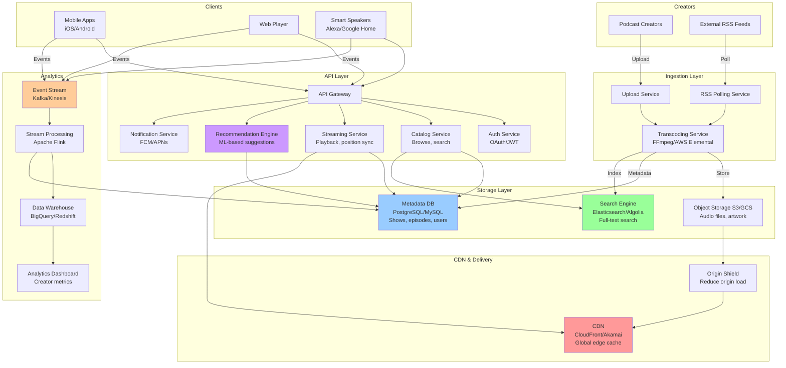

# Podcast Service System Design (Spotify/Apple Podcasts)

This is an excellent **system design interview question** that combines content delivery, recommendation systems, and media streaming at scale.

---

## **High-Level Architecture Overview**

```
Podcast Creators → Publishing Platform → CDN → Users
                         ↓
                   Metadata Service
                         ↓
                   Recommendation Engine
                         ↓
                   Analytics & Tracking
```

---

## **Core Components & Concepts**

### **1. Content Ingestion & Publishing**

**Problem:** How do podcast creators upload and distribute content?

**Flow:**
```
Creator uploads episode
    ↓
Transcoding Service (multiple formats/bitrates)
    ↓
Store in Object Storage (S3)
    ↓
Update RSS Feed
    ↓
Distribute to CDN
    ↓
Notify subscribers
```

**Key Concepts:**

**RSS Feed (Industry Standard):**
```xml
<?xml version="1.0" encoding="UTF-8"?>
<rss version="2.0" xmlns:itunes="http://www.itunes.com/dtds/podcast-1.0.dtd">
  <channel>
    <title>Tech Talks Daily</title>
    <link>https://example.com/podcast</link>
    <description>Daily tech discussions</description>
    <itunes:image href="https://cdn.example.com/cover.jpg"/>
    
    <item>
      <title>Episode 123: System Design</title>
      <enclosure url="https://cdn.example.com/ep123.mp3" 
                 length="45678912" 
                 type="audio/mpeg"/>
      <pubDate>Mon, 09 Oct 2025 10:00:00 GMT</pubDate>
      <itunes:duration>3600</itunes:duration>
      <guid>episode-123-uuid</guid>
    </item>
  </channel>
</rss>
```

**Interview Key Point:** RSS is the **universal standard** - any podcast can be consumed by any app.

---

### **2. Content Storage & Delivery**

**Storage Strategy:**

```
┌─────────────────────────────────────┐
│ Original Upload                     │
│ ├─ High-quality audio (320kbps)     │
│ └─ Metadata (title, description)    │
└─────────────────────────────────────┘
            ↓
┌─────────────────────────────────────┐
│ Transcoding Pipeline                │
│ ├─ 128kbps (mobile, data saving)    │
│ ├─ 192kbps (standard quality)       │
│ ├─ 256kbps (high quality)           │
│ └─ AAC, MP3, Opus formats           │
└─────────────────────────────────────┘
            ↓
┌─────────────────────────────────────┐
│ CDN Distribution                    │
│ ├─ Edge locations worldwide         │
│ ├─ HTTP Range requests support      │
│ └─ Cache policies                   │
└─────────────────────────────────────┘
```

**Storage Architecture:**
```
Origin Storage (S3/GCS)
    ├─ podcasts/
    │   ├─ show-123/
    │   │   ├─ episodes/
    │   │   │   ├─ ep001-original.mp3
    │   │   │   ├─ ep001-128k.mp3
    │   │   │   ├─ ep001-256k.mp3
    │   │   ├─ artwork/
    │   │   │   ├─ cover-1400x1400.jpg
    │   │   │   ├─ cover-300x300.jpg
    │   │   └─ metadata.json
```

**CDN Strategy:**
- **CloudFront/Akamai/Fastly** for global distribution
- **Edge caching** - 24-48 hour TTL for episodes
- **Origin shield** - Reduce load on origin servers
- **HTTP/2 & HTTP/3** for multiplexing

---

### **3. Metadata & Catalog Service**

**Database Schema:**

```sql
-- Shows/Podcasts table
CREATE TABLE shows (
    show_id UUID PRIMARY KEY,
    title VARCHAR(255),
    author VARCHAR(255),
    description TEXT,
    category VARCHAR(100),
    language VARCHAR(10),
    rss_feed_url TEXT,
    artwork_url TEXT,
    subscriber_count BIGINT,
    total_episodes INT,
    created_at TIMESTAMP,
    updated_at TIMESTAMP
);

-- Episodes table
CREATE TABLE episodes (
    episode_id UUID PRIMARY KEY,
    show_id UUID REFERENCES shows(show_id),
    title VARCHAR(500),
    description TEXT,
    audio_url TEXT,
    duration_seconds INT,
    file_size_bytes BIGINT,
    publish_date TIMESTAMP,
    season_number INT,
    episode_number INT,
    explicit BOOLEAN,
    -- Transcoded versions
    audio_urls JSONB  -- {128k: url, 256k: url}
);

-- Subscriptions
CREATE TABLE subscriptions (
    user_id UUID,
    show_id UUID,
    subscribed_at TIMESTAMP,
    notification_enabled BOOLEAN,
    PRIMARY KEY (user_id, show_id)
);

-- Listening history
CREATE TABLE listen_events (
    event_id UUID PRIMARY KEY,
    user_id UUID,
    episode_id UUID,
    timestamp TIMESTAMP,
    position_seconds INT,
    duration_listened INT,
    completed BOOLEAN,
    device_type VARCHAR(50)
) PARTITION BY RANGE (timestamp);
```

**Indexing Strategy:**
```sql
-- Search optimization
CREATE INDEX idx_shows_title ON shows USING GIN(to_tsvector('english', title));
CREATE INDEX idx_shows_category ON shows(category);
CREATE INDEX idx_episodes_show_publish ON episodes(show_id, publish_date DESC);

-- User queries
CREATE INDEX idx_subscriptions_user ON subscriptions(user_id);
CREATE INDEX idx_listen_events_user_time ON listen_events(user_id, timestamp DESC);
```

---

### **4. Search & Discovery**

**Search Architecture:**

```
User Query → API Gateway → Search Service
                              ↓
                    Elasticsearch/Algolia
                              ↓
                    Ranking & Relevance
                              ↓
                         Results
```

**Elasticsearch Document:**
```json
{
  "show_id": "uuid-123",
  "title": "Tech Talks Daily",
  "author": "John Doe",
  "description": "Daily discussions about technology...",
  "categories": ["Technology", "Business"],
  "tags": ["AI", "Cloud", "Startups"],
  "language": "en",
  "subscriber_count": 150000,
  "avg_rating": 4.7,
  "recent_episodes": [
    {
      "episode_id": "ep-001",
      "title": "System Design Interview Tips",
      "description": "...",
      "publish_date": "2025-10-09"
    }
  ],
  "popularity_score": 8.5  // Derived metric
}
```

**Ranking Factors:**
1. **Text relevance** - Title/description match
2. **Popularity** - Subscriber count, play count
3. **Freshness** - Recent episodes boost
4. **User engagement** - Completion rate, ratings
5. **Personalization** - User's listening history

**Interview talking point:** Use **hybrid search** - keyword search + vector embeddings for semantic search.

---

### **5. Streaming & Playback**

**Adaptive Streaming Strategy:**

```javascript
// Client-side quality selection
function selectBitrate() {
    const bandwidth = estimateBandwidth();
    const isMobile = detectMobile();
    const isWiFi = detectWiFi();
    
    if (bandwidth > 5_000_000 && isWiFi) {
        return '256kbps';  // High quality
    } else if (bandwidth > 1_000_000) {
        return '128kbps';  // Standard
    } else {
        return '64kbps';   // Low quality
    }
}
```

**HTTP Range Requests (Seeking):**
```http
GET /episodes/ep123-256k.mp3 HTTP/1.1
Host: cdn.example.com
Range: bytes=1048576-2097151

HTTP/1.1 206 Partial Content
Content-Range: bytes 1048576-2097151/45678912
Content-Length: 1048576
```

**Playback Position Sync:**
```javascript
// Save position every 10 seconds
setInterval(() => {
    if (isPlaying) {
        savePosition({
            episode_id: currentEpisode,
            position: audio.currentTime,
            timestamp: Date.now()
        });
    }
}, 10000);

// Resume from saved position
function loadEpisode(episodeId) {
    const savedPosition = getPosition(episodeId);
    audio.currentTime = savedPosition || 0;
}
```

---

### **6. Offline Downloads**

**Download Management:**

```javascript
// Progressive download with resume support
class DownloadManager {
    async downloadEpisode(episodeId, quality) {
        const url = getEpisodeUrl(episodeId, quality);
        const filename = `${episodeId}-${quality}.mp3`;
        
        // Check if partially downloaded
        const existingSize = await getLocalFileSize(filename);
        
        // Resume download using Range header
        const response = await fetch(url, {
            headers: {
                'Range': `bytes=${existingSize}-`
            }
        });
        
        // Stream to local storage
        const writer = await getFileWriter(filename, 'append');
        await response.body.pipeTo(writer);
        
        // Update download status
        await markAsDownloaded(episodeId);
    }
    
    // Prioritize downloads
    downloadQueue = new PriorityQueue();
    
    // Clean up old downloads (FIFO/LRU)
    async cleanupStorage() {
        if (storageUsed > MAX_STORAGE) {
            const oldestEpisodes = getDownloadedEpisodesByDate();
            for (const ep of oldestEpisodes) {
                await deleteDownload(ep.id);
                if (storageUsed < MAX_STORAGE * 0.8) break;
            }
        }
    }
}
```

**Storage Strategy:**
- **Mobile:** 5GB limit by default
- **Auto-cleanup:** Delete oldest/least played
- **Smart downloads:** Auto-download new episodes overnight
- **WiFi-only option:** Prevent cellular data usage

---

### **7. Recommendation System**

**Multi-faceted Recommendation Approach:**

```
User Profile
    ↓
┌────────────────────────────────────────┐
│ 1. Collaborative Filtering             │
│    "Users like you also listen to..."  │
└────────────────────────────────────────┘
    ↓
┌────────────────────────────────────────┐
│ 2. Content-Based Filtering             │
│    "Similar shows based on category"   │
└────────────────────────────────────────┘
    ↓
┌────────────────────────────────────────┐
│ 3. Hybrid Approach                     │
│    Combine multiple signals            │
└────────────────────────────────────────┘
```

**Recommendation Features:**

```python
# User features
user_features = {
    'subscribed_shows': [show_ids],
    'listened_categories': ['Technology', 'Business'],
    'avg_episode_length': 45,  # minutes
    'listening_time': 'morning',  # Peak listening time
    'completion_rate': 0.85,
    'skip_rate': 0.10,
    'preferred_language': 'en'
}

# Show features
show_features = {
    'show_id': 'uuid-123',
    'categories': ['Technology', 'AI'],
    'avg_duration': 40,
    'release_frequency': 'weekly',
    'popularity_score': 8.5,
    'engagement_rate': 0.75,
    'embedding': [0.123, -0.456, ...]  # Vector embedding
}

# Similarity calculation
def calculate_similarity(user, show):
    # Collaborative filtering score
    cf_score = collaborative_filter(user, show)
    
    # Content-based score
    cb_score = cosine_similarity(
        user.category_vector, 
        show.category_vector
    )
    
    # Popularity score
    pop_score = show.popularity_score
    
    # Weighted combination
    return 0.5 * cf_score + 0.3 * cb_score + 0.2 * pop_score
```

**Real-time vs Batch Processing:**

```
Batch Processing (Daily):
- Update user profiles
- Recompute show similarities
- Generate recommendation lists
- Store in cache (Redis)

Real-time Processing:
- Track user actions (play, skip, complete)
- Update short-term preferences
- Adjust recommendations immediately
```

---

### **8. Analytics & Tracking**

**Event Tracking:**

```javascript
// Client-side tracking
const events = {
    // Playback events
    'play_started': {
        episode_id, show_id, user_id, 
        timestamp, device, quality
    },
    'play_paused': {
        episode_id, position, duration_listened
    },
    'play_completed': {
        episode_id, total_duration, skip_count
    },
    'seek': {
        episode_id, from_position, to_position
    },
    'speed_changed': {
        episode_id, speed  // 1x, 1.5x, 2x
    },
    
    // Discovery events
    'search_performed': {
        query, results_count, result_clicked
    },
    'show_viewed': {
        show_id, source  // search, recommendation, browse
    },
    'subscribed': {
        show_id, source
    },
    
    // Engagement events
    'rating_given': {
        show_id, rating
    },
    'shared': {
        episode_id, platform  // twitter, facebook
    }
};
```

**Analytics Pipeline:**

```
Mobile/Web App → API Gateway → Kafka/Kinesis
                                     ↓
                            Stream Processing (Flink)
                                     ↓
                    ┌────────────────┴────────────────┐
                    ↓                                 ↓
            Real-time Metrics                  Data Warehouse
            (Redis/ClickHouse)                (BigQuery/Redshift)
                    ↓                                 ↓
            Dashboards (Grafana)              Analytics (Tableau)
```

**Key Metrics:**

```python
# Creator metrics
creator_metrics = {
    'total_plays': 50000,
    'unique_listeners': 12000,
    'avg_completion_rate': 0.75,
    'subscriber_growth': 150,  # This week
    'geographic_distribution': {
        'US': 45, 'UK': 20, 'CA': 15  # Percentage
    },
    'listening_devices': {
        'mobile': 70, 'web': 20, 'smart_speaker': 10
    }
}

# Platform metrics
platform_metrics = {
    'daily_active_users': 5_000_000,
    'hours_listened': 15_000_000,
    'new_subscriptions': 250_000,
    'churn_rate': 0.05,
    'avg_session_duration': 45,  # minutes
}
```

---

### **9. RSS Feed Polling & Updates**

**Problem:** How to discover new episodes from external RSS feeds?

**Polling Strategy:**

```python
class RSSPollingService:
    def __init__(self):
        self.redis = RedisClient()
        
    async def poll_feeds(self):
        # Prioritize active shows
        shows = await self.get_shows_to_poll()
        
        for show in shows:
            await self.poll_feed(show)
    
    async def poll_feed(self, show):
        # Determine polling frequency
        frequency = self.get_polling_frequency(show)
        
        # Check last poll time
        last_poll = await self.redis.get(f"last_poll:{show.id}")
        if time.now() - last_poll < frequency:
            return
        
        # Fetch RSS feed
        response = await fetch(show.rss_feed_url)
        feed = parse_rss(response)
        
        # Check for new episodes
        latest_episode = feed.items[0]
        stored_latest = await self.get_latest_episode(show.id)
        
        if latest_episode.guid != stored_latest.guid:
            # New episode found!
            await self.ingest_new_episode(show, latest_episode)
            await self.notify_subscribers(show.id)
        
        # Update last poll time
        await self.redis.set(f"last_poll:{show.id}", time.now())
    
    def get_polling_frequency(self, show):
        # Adaptive polling based on release schedule
        if show.release_frequency == 'daily':
            return 1 * HOUR
        elif show.release_frequency == 'weekly':
            return 6 * HOURS
        else:
            return 24 * HOURS
```

**Interview key point:** Use **adaptive polling** - popular shows checked more frequently, inactive shows less frequently.

---

### **10. Notifications & Push System**

**Notification Strategy:**

```python
# When new episode detected
async def notify_subscribers(show_id, episode):
    # Get all subscribers
    subscribers = await db.query(
        "SELECT user_id, notification_preferences "
        "FROM subscriptions WHERE show_id = $1",
        show_id
    )
    
    # Batch notification sending
    batches = chunk(subscribers, 1000)
    
    for batch in batches:
        await send_batch_notifications(batch, {
            'title': f"New episode: {episode.title}",
            'body': f"{show.name} just released a new episode",
            'data': {
                'type': 'new_episode',
                'show_id': show_id,
                'episode_id': episode.id
            }
        })

# Smart notification timing
def get_optimal_send_time(user):
    # Analyze user's listening patterns
    listening_history = get_listening_times(user.id)
    
    # Send during user's typical listening window
    # E.g., 8am for morning commuters, 6pm for evening
    return calculate_peak_listening_time(listening_history)
```

**Notification Types:**
1. **New episode** - Show you subscribe to
2. **Recommendations** - "You might like..."
3. **Milestone** - "Your favorite show hit 1M subscribers"
4. **Social** - "Friend subscribed to..."
5. **Auto-download complete** - Offline listening ready

---

### **11. Monetization & Ad Insertion**

**Dynamic Ad Insertion (DAI):**

```
Episode Request
    ↓
Ad Decision Server
    ↓
┌─────────────────────────────┐
│ User Profile                │
│ - Location: US/California   │
│ - Age: 25-34                │
│ - Interests: Technology     │
│ - Listening history         │
└─────────────────────────────┘
    ↓
Select Targeted Ads
    ↓
Stitch Audio (Pre-roll, Mid-roll, Post-roll)
    ↓
Deliver Combined Stream
```

**Ad Markers in Audio:**

```json
{
  "episode_id": "ep-123",
  "duration": 3600,
  "ad_breaks": [
    {
      "type": "pre-roll",
      "position": 0,
      "duration": 30,
      "ad_id": "ad-xyz"
    },
    {
      "type": "mid-roll",
      "position": 1800,  // 30 minutes in
      "duration": 60,
      "ad_id": "ad-abc"
    },
    {
      "type": "post-roll",
      "position": 3570,
      "duration": 30,
      "ad_id": "ad-def"
    }
  ]
}
```

**Server-side Stitching:**

```python
def generate_episode_with_ads(episode_id, user_id):
    # Get base episode
    episode = get_episode(episode_id)
    
    # Select ads based on user profile
    ads = ad_decision_service.select_ads(user_id, episode)
    
    # Generate playlist
    playlist = [
        {'type': 'ad', 'url': ads.pre_roll, 'duration': 30},
        {'type': 'content', 'url': episode.audio_url, 
         'start': 0, 'end': 1800},
        {'type': 'ad', 'url': ads.mid_roll, 'duration': 60},
        {'type': 'content', 'url': episode.audio_url, 
         'start': 1800, 'end': 3600},
        {'type': 'ad', 'url': ads.post_roll, 'duration': 30}
    ]
    
    return generate_m3u8_playlist(playlist)
```

**Monetization Models:**
1. **Ad-supported free tier** - Pre/mid/post-roll ads
2. **Premium subscription** - Ad-free, offline downloads
3. **Creator subscriptions** - Exclusive content
4. **Sponsorships** - Native host-read ads

---

### **12. Content Moderation & Compliance**

**Moderation Pipeline:**

```
New Episode Upload
    ↓
Automated Checks
├─ Audio analysis (ML)
│  ├─ Speech-to-text
│  ├─ Toxic content detection
│  ├─ Copyright detection
│  └─ Explicit content flag
├─ Metadata validation
│  ├─ Title/description profanity
│  └─ Category appropriateness
└─ Image analysis
   └─ Artwork compliance
    ↓
Manual Review Queue (flagged content)
    ↓
Approve/Reject/Flag
```

**Compliance Requirements:**
- **COPPA** - Kids content restrictions
- **GDPR** - User data privacy
- **DMCA** - Copyright takedowns
- **Accessibility** - Transcripts for hearing impaired

---

## **Complete System Architecture**


## **Scalability Considerations**

### **Database Sharding Strategy**

```python
# Shard by show_id for episodes
shard_key = hash(show_id) % NUM_SHARDS

# Shard by user_id for user data
user_shard = hash(user_id) % NUM_USER_SHARDS

# Time-based partitioning for analytics
# Partition listen_events by month
CREATE TABLE listen_events_2025_10 
PARTITION OF listen_events 
FOR VALUES FROM ('2025-10-01') TO ('2025-11-01');
```

### **Caching Strategy**

```
┌──────────────────────────────────────┐
│ L1: Application Cache (in-memory)   │
│ - Active user sessions               │
│ - Hot metadata (popular shows)       │
│ TTL: 5 minutes                       │
└──────────────────────────────────────┘
            ↓
┌──────────────────────────────────────┐
│ L2: Redis Cluster                    │
│ - User profiles                      │
│ - Show metadata                      │
│ - Recommendation lists               │
│ TTL: 1 hour                          │
└──────────────────────────────────────┘
            ↓
┌──────────────────────────────────────┐
│ L3: Database                         │
│ - Source of truth                    │
│ - Cold data                          │
└──────────────────────────────────────┘
```

### **CDN Optimization**

```
# Cache-Control headers
Cache-Control: public, max-age=86400  # Audio files
Cache-Control: public, max-age=3600   # Artwork
Cache-Control: no-cache              # User-specific data
```

---

## **Interview Questions & Answers**

### **Q1: How do you handle a viral podcast that suddenly gets 10M plays in an hour?**

**Answer:**
```
1. CDN Absorption
   - 90%+ requests served from edge cache
   - Origin barely hit due to caching
   
2. Auto-scaling
   - API servers scale horizontally
   - Database read replicas spin up
   - Queue workers increase
   
3. Rate Limiting
   - Per-user limits (100 req/min)
   - Per-IP limits for abuse prevention
   
4. Circuit Breakers
   - Fail gracefully if DB overwhelmed
   - Serve stale cache if necessary
   - Prioritize playback over analytics
   
5. Preemptive Measures
   - Pre-warm CDN for anticipated viral content
   - Increase cache TTL temporarily
   - Alert on-call team
```

---

### **Q2: How do you ensure playback continuity across devices?**

**Answer:**
```python
# Cross-device sync architecture

# Save position on Device A
POST /api/playback/position
{
    "user_id": "user-123",
    "episode_id": "ep-456",
    "position_seconds": 1800,
    "device_id": "phone-123",
    "timestamp": "2025-10-09T10:30:00Z"
}

# Store in Redis (fast writes)
redis.setex(
    f"playback:user-123:ep-456",
    ttl=30_days,
    value=json.dumps({
        "position": 1800,
        "timestamp": "2025-10-09T10:30:00Z",
        "device": "phone-123"
    })
)

# Async persist to database
kafka.publish("playback-events", event)

# Retrieve on Device B
GET /api/playback/position?episode_id=ep-456

# Check for conflicts
if device_a_timestamp > device_b_timestamp:
    return device_a_position
else:
    return device_b_position

# Last-write-wins with timestamp
```

**Key considerations:**
- ✅ Use Redis for low-latency reads/writes
- ✅ Conflict resolution with timestamps
- ✅ Async background sync to database
- ✅ Handle offline scenarios

---

### **Q3: How do you implement intelligent recommendations?**

**Answer:**

**Multi-stage ranking:**

```python
# Stage 1: Candidate Generation (1000s → 100s)
candidates = []

# 1a. Collaborative filtering
similar_users = find_similar_users(user_id, top_k=100)
cf_candidates = get_shows_listened_by(similar_users)
candidates.extend(cf_candidates)

# 1b. Content-based
user_categories = get_user_category_preferences(user_id)
cb_candidates = find_shows_by_category(user_categories)
candidates.extend(cb_candidates)

# 1c. Trending/Popular
trending = get_trending_shows(time_window='7d')
candidates.extend(trending)

# Stage 2: Filtering (100s → 50s)
filtered = []
for show in candidates:
    if not user_already_subscribed(user_id, show):
        if matches_user_language(user, show):
            if not_explicit_content_if_filtered(user, show):
                filtered.append(show)

# Stage 3: Ranking (50s → 20)
scored = []
for show in filtered:
    score = rank_show(user, show, context)
    scored.append((show, score))

ranked = sorted(scored, key=lambda x: x[1], reverse=True)
top_20 = ranked[:20]

# Stage 4: Diversification
final = diversify_results(top_20)  # Mix categories, avoid repetition

return final[:10]
```

**Ranking features:**
```python
def rank_show(user, show, context):
    features = {
        # User-show interaction
        'category_match': similarity(user.categories, show.categories),
        'duration_match': abs(user.avg_duration - show.avg_duration),
        'language_match': user.language == show.language,
        
        # Show quality signals
        'popularity': show.subscriber_count,
        'engagement_rate': show.completion_rate,
        'recency': days_since_last_episode(show),
        
        # Contextual
        'time_of_day': context.hour,
        'day_of_week': context.day,
        'device_type': context.device,
        
        # Social signals
        'friend_listening': count_friends_subscribed(user, show),
        'trending_score': show.growth_rate_7d,
        
        # Diversity
        'category_diversity': penalize_if_similar_to_recent(user, show),
        'exploration_bonus': boost_if_new_category(user, show)
    }
    
    # ML model prediction (trained on historical data)
    score = recommendation_model.predict(features)
    
    return score
```

**A/B Testing:**
```python
# Experiment framework
experiments = {
    'rec_v1': {
        'weight_popularity': 0.3,
        'weight_relevance': 0.5,
        'weight_diversity': 0.2
    },
    'rec_v2': {
        'weight_popularity': 0.2,
        'weight_relevance': 0.6,
        'weight_diversity': 0.2
    }
}

# Assign user to experiment
experiment = get_user_experiment(user_id)
recommendations = generate_recommendations(user_id, experiment.config)

# Track metrics
track_event('recommendations_shown', {
    'user_id': user_id,
    'experiment': experiment.name,
    'shows': recommendations
})
```

---

### **Q4: How do you handle copyright and content moderation at scale?**

**Answer:**

**Multi-layered Moderation:**

```python
class ContentModerationPipeline:
    
    async def moderate_episode(self, episode):
        results = {}
        
        # Layer 1: Automated checks (immediate)
        results['audio_fingerprint'] = await self.check_audio_fingerprint(episode)
        results['metadata'] = await self.check_metadata(episode)
        results['artwork'] = await self.check_artwork(episode)
        
        # Layer 2: ML-based analysis (minutes)
        results['speech_to_text'] = await self.transcribe_audio(episode)
        results['toxic_content'] = await self.detect_toxic_content(
            results['speech_to_text']
        )
        results['explicit_content'] = await self.detect_explicit_content(
            results['speech_to_text']
        )
        
        # Layer 3: Rule-based checks
        risk_score = self.calculate_risk_score(results)
        
        if risk_score > HIGH_RISK_THRESHOLD:
            # Block immediately, queue for human review
            await self.block_episode(episode)
            await self.queue_for_human_review(episode, results)
        elif risk_score > MEDIUM_RISK_THRESHOLD:
            # Allow but flag, queue for human review
            await self.flag_episode(episode)
            await self.queue_for_human_review(episode, results)
        else:
            # Allow
            await self.approve_episode(episode)
        
        return results
    
    async def check_audio_fingerprint(self, episode):
        """Check against known copyrighted content"""
        # Generate acoustic fingerprint
        fingerprint = await generate_audio_fingerprint(episode.audio_url)
        
        # Compare with copyright database (Gracenote/ACRCloud)
        matches = await copyright_db.search(fingerprint)
        
        if matches:
            return {
                'status': 'violation',
                'matched_content': matches,
                'confidence': matches[0].confidence
            }
        
        return {'status': 'clear'}
    
    async def transcribe_audio(self, episode):
        """Convert speech to text for analysis"""
        # Use AWS Transcribe, Google Speech-to-Text, or Whisper
        transcript = await transcription_service.transcribe(
            audio_url=episode.audio_url,
            language=episode.language
        )
        
        # Store transcript for search and accessibility
        await self.store_transcript(episode.id, transcript)
        
        return transcript
    
    async def detect_toxic_content(self, transcript):
        """Detect hate speech, violence, harassment"""
        # Use Perspective API or custom ML model
        scores = await toxicity_detector.analyze(transcript)
        
        violations = []
        if scores['toxicity'] > 0.8:
            violations.append('high_toxicity')
        if scores['profanity'] > 0.9:
            violations.append('excessive_profanity')
        if scores['threat'] > 0.7:
            violations.append('threats')
        
        return {
            'violations': violations,
            'scores': scores
        }
    
    def calculate_risk_score(self, results):
        """Aggregate risk from all checks"""
        score = 0
        
        # Copyright violation = highest risk
        if results['audio_fingerprint']['status'] == 'violation':
            score += 100
        
        # Toxic content
        if results['toxic_content']['violations']:
            score += 50 * len(results['toxic_content']['violations'])
        
        # Explicit content (lower risk, just needs flag)
        if results['explicit_content']['is_explicit']:
            score += 20
        
        # Metadata issues
        if results['metadata']['suspicious']:
            score += 10
        
        return score
    
    async def queue_for_human_review(self, episode, results):
        """Human moderators review flagged content"""
        await review_queue.add({
            'episode_id': episode.id,
            'show_id': episode.show_id,
            'flagged_at': datetime.now(),
            'risk_score': self.calculate_risk_score(results),
            'automated_results': results,
            'priority': 'high' if results.get('copyright') else 'medium'
        })
        
        # Notify moderation team
        await notify_moderators(episode, results)
```

**DMCA Takedown Process:**

```python
class DMCATakedownHandler:
    
    async def process_dmca_request(self, request):
        # Validate DMCA notice
        if not self.is_valid_dmca_notice(request):
            return {'status': 'invalid'}
        
        # Take down content immediately (safe harbor)
        episode = await self.get_episode(request.episode_id)
        await self.takedown_episode(episode)
        
        # Notify creator (counter-notice opportunity)
        await self.notify_creator({
            'type': 'dmca_takedown',
            'episode': episode,
            'claimant': request.claimant,
            'reason': request.reason,
            'counter_notice_deadline': datetime.now() + timedelta(days=14)
        })
        
        # Track for repeat offenders
        await self.increment_strike_count(episode.show_id)
        
        # Auto-terminate after 3 strikes
        strikes = await self.get_strike_count(episode.show_id)
        if strikes >= 3:
            await self.terminate_show(episode.show_id)
        
        return {'status': 'taken_down'}
    
    async def process_counter_notice(self, counter_notice):
        # Forward to original claimant
        await self.notify_claimant(counter_notice)
        
        # If no lawsuit filed in 10-14 days, restore content
        await self.schedule_restoration(
            episode_id=counter_notice.episode_id,
            restore_at=datetime.now() + timedelta(days=14)
        )
```

---

### **Q5: How do you optimize for mobile data usage and battery life?**

**Answer:**

**1. Adaptive Bitrate Selection:**

```javascript
class AudioQualityManager {
    constructor() {
        this.qualityLevels = {
            'low': { bitrate: 64, label: 'Data Saver' },
            'medium': { bitrate: 128, label: 'Standard' },
            'high': { bitrate: 256, label: 'High Quality' }
        };
    }
    
    selectQuality() {
        // User preference (manual override)
        if (userSettings.fixedQuality) {
            return userSettings.fixedQuality;
        }
        
        // Network-based selection
        const connection = navigator.connection;
        const bandwidth = connection.downlink; // Mbps
        const connectionType = connection.effectiveType;
        
        // Battery considerations
        const battery = await navigator.getBattery();
        const isLowBattery = battery.level < 0.2 && !battery.charging;
        
        // Decision logic
        if (isLowBattery || connectionType === 'slow-2g' || connectionType === '2g') {
            return 'low';
        } else if (connectionType === '3g' || bandwidth < 1.5) {
            return 'medium';
        } else if (connection.type === 'wifi' || bandwidth > 5) {
            return 'high';
        }
        
        return 'medium'; // Default
    }
    
    // Monitor and adapt during playback
    monitorAndAdapt() {
        setInterval(() => {
            const bufferHealth = this.getBufferHealth();
            const currentQuality = this.getCurrentQuality();
            
            if (bufferHealth < 5 && currentQuality !== 'low') {
                // Buffering issues - downgrade quality
                this.switchQuality('medium');
            } else if (bufferHealth > 30 && currentQuality === 'low') {
                // Good buffer - try upgrading
                this.switchQuality('medium');
            }
        }, 10000); // Check every 10s
    }
}
```

**2. Smart Downloading:**

```javascript
class SmartDownloadManager {
    
    async autoDownloadNewEpisodes() {
        // Only on WiFi
        if (!this.isWiFiConnected()) {
            return;
        }
        
        // Only when charging or battery > 50%
        const battery = await navigator.getBattery();
        if (!battery.charging && battery.level < 0.5) {
            return;
        }
        
        // Only during off-peak hours (e.g., 2am-6am)
        const hour = new Date().getHours();
        if (hour < 2 || hour > 6) {
            return;
        }
        
        // Download subscribed shows
        const subscriptions = await this.getSubscriptions();
        const newEpisodes = await this.getUndownloadedEpisodes(subscriptions);
        
        // Download in order of preference
        for (const episode of newEpisodes) {
            await this.downloadEpisode(episode, {
                quality: 'medium',
                priority: episode.show.priority
            });
        }
    }
    
    // Intelligent cache management
    async manageCache() {
        const storage = await this.getStorageInfo();
        
        if (storage.usage > storage.quota * 0.9) {
            // Near storage limit - cleanup
            const episodes = await this.getDownloadedEpisodes();
            
            // Sort by last played date
            episodes.sort((a, b) => a.lastPlayed - b.lastPlayed);
            
            // Delete oldest until < 80% usage
            for (const ep of episodes) {
                if (storage.usage < storage.quota * 0.8) {
                    break;
                }
                await this.deleteDownload(ep);
            }
        }
    }
}
```

**3. Request Batching:**

```javascript
class RequestBatcher {
    constructor() {
        this.pendingRequests = [];
        this.batchInterval = 5000; // 5 seconds
        this.startBatching();
    }
    
    // Batch multiple API calls into one
    addRequest(request) {
        this.pendingRequests.push(request);
    }
    
    startBatching() {
        setInterval(() => {
            if (this.pendingRequests.length === 0) return;
            
            // Combine multiple requests
            const batch = {
                playback_positions: [],
                analytics_events: [],
                metadata_fetches: []
            };
            
            this.pendingRequests.forEach(req => {
                if (req.type === 'position_update') {
                    batch.playback_positions.push(req.data);
                } else if (req.type === 'event') {
                    batch.analytics_events.push(req.data);
                }
            });
            
            // Single API call
            fetch('/api/batch', {
                method: 'POST',
                body: JSON.stringify(batch)
            });
            
            this.pendingRequests = [];
        }, this.batchInterval);
    }
}
```

**4. Battery Optimization:**

```javascript
// Reduce GPS/location checks
const locationConfig = {
    enableHighAccuracy: false,  // Use cell tower instead of GPS
    maximumAge: 600000,         // Cache location for 10 minutes
    timeout: 5000
};

// Reduce wake locks
// Only keep CPU awake during active playback
if ('wakeLock' in navigator) {
    let wakeLock = null;
    
    audio.onplay = async () => {
        wakeLock = await navigator.wakeLock.request('screen');
    };
    
    audio.onpause = () => {
        if (wakeLock) {
            wakeLock.release();
            wakeLock = null;
        }
    };
}

// Throttle analytics
const throttledAnalytics = _.throttle((event) => {
    sendAnalytics(event);
}, 30000); // Max once per 30 seconds
```

---

### **Q6: How do you implement a fair and scalable creator payment system?**

**Answer:**

**Payment Calculation Pipeline:**

```python
class CreatorPaymentSystem:
    
    async def calculate_monthly_payments(self, month):
        """
        Payment model: Revenue share based on listening hours
        Similar to Spotify's model
        """
        
        # Step 1: Calculate total platform revenue
        total_revenue = await self.get_monthly_revenue(month)
        
        # Step 2: Determine creator pool (e.g., 70% goes to creators)
        creator_pool = total_revenue * 0.70
        
        # Step 3: Calculate total listening hours
        total_hours = await self.get_total_listening_hours(month)
        
        # Step 4: Per-hour rate
        rate_per_hour = creator_pool / total_hours
        
        # Step 5: Calculate per-creator payments
        creators = await self.get_all_creators()
        
        payments = []
        for creator in creators:
            # Get listening hours for this creator's content
            creator_hours = await self.get_creator_listening_hours(
                creator.id, month
            )
            
            # Base payment
            base_payment = creator_hours * rate_per_hour
            
            # Bonuses
            bonus = 0
            
            # Growth bonus (incentivize new creators)
            if creator.subscriber_growth > 0.20:  # 20% growth
                bonus += base_payment * 0.10
            
            # Engagement bonus (high completion rate)
            completion_rate = await self.get_completion_rate(creator.id)
            if completion_rate > 0.75:
                bonus += base_payment * 0.05
            
            # Premium subscriber bonus
            premium_hours = await self.get_premium_listening_hours(
                creator.id, month
            )
            premium_bonus = premium_hours * rate_per_hour * 0.5  # 50% more
            
            total_payment = base_payment + bonus + premium_bonus
            
            payments.append({
                'creator_id': creator.id,
                'base_payment': base_payment,
                'bonuses': bonus + premium_bonus,
                'total_payment': total_payment,
                'listening_hours': creator_hours,
                'month': month
            })
        
        # Step 6: Store and process payments
        await self.store_payments(payments)
        await self.initiate_payouts(payments)
        
        return payments
    
    async def initiate_payouts(self, payments):
        """Process actual money transfers"""
        for payment in payments:
            # Minimum payout threshold ($10)
            if payment['total_payment'] < 10:
                await self.carry_forward_to_next_month(payment)
                continue
            
            # Get payout method (Stripe Connect, PayPal, Wire)
            payout_method = await self.get_payout_method(payment['creator_id'])
            
            # Initiate transfer
            await payment_processor.transfer(
                amount=payment['total_payment'],
                recipient=payout_method,
                metadata={
                    'creator_id': payment['creator_id'],
                    'period': payment['month'],
                    'type': 'creator_earnings'
                }
            )
            
            # Send payment notification
            await self.notify_creator_payment(payment)
    
    async def get_creator_listening_hours(self, creator_id, month):
        """Aggregate listening hours from analytics"""
        query = """
            SELECT SUM(duration_listened) / 3600 as hours
            FROM listen_events
            WHERE episode_id IN (
                SELECT episode_id FROM episodes 
                WHERE show_id IN (
                    SELECT show_id FROM shows WHERE creator_id = $1
                )
            )
            AND timestamp >= $2
            AND timestamp < $3
            AND completed = true  -- Only count completed listens
        """
        
        result = await db.query(
            query, 
            creator_id,
            month.start,
            month.end
        )
        
        return result[0]['hours']
```

**Analytics Dashboard for Creators:**

```python
class CreatorAnalytics:
    
    async def get_dashboard_data(self, creator_id, time_range):
        """Comprehensive analytics for creators"""
        
        return {
            # Core metrics
            'total_plays': await self.get_total_plays(creator_id, time_range),
            'unique_listeners': await self.get_unique_listeners(creator_id, time_range),
            'listening_hours': await self.get_listening_hours(creator_id, time_range),
            
            # Engagement metrics
            'avg_completion_rate': await self.get_completion_rate(creator_id),
            'avg_listen_duration': await self.get_avg_duration(creator_id),
            'skip_rate': await self.get_skip_rate(creator_id),
            
            # Growth metrics
            'subscriber_count': await self.get_subscriber_count(creator_id),
            'subscriber_growth': await self.get_growth_rate(creator_id, time_range),
            'new_vs_returning': await self.get_listener_retention(creator_id),
            
            # Demographics
            'geographic_distribution': await self.get_geo_distribution(creator_id),
            'age_distribution': await self.get_age_distribution(creator_id),
            'listening_devices': await self.get_device_breakdown(creator_id),
            'listening_times': await self.get_peak_listening_times(creator_id),
            
            # Revenue
            'estimated_earnings': await self.get_estimated_earnings(creator_id),
            'earnings_trend': await self.get_earnings_trend(creator_id, time_range),
            
            # Top episodes
            'top_episodes': await self.get_top_episodes(creator_id, limit=10),
            
            # Listener behavior
            'discovery_sources': await self.get_discovery_sources(creator_id),
            'drop_off_points': await self.analyze_drop_off_points(creator_id)
        }
```

---

### **Q7: How do you ensure high availability during peak traffic?**

**Answer:**

**Multi-Region Architecture:**

```
                    Global Load Balancer (Route 53/CloudFlare)
                    (Geographic routing + health checks)
                                    ↓
        ┌───────────────────────────┼───────────────────────────┐
        ↓                           ↓                           ↓
    US-East Region            EU-West Region            Asia-Pacific Region
    (Primary)                 (Active)                  (Active)
    ├─ CDN Edge               ├─ CDN Edge               ├─ CDN Edge
    ├─ API Servers            ├─ API Servers            ├─ API Servers
    ├─ DB Read Replicas       ├─ DB Read Replicas       ├─ DB Read Replicas
    └─ Cache (Redis)          └─ Cache (Redis)          └─ Cache (Redis)
            ↓                         ↓                         ↓
                    Primary Database (US-East)
                    (Cross-region replication)
```

**Failure Handling:**

```python
class HighAvailabilityManager:
    
    def __init__(self):
        self.circuit_breaker = CircuitBreaker()
        self.fallback_strategies = FallbackStrategies()
    
    async def handle_request(self, request):
        try:
            # Try primary service
            response = await self.circuit_breaker.call(
                self.primary_service,
                request
            )
            return response
            
        except ServiceUnavailable:
            # Circuit breaker opened - use fallback
            return await self.fallback_strategies.execute(request)
    
    class FallbackStrategies:
        
        async def execute(self, request):
            # Strategy 1: Serve from cache
            cached = await cache.get(request.cache_key)
            if cached:
                return self.serve_stale_cache(cached)
            
            # Strategy 2: Try secondary region
            try:
                return await secondary_region.handle(request)
            except:
                pass
            
            # Strategy 3: Degraded mode
            return self.degraded_response(request)
        
        def degraded_response(self, request):
            """Return minimal viable response"""
            if request.type == 'playback':
                # Critical - must work
                return self.serve_audio_from_backup_cdn()
            elif request.type == 'recommendation':
                # Non-critical - can use simple fallback
                return self.serve_trending_shows()
            elif request.type == 'search':
                # Non-critical - return cached popular results
                return self.serve_popular_searches()
```

**Auto-scaling Configuration:**

```yaml
# Kubernetes HPA (Horizontal Pod Autoscaler)
apiVersion: autoscaling/v2
kind: HorizontalPodAutoscaler
metadata:
  name: podcast-api
spec:
  scaleTargetRef:
    apiVersion: apps/v1
    kind: Deployment
    name: podcast-api
  minReplicas: 10
  maxReplicas: 500
  metrics:
  - type: Resource
    resource:
      name: cpu
      target:
        type: Utilization
        averageUtilization: 70
  - type: Resource
    resource:
      name: memory
      target:
        type: Utilization
        averageUtilization: 80
  - type: Pods
    pods:
      metric:
        name: requests_per_second
      target:
        type: AverageValue
        averageValue: "1000"
  behavior:
    scaleUp:
      stabilizationWindowSeconds: 60
      policies:
      - type: Percent
        value: 50
        periodSeconds: 60
    scaleDown:
      stabilizationWindowSeconds: 300
      policies:
      - type: Percent
        value: 10
        periodSeconds: 60
```

---

## **Technology Stack Summary**

```
Frontend:
├─ Mobile: React Native, Swift (iOS), Kotlin (Android)
├─ Web: React, Vue.js
└─ Smart Speakers: Alexa Skills Kit, Google Actions

Backend:
├─ API: Node.js (Express), Go, Python (FastAPI)
├─ Streaming: Node.js (low latency), Go
└─ Background Jobs: Python (Celery), Go

Databases:
├─ Primary: PostgreSQL (metadata), MySQL
├─ Analytics: ClickHouse, BigQuery, Redshift
├─ Cache: Redis Cluster
└─ Search: Elasticsearch, Algolia

Storage:
├─ Audio Files: S3, Google Cloud Storage
├─ CDN: CloudFront, Akamai, Fastly
└─ Backups: Glacier, Coldline

Message Queue:
├─ Kafka (high-throughput events)
├─ RabbitMQ (task queuing)
└─ AWS SQS (simple queuing)

ML/AI:
├─ Recommendations: TensorFlow, PyTorch
├─ Speech-to-Text: Whisper, Google Speech API
└─ Content Moderation: Custom models + Perspective API

Monitoring:
├─ Metrics: Prometheus, Grafana, Datadog
├─ Logging: ELK Stack, Splunk
├─ Tracing: Jaeger, OpenTelemetry
└─ Alerts: PagerDuty, Opsgenie

Infrastructure:
├─ Orchestration: Kubernetes
├─ IaC: Terraform, CloudFormation
└─ CI/CD: GitHub Actions, Jenkins
```

---

## **Key Interview Takeaways**

### **What Interviewers Look For:**

1. **RSS Understanding** - Industry standard for podcasts
2. **CDN Strategy** - Critical for media delivery at scale
3. **Recommendation Engine** - Multi-signal approach
4. **Analytics Pipeline** - Real-time + batch processing
5. **Content Moderation** - Automated + human review
6. **Cross-device Sync** - Seamless experience
7. **Monetization** - Fair creator payments
8. **High Availability** - Multi-region, failover strategies
9. **Mobile Optimization** - Battery, data usage
10. **Scalability** - Horizontal scaling, sharding

### **Trade-offs to Discuss:**

| Decision | Trade-off |
|----------|-----------|
| **RSS vs Proprietary** | Openness vs Control |
| **Transcoding Quality** | Quality vs Storage Costs |
| **Cache TTL** | Freshness vs Origin Load |
| **Recommendation Complexity** | Accuracy vs Latency |
| **Analytics Granularity** | Insights vs Privacy/Performance |
| **Content Moderation** | Safety vs Creator Freedom |
| **Mobile Quality** | Quality vs Data Usage |

### **Numbers to Know:**

- **CDN hit rate**: 90-95% ideal
- **API latency**: p99 < 200ms
- **Audio bitrates**: 64kbps (low), 128kbps (medium), 256kbps (high)
- **User scale**: 100M+ users (Spotify scale)
- **Storage**: ~100MB per hour of audio (128kbps)
- **Concurrent streams**: 10M+ during peak
- **Database queries**: 100K+ QPS
- **Analytics events**: 1M+ events/second

This covers the complete podcast platform system design from an interview perspective! 🎙️