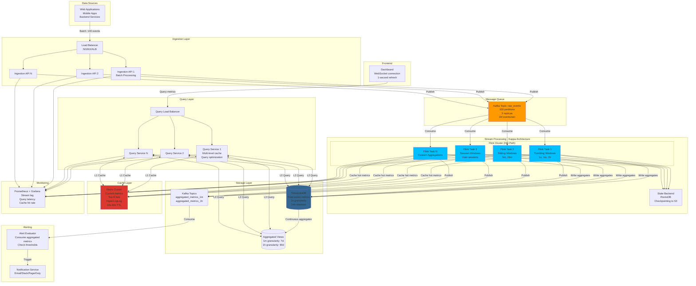

# Real-Time Analytics Dashboard

## Step 1: Requirements Clarification

### Functional Requirements

**Core Analytics Features:**

- Track website/application events (page views, clicks, purchases, errors)
- Real-time metrics displayed on dashboard (1-second refresh)
- Pre-defined metrics:
    - Traffic metrics: Page views, unique visitors, sessions
    - Business metrics: Revenue, conversion rate, orders
    - System metrics: Error rate, latency P50/P95/P99, throughput
- Time-based aggregations:
    - Last 1 minute, 5 minutes, 1 hour, 24 hours
    - Compare with previous period
- Drill-down capabilities (filter by country, device, page, user segment)
- Custom dashboards (users create their own views)
- Alerting on metric thresholds

**Query Patterns:**

- Get current metric value (e.g., "Revenue last 1 hour")
- Get time-series data (e.g., "Page views per minute for last 24h")
- Get top-N breakdown (e.g., "Top 10 pages by traffic")
- Get aggregated dimension (e.g., "Page views by country")

**Out of Scope:**

- Ad-hoc SQL queries (focus on pre-defined metrics)
- Historical analysis beyond 90 days
- Machine learning predictions
- User session replay


### Non-Functional Requirements

**Scale:**

- 1M events per second (peak)
- 100K concurrent dashboard users
- 10K unique metrics tracked
- Data retention: 1 day (raw), 90 days (aggregated)

**Performance:**

- Event ingestion latency: <100ms (P99)
- Metric computation latency: <1 second (P99)
- Dashboard query latency: <200ms (P99)
- Dashboard refresh rate: 1 second

**Accuracy:**

- Eventually consistent (1-2 second lag acceptable)
- No exact deduplication required
- Approximate counts acceptable (HyperLogLog for unique visitors)

**Availability:**

- 99.9% uptime
- Graceful degradation (show stale data if processing lag)

***

## Step 2: Capacity Estimation

```
Event Ingestion:
Events per second: 1M (average), 3M (peak)
Event size: 500 bytes avg (JSON payload)
Data rate: 1M × 500 bytes = 500 MB/sec
Peak data rate: 3M × 500 bytes = 1.5 GB/sec

Daily events: 1M × 86,400 = 86.4B events
Daily raw data: 86.4B × 500 bytes = 43.2 TB/day

Kafka Storage (3-day retention for raw events):
Raw data: 43.2 TB × 3 = 129.6 TB
With replication (3x): 129.6 TB × 3 = 388.8 TB ≈ 390 TB

Time-Series Storage (Aggregated Metrics):
Metrics tracked: 10K unique metric keys
Granularities:
  - 1 second: 10K × 86,400 points/day = 864M points/day
  - 1 minute: 10K × 1,440 points/day = 14.4M points/day
  - 1 hour: 10K × 24 points/day = 240K points/day

Storage per point: 24 bytes (timestamp, metric_id, value, metadata)

Daily storage:
  - 1-second: 864M × 24 bytes = 20.7 GB/day
  - 1-minute: 14.4M × 24 bytes = 345 MB/day
  - 1-hour: 240K × 24 bytes = 5.8 MB/day
  Total: ~21 GB/day

90-day retention: 21 GB × 90 = 1.89 TB
With replication (3x): 5.67 TB

Stream Processing:
Input: 1M events/sec
Aggregations per event: 20 (various dimensions, time windows)
Aggregation operations: 1M × 20 = 20M ops/sec

Stream processors needed:
Assuming 50K ops/sec per processor: 20M / 50K = 400 processors
With redundancy (2x): 800 processors

Memory for state:
Active windows: 60 seconds × 10K metrics × 1 KB = 600 MB
1-hour windows: 3,600 seconds × 10K metrics × 1 KB = 36 GB
Per-processor state: ~50 MB (manageable)

Dashboard Queries:
Concurrent users: 100K
Queries per user per minute: 60 (1-second refresh)
QPS: 100K × 60 / 60 = 100K QPS

Cache hit ratio: 95% (most users view same popular metrics)
Actual DB queries: 100K × 0.05 = 5K QPS

Query latency budget:
- Cache: <5ms
- Database: <50ms
- Aggregation: <100ms
- API response: <200ms total

Network Bandwidth:
Event ingestion: 500 MB/sec
Stream processing internal: 200 MB/sec (state updates)
Query responses: 100K QPS × 10 KB = 1 GB/sec
Total: ~2 GB/sec cluster-wide
```


***

## Step 3: API Design

### Event Ingestion API

**Batch Event Ingestion**

```json
POST /v1/events/batch
Content-Type: application/json
X-API-Key: <api_key>

Request:
{
  "events": [
    {
      "event_type": "page_view",
      "timestamp": 1728018000000,
      "user_id": "user_123",
      "session_id": "sess_abc",
      "properties": {
        "page": "/products/laptop",
        "referrer": "google.com",
        "device": "desktop",
        "country": "US",
        "duration_ms": 15000
      }
    },
    {
      "event_type": "purchase",
      "timestamp": 1728018060000,
      "user_id": "user_123",
      "session_id": "sess_abc",
      "properties": {
        "product_id": "laptop_123",
        "revenue": 999.99,
        "currency": "USD",
        "quantity": 1
      }
    }
  ]
}

Response: 202 Accepted
{
  "accepted": 2,
  "rejected": 0,
  "ingestion_time_ms": 45
}
```

**Single Event (Low-Latency)**

```json
POST /v1/events
Content-Type: application/json

Request:
{
  "event_type": "error",
  "timestamp": 1728018000000,
  "properties": {
    "error_code": "500",
    "endpoint": "/api/checkout",
    "message": "Database connection timeout",
    "stack_trace": "..."
  }
}

Response: 201 Created
{
  "event_id": "evt_xyz789",
  "ingested_at": 1728018000123
}
```


### Dashboard Query API

**Get Current Metric Value**

```json
GET /v1/metrics/page_views/current?window=1h&filters=country:US,device:mobile

Response: 200 OK
{
  "metric": "page_views",
  "value": 1234567,
  "window": "1h",
  "timestamp": 1728018000000,
  "filters": {
    "country": "US",
    "device": "mobile"
  },
  "change_from_previous": {
    "absolute": 50000,
    "percent": 4.2
  }
}
```

**Get Time-Series Data**

```json
GET /v1/metrics/revenue/timeseries?start=1728014400000&end=1728018000000&granularity=1m

Response: 200 OK
{
  "metric": "revenue",
  "granularity": "1m",
  "data_points": [
    {
      "timestamp": 1728014400000,
      "value": 15234.50,
      "count": 125  // number of events aggregated
    },
    {
      "timestamp": 1728014460000,
      "value": 18456.75,
      "count": 152
    }
  ],
  "total": 2456789.50,
  "avg": 16453.24
}
```

**Get Top-N Breakdown**

```json
GET /v1/metrics/page_views/top?dimension=page&limit=10&window=1h

Response: 200 OK
{
  "metric": "page_views",
  "dimension": "page",
  "window": "1h",
  "top_values": [
    {
      "dimension_value": "/products/laptop",
      "value": 45678,
      "percentage": 12.5
    },
    {
      "dimension_value": "/",
      "value": 34567,
      "percentage": 9.4
    }
  ],
  "total": 365000
}
```

**Multi-Metric Query (Dashboard)**

```json
POST /v1/dashboards/query
Content-Type: application/json

Request:
{
  "metrics": [
    {
      "name": "page_views",
      "window": "5m",
      "aggregation": "sum"
    },
    {
      "name": "unique_visitors",
      "window": "5m",
      "aggregation": "cardinality"
    },
    {
      "name": "error_rate",
      "window": "5m",
      "aggregation": "rate",
      "formula": "errors / total_requests"
    }
  ],
  "filters": {
    "country": "US"
  }
}

Response: 200 OK
{
  "timestamp": 1728018000000,
  "results": [
    {
      "metric": "page_views",
      "value": 150000
    },
    {
      "metric": "unique_visitors",
      "value": 45000
    },
    {
      "metric": "error_rate",
      "value": 0.0025
    }
  ],
  "query_time_ms": 85
}
```


### Alert Configuration API

```json
POST /v1/alerts
Request:
{
  "name": "High Error Rate Alert",
  "metric": "error_rate",
  "condition": "greater_than",
  "threshold": 0.01,
  "window": "5m",
  "channels": ["email", "slack", "pagerduty"],
  "filters": {
    "endpoint": "/api/checkout"
  }
}

Response: 201 Created
{
  "alert_id": "alert_123",
  "status": "active"
}
```


***

## Step 4: Database Design

### Event Storage (Kafka)

**Kafka Topics:**

```
Topic: raw_events
Partitions: 100 (for 1M events/sec)
Retention: 3 days
Replication: 3
Compression: snappy

Partition key: hash(user_id) % 100
- Ensures events from same user go to same partition
- Enables sessionization in stream processing

Message format:
{
  "event_id": "evt_xyz",
  "event_type": "page_view",
  "timestamp": 1728018000000,
  "user_id": "user_123",
  "session_id": "sess_abc",
  "properties": {...}
}
```


### Time-Series Database (InfluxDB/TimescaleDB)

**InfluxDB Schema:**

```
Measurement: metrics
Tags (indexed):
  - metric_name: "page_views", "revenue", "error_rate"
  - country: "US", "UK", "IN"
  - device: "desktop", "mobile", "tablet"
  - page: "/products/laptop", "/"
  
Fields (values):
  - value: float
  - count: integer
  
Timestamp: nanosecond precision

Example row:
metrics,metric_name=page_views,country=US,device=mobile 
  value=1234,count=1 
  1728018000000000000

Retention policies:
- 1-second granularity: 24 hours
- 1-minute granularity: 7 days
- 1-hour granularity: 90 days

Continuous queries (downsampling):
CREATE CONTINUOUS QUERY "downsample_1m" ON "analytics"
BEGIN
  SELECT sum(value) as value, sum(count) as count
  INTO "metrics_1m"
  FROM "metrics"
  GROUP BY time(1m), *
END
```

**TimescaleDB Schema:**

```sql
-- Main metrics table (hypertable)
CREATE TABLE metrics (
    time TIMESTAMPTZ NOT NULL,
    metric_name VARCHAR(50) NOT NULL,
    dimensions JSONB,  -- {country: "US", device: "mobile"}
    value DOUBLE PRECISION,
    count BIGINT,
    
    PRIMARY KEY (time, metric_name, dimensions)
);

-- Convert to hypertable (partitioned by time)
SELECT create_hypertable('metrics', 'time', chunk_time_interval => interval '1 hour');

-- Indexes
CREATE INDEX idx_metrics_name_time ON metrics (metric_name, time DESC);
CREATE INDEX idx_metrics_dimensions ON metrics USING GIN (dimensions);

-- Continuous aggregates (materialized views)
CREATE MATERIALIZED VIEW metrics_1m
WITH (timescaledb.continuous) AS
SELECT 
    time_bucket('1 minute', time) AS bucket,
    metric_name,
    dimensions,
    sum(value) as value,
    sum(count) as count
FROM metrics
GROUP BY bucket, metric_name, dimensions;

-- Refresh policy (real-time)
SELECT add_continuous_aggregate_policy('metrics_1m',
    start_offset => INTERVAL '1 hour',
    end_offset => INTERVAL '1 minute',
    schedule_interval => INTERVAL '1 minute'
);

-- Retention policy
SELECT add_retention_policy('metrics', INTERVAL '24 hours');
```


### Cache Layer (Redis)

**Redis Data Structures:**

```
1. Current metric values (Hash):
Key: metric:page_views:1h:country=US:device=mobile
Fields:
  value: "1234567"
  timestamp: "1728018000000"
  count: "50000"
TTL: 10 seconds

2. Time-series cache (Sorted Set):
Key: ts:revenue:1m
Score: timestamp
Member: {"value": 1234.5, "count": 10}
TTL: 5 minutes

ZADD ts:revenue:1m 1728018000 '{"value": 1234.5}'
ZRANGEBYSCORE ts:revenue:1m 1728014400 1728018000

3. Top-N cache (Sorted Set):
Key: top:pages:1h
Score: page_views (value)
Member: page_url
TTL: 60 seconds

ZADD top:pages:1h 45678 "/products/laptop"
ZREVRANGE top:pages:1h 0 9 WITHSCORES

4. Cardinality estimates (HyperLogLog):
Key: hll:unique_visitors:1h
TTL: 1 hour

PFADD hll:unique_visitors:1h user_123 user_456
PFCOUNT hll:unique_visitors:1h  // Returns approximate count

5. Rate limiting (String):
Key: ratelimit:api_key_xyz:1m
Value: request_count
TTL: 60 seconds

INCR ratelimit:api_key_xyz:1m
EXPIRE ratelimit:api_key_xyz:1m 60
```


***

## Step 5: High-Level Design

### Architecture Diagram (Mermaid)




### Data Flow

**Write Path (Event → Metric):**

```
1. Client → Ingestion API (batched events)
2. API → Kafka (raw_events topic)
3. Flink consumers process streams:
   a. Parse events
   b. Aggregate in time windows
   c. Emit to TimescaleDB
   d. Update Redis cache
4. Continuous aggregates downsample data
```

**Read Path (Dashboard Query):**

```
1. Dashboard → Query Service
2. Query Service checks:
   a. Redis cache (hot metrics) → Return if hit
   b. TimescaleDB (1s granularity) → Query if cache miss
   c. Aggregated views (1m, 1h) → Query for historical
3. Cache result in Redis
4. Return to dashboard (WebSocket push)
```


***

## Step 6: Deep Dive

### 6.1 Stream Processing - Windowing

**Windowing Theory:**

Time-based aggregations require defining windows over infinite streams. Kafka/Flink support multiple window types.

**Tumbling Windows (Fixed, Non-Overlapping):**

```
Window size: 1 minute
Events at: 00:00:15, 00:00:45, 00:01:10, 00:01:50

Window [00:00:00 - 00:01:00): Events at 00:00:15, 00:00:45
Window [00:01:00 - 00:02:00): Events at 00:01:10, 00:01:50

Use case: "Page views per minute"
```

**Sliding Windows (Fixed, Overlapping):**

```
Window size: 5 minutes
Slide: 1 minute

Window [00:00:00 - 00:05:00)
Window [00:01:00 - 00:06:00)
Window [00:02:00 - 00:07:00)

Use case: "Moving average over 5 minutes"
```

**Session Windows (Dynamic, Gap-Based):**

```
Gap timeout: 30 minutes
Events: 10:00, 10:15, 10:25, 11:00, 11:10

Session 1 [10:00 - 10:55): Events at 10:00, 10:15, 10:25
Session 2 [11:00 - 11:40): Events at 11:00, 11:10

Use case: "User session duration, pages per session"
```

**Implementation (Flink):**

```java
import org.apache.flink.streaming.api.datastream.DataStream;
import org.apache.flink.streaming.api.windowing.time.Time;
import org.apache.flink.streaming.api.windowing.assigners.*;

public class RealTimeAnalytics {
    
    // Tumbling window: Page views per minute
    public DataStream<MetricResult> tumblingWindowAggregation(
        DataStream<Event> events
    ) {
        return events
            .filter(e -> e.getEventType().equals("page_view"))
            .keyBy(Event::getCountry)
            .window(TumblingEventTimeWindows.of(Time.minutes(1)))
            .aggregate(new PageViewAggregator())
            .map(result -> {
                return new MetricResult(
                    "page_views",
                    result.getCountry(),
                    result.getCount(),
                    result.getWindowEnd()
                );
            });
    }
    
    // Sliding window: Moving average
    public DataStream<MetricResult> slidingWindowAggregation(
        DataStream<Event> events
    ) {
        return events
            .filter(e -> e.getEventType().equals("purchase"))
            .keyBy(Event::getCountry)
            .window(SlidingEventTimeWindows.of(
                Time.minutes(5),  // window size
                Time.minutes(1)   // slide interval
            ))
            .aggregate(new RevenueAggregator())
            .map(result -> {
                return new MetricResult(
                    "revenue_5m_avg",
                    result.getCountry(),
                    result.getSum() / 5.0,
                    result.getWindowEnd()
                );
            });
    }
    
    // Session window: User session analytics
    public DataStream<SessionMetrics> sessionWindowAggregation(
        DataStream<Event> events
    ) {
        return events
            .keyBy(Event::getUserId)
            .window(EventTimeSessionWindows.withGap(Time.minutes(30)))
            .aggregate(new SessionAggregator())
            .map(session -> {
                return new SessionMetrics(
                    session.getUserId(),
                    session.getDurationMs(),
                    session.getPageCount(),
                    session.getSessionEnd()
                );
            });
    }
}

// Custom aggregator for page views
class PageViewAggregator implements AggregateFunction<Event, CountAccumulator, CountResult> {
    
    @Override
    public CountAccumulator createAccumulator() {
        return new CountAccumulator(0, "");
    }
    
    @Override
    public CountAccumulator add(Event event, CountAccumulator acc) {
        acc.count += 1;
        acc.country = event.getCountry();
        return acc;
    }
    
    @Override
    public CountResult getResult(CountAccumulator acc) {
        return new CountResult(acc.count, acc.country);
    }
    
    @Override
    public CountAccumulator merge(CountAccumulator a, CountAccumulator b) {
        return new CountAccumulator(a.count + b.count, a.country);
    }
}
```

**Watermarking (Handling Late Events):**

```java
// Define watermark strategy
WatermarkStrategy<Event> watermarkStrategy = WatermarkStrategy
    .<Event>forBoundedOutOfOrderness(Duration.ofSeconds(10))
    .withTimestampAssigner((event, timestamp) -> event.getTimestamp());

DataStream<Event> eventsWithWatermarks = events
    .assignTimestampsAndWatermarks(watermarkStrategy);

// Watermark explanation:
// Event time: 10:00:00 → Watermark: 09:59:50 (10s behind)
// Event time: 10:00:15 → Watermark: 10:00:05
// Late event at 10:00:03 arrives → Still processed (< watermark)
// Late event at 09:59:40 arrives → Dropped (< watermark - 10s)

// Handle late events (optional)
OutputTag<Event> lateDataTag = new OutputTag<Event>("late-events"){};

DataStream<MetricResult> results = eventsWithWatermarks
    .keyBy(Event::getCountry)
    .window(TumblingEventTimeWindows.of(Time.minutes(1)))
    .allowedLateness(Time.seconds(30))  // Grace period
    .sideOutputLateData(lateDataTag)
    .aggregate(new PageViewAggregator());

// Get late events
DataStream<Event> lateEvents = results.getSideOutput(lateDataTag);
```


***

### 6.2 Multi-Dimensional Aggregations

**Problem:** Need to aggregate metrics by multiple dimensions simultaneously.

**Example Query:** "Page views in last 1 hour by country, device, and page"

**Naive Approach (Explode Dimensions):**

```java
// For each event, emit to all dimension combinations
public void processEvent(Event event) {
    // Single dimensions
    emit("page_views", Map.of("country", event.getCountry()));
    emit("page_views", Map.of("device", event.getDevice()));
    emit("page_views", Map.of("page", event.getPage()));
    
    // Two dimensions
    emit("page_views", Map.of("country", event.getCountry(), "device", event.getDevice()));
    emit("page_views", Map.of("country", event.getCountry(), "page", event.getPage()));
    emit("page_views", Map.of("device", event.getDevice(), "page", event.getPage()));
    
    // Three dimensions
    emit("page_views", Map.of(
        "country", event.getCountry(),
        "device", event.getDevice(),
        "page", event.getPage()
    ));
}

// Problem: 2^N combinations for N dimensions
// 3 dimensions → 7 combinations
// 10 dimensions → 1,023 combinations (explosion!)
```

**Optimized Approach (Bitmap Index / Columnar Storage):**

```java
// Store raw events with all dimensions
// Query-time aggregation with bitmap filtering

class DrillDownQuery {
    public MetricResult query(
        String metric,
        Map<String, String> filters,
        Time window
    ) {
        // 1. Scan columnar store with filters
        List<Event> filteredEvents = columnarStore.scan(
            metric,
            window.getStart(),
            window.getEnd(),
            filters
        );
        
        // 2. Aggregate in-memory
        return aggregate(filteredEvents);
    }
}

// Columnar storage layout (Parquet/ORC):
// country_column: [US, US, UK, IN, US, ...]
// device_column:  [mobile, desktop, mobile, tablet, ...]
// page_column:    [/home, /products, /home, ...]
// value_column:   [1, 1, 1, 1, ...]

// Bitmap indexes for fast filtering:
// country=US: [1, 1, 0, 0, 1, ...]
// device=mobile: [1, 0, 1, 0, ...]
// AND operation: [1, 0, 0, 0, ...]

// Trade-off: Query-time compute vs storage
```

**Hybrid Approach (Pre-aggregate Common Dimensions):**

```java
// Pre-aggregate most common dimension combinations
List<String> preAggDimensions = List.of(
    "country",
    "device",
    "page",
    "country,device",
    "country,page"
);

// Store in separate time-series tables
metrics_by_country
metrics_by_device
metrics_by_country_device

// Query routing
if (filters.matches(preAggDimensions)) {
    // Fast path: Read from pre-aggregated table
    return queryPreAggregated(metric, filters);
} else {
    // Slow path: Scan raw events
    return queryColdPath(metric, filters);
}
```


***

### 6.3 Approximate Algorithms (Cardinality Estimation)

**Problem:** Counting unique visitors requires storing all seen user IDs (memory expensive).

**Solution: HyperLogLog**

```java
// Exact count (naive)
Set<String> uniqueVisitors = new HashSet<>();
for (Event event : events) {
    uniqueVisitors.add(event.getUserId());
}
int count = uniqueVisitors.size();  // Exact but O(N) memory

// Approximate count (HyperLogLog)
HyperLogLog hll = new HyperLogLog(0.01);  // 1% error rate
for (Event event : events) {
    hll.add(event.getUserId());
}
long count = hll.count();  // ~1% error, O(log N) memory

// Memory comparison:
// Exact: 1M unique visitors × 16 bytes (UUID) = 16 MB
// HyperLogLog: ~12 KB (1% error) or ~48 KB (0.1% error)
```

**HyperLogLog Implementation:**

```java
class HyperLogLogCounter {
    private final int precision;  // Typically 14-18 bits
    private final int m;  // Number of buckets = 2^precision
    private final byte[] registers;
    
    public HyperLogLogCounter(int precision) {
        this.precision = precision;
        this.m = 1 << precision;  // 2^precision
        this.registers = new byte[m];
    }
    
    public void add(String item) {
        long hash = hash64(item);
        
        // Split hash into two parts:
        // 1. First 'precision' bits → bucket index
        // 2. Remaining bits → leading zero count
        
        int bucket = (int)(hash & ((1 << precision) - 1));
        int leadingZeros = Long.numberOfLeadingZeros(hash >> precision) + 1;
        
        // Update register if new leading zeros count is higher
        if (leadingZeros > registers[bucket]) {
            registers[bucket] = (byte)leadingZeros;
        }
    }
    
    public long count() {
        // Harmonic mean of 2^register values
        double sum = 0.0;
        for (byte register : registers) {
            sum += Math.pow(2, -register);
        }
        
        double harmonicMean = m / sum;
        
        // Apply bias correction
        double alpha = getAlpha(m);
        long estimate = (long)(alpha * m * m / sum);
        
        // Small range correction
        if (estimate <= 2.5 * m) {
            int zeros = countZeros(registers);
            if (zeros != 0) {
                estimate = (long)(m * Math.log((double)m / zeros));
            }
        }
        
        return estimate;
    }
    
    // Merge two HLLs (for distributed computation)
    public void merge(HyperLogLogCounter other) {
        for (int i = 0; i < m; i++) {
            registers[i] = (byte)Math.max(registers[i], other.registers[i]);
        }
    }
}

// Usage in Flink
public DataStream<UniqueVisitorsMetric> countUniqueVisitors(
    DataStream<Event> events
) {
    return events
        .keyBy(Event::getCountry)
        .window(TumblingEventTimeWindows.of(Time.minutes(1)))
        .aggregate(new HyperLogLogAggregator())
        .map(result -> {
            return new UniqueVisitorsMetric(
                result.getCountry(),
                result.getHll().count(),  // Approximate count
                result.getWindowEnd()
            );
        });
}
```

**Other Approximate Algorithms:**

```java
// Count-Min Sketch (for top-K frequent items)
class CountMinSketch {
    private final int width = 1000;   // Hash functions
    private final int depth = 5;      // Buckets per hash
    private final long[][] table = new long[depth][width];
    
    public void add(String item) {
        for (int i = 0; i < depth; i++) {
            int bucket = hash(item, i) % width;
            table[i][bucket]++;
        }
    }
    
    public long count(String item) {
        long min = Long.MAX_VALUE;
        for (int i = 0; i < depth; i++) {
            int bucket = hash(item, i) % width;
            min = Math.min(min, table[i][bucket]);
        }
        return min;  // Over-estimate, take minimum
    }
}

// Bloom Filter (for set membership testing)
class BloomFilter {
    private final BitSet bits;
    private final int numHashes;
    
    public void add(String item) {
        for (int i = 0; i < numHashes; i++) {
            int index = hash(item, i) % bits.size();
            bits.set(index);
        }
    }
    
    public boolean mightContain(String item) {
        for (int i = 0; i < numHashes; i++) {
            int index = hash(item, i) % bits.size();
            if (!bits.get(index)) {
                return false;  // Definitely not present
            }
        }
        return true;  // Probably present (false positives possible)
    }
}
```


***

### 6.4 Lambda vs Kappa Architecture

**Lambda Architecture (Batch + Stream):**

```
       ┌─────────────┐
       │ Data Source │
       └──────┬──────┘
              │
         ┌────▼─────┐
         │  Kafka   │
         └─┬──────┬─┘
           │      │
    ┌──────▼──┐  │
    │ Speed   │  │ (Hot path - Real-time)
    │ Layer   │  │ Flink/Storm
    │ (Stream)│  │ Latency: <1s
    └────┬────┘  │ Accuracy: Approximate
         │       │
         │   ┌───▼────┐
         │   │ Batch  │ (Cold path - Accurate)
         │   │ Layer  │ Spark/Hadoop
         │   │ (Batch)│ Latency: hours
         │   └───┬────┘ Accuracy: Exact
         │       │
     ┌───▼───────▼───┐
     │ Serving Layer │
     │  Merge views  │
     └───────────────┘

Pros:
✅ Accurate batch results eventually
✅ Fast approximate results immediately
✅ Can reprocess historical data

Cons:
❌ Complex (two pipelines)
❌ Code duplication
❌ Merge logic complexity
❌ Higher operational cost
```

**Kappa Architecture (Stream Only):**

```
       ┌─────────────┐
       │ Data Source │
       └──────┬──────┘
              │
         ┌────▼─────┐
         │  Kafka   │ (Infinite retention)
         └─┬────────┘
           │
    ┌──────▼──────┐
    │   Stream    │
    │  Processing │ Flink/Kafka Streams
    │  (Single)   │ With state & checkpointing
    └──────┬──────┘
           │
     ┌─────▼──────┐
     │  Serving   │
     │   Layer    │
     └────────────┘

Reprocessing:
- Reset consumer offset to 0
- Replay entire stream
- Generate new aggregates

Pros:
✅ Simpler (one pipeline)
✅ Single codebase
✅ Lower latency
✅ Easier to maintain

Cons:
❌ Requires infinite Kafka retention (or backup to S3)
❌ Reprocessing takes time
❌ Harder to handle schema changes
```

**Decision for Real-Time Analytics: Kappa Architecture**

Rationale:

- Real-time analytics doesn't need batch accuracy
- Approximate algorithms (HyperLogLog) are acceptable
- Simplicity > perfection
- Can store raw events in S3 for occasional reprocessing

***

## Step 7: Bottlenecks, Trade-offs \& Optimizations

### Bottleneck 1: Stream Processing State

**Problem:** Flink maintains state for aggregations (window buffers, HyperLogLog registers). Large state slows checkpointing and recovery.

**State Size Estimation:**

```
Sliding window (5 minutes):
- Window size: 5 min = 300 seconds
- Events per second: 1M
- Events in window: 1M × 300 = 300M events
- Event size: 500 bytes
- State size: 300M × 500 bytes = 150 GB per operator

Problem: 150 GB state doesn't fit in memory, spills to disk
```

**Solution 1: Incremental Aggregation**

```java
// Instead of storing all events, store aggregate
class IncrementalAggregator implements AggregateFunction<Event, CountState, Long> {
    @Override
    public CountState createAccumulator() {
        return new CountState(0);
    }
    
    @Override
    public CountState add(Event event, CountState acc) {
        acc.count += 1;  // Increment only
        return acc;  // State: 8 bytes, not 500 bytes
    }
    
    @Override
    public Long getResult(CountState acc) {
        return acc.count;
    }
}

// State size: 10K keys × 8 bytes = 80 KB (vs 150 GB)
```

**Solution 2: RocksDB State Backend**

```java
// Store state in RocksDB (disk-backed, compressed)
StreamExecutionEnvironment env = StreamExecutionEnvironment.getExecutionEnvironment();

env.setStateBackend(new RocksDBStateBackend(
    "s3://checkpoints/flink",  // Checkpoint storage
    true  // Enable incremental checkpoints
));

// Pros: Can handle 100+ GB state per task
// Cons: Slower access than in-memory (microseconds vs nanoseconds)
```

**Trade-off:** Memory efficiency vs access latency

***

### Bottleneck 2: Query Latency (Hot Dashboards)

**Problem:** 100K concurrent users querying same metrics causes database overload.

**Solution 1: Multi-Level Caching**

```java
class MetricQueryService {
    private final CaffeineCache l1Cache;  // JVM heap
    private final RedisCluster l2Cache;   // Distributed
    private final TimescaleDB database;    // Cold storage
    
    public MetricResult query(MetricQuery query) {
        String cacheKey = query.toCacheKey();
        
        // L1: Application cache (1ms)
        MetricResult result = l1Cache.get(cacheKey);
        if (result != null) {
            return result;
        }
        
        // L2: Redis (5ms)
        result = l2Cache.get(cacheKey);
        if (result != null) {
            l1Cache.put(cacheKey, result, Duration.ofSeconds(10));
            return result;
        }
        
        // L3: Database (50ms)
        result = database.query(query);
        
        // Populate caches
        l2Cache.put(cacheKey, result, Duration.ofMinutes(1));
        l1Cache.put(cacheKey, result, Duration.ofSeconds(10));
        
        return result;
    }
}

// Cache hit distribution:
// L1 hit: 80% (1ms latency)
// L2 hit: 15% (5ms latency)
// L3 hit: 5% (50ms latency)
// Average latency: 0.8×1 + 0.15×5 + 0.05×50 = 4.05ms
```

**Solution 2: Query Result Pre-computation**

```java
// Background job pre-computes popular metrics
class MetricPreComputationJob {
    @Scheduled(fixedDelay = 1000)  // Every 1 second
    public void preComputeHotMetrics() {
        List<MetricQuery> popularQueries = List.of(
            new MetricQuery("page_views", "1m", Map.of()),
            new MetricQuery("revenue", "1h", Map.of("country", "US")),
            // ... top 100 queries
        );
        
        for (MetricQuery query : popularQueries) {
            MetricResult result = database.query(query);
            l2Cache.put(query.toCacheKey(), result, Duration.ofMinutes(5));
        }
    }
}

// Result: Popular dashboards always served from cache
```

**Trade-off:** Cache memory vs database load

***

### Bottleneck 3: Dashboard Update Latency

**Problem:** Polling every 1 second causes unnecessary load when metrics haven't changed.

**Solution: WebSocket Push Updates**

```java
@ServerEndpoint("/dashboard/stream")
public class DashboardWebSocket {
    private static final ConcurrentMap<String, Session> sessions = new ConcurrentHashMap<>();
    
    @OnOpen
    public void onOpen(Session session) {
        String userId = getUserId(session);
        sessions.put(userId, session);
    }
    
    @OnMessage
    public void onMessage(String message, Session session) {
        // Client subscribes to metrics
        SubscriptionRequest req = parse(message);
        subscriptionManager.subscribe(getUserId(session), req.getMetrics());
    }
    
    @OnClose
    public void onClose(Session session) {
        String userId = getUserId(session);
        sessions.remove(userId);
        subscriptionManager.unsubscribe(userId);
    }
}

// Metric update publisher (triggered by Flink)
class MetricUpdatePublisher {
    public void publishUpdate(MetricResult result) {
        // Find all sessions subscribed to this metric
        Set<String> subscribers = subscriptionManager.getSubscribers(result.getMetricName());
        
        for (String userId : subscribers) {
            Session session = sessions.get(userId);
            if (session != null && session.isOpen()) {
                session.getAsyncRemote().sendText(result.toJson());
            }
        }
    }
}

// Data flow:
// Flink emits metric → Kafka topic → Update publisher → WebSocket push
// Latency: <100ms end-to-end
```

**Trade-off:** Connection overhead vs polling overhead

***

### Bottleneck 4: Late Event Handling

**Problem:** Events arrive out-of-order due to network delays, clock skew.

**Solution: Watermarking with Allowed Lateness**

```java
DataStream<Event> events = ...
    .assignTimestampsAndWatermarks(
        WatermarkStrategy.<Event>forBoundedOutOfOrderness(Duration.ofSeconds(10))
            .withTimestampAssigner((event, timestamp) -> event.getTimestamp())
    );

DataStream<MetricResult> results = events
    .keyBy(Event::getCountry)
    .window(TumblingEventTimeWindows.of(Time.minutes(1)))
    .allowedLateness(Time.seconds(30))  // Grace period
    .aggregate(new MetricAggregator())
    .name("metric-aggregation");

// Timeline:
// Window [10:00:00 - 10:01:00)
// Watermark reaches 10:01:00 → Window triggers
// Late event at 10:00:55 arrives at 10:01:15 → Still processed (< 30s late)
// Late event at 10:00:30 arrives at 10:01:35 → Dropped (> 30s late)

// Update published metric when late events arrive
results.addSink(new UpdateSink());
```

**Trade-off:** Accuracy vs latency (wait for late events or emit early?)

***

### Optimization 1: Materialized Views (Continuous Aggregates)

**Problem:** Querying raw time-series data is slow for historical queries.

**Solution: TimescaleDB Continuous Aggregates**

```sql
-- Pre-aggregate to 1-minute granularity
CREATE MATERIALIZED VIEW metrics_1m
WITH (timescaledb.continuous) AS
SELECT 
    time_bucket('1 minute', time) AS bucket,
    metric_name,
    dimensions,
    sum(value) as value,
    sum(count) as count
FROM metrics
GROUP BY bucket, metric_name, dimensions
WITH NO DATA;

-- Refresh policy (real-time updates)
SELECT add_continuous_aggregate_policy('metrics_1m',
    start_offset => INTERVAL '1 hour',
    end_offset => INTERVAL '1 minute',
    schedule_interval => INTERVAL '1 minute'
);

-- Query performance:
-- Raw table: 86.4B rows/day → Slow full scan
-- Aggregated view: 1.4M rows/day (1-min buckets) → 60x faster
```

**Trade-off:** Storage (duplicated data) vs query performance

***

### Optimization 2: Data Tiering (Hot/Warm/Cold)

**Problem:** Querying old data is slow, but full retention is expensive.

**Solution: Multi-Tier Storage**

```
Hot tier (1 second granularity):
- Storage: TimescaleDB with SSD
- Retention: 24 hours
- Query latency: <50ms

Warm tier (1 minute granularity):
- Storage: TimescaleDB with HDD
- Retention: 7 days
- Query latency: <200ms

Cold tier (1 hour granularity):
- Storage: S3 (Parquet files)
- Retention: 90 days
- Query latency: 1-5 seconds (Athena/Presto)

Implementation:
// Query router
if (query.getTimeRange().getEnd() > now() - Duration.ofHours(24)) {
    return hotTierQuery(query);  // TimescaleDB 1s
} else if (query.getTimeRange().getEnd() > now() - Duration.ofDays(7)) {
    return warmTierQuery(query);  // TimescaleDB 1m
} else {
    return coldTierQuery(query);  // S3 Parquet
}

// Background job: Move old data to cheaper storage
@Scheduled(cron = "0 0 1 * * ?")  // Daily at 1 AM
public void tierData() {
    // Export 24-48h old data to 1-minute aggregates
    exportToWarmTier(now() - Duration.ofDays(2), now() - Duration.ofDays(1));
    
    // Export 7-90d old data to 1-hour aggregates
    exportToColdTier(now() - Duration.ofDays(8), now() - Duration.ofDays(7));
    
    // Delete from hot tier
    deleteFromHotTier(now() - Duration.ofDays(1));
}
```

**Trade-off:** Cost vs query latency

***

## Summary: Key Design Decisions

| Decision | Chosen Approach | Alternative | Reason |
| :-- | :-- | :-- | :-- |
| **Architecture** | Kappa (stream-only) | Lambda (batch+stream) | Simplicity, lower latency |
| **Stream Processing** | Apache Flink | Kafka Streams | Better state management, windowing |
| **Time-Series DB** | TimescaleDB | InfluxDB | Better SQL support, continuous aggregates |
| **Cache** | Redis + Local | Redis only | Lower latency (1ms vs 5ms) |
| **Windowing** | Tumbling + Sliding | Session | Most common use case |
| **Cardinality** | HyperLogLog | Exact count | Memory efficient (12KB vs 16MB) |
| **Updates** | WebSocket push | HTTP polling | Real-time, lower load |
| **Aggregation** | Pre-aggregation | Query-time | Query performance (10x faster) |
| **Consistency** | Eventual (1-2s lag) | Strong | Acceptable for analytics |
| **Storage** | Multi-tier (hot/warm/cold) | Single tier | Cost optimization |

**System Guarantees:**

- ✅ Ingestion throughput: 1M events/sec
- ✅ End-to-end latency: <1 second (P99)
- ✅ Query latency: <200ms (P99)
- ✅ Dashboard refresh: 1 second
- ✅ Accuracy: ~1% error (HyperLogLog), exact for simple counts
- ✅ Scalability: Linear (add Flink workers, scale DB)

This design processes **1M events/sec** with **sub-second latency** using stream processing (Flink), multi-level caching (Redis), and time-series optimization (TimescaleDB continuous aggregates).

