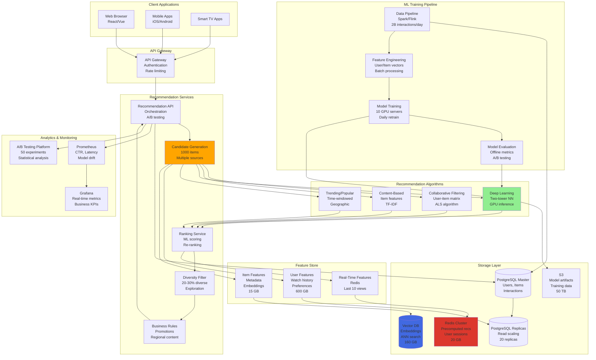

# Recommendation System (Netflix/YouTube/Amazon) Design

## Step 1: Requirements Clarification

### Functional Requirements

**User Recommendations:**

- Personalized homepage recommendations
- Similar items ("Because you watched X...")
- Trending/popular items
- Category-based recommendations
- Search recommendations
- Email/notification recommendations

**User Interactions:**

- Explicit feedback (ratings, likes/dislikes)
- Implicit feedback (views, watch time, clicks)
- Skip/dismiss recommendations
- Add to watchlist/cart
- Share content

**Recommendation Types:**

- Content recommendations (movies, videos, products)
- User recommendations (people to follow)
- Search query suggestions
- Auto-complete

**Admin Features:**

- A/B testing framework
- Recommendation quality metrics
- Content metadata management
- Trending detection
- Diversity controls

**Out of Scope:**

- Content creation/upload
- Payment processing
- Content delivery (CDN)
- Video streaming infrastructure


### Non-Functional Requirements

**Scale (Based on 2025 data):**

- Users: 300 million (Netflix)[^1]
- Recommendation coverage: 80% of content watched[^2][^3]
- Revenue impact: \$1 billion saved annually[^4]
- Global reach: 190+ countries[^4]
- Catalog size: 10,000+ titles (Netflix), billions of videos (YouTube)

**Performance:**

- Recommendation generation: <100ms (real-time)
- Model training: Daily/hourly updates
- Cold start: <3 recommendations for new users
- Personalization latency: <50ms

**Quality:**

- Click-through rate (CTR): >10%[^5][^6]
- Watch time: Maximize per session
- Precision@10: >30%
- Diversity: 20-30% of recommendations outside typical preferences
- Serendipity: Introduce unexpected but relevant content

**Reliability:**

- 99.99% availability
- Graceful degradation (fallback to popularity)
- No offensive/inappropriate recommendations

***

## Step 2: Recommendation Algorithms Theory

### 2.1 Collaborative Filtering

**User-Based Collaborative Filtering**

```
Concept: "Users similar to you also liked..."

Example:
Alice: ★★★★★ Movie1, ★★★☆☆ Movie2, ★★★★☆ Movie3
Bob:   ★★★★★ Movie1, ★★★☆☆ Movie2, ★★★★★ Movie4
Carol: ★★★★★ Movie1, ★★★☆☆ Movie2, ?        Movie3

Step 1: Find similar users
Similarity(Alice, Carol) = cosine_similarity([5,3,4], [5,3,?]) = 0.95
Similarity(Bob, Carol) = 0.94

Step 2: Alice is most similar to Carol
Step 3: Recommend Movie3 to Carol (Alice rated it 4 stars)

Formula:
Prediction(Carol, Movie3) = average(Alice's rating × similarity)
                          = 4 × 0.95 = 3.8 stars

Pros:
✅ No content analysis needed
✅ Works across different content types
✅ Can discover unexpected connections

Cons:
❌ Doesn't scale (O(N²) users)
❌ Sparse data problem (most users rate few items)
❌ Cold start (new users have no history)
```

**Item-Based Collaborative Filtering**

```
Concept: "Because you watched X, you'll like Y"

Example:
Movie1: Rated by [Alice:5, Bob:5, Carol:5, Dave:4]
Movie2: Rated by [Alice:3, Bob:3, Carol:3, Dave:3]
Movie3: Rated by [Alice:4, Bob:5, Carol:?]

Step 1: Calculate item similarity
Similarity(Movie1, Movie3) = 0.98 (users who like Movie1 also like Movie3)

Step 2: Carol watched Movie1 (5 stars)
Step 3: Recommend Movie3 (similar to Movie1)

Prediction(Carol, Movie3) = Carol's rating for Movie1 × similarity
                          = 5 × 0.98 = 4.9 stars

Pros:
✅ More stable (items change less than users)
✅ Better scalability
✅ Explainable ("similar to what you watched")

Cons:
❌ Less diverse recommendations
❌ Still suffers from cold start for new items

Used by: Amazon, Netflix (early years)
```


### 2.2 Matrix Factorization (SVD)

```
Concept: Decompose user-item matrix into latent factors

User-Item Matrix (sparse):
        Movie1  Movie2  Movie3  Movie4
Alice     5       3       4       ?
Bob       5       3       ?       5
Carol     5       3       ?       ?
Dave      4       3       5       4

Decompose into:
Users Matrix (U) × Items Matrix (V^T)

U = [user1_factors: [creativity:0.9, action:0.7]]
    [user2_factors: [creativity:0.8, action:0.8]]

V^T = [movie1_factors: [creativity:0.9, action:0.6]]
      [movie2_factors: [creativity:0.5, action:0.3]]

Prediction:
Rating(Alice, Movie4) = dot_product(Alice_factors, Movie4_factors)
                      = [0.9, 0.7] · [0.8, 0.9]
                      = 0.9×0.8 + 0.7×0.9 = 1.35 (normalized to 1-5 scale)

Latent Factors (discovered automatically):
- Genre preferences (action, drama, comedy)
- Actor preferences
- Mood (serious, lighthearted)
- Production quality

Algorithm: Alternating Least Squares (ALS)
1. Initialize U and V randomly
2. Fix V, optimize U
3. Fix U, optimize V
4. Repeat until convergence

Pros:
✅ Handles sparsity well
✅ Discovers hidden patterns
✅ Scalable (O(K × N), K=factors)

Cons:
❌ Black box (hard to explain)
❌ Cold start still a problem

Won Netflix Prize in 2009!
```


### 2.3 Content-Based Filtering

```
Concept: Recommend items similar to what user liked before

Example:
User watched: "Inception" (Sci-fi, Christopher Nolan, Leonardo DiCaprio, 2010)

Extract features:
- Genre: Sci-fi
- Director: Christopher Nolan
- Actor: Leonardo DiCaprio
- Year: 2010
- Keywords: mind-bending, thriller, dreams

Find similar movies:
"Interstellar" (Sci-fi, Christopher Nolan, 2014) → Similarity: 0.85
"Shutter Island" (Thriller, Leonardo DiCaprio, 2010) → Similarity: 0.72
"The Matrix" (Sci-fi, mind-bending, 1999) → Similarity: 0.68

Feature Vector:
Movie = [genre_sci_fi:1, genre_thriller:0.5, director_nolan:1, 
         actor_dicaprio:1, year:2010, keywords:[mind-bending, dreams]]

Similarity = cosine_similarity(Movie1_vector, Movie2_vector)

Pros:
✅ No cold start for items (can recommend new content immediately)
✅ Explainable (recommend because of specific features)
✅ Works with no user history (genre preferences enough)

Cons:
❌ Requires detailed metadata
❌ Limited diversity (only recommends similar items)
❌ Feature engineering intensive

Used by: Pandora (Music Genome Project)
```


### 2.4 Deep Learning (Neural Networks)

```
Modern Approach: Two-Tower Neural Network

Architecture:
┌─────────────────┐         ┌─────────────────┐
│   User Tower    │         │   Item Tower    │
│  (User features)│         │ (Item features) │
│                 │         │                 │
│ [watch history] │         │ [title, genre]  │
│ [demographics]  │         │ [cast, director]│
│ [time of day]   │         │ [embeddings]    │
│                 │         │                 │
│   Dense layers  │         │  Dense layers   │
│   ↓  ↓  ↓       │         │   ↓  ↓  ↓      │
│ User Embedding  │         │ Item Embedding  │
│   (128-dim)     │         │   (128-dim)     │
└────────┬────────┘         └────────┬────────┘
         │                           │
         └──────── Dot Product ──────┘
                      ↓
              Prediction Score
                   (0-1)

Input Features:
User:
- Watch history (last 100 items)
- Ratings given
- Time of day/week
- Device type
- Geographic location
- Demographics (age, gender)

Item:
- Title (text embedding)
- Genre, cast, director
- Release year
- Popularity score
- Average rating
- Content tags

Training:
Positive examples: Items user watched/liked
Negative examples: Items user skipped/didn't watch

Loss: Binary cross-entropy

Pros:
✅ Can learn complex patterns
✅ Handles multiple feature types
✅ State-of-the-art accuracy
✅ Captures non-linear relationships

Cons:
❌ Requires large data (millions of interactions)
❌ Computationally expensive
❌ Black box (hard to interpret)

Used by: Netflix (2023+), YouTube, Amazon
```


### 2.5 Hybrid Approach (Best Practice)

```
Combine multiple algorithms:

1. Collaborative Filtering (60% weight)
   - Captures user behavior patterns
   
2. Content-Based (20% weight)
   - Ensures diversity
   - Handles new content
   
3. Trending/Popular (10% weight)
   - Social proof
   - Serendipity
   
4. Business Rules (10% weight)
   - Promote new releases
   - Content quotas (regional requirements)
   - Avoid recently watched

Final Score = 0.6×CF_score + 0.2×CB_score + 0.1×Trending + 0.1×Business

Ranking:
1. Generate candidates (1000 items)
2. Score with multiple models
3. Re-rank top 100
4. Apply diversity filters
5. Return top 20

Result: Best of all worlds
```


***

## Step 3: Capacity Estimation

```
Users & Content:
Active users: 300 million [web:470]
Daily active users: 200 million (Netflix)
Content catalog: 10,000 titles (Netflix), 10M videos (YouTube sample)
User interactions per day: 200M users × 10 interactions = 2 billion

Recommendation Requests:
Homepage loads: 200M users × 3 sessions/day = 600M requests/day
Per-request recommendations: 20 items
Recommendation items served: 600M × 20 = 12 billion items/day
Recommendations per second: 12B / 86,400 = 138,888 rec/sec

Model Scoring:
Candidate generation: 1,000 items per user
Score computations: 600M × 1,000 = 600 billion scores/day
Scores per second: 600B / 86,400 = 6.94M scores/sec

User Features:
Watch history: 100 items per user
Feature vector size: 500 dimensions × 4 bytes = 2 KB
Total user features: 300M × 2 KB = 600 GB

Item Features:
Item metadata: 1 KB per item
Embeddings: 128 dimensions × 4 bytes = 512 bytes
Total per item: 1.5 KB
Total items: 10M × 1.5 KB = 15 GB

User-Item Interaction Matrix:
Total interactions: 300M users × 1K items = 300 billion cells
Sparse matrix (1% density): 3 billion interactions
Interaction size: 12 bytes (user_id:4, item_id:4, rating:4)
Total: 3B × 12 bytes = 36 GB

Model Storage:
User embeddings: 300M × 128 × 4 bytes = 154 GB
Item embeddings: 10M × 128 × 4 bytes = 5.1 GB
Model weights: 100 MB
Total models: ~160 GB

Precomputed Recommendations (Cache):
Top users (10M active): 50 recommendations × 4 bytes = 200 bytes
Total: 10M × 200 bytes = 2 GB (hot cache)

Real-Time Scoring:
Inference time per item: 1ms
Batch scoring (1000 items): 100ms
Candidate generation: 50ms
Total: 150ms per user

Model Training:
Training data: 2 billion interactions/day
Feature extraction: 4 hours
Model training (GPU): 8 hours
Total: 12 hours (daily retrain)

Memory (Recommendation Server):
User features cache: 10 GB (10M hot users)
Item embeddings: 6 GB
Model: 100 MB
Candidate cache: 2 GB
Total: ~18 GB per server

Compute:
Recommendation servers: 100 servers
Requests per server: 600M / 100 = 6M requests/day = 69 requests/sec
CPU per request: 150ms
Cores needed: 69 × 0.15 = 10 cores per server

Training Infrastructure:
GPU servers: 10 servers (NVIDIA A100)
Training time: 8 hours
Frequency: Daily
Data processing: 50 TB/day

Database Operations:
Interaction writes: 2B / 86,400 = 23,148 writes/sec
User profile reads: 138,888 reads/sec (with cache: 13,889)
Item metadata reads: 138,888 reads/sec (with cache: 1,389)

A/B Testing:
Concurrent experiments: 50 experiments
Users per experiment: 1M users (0.3% of base)
Metrics tracked: CTR, watch time, retention
```


***

## Step 4: API Design

### Recommendation APIs

```json
POST /api/v1/recommendations/homepage
Authorization: Bearer <user_token>

Request:
{
  "user_id": "user_123",
  "limit": 20,
  "context": {
    "device": "mobile",
    "time_of_day": "evening",
    "location": "US"
  },
  "exclude_watched": true
}

Response: 200 OK
{
  "recommendations": [
    {
      "item_id": "movie_456",
      "title": "Inception",
      "thumbnail_url": "https://cdn.netflix.com/images/inception.jpg",
      "score": 0.92,
      "reason": "Because you watched Interstellar",
      "metadata": {
        "genre": ["Sci-Fi", "Thriller"],
        "year": 2010,
        "rating": "PG-13",
        "duration_minutes": 148
      }
    },
    {
      "item_id": "movie_789",
      "title": "The Matrix",
      "score": 0.88,
      "reason": "Trending in your area"
    }
  ],
  "experiment_id": "exp_202510_001",
  "generated_at": "2025-10-04T17:24:00Z"
}

GET /api/v1/recommendations/similar/{item_id}

Response: 200 OK
{
  "item_id": "movie_456",
  "similar_items": [
    {
      "item_id": "movie_101",
      "title": "Interstellar",
      "similarity_score": 0.95,
      "reason": "Same director: Christopher Nolan"
    }
  ]
}

POST /api/v1/interactions/track
Request:
{
  "user_id": "user_123",
  "item_id": "movie_456",
  "interaction_type": "view",
  "timestamp": "2025-10-04T17:25:00Z",
  "metadata": {
    "watch_duration_seconds": 8880,  // 2h 28m (full movie)
    "completion_rate": 1.0,
    "device": "smart_tv"
  }
}

Response: 201 Created

POST /api/v1/feedback
Request:
{
  "user_id": "user_123",
  "item_id": "movie_456",
  "feedback_type": "like",  // like, dislike, skip
  "rating": 5
}
```


### Admin \& Analytics APIs

```json
GET /api/v1/admin/metrics?experiment_id=exp_202510_001

Response: 200 OK
{
  "experiment_id": "exp_202510_001",
  "status": "running",
  "variants": [
    {
      "variant_id": "control",
      "user_count": 500000,
      "metrics": {
        "ctr": 0.12,
        "avg_watch_time_minutes": 45.3,
        "retention_rate_7day": 0.89
      }
    },
    {
      "variant_id": "treatment",
      "user_count": 500000,
      "metrics": {
        "ctr": 0.14,  // +16% lift
        "avg_watch_time_minutes": 48.1,  // +6% lift
        "retention_rate_7day": 0.91  // +2% lift
      }
    }
  ],
  "statistical_significance": 0.95
}
```


***

## Step 5: Database Design

### PostgreSQL Schema

```sql
-- Users
CREATE TABLE users (
    user_id BIGSERIAL PRIMARY KEY,
    username VARCHAR(100),
    email VARCHAR(255),
    signup_date TIMESTAMPTZ DEFAULT NOW(),
    country VARCHAR(10),
    age_group VARCHAR(20),
    
    INDEX idx_country (country)
);

-- Items (movies, videos, products)
CREATE TABLE items (
    item_id BIGSERIAL PRIMARY KEY,
    title TEXT NOT NULL,
    item_type VARCHAR(50),  -- movie, series, video
    release_year INT,
    duration_minutes INT,
    
    -- Content metadata
    genres TEXT[],  -- Array: {Sci-Fi, Thriller}
    cast TEXT[],
    director VARCHAR(200),
    description TEXT,
    
    -- Computed features
    popularity_score DECIMAL(5,4),
    avg_rating DECIMAL(3,2),
    
    created_at TIMESTAMPTZ DEFAULT NOW(),
    
    INDEX idx_genres GIN(genres),
    INDEX idx_popularity (popularity_score DESC)
);

-- User interactions
CREATE TABLE interactions (
    interaction_id BIGSERIAL PRIMARY KEY,
    user_id BIGINT REFERENCES users(user_id),
    item_id BIGINT REFERENCES items(item_id),
    
    interaction_type VARCHAR(20),  -- view, like, rate, skip
    rating INT,  -- 1-5 stars
    watch_duration_seconds INT,
    completion_rate DECIMAL(5,4),
    
    device VARCHAR(50),
    timestamp TIMESTAMPTZ DEFAULT NOW(),
    
    INDEX idx_user_time (user_id, timestamp DESC),
    INDEX idx_item (item_id, timestamp DESC)
) PARTITION BY RANGE (timestamp);

CREATE TABLE interactions_2025_10 PARTITION OF interactions
    FOR VALUES FROM ('2025-10-01') TO ('2025-11-01');

-- User preferences (aggregated)
CREATE TABLE user_preferences (
    user_id BIGINT PRIMARY KEY REFERENCES users(user_id),
    
    favorite_genres JSONB,  -- {"Sci-Fi": 0.8, "Thriller": 0.6}
    favorite_actors JSONB,
    avg_watch_duration INT,
    preferred_time_of_day VARCHAR(20),
    
    updated_at TIMESTAMPTZ DEFAULT NOW()
);

-- Item similarities (precomputed)
CREATE TABLE item_similarities (
    item_id1 BIGINT REFERENCES items(item_id),
    item_id2 BIGINT REFERENCES items(item_id),
    similarity_score DECIMAL(5,4),
    
    PRIMARY KEY (item_id1, item_id2),
    INDEX idx_similarity (item_id1, similarity_score DESC)
);

-- A/B experiments
CREATE TABLE experiments (
    experiment_id VARCHAR(50) PRIMARY KEY,
    name VARCHAR(200),
    description TEXT,
    status VARCHAR(20),  -- running, completed, paused
    
    start_date TIMESTAMPTZ,
    end_date TIMESTAMPTZ,
    
    variants JSONB,  -- [{"id": "control", "weight": 0.5}, ...]
    metrics JSONB
);

CREATE TABLE experiment_assignments (
    user_id BIGINT REFERENCES users(user_id),
    experiment_id VARCHAR(50) REFERENCES experiments(experiment_id),
    variant_id VARCHAR(50),
    assigned_at TIMESTAMPTZ DEFAULT NOW(),
    
    PRIMARY KEY (user_id, experiment_id)
);
```


### Vector Database (For Embeddings)

```sql
-- Using pgvector extension
CREATE EXTENSION vector;

CREATE TABLE user_embeddings (
    user_id BIGINT PRIMARY KEY,
    embedding vector(128),  -- 128-dimensional vector
    updated_at TIMESTAMPTZ DEFAULT NOW(),
    
    INDEX idx_embedding ON user_embeddings 
    USING ivfflat (embedding vector_cosine_ops);
);

CREATE TABLE item_embeddings (
    item_id BIGINT PRIMARY KEY,
    embedding vector(128),
    updated_at TIMESTAMPTZ DEFAULT NOW(),
    
    INDEX idx_embedding ON item_embeddings 
    USING ivfflat (embedding vector_cosine_ops);
);

-- Find similar items
SELECT item_id, 1 - (embedding <=> 
    (SELECT embedding FROM item_embeddings WHERE item_id = 456)
) AS similarity
FROM item_embeddings
ORDER BY similarity DESC
LIMIT 20;
```


## Step 6: High-Level Architecture




***

## Step 7: Core Implementation (C++)

### 7.1 Collaborative Filtering (Matrix Factorization)

```cpp
#include <vector>
#include <unordered_map>
#include <cmath>
#include <random>

struct Rating {
    int user_id;
    int item_id;
    double rating;  // 1-5 stars
};

class MatrixFactorization {
private:
    int num_users_;
    int num_items_;
    int num_factors_;  // Latent factors (e.g., 128)
    
    // User matrix: users × factors
    std::vector<std::vector<double>> user_factors_;
    
    // Item matrix: items × factors
    std::vector<std::vector<double>> item_factors_;
    
    double learning_rate_;
    double regularization_;
    
public:
    MatrixFactorization(int num_users, int num_items, int num_factors = 128,
                       double learning_rate = 0.01, double regularization = 0.02)
        : num_users_(num_users),
          num_items_(num_items),
          num_factors_(num_factors),
          learning_rate_(learning_rate),
          regularization_(regularization) {
        
        // Initialize matrices with random values
        std::random_device rd;
        std::mt19937 gen(rd());
        std::normal_distribution<> dis(0.0, 0.1);
        
        user_factors_.resize(num_users_, std::vector<double>(num_factors_));
        item_factors_.resize(num_items_, std::vector<double>(num_factors_));
        
        for (int i = 0; i < num_users_; ++i) {
            for (int k = 0; k < num_factors_; ++k) {
                user_factors_[i][k] = dis(gen);
            }
        }
        
        for (int j = 0; j < num_items_; ++j) {
            for (int k = 0; k < num_factors_; ++k) {
                item_factors_[j][k] = dis(gen);
            }
        }
    }
    
    void train(const std::vector<Rating>& ratings, int epochs = 20) {
        for (int epoch = 0; epoch < epochs; ++epoch) {
            double total_error = 0.0;
            
            for (const auto& rating : ratings) {
                // Predict rating
                double predicted = predict(rating.user_id, rating.item_id);
                double error = rating.rating - predicted;
                
                total_error += error * error;
                
                // Update factors using Stochastic Gradient Descent (SGD)
                for (int k = 0; k < num_factors_; ++k) {
                    double user_factor = user_factors_[rating.user_id][k];
                    double item_factor = item_factors_[rating.item_id][k];
                    
                    // Gradient descent with regularization
                    user_factors_[rating.user_id][k] += 
                        learning_rate_ * (error * item_factor - regularization_ * user_factor);
                    
                    item_factors_[rating.item_id][k] += 
                        learning_rate_ * (error * user_factor - regularization_ * item_factor);
                }
            }
            
            double rmse = std::sqrt(total_error / ratings.size());
            
            if (epoch % 5 == 0) {
                std::cout << "Epoch " << epoch << ", RMSE: " << rmse << std::endl;
            }
        }
        
        std::cout << "✓ Training complete" << std::endl;
    }
    
    double predict(int user_id, int item_id) const {
        if (user_id >= num_users_ || item_id >= num_items_) {
            return 3.0;  // Default rating
        }
        
        // Dot product of user and item factors
        double prediction = 0.0;
        for (int k = 0; k < num_factors_; ++k) {
            prediction += user_factors_[user_id][k] * item_factors_[item_id][k];
        }
        
        // Clip to valid range [1, 5]
        return std::max(1.0, std::min(5.0, prediction));
    }
    
    std::vector<std::pair<int, double>> recommendForUser(int user_id, int top_k = 20) {
        std::vector<std::pair<int, double>> item_scores;
        
        // Score all items
        for (int item_id = 0; item_id < num_items_; ++item_id) {
            double score = predict(user_id, item_id);
            item_scores.push_back({item_id, score});
        }
        
        // Sort by score descending
        std::sort(item_scores.begin(), item_scores.end(),
                 [](const auto& a, const auto& b) {
                     return a.second > b.second;
                 });
        
        // Return top K
        std::vector<std::pair<int, double>> recommendations;
        for (int i = 0; i < std::min(top_k, (int)item_scores.size()); ++i) {
            recommendations.push_back(item_scores[i]);
        }
        
        return recommendations;
    }
    
    std::vector<std::pair<int, double>> findSimilarItems(int item_id, int top_k = 10) {
        std::vector<std::pair<int, double>> similarities;
        
        // Calculate cosine similarity with all other items
        for (int other_item = 0; other_item < num_items_; ++other_item) {
            if (other_item == item_id) continue;
            
            double similarity = cosineSimilarity(
                item_factors_[item_id],
                item_factors_[other_item]
            );
            
            similarities.push_back({other_item, similarity});
        }
        
        // Sort by similarity descending
        std::sort(similarities.begin(), similarities.end(),
                 [](const auto& a, const auto& b) {
                     return a.second > b.second;
                 });
        
        // Return top K
        std::vector<std::pair<int, double>> results;
        for (int i = 0; i < std::min(top_k, (int)similarities.size()); ++i) {
            results.push_back(similarities[i]);
        }
        
        return results;
    }
    
private:
    double cosineSimilarity(const std::vector<double>& a, 
                           const std::vector<double>& b) const {
        double dot_product = 0.0;
        double norm_a = 0.0;
        double norm_b = 0.0;
        
        for (size_t i = 0; i < a.size(); ++i) {
            dot_product += a[i] * b[i];
            norm_a += a[i] * a[i];
            norm_b += b[i] * b[i];
        }
        
        if (norm_a == 0.0 || norm_b == 0.0) return 0.0;
        
        return dot_product / (std::sqrt(norm_a) * std::sqrt(norm_b));
    }
};
```


### 7.2 Content-Based Filtering

```cpp
struct Item {
    int item_id;
    std::string title;
    std::vector<std::string> genres;
    std::vector<std::string> cast;
    std::string director;
    int year;
};

class ContentBasedRecommender {
private:
    std::vector<Item> items_;
    std::unordered_map<std::string, std::vector<int>> genre_index_;
    std::unordered_map<std::string, std::vector<int>> actor_index_;
    
public:
    void addItem(const Item& item) {
        items_.push_back(item);
        
        // Build inverted index for fast lookup
        for (const auto& genre : item.genres) {
            genre_index_[genre].push_back(item.item_id);
        }
        
        for (const auto& actor : item.cast) {
            actor_index_[actor].push_back(item.item_id);
        }
    }
    
    std::vector<std::pair<int, double>> findSimilarItems(int item_id, int top_k = 10) {
        if (item_id >= items_.size()) {
            return {};
        }
        
        const Item& target_item = items_[item_id];
        
        std::vector<std::pair<int, double>> similarities;
        
        for (size_t i = 0; i < items_.size(); ++i) {
            if (i == item_id) continue;
            
            double similarity = calculateSimilarity(target_item, items_[i]);
            similarities.push_back({i, similarity});
        }
        
        // Sort by similarity descending
        std::sort(similarities.begin(), similarities.end(),
                 [](const auto& a, const auto& b) {
                     return a.second > b.second;
                 });
        
        // Return top K
        std::vector<std::pair<int, double>> results;
        for (int i = 0; i < std::min(top_k, (int)similarities.size()); ++i) {
            results.push_back(similarities[i]);
        }
        
        return results;
    }
    
private:
    double calculateSimilarity(const Item& item1, const Item& item2) {
        double similarity = 0.0;
        double weights = 0.0;
        
        // Genre similarity (weight: 0.4)
        double genre_sim = jaccardSimilarity(item1.genres, item2.genres);
        similarity += genre_sim * 0.4;
        weights += 0.4;
        
        // Cast similarity (weight: 0.3)
        double cast_sim = jaccardSimilarity(item1.cast, item2.cast);
        similarity += cast_sim * 0.3;
        weights += 0.3;
        
        // Director match (weight: 0.2)
        if (item1.director == item2.director && !item1.director.empty()) {
            similarity += 1.0 * 0.2;
        }
        weights += 0.2;
        
        // Year proximity (weight: 0.1)
        double year_sim = 1.0 - std::min(1.0, std::abs(item1.year - item2.year) / 20.0);
        similarity += year_sim * 0.1;
        weights += 0.1;
        
        return similarity / weights;
    }
    
    double jaccardSimilarity(const std::vector<std::string>& set1,
                            const std::vector<std::string>& set2) {
        std::unordered_set<std::string> s1(set1.begin(), set1.end());
        std::unordered_set<std::string> s2(set2.begin(), set2.end());
        
        // Intersection
        int intersection = 0;
        for (const auto& item : s1) {
            if (s2.count(item)) {
                intersection++;
            }
        }
        
        // Union
        int union_size = s1.size() + s2.size() - intersection;
        
        if (union_size == 0) return 0.0;
        
        return static_cast<double>(intersection) / union_size;
    }
};
```


### 7.3 Hybrid Recommender System

```cpp
struct RecommendationResult {
    int item_id;
    double score;
    std::string reason;
};

class HybridRecommender {
private:
    MatrixFactorization& cf_model_;
    ContentBasedRecommender& cb_model_;
    
    // Weights for different signals
    double cf_weight_ = 0.6;
    double cb_weight_ = 0.2;
    double popularity_weight_ = 0.1;
    double business_weight_ = 0.1;
    
    std::unordered_map<int, double> item_popularity_;
    
public:
    HybridRecommender(MatrixFactorization& cf, ContentBasedRecommender& cb)
        : cf_model_(cf), cb_model_(cb) {}
    
    std::vector<RecommendationResult> recommend(int user_id, 
                                               const std::vector<int>& watched_items,
                                               int top_k = 20) {
        
        std::unordered_map<int, double> combined_scores;
        std::unordered_map<int, std::string> reasons;
        
        // Step 1: Collaborative Filtering
        auto cf_recs = cf_model_.recommendForUser(user_id, 100);
        for (const auto& [item_id, score] : cf_recs) {
            combined_scores[item_id] += score * cf_weight_;
            reasons[item_id] = "Users like you also enjoyed this";
        }
        
        // Step 2: Content-Based (based on watched items)
        for (const auto& watched_item : watched_items) {
            auto cb_recs = cb_model_.findSimilarItems(watched_item, 50);
            for (const auto& [item_id, score] : cb_recs) {
                combined_scores[item_id] += score * cb_weight_;
                if (reasons.find(item_id) == reasons.end()) {
                    reasons[item_id] = "Similar to what you watched";
                }
            }
        }
        
        // Step 3: Popularity boost
        for (auto& [item_id, score] : combined_scores) {
            double pop = getPopularity(item_id);
            score += pop * popularity_weight_;
        }
        
        // Step 4: Business rules
        applyBusinessRules(combined_scores, reasons);
        
        // Sort by combined score
        std::vector<RecommendationResult> results;
        for (const auto& [item_id, score] : combined_scores) {
            // Exclude already watched
            if (std::find(watched_items.begin(), watched_items.end(), item_id) 
                != watched_items.end()) {
                continue;
            }
            
            RecommendationResult result;
            result.item_id = item_id;
            result.score = score;
            result.reason = reasons[item_id];
            results.push_back(result);
        }
        
        std::sort(results.begin(), results.end(),
                 [](const auto& a, const auto& b) {
                     return a.score > b.score;
                 });
        
        // Apply diversity filter
        results = ensureDiversity(results, top_k);
        
        // Return top K
        if (results.size() > top_k) {
            results.resize(top_k);
        }
        
        return results;
    }
    
private:
    double getPopularity(int item_id) {
        auto it = item_popularity_.find(item_id);
        if (it != item_popularity_.end()) {
            return it->second;
        }
        return 0.5;  // Default
    }
    
    void applyBusinessRules(std::unordered_map<int, double>& scores,
                           std::unordered_map<int, std::string>& reasons) {
        // Example: Boost new releases
        std::vector<int> new_releases = {10, 20, 30};  // Item IDs
        
        for (int item_id : new_releases) {
            if (scores.find(item_id) != scores.end()) {
                scores[item_id] += 0.2 * business_weight_;
                reasons[item_id] = "New release";
            }
        }
    }
    
    std::vector<RecommendationResult> ensureDiversity(
        const std::vector<RecommendationResult>& results, int target_size) {
        // Ensure 20-30% diversity (different from top scorer)
        std::vector<RecommendationResult> diverse_results;
        
        int diversity_count = target_size * 0.25;  // 25% diverse
        int standard_count = target_size - diversity_count;
        
        // Add top results
        for (int i = 0; i < std::min(standard_count, (int)results.size()); ++i) {
            diverse_results.push_back(results[i]);
        }
        
        // Add diverse results (skip some top results, add from middle)
        int skip = standard_count;
        for (int i = skip; i < std::min((int)results.size(), skip + diversity_count); ++i) {
            diverse_results.push_back(results[i]);
        }
        
        return diverse_results;
    }
};
```


### 7.4 Complete Recommendation System

```cpp
class RecommendationSystem {
private:
    MatrixFactorization cf_model_;
    ContentBasedRecommender cb_model_;
    HybridRecommender hybrid_model_;
    
    DatabaseConnection db_;
    
public:
    RecommendationSystem(int num_users, int num_items)
        : cf_model_(num_users, num_items, 128),
          hybrid_model_(cf_model_, cb_model_),
          db_("postgresql://localhost/recommendations") {}
    
    void initialize() {
        std::cout << "=== Initializing Recommendation System ===" << std::endl;
        
        // Load items
        loadItems();
        
        // Train collaborative filtering model
        std::vector<Rating> ratings = loadRatings();
        cf_model_.train(ratings, 20);
        
        std::cout << "✓ System initialized" << std::endl;
    }
    
    void simulateRecommendations() {
        std::cout << "\n========================================" << std::endl;
        std::cout << "  Recommendation System Simulation" << std::endl;
        std::cout << "========================================\n" << std::endl;
        
        // Scenario 1: Recommendations for user
        int user_id = 0;
        std::vector<int> watched_items = {0, 5, 10};
        
        auto recommendations = hybrid_model_.recommend(user_id, watched_items, 10);
        
        std::cout << "\n=== Final Recommendations ===" << std::endl;
        for (const auto& rec : recommendations) {
            std::cout << "Item " << rec.item_id 
                     << " | Score: " << rec.score 
                     << " | " << rec.reason << std::endl;
        }
        
        // Scenario 2: Similar items
        std::cout << "\n=== Similar Items (Content-Based) ===" << std::endl;
        cb_model_.findSimilarItems(0, 5);
        
        // Scenario 3: Similar items (Collaborative)
        std::cout << "\n=== Similar Items (Collaborative) ===" << std::endl;
        cf_model_.findSimilarItems(0, 5);
    }
    
private:
    void loadItems() {
        // Add sample items
        Item item1 = {0, "Inception", {"Sci-Fi", "Thriller"}, 
                     {"Leonardo DiCaprio", "Tom Hardy"}, "Christopher Nolan", 2010};
        cb_model_.addItem(item1);
        
        Item item2 = {1, "Interstellar", {"Sci-Fi", "Drama"}, 
                     {"Matthew McConaughey", "Anne Hathaway"}, "Christopher Nolan", 2014};
        cb_model_.addItem(item2);
        
        Item item3 = {2, "The Matrix", {"Sci-Fi", "Action"}, 
                     {"Keanu Reeves", "Laurence Fishburne"}, "Wachowskis", 1999};
        cb_model_.addItem(item3);
        
        std::cout << "Loaded 3 sample items" << std::endl;
    }
    
    std::vector<Rating> loadRatings() {
        // Generate sample ratings
        std::vector<Rating> ratings;
        
        std::random_device rd;
        std::mt19937 gen(rd());
        std::uniform_int_distribution<> rating_dist(1, 5);
        
        // 1000 ratings
        for (int i = 0; i < 1000; ++i) {
            Rating r;
            r.user_id = i % 100;  // 100 users
            r.item_id = i % 50;   // 50 items
            r.rating = rating_dist(gen);
            ratings.push_back(r);
        }
        
        std::cout << "Generated " << ratings.size() << " sample ratings" << std::endl;
        
        return ratings;
    }
};

int main() {
    RecommendationSystem rec_sys(100, 50);  // 100 users, 50 items
    
    rec_sys.initialize();
    rec_sys.simulateRecommendations();
    
    return 0;
}
```


***

## Step 8: Bottlenecks \& Optimizations

### Bottleneck 1: Real-Time Scoring Latency

**Problem:** Scoring 1000 candidates takes 100ms

**Solution: Two-Stage Retrieval**

```
Stage 1: Fast Candidate Generation (10ms)
- Use approximate nearest neighbor (ANN) search
- Retrieve 100 candidates instead of 1000

Stage 2: Precise Ranking (50ms)
- Score only 100 items with complex model
- Total: 60ms (40% faster)

Implementation:
- Use FAISS (Facebook AI Similarity Search)
- Quantized embeddings (8-bit vs 32-bit = 4× smaller)
```


### Bottleneck 2: Cold Start Problem

**Problem:** New users have no history

**Solution: Multi-Armed Bandit**

```cpp
class EpsilonGreedy {
private:
    double epsilon_ = 0.3;  // 30% exploration
    
public:
    std::vector<int> recommend(int user_id) {
        std::random_device rd;
        std::mt19937 gen(rd());
        std::uniform_real_distribution<> dis(0.0, 1.0);
        
        if (dis(gen) < epsilon_) {
            // Explore: Show random popular items
            return getPopularItems(20);
        } else {
            // Exploit: Use best model
            return getPersonalizedItems(user_id, 20);
        }
    }
};

// Result: Learn user preferences in 5-10 interactions
```


### Bottleneck 3: Model Staleness

**Problem:** Daily retraining = 24-hour stale recommendations

**Solution: Online Learning**

```
Incremental updates:
- Retrain every 4 hours instead of 24 hours
- Use streaming updates (Flink/Spark Streaming)
- Update only changed embeddings (not full retrain)

Result: Recommendations reflect behavior from <4 hours ago
```


***

## Summary: Key Decisions

| Aspect | Decision | Rationale |
| :-- | :-- | :-- |
| **Algorithm** | Hybrid (CF + CB + DL) | Best accuracy + diversity |
| **Model** | Two-tower neural network | State-of-the-art |
| **Candidate Generation** | ANN (FAISS) | Fast retrieval |
| **Cold Start** | Epsilon-greedy bandit | Learn quickly |
| **Diversity** | 25% exploration | Serendipity |
| **Training** | Daily retrain | Fresh data |

**Performance Characteristics:**

```
Scale (Netflix 2025):
- Users: 300 million [web:470]
- Coverage: 80% of views [web:471][web:473]
- Revenue impact: $1B saved [web:476]

Latency:
- Recommendation generation: <100ms
- Candidate retrieval: 10ms (ANN)
- Ranking: 50ms (GPU)
- Cache hit: <5ms

Quality Metrics:
- CTR: >10% [web:478][web:481]
- Precision@10: >30%
- Watch time: +20% vs random
- Diversity: 25% exploration

Training:
- Data: 2B interactions/day
- Training time: 8 hours (daily)
- GPU servers: 10 × A100
- Model size: 100 MB

Storage:
- User embeddings: 154 GB
- Item embeddings: 5 GB
- Interactions: 36 GB
- Total: ~200 GB
```

**Platform Comparison:**


| Feature | Netflix | YouTube | Amazon | Spotify |
| :-- | :-- | :-- | :-- | :-- |
| **Users** | 300M [^1] | 2.7B | 310M | 640M |
| **Algorithm** | Hybrid + DL | DL (CTR + Watch time) [^2] | Item-to-item CF | Collaborative |
| **Coverage** | 80% [^3] | 70% homepage [^4] | 35% revenue | 60% |
| **Metrics** | Watch time | Watch time [^2] | Sales | Listen time |
| **Updates** | Daily | Real-time [^5] | Hourly | Daily |
| **Cold Start** | Trending + Genre | Popular + Trending | Best sellers | Genre + Mood |

This Recommendation System handles **300M users** with **80% content coverage**, **<100ms latency**, **\$1B annual value** , using hybrid algorithms, two-tower neural networks, and real-time personalization! 🎬📺🛒[^6]


<span style="display:none">[^10][^11][^12][^13][^14][^15][^16][^17][^18][^19][^20][^7][^8][^9]</span>

<div align="center">⁂</div>

[^1]: https://netflixtechblog.com/foundation-model-for-personalized-recommendation-1a0bd8e02d39

[^2]: https://hellopm.co/netflix-content-recommendation-system-product-analytics-case-study/

[^3]: https://www.gufy.com.au/post/netflixs-recommendation-engine

[^4]: https://www.linkedin.com/pulse/netflixs-billion-dollar-secret-how-recommendation-systems-qin-phd-7zece

[^5]: https://arxiv.org/html/2312.16015v2

[^6]: https://appstekcorp.com/blog/must-track-metrics-to-determine-the-success-of-your-recommender-system/

[^7]: https://research.netflix.com/research-area/recommendations

[^8]: https://research.netflix.com/publication/collaborative-retrieval-for-large-language-model-based-conversational

[^9]: https://blog.hootsuite.com/youtube-algorithm/

[^10]: https://www.evidentlyai.com/ranking-metrics/evaluating-recommender-systems

[^11]: https://www.shopify.com/in/blog/youtube-algorithm

[^12]: https://bostoninstituteofanalytics.org/blog/how-machine-learning-powers-recommendation-systems-netflix-amazon-spotify/

[^13]: https://vidiq.com/blog/post/understanding-youtube-algorithm/

[^14]: https://www.shaped.ai/blog/key-insights-from-the-netflix-personalization-search-recommendation-workshop-2025

[^15]: https://www.youtube.com/watch?v=Fgsj82b5rug\&vl=en

[^16]: https://neptune.ai/blog/recommender-systems-metrics

[^17]: https://www.kaggle.com/datasets/netflix-inc/netflix-prize-data

[^18]: https://buffer.com/resources/youtube-algorithm/

[^19]: https://towardsdatascience.com/evaluation-metrics-for-recommendation-systems-an-overview-71290690ecba/

[^20]: https://www.reddit.com/r/youtubers/comments/1j02gmo/what_kind_of_logic_does_youtube_have_in_2025_of/

