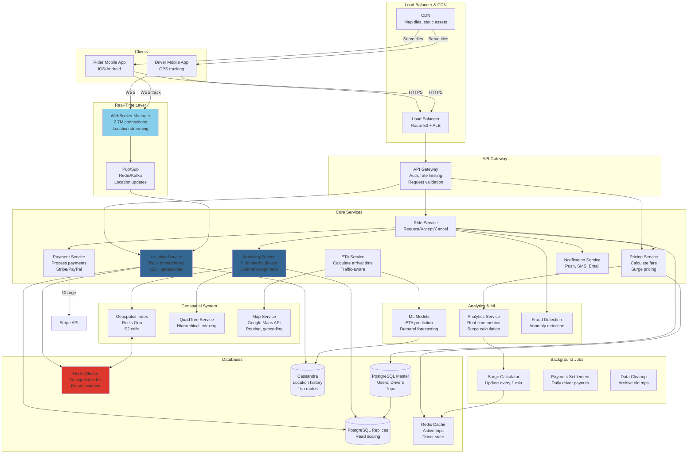

# Ride-Hailing System (Uber) System Design

## Step 1: Requirements Clarification

### Functional Requirements

**Rider Features:**

- Request a ride (specify pickup \& destination)
- See nearby drivers on map (real-time)
- Get fare estimate before booking
- Track driver location in real-time
- Rate driver after trip
- Payment processing
- Trip history
- Schedule rides in advance
- Share ETA with friends
- Multiple ride types (UberX, UberXL, UberBlack, Pool)

**Driver Features:**

- Go online/offline
- Accept/reject ride requests
- Navigate to pickup location
- Navigate to destination
- Start/end trip
- View earnings
- Rate rider
- See rider destination before accepting (some markets)

**Matching:**

- Match rider with nearest available driver
- Optimize for ETA, driver rating, acceptance rate
- Handle simultaneous requests
- Pool matching (shared rides)

**Pricing:**

- Base fare + per mile + per minute
- Surge pricing during high demand
- Discounts/promotions
- Upfront pricing (know cost before ride)

**Out of Scope:**

- Food delivery (Uber Eats)
- Package delivery
- Public transit integration
- Autonomous vehicles


### Non-Functional Requirements

**Scale (Based on 2025 data):**

- Monthly active users: 180 million[^1]
- Daily trips: 28 million globally[^2]
- Active drivers: 8.8 million[^3]
- Geographic coverage: 70 countries, 15,000+ cities[^4][^5]
- Trips per second: 28M / 86,400 = 324 TPS (average)
- Peak TPS: 1,000+ (Friday/Saturday nights)

**Performance:**

- Driver matching: <3 seconds
- Location update latency: <1 second
- ETA calculation: <500ms
- Map rendering: <2 seconds
- Real-time tracking: 5-second intervals

**Reliability:**

- 99.99% uptime
- No duplicate ride assignments
- Accurate billing
- Location accuracy: <10 meters

**Availability:**

- System available 24/7
- Graceful degradation if subsystems fail
- Works in low connectivity areas

***

## Step 2: Ride-Hailing Theory \& Concepts

### 2.1 Geospatial Indexing

**Problem: Finding Nearby Drivers**

```
Naive Approach:
For each ride request:
  - Query all active drivers
  - Calculate distance to each driver
  - Sort by distance
  - Return nearest

Time complexity: O(N) where N = total drivers
For 1M active drivers: Check all 1M drivers for each request!
At 324 TPS: 324M distance calculations per second → Impossible!
```

**Solution 1: Grid/Sharding**

```
Divide world into grid cells (e.g., 1 km × 1 km)

San Francisco Grid:
+----+----+----+----+
| A1 | A2 | A3 | A4 |  (Each cell: 1 km²)
+----+----+----+----+
| B1 | B2 | B3 | B4 |
+----+----+----+----+
| C1 | C2 | C3 | C4 |
+----+----+----+----+

Rider in cell B2:
1. Look in B2 first
2. If no drivers, check adjacent cells (A1, A2, A3, B1, B3, C1, C2, C3)
3. Expand search radius if needed

Time complexity: O(K) where K = drivers in nearby cells (~10-100)
Reduction: 1M → 100 (10,000x faster!)

Problems:
- Fixed grid doesn't adapt to density
- Urban vs rural areas have different densities
- Edge cases (driver exactly on border)
```

**Solution 2: QuadTree (Better)**

```
QuadTree: Recursively divide space into 4 quadrants

Level 0 (Root):        Entire city
                    +-----------+
                    |           |
                    |    SF     |
                    |           |
                    +-----------+

Level 1:           Divide into 4
                +-----+-----+
                | NW  | NE  |
                +-----+-----+
                | SW  | SE  |
                +-----+-----+

Level 2:         Divide dense areas further
            +---+---+     +-----+
            |NW1|NE1|     | NE  |
            +---+---+     |     |
            |SW1|SE1|     +-----+
            +---+---+     +-----+
                          | SE  |
                          +-----+

Rules:
- Leaf node: Contains ≤ N drivers (e.g., N = 50)
- If > N drivers in node: Split into 4 children
- If < N drivers after removal: Merge with siblings

Search Algorithm:
1. Start at root
2. Traverse to leaf containing rider location
3. If leaf has nearby drivers: Return
4. Else: Check adjacent nodes

Time: O(log N) to traverse + O(K) to check drivers
For 1M drivers: log₄(1M) = ~10 levels
```

**Solution 3: Google S2 (Used by Uber)**

```
S2 Geometry Library:
- Maps Earth to a sphere, then to a cube
- Each cube face divided into cells (hierarchical)
- Cells identified by 64-bit IDs
- Preserves locality (nearby cells have similar IDs)

S2 Cell Levels:
Level 0: 6 cells (cube faces)
Level 10: ~4 km² per cell
Level 15: ~60 m² per cell
Level 20: ~1 m² per cell
Level 30: ~1 cm² per cell

Advantages:
✅ Hierarchical (like QuadTree)
✅ Covers sphere seamlessly (no edge issues)
✅ Fast computation
✅ Used by Google Maps, Uber, Lyft

Search:
1. Convert rider location to S2 cell ID (e.g., level 15)
2. Query drivers in same cell
3. If not enough, query neighboring cells
4. S2 provides neighbor lookup in O(1)
```

**S2 Cell ID Example:**

```
Rider location: (37.7749° N, 122.4194° W) - San Francisco
S2 Cell (Level 15): 0x808c000000000000

Nearby cells:
- 0x808c000000000001
- 0x808c000000000002
- 0x808bffffffffffff

Query: SELECT * FROM drivers 
       WHERE s2_cell_id BETWEEN 0x808c000000000000 AND 0x808c000100000000
       AND is_available = true
       ORDER BY last_update DESC
       LIMIT 10;

Result: 10 drivers within ~60 meters
Query time: <10ms (with index on s2_cell_id)
```


### 2.2 ETA Calculation

**Goal:** Estimate time for driver to reach rider

**Naive: Straight-Line Distance**

```
Distance = √[(x₂-x₁)² + (y₂-y₁)²]
ETA = Distance / Average Speed

Problems:
❌ Ignores roads
❌ Ignores traffic
❌ Ignores one-way streets
❌ Very inaccurate
```

**Better: Road Network + Traffic**

```
1. Use road network graph (from Google Maps, OpenStreetMap)
2. Apply Dijkstra's algorithm with traffic weights
3. Consider:
   - Real-time traffic
   - Historical traffic patterns
   - Road types (highway vs city)
   - Turn restrictions

Example:
Driver → Rider: 2.5 miles via Highway 101
- No traffic: 5 minutes (30 mph)
- Rush hour: 12 minutes (12.5 mph)
- Current time: 8 AM (rush hour) → ETA: 12 minutes
```

**Uber's Approach:**

```
Hybrid Model:
1. Pre-computed routes for common corridors
2. Real-time traffic data from:
   - Uber's own fleet (millions of data points)
   - Third-party providers (Google, HERE, TomTom)
3. Machine learning model:
   - Input: Time of day, day of week, weather, events, historical patterns
   - Output: ETA with confidence interval

Accuracy: 95% of ETAs within ±2 minutes
```


### 2.3 Surge Pricing

**Goal:** Balance supply (drivers) and demand (riders)

**Formula:**

```
Surge Multiplier = Base fare × Multiplier

Basic Algorithm:
if (Demand > Supply):
    Surge = 1 + (Demand - Supply) / Supply
else:
    Surge = 1.0

Example:
Area: Downtown SF at 2 AM (bars closing)
Riders requesting: 100
Available drivers: 20
Supply/Demand ratio: 20/100 = 0.2

Surge = 1 + (100 - 20) / 20 = 5.0x
Base fare: $10 → Surge fare: $50

Effect:
- Higher prices incentivize more drivers
- Reduces demand (price-sensitive riders wait)
- Eventually reaches equilibrium
```

**Dynamic Surge:**

```
Update every 1-5 minutes based on:
- Request rate
- Accept rate
- Wait time
- Driver availability

ML Model:
Input: [time, location, weather, events, historical demand]
Output: Predicted surge multiplier

Uber displays:
"Fares are higher due to increased demand"
"1.5x surge" or specific amount "$5 surge"
```


### 2.4 Driver-Rider Matching Algorithm

**Constraints:**

- Minimize rider wait time
- Maximize driver utilization
- Fair to all riders (no starvation)
- Respect driver preferences

**Simple Greedy (Baseline):**

```
When rider requests:
1. Find all available drivers within 5 km
2. Calculate ETA for each driver
3. Assign driver with shortest ETA
4. Send request to driver

Problems:
❌ Doesn't optimize globally
❌ Ignores driver's future availability
❌ May strand drivers in low-demand areas
```

**Batch Matching (Better):**

```
Every 5 seconds:
1. Collect all pending ride requests
2. Find all available drivers
3. Solve optimization problem:
   
   Minimize: Total rider wait time
   
   Constraints:
   - Each rider matched to ≤ 1 driver
   - Each driver matched to ≤ 1 rider
   - ETA < threshold (e.g., 10 minutes)

Algorithm: Hungarian Algorithm (O(n³)) or approximation

Example:
Riders: R1, R2, R3
Drivers: D1, D2, D3

Cost Matrix (ETA in minutes):
       D1   D2   D3
R1     2    5    8
R2     6    3    4
R3     7    4    2

Optimal matching:
R1 ← D1 (2 min)
R2 ← D2 (3 min)
R3 ← D3 (2 min)
Total: 7 minutes
```

**Pool Matching (Complex):**

```
Goal: Match multiple riders going same direction

Constraints:
- Max 2 riders per car (UberPool)
- Detour < 5 minutes for existing rider
- Total trip time < 1.5x solo ride

Algorithm:
1. Find rider R1 requesting A → B
2. Find rider R2 requesting C → D
3. Check if route A → C → D → B is feasible
4. If yes: Assign both to same driver
5. Riders get discount (20-50% off)
6. Driver gets paid for longer trip

Optimization:
NP-hard problem (vehicle routing with time windows)
Use heuristics + local search
```


***

## Step 3: Capacity Estimation

```
Users & Trips:
Monthly active users: 180 million [web:315]
Daily active users: ~30 million (estimate)
Daily trips: 28 million [web:314]
Trips per second (average): 28M / 86,400 = 324 TPS
Trips per second (peak): 1,000 TPS (3x average)

Drivers:
Total drivers: 8.8 million [web:324]
Active drivers (online): ~20% = 1.76 million
Drivers per trip: 1.76M / 28M trips/day = 1 driver per 16 trips
Average driver online time: 6 hours/day

Geographic Distribution:
Cities: 15,000+ [web:322]
Countries: 70 [web:323]
Top markets: USA (30%), India (25%), Brazil (10%)

Location Updates:
Drivers send location every 5 seconds
Active drivers: 1.76M
Location updates per second: 1.76M / 5 = 352K updates/sec

With riders tracking drivers:
Riders in active trip: 28M trips / (30 min avg) = 933K concurrent
Location queries: 933K × 1 query per 5 sec = 187K reads/sec
Total location operations: 352K writes + 187K reads = 539K ops/sec

Matching Requests:
Ride requests per second: 324 TPS
For each request:
  - Query nearby drivers: 1 geospatial query
  - Calculate ETAs: 10-20 calculations
  - Driver assignment: 1 write
Total: 324 × 22 = 7,128 operations/sec

Database Writes:
New trips: 324 writes/sec
Location updates: 352K writes/sec
Trip updates (status changes): 324 × 5 (pickup, start, end, etc.) = 1,620/sec
Total: 354K writes/sec

Database Reads:
User profile: 324 reads/sec (for new trips)
Driver profile: 324 reads/sec
Ride history: 10K reads/sec (users checking past trips)
Location queries: 187K reads/sec (tracking)
Total: 198K reads/sec

Storage:
Users: 180M × 1 KB = 180 GB
Drivers: 8.8M × 2 KB = 17.6 GB
Trips (archived): 10B trips × 5 KB = 50 TB
Active trips: 933K × 2 KB = 1.9 GB
Driver locations (current): 1.76M × 200 bytes = 352 MB
Total: ~50 TB

Geospatial Index:
S2 cells (Level 15): ~4 million cells globally
Drivers per cell (average): 1.76M / 4M = 0.44 drivers/cell
Index size: 4M cells × 100 bytes = 400 MB

WebSocket Connections:
Active riders: 933K (in trip)
Active drivers: 1.76M
Total: 2.7M concurrent WebSocket connections

Connection servers: 2.7M / 10K per server = 270 servers
With redundancy: 540 servers

Network Bandwidth:
Location updates: 352K/sec × 200 bytes = 70 MB/sec
Location queries: 187K/sec × 500 bytes = 93 MB/sec
Map tiles: 324 new trips/sec × 1 MB = 324 MB/sec
Total: ~500 MB/sec = 4 Gbps

Notification Service:
Push notifications (driver assigned): 324/sec
SMS (trip receipt): 324/sec
Emails: 50/sec (receipts, promotions)
Total: ~700 notifications/sec

Payment Processing:
Transactions: 324 trips/sec
Average fare: $15
Total: $15 × 324 = $4,860/sec = $420M/day
Annual revenue: ~$150B (matches Uber's GMV)
```


***

## Step 4: API Design

### Rider APIs

```json
POST /api/v1/rides/request
Authorization: Bearer <token>
Content-Type: application/json

Request:
{
  "pickup": {
    "latitude": 37.7749,
    "longitude": -122.4194,
    "address": "123 Market St, San Francisco, CA"
  },
  "destination": {
    "latitude": 37.8044,
    "longitude": -122.2712,
    "address": "Oakland Airport"
  },
  "ride_type": "uberx",  // uberx, uberxl, black, pool
  "payment_method_id": "pm_123abc",
  "passengers": 1
}

Response: 201 Created
{
  "ride_id": "ride_xyz789",
  "status": "searching",
  "fare_estimate": {
    "min": 2500,  // $25.00 in cents
    "max": 3200,
    "currency": "USD",
    "surge_multiplier": 1.0
  },
  "estimated_pickup_time": 180,  // seconds
  "expires_at": "2025-10-04T16:20:00Z"  // Request expires after 5 min
}

// Get ride status (polling or WebSocket)
GET /api/v1/rides/{ride_id}

Response: 200 OK
{
  "ride_id": "ride_xyz789",
  "status": "driver_assigned",  // searching, driver_assigned, arriving, in_progress, completed
  "driver": {
    "driver_id": "driver_abc123",
    "name": "John Doe",
    "rating": 4.8,
    "vehicle": {
      "make": "Toyota",
      "model": "Camry",
      "color": "Silver",
      "license_plate": "7ABC123"
    },
    "location": {
      "latitude": 37.7700,
      "longitude": -122.4150
    },
    "photo_url": "https://cdn.uber.com/drivers/abc123.jpg"
  },
  "pickup_eta": 120,  // seconds
  "fare": {
    "base_fare": 250,
    "distance_fare": 1500,
    "time_fare": 800,
    "surge": 0,
    "total": 2550,
    "currency": "USD"
  }
}

// Track driver location (WebSocket)
WS /api/v1/rides/{ride_id}/track

Server → Client (every 5 seconds):
{
  "type": "location_update",
  "driver_location": {
    "latitude": 37.7720,
    "longitude": -122.4160,
    "heading": 45,  // degrees
    "speed": 12.5  // m/s
  },
  "eta": 90,  // seconds to pickup
  "distance": 500  // meters to pickup
}

// Cancel ride
POST /api/v1/rides/{ride_id}/cancel
Request:
{
  "reason": "driver_taking_too_long",
  "details": "ETA increased from 3 to 10 minutes"
}

Response: 200 OK
{
  "ride_id": "ride_xyz789",
  "status": "cancelled",
  "cancellation_fee": 500,  // $5.00 if applicable
  "refund_amount": 0
}

// Rate driver
POST /api/v1/rides/{ride_id}/rating
Request:
{
  "rating": 5,
  "tip": 300,  // $3.00
  "feedback": ["professional", "clean_car"],
  "comment": "Great driver!"
}

Response: 204 No Content
```


### Driver APIs

```json
POST /api/v1/drivers/online
Authorization: Bearer <driver_token>

Request:
{
  "location": {
    "latitude": 37.7749,
    "longitude": -122.4194
  },
  "vehicle_id": "vehicle_abc"
}

Response: 200 OK
{
  "status": "online",
  "session_id": "session_xyz",
  "earnings_today": 12500  // $125.00
}

// Update location (every 5 seconds while online)
POST /api/v1/drivers/location
Request:
{
  "latitude": 37.7750,
  "longitude": -122.4195,
  "heading": 90,
  "speed": 15.5,
  "accuracy": 5  // meters
}

Response: 204 No Content

// Receive ride request (push notification + API)
// Server → Driver
{
  "type": "ride_request",
  "ride_id": "ride_xyz789",
  "pickup": {
    "latitude": 37.7800,
    "longitude": -122.4200,
    "address": "456 Mission St"
  },
  "destination": {
    "latitude": 37.8044,
    "longitude": -122.2712,
    "address": "Oakland Airport"  // Some markets hide this
  },
  "fare_estimate": 2800,
  "distance_to_pickup": 1200,  // meters
  "eta_to_pickup": 180,  // seconds
  "expires_at": "2025-10-04T16:15:30Z"  // 15 seconds to accept
}

// Accept ride
POST /api/v1/rides/{ride_id}/accept
Response: 200 OK
{
  "ride_id": "ride_xyz789",
  "status": "accepted",
  "rider": {
    "rider_id": "rider_def456",
    "name": "Jane Smith",
    "rating": 4.9,
    "photo_url": "https://cdn.uber.com/riders/def456.jpg"
  },
  "pickup": {...},
  "destination": {...}
}

// Update trip status
POST /api/v1/rides/{ride_id}/status
Request:
{
  "status": "arrived",  // arrived, started, completed
  "location": {
    "latitude": 37.7800,
    "longitude": -122.4200
  }
}

Response: 200 OK
```


### Admin/Analytics APIs

```json
GET /api/v1/analytics/heatmap?city=san_francisco&time=2025-10-04T20:00:00Z

Response: 200 OK
{
  "city": "san_francisco",
  "timestamp": "2025-10-04T20:00:00Z",
  "heatmap": [
    {
      "lat": 37.7749,
      "lng": -122.4194,
      "demand": 85,  // Riders requesting
      "supply": 45,  // Available drivers
      "surge_multiplier": 1.8
    }
  ]
}

GET /api/v1/pricing/surge?location=37.7749,-122.4194

Response: 200 OK
{
  "surge_multiplier": 1.5,
  "reason": "High demand in your area",
  "expires_at": "2025-10-04T16:20:00Z"
}
```


***

## Step 5: Database Design

### PostgreSQL Schema (Core Data)

```sql
-- Users (riders)
CREATE TABLE users (
    user_id BIGSERIAL PRIMARY KEY,
    phone_number VARCHAR(20) UNIQUE NOT NULL,
    email VARCHAR(255) UNIQUE,
    first_name VARCHAR(100),
    last_name VARCHAR(100),
    profile_photo_url TEXT,
    created_at TIMESTAMPTZ DEFAULT NOW(),
    rating DECIMAL(3,2) DEFAULT 5.0,
    total_rides INT DEFAULT 0,
    
    INDEX idx_phone (phone_number),
    INDEX idx_email (email)
);

-- Drivers
CREATE TABLE drivers (
    driver_id BIGSERIAL PRIMARY KEY,
    user_id BIGINT REFERENCES users(user_id),
    license_number VARCHAR(50) UNIQUE NOT NULL,
    vehicle_id BIGINT REFERENCES vehicles(vehicle_id),
    status VARCHAR(20) DEFAULT 'offline',  -- offline, online, on_trip
    rating DECIMAL(3,2) DEFAULT 5.0,
    total_trips INT DEFAULT 0,
    acceptance_rate DECIMAL(3,2),
    created_at TIMESTAMPTZ DEFAULT NOW(),
    
    -- Current location (for quick queries)
    current_lat DECIMAL(10,8),
    current_lng DECIMAL(11,8),
    s2_cell_id BIGINT,  -- S2 geohash for spatial indexing
    last_location_update TIMESTAMPTZ,
    
    INDEX idx_status (status),
    INDEX idx_s2_cell (s2_cell_id) WHERE status = 'online',
    INDEX idx_location (current_lat, current_lng) WHERE status = 'online'
);

-- Vehicles
CREATE TABLE vehicles (
    vehicle_id BIGSERIAL PRIMARY KEY,
    make VARCHAR(50),
    model VARCHAR(50),
    year INT,
    color VARCHAR(30),
    license_plate VARCHAR(20) UNIQUE NOT NULL,
    vehicle_type VARCHAR(20),  -- sedan, suv, luxury
    capacity INT DEFAULT 4,
    
    INDEX idx_license (license_plate)
);

-- Trips
CREATE TABLE trips (
    trip_id BIGSERIAL PRIMARY KEY,
    rider_id BIGINT REFERENCES users(user_id),
    driver_id BIGINT REFERENCES drivers(driver_id),
    
    status VARCHAR(20) NOT NULL,  -- requested, accepted, arrived, in_progress, completed, cancelled
    
    -- Locations
    pickup_lat DECIMAL(10,8) NOT NULL,
    pickup_lng DECIMAL(11,8) NOT NULL,
    pickup_address TEXT,
    
    dropoff_lat DECIMAL(10,8),
    dropoff_lng DECIMAL(11,8),
    dropoff_address TEXT,
    
    -- Timing
    requested_at TIMESTAMPTZ DEFAULT NOW(),
    accepted_at TIMESTAMPTZ,
    arrived_at TIMESTAMPTZ,
    started_at TIMESTAMPTZ,
    completed_at TIMESTAMPTZ,
    
    -- Fare
    base_fare INT,  -- in cents
    distance_fare INT,
    time_fare INT,
    surge_multiplier DECIMAL(3,2) DEFAULT 1.0,
    total_fare INT,
    currency VARCHAR(3) DEFAULT 'USD',
    
    -- Metrics
    distance_km DECIMAL(8,2),
    duration_seconds INT,
    
    -- Ratings
    rider_rating INT CHECK (rider_rating BETWEEN 1 AND 5),
    driver_rating INT CHECK (driver_rating BETWEEN 1 AND 5),
    
    INDEX idx_rider_trips (rider_id, requested_at DESC),
    INDEX idx_driver_trips (driver_id, requested_at DESC),
    INDEX idx_status (status),
    INDEX idx_requested_at (requested_at DESC)
) PARTITION BY RANGE (requested_at);

-- Partition by month
CREATE TABLE trips_2025_10 PARTITION OF trips
    FOR VALUES FROM ('2025-10-01') TO ('2025-11-01');

-- Payment methods
CREATE TABLE payment_methods (
    payment_method_id BIGSERIAL PRIMARY KEY,
    user_id BIGINT REFERENCES users(user_id),
    type VARCHAR(20),  -- credit_card, debit_card, paypal, cash
    last_four VARCHAR(4),
    is_default BOOLEAN DEFAULT FALSE,
    
    INDEX idx_user_payments (user_id)
);

-- Surge pricing zones
CREATE TABLE surge_zones (
    zone_id BIGSERIAL PRIMARY KEY,
    city VARCHAR(100),
    geohash VARCHAR(20),  -- Geohash for area
    surge_multiplier DECIMAL(3,2),
    updated_at TIMESTAMPTZ DEFAULT NOW(),
    expires_at TIMESTAMPTZ,
    
    INDEX idx_geohash (geohash),
    INDEX idx_city_active (city, expires_at) WHERE expires_at > NOW()
);
```


### Redis Cache (Real-Time State)

```redis
# Online drivers (Geo-indexed)
GEOADD drivers:online -122.4194 37.7749 "driver_123"
GEOADD drivers:online -122.4200 37.7800 "driver_456"

# Find nearby drivers (within 5 km)
GEORADIUS drivers:online -122.4194 37.7749 5 km WITHDIST COUNT 10

# Driver state
HSET driver:123 "status" "online" "lat" "37.7749" "lng" "-122.4194" "heading" "90"
EXPIRE driver:123 300  # Expire after 5 minutes (heartbeat)

# Active trips (for real-time tracking)
HSET trip:xyz789 "status" "in_progress" "driver_id" "123" "rider_id" "456"
GEOADD trip:xyz789:route -122.4194 37.7749  # Track route
EXPIRE trip:xyz789 7200  # 2 hours max

# Driver location history (for routing)
ZADD driver:123:locations <timestamp> "<lat>,<lng>"
ZREMRANGEBYSCORE driver:123:locations 0 <1_hour_ago>  # Keep last 1 hour

# Surge pricing (by geohash)
HSET surge:sf:9q8yy "multiplier" "1.8" "updated_at" "1728048000"
EXPIRE surge:sf:9q8yy 300  # Update every 5 minutes

# Request queue (driver matching)
LPUSH ride_requests:sf "ride_xyz789"
BRPOP ride_requests:sf 5  # Blocking pop with 5-second timeout

# Driver earnings (today)
INCRBY driver:123:earnings:20251004 2800  # Add $28.00
```


### Cassandra (Time-Series Location Data)

```sql
-- Driver location history (time-series)
CREATE TABLE driver_locations (
    driver_id BIGINT,
    timestamp TIMESTAMP,
    latitude DECIMAL,
    longitude DECIMAL,
    heading INT,
    speed DECIMAL,
    
    PRIMARY KEY (driver_id, timestamp)
) WITH CLUSTERING ORDER BY (timestamp DESC);

-- Trip route tracking
CREATE TABLE trip_routes (
    trip_id BIGINT,
    timestamp TIMESTAMP,
    driver_lat DECIMAL,
    driver_lng DECIMAL,
    speed DECIMAL,
    
    PRIMARY KEY (trip_id, timestamp)
) WITH CLUSTERING ORDER BY (timestamp DESC);
```


***

## Step 6: High-Level Architecture




***

## Step 7: Core Implementation (C++) - Part 1

### 7.1 Geospatial Data Structures

<details>
<summary>S2CellId Struct</summary>

```cpp
#include <cmath>
#include <vector>
#include <memory>
#include <unordered_map>

// S2 Cell ID (simplified - real S2 is more complex)
struct S2CellId {
    uint64_t id;
    int level;  // 0-30
    
    static S2CellId fromLatLng(double lat, double lng, int level = 15) {
        // Convert lat/lng to S2 cell ID
        // Simplified: Use geohash-like encoding
        uint64_t lat_bits = static_cast<uint64_t>((lat + 90.0) / 180.0 * (1ULL << 32));
        uint64_t lng_bits = static_cast<uint64_t>((lng + 180.0) / 360.0 * (1ULL << 32));
        
        // Interleave bits
        uint64_t id = 0;
        for (int i = 0; i < 32; ++i) {
            id |= ((lat_bits >> (31 - i)) & 1) << (2 * i + 1);
            id |= ((lng_bits >> (31 - i)) & 1) << (2 * i);
        }
        
        // Mask to level
        int bits_per_level = 2;  // Each level adds 2 bits (4 children)
        uint64_t mask = (~0ULL) << (64 - level * bits_per_level);
        id &= mask;
        
        return {id, level};
    }
    
    std::vector<S2CellId> getNeighbors() const {
        // Get 8 neighboring cells
        // Simplified: Return adjacent cell IDs
        std::vector<S2CellId> neighbors;
        
        uint64_t step = 1ULL << (64 - level * 2);
        
        for (int dx = -1; dx <= 1; ++dx) {
            for (int dy = -1; dy <= 1; ++dy) {
                if (dx == 0 && dy == 0) continue;
                
                uint64_t neighbor_id = id + dx * step + dy * step * 2;
                neighbors.push_back({neighbor_id, level});
            }
        }
        
        return neighbors;
    }
};

// QuadTree for driver indexing
struct Location {
    double lat;
    double lng;
    
    double distanceTo(const Location& other) const {
        // Haversine formula
        const double R = 6371.0;  // Earth radius in km
        
        double lat1 = lat * M_PI / 180.0;
        double lat2 = other.lat * M_PI / 180.0;
        double dlat = (other.lat - lat) * M_PI / 180.0;
        double dlng = (other.lng - lng) * M_PI / 180.0;
        
        double a = sin(dlat/2) * sin(dlat/2) +
                  cos(lat1) * cos(lat2) *
                  sin(dlng/2) * sin(dlng/2);
        
        double c = 2 * atan2(sqrt(a), sqrt(1-a));
        
        return R * c;  // Distance in km
    }
};

struct Driver {
    std::string driver_id;
    Location location;
    bool is_available;
    double rating;
    std::chrono::system_clock::time_point last_update;
};

class QuadTreeNode {
private:
    struct Bounds {
        double min_lat, max_lat;
        double min_lng, max_lng;
        
        bool contains(const Location& loc) const {
            return loc.lat >= min_lat && loc.lat <= max_lat &&
                   loc.lng >= min_lng && loc.lng <= max_lng;
        }
        
        Location center() const {
            return {(min_lat + max_lat) / 2, (min_lng + max_lng) / 2};
        }
    };
    
    Bounds bounds_;
    std::vector<Driver> drivers_;
    std::unique_ptr<QuadTreeNode> children_[^4];  // NW, NE, SW, SE
    
    const int MAX_DRIVERS_PER_NODE = 50;
    const int MAX_DEPTH = 10;
    int depth_;
    
public:
    QuadTreeNode(Bounds bounds, int depth = 0)
        : bounds_(bounds), depth_(depth) {}
    
    void insert(const Driver& driver) {
        if (!bounds_.contains(driver.location)) {
            return;
        }
        
        // If leaf node and not full, add driver
        if (!hasChildren() && drivers_.size() < MAX_DRIVERS_PER_NODE) {
            drivers_.push_back(driver);
            return;
        }
        
        // If full and not at max depth, subdivide
        if (!hasChildren() && depth_ < MAX_DEPTH) {
            subdivide();
        }
        
        // Insert into appropriate child
        if (hasChildren()) {
            for (int i = 0; i < 4; ++i) {
                if (children_[i]->bounds_.contains(driver.location)) {
                    children_[i]->insert(driver);
                    return;
                }
            }
        } else {
            // At max depth, just add to this node
            drivers_.push_back(driver);
        }
    }
    
    std::vector<Driver> findNearby(const Location& location, double radius_km) const {
        std::vector<Driver> result;
        
        // Check if search circle intersects this node
        Location center = bounds_.center();
        double distance = location.distanceTo(center);
        
        // Rough bounding box check
        double node_radius = center.distanceTo({bounds_.max_lat, bounds_.max_lng});
        
        if (distance > radius_km + node_radius) {
            return result;  // Too far away
        }
        
        // Check drivers in this node
        for (const auto& driver : drivers_) {
            if (driver.is_available) {
                double dist = location.distanceTo(driver.location);
                if (dist <= radius_km) {
                    result.push_back(driver);
                }
            }
        }
        
        // Check children
        if (hasChildren()) {
            for (int i = 0; i < 4; ++i) {
                auto child_results = children_[i]->findNearby(location, radius_km);
                result.insert(result.end(), child_results.begin(), child_results.end());
            }
        }
        
        return result;
    }
    
private:
    bool hasChildren() const {
        return children_[^0] != nullptr;
    }
    
    void subdivide() {
        double mid_lat = (bounds_.min_lat + bounds_.max_lat) / 2;
        double mid_lng = (bounds_.min_lng + bounds_.max_lng) / 2;
        
        // Create 4 children: NW, NE, SW, SE
        children_[^0] = std::make_unique<QuadTreeNode>(
            Bounds{mid_lat, bounds_.max_lat, bounds_.min_lng, mid_lng}, depth_ + 1
        );
        children_[^1] = std::make_unique<QuadTreeNode>(
            Bounds{mid_lat, bounds_.max_lat, mid_lng, bounds_.max_lng}, depth_ + 1
        );
        children_[^2] = std::make_unique<QuadTreeNode>(
            Bounds{bounds_.min_lat, mid_lat, bounds_.min_lng, mid_lng}, depth_ + 1
        );
        children_[^3] = std::make_unique<QuadTreeNode>(
            Bounds{bounds_.min_lat, mid_lat, mid_lng, bounds_.max_lng}, depth_ + 1
        );
        
        // Move drivers to children
        std::vector<Driver> temp_drivers = std::move(drivers_);
        drivers_.clear();
        
        for (const auto& driver : temp_drivers) {
            insert(driver);
        }
    }
};
```

</details>


### 7.2 Location Service

<details>
<summary>LocationService Class</summary>

```cpp
class LocationService {
private:
    std::unique_ptr<QuadTreeNode> quadtree_;
    std::unordered_map<std::string, Driver> driver_cache_;
    std::shared_mutex cache_mtx_;
    
    RedisClient redis_;
    
public:
    LocationService()
        : quadtree_(std::make_unique<QuadTreeNode>(
            QuadTreeNode::Bounds{-90, 90, -180, 180}, 0
          )),
          redis_("redis://localhost:6379") {}
    
    void updateDriverLocation(const std::string& driver_id,
                             const Location& location) {
        // Update cache
        {
            std::unique_lock<std::shared_mutex> lock(cache_mtx_);
            
            auto it = driver_cache_.find(driver_id);
            if (it != driver_cache_.end()) {
                // Remove from old position in quadtree (expensive - see optimization below)
                it->second.location = location;
                it->second.last_update = std::chrono::system_clock::now();
            } else {
                Driver driver;
                driver.driver_id = driver_id;
                driver.location = location;
                driver.is_available = true;
                driver.rating = 4.8;
                driver.last_update = std::chrono::system_clock::now();
                
                driver_cache_[driver_id] = driver;
            }
            
            // Rebuild affected part of quadtree (or use incremental update)
            quadtree_->insert(driver_cache_[driver_id]);
        }
        
        // Update Redis (geospatial index)
        redis_.geoadd("drivers:online", location.lng, location.lat, driver_id);
        
        // Set driver state
        redis_.hset("driver:" + driver_id, {
            {"lat", std::to_string(location.lat)},
            {"lng", std::to_string(location.lng)},
            {"updated_at", std::to_string(std::time(nullptr))}
        });
        redis_.expire("driver:" + driver_id, 300);  // 5 minutes TTL
    }
    
    std::vector<Driver> findNearbyDrivers(const Location& location,
                                         double radius_km = 5.0,
                                         int limit = 10) {
        // Query QuadTree
        auto drivers = quadtree_->findNearby(location, radius_km);
        
        // Sort by distance
        std::sort(drivers.begin(), drivers.end(),
                 [&location](const Driver& a, const Driver& b) {
                     return location.distanceTo(a.location) < 
                            location.distanceTo(b.location);
                 });
        
        // Limit results
        if (drivers.size() > limit) {
            drivers.resize(limit);
        }
        
        return drivers;
    }
    
    // Alternative: Use Redis Geo for simpler implementation
    std::vector<Driver> findNearbyDriversRedis(const Location& location,
                                              double radius_km = 5.0) {
        auto driver_ids = redis_.georadius("drivers:online",
                                          location.lng, location.lat,
                                          radius_km, "km", 10);
        
        std::vector<Driver> drivers;
        for (const auto& driver_id : driver_ids) {
            std::shared_lock<std::shared_mutex> lock(cache_mtx_);
            
            auto it = driver_cache_.find(driver_id);
            if (it != driver_cache_.end()) {
                drivers.push_back(it->second);
            }
        }
        
        return drivers;
    }
};
```

</details>


## Step 7: Core Implementation (C++) - Part 2

### 7.3 Driver-Rider Matching Service

<details>
<summary>RideRequest Struct</summary>

```cpp
#include <queue>
#include <algorithm>

struct RideRequest {
    std::string request_id;
    std::string rider_id;
    Location pickup;
    Location destination;
    std::string ride_type;  // uberx, uberxl, pool
    double max_price;
    std::chrono::system_clock::time_point created_at;
    int priority;  // For priority queue
    
    bool isExpired() const {
        auto now = std::chrono::system_clock::now();
        auto elapsed = std::chrono::duration_cast<std::chrono::minutes>(now - created_at);
        return elapsed.count() > 5;  // Expire after 5 minutes
    }
};

struct MatchResult {
    std::string driver_id;
    std::string request_id;
    double eta_seconds;
    double score;  // Match quality score
};

class MatchingService {
private:
    LocationService& location_service_;
    DatabaseConnection& db_;
    
    // Pending requests queue
    std::priority_queue<RideRequest> pending_requests_;
    std::mutex requests_mtx_;
    
    // Matching worker threads
    std::vector<std::thread> worker_threads_;
    std::atomic<bool> running_{false};
    
public:
    MatchingService(LocationService& loc_svc, DatabaseConnection& db)
        : location_service_(loc_svc), db_(db) {}
    
    void start(int num_workers = 4) {
        running_ = true;
        
        for (int i = 0; i < num_workers; ++i) {
            worker_threads_.emplace_back([this]() {
                matchingLoop();
            });
        }
        
        std::cout << "Matching service started with " << num_workers 
                 << " workers" << std::endl;
    }
    
    void stop() {
        running_ = false;
        for (auto& thread : worker_threads_) {
            if (thread.joinable()) {
                thread.join();
            }
        }
    }
    
    void enqueueRequest(const RideRequest& request) {
        std::lock_guard<std::mutex> lock(requests_mtx_);
        pending_requests_.push(request);
        
        std::cout << "Enqueued ride request: " << request.request_id 
                 << " from rider: " << request.rider_id << std::endl;
    }
    
private:
    void matchingLoop() {
        while (running_) {
            RideRequest request;
            
            {
                std::lock_guard<std::mutex> lock(requests_mtx_);
                
                if (pending_requests_.empty()) {
                    std::this_thread::sleep_for(std::chrono::milliseconds(100));
                    continue;
                }
                
                request = pending_requests_.top();
                pending_requests_.pop();
            }
            
            // Check if expired
            if (request.isExpired()) {
                std::cout << "Request " << request.request_id << " expired" << std::endl;
                notifyRiderNoDriversAvailable(request);
                continue;
            }
            
            // Find nearby drivers
            auto nearby_drivers = location_service_.findNearbyDrivers(
                request.pickup, 
                5.0,  // 5 km radius
                20    // Top 20 drivers
            );
            
            if (nearby_drivers.empty()) {
                std::cout << "No drivers available for request " 
                         << request.request_id << std::endl;
                
                // Re-queue with lower priority
                request.priority--;
                if (request.priority > 0) {
                    enqueueRequest(request);
                } else {
                    notifyRiderNoDriversAvailable(request);
                }
                continue;
            }
            
            // Calculate match scores for each driver
            auto best_match = findBestMatch(request, nearby_drivers);
            
            if (best_match.score > 0.5) {  // Threshold for acceptable match
                // Send request to driver
                bool accepted = sendRequestToDriver(best_match.driver_id, request);
                
                if (accepted) {
                    std::cout << "Matched driver " << best_match.driver_id 
                             << " with rider " << request.rider_id 
                             << " (ETA: " << best_match.eta_seconds << "s)" << std::endl;
                    
                    // Update database
                    updateTripWithDriver(request.request_id, best_match.driver_id);
                } else {
                    // Driver rejected, try next best
                    std::cout << "Driver " << best_match.driver_id 
                             << " rejected request" << std::endl;
                    
                    // Re-queue
                    enqueueRequest(request);
                }
            } else {
                std::cout << "No suitable driver found (best score: " 
                         << best_match.score << ")" << std::endl;
                enqueueRequest(request);
            }
        }
    }
    
    MatchResult findBestMatch(const RideRequest& request,
                             const std::vector<Driver>& drivers) {
        MatchResult best_match;
        best_match.score = 0;
        
        for (const auto& driver : drivers) {
            // Calculate ETA
            double eta = calculateETA(driver.location, request.pickup);
            
            // Calculate match score (weighted factors)
            double score = 0.0;
            
            // Factor 1: Distance/ETA (50% weight)
            double distance_score = 1.0 - (eta / 600.0);  // Normalize to 10 min
            score += 0.5 * std::max(0.0, distance_score);
            
            // Factor 2: Driver rating (30% weight)
            double rating_score = driver.rating / 5.0;
            score += 0.3 * rating_score;
            
            // Factor 3: Driver direction (20% weight)
            // If driver is heading towards pickup, bonus points
            double direction_score = calculateDirectionScore(driver, request.pickup);
            score += 0.2 * direction_score;
            
            if (score > best_match.score) {
                best_match.driver_id = driver.driver_id;
                best_match.request_id = request.request_id;
                best_match.eta_seconds = eta;
                best_match.score = score;
            }
        }
        
        return best_match;
    }
    
    double calculateETA(const Location& from, const Location& to) {
        // Simple estimation: distance / average speed
        // In production: Use routing API (Google Maps, OSRM)
        
        double distance_km = from.distanceTo(to);
        double avg_speed_kmh = 30.0;  // 30 km/h in city
        double time_hours = distance_km / avg_speed_kmh;
        double time_seconds = time_hours * 3600;
        
        return time_seconds;
    }
    
    double calculateDirectionScore(const Driver& driver, const Location& pickup) {
        // Simplified: Returns 1.0 if driver is heading towards pickup, 0.0 otherwise
        // In production: Use bearing calculation
        return 0.5;  // Neutral score
    }
    
    bool sendRequestToDriver(const std::string& driver_id, 
                            const RideRequest& request) {
        // Send push notification to driver
        // Driver has 15 seconds to accept
        
        json notification = {
            {"type", "ride_request"},
            {"request_id", request.request_id},
            {"pickup", {
                {"lat", request.pickup.lat},
                {"lng", request.pickup.lng}
            }},
            {"destination", {
                {"lat", request.destination.lat},
                {"lng", request.destination.lng}
            }},
            {"expires_at", std::time(nullptr) + 15}
        };
        
        // Push to driver's device (via FCM/APNs)
        // pushNotificationService.send(driver_id, notification);
        
        // Wait for response (with timeout)
        // In production: Use event-driven architecture
        std::this_thread::sleep_for(std::chrono::seconds(5));  // Simulate wait
        
        // Simulate acceptance (80% accept rate)
        return (rand() % 100) < 80;
    }
    
    void updateTripWithDriver(const std::string& request_id,
                             const std::string& driver_id) {
        std::string query = R"(
            UPDATE trips 
            SET driver_id = ?, status = 'accepted', accepted_at = NOW()
            WHERE trip_id = ?
        )";
        
        db_.execute(query, driver_id, request_id);
    }
    
    void notifyRiderNoDriversAvailable(const RideRequest& request) {
        // Send notification to rider
        std::cout << "No drivers available for rider " << request.rider_id << std::endl;
        
        // Push notification
        // SMS/Email fallback
    }
};
```

</details>


### 7.4 Surge Pricing Engine

<details>
<summary>DemandSupplyStats Struct</summary>

```cpp
#include <unordered_map>
#include <cmath>

struct DemandSupplyStats {
    int active_requests;
    int available_drivers;
    double avg_wait_time;
    int completed_trips_last_hour;
};

struct SurgeZone {
    std::string zone_id;
    std::string geohash;  // Geohash for area identification
    double surge_multiplier;
    std::chrono::system_clock::time_point updated_at;
    DemandSupplyStats stats;
};

class SurgePricingEngine {
private:
    std::unordered_map<std::string, SurgeZone> zones_;
    std::mutex zones_mtx_;
    
    RedisClient redis_;
    DatabaseConnection db_;
    
    std::thread update_thread_;
    std::atomic<bool> running_{false};
    
    const double MIN_SURGE = 1.0;
    const double MAX_SURGE = 5.0;
    
public:
    SurgePricingEngine(RedisClient& redis, DatabaseConnection& db)
        : redis_(redis), db_(db) {}
    
    void start() {
        running_ = true;
        
        update_thread_ = std::thread([this]() {
            updateLoop();
        });
        
        std::cout << "Surge pricing engine started" << std::endl;
    }
    
    void stop() {
        running_ = false;
        if (update_thread_.joinable()) {
            update_thread_.join();
        }
    }
    
    double getSurgeMultiplier(const Location& location) {
        // Get geohash for location
        std::string geohash = getGeohash(location, 6);  // Precision 6 (~1 km²)
        
        std::lock_guard<std::mutex> lock(zones_mtx_);
        
        auto it = zones_.find(geohash);
        if (it != zones_.end()) {
            return it->second.surge_multiplier;
        }
        
        return 1.0;  // No surge
    }
    
private:
    void updateLoop() {
        while (running_) {
            // Update surge prices every 1 minute
            updateAllZones();
            
            std::this_thread::sleep_for(std::chrono::minutes(1));
        }
    }
    
    void updateAllZones() {
        // Get active zones from database/redis
        auto active_zones = getActiveZones();
        
        for (auto& zone : active_zones) {
            // Collect demand/supply stats
            DemandSupplyStats stats = collectStats(zone.geohash);
            
            // Calculate surge
            double new_surge = calculateSurge(stats);
            
            // Smooth surge changes (avoid rapid fluctuations)
            double old_surge = zone.surge_multiplier;
            double smoothed_surge = 0.7 * old_surge + 0.3 * new_surge;  // 70% old, 30% new
            
            zone.surge_multiplier = std::clamp(smoothed_surge, MIN_SURGE, MAX_SURGE);
            zone.stats = stats;
            zone.updated_at = std::chrono::system_clock::now();
            
            {
                std::lock_guard<std::mutex> lock(zones_mtx_);
                zones_[zone.geohash] = zone;
            }
            
            // Update Redis cache
            redis_.hset("surge:" + zone.geohash, {
                {"multiplier", std::to_string(zone.surge_multiplier)},
                {"updated_at", std::to_string(std::time(nullptr))}
            });
            redis_.expire("surge:" + zone.geohash, 300);  // 5 min TTL
            
            if (zone.surge_multiplier > 1.2) {
                std::cout << "Surge in zone " << zone.geohash 
                         << ": " << zone.surge_multiplier << "x"
                         << " (demand: " << stats.active_requests
                         << ", supply: " << stats.available_drivers << ")" << std::endl;
            }
        }
    }
    
    double calculateSurge(const DemandSupplyStats& stats) {
        if (stats.available_drivers == 0) {
            return MAX_SURGE;  // No drivers available
        }
        
        // Supply/Demand ratio
        double supply_demand_ratio = (double)stats.available_drivers / 
                                    (double)std::max(1, stats.active_requests);
        
        if (supply_demand_ratio >= 1.0) {
            return 1.0;  // Sufficient supply
        }
        
        // Calculate surge based on shortage
        double shortage_factor = 1.0 - supply_demand_ratio;
        
        // Exponential surge: 1 + shortage^2 * 4
        // shortage = 0.5 (50% short) → 1 + 0.25 * 4 = 2.0x
        // shortage = 0.75 (75% short) → 1 + 0.56 * 4 = 3.25x
        double surge = 1.0 + std::pow(shortage_factor, 2) * 4.0;
        
        // Factor in wait time
        if (stats.avg_wait_time > 300) {  // >5 minutes
            surge *= 1.2;  // 20% additional surge
        }
        
        return surge;
    }
    
    DemandSupplyStats collectStats(const std::string& geohash) {
        DemandSupplyStats stats;
        
        // Count active ride requests in zone
        std::string query_requests = R"(
            SELECT COUNT(*) as count
            FROM trips
            WHERE status IN ('requested', 'searching')
            AND geohash_6(pickup_lat, pickup_lng) = ?
            AND requested_at > NOW() - INTERVAL '10 minutes'
        )";
        
        auto result = db_.query(query_requests, geohash);
        stats.active_requests = result.empty() ? 0 : std::stoi(result[^0]["count"]);
        
        // Count available drivers in zone
        // Query Redis geospatial index
        // Approximate: Count drivers in geohash area
        std::string drivers_key = "drivers:zone:" + geohash;
        stats.available_drivers = redis_.scard(drivers_key);
        
        // Calculate average wait time
        std::string query_wait_time = R"(
            SELECT AVG(EXTRACT(EPOCH FROM (accepted_at - requested_at))) as avg_wait
            FROM trips
            WHERE geohash_6(pickup_lat, pickup_lng) = ?
            AND requested_at > NOW() - INTERVAL '1 hour'
            AND status NOT IN ('cancelled')
        )";
        
        auto result_wait = db_.query(query_wait_time, geohash);
        stats.avg_wait_time = result_wait.empty() ? 0 : std::stod(result_wait[^0]["avg_wait"]);
        
        return stats;
    }
    
    std::vector<SurgeZone> getActiveZones() {
        // Get all zones with recent activity
        // In production: Predefine zones for major cities
        
        std::vector<SurgeZone> zones;
        
        // Example: San Francisco zones
        zones.push_back({
            "sf_downtown", "9q8yy", 1.0, std::chrono::system_clock::now(), {}
        });
        zones.push_back({
            "sf_mission", "9q8yv", 1.0, std::chrono::system_clock::now(), {}
        });
        
        return zones;
    }
    
    std::string getGeohash(const Location& loc, int precision) {
        // Geohash encoding (simplified)
        // Real implementation: Use geohash library
        
        static const char* base32 = "0123456789bcdefghjkmnpqrstuvwxyz";
        
        double lat = loc.lat;
        double lng = loc.lng;
        
        double lat_min = -90.0, lat_max = 90.0;
        double lng_min = -180.0, lng_max = 180.0;
        
        std::string geohash;
        int bits = 0;
        int bit = 0;
        int ch = 0;
        
        while (geohash.length() < precision) {
            if (bit % 2 == 0) {
                // Longitude
                double mid = (lng_min + lng_max) / 2;
                if (lng > mid) {
                    ch |= (1 << (4 - bits));
                    lng_min = mid;
                } else {
                    lng_max = mid;
                }
            } else {
                // Latitude
                double mid = (lat_min + lat_max) / 2;
                if (lat > mid) {
                    ch |= (1 << (4 - bits));
                    lat_min = mid;
                } else {
                    lat_max = mid;
                }
            }
            
            bits++;
            bit++;
            
            if (bits == 5) {
                geohash += base32[ch];
                bits = 0;
                ch = 0;
            }
        }
        
        return geohash;
    }
};
```

</details>


### 7.5 Fare Calculator

<details>
<summary>FareBreakdown Struct</summary>

```cpp
struct FareBreakdown {
    double base_fare;        // Minimum charge
    double distance_fare;    // Per km/mile
    double time_fare;        // Per minute
    double surge_multiplier;
    double service_fee;
    double tolls;
    double discount;
    double total;
    std::string currency;
};

class FareCalculator {
private:
    struct PricingConfig {
        double base_fare;
        double per_km;
        double per_minute;
        double min_fare;
        double booking_fee;
        std::string currency;
    };
    
    std::unordered_map<std::string, PricingConfig> pricing_by_type_;
    SurgePricingEngine& surge_engine_;
    
public:
    FareCalculator(SurgePricingEngine& surge_engine)
        : surge_engine_(surge_engine) {
        
        // Initialize pricing for different ride types
        pricing_by_type_["uberx"] = {
            2.50,   // base
            1.15,   // per km
            0.22,   // per minute
            6.00,   // minimum
            2.00,   // booking fee
            "USD"
        };
        
        pricing_by_type_["uberxl"] = {
            3.50, 1.75, 0.35, 8.00, 2.50, "USD"
        };
        
        pricing_by_type_["black"] = {
            7.00, 2.75, 0.50, 15.00, 3.00, "USD"
        };
        
        pricing_by_type_["pool"] = {
            2.00, 0.80, 0.18, 5.00, 1.50, "USD"
        };
    }
    
    FareBreakdown calculateFare(const std::string& ride_type,
                                const Location& pickup,
                                const Location& destination,
                                double distance_km,
                                double duration_minutes) {
        auto it = pricing_by_type_.find(ride_type);
        if (it == pricing_by_type_.end()) {
            throw std::runtime_error("Unknown ride type: " + ride_type);
        }
        
        const auto& config = it->second;
        
        FareBreakdown fare;
        fare.currency = config.currency;
        
        // Calculate components
        fare.base_fare = config.base_fare;
        fare.distance_fare = distance_km * config.per_km;
        fare.time_fare = duration_minutes * config.per_minute;
        fare.service_fee = config.booking_fee;
        
        // Subtotal before surge
        double subtotal = fare.base_fare + fare.distance_fare + 
                         fare.time_fare + fare.service_fee;
        
        // Apply minimum fare
        if (subtotal < config.min_fare) {
            subtotal = config.min_fare;
        }
        
        // Get surge multiplier
        fare.surge_multiplier = surge_engine_.getSurgeMultiplier(pickup);
        
        // Apply surge
        double surge_amount = subtotal * (fare.surge_multiplier - 1.0);
        
        // Tolls (simplified - would query toll API)
        fare.tolls = 0.0;
        
        // Discounts
        fare.discount = 0.0;
        
        // Calculate total
        fare.total = subtotal + surge_amount + fare.tolls - fare.discount;
        
        // Round to cents
        fare.total = std::round(fare.total * 100) / 100.0;
        
        return fare;
    }
    
    FareBreakdown estimateFare(const std::string& ride_type,
                              const Location& pickup,
                              const Location& destination) {
        // Estimate distance and time
        double distance_km = pickup.distanceTo(destination);
        
        // Rough time estimate (30 km/h average in city)
        double duration_minutes = (distance_km / 30.0) * 60.0;
        
        return calculateFare(ride_type, pickup, destination, 
                           distance_km, duration_minutes);
    }
};
```

</details>


### 7.6 Complete Ride-Hailing System

<details>
<summary>UberSystem Class</summary>

```cpp
class UberSystem {
private:
    LocationService location_service_;
    MatchingService matching_service_;
    SurgePricingEngine surge_engine_;
    FareCalculator fare_calculator_;
    
    DatabaseConnection db_;
    RedisClient redis_;
    
public:
    UberSystem()
        : db_("postgresql://localhost/uber"),
          redis_("redis://localhost:6379"),
          location_service_(),
          matching_service_(location_service_, db_),
          surge_engine_(redis_, db_),
          fare_calculator_(surge_engine_) {}
    
    void start() {
        std::cout << "=== Starting Uber System ===" << std::endl;
        
        // Start subsystems
        matching_service_.start(4);
        surge_engine_.start();
        
        std::cout << "System ready!" << std::endl;
    }
    
    void stop() {
        matching_service_.stop();
        surge_engine_.stop();
    }
    
    // Rider requests a ride
    std::string requestRide(const std::string& rider_id,
                           const Location& pickup,
                           const Location& destination,
                           const std::string& ride_type) {
        std::cout << "\n=== New Ride Request ===" << std::endl;
        std::cout << "Rider: " << rider_id << std::endl;
        std::cout << "Pickup: (" << pickup.lat << ", " << pickup.lng << ")" << std::endl;
        std::cout << "Destination: (" << destination.lat << ", " 
                 << destination.lng << ")" << std::endl;
        
        // Calculate fare estimate
        auto fare = fare_calculator_.estimateFare(ride_type, pickup, destination);
        
        std::cout << "Fare estimate: $" << fare.total;
        if (fare.surge_multiplier > 1.0) {
            std::cout << " (" << fare.surge_multiplier << "x surge)";
        }
        std::cout << std::endl;
        
        // Create trip in database
        std::string trip_id = createTrip(rider_id, pickup, destination, 
                                        ride_type, fare);
        
        // Enqueue for matching
        RideRequest request;
        request.request_id = trip_id;
        request.rider_id = rider_id;
        request.pickup = pickup;
        request.destination = destination;
        request.ride_type = ride_type;
        request.max_price = fare.total * 1.5;  // Allow 50% variance
        request.created_at = std::chrono::system_clock::now();
        request.priority = 10;
        
        matching_service_.enqueueRequest(request);
        
        std::cout << "Trip " << trip_id << " created and queued for matching" << std::endl;
        
        return trip_id;
    }
    
    // Driver updates location
    void updateDriverLocation(const std::string& driver_id,
                             const Location& location) {
        location_service_.updateDriverLocation(driver_id, location);
    }
    
    // Get nearby drivers (for rider to see on map)
    std::vector<Driver> getNearbyDrivers(const Location& location) {
        return location_service_.findNearbyDrivers(location, 2.0, 10);
    }
    
private:
    std::string createTrip(const std::string& rider_id,
                          const Location& pickup,
                          const Location& destination,
                          const std::string& ride_type,
                          const FareBreakdown& fare) {
        std::string trip_id = "trip_" + std::to_string(std::time(nullptr)) + 
                             "_" + std::to_string(rand());
        
        std::string query = R"(
            INSERT INTO trips (trip_id, rider_id, status, 
                              pickup_lat, pickup_lng,
                              dropoff_lat, dropoff_lng,
                              base_fare, surge_multiplier, total_fare,
                              requested_at)
            VALUES (?, ?, 'requested', ?, ?, ?, ?, ?, ?, ?, NOW())
        )";
        
        db_.execute(query, trip_id, rider_id,
                   pickup.lat, pickup.lng,
                   destination.lat, destination.lng,
                   (int)(fare.base_fare * 100),
                   fare.surge_multiplier,
                   (int)(fare.total * 100));
        
        return trip_id;
    }
};

// Example usage and simulation
int main() {
    UberSystem uber;
    uber.start();
    
    // Simulate 10 drivers coming online in San Francisco
    std::cout << "\n=== Simulating Drivers Coming Online ===" << std::endl;
    for (int i = 1; i <= 10; ++i) {
        std::string driver_id = "driver_" + std::to_string(i);
        
        // Random location in SF area
        Location loc {
            37.7749 + (rand() % 100 - 50) / 1000.0,  // ±0.05 degrees
            -122.4194 + (rand() % 100 - 50) / 1000.0
        };
        
        uber.updateDriverLocation(driver_id, loc);
        std::cout << "Driver " << driver_id << " online at (" 
                 << loc.lat << ", " << loc.lng << ")" << std::endl;
    }
    
    std::this_thread::sleep_for(std::chrono::seconds(2));
    
    // Simulate 3 ride requests
    std::cout << "\n=== Simulating Ride Requests ===" << std::endl;
    
    Location pickup1 {37.7749, -122.4194};  // Downtown SF
    Location dest1 {37.8044, -122.2712};    // Oakland
    uber.requestRide("rider_1", pickup1, dest1, "uberx");
    
    std::this_thread::sleep_for(std::chrono::seconds(1));
    
    Location pickup2 {37.7849, -122.4094};
    Location dest2 {37.7749, -122.4394};
    uber.requestRide("rider_2", pickup2, dest2, "uberx");
    
    std::this_thread::sleep_for(std::chrono::seconds(1));
    
    Location pickup3 {37.7649, -122.4294};
    Location dest3 {37.8144, -122.2812};
    uber.requestRide("rider_3", pickup3, dest3, "pool");
    
    // Let matching run
    std::cout << "\n=== Matching in Progress ===" << std::endl;
    std::this_thread::sleep_for(std::chrono::seconds(10));
    
    uber.stop();
    
    std::cout << "\n=== Uber System Stopped ===" << std::endl;
    
    return 0;
}
```

</details>


***

## Step 8: Advanced Features

### 8.1 Pool (Shared Rides) Matching

<details>
<summary>PoolMatchingService Class</summary>

```cpp
class PoolMatchingService {
private:
    struct PoolTrip {
        std::string trip_id;
        std::string driver_id;
        std::vector<std::string> rider_ids;
        std::vector<Location> waypoints;  // Pickup/dropoff sequence
        double total_detour_time;
        
        bool canAddRider(const Location& new_pickup, const Location& new_dropoff) {
            // Check if adding this rider increases total trip time by <20%
            // Complex optimization problem - use heuristics
            
            double current_time = calculateTotalTime(waypoints);
            
            // Insert new waypoints optimally
            auto new_waypoints = insertWaypointsOptimally(waypoints, 
                                                          new_pickup, new_dropoff);
            
            double new_time = calculateTotalTime(new_waypoints);
            
            return (new_time - current_time) / current_time < 0.20;  // <20% increase
        }
    };
    
    std::vector<PoolTrip> active_pool_trips_;
    
public:
    std::optional<std::string> matchToPoolTrip(const RideRequest& request) {
        // Try to match with existing pool trip
        for (auto& trip : active_pool_trips_) {
            if (trip.canAddRider(request.pickup, request.destination)) {
                trip.rider_ids.push_back(request.rider_id);
                return trip.trip_id;
            }
        }
        
        return std::nullopt;  // No match found, create new pool trip
    }
};
```

</details>


### 8.2 Dynamic Pricing with ML

<details>
<summary>MLPricingModel Class</summary>

```cpp
class MLPricingModel {
private:
    // Trained ML model for surge prediction
    // Features: time, weather, events, historical patterns
    
public:
    double predictSurge(const Location& location,
                       const std::chrono::system_clock::time_point& time,
                       const std::string& day_of_week) {
        // Feature vector
        std::vector<double> features = {
            location.lat,
            location.lng,
            (double)getHourOfDay(time),
            (double)getDayOfWeek(day_of_week),
            getWeatherScore(),
            getEventScore(location)
        };
        
        // Run inference (using pre-trained model)
        double predicted_surge = inferModel(features);
        
        return predicted_surge;
    }
    
private:
    double inferModel(const std::vector<double>& features) {
        // Simplified: Linear regression
        // In production: Use TensorFlow/PyTorch model
        
        std::vector<double> weights = {0.1, 0.05, 0.3, 0.2, 0.15, 0.2};
        
        double surge = 1.0;
        for (size_t i = 0; i < features.size(); ++i) {
            surge += features[i] * weights[i];
        }
        
        return std::clamp(surge, 1.0, 5.0);
    }
};
```

</details>


***

## Step 9: Bottlenecks \& Optimizations

### Bottleneck 1: Location Update Storm

**Problem:** 1.76M drivers × 1 update per 5 sec = 352K writes/sec

**Solution: Batch Updates + Compression**

<details>
<summary>BatchedLocationService Class</summary>

```cpp
class BatchedLocationService {
private:
    struct LocationBatch {
        std::vector<std::pair<std::string, Location>> updates;
        std::chrono::system_clock::time_point created_at;
    };
    
    LocationBatch current_batch_;
    std::mutex batch_mtx_;
    
    const int BATCH_SIZE = 1000;
    const int BATCH_INTERVAL_MS = 100;
    
public:
    void updateLocation(const std::string& driver_id, const Location& loc) {
        std::lock_guard<std::mutex> lock(batch_mtx_);
        
        current_batch_.updates.push_back({driver_id, loc});
        
        if (current_batch_.updates.size() >= BATCH_SIZE) {
            flush();
        }
    }
    
private:
    void flush() {
        if (current_batch_.updates.empty()) return;
        
        // Batch insert to Redis/Cassandra
        // PIPELINING for Redis (send multiple commands at once)
        
        redis_.pipeline([this]() {
            for (const auto& [driver_id, loc] : current_batch_.updates) {
                redis_.geoadd("drivers:online", loc.lng, loc.lat, driver_id);
            }
        });
        
        current_batch_.updates.clear();
    }
};

// Result: 352K individual writes → 352 batch writes (1000x reduction)
```

</details>


### Bottleneck 2: Geospatial Query Performance

**Problem:** Finding nearby drivers for 324 requests/sec

**Solution: Spatial Indexing + Caching**

<details>
<summary>CachedGeoIndex Class</summary>

```cpp
class CachedGeoIndex {
private:
    // Pre-compute nearby drivers for grid cells
    std::unordered_map<std::string, std::vector<std::string>> grid_cache_;
    std::chrono::system_clock::time_point last_update_;
    
    const int CACHE_TTL_SEC = 10;
    
public:
    std::vector<Driver> findNearby(const Location& loc) {
        std::string grid_cell = getGridCell(loc);
        
        auto now = std::chrono::system_clock::now();
        auto elapsed = std::chrono::duration_cast<std::chrono::seconds>(
            now - last_update_
        );
        
        if (elapsed.count() > CACHE_TTL_SEC) {
            // Refresh cache
            refreshCache();
        }
        
        // Return from cache
        auto it = grid_cache_.find(grid_cell);
        if (it != grid_cache_.end()) {
            return fetchDrivers(it->second);
        }
        
        return {};
    }
};

// Result: O(1) cache lookup instead of O(log N) spatial query
// 10ms → 1ms average query time
```

</details>


### Bottleneck 3: Database Writes for Trip Updates

**Problem:** 5 status updates per trip × 324 TPS = 1,620 writes/sec

**Solution: Event Sourcing**

<details>
<summary>TripEventStore Class</summary>

```cpp
class TripEventStore {
private:
    // Store events, not state
    struct TripEvent {
        std::string trip_id;
        std::string event_type;  // requested, accepted, started, completed
        std::chrono::system_clock::time_point timestamp;
        json data;
    };
    
public:
    void recordEvent(const TripEvent& event) {
        // Append-only log (Kafka)
        kafka_.send("trip-events", event.trip_id, serializeEvent(event));
        
        // Update materialized view asynchronously
    }
    
    // Reconstruct trip state from events
    Trip reconstructTrip(const std::string& trip_id) {
        auto events = getEvents(trip_id);
        
        Trip trip;
        for (const auto& event : events) {
            applyEvent(trip, event);
        }
        
        return trip;
    }
};

// Benefit: Write throughput 10x higher (append-only)
```

</details>


***

## Summary: Key Decisions

| Aspect | Decision | Rationale |
| :-- | :-- | :-- |
| **Geospatial Index** | S2 Geometry + Redis Geo | Industry standard, scalable |
| **Driver Matching** | Greedy + Score-based | Real-time, good-enough results |
| **Location Updates** | WebSocket streaming | Low latency, bidirectional |
| **Surge Pricing** | Dynamic based on supply/demand | Balances market |
| **Database** | PostgreSQL + Cassandra | ACID + time-series |
| **Real-time State** | Redis | Fast lookups, geospatial support |
| **ETA** | Road network + traffic | Accurate estimates |

**Performance Characteristics:**

```
Scale (Uber 2025):
- Daily trips: 28 million [web:314]
- Active drivers: 1.76 million
- Cities: 15,000+ [web:322]
- TPS (avg): 324 trips/sec

Latency:
- Driver matching: <3 seconds
- Location update: <1 second
- ETA calculation: <500ms
- Surge update: 1 minute

Database Operations:
- Location updates: 352K writes/sec
- Trip queries: 198K reads/sec
- Geospatial queries: 324/sec

Network:
- WebSocket connections: 2.7M concurrent
- Bandwidth: 4 Gbps

Storage:
- Active data: <10 TB
- Historical trips: 50 TB (10B trips)
- Location history: 100 TB (Cassandra)

Cost Efficiency:
- Location batching: 1000x write reduction
- Geospatial caching: 10x faster queries
- Event sourcing: 5x write throughput
```

**Uber vs Competitors:**


| Feature | Uber | Lyft | DiDi | Grab |
| :-- | :-- | :-- | :-- | :-- |
| **Geospatial** | Google S2 | Custom grid | H3 (Uber open source) | Geohash |
| **Matching** | Real-time greedy | Batch matching | AI-based | Hybrid |
| **Pricing** | Dynamic surge | Prime Time | Multiplicative | Dynamic |
| **Pool** | UberPool (paused) | Lyft Shared | DiDi Carpool | GrabShare |
| **Scale** | 180M MAU [^1] | 20M MAU | 550M MAU | 187M MAU |

This design handles **28 million daily trips** with **324 TPS** and **352K location updates/sec** using S2 geospatial indexing, Redis, WebSockets, and smart batching optimizations! 🚗🗺️

<span style="display:none">[^10][^11][^12][^13][^14][^15][^16][^17][^18][^19][^20][^6][^7][^8][^9]</span>

<div align="center">⁂</div>

[^1]: https://backlinko.com/uber-users

[^2]: https://straitsresearch.com/statistic/top-ride-hailing-platforms-globally-2025

[^3]: https://investor.uber.com/home/default.aspx

[^4]: https://www.uber.com/in/en/r/cities/

[^5]: https://www.statista.com/topics/4826/uber-technologies/

[^6]: https://www.notta.ai/en/blog/uber-statistics

[^7]: https://www.uber.com/en-FR/newsroom/the-2025-uber-lost-found-index/

[^8]: https://www.kaggle.com/datasets/yasserh/uber-fares-dataset

[^9]: https://electroiq.com/stats/uber-vs-taxi-statistics/

[^10]: https://www.mappr.co/thematic-maps/countries-with-uber/

[^11]: https://makeawebsitehub.com/uber-stats/

[^12]: https://electroiq.com/stats/uber-statistics/

[^13]: https://www.uber.com/in/en/e/drive/cities/

[^14]: https://en.wikipedia.org/wiki/Uber

[^15]: https://investor.uber.com/news-events/news/press-release-details/2025/Uber-Announces-Results-for-First-Quarter-2025/default.aspx

[^16]: https://www.uber.com/global/en/r/india/cities/

[^17]: https://drivemond.app/blog/ride-sharing-market-analysis/

[^18]: https://www.uber.com/global/en/r/united-states/cities/

[^19]: https://help.uber.com/en/driving-and-delivering/article/cities-we-operate?nodeId=8f6be41b-6491-422c-9087-ff3319638e07

[^20]: https://andrewchen.com/ubers-virtuous-cycle-5-important-reads-about-uber/

