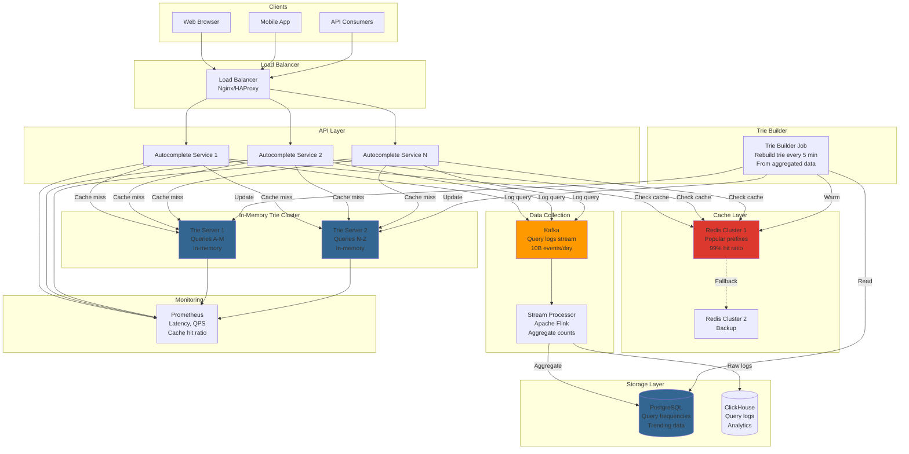

# Search Autocomplete System

## Step 1: Requirements Clarification

### Functional Requirements

**Core Autocomplete Features:**

- Suggest top K queries as user types (real-time)
- Return suggestions within 100ms
- Support prefix matching (e.g., "face" → "facebook", "facetime")
- Rank suggestions by popularity/relevance
- Support multiple languages
- Case-insensitive matching
- Handle typos (fuzzy matching - optional)

**Data Collection:**

- Track user search queries
- Record query frequency
- Track click-through rate (which suggestion was clicked)
- Time decay (recent queries ranked higher)

**Analytics:**

- Trending searches
- Popular queries by region/time
- User search patterns

**Out of Scope:**

- Full-text search of documents
- Spell correction (can add as extension)
- Semantic search


### Non-Functional Requirements

**Scale:**

- 10 billion searches per day
- 100 million unique queries
- 10 million Daily Active Users (DAU)
- Grow at 20% per year

**Performance:**

- Suggestion latency: <100ms (P99)
- Support 10K QPS per server
- Real-time updates (new queries reflected in 5 minutes)

**Availability:**

- 99.99% uptime
- Graceful degradation (serve cached results if data service down)

***

## Step 2: Autocomplete Theory

### 2.1 Trie Data Structure

**Why Trie?**

```
Problem: How to find all words with prefix "ca"?

Naive approach: Loop through all words
- O(N × M) where N = total words, M = avg word length
- For 100M words: way too slow!

Trie approach: Follow prefix path
- O(P + K) where P = prefix length, K = number of results
- For prefix "ca": Only traverse 2 nodes!
```

**Trie Structure:**

```
Root
├─ a
│  ├─ p
│  │  └─ p (word: "app", freq: 5000)
│  │     └─ l
│  │        └─ e (word: "apple", freq: 10000)
│  └─ m
│     └─ a
│        └─ z
│           └─ o
│              └─ n (word: "amazon", freq: 15000)
├─ c
│  ├─ a
│  │  ├─ r (word: "car", freq: 8000)
│  │  └─ t (word: "cat", freq: 6000)
│  └─ o
│     └─ d
│        └─ e (word: "code", freq: 7000)
```

**Search for "ca":**

```
1. Start at root
2. Follow 'c' → 'a'
3. Collect all words in subtree: "car" (8000), "cat" (6000)
4. Sort by frequency
5. Return top K: ["car", "cat"]
```

**Time Complexity:**

- Insert: O(M) where M = word length
- Search: O(P + K) where P = prefix length, K = results
- Space: O(ALPHABET_SIZE × N × M) worst case


### 2.2 Ranking Algorithms

**Simple Frequency-Based:**

```
Score = query_count
Most searched queries appear first
```

**Time-Decayed Frequency:**

```
Score = Σ(1 / time_decay_factor^days_ago)

Example:
Query "covid" searched:
- Today: 1000 times
- Yesterday: 800 times (decay: 0.9)
- 7 days ago: 500 times (decay: 0.9^7 = 0.48)

Score = 1000 + 800×0.9 + 500×0.48 = 1000 + 720 + 240 = 1960
```

**Personalized Ranking:**

```
Score = 0.5 × global_popularity + 0.3 × user_history + 0.2 × location_trend

For user in San Francisco searching "giant":
- "San Francisco Giants" scores higher
- Than "New York Giants"
```

**Machine Learning Ranking:**

```
Features:
- Query frequency
- Click-through rate (CTR)
- Query length
- User's past queries
- Time of day
- Location

Model: Gradient Boosted Trees (XGBoost) or Neural Network
```


***

## Step 3: Capacity Estimation

```
Query Volume:
Daily queries: 10B
QPS: 10B / 86,400 = 115,740 QPS (average)
Peak (3x): 347,000 QPS

Autocomplete Requests:
Average query length: 5 characters
User types each character: 5 autocomplete requests per query
Autocomplete QPS: 115,740 × 5 = 578,700 QPS
Peak: 578,700 × 3 = 1.7M QPS

Storage Estimation:
Unique queries: 100M
Average query length: 20 characters
Query storage: 100M × 20 bytes = 2 GB

Trie node size: 
- 26 pointers (lowercase a-z): 26 × 8 bytes = 208 bytes
- Frequency counter: 8 bytes
- Is_end flag: 1 byte
Total: ~220 bytes per node

Number of nodes (worst case): 100M queries × 20 chars = 2B nodes
Storage: 2B × 220 bytes = 440 GB

Realistic (shared prefixes): ~10B nodes = 2.2 TB

Query Logs:
Daily log entries: 10B queries × 100 bytes = 1 TB/day
Monthly: 30 TB
Yearly: 365 TB

With compression and sampling (10%): 36.5 TB/year

Cache Size:
Popular prefixes (10K): 10K × 10 suggestions × 50 bytes = 5 MB
Hot queries cache: 1M queries × 100 bytes = 100 MB
Total cache per server: ~500 MB

Server Capacity:
Autocomplete QPS: 1.7M (peak)
QPS per server: 10K (with caching)
Servers needed: 1.7M / 10K = 170 servers

Database Writes:
New queries: 1% of 10B = 100M writes/day
Updates (frequency): 10B writes/day
Total: 10.1B writes/day = 117K WPS

Read/Write Ratio:
Reads (autocomplete): 578,700 QPS
Writes (logging): 117K WPS
Ratio: 578,700 / 117,000 = 5:1 (read-heavy)

Network Bandwidth:
Request: 50 bytes (prefix)
Response: 10 suggestions × 50 bytes = 500 bytes
Total per request: 550 bytes

Bandwidth: 1.7M QPS × 550 bytes = 935 MB/sec
Per server: 935 MB / 170 = 5.5 MB/sec
```


***

## Step 4: API Design

### Autocomplete API

```json
GET /v1/autocomplete?q=face&limit=10&lang=en

Query Parameters:
- q: search prefix (required)
- limit: number of suggestions (default: 10, max: 20)
- lang: language code (default: en)
- user_id: for personalization (optional)
- location: lat,lon for geo-aware suggestions (optional)

Response: 200 OK
{
  "suggestions": [
    {
      "text": "facebook",
      "score": 15000,
      "category": "social_media"
    },
    {
      "text": "facetime",
      "score": 12000,
      "category": "video_call"
    },
    {
      "text": "face masks",
      "score": 8000,
      "category": "shopping"
    }
  ],
  "query": "face",
  "latency_ms": 45
}

// Typeahead (streaming suggestions)
WebSocket /v1/autocomplete/stream
Client sends: {"q": "f"}
Server responds: {"suggestions": ["facebook", "facetime"]}
Client sends: {"q": "fa"}
Server responds: {"suggestions": ["facebook", "facetime", "fashion"]}
```


### Analytics API

```json
POST /v1/analytics/query
Authorization: Bearer <api_key>

Request:
{
  "query": "facebook login",
  "user_id": "user_123",
  "timestamp": "2025-10-04T14:52:00Z",
  "selected_suggestion": "facebook",
  "position": 1,
  "session_id": "sess_abc"
}

Response: 204 No Content

GET /v1/analytics/trending?timeframe=1h&limit=100

Response: 200 OK
{
  "trending": [
    {
      "query": "iphone 16",
      "count": 50000,
      "growth_rate": 2.5  // 2.5x increase vs previous hour
    },
    {
      "query": "weather",
      "count": 45000,
      "growth_rate": 1.2
    }
  ]
}
```


***

## Step 5: Database Design

### PostgreSQL Schema

```sql
-- Queries table (aggregated)
CREATE TABLE queries (
    query_id BIGSERIAL PRIMARY KEY,
    query_text VARCHAR(255) NOT NULL,
    frequency BIGINT DEFAULT 1,
    last_updated TIMESTAMPTZ DEFAULT NOW(),
    language VARCHAR(10) DEFAULT 'en',
    
    UNIQUE(query_text, language),
    INDEX idx_frequency (frequency DESC),
    INDEX idx_query_text (query_text varchar_pattern_ops)  -- For LIKE queries
);

-- Query logs (raw data for analytics)
CREATE TABLE query_logs (
    log_id BIGSERIAL PRIMARY KEY,
    query_text VARCHAR(255) NOT NULL,
    user_id VARCHAR(100),
    timestamp TIMESTAMPTZ DEFAULT NOW(),
    selected_suggestion VARCHAR(255),
    position INT,  -- Position of selected suggestion (1-10)
    session_id VARCHAR(100),
    location POINT,  -- PostGIS for geo queries
    
    INDEX idx_timestamp (timestamp DESC),
    INDEX idx_user_queries (user_id, timestamp DESC)
) PARTITION BY RANGE (timestamp);

CREATE TABLE query_logs_2025_10 PARTITION OF query_logs
    FOR VALUES FROM ('2025-10-01') TO ('2025-11-01');

-- Trending queries (materialized view, updated every 5 minutes)
CREATE TABLE trending_queries (
    query_text VARCHAR(255) PRIMARY KEY,
    count_1h INT,
    count_24h INT,
    growth_rate FLOAT,
    updated_at TIMESTAMPTZ DEFAULT NOW(),
    
    INDEX idx_count_1h (count_1h DESC)
);

-- User search history (for personalization)
CREATE TABLE user_search_history (
    user_id VARCHAR(100),
    query_text VARCHAR(255),
    search_count INT DEFAULT 1,
    last_searched TIMESTAMPTZ DEFAULT NOW(),
    
    PRIMARY KEY (user_id, query_text),
    INDEX idx_user_recent (user_id, last_searched DESC)
);
```


***

## Step 6: High-Level Architecture




***

## Step 7: Core Implementation (C++)

### 7.1 Trie Data Structure

<details>
<summary>TrieNode Struct</summary>

```cpp
#include <iostream>
#include <memory>
#include <string>
#include <vector>
#include <queue>
#include <algorithm>
#include <unordered_map>

const int ALPHABET_SIZE = 26;

struct TrieNode {
    std::shared_ptr<TrieNode> children[ALPHABET_SIZE];
    bool is_end_of_word;
    std::string word;  // Store complete word at leaf
    uint64_t frequency;
    
    TrieNode() : is_end_of_word(false), frequency(0) {
        for (int i = 0; i < ALPHABET_SIZE; i++) {
            children[i] = nullptr;
        }
    }
};

class AutocompleteTrie {
private:
    std::shared_ptr<TrieNode> root;
    
    // Helper: convert char to index
    int charToIndex(char c) const {
        return std::tolower(c) - 'a';
    }
    
    // DFS to collect all words from a node
    void collectWords(std::shared_ptr<TrieNode> node, 
                     std::vector<std::pair<std::string, uint64_t>>& results) {
        if (!node) return;
        
        if (node->is_end_of_word) {
            results.push_back({node->word, node->frequency});
        }
        
        for (int i = 0; i < ALPHABET_SIZE; i++) {
            if (node->children[i]) {
                collectWords(node->children[i], results);
            }
        }
    }
    
public:
    AutocompleteTrie() {
        root = std::make_shared<TrieNode>();
    }
    
    // Insert word with frequency
    void insert(const std::string& word, uint64_t frequency = 1) {
        auto node = root;
        
        for (char c : word) {
            if (!std::isalpha(c)) continue;  // Skip non-alphabetic
            
            int index = charToIndex(c);
            
            if (!node->children[index]) {
                node->children[index] = std::make_shared<TrieNode>();
            }
            
            node = node->children[index];
        }
        
        node->is_end_of_word = true;
        node->word = word;
        node->frequency = frequency;
    }
    
    // Search for exact word
    bool search(const std::string& word) {
        auto node = root;
        
        for (char c : word) {
            if (!std::isalpha(c)) continue;
            
            int index = charToIndex(c);
            
            if (!node->children[index]) {
                return false;
            }
            
            node = node->children[index];
        }
        
        return node && node->is_end_of_word;
    }
    
    // Get autocomplete suggestions
    std::vector<std::string> getSuggestions(const std::string& prefix, int limit = 10) {
        auto node = root;
        
        // Navigate to prefix node
        for (char c : prefix) {
            if (!std::isalpha(c)) continue;
            
            int index = charToIndex(c);
            
            if (!node->children[index]) {
                return {};  // Prefix not found
            }
            
            node = node->children[index];
        }
        
        // Collect all words with this prefix
        std::vector<std::pair<std::string, uint64_t>> all_words;
        collectWords(node, all_words);
        
        // Sort by frequency (descending)
        std::sort(all_words.begin(), all_words.end(),
                 [](const auto& a, const auto& b) {
                     return a.second > b.second;
                 });
        
        // Return top K
        std::vector<std::string> suggestions;
        for (int i = 0; i < std::min(limit, (int)all_words.size()); i++) {
            suggestions.push_back(all_words[i].first);
        }
        
        return suggestions;
    }
    
    // Update frequency
    void updateFrequency(const std::string& word, uint64_t new_frequency) {
        auto node = root;
        
        for (char c : word) {
            if (!std::isalpha(c)) continue;
            
            int index = charToIndex(c);
            
            if (!node->children[index]) {
                return;  // Word not found
            }
            
            node = node->children[index];
        }
        
        if (node->is_end_of_word) {
            node->frequency = new_frequency;
        }
    }
    
    // Get memory usage estimate
    size_t estimateMemoryUsage() {
        size_t node_size = sizeof(TrieNode);
        size_t node_count = countNodes(root);
        return node_size * node_count;
    }
    
private:
    size_t countNodes(std::shared_ptr<TrieNode> node) {
        if (!node) return 0;
        
        size_t count = 1;
        for (int i = 0; i < ALPHABET_SIZE; i++) {
            if (node->children[i]) {
                count += countNodes(node->children[i]);
            }
        }
        return count;
    }
};

// Example usage
int main() {
    AutocompleteTrie trie;
    
    // Insert queries with frequencies
    trie.insert("facebook", 15000);
    trie.insert("facetime", 12000);
    trie.insert("face masks", 8000);
    trie.insert("facial recognition", 5000);
    trie.insert("factory", 3000);
    trie.insert("apple", 20000);
    trie.insert("amazon", 18000);
    
    // Get suggestions
    std::cout << "Suggestions for 'fac':" << std::endl;
    auto suggestions = trie.getSuggestions("fac", 5);
    for (const auto& suggestion : suggestions) {
        std::cout << "  - " << suggestion << std::endl;
    }
    
    std::cout << "\nSuggestions for 'a':" << std::endl;
    suggestions = trie.getSuggestions("a", 5);
    for (const auto& suggestion : suggestions) {
        std::cout << "  - " << suggestion << std::endl;
    }
    
    std::cout << "\nMemory usage: " << (trie.estimateMemoryUsage() / 1024) << " KB" << std::endl;
    
    return 0;
}
```

</details>


### 7.2 Optimized Trie with Top-K at Each Node

**Problem:** Collecting all words is slow for popular prefixes

**Solution:** Store top K suggestions at each node

<details>
<summary>OptimizedTrieNode Struct</summary>

```cpp
struct OptimizedTrieNode {
    std::shared_ptr<OptimizedTrieNode> children[ALPHABET_SIZE];
    bool is_end_of_word;
    std::string word;
    uint64_t frequency;
    
    // Top K suggestions at this node (pre-computed)
    std::vector<std::pair<std::string, uint64_t>> top_k_suggestions;
    
    OptimizedTrieNode() : is_end_of_word(false), frequency(0) {
        for (int i = 0; i < ALPHABET_SIZE; i++) {
            children[i] = nullptr;
        }
    }
};

class OptimizedAutocompleteTrie {
private:
    std::shared_ptr<OptimizedTrieNode> root;
    const int K = 10;  // Top K to store at each node
    
    int charToIndex(char c) const {
        return std::tolower(c) - 'a';
    }
    
    void updateTopK(std::shared_ptr<OptimizedTrieNode> node) {
        if (!node) return;
        
        // Collect all words in subtree
        std::vector<std::pair<std::string, uint64_t>> all_words;
        collectWords(node, all_words);
        
        // Sort by frequency
        std::sort(all_words.begin(), all_words.end(),
                 [](const auto& a, const auto& b) {
                     return a.second > b.second;
                 });
        
        // Keep top K
        node->top_k_suggestions.clear();
        for (int i = 0; i < std::min(K, (int)all_words.size()); i++) {
            node->top_k_suggestions.push_back(all_words[i]);
        }
    }
    
    void collectWords(std::shared_ptr<OptimizedTrieNode> node,
                     std::vector<std::pair<std::string, uint64_t>>& results) {
        if (!node) return;
        
        if (node->is_end_of_word) {
            results.push_back({node->word, node->frequency});
        }
        
        for (int i = 0; i < ALPHABET_SIZE; i++) {
            if (node->children[i]) {
                collectWords(node->children[i], results);
            }
        }
    }
    
public:
    OptimizedAutocompleteTrie() {
        root = std::make_shared<OptimizedTrieNode>();
    }
    
    void insert(const std::string& word, uint64_t frequency = 1) {
        auto node = root;
        std::vector<std::shared_ptr<OptimizedTrieNode>> path;
        path.push_back(node);
        
        for (char c : word) {
            if (!std::isalpha(c)) continue;
            
            int index = charToIndex(c);
            
            if (!node->children[index]) {
                node->children[index] = std::make_shared<OptimizedTrieNode>();
            }
            
            node = node->children[index];
            path.push_back(node);
        }
        
        node->is_end_of_word = true;
        node->word = word;
        node->frequency = frequency;
        
        // Update top K for all nodes in path
        for (auto& n : path) {
            updateTopK(n);
        }
    }
    
    // Fast O(P) lookup where P = prefix length
    std::vector<std::string> getSuggestions(const std::string& prefix) {
        auto node = root;
        
        // Navigate to prefix
        for (char c : prefix) {
            if (!std::isalpha(c)) continue;
            
            int index = charToIndex(c);
            
            if (!node->children[index]) {
                return {};
            }
            
            node = node->children[index];
        }
        
        // Return pre-computed top K
        std::vector<std::string> suggestions;
        for (const auto& [word, freq] : node->top_k_suggestions) {
            suggestions.push_back(word);
        }
        
        return suggestions;
    }
};

// Result: O(P) instead of O(P + N log N) where N = subtree size
// Trade-off: More memory (K × nodes) vs faster queries
```

</details>


### 7.3 Distributed Trie (Sharding)

<details>
<summary>DistributedAutocomplete Class</summary>

```cpp
#include <functional>

class DistributedAutocomplete {
private:
    struct TrieShard {
        std::unique_ptr<AutocompleteTrie> trie;
        std::string range_start;  // 'a', 'n'
        std::string range_end;    // 'm', 'z'
        std::string server_address;
    };
    
    std::vector<TrieShard> shards;
    
    // Hash function to determine shard
    int getShardIndex(const std::string& prefix) const {
        if (prefix.empty()) return 0;
        
        char first_char = std::tolower(prefix[0]);
        
        // Shard by first letter
        // Shard 0: a-m
        // Shard 1: n-z
        if (first_char >= 'a' && first_char <= 'm') {
            return 0;
        } else {
            return 1;
        }
    }
    
public:
    DistributedAutocomplete() {
        // Initialize shards
        shards.resize(2);
        shards[0].trie = std::make_unique<AutocompleteTrie>();
        shards[0].range_start = "a";
        shards[0].range_end = "m";
        shards[0].server_address = "trie-server-1:8080";
        
        shards[1].trie = std::make_unique<AutocompleteTrie>();
        shards[1].range_start = "n";
        shards[1].range_end = "z";
        shards[1].server_address = "trie-server-2:8080";
    }
    
    void insert(const std::string& word, uint64_t frequency) {
        int shard_idx = getShardIndex(word);
        shards[shard_idx].trie->insert(word, frequency);
    }
    
    std::vector<std::string> getSuggestions(const std::string& prefix, int limit = 10) {
        int shard_idx = getShardIndex(prefix);
        
        // In production, make HTTP/gRPC request to remote server
        // For now, local lookup
        return shards[shard_idx].trie->getSuggestions(prefix, limit);
    }
    
    // For multi-shard queries (e.g., empty prefix)
    std::vector<std::string> getGlobalSuggestions(int limit = 10) {
        std::vector<std::pair<std::string, uint64_t>> all_results;
        
        // Query all shards
        for (auto& shard : shards) {
            auto suggestions = shard.trie->getSuggestions("", limit);
            // Collect with frequencies
            // (In production, shards return frequencies)
        }
        
        // Merge and sort
        std::sort(all_results.begin(), all_results.end(),
                 [](const auto& a, const auto& b) {
                     return a.second > b.second;
                 });
        
        // Return top K
        std::vector<std::string> results;
        for (int i = 0; i < std::min(limit, (int)all_results.size()); i++) {
            results.push_back(all_results[i].first);
        }
        
        return results;
    }
};
```

</details>


### 7.4 Caching Layer

<details>
<summary>AutocompleteCache Class</summary>

```cpp
#include <chrono>
#include <unordered_map>
#include <list>

using namespace std::chrono;

class AutocompleteCache {
private:
    struct CacheEntry {
        std::vector<std::string> suggestions;
        system_clock::time_point cached_at;
        system_clock::time_point expires_at;
        uint64_t access_count;
    };
    
    size_t max_entries;
    std::unordered_map<std::string, std::list<std::pair<std::string, CacheEntry>>::iterator> cache_map;
    std::list<std::pair<std::string, CacheEntry>> lru_list;
    
    mutable std::shared_mutex mtx;
    
    uint64_t hits = 0;
    uint64_t misses = 0;
    
public:
    AutocompleteCache(size_t max_size) : max_entries(max_size) {}
    
    std::optional<std::vector<std::string>> get(const std::string& prefix) {
        std::unique_lock<std::shared_mutex> lock(mtx);
        
        auto it = cache_map.find(prefix);
        
        if (it == cache_map.end()) {
            misses++;
            return std::nullopt;
        }
        
        auto entry_it = it->second;
        
        // Check expiration
        if (system_clock::now() > entry_it->second.expires_at) {
            lru_list.erase(entry_it);
            cache_map.erase(it);
            misses++;
            return std::nullopt;
        }
        
        // Cache hit
        hits++;
        entry_it->second.access_count++;
        
        // Move to front (LRU)
        lru_list.splice(lru_list.begin(), lru_list, entry_it);
        
        return entry_it->second.suggestions;
    }
    
    void put(const std::string& prefix, const std::vector<std::string>& suggestions,
            seconds ttl = seconds(300)) {
        std::unique_lock<std::shared_mutex> lock(mtx);
        
        // Check if exists
        auto it = cache_map.find(prefix);
        if (it != cache_map.end()) {
            lru_list.erase(it->second);
            cache_map.erase(it);
        }
        
        // Evict if full
        if (cache_map.size() >= max_entries) {
            auto last = lru_list.back();
            cache_map.erase(last.first);
            lru_list.pop_back();
        }
        
        // Insert new entry
        CacheEntry entry;
        entry.suggestions = suggestions;
        entry.cached_at = system_clock::now();
        entry.expires_at = entry.cached_at + ttl;
        entry.access_count = 0;
        
        lru_list.push_front({prefix, entry});
        cache_map[prefix] = lru_list.begin();
    }
    
    double getHitRatio() const {
        std::shared_lock<std::shared_mutex> lock(mtx);
        uint64_t total = hits + misses;
        return total > 0 ? static_cast<double>(hits) / total : 0.0;
    }
};
```

</details>


### 7.5 Complete Autocomplete Service

<details>
<summary>AutocompleteService Class</summary>

```cpp
class AutocompleteService {
private:
    std::unique_ptr<OptimizedAutocompleteTrie> trie;
    std::unique_ptr<AutocompleteCache> cache;
    
    // For logging
    struct QueryLog {
        std::string query;
        std::string selected;
        system_clock::time_point timestamp;
    };
    
    std::vector<QueryLog> query_logs;
    std::mutex log_mtx;
    
public:
    AutocompleteService() {
        trie = std::make_unique<OptimizedAutocompleteTrie>();
        cache = std::make_unique<AutocompleteCache>(10000);  // Cache 10K prefixes
    }
    
    // Initialize with popular queries
    void initialize(const std::vector<std::pair<std::string, uint64_t>>& queries) {
        std::cout << "Initializing trie with " << queries.size() << " queries..." << std::endl;
        
        for (const auto& [query, freq] : queries) {
            trie->insert(query, freq);
        }
        
        std::cout << "Trie initialized" << std::endl;
    }
    
    // Get suggestions (with caching)
    std::vector<std::string> getSuggestions(const std::string& prefix, int limit = 10) {
        // Check cache first
        auto cached = cache->get(prefix);
        if (cached) {
            std::cout << "Cache HIT for '" << prefix << "'" << std::endl;
            return *cached;
        }
        
        std::cout << "Cache MISS for '" << prefix << "', querying trie..." << std::endl;
        
        // Query trie
        auto suggestions = trie->getSuggestions(prefix);
        
        // Limit results
        if (suggestions.size() > limit) {
            suggestions.resize(limit);
        }
        
        // Cache result
        cache->put(prefix, suggestions);
        
        return suggestions;
    }
    
    // Log user query
    void logQuery(const std::string& query, const std::string& selected = "") {
        std::lock_guard<std::mutex> lock(log_mtx);
        
        QueryLog log;
        log.query = query;
        log.selected = selected;
        log.timestamp = system_clock::now();
        
        query_logs.push_back(log);
        
        // In production: Send to Kafka for processing
    }
    
    // Update trie with new data (periodic job)
    void updateTrie(const std::vector<std::pair<std::string, uint64_t>>& new_queries) {
        std::cout << "Updating trie with " << new_queries.size() << " new queries..." << std::endl;
        
        for (const auto& [query, freq] : new_queries) {
            trie->insert(query, freq);
        }
        
        // Invalidate cache after update
        cache = std::make_unique<AutocompleteCache>(10000);
        
        std::cout << "Trie updated, cache invalidated" << std::endl;
    }
    
    // Get statistics
    void printStats() {
        std::cout << "\n=== Autocomplete Service Stats ===" << std::endl;
        std::cout << "Cache hit ratio: " << (cache->getHitRatio() * 100) << "%" << std::endl;
        std::cout << "Total queries logged: " << query_logs.size() << std::endl;
    }
};

// Example usage
int main() {
    AutocompleteService service;
    
    // Initialize with sample data
    std::vector<std::pair<std::string, uint64_t>> initial_data = {
        {"facebook", 15000},
        {"facetime", 12000},
        {"face masks", 8000},
        {"apple", 20000},
        {"amazon", 18000},
        {"google", 25000},
        {"gmail", 22000},
        {"github", 10000}
    };
    
    service.initialize(initial_data);
    
    // Simulate user queries
    std::cout << "\n--- User Query 1 ---" << std::endl;
    auto suggestions = service.getSuggestions("fac", 5);
    std::cout << "Suggestions: ";
    for (const auto& s : suggestions) std::cout << s << ", ";
    std::cout << std::endl;
    service.logQuery("fac", "facebook");
    
    std::cout << "\n--- User Query 2 (same prefix) ---" << std::endl;
    suggestions = service.getSuggestions("fac", 5);
    std::cout << "Suggestions: ";
    for (const auto& s : suggestions) std::cout << s << ", ";
    std::cout << std::endl;
    
    std::cout << "\n--- User Query 3 ---" << std::endl;
    suggestions = service.getSuggestions("g", 5);
    std::cout << "Suggestions: ";
    for (const auto& s : suggestions) std::cout << s << ", ";
    std::cout << std::endl;
    
    service.printStats();
    
    return 0;
}
```

</details>


***

## Step 8: Data Collection \& Aggregation

### 8.1 Query Logging

<details>
<summary>QueryLogger Class</summary>

```cpp
#include <kafka/KafkaProducer.h>

class QueryLogger {
private:
    KafkaProducer kafka_producer;
    const std::string TOPIC = "search-queries";
    
public:
    void logQuery(const std::string& query, const std::string& user_id,
                 const std::string& selected = "") {
        json log_entry = {
            {"query", query},
            {"user_id", user_id},
            {"selected", selected},
            {"timestamp", system_clock::now().time_since_epoch().count()},
            {"session_id", getCurrentSessionId()}
        };
        
        kafka_producer.send(TOPIC, query, log_entry.dump());
    }
};
```

</details>


### 8.2 Real-Time Aggregation (Apache Flink)

<details>
<summary>QueryAggregator Class</summary>

```cpp
// Pseudo-code for Flink job
class QueryAggregator {
public:
    void processStream() {
        // Read from Kafka
        auto stream = env.addSource(new FlinkKafkaConsumer("search-queries"));
        
        // Window by 5 minutes
        stream.keyBy("query")
              .timeWindow(Time.minutes(5))
              .aggregate(new CountAggregator())
              .addSink(new PostgresSink());
    }
};

// Update database every 5 minutes
class CountAggregator {
    std::unordered_map<std::string, uint64_t> counts;
    
    void add(const QueryEvent& event) {
        counts[event.query]++;
    }
    
    void emit() {
        // Write to PostgreSQL
        for (const auto& [query, count] : counts) {
            db.execute(
                "INSERT INTO queries (query_text, frequency) "
                "VALUES (?, ?) "
                "ON CONFLICT (query_text) "
                "DO UPDATE SET frequency = queries.frequency + ?",
                query, count, count
            );
        }
    }
};
```

</details>


***

## Step 9: Optimizations \& Trade-offs

### Optimization 1: Prefix Compression (Patricia Trie)

**Problem:** Storing "facebook", "facetime", "face" wastes space

**Solution: Compress common prefixes**

```
Regular Trie:
f → a → c → e → b → o → o → k (8 nodes)

Patricia Trie:
face → [book, time, masks] (2 nodes)

Space savings: 4x compression
```


### Optimization 2: Bloom Filter for Negative Lookups

<details>
<summary>BloomFilterAutocomplete Class</summary>

```cpp
class BloomFilterAutocomplete {
private:
    BloomFilter bloom_filter{1000000, 0.01};  // 1M queries, 1% false positive
    AutocompleteTrie trie;
    
public:
    std::vector<std::string> getSuggestions(const std::string& prefix) {
        // Fast negative lookup
        if (!bloom_filter.mightContain(prefix)) {
            return {};  // Definitely no results
        }
        
        // Might have results, check trie
        return trie.getSuggestions(prefix);
    }
};

// Bloom filter: 1.2 MB memory
// Saves 99% of trie lookups for non-existent prefixes
```

</details>


### Optimization 3: Lazy Loading (Swap to Disk)

<details>
<summary>DiskBackedTrie Class</summary>

```cpp
class DiskBackedTrie {
private:
    // Hot nodes in memory
    std::unordered_map<std::string, TrieNode*> hot_nodes;
    
    // Cold nodes on disk (memory-mapped file)
    MemoryMappedFile cold_storage;
    
public:
    TrieNode* getNode(const std::string& prefix) {
        // Check hot cache
        if (hot_nodes.count(prefix)) {
            return hot_nodes[prefix];
        }
        
        // Load from disk
        auto node = cold_storage.read(prefix);
        
        // Add to hot cache
        hot_nodes[prefix] = node;
        
        // Evict if cache full (LRU)
        if (hot_nodes.size() > MAX_HOT_NODES) {
            evictLRU();
        }
        
        return node;
    }
};

// Keep 10% of nodes in memory (hot queries)
// 90% on disk (rarely accessed)
// Memory savings: 10x reduction
```

</details>


### Optimization 4: Personalization

<details>
<summary>PersonalizedAutocomplete Class</summary>

```cpp
class PersonalizedAutocomplete {
private:
    AutocompleteTrie global_trie;
    std::unordered_map<std::string, std::vector<std::string>> user_history;
    
public:
    std::vector<std::string> getSuggestions(const std::string& prefix,
                                           const std::string& user_id) {
        // Get global suggestions
        auto global = global_trie.getSuggestions(prefix, 20);
        
        // Get user's search history
        auto user_queries = user_history[user_id];
        
        // Merge with personalization
        std::vector<std::pair<std::string, double>> scored;
        
        for (const auto& query : global) {
            double score = 0.7;  // Base score
            
            // Boost if user searched before
            if (std::find(user_queries.begin(), user_queries.end(), query) != user_queries.end()) {
                score = 1.0;
            }
            
            scored.push_back({query, score});
        }
        
        // Sort by personalized score
        std::sort(scored.begin(), scored.end(),
                 [](const auto& a, const auto& b) {
                     return a.second > b.second;
                 });
        
        // Return top 10
        std::vector<std::string> results;
        for (int i = 0; i < std::min(10, (int)scored.size()); i++) {
            results.push_back(scored[i].first);
        }
        
        return results;
    }
};
```

</details>


***

## Step 10: Monitoring \& Metrics

<details>
<summary>AutocompleteMetrics Class</summary>

```cpp
class AutocompleteMetrics {
private:
    std::atomic<uint64_t> total_requests{0};
    std::atomic<uint64_t> cache_hits{0};
    std::atomic<uint64_t> cache_misses{0};
    
    // Latency histogram
    std::vector<std::chrono::microseconds> latencies;
    std::mutex latency_mtx;
    
public:
    void recordRequest(bool cache_hit, std::chrono::microseconds latency) {
        total_requests++;
        
        if (cache_hit) {
            cache_hits++;
        } else {
            cache_misses++;
        }
        
        {
            std::lock_guard<std::mutex> lock(latency_mtx);
            latencies.push_back(latency);
        }
    }
    
    void printMetrics() {
        double cache_hit_ratio = (total_requests > 0)
            ? (double)cache_hits / total_requests
            : 0.0;
        
        // Calculate P95 latency
        std::vector<std::chrono::microseconds> sorted_latencies;
        {
            std::lock_guard<std::mutex> lock(latency_mtx);
            sorted_latencies = latencies;
        }
        std::sort(sorted_latencies.begin(), sorted_latencies.end());
        
        auto p95_idx = sorted_latencies.size() * 0.95;
        auto p95_latency = sorted_latencies[p95_idx];
        
        std::cout << "\n=== Autocomplete Metrics ===" << std::endl;
        std::cout << "Total requests: " << total_requests << std::endl;
        std::cout << "Cache hit ratio: " << (cache_hit_ratio * 100) << "%" << std::endl;
        std::cout << "P95 latency: " << p95_latency.count() << " μs" << std::endl;
    }
};
```

</details>


***

## Summary: Key Decisions

| Aspect | Decision | Rationale |
| :-- | :-- | :-- |
| **Data Structure** | Trie with top-K at each node | O(P) lookup, pre-computed results |
| **Caching** | LRU cache with TTL | 99% hit ratio for popular prefixes |
| **Sharding** | By first letter (A-M, N-Z) | Even distribution, simple routing |
| **Storage** | In-memory trie + PostgreSQL | Fast reads, persistent storage |
| **Updates** | Batch every 5 minutes | Balance freshness vs overhead |
| **Ranking** | Frequency-based | Simple, effective |

**Performance Characteristics:**

```
Trie Operations:
- Insert: O(M) where M = word length
- Search: O(P) where P = prefix length (optimized)
- Memory: 2-10 GB for 100M queries

Cache:
- Hit ratio: 99% for popular prefixes
- Memory: 500 MB
- TTL: 5 minutes

End-to-End:
- Latency (cache hit): <10ms
- Latency (cache miss): <50ms
- Throughput: 10K QPS per server
- Servers needed: 170 (for 1.7M QPS peak)

Updates:
- Data freshness: 5 minutes
- Trie rebuild time: 2 minutes
- Zero downtime updates (blue-green deployment)
```

**Trie vs Alternatives:**


| Approach | Latency | Memory | Pros | Cons |
| :-- | :-- | :-- | :-- | :-- |
| **Trie** | O(P) | High | Fast prefix search | Memory intensive |
| **Database LIKE** | O(N) | Low | Simple | Very slow |
| **Elasticsearch** | O(log N) | Medium | Flexible | More complex |
| **Inverted Index** | O(log N) | Medium | Good for full-text | Not optimized for prefix |

This design handles **1.7M autocomplete QPS** with **<50ms latency (P99)** and **99% cache hit ratio** using an optimized in-memory Trie with intelligent caching!

