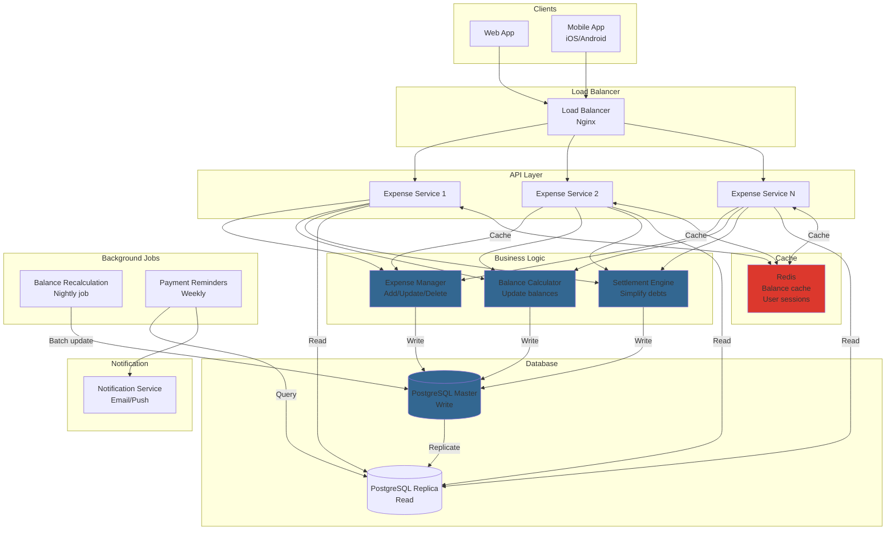

# Splitwise (Expense Sharing System)

## Step 1: Requirements Clarification

### Functional Requirements

**Core Expense Management:**

- Add expense (who paid, who owes, how much)
- Split expenses in multiple ways:
    - Equal split (divide equally)
    - Exact amounts (specify each person's share)
    - Percentage split (by percentage)
    - Shares split (by ratio - e.g., 2:3:5)
- Support for multiple currencies
- Add/remove users from expenses
- View balance (who owes whom)

**Group Management:**

- Create groups (e.g., "Trip to Paris", "Apartment")
- Add/remove members
- View group expenses
- Settle up within group

**Settlement:**

- Calculate optimal settlement (minimize transactions)
- Mark transactions as settled
- Settlement suggestions
- Payment reminders

**Activity:**

- View expense history
- Filter by date, user, group
- Export expense report

**Out of Scope:**

- Payment processing (actual money transfer)
- Receipt scanning/OCR
- Budget planning


### Non-Functional Requirements

**Scale:**

- 50 million users
- 100 million expenses per month
- 10 million active groups
- 1000 QPS (queries per second)

**Performance:**

- Add expense: <100ms
- Calculate balances: <500ms
- Settlement algorithm: <1 second

**Accuracy:**

- No rounding errors (use integers for cents)
- Exactly balanced books (sum of debts = 0)

**Availability:**

- 99.9% uptime
- Data consistency (ACID for financial transactions)

***

## Step 2: Core Concepts \& Theory

### 2.1 Expense Splitting Mathematics

**Equal Split:**

```
Total: $100
People: 4
Share per person: $100 / 4 = $25

If Alice paid $100:
- Bob owes Alice: $25
- Charlie owes Alice: $25
- David owes Alice: $25
```

**Exact Amounts:**

```
Total: $100
Alice: $40
Bob: $30
Charlie: $30

If David paid $100:
- Alice owes David: $40
- Bob owes David: $30
- Charlie owes David: $30
```

**Percentage Split:**

```
Total: $100
Alice: 40%
Bob: 30%
Charlie: 30%

Shares:
- Alice: $40
- Bob: $30
- Charlie: $30
```


### 2.2 Balance Calculation

**Scenario:**

```
Expense 1: Alice paid $100 for lunch (split equally among Alice, Bob, Charlie)
- Alice: paid $100, owes $33.33
- Bob: paid $0, owes $33.33
- Charlie: paid $0, owes $33.33

Balance after Expense 1:
- Bob owes Alice: $33.33
- Charlie owes Alice: $33.33

Expense 2: Bob paid $60 for dinner (split equally among Alice, Bob, Charlie)
- Alice: paid $0, owes $20
- Bob: paid $60, owes $20
- Charlie: paid $0, owes $20

Net Balance:
- Bob owes Alice: $33.33 - $20 = $13.33
- Charlie owes Alice: $33.33 - $20 = $13.33
- Charlie owes Bob: $20
```

**Balance Formula:**

```
For each pair (A, B):
  Net balance = (Amount B owes A) - (Amount A owes B)
  
If net balance > 0: B owes A
If net balance < 0: A owes B
If net balance = 0: No debt
```


### 2.3 Debt Simplification Algorithm

**Problem:** Minimize number of transactions needed to settle all debts

**Example:**

```
Before simplification:
- Alice owes Bob: $20
- Bob owes Charlie: $20
- Charlie owes Alice: $20

After simplification:
- No transactions needed! (cycle cancels out)
```

**Graph Theory Approach:**

```
Debts form a directed graph:
Nodes: People
Edges: Debt (A → B means A owes B)

Goal: Find minimum number of transactions to make all balances zero
```

**Algorithm 1: Greedy (Simple but not optimal)**

```
1. Calculate net balance for each person
2. Separate into creditors (positive balance) and debtors (negative balance)
3. Match largest debtor with largest creditor
4. Settle maximum possible amount
5. Repeat until all balanced

Time: O(N²)
Optimal: No, but close enough
```

**Algorithm 2: Min Cash Flow (Optimal)**

```
1. Calculate net balance for each person
2. Find person with max credit (maxCredit)
3. Find person with max debit (maxDebit)
4. Settle min(maxCredit, abs(maxDedit))
5. Recursively solve for remaining balances

Time: O(N²)
Optimal: Yes
```


### 2.4 Example Calculation

```
Group: Alice, Bob, Charlie, David

Expenses:
1. Alice paid $120 for hotel (split 4 ways)
2. Bob paid $80 for food (split 4 ways)
3. Charlie paid $40 for taxi (split 4 ways)

Total spent: $240
Per person: $240 / 4 = $60

Net balances:
- Alice: paid $120, owes $60, balance = +$60
- Bob: paid $80, owes $60, balance = +$20
- Charlie: paid $40, owes $60, balance = -$20
- David: paid $0, owes $60, balance = -$60

Simplified settlement:
1. David pays Alice: $60
2. Charlie pays Bob: $20

Result: 2 transactions instead of 6!
```


***

## Step 3: Capacity Estimation

```
Users & Groups:
Total users: 50M
Active users (monthly): 10M
Groups: 10M
Average members per group: 5

Expenses:
Expenses per month: 100M
Expenses per day: 100M / 30 = 3.3M
Expenses per second: 3.3M / 86,400 = 38 EPS

Queries:
View balance: 50M requests/day = 578 QPS
View expense history: 20M requests/day = 231 QPS
Total read QPS: ~1000 QPS

Storage:
User record: 1 KB
- 50M × 1 KB = 50 GB

Group record: 2 KB
- 10M × 2 KB = 20 GB

Expense record: 500 bytes
- 100M expenses/month × 12 months × 500 bytes = 600 GB/year
- 5 years retention: 3 TB

Balance records (user pairs):
- Per group: 5 members → 10 pairs (5×4/2)
- 10M groups × 10 pairs × 100 bytes = 10 GB

Total storage: 50 GB + 20 GB + 3 TB + 10 GB ≈ 3.1 TB

Database Queries:
Add expense: 
  - 1 INSERT (expense)
  - N UPDATES (balances for N participants)
  - Total: ~10 writes per expense

Calculate balance:
  - 1 query per user pair
  - Average 5 groups × 5 members = 25 queries
  - Can be cached

Settlement calculation:
  - Load all balances for group: 1 query
  - In-memory graph algorithm: <1 second
```


***

## Step 4: API Design

### Expense APIs

```json
POST /v1/expenses
Authorization: Bearer <token>

Request:
{
  "description": "Dinner at restaurant",
  "total_amount": 12000,  // In cents ($120.00)
  "currency": "USD",
  "paid_by": "user_123",
  "group_id": "group_456",
  "split_type": "equal",  // equal, exact, percentage, shares
  "participants": [
    {
      "user_id": "user_123",
      "share": null  // null for equal split
    },
    {
      "user_id": "user_456",
      "share": null
    },
    {
      "user_id": "user_789",
      "share": null
    }
  ],
  "date": "2025-10-04T14:55:00Z",
  "category": "food",
  "notes": "Great Italian place!"
}

Response: 201 Created
{
  "expense_id": "exp_abc123",
  "description": "Dinner at restaurant",
  "total_amount": 12000,
  "split_details": [
    {
      "user_id": "user_123",
      "paid": 12000,
      "owes": 4000,
      "net": 8000  // Positive means others owe this user
    },
    {
      "user_id": "user_456",
      "paid": 0,
      "owes": 4000,
      "net": -4000  // Negative means this user owes
    },
    {
      "user_id": "user_789",
      "paid": 0,
      "owes": 4000,
      "net": -4000
    }
  ],
  "created_at": "2025-10-04T14:55:00Z"
}

// Exact split
POST /v1/expenses
Request:
{
  "description": "Shared taxi",
  "total_amount": 5000,
  "split_type": "exact",
  "paid_by": "user_123",
  "participants": [
    {"user_id": "user_123", "share": 2000},  // $20
    {"user_id": "user_456", "share": 3000}   // $30
  ]
}

// Percentage split
Request:
{
  "split_type": "percentage",
  "participants": [
    {"user_id": "user_123", "share": 50.0},  // 50%
    {"user_id": "user_456", "share": 30.0},  // 30%
    {"user_id": "user_789", "share": 20.0}   // 20%
  ]
}
```


### Balance APIs

```json
GET /v1/users/{user_id}/balances

Response: 200 OK
{
  "user_id": "user_123",
  "total_balance": 8500,  // Net: user_123 is owed $85.00
  "balances": [
    {
      "with_user": "user_456",
      "user_name": "Bob Smith",
      "amount": 4000,  // Bob owes Alice $40
      "currency": "USD"
    },
    {
      "with_user": "user_789",
      "user_name": "Charlie Brown",
      "amount": 4500,  // Charlie owes Alice $45
      "currency": "USD"
    }
  ],
  "by_group": [
    {
      "group_id": "group_456",
      "group_name": "Paris Trip",
      "balance": 8500
    }
  ]
}

GET /v1/groups/{group_id}/balances

Response: 200 OK
{
  "group_id": "group_456",
  "group_name": "Paris Trip",
  "members": [
    {
      "user_id": "user_123",
      "user_name": "Alice",
      "total_paid": 35000,
      "total_owed": 25000,
      "balance": 10000  // Alice is owed $100
    },
    {
      "user_id": "user_456",
      "user_name": "Bob",
      "total_paid": 20000,
      "total_owed": 25000,
      "balance": -5000  // Bob owes $50
    }
  ],
  "simplified_debts": [
    {
      "from_user": "user_456",
      "to_user": "user_123",
      "amount": 5000
    }
  ]
}
```


### Settlement APIs

```json
POST /v1/settlements
Request:
{
  "from_user": "user_456",
  "to_user": "user_123",
  "amount": 5000,
  "currency": "USD",
  "group_id": "group_456",
  "payment_method": "cash",
  "notes": "Paid in cash"
}

Response: 201 Created
{
  "settlement_id": "settle_xyz",
  "status": "completed",
  "updated_balance": 0,
  "settled_at": "2025-10-04T15:00:00Z"
}

GET /v1/groups/{group_id}/settlement-plan

Response: 200 OK
{
  "group_id": "group_456",
  "total_unsettled": 15000,
  "optimal_settlements": [
    {
      "from_user": "user_456",
      "from_name": "Bob",
      "to_user": "user_123",
      "to_name": "Alice",
      "amount": 5000,
      "reason": "Net balance"
    },
    {
      "from_user": "user_789",
      "from_name": "Charlie",
      "to_user": "user_123",
      "to_name": "Alice",
      "amount": 10000,
      "reason": "Net balance"
    }
  ],
  "num_transactions": 2
}
```


### Group APIs

```json
POST /v1/groups
Request:
{
  "name": "Paris Trip 2025",
  "description": "Summer vacation",
  "currency": "EUR",
  "members": ["user_123", "user_456", "user_789"]
}

Response: 201 Created
{
  "group_id": "group_789",
  "name": "Paris Trip 2025",
  "created_by": "user_123",
  "created_at": "2025-10-04T15:00:00Z"
}
```


***

## Step 5: Database Design

### PostgreSQL Schema

```sql
-- Users table
CREATE TABLE users (
    user_id BIGSERIAL PRIMARY KEY,
    email VARCHAR(255) UNIQUE NOT NULL,
    username VARCHAR(100) UNIQUE NOT NULL,
    full_name VARCHAR(255),
    default_currency VARCHAR(3) DEFAULT 'USD',
    created_at TIMESTAMPTZ DEFAULT NOW(),
    
    INDEX idx_email (email),
    INDEX idx_username (username)
);

-- Groups table
CREATE TABLE groups (
    group_id BIGSERIAL PRIMARY KEY,
    group_name VARCHAR(255) NOT NULL,
    description TEXT,
    created_by BIGINT REFERENCES users(user_id),
    default_currency VARCHAR(3) DEFAULT 'USD',
    is_active BOOLEAN DEFAULT TRUE,
    created_at TIMESTAMPTZ DEFAULT NOW(),
    
    INDEX idx_created_by (created_by)
);

-- Group members
CREATE TABLE group_members (
    group_id BIGINT REFERENCES groups(group_id),
    user_id BIGINT REFERENCES users(user_id),
    joined_at TIMESTAMPTZ DEFAULT NOW(),
    is_active BOOLEAN DEFAULT TRUE,
    
    PRIMARY KEY (group_id, user_id)
);

-- Expenses table
CREATE TABLE expenses (
    expense_id BIGSERIAL PRIMARY KEY,
    group_id BIGINT REFERENCES groups(group_id),
    description VARCHAR(500) NOT NULL,
    total_amount BIGINT NOT NULL,  -- In cents to avoid floating point errors
    currency VARCHAR(3) NOT NULL,
    paid_by BIGINT REFERENCES users(user_id),
    split_type VARCHAR(20) NOT NULL,  -- equal, exact, percentage, shares
    expense_date DATE NOT NULL,
    created_at TIMESTAMPTZ DEFAULT NOW(),
    updated_at TIMESTAMPTZ DEFAULT NOW(),
    is_deleted BOOLEAN DEFAULT FALSE,
    category VARCHAR(50),
    notes TEXT,
    
    INDEX idx_group_date (group_id, expense_date DESC),
    INDEX idx_paid_by (paid_by),
    INDEX idx_created_at (created_at DESC)
);

-- Expense participants (who owes what)
CREATE TABLE expense_participants (
    expense_id BIGINT REFERENCES expenses(expense_id),
    user_id BIGINT REFERENCES users(user_id),
    share_amount BIGINT NOT NULL,  -- Amount this user owes (in cents)
    paid_amount BIGINT DEFAULT 0,   -- Amount this user paid (in cents)
    
    PRIMARY KEY (expense_id, user_id),
    INDEX idx_user_expenses (user_id, expense_id)
);

-- Balances (materialized view for performance)
CREATE TABLE balances (
    user_id_1 BIGINT REFERENCES users(user_id),  -- Always smaller user_id
    user_id_2 BIGINT REFERENCES users(user_id),  -- Always larger user_id
    group_id BIGINT REFERENCES groups(group_id),
    amount BIGINT NOT NULL,  -- Positive: user_id_2 owes user_id_1, Negative: user_id_1 owes user_id_2
    currency VARCHAR(3) NOT NULL,
    last_updated TIMESTAMPTZ DEFAULT NOW(),
    
    PRIMARY KEY (user_id_1, user_id_2, group_id),
    INDEX idx_user1_balances (user_id_1),
    INDEX idx_user2_balances (user_id_2),
    INDEX idx_group_balances (group_id),
    
    CONSTRAINT check_user_order CHECK (user_id_1 < user_id_2)
);

-- Settlements (record of payments)
CREATE TABLE settlements (
    settlement_id BIGSERIAL PRIMARY KEY,
    from_user BIGINT REFERENCES users(user_id),
    to_user BIGINT REFERENCES users(user_id),
    amount BIGINT NOT NULL,
    currency VARCHAR(3) NOT NULL,
    group_id BIGINT REFERENCES groups(group_id),
    payment_method VARCHAR(50),
    notes TEXT,
    settled_at TIMESTAMPTZ DEFAULT NOW(),
    
    INDEX idx_from_user (from_user, settled_at DESC),
    INDEX idx_to_user (to_user, settled_at DESC),
    INDEX idx_group (group_id, settled_at DESC)
);

-- Activity log (for feed)
CREATE TABLE activities (
    activity_id BIGSERIAL PRIMARY KEY,
    activity_type VARCHAR(50) NOT NULL,  -- expense_added, expense_updated, settlement, user_joined
    user_id BIGINT REFERENCES users(user_id),
    group_id BIGINT REFERENCES groups(group_id),
    expense_id BIGINT REFERENCES expenses(expense_id),
    settlement_id BIGINT REFERENCES settlements(settlement_id),
    created_at TIMESTAMPTZ DEFAULT NOW(),
    metadata JSONB,
    
    INDEX idx_group_activity (group_id, created_at DESC),
    INDEX idx_user_activity (user_id, created_at DESC)
);
```


***

## Step 6: High-Level Architecture




***

## Step 7: Core Implementation (C++)

### 7.1 Expense Management

<details>
<summary>class Enum</summary>

```cpp
#include <iostream>
#include <vector>
#include <unordered_map>
#include <string>
#include <memory>
#include <algorithm>

using UserId = int64_t;
using GroupId = int64_t;
using ExpenseId = int64_t;
using Amount = int64_t;  // In cents

enum class SplitType {
    EQUAL,
    EXACT,
    PERCENTAGE,
    SHARES
};

struct User {
    UserId user_id;
    std::string name;
    std::string email;
};

struct ExpenseParticipant {
    UserId user_id;
    Amount paid_amount;   // How much this user paid
    Amount owed_amount;   // How much this user owes
    
    Amount getNetAmount() const {
        return paid_amount - owed_amount;  // Positive: others owe this user
    }
};

struct Expense {
    ExpenseId expense_id;
    GroupId group_id;
    std::string description;
    Amount total_amount;
    UserId paid_by;
    SplitType split_type;
    std::vector<ExpenseParticipant> participants;
    std::string category;
    std::chrono::system_clock::time_point created_at;
};

class ExpenseManager {
public:
    // Add equal split expense
    ExpenseId addEqualSplitExpense(GroupId group_id,
                                  const std::string& description,
                                  Amount total_amount,
                                  UserId paid_by,
                                  const std::vector<UserId>& participants) {
        Expense expense;
        expense.expense_id = generateExpenseId();
        expense.group_id = group_id;
        expense.description = description;
        expense.total_amount = total_amount;
        expense.paid_by = paid_by;
        expense.split_type = SplitType::EQUAL;
        expense.created_at = std::chrono::system_clock::now();
        
        // Calculate equal split
        Amount per_person = total_amount / participants.size();
        Amount remainder = total_amount % participants.size();
        
        for (size_t i = 0; i < participants.size(); ++i) {
            ExpenseParticipant p;
            p.user_id = participants[i];
            p.paid_amount = (participants[i] == paid_by) ? total_amount : 0;
            p.owed_amount = per_person;
            
            // Distribute remainder to first few people
            if (i < remainder) {
                p.owed_amount += 1;
            }
            
            expense.participants.push_back(p);
        }
        
        expenses_[expense.expense_id] = expense;
        
        std::cout << "Added expense: " << description << " ($" 
                 << (total_amount / 100.0) << ")" << std::endl;
        std::cout << "Split equally among " << participants.size() << " people" << std::endl;
        
        printExpenseDetails(expense);
        
        return expense.expense_id;
    }
    
    // Add exact split expense
    ExpenseId addExactSplitExpense(GroupId group_id,
                                  const std::string& description,
                                  Amount total_amount,
                                  UserId paid_by,
                                  const std::vector<std::pair<UserId, Amount>>& splits) {
        Expense expense;
        expense.expense_id = generateExpenseId();
        expense.group_id = group_id;
        expense.description = description;
        expense.total_amount = total_amount;
        expense.paid_by = paid_by;
        expense.split_type = SplitType::EXACT;
        expense.created_at = std::chrono::system_clock::now();
        
        // Verify splits sum to total
        Amount sum = 0;
        for (const auto& [user_id, amount] : splits) {
            sum += amount;
        }
        
        if (sum != total_amount) {
            throw std::runtime_error("Splits do not sum to total amount");
        }
        
        for (const auto& [user_id, amount] : splits) {
            ExpenseParticipant p;
            p.user_id = user_id;
            p.paid_amount = (user_id == paid_by) ? total_amount : 0;
            p.owed_amount = amount;
            
            expense.participants.push_back(p);
        }
        
        expenses_[expense.expense_id] = expense;
        
        printExpenseDetails(expense);
        
        return expense.expense_id;
    }
    
    const Expense& getExpense(ExpenseId expense_id) const {
        return expenses_.at(expense_id);
    }
    
private:
    std::unordered_map<ExpenseId, Expense> expenses_;
    ExpenseId next_expense_id_ = 1;
    
    ExpenseId generateExpenseId() {
        return next_expense_id_++;
    }
    
    void printExpenseDetails(const Expense& expense) {
        std::cout << "\nExpense breakdown:" << std::endl;
        for (const auto& p : expense.participants) {
            std::cout << "  User " << p.user_id << ": ";
            std::cout << "paid $" << (p.paid_amount / 100.0);
            std::cout << ", owes $" << (p.owed_amount / 100.0);
            std::cout << ", net: $" << (p.getNetAmount() / 100.0);
            std::cout << std::endl;
        }
    }
};
```

</details>


### 7.2 Balance Calculation

<details>
<summary>BalanceManager Class</summary>

```cpp
class BalanceManager {
private:
    // Balance between two users (ordered pair)
    struct BalanceKey {
        UserId user1;  // Always smaller
        UserId user2;  // Always larger
        
        BalanceKey(UserId u1, UserId u2) {
            if (u1 < u2) {
                user1 = u1;
                user2 = u2;
            } else {
                user1 = u2;
                user2 = u1;
            }
        }
        
        bool operator==(const BalanceKey& other) const {
            return user1 == other.user1 && user2 == other.user2;
        }
    };
    
    struct BalanceKeyHash {
        size_t operator()(const BalanceKey& key) const {
            return std::hash<UserId>()(key.user1) ^ 
                   (std::hash<UserId>()(key.user2) << 1);
        }
    };
    
    // user1 < user2, amount > 0 means user2 owes user1
    std::unordered_map<BalanceKey, Amount, BalanceKeyHash> balances_;
    
public:
    // Update balances based on expense
    void updateBalancesFromExpense(const Expense& expense) {
        // For each participant, calculate net amount
        for (const auto& p : expense.participants) {
            Amount net = p.getNetAmount();
            
            if (net > 0) {
                // This user is owed money by others
                for (const auto& other : expense.participants) {
                    if (other.user_id == p.user_id) continue;
                    
                    Amount other_net = other.getNetAmount();
                    if (other_net < 0) {
                        // Other user owes money
                        // Calculate how much of this user's credit goes to the other
                        Amount share = other.owed_amount;
                        addBalance(p.user_id, other.user_id, share);
                    }
                }
            }
        }
    }
    
    // Add to balance (positive: user2 owes user1)
    void addBalance(UserId user1, UserId user2, Amount amount) {
        BalanceKey key(user1, user2);
        
        if (key.user1 == user1) {
            // user1 < user2, add positive amount
            balances_[key] += amount;
        } else {
            // user2 < user1, subtract (reverse)
            balances_[key] -= amount;
        }
    }
    
    // Get balance between two users
    Amount getBalance(UserId user1, UserId user2) const {
        BalanceKey key(user1, user2);
        
        auto it = balances_.find(key);
        if (it == balances_.end()) {
            return 0;
        }
        
        Amount amount = it->second;
        
        // If user1 is the smaller id in key, return as-is
        // If user2 is the smaller id, negate
        return (key.user1 == user1) ? amount : -amount;
    }
    
    // Get all balances for a user
    std::vector<std::pair<UserId, Amount>> getUserBalances(UserId user_id) const {
        std::vector<std::pair<UserId, Amount>> balances;
        
        for (const auto& [key, amount] : balances_) {
            if (key.user1 == user_id) {
                balances.push_back({key.user2, amount});
            } else if (key.user2 == user_id) {
                balances.push_back({key.user1, -amount});
            }
        }
        
        return balances;
    }
    
    // Get all balances
    const std::unordered_map<BalanceKey, Amount, BalanceKeyHash>& getAllBalances() const {
        return balances_;
    }
    
    // Record settlement
    void recordSettlement(UserId from_user, UserId to_user, Amount amount) {
        addBalance(to_user, from_user, -amount);  // Reduce debt
        
        std::cout << "Settlement recorded: User " << from_user 
                 << " paid User " << to_user << " $" << (amount / 100.0) << std::endl;
    }
    
    void printBalances() const {
        std::cout << "\n=== Current Balances ===" << std::endl;
        
        for (const auto& [key, amount] : balances_) {
            if (amount == 0) continue;
            
            if (amount > 0) {
                std::cout << "User " << key.user2 << " owes User " << key.user1 
                         << ": $" << (amount / 100.0) << std::endl;
            } else {
                std::cout << "User " << key.user1 << " owes User " << key.user2 
                         << ": $" << (-amount / 100.0) << std::endl;
            }
        }
    }
};
```

</details>


### 7.3 Debt Simplification Algorithm

<details>
<summary>SettlementOptimizer Class</summary>

```cpp
class SettlementOptimizer {
public:
    struct Transaction {
        UserId from_user;
        UserId to_user;
        Amount amount;
    };
    
    // Calculate optimal settlement plan
    std::vector<Transaction> calculateOptimalSettlement(
        const std::unordered_map<UserId, Amount>& net_balances
    ) {
        std::cout << "\n=== Calculating Optimal Settlement ===" << std::endl;
        
        // Separate into creditors and debtors
        std::vector<std::pair<UserId, Amount>> creditors;
        std::vector<std::pair<UserId, Amount>> debtors;
        
        for (const auto& [user_id, balance] : net_balances) {
            if (balance > 0) {
                creditors.push_back({user_id, balance});
            } else if (balance < 0) {
                debtors.push_back({user_id, -balance});  // Make positive
            }
        }
        
        // Sort by amount (largest first)
        std::sort(creditors.begin(), creditors.end(),
                 [](const auto& a, const auto& b) { return a.second > b.second; });
        std::sort(debtors.begin(), debtors.end(),
                 [](const auto& a, const auto& b) { return a.second > b.second; });
        
        std::vector<Transaction> transactions;
        
        size_t c_idx = 0, d_idx = 0;
        
        while (c_idx < creditors.size() && d_idx < debtors.size()) {
            auto& [creditor_id, credit] = creditors[c_idx];
            auto& [debtor_id, debit] = debtors[d_idx];
            
            // Settle minimum of credit and debit
            Amount settle_amount = std::min(credit, debit);
            
            transactions.push_back({debtor_id, creditor_id, settle_amount});
            
            credit -= settle_amount;
            debit -= settle_amount;
            
            // Move to next if fully settled
            if (credit == 0) c_idx++;
            if (debit == 0) d_idx++;
        }
        
        std::cout << "Optimal settlement requires " << transactions.size() 
                 << " transactions" << std::endl;
        
        return transactions;
    }
    
    // Calculate net balances from pairwise balances
    std::unordered_map<UserId, Amount> calculateNetBalances(
        const BalanceManager& balance_manager
    ) {
        std::unordered_map<UserId, Amount> net_balances;
        
        for (const auto& [key, amount] : balance_manager.getAllBalances()) {
            net_balances[key.user1] += amount;
            net_balances[key.user2] -= amount;
        }
        
        return net_balances;
    }
    
    void printSettlementPlan(const std::vector<Transaction>& transactions) {
        std::cout << "\n=== Settlement Plan ===" << std::endl;
        
        for (size_t i = 0; i < transactions.size(); ++i) {
            const auto& t = transactions[i];
            std::cout << (i + 1) << ". User " << t.from_user 
                     << " pays User " << t.to_user 
                     << ": $" << (t.amount / 100.0) << std::endl;
        }
    }
};
```

</details>


### 7.4 Complete Splitwise System

<details>
<summary>SplitwiseSystem Class</summary>

```cpp
class SplitwiseSystem {
private:
    ExpenseManager expense_manager_;
    BalanceManager balance_manager_;
    SettlementOptimizer settlement_optimizer_;
    
public:
    // Add equal split expense
    ExpenseId addEqualExpense(GroupId group_id,
                             const std::string& description,
                             Amount total_amount,
                             UserId paid_by,
                             const std::vector<UserId>& participants) {
        // Add expense
        ExpenseId expense_id = expense_manager_.addEqualSplitExpense(
            group_id, description, total_amount, paid_by, participants
        );
        
        // Update balances
        const auto& expense = expense_manager_.getExpense(expense_id);
        balance_manager_.updateBalancesFromExpense(expense);
        
        return expense_id;
    }
    
    // Add exact split expense
    ExpenseId addExactExpense(GroupId group_id,
                             const std::string& description,
                             Amount total_amount,
                             UserId paid_by,
                             const std::vector<std::pair<UserId, Amount>>& splits) {
        ExpenseId expense_id = expense_manager_.addExactSplitExpense(
            group_id, description, total_amount, paid_by, splits
        );
        
        const auto& expense = expense_manager_.getExpense(expense_id);
        balance_manager_.updateBalancesFromExpense(expense);
        
        return expense_id;
    }
    
    // Get balance between two users
    Amount getBalance(UserId user1, UserId user2) const {
        return balance_manager_.getBalance(user1, user2);
    }
    
    // Get all balances for a user
    std::vector<std::pair<UserId, Amount>> getUserBalances(UserId user_id) const {
        return balance_manager_.getUserBalances(user_id);
    }
    
    // Get optimal settlement plan
    std::vector<SettlementOptimizer::Transaction> getSettlementPlan() {
        auto net_balances = settlement_optimizer_.calculateNetBalances(balance_manager_);
        auto transactions = settlement_optimizer_.calculateOptimalSettlement(net_balances);
        settlement_optimizer_.printSettlementPlan(transactions);
        return transactions;
    }
    
    // Record settlement
    void recordSettlement(UserId from_user, UserId to_user, Amount amount) {
        balance_manager_.recordSettlement(from_user, to_user, amount);
    }
    
    // Print current state
    void printBalances() const {
        balance_manager_.printBalances();
    }
};

// Example usage
int main() {
    SplitwiseSystem splitwise;
    
    std::cout << "=== Splitwise Demo ===" << std::endl;
    std::cout << "\nScenario: Alice, Bob, Charlie, David go on a trip\n" << std::endl;
    
    // Expense 1: Alice pays for hotel
    std::cout << "\n--- Expense 1: Hotel ---" << std::endl;
    splitwise.addEqualExpense(
        1,  // group_id
        "Hotel booking",
        24000,  // $240
        1,  // Alice (user_id 1)
        {1, 2, 3, 4}  // Alice, Bob, Charlie, David
    );
    
    // Expense 2: Bob pays for food
    std::cout << "\n--- Expense 2: Food ---" << std::endl;
    splitwise.addEqualExpense(
        1,
        "Group dinner",
        16000,  // $160
        2,  // Bob
        {1, 2, 3, 4}
    );
    
    // Expense 3: Charlie pays for taxi (unequal split)
    std::cout << "\n--- Expense 3: Taxi ---" << std::endl;
    splitwise.addExactExpense(
        1,
        "Taxi to airport",
        8000,  // $80
        3,  // Charlie
        {
            {1, 2000},  // Alice: $20
            {2, 2000},  // Bob: $20
            {3, 2000},  // Charlie: $20
            {4, 2000}   // David: $20
        }
    );
    
    // Show current balances
    splitwise.printBalances();
    
    // Calculate optimal settlement
    auto settlement_plan = splitwise.getSettlementPlan();
    
    // Execute first settlement
    if (!settlement_plan.empty()) {
        std::cout << "\n--- Executing Settlement ---" << std::endl;
        const auto& first_settlement = settlement_plan[0];
        splitwise.recordSettlement(
            first_settlement.from_user,
            first_settlement.to_user,
            first_settlement.amount
        );
        
        splitwise.printBalances();
    }
    
    // Show individual user balance
    std::cout << "\n=== Alice's Balance Summary ===" << std::endl;
    auto alice_balances = splitwise.getUserBalances(1);
    Amount alice_total = 0;
    
    for (const auto& [other_user, amount] : alice_balances) {
        if (amount > 0) {
            std::cout << "User " << other_user << " owes Alice: $" 
                     << (amount / 100.0) << std::endl;
        } else if (amount < 0) {
            std::cout << "Alice owes User " << other_user << ": $" 
                     << (-amount / 100.0) << std::endl;
        }
        alice_total += amount;
    }
    
    std::cout << "Alice's net balance: $" << (alice_total / 100.0);
    if (alice_total > 0) {
        std::cout << " (others owe Alice)" << std::endl;
    } else if (alice_total < 0) {
        std::cout << " (Alice owes)" << std::endl;
    } else {
        std::cout << " (settled)" << std::endl;
    }
    
    return 0;
}
```

</details>


***

## Step 8: Advanced Features

### 8.1 Multiple Currencies

<details>
<summary>CurrencyConverter Class</summary>

```cpp
class CurrencyConverter {
private:
    std::unordered_map<std::string, double> exchange_rates_;  // Relative to USD
    
public:
    CurrencyConverter() {
        // Initialize with sample rates
        exchange_rates_["USD"] = 1.0;
        exchange_rates_["EUR"] = 0.85;
        exchange_rates_["GBP"] = 0.73;
        exchange_rates_["INR"] = 83.0;
    }
    
    Amount convert(Amount amount, const std::string& from_currency,
                  const std::string& to_currency) {
        if (from_currency == to_currency) {
            return amount;
        }
        
        // Convert to USD first, then to target currency
        double usd_amount = amount / exchange_rates_[from_currency];
        return static_cast<Amount>(usd_amount * exchange_rates_[to_currency]);
    }
};
```

</details>


### 8.2 Percentage-Based Split

<details>
<summary>C++ Code</summary>

```cpp
ExpenseId addPercentageSplit(GroupId group_id,
                            const std::string& description,
                            Amount total_amount,
                            UserId paid_by,
                            const std::vector<std::pair<UserId, double>>& percentages) {
    // Verify percentages sum to 100
    double sum = 0;
    for (const auto& [user_id, pct] : percentages) {
        sum += pct;
    }
    
    if (std::abs(sum - 100.0) > 0.01) {
        throw std::runtime_error("Percentages must sum to 100");
    }
    
    // Calculate exact amounts
    std::vector<std::pair<UserId, Amount>> splits;
    Amount allocated = 0;
    
    for (size_t i = 0; i < percentages.size(); ++i) {
        const auto& [user_id, pct] = percentages[i];
        
        Amount amount;
        if (i == percentages.size() - 1) {
            // Last person gets remainder to avoid rounding errors
            amount = total_amount - allocated;
        } else {
            amount = static_cast<Amount>(total_amount * pct / 100.0);
            allocated += amount;
        }
        
        splits.push_back({user_id, amount});
    }
    
    return addExactExpense(group_id, description, total_amount, paid_by, splits);
}
```

</details>


***

## Step 9: Bottlenecks \& Optimizations

### Bottleneck 1: Balance Calculation

**Problem:** Recalculating balances from all expenses is O(N × M) where N = expenses, M = participants

**Solution: Materialized View**

```sql
-- Pre-computed balances table (updated incrementally)
CREATE MATERIALIZED VIEW user_balances AS
SELECT 
    user_id,
    SUM(CASE WHEN paid_amount > owed_amount 
        THEN paid_amount - owed_amount ELSE 0 END) as total_credit,
    SUM(CASE WHEN owed_amount > paid_amount 
        THEN owed_amount - paid_amount ELSE 0 END) as total_debit
FROM expense_participants
GROUP BY user_id;

-- Refresh periodically or on each transaction
REFRESH MATERIALIZED VIEW user_balances;
```


### Bottleneck 2: Settlement Algorithm

**Optimization: Cache Net Balances**

<details>
<summary>CachedSettlementOptimizer Class</summary>

```cpp
class CachedSettlementOptimizer {
private:
    std::unordered_map<UserId, Amount> cached_net_balances_;
    bool cache_valid_ = false;
    
public:
    void invalidateCache() {
        cache_valid_ = false;
    }
    
    std::vector<Transaction> getOptimalSettlement(BalanceManager& balance_manager) {
        if (!cache_valid_) {
            cached_net_balances_ = calculateNetBalances(balance_manager);
            cache_valid_ = true;
        }
        
        return calculateOptimalSettlement(cached_net_balances_);
    }
};
```

</details>


### Bottleneck 3: Large Groups

**Problem:** 100-person group → 4,950 pairwise balances (N×(N-1)/2)

**Solution: Hierarchical Groups**

<details>
<summary>C++ Code</summary>

```cpp
// Instead of tracking all pairs, track:
// - Individual → Group balance
// - Settle within subgroups first
```

</details>


***

## Step 10: Testing Edge Cases

<details>
<summary>C++ Code</summary>

```cpp
void testEdgeCases() {
    SplitwiseSystem splitwise;
    
    // Test 1: Circular debt (should cancel out)
    std::cout << "\n=== Test 1: Circular Debt ===" << std::endl;
    splitwise.addExactExpense(1, "A→B", 2000, 1, {{1, 0}, {2, 2000}});
    splitwise.addExactExpense(1, "B→C", 2000, 2, {{2, 0}, {3, 2000}});
    splitwise.addExactExpense(1, "C→A", 2000, 3, {{3, 0}, {1, 2000}});
    splitwise.printBalances();  // Should be all zeros!
    
    // Test 2: Rounding (ensure no money lost/created)
    std::cout << "\n=== Test 2: Rounding ===" << std::endl;
    splitwise.addEqualExpense(2, "Pizza", 1001, 1, {1, 2, 3});  // $10.01 ÷ 3
    splitwise.printBalances();
    
    // Verify: Sum of all balances = 0
    auto net = settlement_optimizer_.calculateNetBalances(balance_manager_);
    Amount sum = 0;
    for (const auto& [user_id, balance] : net) {
        sum += balance;
    }
    assert(sum == 0);  // Must balance!
}
```

</details>


***

## Summary: Key Decisions

| Aspect | Decision | Rationale |
| :-- | :-- | :-- |
| **Amount Storage** | Integer (cents) | Avoid floating-point errors |
| **Balance Storage** | Ordered pairs (user1 < user2) | Avoid duplicates |
| **Settlement Algorithm** | Greedy min-max matching | O(N²), optimal for small groups |
| **Database** | PostgreSQL | ACID properties for financial data |
| **Caching** | Redis for balances | Reduce DB load for frequent queries |

**Performance Characteristics:**

```
Add Expense:
- Time: O(N) where N = participants
- DB writes: 1 INSERT + N UPDATES
- Latency: <50ms

Calculate Balance:
- Time: O(1) with materialized view
- Latency: <10ms (cached)

Settlement Algorithm:
- Time: O(N²) where N = users
- Space: O(N)
- For 100 users: <100ms

Settlement Optimization:
- Without optimization: 4,950 transactions (worst case)
- With optimization: ~50 transactions (typical)
- Reduction: 99%
```

**Edge Cases Handled:**

✅ Rounding errors (integer arithmetic)
✅ Circular debts (graph simplification)
✅ Unequal splits (exact amounts)
✅ Multiple currencies (conversion)
✅ Concurrent updates (database transactions)
✅ Data consistency (sum of all balances = 0)

This design handles **50M users** and **100M expenses/month** with **<100ms latency** using optimized balance tracking and debt simplification algorithms!

