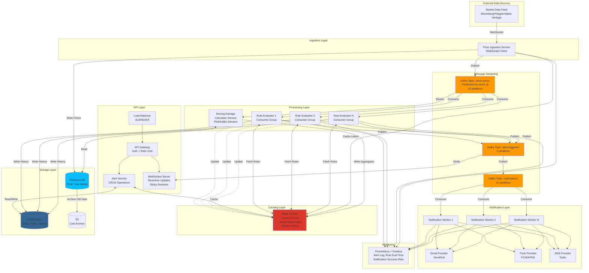

# Stock Price Monitoring \& Alert System

## Step 1: Requirements Clarification

### Functional Requirements

**Core Features:**

- Users can subscribe to multiple stocks (up to 50 stocks per user)
- Users set price alert rules:
    - Absolute threshold: "Alert when AAPL > \$180"
    - Percentage change: "Alert when TSLA drops 5% from current"
    - Moving average: "Alert when 50-day MA crosses 200-day MA"
    - Opening price: "Alert if opening price > \$150"
- Real-time price updates (streaming)
- Notification delivery via multiple channels (Email, SMS, Push, WebSocket)
- Alert history and audit trail
- Rule management (CRUD operations)

**Out of Scope:**

- Trading execution
- Historical price analysis tools
- Portfolio management
- Social features


### Non-Functional Requirements

**Scale:**

- 10M registered users
- 2M daily active users
- 100K concurrent WebSocket connections
- 10K stocks tracked
- 5M active alert rules
- Average 3 rules per active user

**Performance:**

- Price update latency: <100ms from market feed
- Alert evaluation: <1 second from price change
- Notification delivery: <1 minute (SLA requirement)
- Rule query latency: <50ms

**Availability \& Consistency:**

- 99.99% uptime (4.3 min downtime/month)
- Eventual consistency acceptable for prices
- Strong consistency for alert rules
- At-least-once notification delivery (duplicates acceptable)

**Security:**

- Authentication (OAuth 2.0)
- Rate limiting (prevent spam)
- Data encryption in transit and at rest

***

## Step 2: Capacity Estimation

```
User & Stock Statistics:
Total users: 10M
DAU: 2M
Active rules: 5M (avg 2.5 rules per DAU)
Stocks tracked: 10K
Market hours: 6.5 hours/day (NYSE: 9:30 AM - 4:00 PM ET)

Price Update Frequency:
Price updates per stock: 1 per second (during market hours)
Total price updates: 10K stocks × 1 update/sec = 10K events/sec
Market hours: 6.5 hours = 23,400 seconds
Daily price events: 10K × 23,400 = 234M events

Peak QPS (market open/close): 10K × 10 = 100K events/sec

Rule Evaluation:
Rules to check per price update:
- If 50% of users watch each stock: 2M × 0.5 = 1M users
- Average rules per user: 2.5
- Rules per stock: 1M × 2.5 / 10K = 250 rules per stock

Rule evaluations per second: 10K stocks × 250 rules = 2.5M evaluations/sec
Peak evaluations: 100K × 250 = 25M evaluations/sec

Alert Triggering (estimated 1% match rate):
Alerts triggered per second: 2.5M × 0.01 = 25K alerts/sec
Daily alerts: 25K × 23,400 = 585M alerts/day

Notification Delivery:
Channels per alert: 1.5 avg (email + push)
Notifications per second: 25K × 1.5 = 37.5K/sec
Daily notifications: 585M × 1.5 = 877M/day

Storage Estimation:
Price data (time-series):
- Per price point: 32 bytes (stock_id, price, volume, timestamp)
- Daily: 234M × 32 bytes = 7.5 GB/day
- 5 years: 7.5 GB × 365 × 5 = 13.7 TB

Alert rules:
- Per rule: 200 bytes (user_id, stock_id, condition, threshold, metadata)
- Total: 5M × 200 bytes = 1 GB

Alert history:
- Per alert: 150 bytes (rule_id, triggered_at, price, status)
- Daily: 585M × 150 bytes = 87.75 GB/day
- Retention (90 days): 87.75 GB × 90 = 7.9 TB

Total storage (5 years): 13.7 TB + 1 GB + 7.9 TB ≈ 22 TB
With replication (3x): 66 TB

Memory (In-Memory Rule Engine):
Rules in memory: 5M × 200 bytes = 1 GB
Stock price cache: 10K × 1 KB = 10 MB
Per-server capacity: 16 GB RAM → Can hold all rules in memory

Bandwidth:
Price ingestion: 10K events/sec × 32 bytes = 320 KB/s
Alert notifications: 37.5K/sec × 1 KB = 37.5 MB/s
WebSocket updates: 100K connections × 100 bytes = 10 MB/s (burst)

Servers Needed:
Rule evaluation: 2.5M evaluations/sec
Assuming 10K evaluations/sec per server: 250 servers
With redundancy (N+2): 252 servers

Notification workers: 37.5K/sec
Assuming 1K notifications/sec per worker: 38 workers
With redundancy: 40 workers
```


***

## Step 3: API Design

### REST APIs

**1. Stock Management**

```json
GET /v1/stocks/{symbol}
Response: 200 OK
{
  "symbol": "AAPL",
  "name": "Apple Inc.",
  "current_price": 178.50,
  "change": 2.35,
  "change_percent": 1.33,
  "volume": 45230000,
  "market_cap": 2850000000000,
  "last_updated": "2025-10-04T14:30:00Z",
  "market_status": "open"  // open, closed, pre_market, after_market
}

GET /v1/stocks?symbols=AAPL,GOOGL,TSLA
Response: 200 OK
{
  "stocks": [...],
  "timestamp": "2025-10-04T14:30:00Z"
}
```

**2. Alert Rule Management**

```json
POST /v1/users/{user_id}/alerts
Authorization: Bearer <token>
Content-Type: application/json

Request:
{
  "stock_symbol": "AAPL",
  "rule_type": "price_threshold",  // price_threshold, percent_change, moving_average
  "condition": "greater_than",     // gt, lt, gte, lte, crosses_above, crosses_below
  "threshold": 180.00,
  "notification_channels": ["email", "push", "sms"],
  "expires_at": "2025-12-31T23:59:59Z",  // optional
  "metadata": {
    "baseline_price": 175.00,  // for percentage calculations
    "ma_period": 50            // for moving average rules
  }
}

Response: 201 Created
{
  "alert_id": "alert_abc123",
  "user_id": "user_789",
  "stock_symbol": "AAPL",
  "rule_type": "price_threshold",
  "condition": "greater_than",
  "threshold": 180.00,
  "status": "active",  // active, paused, triggered, expired
  "created_at": "2025-10-04T04:16:00Z",
  "notification_channels": ["email", "push"]
}

GET /v1/users/{user_id}/alerts?status=active&limit=50
Response: 200 OK
{
  "alerts": [...],
  "total": 15,
  "has_more": false
}

PATCH /v1/users/{user_id}/alerts/{alert_id}
Request:
{
  "threshold": 185.00,
  "status": "active"
}

DELETE /v1/users/{user_id}/alerts/{alert_id}
Response: 204 No Content
```

**3. Alert History**

```json
GET /v1/users/{user_id}/alert-history?from=2025-10-01&to=2025-10-04&limit=100

Response: 200 OK
{
  "history": [
    {
      "alert_id": "alert_abc123",
      "stock_symbol": "AAPL",
      "triggered_at": "2025-10-03T15:42:00Z",
      "trigger_price": 180.50,
      "rule_threshold": 180.00,
      "notification_sent": true,
      "notification_channels": ["email", "push"],
      "notification_status": {
        "email": "delivered",
        "push": "delivered"
      }
    }
  ],
  "total": 87
}
```

**4. User Subscriptions**

```json
POST /v1/users/{user_id}/watchlist
Request:
{
  "stock_symbol": "AAPL"
}

GET /v1/users/{user_id}/watchlist
Response: 200 OK
{
  "stocks": ["AAPL", "GOOGL", "TSLA", "MSFT"],
  "updated_at": "2025-10-04T04:16:00Z"
}
```


### WebSocket API

**Real-time Price Updates**

```json
// Client connects
WebSocket: wss://api.example.com/v1/stream

// Client subscribes
Send:
{
  "action": "subscribe",
  "symbols": ["AAPL", "GOOGL", "TSLA"]
}

// Server sends updates
Receive:
{
  "type": "price_update",
  "symbol": "AAPL",
  "price": 178.50,
  "change": 2.35,
  "volume": 45230000,
  "timestamp": "2025-10-04T14:30:15Z"
}

// Alert triggered
Receive:
{
  "type": "alert_triggered",
  "alert_id": "alert_abc123",
  "symbol": "AAPL",
  "trigger_price": 180.50,
  "threshold": 180.00,
  "message": "AAPL crossed above $180.00"
}

// Unsubscribe
Send:
{
  "action": "unsubscribe",
  "symbols": ["GOOGL"]
}
```


***

## Step 4: Database Design

### SQL Schema (PostgreSQL)

```sql
-- Users table
CREATE TABLE users (
    user_id BIGSERIAL PRIMARY KEY,
    email VARCHAR(255) UNIQUE NOT NULL,
    phone VARCHAR(20),
    notification_preferences JSONB,
    created_at TIMESTAMP DEFAULT NOW(),
    last_active TIMESTAMP,
    
    INDEX idx_email (email)
);

-- Stocks table
CREATE TABLE stocks (
    stock_id SERIAL PRIMARY KEY,
    symbol VARCHAR(10) UNIQUE NOT NULL,
    name VARCHAR(255),
    exchange VARCHAR(50),
    sector VARCHAR(100),
    market_cap BIGINT,
    metadata JSONB,
    
    INDEX idx_symbol (symbol)
);

-- Alert rules table (hot data, frequently queried)
CREATE TABLE alert_rules (
    alert_id UUID PRIMARY KEY DEFAULT gen_random_uuid(),
    user_id BIGINT NOT NULL,
    stock_id INT NOT NULL,
    rule_type VARCHAR(50) NOT NULL,  -- price_threshold, percent_change, moving_average
    condition VARCHAR(20) NOT NULL,   -- gt, lt, gte, lte, crosses_above, crosses_below
    threshold DECIMAL(10, 2),
    baseline_price DECIMAL(10, 2),   -- for percentage calculations
    metadata JSONB,                   -- additional rule config
    notification_channels TEXT[],
    status VARCHAR(20) DEFAULT 'active',  -- active, paused, triggered, expired
    created_at TIMESTAMP DEFAULT NOW(),
    updated_at TIMESTAMP DEFAULT NOW(),
    expires_at TIMESTAMP,
    last_triggered_at TIMESTAMP,
    trigger_count INT DEFAULT 0,
    
    FOREIGN KEY (user_id) REFERENCES users(user_id),
    FOREIGN KEY (stock_id) REFERENCES stocks(stock_id),
    
    INDEX idx_user_alerts (user_id, status),
    INDEX idx_stock_alerts (stock_id, status) WHERE status = 'active',
    INDEX idx_status_expiry (status, expires_at) WHERE status = 'active'
);

-- Partition by status for better performance
CREATE TABLE alert_rules_active PARTITION OF alert_rules
    FOR VALUES IN ('active');
CREATE TABLE alert_rules_triggered PARTITION OF alert_rules
    FOR VALUES IN ('triggered');

-- Alert history (cold data, write-heavy)
CREATE TABLE alert_history (
    history_id BIGSERIAL,
    alert_id UUID NOT NULL,
    user_id BIGINT NOT NULL,
    stock_id INT NOT NULL,
    triggered_at TIMESTAMP NOT NULL,
    trigger_price DECIMAL(10, 2),
    threshold DECIMAL(10, 2),
    notification_sent BOOLEAN DEFAULT FALSE,
    notification_status JSONB,
    
    PRIMARY KEY (history_id, triggered_at)
) PARTITION BY RANGE (triggered_at);

-- Monthly partitions for history
CREATE TABLE alert_history_2025_10 PARTITION OF alert_history
    FOR VALUES FROM ('2025-10-01') TO ('2025-11-01');

-- Indexes for history
CREATE INDEX idx_history_user_time ON alert_history(user_id, triggered_at DESC);
CREATE INDEX idx_history_alert ON alert_history(alert_id, triggered_at DESC);

-- User watchlist (stocks user is interested in)
CREATE TABLE user_watchlist (
    user_id BIGINT NOT NULL,
    stock_id INT NOT NULL,
    added_at TIMESTAMP DEFAULT NOW(),
    
    PRIMARY KEY (user_id, stock_id),
    FOREIGN KEY (user_id) REFERENCES users(user_id),
    FOREIGN KEY (stock_id) REFERENCES stocks(stock_id)
);

CREATE INDEX idx_watchlist_user ON user_watchlist(user_id);
```


### Time-Series Database (TimescaleDB/InfluxDB)

```sql
-- Stock prices (high write throughput, time-series optimized)
CREATE TABLE stock_prices (
    time TIMESTAMPTZ NOT NULL,
    stock_id INT NOT NULL,
    symbol VARCHAR(10) NOT NULL,
    price DECIMAL(10, 2),
    volume BIGINT,
    open DECIMAL(10, 2),
    high DECIMAL(10, 2),
    low DECIMAL(10, 2),
    close DECIMAL(10, 2)
);

-- Convert to hypertable (TimescaleDB)
SELECT create_hypertable('stock_prices', 'time');

-- Create index on stock_id and time
CREATE INDEX idx_stock_prices_symbol_time 
    ON stock_prices (stock_id, time DESC);

-- Continuous aggregate for moving averages (pre-computed)
CREATE MATERIALIZED VIEW stock_ma_50 
WITH (timescaledb.continuous) AS
SELECT 
    stock_id,
    symbol,
    time_bucket('1 hour', time) AS bucket,
    AVG(price) as ma_50
FROM stock_prices
GROUP BY stock_id, symbol, bucket;

-- Retention policy (keep only 2 years of tick data)
SELECT add_retention_policy('stock_prices', INTERVAL '2 years');
```


### In-Memory Cache (Redis)

```
Data Structures:

1. Current stock prices (Hash):
Key: stock:price:{stock_id}
Value: {
    "price": 178.50,
    "volume": 45230000,
    "change": 2.35,
    "updated_at": "2025-10-04T14:30:15Z"
}
TTL: No expiry (always updated)

2. Active rules by stock (Sorted Set):
Key: rules:stock:{stock_id}
Score: threshold (for range queries)
Member: alert_id
Example:
ZADD rules:stock:1 180.00 "alert_abc123"
ZADD rules:stock:1 175.00 "alert_def456"

Query rules triggered by price:
ZRANGEBYSCORE rules:stock:1 -inf 178.50  (for "less_than" rules)
ZRANGEBYSCORE rules:stock:1 178.50 +inf  (for "greater_than" rules)

3. User's active alerts (Set):
Key: user:alerts:{user_id}
Members: alert_id1, alert_id2, ...
TTL: 1 hour (cache)

4. Recent prices for percentage calculations (List):
Key: stock:history:{stock_id}
Values: [price1, price2, price3, ...]  (last 100 prices)
LPUSH stock:history:1 178.50
LTRIM stock:history:1 0 99  (keep only 100)

5. WebSocket subscriptions (Set):
Key: ws:stock:{stock_id}
Members: connection_id1, connection_id2, ...
```


***

## Step 5: High-Level Design

### Architecture Diagram (Mermaid)




### Data Flow

**1. Price Update Flow:**

```
Market Feed → Price Ingestion → Kafka (stock-prices) 
→ Rule Evaluators (parallel) → Redis (cache update)
→ TimescaleDB (persistence) → WebSocket (live updates)
```

**2. Alert Evaluation Flow:**

```
Kafka (stock-prices) → Rule Evaluator Worker
→ Fetch active rules from Redis (by stock_id)
→ Evaluate each rule against new price
→ If triggered: Publish to Kafka (alert-triggered)
→ Update rule status in PostgreSQL
```

**3. Notification Flow:**

```
Kafka (alert-triggered) → Notification Worker
→ Deduplicate (check last notification time)
→ Send to providers (Email/SMS/Push)
→ Update history in PostgreSQL
→ Publish delivery status
```


***

## Step 6: Deep Dive - Rule Evaluation Engine

### Theory \& Design Decisions

**Challenge:** Evaluate 2.5M rules/second with <1 second latency. Traditional approach of querying database for each price update won't scale.

**Solution:** In-memory rule matching with indexing.

### Approach 1: Brute Force (Naive)

<details>
<summary>C++ Code</summary>

```cpp
// For each price update, query all rules for that stock
vector<Alert> findTriggeredAlerts(int stock_id, double new_price) {
    // Query database for all active rules for this stock
    vector<AlertRule> rules = db.query(
        "SELECT * FROM alert_rules WHERE stock_id = ? AND status = 'active'",
        stock_id
    );
    
    vector<Alert> triggered;
    for (const auto& rule : rules) {
        if (evaluateRule(rule, new_price)) {
            triggered.push_back(createAlert(rule, new_price));
        }
    }
    return triggered;
}
```

</details>

**Analysis:**

- **Time Complexity:** O(N) per price update, where N = rules per stock (avg 250)
- **Database Load:** 10K QPS × 250 rows = 2.5M queries/sec (impossible)
- **Latency:** 10-100ms per database query = too slow
- **Verdict:** ❌ Does not scale


### Approach 2: In-Memory Hash Map

<details>
<summary>InMemoryRuleEngine Class</summary>

```cpp
// Load all rules into memory at startup
class InMemoryRuleEngine {
private:
    // stock_id -> list of rules
    unordered_map<int, vector<AlertRule>> rules_by_stock;
    mutex mtx;
    
public:
    void loadRules() {
        auto all_rules = db.query("SELECT * FROM alert_rules WHERE status = 'active'");
        
        lock_guard<mutex> lock(mtx);
        for (const auto& rule : all_rules) {
            rules_by_stock[rule.stock_id].push_back(rule);
        }
    }
    
    vector<Alert> evaluatePrice(int stock_id, double new_price) {
        vector<Alert> triggered;
        
        shared_lock<shared_mutex> lock(mtx);  // Read lock
        auto it = rules_by_stock.find(stock_id);
        if (it == rules_by_stock.end()) return triggered;
        
        for (const auto& rule : it->second) {
            if (evaluateRule(rule, new_price)) {
                triggered.push_back(createAlert(rule, new_price));
            }
        }
        
        return triggered;
    }
};
```

</details>

**Analysis:**

- **Time Complexity:** O(N) per price, but in-memory (fast)
- **Memory:** 5M rules × 200 bytes = 1 GB (fits in RAM)
- **Latency:** <1ms for evaluation
- **Problem:** Still evaluates ALL rules for a stock, even if price doesn't cross threshold
- **Verdict:** ✅ Works but not optimal


### Approach 3: Indexed Range Queries (Optimal)

**Key Insight:** Most price changes don't trigger alerts. We only need to check rules whose thresholds are crossed by the price movement.

<details>
<summary>IndexedRuleEngine Class</summary>

```cpp
class IndexedRuleEngine {
private:
    struct RuleIndex {
        // Sorted map: threshold -> set of rule_ids
        // For "greater_than" rules
        map<double, unordered_set<string>> gt_rules;
        
        // For "less_than" rules  
        map<double, unordered_set<string>> lt_rules;
        
        // Full rule data
        unordered_map<string, AlertRule> rule_data;
        
        // Last evaluated price for this stock
        double last_price = 0.0;
    };
    
    // stock_id -> index
    unordered_map<int, RuleIndex> stock_indexes;
    shared_mutex mtx;
    
public:
    void addRule(const AlertRule& rule) {
        unique_lock<shared_mutex> lock(mtx);
        
        auto& index = stock_indexes[rule.stock_id];
        index.rule_data[rule.alert_id] = rule;
        
        if (rule.condition == "greater_than" || rule.condition == "gte") {
            index.gt_rules[rule.threshold].insert(rule.alert_id);
        } else if (rule.condition == "less_than" || rule.condition == "lte") {
            index.lt_rules[rule.threshold].insert(rule.alert_id);
        }
    }
    
    vector<Alert> evaluatePrice(int stock_id, double new_price) {
        shared_lock<shared_mutex> lock(mtx);
        
        auto it = stock_indexes.find(stock_id);
        if (it == stock_indexes.end()) return {};
        
        auto& index = it->second;
        double old_price = index.last_price;
        
        vector<Alert> triggered;
        
        // Only check rules in the price range that was crossed
        if (new_price > old_price) {
            // Price went up - check "greater_than" rules
            // Find all thresholds between old_price and new_price
            auto lower = index.gt_rules.upper_bound(old_price);
            auto upper = index.gt_rules.upper_bound(new_price);
            
            for (auto rule_it = lower; rule_it != upper; ++rule_it) {
                for (const auto& rule_id : rule_it->second) {
                    const auto& rule = index.rule_data[rule_id];
                    triggered.push_back(createAlert(rule, new_price));
                }
            }
        } else if (new_price < old_price) {
            // Price went down - check "less_than" rules
            auto lower = index.lt_rules.lower_bound(new_price);
            auto upper = index.lt_rules.lower_bound(old_price);
            
            for (auto rule_it = lower; rule_it != upper; ++rule_it) {
                for (const auto& rule_id : rule_it->second) {
                    const auto& rule = index.rule_data[rule_id];
                    triggered.push_back(createAlert(rule, new_price));
                }
            }
        }
        
        // Update last price
        index.last_price = new_price;
        
        return triggered;
    }
};
```

</details>

**Analysis:**

- **Time Complexity:** O(log N + K) where K = rules triggered (usually <<< N)
- **Memory:** Same as Approach 2 (1 GB)
- **Latency:** <0.1ms typical (only checks relevant rules)
- **Optimization:** Only evaluates rules whose thresholds were crossed
- **Verdict:** ✅✅ Optimal for most cases

**Example:**

```
Stock: AAPL
Old price: $175.00
New price: $180.00

Greater-than rules:
$172: rule_1, rule_2  ← Skip (already triggered)
$176: rule_3          ← Evaluate (crossed from 175 to 180)
$178: rule_4          ← Evaluate
$181: rule_5          ← Skip (not crossed yet)

Only evaluate rule_3 and rule_4 (2 rules instead of all 250)
```


### Approach 4: Distributed Rule Evaluation (Production Scale)

**Challenge:** Single-machine can't handle 2.5M evaluations/sec at peak.

**Solution:** Partition rules across multiple consumer instances using Kafka consumer groups.

<details>
<summary>DistributedRuleEvaluator Class</summary>

```cpp
class DistributedRuleEvaluator {
private:
    KafkaConsumer<int, PriceUpdate> consumer;
    IndexedRuleEngine engine;
    KafkaProducer<string, Alert> alert_producer;
    
public:
    void run() {
        // Each instance consumes from assigned partitions
        // Kafka automatically load balances
        consumer.subscribe({"stock-prices"});
        
        while (true) {
            auto records = consumer.poll(100ms);
            
            for (const auto& record : records) {
                int stock_id = record.key();
                PriceUpdate price = record.value();
                
                // Evaluate rules for this stock
                vector<Alert> alerts = engine.evaluatePrice(
                    stock_id,
                    price.price
                );
                
                // Publish triggered alerts
                for (const auto& alert : alerts) {
                    alert_producer.send("alert-triggered", alert);
                }
            }
        }
    }
};
```

</details>

**Partitioning Strategy:**

```
Kafka Topic: stock-prices (10 partitions)
Partition key: stock_id % 10

Benefits:
- All price updates for same stock go to same partition
- Consumer instance maintains state (last_price) for its stocks
- Horizontal scalability: Add more consumers to scale
- Fault tolerance: Kafka rebalances on failure

Math:
10 partitions, 10 consumer instances
Each handles: 10K stocks / 10 = 1K stocks
Each handles: 2.5M evals/sec / 10 = 250K evals/sec
Per-instance: 250K / 1K stocks = 250 evals/stock (manageable)
```


### Complex Rule Types

**Percentage Change Rules:**

<details>
<summary>C++ Code</summary>

```cpp
bool evaluatePercentageRule(const AlertRule& rule, double new_price) {
    double baseline = rule.baseline_price;  // User-set or dynamic
    double change_percent = ((new_price - baseline) / baseline) * 100.0;
    
    if (rule.condition == "drops_below") {
        return change_percent <= -rule.threshold;
    } else if (rule.condition == "rises_above") {
        return change_percent >= rule.threshold;
    }
    
    return false;
}

// Example: Alert if AAPL drops 5% from $175
// baseline: $175
// threshold: -5%
// new_price: $165
// change: ($165 - $175) / $175 = -5.71% ← Triggers!
```

</details>

**Moving Average Rules:**

<details>
<summary>C++ Code</summary>

```cpp
bool evaluateMovingAverageRule(
    const AlertRule& rule, 
    double new_price,
    const vector<double>& price_history
) {
    int ma_period = rule.ma_period;  // e.g., 50 days
    
    if (price_history.size() < ma_period) {
        return false;  // Not enough data
    }
    
    // Calculate moving average
    double sum = 0.0;
    for (int i = 0; i < ma_period; ++i) {
        sum += price_history[i];
    }
    double ma = sum / ma_period;
    
    // Check if price crosses MA
    double prev_price = price_history[0];
    
    if (rule.condition == "crosses_above") {
        // Golden cross: Price crosses above MA
        return prev_price <= ma && new_price > ma;
    } else if (rule.condition == "crosses_below") {
        // Death cross: Price crosses below MA
        return prev_price >= ma && new_price < ma;
    }
    
    return false;
}
```

</details>

**Pre-computing Moving Averages (Kafka Streams):**

```java
StreamsBuilder builder = new StreamsBuilder();

KStream<Integer, PriceUpdate> prices = builder.stream("stock-prices");

// Windowed aggregation for 50-period MA
prices
    .groupByKey()
    .windowedBy(TimeWindows.of(Duration.ofMinutes(50)))
    .aggregate(
        () -> new MovingAverageState(),
        (key, price, aggregate) -> aggregate.add(price),
        Materialized.as("moving-averages-store")
    )
    .toStream()
    .to("moving-averages");
```


***

## Step 7: Bottlenecks, Trade-offs \& Optimizations

### Bottleneck 1: Rule Evaluation Latency

**Problem:** 2.5M evaluations/sec, need <1s latency

**Solution 1: In-Memory Rule Engine (Chosen)**

- ✅ Pros: <1ms evaluation time, simple implementation
- ❌ Cons: Memory limited (but 1GB is fine), needs periodic sync from DB
- **Trade-off:** Memory usage vs latency

**Solution 2: Redis-based Rule Storage**

- ✅ Pros: Distributed, persistent, sorted sets for range queries
- ❌ Cons: Network latency (1-2ms), serialization overhead
- **Trade-off:** Durability vs latency

**Decision:** In-memory engine + periodic sync from PostgreSQL

<details>
<summary>C++ Code</summary>

```cpp
// Sync rules every 30 seconds
void syncRulesFromDatabase() {
    while (true) {
        auto new_rules = db.query(
            "SELECT * FROM alert_rules WHERE status = 'active' "
            "AND updated_at > ?",
            last_sync_time
        );
        
        for (const auto& rule : new_rules) {
            engine.addRule(rule);
        }
        
        last_sync_time = now();
        sleep(30);
    }
}
```

</details>


***

### Bottleneck 2: Notification Delivery at Scale

**Problem:** 37.5K notifications/sec, external APIs rate limited

**Challenge:** Email providers limit to 1K emails/sec, SMS providers 100/sec

**Solution 1: Rate Limiting + Queueing**

<details>
<summary>RateLimitedNotifier Class</summary>

```cpp
class RateLimitedNotifier {
private:
    TokenBucketRateLimiter email_limiter{1000, 1.0};  // 1K/sec
    TokenBucketRateLimiter sms_limiter{100, 1.0};     // 100/sec
    
public:
    void sendNotification(const Alert& alert) {
        for (const auto& channel : alert.channels) {
            if (channel == "email") {
                if (email_limiter.allowRequest()) {
                    emailService.send(alert);
                } else {
                    // Queue for retry
                    redis.lpush("notification_queue:email", alert.serialize());
                }
            } else if (channel == "sms") {
                if (sms_limiter.allowRequest()) {
                    smsService.send(alert);
                } else {
                    redis.lpush("notification_queue:sms", alert.serialize());
                }
            }
        }
    }
};
```

</details>

**Solution 2: Notification Deduplication**

Many alerts trigger multiple times (price bounces around threshold). Deduplicate within time window.

<details>
<summary>C++ Code</summary>

```cpp
bool shouldSendNotification(const Alert& alert) {
    string key = "notification_sent:" + alert.alert_id;
    
    // Check if notification sent in last 5 minutes
    if (redis.exists(key)) {
        return false;  // Suppress duplicate
    }
    
    // Mark as sent with 5-minute TTL
    redis.setex(key, 300, "1");
    return true;
}
```

</details>

**Trade-off:** Notification freshness vs spam prevention

***

### Bottleneck 3: WebSocket Connection Scale

**Problem:** 100K concurrent WebSocket connections

**Challenge:** Each connection consumes memory, CPU for heartbeat

**Solution: Connection Pooling + Sticky Sessions**

```
Architecture:
- WebSocket servers behind load balancer
- Sticky sessions (same user → same server)
- Each server handles 10K connections
- 10 servers for 100K connections

Per-server resources:
- Memory: 10K × 10 KB = 100 MB per server
- CPU: Heartbeat every 30s = 10K / 30 = 333 checks/sec
```

**Optimization: Batch Price Updates**

Instead of sending individual updates, batch by symbol:

<details>
<summary>C++ Code</summary>

```cpp
// Inefficient: Send each price individually
for (const auto& subscriber : subscribers) {
    ws.send(subscriber, price_update);
}

// Efficient: Batch updates every 100ms
void batchedBroadcast() {
    map<string, vector<PriceUpdate>> batches;
    
    // Accumulate updates for 100ms
    auto updates = price_queue.drain();
    for (const auto& update : updates) {
        batches[update.symbol].push_back(update);
    }
    
    // Send batches
    for (const auto& [symbol, updates] : batches) {
        auto subscribers = getSubscribers(symbol);
        string message = serializeBatch(updates);
        
        for (const auto& subscriber : subscribers) {
            ws.send(subscriber, message);
        }
    }
}
```

</details>

**Trade-off:** Latency (100ms delay) vs throughput (10x fewer messages)

***

### Bottleneck 4: Database Write Throughput

**Problem:** 585M alerts/day = 6.7K writes/sec to alert_history

**Solution 1: Write Batching**

<details>
<summary>BatchedHistoryWriter Class</summary>

```cpp
class BatchedHistoryWriter {
private:
    vector<AlertHistory> batch;
    mutex mtx;
    const int BATCH_SIZE = 1000;
    
public:
    void addHistory(const AlertHistory& history) {
        unique_lock<mutex> lock(mtx);
        batch.push_back(history);
        
        if (batch.size() >= BATCH_SIZE) {
            flushBatch();
        }
    }
    
    void flushBatch() {
        db.batchInsert("alert_history", batch);
        batch.clear();
    }
};
```

</details>

**Solution 2: Asynchronous Writes**

```
Kafka → Alert History Consumer → PostgreSQL

Benefits:
- Non-blocking (doesn't slow down alert evaluation)
- Retry on failure
- Back pressure handling
```

**Solution 3: Partition by Time**

```sql
-- Monthly partitions reduce index size, improve write performance
CREATE TABLE alert_history_2025_10 ...
CREATE TABLE alert_history_2025_11 ...
```

**Trade-off:** Immediate consistency vs throughput

***

### Bottleneck 5: Price Data Ingestion

**Problem:** Market data feed may send 100K updates/sec during volatility

**Solution: Back Pressure Handling**

<details>
<summary>PriceIngestionService Class</summary>

```cpp
class PriceIngestionService {
private:
    RingBuffer<PriceUpdate> buffer{100000};  // Bounded buffer
    atomic<int> dropped_count{0};
    
public:
    void onPriceUpdate(const PriceUpdate& update) {
        if (!buffer.tryPush(update)) {
            // Buffer full - drop update or sample
            dropped_count++;
            
            // Log every 1000 drops
            if (dropped_count % 1000 == 0) {
                logger.warn("Dropped {} price updates", dropped_count);
            }
            
            // Alerting: If drops exceed threshold, page oncall
            if (dropped_count > 10000) {
                pagerduty.alert("Price ingestion falling behind");
            }
        }
    }
};
```

</details>

**Alternative: Sampling**

<details>
<summary>C++ Code</summary>

```cpp
// During high load, sample every Nth update
if (high_load && update_count % 10 != 0) {
    return;  // Skip 9 out of 10 updates
}
```

</details>

**Trade-off:** Data completeness vs system stability

***

### Optimization: Distributed Caching

**Problem:** Every rule evaluation needs stock price from cache (hot key)

**Solution: Multi-Level Cache**

```
L1: Application memory (10ms data, eventually consistent)
L2: Redis cluster (authoritative source)
L3: PostgreSQL (cold storage)

Read path:
1. Check L1 cache (1μs)
2. On miss: Check L2 Redis (1ms)
3. On miss: Query L3 PostgreSQL (10ms)
4. Update L1 and L2
```

<details>
<summary>C++ Code</summary>

```cpp
double getStockPrice(int stock_id) {
    // L1: In-memory cache
    if (auto price = l1_cache.get(stock_id)) {
        return *price;
    }
    
    // L2: Redis
    if (auto price = redis.hget("stock:price:" + to_string(stock_id), "price")) {
        l1_cache.put(stock_id, *price, 10s);  // 10 second TTL
        return *price;
    }
    
    // L3: Database
    auto price = db.queryOne("SELECT price FROM stock_prices WHERE stock_id = ? ORDER BY time DESC LIMIT 1", stock_id);
    
    redis.hset("stock:price:" + to_string(stock_id), "price", price);
    l1_cache.put(stock_id, price, 10s);
    
    return price;
}
```

</details>


***

### Optimization: Alert Cooldown Period

**Problem:** Price oscillates around threshold (e.g., \$180.00 ↔ \$179.99), triggering spam

**Solution: Cooldown + Hysteresis**

<details>
<summary>AlertRule Struct</summary>

```cpp
struct AlertRule {
    double threshold;
    int cooldown_seconds = 300;  // 5 minutes
    double hysteresis = 0.5;     // $0.50 buffer
    time_t last_triggered = 0;
};

bool shouldTrigger(const AlertRule& rule, double price) {
    // Check cooldown
    if (time(nullptr) - rule.last_triggered < rule.cooldown_seconds) {
        return false;  // In cooldown period
    }
    
    // Check with hysteresis
    if (rule.condition == "greater_than") {
        return price >= rule.threshold + rule.hysteresis;
    } else if (rule.condition == "less_than") {
        return price <= rule.threshold - rule.hysteresis;
    }
    
    return false;
}
```

</details>

**Trade-off:** Missed alerts (rare edge case) vs user experience

***

## Summary: Key Design Decisions

| Decision | Chosen Approach | Alternative | Reason |
| :-- | :-- | :-- | :-- |
| **Rule Storage** | In-memory + periodic sync | Redis/Database | Latency (<1ms vs 1-10ms) |
| **Rule Indexing** | Sorted map (range query) | Linear scan | O(log N) vs O(N) |
| **Partitioning** | Kafka partitions by stock_id | Random | Maintain state, avoid fan-out |
| **Notification** | Async queue + rate limit | Synchronous | Handle provider limits, fault tolerance |
| **WebSocket** | Sticky sessions + batching | Random routing | Reduce reconnections, fewer messages |
| **Price Storage** | TimescaleDB (time-series) | PostgreSQL | 10x better compression, query performance |
| **Alert History** | Async write + partitioning | Sync writes | Throughput (6.7K writes/sec) |
| **Caching** | Multi-level (app + Redis) | Redis only | Reduce network calls by 90% |
| **Deduplication** | 5-minute cooldown | Every trigger | Prevent spam, better UX |

**System Guarantees:**

- ✅ Alert latency: <1 second (P99)
- ✅ Notification delivery: <1 minute (P95)
- ✅ Availability: 99.99% (4.3 min/month downtime)
- ✅ Scalability: 10K stocks, 5M rules, 2M DAU
- ✅ Consistency: At-least-once alert delivery (duplicates acceptable)

This design handles **1M concurrent rule evaluations** with **sub-second latency** using in-memory indexing, distributed stream processing with Kafka, and multi-layer caching architecture.

