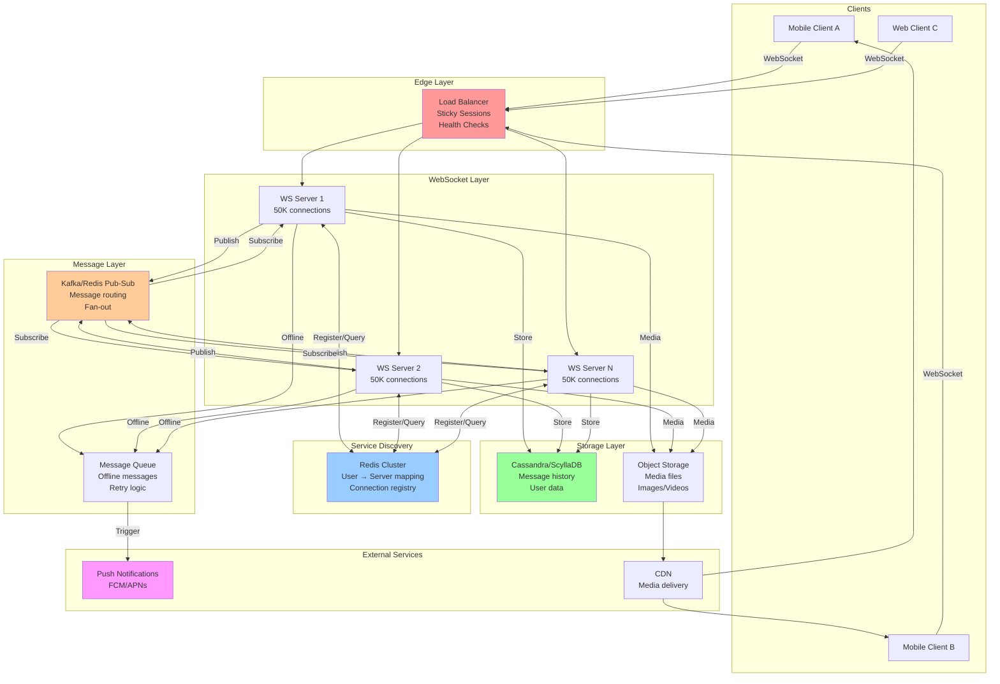

# WhatsApp-Style Chat System: WebSocket Architecture

This is a **classic system design interview question**. Let me break down how real-time chat systems work at scale.

---

## **High-Level Architecture Overview**

```
User A (Mobile)                    User B (Mobile)
    ↓                                   ↓
WebSocket Connection              WebSocket Connection
    ↓                                   ↓
Load Balancer (L4/L7)            Load Balancer (L4/L7)
    ↓                                   ↓
WebSocket Server 1               WebSocket Server 3
    ↓                    ↓              ↓
         Message Queue/Pub-Sub
              (Redis/Kafka)
                   ↓
         Persistent Storage
         (Cassandra/ScyllaDB)
```

---

## **Key Concepts & Components**

### **1. WebSocket Connection Management**

**Problem:** How do you maintain millions of persistent connections?

**Solution: Connection Pooling & Sticky Sessions**

```
Client connects → Load Balancer → Assigns to WS Server
                                 → Maintains "sticky session"
                                 → Maps UserID → ServerID
```

**Key concepts:**
- **Sticky sessions**: Once connected, user stays on same server
- **Connection registry**: Track which user is on which server
- **Heartbeat/Keep-alive**: Detect dead connections
- **Graceful reconnection**: Handle network interruptions

**Data structure:**
```python
# In-memory store (Redis)
{
    "user:123": {
        "server_id": "ws-server-5",
        "connection_id": "conn-abc-xyz",
        "last_seen": 1728484500,
        "device_id": "mobile-123"
    }
}
```

---

### **2. Message Delivery Flow**

**Scenario: User A sends message to User B**

```
Step 1: User A → WS Server 1
Step 2: WS Server 1 validates & persists message
Step 3: WS Server 1 publishes to Message Queue
Step 4: Check: Is User B online?
        Yes → Route to User B's WS Server
        No → Store for later delivery
Step 5: User B's WS Server → Pushes to User B
Step 6: User B sends ACK
Step 7: Update delivery status
```

**Interview talking points:**
- **At-least-once delivery**: Messages may be duplicated
- **Idempotency**: Use message IDs to deduplicate
- **Acknowledgments**: Three states - Sent, Delivered, Read

---

### **3. Service Discovery & Routing**

**Problem:** Server 1 has User A's connection, Server 5 has User B's. How does message route?

**Solution 1: Central Registry (Redis/etcd)**

```python
# When user connects
redis.hset("user:456", "server", "ws-server-5")

# When routing message
target_server = redis.hget("user:456", "server")
if target_server:
    route_to_server(target_server, message)
else:
    queue_for_offline_delivery(message)
```

**Solution 2: Pub/Sub Pattern**

```python
# All WS servers subscribe to user channels
ws_server_5.subscribe("user:456:messages")

# Any server can publish
publisher.publish("user:456:messages", message_data)

# Only the server with active connection delivers
```

**Interview insight:** WhatsApp uses a **hybrid approach** - registry for routing + pub/sub for real-time delivery.

---

### **4. Handling Offline Users**

**Problem:** User B is offline when message arrives.

**Solution: Message Queue + Push Notifications**

```
1. Store message in persistent queue
   └─ Cassandra/ScyllaDB with user_id as partition key

2. Send push notification
   └─ FCM (Android) / APNs (iOS)

3. When user comes online:
   └─ Fetch pending messages from queue
   └─ Deliver over WebSocket
   └─ Clear from queue after ACK
```

**Data model:**
```python
{
    "message_id": "msg-123",
    "from": "user:123",
    "to": "user:456",
    "content": "Hello!",
    "timestamp": 1728484500,
    "status": "pending",  # pending → delivered → read
    "retry_count": 0
}
```

---

### **5. Message Acknowledgment System**

**Three-way handshake for reliability:**

```
Client A                WS Server              Client B
   |                        |                     |
   |---(1) Send Message---->|                     |
   |<--(2) Server ACK-------|                     |
   |                        |---(3) Deliver------>|
   |                        |<--(4) Client ACK----|
   |<--(5) Delivery Confirm-|                     |
```

**States:**
- ✓ Single tick: Sent to server
- ✓✓ Double tick: Delivered to recipient
- ✓✓ Blue tick: Read by recipient

**Interview key point:** 
- **Idempotent delivery**: Use unique message IDs
- **Timeout & retry**: If no ACK in 5s, retry
- **Exponential backoff**: 5s, 10s, 20s, ...

---

### **6. Connection Health & Recovery**

**Heartbeat Mechanism:**

```javascript
// Client-side
setInterval(() => {
    ws.send(JSON.stringify({ type: 'ping' }));
}, 30000); // Every 30 seconds

// Server-side
if (time_since_last_ping > 60) {
    close_connection();
    cleanup_resources();
}
```

**Reconnection Strategy:**

```javascript
function connect() {
    ws = new WebSocket(url);
    
    ws.onclose = () => {
        // Exponential backoff
        setTimeout(connect, backoff_time);
        backoff_time = Math.min(backoff_time * 2, MAX_BACKOFF);
    };
    
    ws.onopen = () => {
        backoff_time = INITIAL_BACKOFF;
        // Fetch missed messages
        fetchPendingMessages();
    };
}
```

**Interview talking point:** Handle network switches (WiFi → Cellular) gracefully.

---

### **7. Load Balancing Strategy**

**Layer 4 (TCP) vs Layer 7 (HTTP) Load Balancing:**

```
                    Internet
                       ↓
              Layer 4 LB (HAProxy/NLB)
              (TCP-level, sticky sessions)
                       ↓
        ┌──────────────┼──────────────┐
        ↓              ↓              ↓
   WS Server 1    WS Server 2    WS Server 3
```

**Sticky Session Strategies:**

1. **Source IP hashing**: Same IP → Same server
   - Problem: NAT, proxy servers
   
2. **Cookie-based**: HTTP upgrade includes cookie
   - Better for L7 load balancing
   
3. **Consistent hashing**: `hash(user_id) % num_servers`
   - Better distribution, handles server additions

**Interview insight:** WhatsApp uses **consistent hashing** with virtual nodes for even distribution.

---

### **8. Scaling Strategies**

**Horizontal Scaling:**

```
10K users → 1 server
100K users → 10 servers
1M users → 100 servers
10M users → 1000 servers
```

**Per-server capacity:**
- Modern servers: 50K-100K concurrent WebSocket connections
- Memory: ~10KB per connection
- CPU: Minimal for idle connections

**Sharding Strategy:**

```python
# Shard by user_id
shard = hash(user_id) % NUM_SHARDS

# Shard by conversation_id (for group chats)
shard = hash(conversation_id) % NUM_SHARDS
```

---

### **9. Group Chat Handling**

**Problem:** Send message to 1000 members efficiently.

**Solution: Fan-out pattern**

```
User A sends message to Group (1000 members)
    ↓
Message Queue (Single message)
    ↓
Fan-out Service
    ↓
┌─────┬─────┬─────┬─────────┐
↓     ↓     ↓     ↓         ↓
100   200   300   ...    1000 members
(online)              (offline)
```

**Optimization:**
- **Write amplification**: Store once, deliver many times
- **Batching**: Group deliveries to same server
- **Priority queue**: VIP users get messages first
- **Rate limiting**: Don't overwhelm servers

**Data structure:**
```python
{
    "group_id": "group-456",
    "members": ["user:1", "user:2", ..., "user:1000"],
    "message_id": "msg-789",
    "delivery_status": {
        "user:1": "delivered",
        "user:2": "pending",
        ...
    }
}
```

---

### **10. Message Ordering & Consistency**

**Problem:** Messages arrive out of order due to network latency.

**Solution: Sequence numbers + Vector clocks**

```python
{
    "message_id": "msg-123",
    "sequence": 42,  # Server assigns monotonic sequence
    "client_timestamp": 1728484500,
    "server_timestamp": 1728484501,
    "previous_message_id": "msg-122"  # Forms a chain
}
```

**Client-side sorting:**
```javascript
messages.sort((a, b) => {
    if (a.sequence !== b.sequence) {
        return a.sequence - b.sequence;
    }
    return a.server_timestamp - b.server_timestamp;
});
```

**Interview key point:** Use **Lamport clocks** or **vector clocks** for distributed message ordering.

---

### **11. End-to-End Encryption (E2EE)**

**Signal Protocol (used by WhatsApp):**

```
Client A                  Server               Client B
   |                         |                     |
   |--Encrypted Message----->|                     |
   |  (Server can't decrypt) |                     |
   |                         |---Forward---------->|
   |                         |                     |
   |                         |    (Only B can decrypt)
```

**Key concepts:**
- **Double Ratchet Algorithm**: Forward secrecy
- **Server is dumb pipe**: Just routes encrypted blobs
- **Key exchange**: X3DH (Extended Triple Diffie-Hellman)

**Interview note:** Server doesn't read content, just routes messages. Metadata still visible (who talks to whom, when).

---

### **12. Fault Tolerance & Reliability**

**Single Point of Failure Prevention:**

```
Component              Redundancy Strategy
────────────────────────────────────────────
Load Balancer          Active-Passive pair (Keepalived)
WebSocket Servers      Stateless, auto-scaling
Message Queue          Kafka/Redis Cluster (replicated)
Database               Cassandra (multi-master replication)
Service Discovery      etcd/Consul (Raft consensus)
```

**Failure scenarios & handling:**

1. **WS Server crashes**
   - Client detects disconnection
   - Reconnects to different server
   - Fetches missed messages

2. **Message Queue fails**
   - Messages buffered in WS server memory
   - Retry with exponential backoff
   - Circuit breaker prevents cascade

3. **Database unavailable**
   - Serve from cache (Redis)
   - Queue writes for later
   - Eventual consistency acceptable

---

### **13. Monitoring & Observability**

**Key Metrics:**

```python
# Real-time metrics
- active_connections_per_server
- messages_per_second
- delivery_latency (p50, p95, p99)
- reconnection_rate
- failed_deliveries

# Business metrics
- daily_active_users
- messages_sent_per_user
- average_group_size
```

**Alerting:**
```
if delivery_latency.p99 > 1000ms:
    alert("High message latency")

if reconnection_rate > 10%:
    alert("Connection stability issues")
```

---

## **Complete System Design Diagram**



## **Interview Questions & Answers**

### **Q1: How do you handle a server crash with 50K active connections?**

**Answer:**
```
1. Load balancer detects server failure (health check)
2. Stops routing new connections to failed server
3. Existing connections timeout (30-60 seconds)
4. Clients detect disconnection, trigger reconnection
5. Load balancer routes to healthy servers
6. Clients fetch missed messages from message queue
7. Server comes back → rejoins pool gradually
```

**Key point:** Graceful degradation, not instant failure.

---

### **Q2: How do you ensure message delivery when recipient is offline?**

**Answer:**
```
1. Store message in persistent queue (Cassandra)
   - Partition by recipient user_id
   - TTL: 30 days (configurable)

2. Send push notification immediately
   - Title: "New message from Alice"
   - Silent push if app in background

3. When user comes online:
   - Fetch pending messages (paginated)
   - Deliver over WebSocket
   - Mark as delivered
   - Send ACK to sender

4. Retry logic:
   - Exponential backoff: 1s, 2s, 4s, 8s...
   - Max retries: 10
   - DLQ (Dead Letter Queue) for failures
```

---

### **Q3: How do you handle duplicate messages?**

**Answer:**
```python
# Client-side deduplication
received_messages = set()  # In memory cache

def on_message_received(msg):
    if msg.message_id in received_messages:
        return  # Ignore duplicate
    
    received_messages.add(msg.message_id)
    display_message(msg)
    send_acknowledgment(msg.message_id)

# Prune old IDs periodically
if len(received_messages) > 10000:
    # Keep last 5000
    received_messages = set(list(received_messages)[-5000:])
```

**Server-side:** Use idempotency keys, exactly-once semantics in Kafka.

---

### **Q4: How do you scale to 1 billion users?**

**Answer:**

**Vertical scaling limits:**
- Single server: ~100K connections max
- Need: 10,000+ servers for 1B users

**Horizontal scaling strategy:**
```
1. Geographic sharding
   - US East, US West, EU, Asia
   - Users connect to nearest region

2. User ID sharding
   - hash(user_id) % num_shards
   - Consistent hashing for elasticity

3. Auto-scaling
   - Monitor: connections per server
   - Scale up: > 80K connections
   - Scale down: < 20K connections

4. Microservices
   - Connection service (WebSocket)
   - Message service (routing)
   - Storage service (persistence)
   - Notification service (push)
```

**Capacity planning:**
- 1B users, 10% online = 100M connections
- 100K connections/server = 1,000 servers
- Add 50% buffer = 1,500 servers

---

### **Q5: How do you optimize for battery life on mobile?**

**Answer:**
```
1. Adaptive heartbeat
   - WiFi: Every 30s
   - Cellular: Every 60s
   - Low battery: Every 120s

2. Connection batching
   - Buffer small messages
   - Send in batches every 5s
   - Reduces radio wake-ups

3. Push notifications fallback
   - Close WebSocket when app backgrounded
   - Rely on push notifications
   - Reconnect when app opened

4. Compression
   - Use Protocol Buffers (smaller than JSON)
   - Reduces data transfer

5. Smart reconnection
   - Don't reconnect immediately on failure
   - Wait for user interaction
   - Exponential backoff
```

---

## **Technology Stack (WhatsApp-like)**

```
Protocol:           WebSocket (WSS), XMPP variant
Load Balancer:      HAProxy, AWS NLB
WebSocket Server:   Erlang (WhatsApp), Node.js, Go
Message Queue:      Kafka, Redis Pub/Sub
Service Discovery:  etcd, Consul, Redis
Database:           Cassandra, ScyllaDB
Cache:              Redis Cluster
Object Storage:     S3, MinIO
Monitoring:         Prometheus, Grafana
Encryption:         Signal Protocol (E2EE)
Push:               FCM (Android), APNs (iOS)
```

---

## **Key Interview Takeaways**

### **Core Concepts to Mention:**

1. ✅ **Sticky sessions** - Keep user on same server
2. ✅ **Connection registry** - Track user → server mapping
3. ✅ **Pub/Sub pattern** - Route messages between servers
4. ✅ **Message acknowledgments** - Ensure delivery
5. ✅ **Offline queuing** - Store messages for offline users
6. ✅ **Idempotency** - Handle duplicate messages
7. ✅ **Heartbeat mechanism** - Detect dead connections
8. ✅ **Graceful reconnection** - Handle network switches
9. ✅ **Horizontal scaling** - Stateless servers
10. ✅ **End-to-end encryption** - Security & privacy

### **What Interviewers Look For:**

- 🎯 **Trade-offs**: Consistency vs availability vs latency
- 🎯 **Failure handling**: What happens when X fails?
- 🎯 **Scale considerations**: How does this work at 1B users?
- 🎯 **Real-world constraints**: Battery, bandwidth, latency
- 🎯 **Monitoring**: How do you know it's working?

### **Red Flags to Avoid:**

- ❌ "Just use polling" - Terrible for real-time at scale
- ❌ "Store everything in memory" - What about crashes?
- ❌ "Single server" - No fault tolerance
- ❌ "No acknowledgments" - Messages will be lost
- ❌ "Synchronous delivery" - Doesn't scale

---

## **Practice Questions for Interview**

1. How would you implement read receipts?
2. How do you handle group chat with 10,000 members?
3. What happens if the database is down?
4. How do you implement typing indicators?
5. How do you handle message editing/deletion?
6. How do you implement voice/video calls?
7. How do you handle spam and abuse?
8. How do you optimize for 2G networks?

This covers the **core concepts, trade-offs, and thinking process** you need for a WhatsApp-style system design interview! 🚀